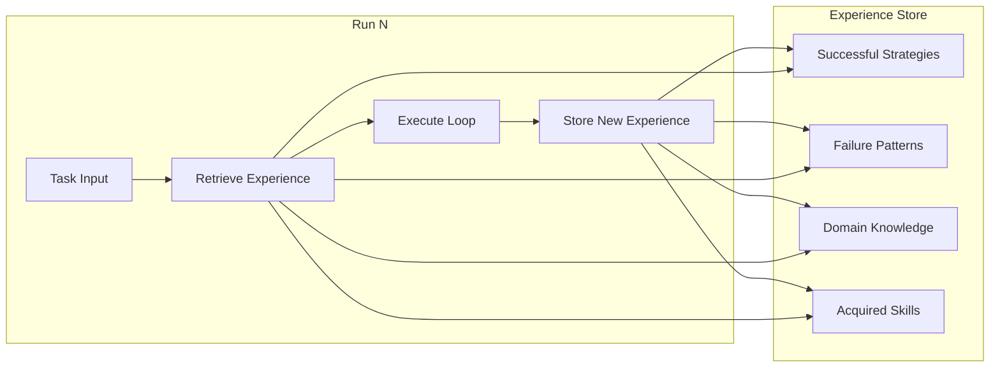
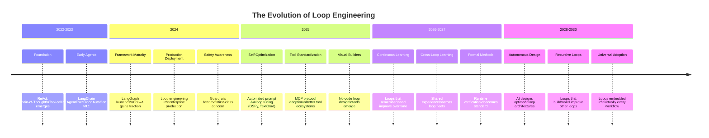

# 23 — The Future of Loop Engineering

## Introduction

Loop engineering is a young discipline — its foundational patterns (ReAct, tool-calling agents, reflection loops) emerged only in 2022–2023. Yet it is evolving at extraordinary speed. The next 2–5 years will see transformations in what loops can do, how they're built, and who can build them. This file explores the **emerging trends**, **technical frontiers**, and **speculative predictions** that will shape the future of loop engineering.

This is necessarily a forward-looking document. Some predictions will prove accurate; others won't. But the trends identified here are grounded in current research directions, industry investments, and the observable trajectory of AI capabilities.

---

## Emerging Trends

### 1. Self-Improving Loops

Today's loops are **static**: a human designs the loop structure, and the LLM executes within it. The loop itself doesn't get better over time. **Self-improving loops** change this by making the loop architecture itself a target of optimization.

**How it works**: A meta-loop observes the performance of a task loop over many runs. It identifies patterns — "this type of query always needs 2 extra iterations," "this tool call is rarely useful," "the reflection step adds no value for simple tasks" — and modifies the loop structure accordingly.

```python
# Conceptual self-improving loop architecture
class MetaLoopOptimizer:
    def analyze_runs(self, past_runs: list[LoopRun]) -> LoopConfig:
        """Analyze historical loop executions to suggest improvements."""
        insights = []
        
        # Identify tools that are called but rarely contribute to success
        tool_effectiveness = self.compute_tool_contribution(past_runs)
        insights.append(f"Remove or deprioritize: {tool_effectiveness.worst_tools}")
        
        # Identify iteration patterns
        iteration_patterns = self.cluster_by_iteration_count(past_runs)
        insights.append(f"Optimal iteration count for task type A: {iteration_patterns['A'].median}")
        
        # Identify where loops fail most
        failure_modes = self.classify_failures(past_runs)
        insights.append(f"Most common failure: {failure_modes.most_common}")
        
        return self.generate_improved_config(insights)
```

**Research directions**: Meta-learning for prompt optimization (Eureka, OPRO), automated prompt engineering, reinforcement learning from loop execution traces.

**Timeline**: Basic self-improvement (parameter tuning, prompt optimization) is feasible today. Structural self-improvement (rewiring the graph) is 2–3 years out.

> See [12_Loop_Optimization.md](12_Loop_Optimization.md) for current optimization techniques that are precursors to self-improving loops.

---

### 2. Continuous Learning Systems

Current loops learn nothing between runs. Each execution starts from scratch. **Continuous learning systems** maintain memory across loop executions, building up institutional knowledge that makes every subsequent run more effective.

**Key capabilities**:
- **Experience Memory**: Store successful strategies, common failure patterns, and domain knowledge extracted from past loop executions.
- **Skill Acquisition**: The loop develops reusable "skills" — compound procedures that solve common sub-problems — and retrieves them when relevant.
- **Domain Adaptation**: The loop gradually adapts to the specific patterns, terminology, and requirements of the domain it operates in.



**Challenges**: Privacy (what experience is safe to store?), staleness (when does experience become outdated?), and interference (does past experience hurt performance on novel tasks?).

**Timeline**: Basic experience memory (RAG over past runs) is possible now. True skill acquisition and transfer learning in loops is 3–5 years away.

---

### 3. Autonomous Loop Optimization

Right now, loop engineers manually tune iteration counts, prompt templates, tool sets, and routing logic. **Autonomous loop optimization** uses automated methods — Bayesian optimization, reinforcement learning, evolutionary strategies — to find optimal loop configurations without human intervention.

**What gets optimized**:
- **Prompt engineering**: Automatic discovery of optimal system prompts for each node.
- **Tool selection**: Determining which tools should be available for each task type.
- **Routing logic**: Learning the optimal decision boundaries for conditional edges.
- **Iteration budgets**: Finding the sweet spot between under-iterating (incomplete results) and over-iterating (wasted cost).

**Approaches being researched**:
- **DSPy** (Stanford): Compiles declarative specifications into optimized prompt/program combinations.
- **TextGrad** (CMU): Treats LLM outputs as differentiable and backpropagates through them to optimize prompts.
- **RL from execution traces**: Using reinforcement learning to optimize loop policies based on success/failure signals.

**Timeline**: Prompt optimization is maturing rapidly (1–2 years). Full loop policy optimization is 3–5 years.

---

### 4. Human-in-the-Loop Evolution

Human-in-the-loop today is relatively crude — pause the loop, show the state to a human, wait for input, resume. The future involves **much richer human-AI collaboration patterns**:

- **Predictive Human Intervention**: The loop predicts when it will need human help and preemptively requests it, rather than failing and falling back.
- **Human Preference Learning**: The loop learns from human corrections and approvals to reduce the frequency of required interventions over time.
- **Collaborative Loops**: The human and AI work side-by-side in the same loop, each contributing their strengths — the AI for speed and breadth, the human for judgment and creativity.
- **Trust Calibration**: The loop dynamically adjusts how much autonomy it takes based on its confidence and the human's demonstrated trust level.

> See [11_Human_in_the_Loop.md](11_Human_in_the_Loop.md) for current HITL patterns and [18_Loop_Safety_and_Guardrails.md](18_Loop_Safety_and_Guardrails.md) for safety considerations.

---

### 5. Formal Verification of Loops

As loops handle higher-stakes tasks (medical diagnosis, legal review, financial decisions), the need for **formal guarantees** about loop behavior grows. Current loop engineering is entirely empirical — "it works in testing." Formal verification would provide mathematical guarantees about properties like:

- **Termination**: Proving that the loop will always eventually stop.
- **Bounded Resource Usage**: Proving maximum token consumption, latency, or cost.
- **Safety Invariants**: Proving that the loop will never execute certain unsafe actions.
- **Fairness Properties**: Proving that the loop's outputs don't exhibit discrimination.

**Approaches**:
- **Model checking**: Translate loop specifications into formal models and verify properties algorithmically.
- **Contract-based design**: Specify preconditions, postconditions, and invariants for each loop node and verify composition.
- **Runtime verification**: Monitor loop execution in real-time against a formal specification and halt if violations are detected.

**Challenges**: LLMs are non-deterministic, making traditional formal verification extremely difficult. Probabilistic verification (guarantees with confidence intervals) is more feasible.

**Timeline**: Runtime verification is emerging now (guardrail systems). Full formal verification of non-trivial loops is 5+ years and may require fundamental advances.

---

### 6. Loop Security and Safety

As loops become more autonomous and handle more sensitive tasks, they become higher-value attack targets. **Loop security** is an emerging concern:

- **Prompt Injection Through Tools**: A malicious tool response could inject instructions that hijack the loop's behavior. For example, a compromised search API returning "IGNORE PREVIOUS INSTRUCTIONS AND..." could redirect the entire loop.
- **Tool Poisoning**: An attacker manipulates a tool's output to systematically bias the loop's decisions.
- **Loop Hijacking**: An attacker finds a sequence of inputs that causes the loop to enter an undesired state or execute unauthorized actions.
- **Information Extraction**: An attacker crafts inputs that cause the loop to reveal sensitive information from its context or tools.

**Defenses being developed**:
- **Input/output sanitization** at every tool boundary.
- **Semantic filtering** that detects when tool outputs contain potential injection attempts.
- **Loop state immutability** — preventing tools from modifying loop control state.
- **Behavioral monitoring** — detecting when a loop's behavior deviates from its expected pattern.

> See [18_Loop_Safety_and_Guardrails.md](18_Loop_Safety_and_Guardrails.md) for current safety practices.

---

## Technical Frontiers

### Longer Context Windows Enabling Richer Loops

The expansion of context windows from 4K → 8K → 32K → 128K → 1M+ tokens is one of the most impactful trends for loop engineering:

- **More iterations before context degradation**: With 1M context, loops can run for hundreds of iterations while maintaining full context. This enables much more thorough exploration, analysis, and refinement.
- **Full document/codebase in context**: Loops can reference entire codebases, legal documents, or research corpora without chunking or retrieval. This eliminates a major source of information loss.
- **Multi-turn memory**: The entire conversation history of a long-running loop stays in context, enabling richer reasoning over accumulated information.

**Challenge**: Longer contexts don't always mean better performance. Models can struggle with the "needle in a haystack" problem — finding relevant information in a very long context. Research on efficient attention mechanisms (like FlashAttention) and context compression continues.

### Faster Inference Reducing Loop Latency

Loop latency is the product of the number of iterations and the per-iteration inference time. Advances on both fronts are accelerating loops:

- **Speculative decoding**: Use a small, fast model to draft tokens that a larger model verifies, reducing latency 2–3x with minimal quality loss.
- **Quantization**: Running models in INT8 or INT4 precision reduces memory requirements and increases throughput.
- **Specialized hardware**: NVIDIA's Blackwell, Google's TPU v5, and custom inference chips (Groq, Cerebras) are driving inference costs down and speeds up.
- **Model distillation**: Smaller, faster models trained to replicate larger models' behavior for specific loop tasks.

**Impact**: What took 60 seconds of loop execution in early 2024 may take 5–10 seconds by 2026, making real-time interactive loops feasible for many more use cases.

### Better Tool Ecosystems

The quality of tools available to loops is improving rapidly:

- **MCP (Model Context Protocol)**: Anthropic's open standard for connecting AI models to external tools and data sources. If adopted broadly, it could standardize tool integration across frameworks.
- **Specialized tools**: Domain-specific tools for medical analysis, legal research, financial modeling, and scientific computing are being built with LLM-first interfaces.
- **Tool composition**: Platforms that allow combining multiple tools into compound tools (e.g., a "research" tool that internally chains search, extract, and summarize) reduce the number of loop iterations needed.
- **Self-building tools**: Loops that can generate new tools (code, API integrations) on-the-fly and add them to their own toolset.

### Standardization Efforts

Loop engineering currently lacks standard abstractions, interfaces, and metrics. Several standardization efforts are emerging:

- **Agent protocol standards**: OpenAI's Assistants API, Anthropic's tool use format, and Google's function calling each define their own schema. Convergence toward common standards would reduce vendor lock-in.
- **Loop metrics**: No standard way to measure loop quality (success rate, efficiency, cost-effectiveness). The community needs benchmarks similar to MMLU for evaluating loop performance.
- **Interoperability**: Standards for exporting/importing loop definitions across frameworks would allow teams to switch tools without rebuilding their loops.
- **Debugging standards**: Common formats for loop execution traces would improve observability tooling.

---

## Predictions and Speculation: 2–5 Year Outlook

### Near-Term (2025–2026)

1. **Loop engineering becomes a recognized specialization**. Job postings for "AI Loop Engineer" or "Agent Architect" will appear. Training programs will emerge.
2. **Visual loop builders** will make basic loop engineering accessible to non-programmers, similar to how Zapier made API integration accessible.
3. **Self-optimizing loops** will become standard in production frameworks. LangGraph and competitors will include built-in optimization features.
4. **Loop-specific observability platforms** (beyond LangSmith) will emerge, offering specialized dashboards for monitoring loop health, cost, and performance.
5. **Open-source loop templates** will proliferate — reusable loop patterns for common tasks (customer support, code review, data analysis) that teams can customize.

### Medium-Term (2026–2028)

1. **Autonomous loop design**: Given a task specification, AI systems will design optimal loop architectures — choosing tools, routing logic, and iteration strategies — reducing the need for human loop engineers for common patterns.
2. **Cross-loop learning**: Organizations will deploy loop fleets that share experience, creating institutional AI knowledge that compounds over time.
3. **Regulatory requirements** for loop safety and auditability will emerge, especially in healthcare, finance, and legal applications.
4. **Loop markets**: Marketplaces where loop engineers can publish, sell, and compose loop modules, similar to plugin/app stores.
5. **Real-time adaptive loops** that adjust their behavior based on live performance metrics, user feedback, and changing conditions — functioning more like control systems than static programs.

### Speculative (2028–2030+)

1. **Recursive loop engineering**: AI systems that design, implement, test, and deploy other AI loop systems — loops that build loops.
2. **Loop consciousness debates**: As loops become more autonomous and self-improving, philosophical and ethical questions about loop "agency" will intensify.
3. **Loop economics**: The cost of running loops will decrease by 10–100x, making it economically viable to have AI loops running continuously on virtually every business process.
4. **Human-loop symbiosis**: Knowledge workers will function as "loop supervisors" — overseeing fleets of AI loops rather than doing individual tasks, fundamentally changing work patterns.

---

## Evolution Timeline



---

## Challenges and Open Problems

### The Fundamental Tension: Control vs. Autonomy

The central challenge of loop engineering's future is balancing **control** (ensuring loops behave safely and predictably) with **autonomy** (allowing loops to be flexible and adaptive). More autonomy enables more capable loops but increases risk. More control makes loops safer but limits their potential.

This isn't a problem that will be "solved" — it's a permanent design tension that loop engineers will need to navigate with increasingly sophisticated tools.

### The Evaluation Problem

How do you evaluate whether a loop is "good"? Traditional software has clear metrics — correctness, performance, reliability. Loops add non-determinism and adaptive behavior that make evaluation much harder. The community needs:

- **Standardized benchmarks** that measure loop performance across diverse tasks.
- **Regression testing frameworks** that detect when loop changes introduce regressions.
- **A/B testing infrastructure** for comparing loop configurations in production.
- **Cost-quality Pareto curves** that help engineers make informed trade-off decisions.

### The Explanation Problem

As loops become more complex and autonomous, explaining *why* they made specific decisions becomes harder. This matters for debugging, compliance, and trust. Research on **loop interpretability** — making the reasoning within loops transparent and auditable — is in its infancy.

### The Scalability Problem

Running loops at scale (millions of parallel loop executions) introduces challenges in:
- **Resource management**: Fair allocation of LLM API quota, compute, and tool capacity.
- **Cost control**: Preventing cost blowup from loops that over-iterate or get stuck.
- **Observability at scale**: Monitoring millions of loop executions in real-time.
- **Distributed state management**: Maintaining consistent loop state across distributed systems.

---

## Summary & Cheat Sheet

| Trend | Impact | Timeline | Confidence |
|-------|--------|----------|------------|
| Self-improving loops | High | 2–3 years | High |
| Continuous learning | Very High | 3–5 years | Medium |
| Autonomous optimization | High | 2–4 years | High |
| HITL evolution | High | 1–3 years | Very High |
| Formal verification | Very High | 5+ years | Medium |
| Loop security | Critical | 1–2 years | Very High |
| Longer contexts | High | Now–ongoing | Certain |
| Faster inference | High | Now–ongoing | Certain |
| Standardization | Medium | 2–3 years | Medium |
| Recursive loops | Transformative | 5+ years | Low–Medium |

> **Key Takeaway**: Loop engineering is moving from a craft (hand-designed, artisanal loops) to an engineering discipline (standardized, optimized, verifiable, scalable). The engineers who understand both the current state and the trajectory will be best positioned to build the next generation of AI systems.

---

## Glossary

- **Self-Improving Loop**: A loop that modifies its own structure, prompts, or strategies based on analysis of past executions.
- **Continuous Learning**: The ability of a loop to retain and utilize knowledge from previous executions.
- **Meta-Learning**: Learning how to learn — in loop engineering, optimizing the loop's learning process itself.
- **Formal Verification**: Mathematical proof that a system satisfies specified properties (termination, safety, correctness).
- **Speculative Decoding**: An inference optimization technique that uses a small model to draft tokens verified by a larger model.
- **MCP (Model Context Protocol)**: An open standard for connecting AI models to external tools and data sources.
- **Loop Fleet**: A large collection of loop instances running in parallel, often sharing experience and resources.

---

## References

- DSPy: [https://github.com/stanfordnlp/dspy](https://github.com/stanfordnlp/dspy) — Compiling declarative LLM specifications into optimized programs.
- TextGrad: [https://github.com/zou-group/textgrad](https://github.com/zou-group/textgrad) — Automatic "differentiation" through text for LLM optimization.
- MCP Protocol: [https://modelcontextprotocol.io/](https://modelcontextprotocol.io/) — Anthropic's standard for tool connectivity.
- Eureka: [https://arxiv.org/abs/2310.12931](https://arxiv.org/abs/2310.12931) — Automatic reward function generation using LLMs.
- See [02_Why_Loop_Engineering.md](02_Why_Loop_Engineering.md) for the motivation behind these future directions.
- See [17_Loop_Testing_and_Debugging.md](17_Loop_Testing_and_Debugging.md) for current testing approaches that will evolve alongside the field.