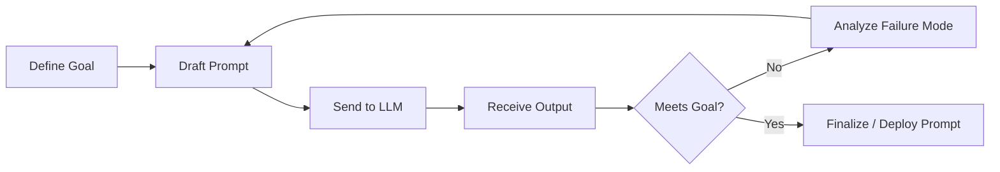
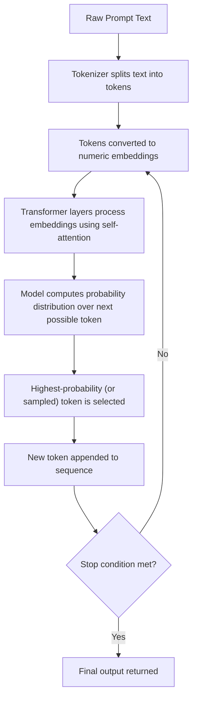

# 01 — What is Prompt Engineering?

> **Series:** Prompt Engineering Knowledge Library
> **File 1 of 10** | **Level:** Beginner → Advanced
> **Prerequisites:** None (start here)
> **Next:** [`02_How_Large_Language_Models_Work.md`](./02_How_Large_Language_Models_Work.md)

---

## Table of Contents

1. [Definition](#definition)
2. [Why It Matters](#why-it-matters)
3. [Core Concepts](#core-concepts)
4. [How It Works](#how-it-works)
5. [Internal Mechanism](#internal-mechanism)
6. [Types of Prompt Engineering](#types-of-prompt-engineering)
7. [Syntax / Structure](#syntax--structure)
8. [Examples (Simple → Advanced)](#examples-simple--advanced)
9. [Best Practices](#best-practices)
10. [Common Mistakes](#common-mistakes)
11. [Real-World Applications](#real-world-applications)
12. [Comparison with Related Concepts](#comparison-with-related-concepts)
13. [Advantages & Limitations](#advantages--limitations)
14. [FAQs](#faqs)
15. [Summary](#summary)
16. [Cheat Sheet](#cheat-sheet)
17. [Glossary](#glossary)
18. [References](#references)

---

## Definition

**Prompt Engineering** is the practice of designing, structuring, and refining the text input (called a **prompt**) given to a **Large Language Model (LLM)** in order to reliably produce a desired output.

> **Large Language Model (LLM):** An AI system trained on massive amounts of text that can understand and generate human-like language. Examples include GPT-4, Claude, and Gemini. LLMs are explained fully in [File 2](./02_How_Large_Language_Models_Work.md).

Formally:

```
Prompt Engineering = f(Instruction, Context, Constraints, Examples, Format)
                      → Optimized Output
```

In plain terms: an LLM does not "know" what you want — it predicts the most statistically likely continuation of the text you give it. Prompt engineering is the discipline of shaping that input text so the model's prediction lines up with your actual intent, as consistently and accurately as possible.

It sits at the intersection of four fields:

| Field | Contribution to Prompt Engineering |
|---|---|
| **Linguistics** | Precise wording, phrasing, disambiguation |
| **Software Engineering** | Structured, testable, versioned prompt design |
| **Cognitive Science** | Understanding how models "reason" via pattern completion |
| **Human-Computer Interaction (HCI)** | Designing inputs that produce usable, predictable outputs |

---

## Why It Matters

LLMs are **general-purpose** — the same base model can write code, summarize documents, translate languages, or role-play a customer support agent. What determines *which* of these it does — and how well — is almost entirely the prompt.

### The core problem prompt engineering solves

An LLM has no persistent memory of your goals, no access to your unstated assumptions, and no way to ask "what do you actually mean?" unless you design it to. Two prompts that look similar to a human can produce wildly different outputs:

| Prompt | Likely Output Quality |
|---|---|
| `"Write about dogs"` | Vague, generic, unpredictable length/tone |
| `"Write a 150-word, upbeat blog intro about why Golden Retrievers make good family pets, aimed at first-time dog owners"` | Specific, consistent, usable |

The difference in output quality between these two is **not** a difference in the model's capability — it's a difference in the *specification* given to the model. This is the central insight of prompt engineering: **capability is latent, specification unlocks it.**

### Business and engineering impact

- **Cost:** Vague prompts often require multiple retries, wasting compute (measured in [tokens](./03_Tokens.md)) and money.
- **Reliability:** Production AI systems (chatbots, agents, RAG pipelines) need *consistent* structured output — a single ambiguous prompt can break downstream code parsing JSON from the model.
- **Safety:** Well-engineered prompts reduce hallucination, bias leakage, and unwanted behavior.
- **Speed to market:** Prompt engineering is often faster and cheaper than fine-tuning a model for a new task.

---

## Core Concepts

Before going further, here are the foundational terms used throughout this file (and the rest of the series). Each is covered in depth in its own dedicated file.

| Concept | One-Line Definition | Covered In |
|---|---|---|
| **Token** | A chunk of text (word/sub-word) the model processes as one unit | [File 3](./03_Tokens.md) |
| **Tokenization** | The process of converting text into tokens | [File 4](./04_Tokenization.md) |
| **Context Window** | The maximum amount of text (in tokens) a model can "see" at once | [File 5](./05_Context_Window.md) |
| **Context Management** | Strategies to fit relevant info inside the context window | [File 6](./06_Context_Management.md) |
| **Prompt Anatomy** | The structural parts that make up a well-formed prompt | [File 7](./07_Prompt_Anatomy.md) |
| **Prompt Lifecycle** | The end-to-end journey of a prompt from draft to production | [File 8](./08_Prompt_Lifecycle.md) |
| **Design Principles** | Rules of thumb for writing effective prompts | [File 9](./09_Prompt_Design_Principles.md) |
| **Prompt Patterns** | Reusable, named templates for solving common prompting problems | [File 10](./10_Prompt_Patterns.md) |

### Additional core concepts specific to this file

- **Instruction:** The explicit task directive (e.g., "Summarize the following text").
- **Context:** Background information the model needs (e.g., a document, prior conversation, a persona).
- **Constraint:** A boundary on the output (e.g., "in under 100 words," "as valid JSON only").
- **Few-shot example:** A demonstration of input→output pairs included in the prompt to guide style/format.
- **Zero-shot prompting:** Asking the model to perform a task with no examples, relying only on instructions.
- **Temperature:** A generation parameter controlling output randomness (low = deterministic, high = creative). Not part of the prompt text itself, but closely tied to prompt design.
- **System prompt:** A special instruction channel (separate from user messages) that sets persistent behavior/persona for the whole conversation.

---

## How It Works

At the highest level, prompt engineering works through a feedback loop between a human (or automated system) and a model:



Each iteration of this loop refines one or more of the prompt's components:

1. **Clarify intent** — What exactly should the output look like?
2. **Supply context** — What does the model need to know that it can't infer?
3. **Specify format** — Should the output be prose, a list, JSON, code?
4. **Add constraints** — Length, tone, forbidden content, style.
5. **Add examples (if needed)** — Show, don't just tell, when format matters.
6. **Test against edge cases** — Does the prompt still work with unusual inputs?

This loop is formalized later as the **Prompt Lifecycle** ([File 8](./08_Prompt_Lifecycle.md)).

---

## Internal Mechanism

To understand *why* prompt wording changes output quality, you need a simplified mental model of what happens inside the LLM when it receives a prompt. (Full detail in [File 2](./02_How_Large_Language_Models_Work.md).)



The key mechanical insight: **every word you add or remove from a prompt changes the numeric context the model uses to compute its very next prediction.** There is no separate "understanding" step — the model's entire "comprehension" of your intent *is* this statistical conditioning process. This is why:

- Ambiguous wording → ambiguous probability distribution → unpredictable output.
- Precise wording + structure + examples → sharply peaked probability distribution → consistent output.
- Reordering information in a prompt can change output, because attention weighting is influenced by position (see [Context Window](./05_Context_Window.md) for more on positional effects).

---

## Types of Prompt Engineering

Prompt engineering is not one technique — it's an umbrella term covering several distinct approaches, often combined together.

| Type | Description | Typical Use Case |
|---|---|---|
| **Zero-Shot Prompting** | Ask the model to do a task with instructions only, no examples | Simple, well-known tasks (translation, summarization) |
| **Few-Shot Prompting** | Provide 1–5 input/output examples before the real task | Tasks needing a specific format or style |
| **Chain-of-Thought (CoT) Prompting** | Instruct the model to reason step-by-step before answering | Math, logic, multi-step reasoning |
| **Role/Persona Prompting** | Assign the model a role ("You are a senior security auditor…") | Domain-specific tone/expertise |
| **Instruction Prompting** | Direct, imperative commands with explicit constraints | Production pipelines, structured output |
| **System Prompting** | Configuring persistent behavior via a system-level message | Chatbots, agents, applications |
| **Retrieval-Augmented Prompting** | Injecting retrieved documents/data into the prompt as context | RAG pipelines, knowledge-grounded QA |
| **Meta-Prompting** | Using a prompt to generate or improve *other* prompts | Prompt optimization, automated tuning |
| **Agentic Prompting** | Prompts that direct a model to plan, use tools, and act autonomously | AI agents, multi-step task execution |
| **Adversarial / Red-Team Prompting** | Crafting prompts to probe model weaknesses or failure modes | Safety testing, robustness evaluation |

A deep breakdown of many of these as reusable templates is provided in [File 10 — Prompt Patterns](./10_Prompt_Patterns.md).

---

## Syntax / Structure

There is no single universal "syntax" for prompts (unlike a programming language), but effective prompts tend to follow a recognizable **structural grammar**. This is explored fully in [File 7 — Prompt Anatomy](./07_Prompt_Anatomy.md). A minimal preview:

```text
[ROLE/PERSONA]     You are an expert technical editor.
[TASK]             Rewrite the following paragraph for clarity.
[CONTEXT]          The audience is first-year computer science students.
[CONSTRAINTS]      Keep it under 80 words. Do not change technical terms.
[INPUT DATA]       "<paragraph to rewrite>"
[OUTPUT FORMAT]    Return only the rewritten paragraph, no preamble.
```

Some ecosystems (like API-based tool use) also use **structured markup**, such as XML-style tags, to clearly delimit sections:

```xml
<role>You are a data analyst.</role>
<task>Summarize the key trend in the sales data below.</task>
<data>
Q1: 120K, Q2: 150K, Q3: 90K, Q4: 200K
</data>
<format>Respond in exactly two sentences.</format>
```

---

## Examples (Simple → Advanced)

### Level 1 — Simple Zero-Shot

```text
Translate "Good morning" into French.
```

**Output:** `Bonjour`

*Why it works:* The task is unambiguous, atomic, and well-represented in training data.

---

### Level 2 — Adding Constraints

```text
Translate "Good morning" into French, Spanish, and Japanese.
Return the result as a Markdown table with two columns: Language, Translation.
```

**Output:**

| Language | Translation |
|---|---|
| French | Bonjour |
| Spanish | Buenos días |
| Japanese | おはようございます |

*Why it works:* Explicit output format removes ambiguity about how results should be structured.

---

### Level 3 — Few-Shot for Style Control

```text
Convert the following casual sentences into formal business English.

Casual: "Hey can you get back to me soon?"
Formal: "Could you please respond at your earliest convenience?"

Casual: "This report has a bunch of mistakes."
Formal: "This report contains several inaccuracies that require correction."

Casual: "I think we should just cancel the meeting."
Formal:
```

**Output:** `"I would recommend that we cancel the meeting."`

*Why it works:* The two examples establish a *pattern* the model completes — this is far more reliable than describing "formal tone" abstractly.

---

### Level 4 — Chain-of-Thought Reasoning

```text
Q: A store had 120 apples. It sold 35% of them in the morning
and 40 more in the afternoon. How many apples are left?

Let's think step by step.
```

**Output:**
```
Step 1: 35% of 120 = 42 apples sold in the morning.
Step 2: Remaining after morning = 120 - 42 = 78.
Step 3: 40 more sold in the afternoon: 78 - 40 = 38.
Answer: 38 apples remain.
```

*Why it works:* "Let's think step by step" triggers the model to generate intermediate reasoning tokens, which measurably improves accuracy on multi-step problems (see [File 10](./10_Prompt_Patterns.md) for the Chain-of-Thought pattern in depth).

---

### Level 5 — Advanced: Structured Agentic Prompt

```text
<role>You are a senior Python code reviewer.</role>

<task>
Review the code below for:
1. Bugs
2. Security issues
3. Performance issues
</task>

<constraints>
- Only report issues with severity >= Medium
- Output valid JSON matching this schema:
  { "issues": [ { "line": int, "severity": string, "description": string } ] }
- Do not include any text outside the JSON object
</constraints>

<code>
def get_user(id):
    query = "SELECT * FROM users WHERE id = " + id
    return db.execute(query)
</code>
```

**Output:**
```json
{
  "issues": [
    {
      "line": 2,
      "severity": "High",
      "description": "SQL injection vulnerability due to unsanitized string concatenation in query."
    }
  ]
}
```

*Why it works:* This combines role assignment, explicit multi-part task, hard constraints, a strict output schema, and clearly delimited input data — the full "anatomy" covered in [File 7](./07_Prompt_Anatomy.md). This is representative of prompts used in production AI coding tools and agent pipelines.

---

## Best Practices

1. **Be explicit, not implicit.** State what you want directly rather than hoping the model infers it.
2. **Specify output format up front.** If you need JSON, say so — and show the schema.
3. **Use examples for style/format-sensitive tasks.** Few-shot examples outperform lengthy descriptions.
4. **Break complex tasks into steps.** Either within one prompt (CoT) or across multiple prompts (chaining).
5. **Set boundaries.** Tell the model what *not* to do (e.g., "do not include a preamble").
6. **Iterate and test.** Treat prompts like code — version them, test against edge cases.
7. **Front-load critical instructions.** Position within the [context window](./05_Context_Window.md) can affect how strongly instructions are weighted.
8. **Separate instructions from data clearly.** Use delimiters (quotes, XML tags, markdown fences) so the model doesn't confuse your instructions with the content it's operating on.

---

## Common Mistakes

| Mistake | Why It Fails | Fix |
|---|---|---|
| **Vague instructions** ("make it better") | No clear success criterion for the model to target | Define exactly what "better" means (tone, length, structure) |
| **No output format specified** | Model guesses format, causing downstream parsing errors | Explicitly state format (JSON, table, list, plain text) |
| **Mixing instructions and data without delimiters** | Model may misinterpret data as instructions (prompt injection risk) | Use clear delimiters: quotes, code fences, XML tags |
| **Overloading a single prompt with too many tasks** | Increases chance of the model dropping or under-performing on sub-tasks | Split into multiple prompts or use explicit numbered sub-tasks |
| **Assuming the model remembers prior turns without context** | Some deployments are stateless per call | Explicitly re-include necessary context each call |
| **Ignoring context window limits** | Content gets silently truncated | See [File 5](./05_Context_Window.md) and [File 6](./06_Context_Management.md) |
| **Testing only "happy path" inputs** | Prompt breaks on edge cases in production | Test with empty input, very long input, adversarial input |

---

## Real-World Applications

- **Customer support chatbots** — system prompts define persona, tone, and escalation rules.
- **Code generation & review tools** (e.g., AI coding assistants) — structured prompts enforce style guides and output schemas.
- **Retrieval-Augmented Generation (RAG) systems** — prompts combine retrieved documents with user queries to ground answers in real data.
- **Content generation pipelines** — marketing copy, SEO articles, social media posts generated at scale with templated prompts.
- **Data extraction & structuring** — converting unstructured text (emails, PDFs, forms) into structured JSON/CSV.
- **AI agents** — prompts direct multi-step planning, tool use, and decision-making (e.g., an agent that books travel by calling APIs).
- **Educational tutoring systems** — prompts adapt explanations to a student's level (exactly like this document's audience!).
- **Automated testing/evaluation** — using one LLM prompt to grade or critique another model's output.

---

## Comparison with Related Concepts

| Concept | Relationship to Prompt Engineering |
|---|---|
| **Fine-Tuning** | Modifies the model's internal weights via additional training; prompt engineering changes only the *input*, leaving weights untouched. Prompt engineering is faster/cheaper; fine-tuning is more durable for deep behavior change. |
| **RAG (Retrieval-Augmented Generation)** | A *system architecture* that uses prompt engineering as one component — retrieved data is injected into a prompt. RAG solves the "model doesn't know this fact" problem; prompt engineering solves the "model doesn't know what I want" problem. |
| **Prompt Design** | Often used interchangeably with prompt engineering, though "design" sometimes emphasizes the creative/UX side, while "engineering" emphasizes systematic, testable, production-grade rigor. |
| **Context Engineering** | A broader emerging discipline covering *everything* fed into a model's context (prompts, retrieved documents, tool outputs, memory) — prompt engineering is a core subset of it. |
| **AI Agent Design** | Uses prompt engineering as a foundational tool, but also involves tool integration, memory systems, and planning loops beyond a single prompt. |

---

## Advantages & Limitations

### ✅ Advantages

- **No retraining required** — instant iteration, no GPU/training cost.
- **Model-agnostic skill** — transferable across GPT, Claude, Gemini, Llama, etc. (with syntax tweaks).
- **Fast experimentation cycle** — test a new idea in seconds.
- **Democratized** — no ML/data science background strictly required to start.
- **Composable** — prompts can be chained, templated, and reused as building blocks.

### ⚠️ Limitations

- **Ceiling effect** — cannot teach a model genuinely new knowledge or capabilities it wasn't trained on (that requires fine-tuning or RAG).
- **Model-dependent behavior** — a prompt optimized for one model may perform differently on another.
- **Non-determinism** — even identical prompts can yield varying outputs due to sampling (temperature > 0).
- **Context window ceiling** — very long context requirements hit hard token limits (see [File 5](./05_Context_Window.md)).
- **Brittleness** — small wording changes can sometimes cause disproportionately large output changes.
- **No guarantee of correctness** — a well-engineered prompt reduces but does not eliminate hallucination.

---

## FAQs

**Q: Is prompt engineering still relevant as models get smarter?**
A: Yes. As models improve, the *floor* of prompt quality needed for basic tasks drops, but the *ceiling* for extracting maximum reliability, structure, and safety from a model in production systems keeps rising. Complex agentic and enterprise systems increasingly depend on rigorous prompt engineering, not less.

**Q: Do I need to know machine learning to be a prompt engineer?**
A: No formal ML background is required to start, though understanding *how LLMs work internally* (tokens, attention, context windows — Files 2–6) dramatically improves your ability to debug and optimize prompts.

**Q: Is prompt engineering a real job title?**
A: Yes, though the discipline is increasingly folded into broader roles like "AI Engineer," "LLM Application Engineer," or "Applied AI Researcher," since production systems require prompt engineering combined with software engineering and evaluation skills.

**Q: What's the difference between a prompt and a query?**
A: A "query" typically refers to a single request/question. A "prompt" is the broader engineered input — which may contain a query plus role, context, constraints, and examples.

**Q: Can prompt engineering fix a model that hallucinates facts?**
A: It can *reduce* hallucination (e.g., via instructions like "only answer if certain, otherwise say 'I don't know'," or grounding via RAG) but cannot eliminate it entirely, since hallucination is a fundamental property of how generative models work.

---

## Summary

Prompt engineering is the systematic discipline of crafting inputs to LLMs to reliably produce desired outputs. It matters because LLM capability is general-purpose and latent — the prompt is what directs, constrains, and unlocks that capability for a specific task. It draws on linguistics, software engineering, and cognitive science, and spans many types (zero-shot, few-shot, chain-of-thought, agentic, and more). Effective prompt engineering requires understanding not just *what* to write, but *why* it works — which requires understanding tokens, tokenization, context windows, and the internal mechanics of LLMs, all covered in the files that follow.

---

## Cheat Sheet

```text
QUICK PROMPT CHECKLIST
[ ] Is the task explicitly stated?
[ ] Is necessary context included?
[ ] Is the output format specified?
[ ] Are constraints (length, tone, style) defined?
[ ] Are examples included if format/style matters?
[ ] Are instructions and data clearly delimited?
[ ] Has the prompt been tested on edge cases?
[ ] Does it fit within the context window?
```

| If you need... | Use... |
|---|---|
| A specific format | Explicit schema + instruction |
| Consistent style | Few-shot examples |
| Better reasoning | Chain-of-thought ("think step by step") |
| A specific tone/expertise | Role/persona prompting |
| Grounded, factual answers | Retrieval-augmented prompting (RAG) |
| Multi-step autonomous behavior | Agentic prompting |

---

## Glossary

| Term | Definition |
|---|---|
| **LLM (Large Language Model)** | AI model trained on massive text corpora to predict/generate language |
| **Prompt** | The text input given to an LLM to elicit a response |
| **Instruction** | The explicit task directive within a prompt |
| **Context** | Background information provided to help the model respond correctly |
| **Constraint** | A rule limiting the output (length, format, tone) |
| **Zero-shot** | Prompting with no examples, instructions only |
| **Few-shot** | Prompting with a small number of input/output examples |
| **Chain-of-Thought (CoT)** | Prompting technique that elicits step-by-step reasoning |
| **System Prompt** | A persistent, high-priority instruction set for a conversation |
| **Temperature** | A parameter controlling randomness in model output generation |
| **Hallucination** | When a model generates plausible-sounding but factually incorrect content |
| **RAG** | Retrieval-Augmented Generation — grounding prompts with retrieved data |

---

## References

- OpenAI — [Prompt Engineering Guide](https://platform.openai.com/docs/guides/prompt-engineering)
- Anthropic — [Prompt Engineering Overview](https://docs.claude.com/en/docs/build-with-claude/prompt-engineering/overview)
- Google DeepMind — [Prompting Guide, Gemini API Docs](https://ai.google.dev/gemini-api/docs/prompting-strategies)
- Wei, J. et al. (2022) — *Chain-of-Thought Prompting Elicits Reasoning in Large Language Models*, arXiv:2201.11903
- Brown, T. et al. (2020) — *Language Models are Few-Shot Learners* (GPT-3 paper), arXiv:2005.14165
- Liu, P. et al. (2023) — *Pre-train, Prompt, and Predict: A Systematic Survey of Prompting Methods in NLP*, ACM Computing Surveys

---

**➡️ Next:** [`02_How_Large_Language_Models_Work.md`](./02_How_Large_Language_Models_Work.md) — Understand the engine behind the prompt.
