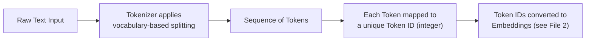

# 03 — Tokens

> **Series:** Prompt Engineering Knowledge Library
> **File 3 of 10** | **Level:** Beginner → Advanced
> **Prerequisites:** [`02_How_Large_Language_Models_Work.md`](./02_How_Large_Language_Models_Work.md)
> **Next:** [`04_Tokenization.md`](./04_Tokenization.md)

---

## Table of Contents

1. [Definition](#definition)
2. [Why It Matters](#why-it-matters)
3. [Core Concepts](#core-concepts)
4. [How It Works](#how-it-works)
5. [Internal Mechanism](#internal-mechanism)
6. [Types of Tokens](#types-of-tokens)
7. [Syntax / Structure](#syntax--structure)
8. [Examples (Simple → Advanced)](#examples-simple--advanced)
9. [Best Practices](#best-practices)
10. [Common Mistakes](#common-mistakes)
11. [Real-World Applications](#real-world-applications)
12. [Comparison with Related Concepts](#comparison-with-related-concepts)
13. [Advantages & Limitations](#advantages--limitations)
14. [FAQs](#faqs)
15. [Summary](#summary)
16. [Cheat Sheet](#cheat-sheet)
17. [Glossary](#glossary)
18. [References](#references)

---

## Definition

A **Token** is the smallest unit of text that a Large Language Model reads, processes, and generates. It is **not** the same as a "word" or a "character" — it is a model-specific chunk of text (which could be a whole word, part of a word, a single character, a space, or even punctuation) determined by a process called [tokenization](./04_Tokenization.md).

> Every single thing an LLM does — reading your prompt, "thinking," generating a response — happens in units of tokens, never in units of words or sentences. The token is the atomic currency of LLM computation.

```
Text:    "unbelievable"
Tokens:  ["un", "believ", "able"]     (example — exact split is model-dependent)
```

---

## Why It Matters

Tokens matter to prompt engineering for several very concrete, practical reasons:

1. **Cost** — Nearly all commercial LLM APIs charge **per token** (both input and output), not per word or per character. Prompt engineering that reduces unnecessary tokens directly reduces cost.
2. **Limits** — Every model has a maximum [context window](./05_Context_Window.md) measured in tokens. If your prompt + expected output exceeds this limit, the request will fail or be silently truncated.
3. **Behavior** — Because the model literally cannot perceive text in any unit smaller than a token, certain tasks (like counting letters in a word, or reversing a string) can be surprisingly difficult for LLMs — not because they're "bad at counting," but because the *token boundaries don't align with character boundaries*, so the model may not have direct access to the letter-by-letter structure of a word.
4. **Multilingual cost disparities** — Tokenization is typically optimized for English; the same sentence in another language can require significantly more tokens, affecting both cost and effective context window capacity for non-English text.

---

## Core Concepts

| Concept | Definition |
|---|---|
| **Token** | A single unit of text as processed by the model — sub-word, word, character, or symbol |
| **Vocabulary** | The complete, fixed set of all possible tokens a specific model can recognize and generate (often 30,000–250,000+ entries) |
| **Token ID** | The unique integer index representing a specific token within the model's vocabulary |
| **Sub-word Tokenization** | The dominant strategy where tokens are pieces of words (smaller than whole words, larger than single characters) |
| **Special Tokens** | Reserved tokens with specific structural/control meaning rather than representing natural language content (e.g., end-of-sequence markers) |
| **Token Boundary** | The point at which the tokenizer decides to split one token from the next |
| **Byte-Pair Encoding (BPE)** | A common algorithm for building a sub-word vocabulary, covered fully in [File 4](./04_Tokenization.md) |

---

## How It Works



Every model ships with a **fixed vocabulary** — a pre-built lookup table of every possible token it can recognize, decided at training time. When you send a prompt, the tokenizer doesn't "understand" your text at all — it simply performs a fast, deterministic lookup-and-split process to break your text into pieces that exist in this fixed vocabulary, then converts each piece to its integer **Token ID**.

---

## Internal Mechanism

### Why sub-word tokens, and not whole words or single characters?

This is a deliberate engineering trade-off, and understanding it is genuinely important for prompt engineering:

| Approach | Vocabulary Size Needed | Sequence Length for Same Text | Handles New/Rare Words? |
|---|---|---|---|
| **Character-level** | Tiny (~100 symbols) | Very long (every character = 1 token) | Yes, trivially |
| **Word-level** | Enormous (millions, to cover every word form in every language) | Short | No — any unseen word becomes an "unknown" token, losing information |
| **Sub-word (used in practice)** | Moderate (30K–250K) | Moderate | Yes — rare/unseen words are split into known smaller pieces |

Sub-word tokenization is the practical middle ground: common words (`"the"`, `"is"`, `"cat"`) are usually single tokens, while rare, technical, or made-up words get split into smaller recognizable pieces (`"tokenization"` → `"token"` + `"ization"`), and truly novel character sequences can always be represented, even letter-by-letter if necessary, since individual characters/bytes are included in the vocabulary as a fallback.

### The Token ID lookup

Internally, every token in the vocabulary has a unique integer ID. This is what the model *actually* computes with — text is a human-readable representation, but the model's mathematics operate entirely on these integers (which are then converted to embedding vectors, as covered in [File 2](./02_How_Large_Language_Models_Work.md)).

```
"Hello world" 
   → tokens: ["Hello", " world"]
   → token IDs: [15496, 1917]        (illustrative example IDs)
```

> Note the leading space included as part of the second token (`" world"`, not `"world"`) — this is a real and important characteristic of many modern tokenizers (explained further in [File 4](./04_Tokenization.md)), and it's part of why token counts can be non-intuitive for newcomers.

---

## Types of Tokens

| Type | Description | Example |
|---|---|---|
| **Word Tokens** | A complete, common word as a single token | `"cat"`, `"the"`, `"run"` |
| **Sub-word Tokens** | A fragment of a longer or rarer word | `"token"` + `"ization"` for "tokenization" |
| **Character Tokens** | A single character, used as a fallback for rare/unknown sequences | Individual letters in an unusual made-up word |
| **Punctuation Tokens** | Symbols, often tokenized separately from adjacent words | `.`, `,`, `!`, `?` |
| **Whitespace-Inclusive Tokens** | Tokens that include a leading space as part of the token itself (common in BPE-based tokenizers) | `" world"` (space + word combined) |
| **Special / Control Tokens** | Reserved tokens with structural meaning, not natural language | `<\|endoftext\|>`, `<\|system\|>`, `<\|user\|>` |
| **Numeric Tokens** | Digits or digit groups, often tokenized in ways that can affect arithmetic performance | `"123"` might be one token or split as `"1"` + `"23"` depending on the tokenizer |

---

## Syntax / Structure

Tokens themselves don't have a "syntax" you write directly — but you can inspect how your text will be tokenized using official tools, which is an essential prompt engineering skill:

```python
# Example: counting tokens with OpenAI's tiktoken library
import tiktoken

encoding = tiktoken.encoding_for_model("gpt-4o")
tokens = encoding.encode("Prompt engineering is a valuable skill.")

print(tokens)          # → list of integer Token IDs
print(len(tokens))     # → total token count
print(encoding.decode(tokens))  # → back to original text
```

```python
# Example output (illustrative)
[19422, 15009, 374, 264, 15525, 10151, 13]
7 tokens
"Prompt engineering is a valuable skill."
```

---

## Examples (Simple → Advanced)

### Level 1 — Simple Word-Level Intuition

```text
Text: "I love AI"
Tokens (approx): ["I", " love", " AI"]
Token count: 3
```

### Level 2 — Sub-word Splitting on an Uncommon Word

```text
Text: "The transformer's tokenizer subword-splits rare words."
Tokens (approx): ["The", " transformer", "'s", " token", "izer", " sub", "word", "-", "splits", " rare", " words", "."]
Token count: 12
```
*Notice how "tokenizer" and "subword-splits" — less common, more technical terms — get broken into multiple pieces, while everyday words stay whole.*

### Level 3 — Why This Matters for Cost Estimation

```text
Prompt: "Summarize this 2,000-word article in 3 bullet points."
[+ 2,000 words of article text]
```
A 2,000-*word* English article is typically **~2,600–2,800 tokens** (a common rule of thumb: 1 token ≈ 0.75 words in English). If a model's pricing is $X per 1,000 input tokens, prompt engineers must estimate in *tokens*, not words, to accurately predict cost — especially at scale (e.g., processing 10,000 documents/day).

### Level 4 — The Letter-Counting Problem, Explained

```text
Prompt: "How many letter R's are in the word 'strawberry'?"
```
This task can be unexpectedly error-prone for LLMs. Why? If `"strawberry"` is tokenized as a small number of sub-word chunks (e.g., `["straw", "berry"]`) rather than as 10 individual character tokens, the model never directly "sees" the individual letters as separate units in the way a human counting on their fingers would — it must instead rely on patterns learned about the *token* `"strawberry"` as a whole, which is a fundamentally harder implicit task than direct counting. This is a direct, mechanical consequence of sub-word tokenization, not a general reasoning flaw.

### Level 5 — Advanced: Token-Aware Prompt Optimization

```text
❌ Verbose version (higher token count):
"I would really appreciate it if you could possibly take a moment to 
carefully go through the following text and, if it's not too much trouble, 
provide a summary of it for me in a few sentences, please."
→ ~45 tokens of instruction, before even reaching the actual content

✅ Optimized version (lower token count, same intent):
"Summarize the following text in 2–3 sentences:"
→ ~9 tokens of instruction
```
At scale (e.g., an application making millions of API calls per month), this kind of token-conscious instruction design has direct, measurable cost and latency impact — a core practical skill in production prompt engineering, formalized further as a [design principle](./09_Prompt_Design_Principles.md) (conciseness).

---

## Best Practices

1. **Always count tokens programmatically for production prompts** — don't estimate by eyeballing word count; use the model provider's official tokenizer library.
2. **Budget tokens across the full request** — remember that input prompt tokens + expected output tokens together must fit within the [context window](./05_Context_Window.md).
3. **Be aware that non-English text often costs more tokens** for equivalent meaning — factor this into multilingual application design.
4. **Don't assume 1 word = 1 token** — use the ~0.75 words/token (English) rule only as a rough estimate, and verify with real tokenization for anything cost-sensitive.
5. **For character-level tasks** (spelling, counting letters, reversing strings), consider explicitly asking the model to first spell the word out with separators (e.g., "s-t-r-a-w-b-e-r-r-y") to force character-level tokens into the sequence, improving accuracy on such tasks.
6. **Watch for hidden tokens in formatting** — extra whitespace, markdown symbols, and repeated newlines all consume real tokens.

---

## Common Mistakes

| Mistake | Consequence | Fix |
|---|---|---|
| Assuming word count ≈ token count | Inaccurate cost/limit estimates, especially for non-English or technical text | Use an actual tokenizer library to count |
| Expecting perfect character-level accuracy on tasks like letter-counting | Model gives incorrect counts, appears "unintelligent" | Understand this is a tokenization artifact; work around it (spell out words) if precision is critical |
| Padding prompts with unnecessary filler/politeness language in high-volume systems | Wasted tokens = wasted cost and reduced effective context | Write direct, information-dense instructions for production systems |
| Ignoring token cost of few-shot examples | Large example sets can silently consume a huge fraction of the context window | Count example tokens explicitly; trim to only what's necessary |
| Forgetting special/control tokens also count | Underestimating true prompt size, especially in chat-formatted APIs | Account for role markers and formatting overhead in token budgets |

---

## Real-World Applications

- **API cost estimation and billing** — providers charge per input/output token; SaaS products built on LLMs must model token costs into their own pricing.
- **Rate limiting** — many APIs enforce tokens-per-minute (TPM) limits, not just requests-per-minute.
- **Context window budgeting** — RAG systems must calculate how many tokens of retrieved documents can fit alongside the user's query and system instructions (see [File 6](./06_Context_Management.md)).
- **Streaming UI responsiveness** — tokens are the unit in which streaming responses are delivered to a user interface, one token (or a few) at a time.
- **Fine-tuning dataset sizing** — training costs and dataset size are also measured in tokens, not documents or examples.
- **Prompt compression tools** — a category of tools/techniques specifically designed to reduce token count while preserving meaning, for cost/latency optimization.

---

## Comparison with Related Concepts

| Concept | Difference from "Token" |
|---|---|
| **Word** | A human linguistic unit; does not map 1:1 to a token — one word can be multiple tokens, and one token can span a word plus adjacent whitespace |
| **Character** | The smallest unit of written text; tokens are usually *composed of* multiple characters, though single characters can themselves be tokens in fallback cases |
| **Byte** | The smallest unit of raw computer data; some modern tokenizers (like byte-level BPE) operate on bytes as their foundational unit before merging into larger sub-word tokens |
| **Embedding** | A *numeric vector* derived from a token; the token itself is closer to a symbolic/integer ID, while the embedding is its learned mathematical representation (see [File 2](./02_How_Large_Language_Models_Work.md)) |

---

## Advantages & Limitations

### ✅ Advantages of Token-Based Processing

- **Efficient vocabulary size** — sub-word tokens allow a manageable, fixed-size vocabulary while still handling virtually any input text.
- **Handles unseen/novel words gracefully** — via fallback splitting into smaller known pieces.
- **Language-agnostic mechanism** — the same underlying approach (with a language-appropriate vocabulary) works across many languages and even code.
- **Enables precise cost/resource accounting** — a well-defined, countable unit for pricing and capacity planning.

### ⚠️ Limitations

- **Character-level blindness** — tasks requiring precise character manipulation (counting, reversing, spelling) can be unexpectedly unreliable.
- **Uneven cross-lingual efficiency** — tokenizers trained predominantly on English text often require more tokens to represent equivalent meaning in other languages, creating cost and context-window disparities.
- **Non-intuitive counting** — humans naturally think in words/sentences, not tokens, creating a persistent mental friction point for newcomers to prompt engineering.
- **Fixed vocabulary boundary effects** — how a specific word or number gets split can sometimes subtly affect model performance in ways that are hard to predict without direct inspection.

---

## FAQs

**Q: Roughly how many tokens is a word?**
A: A common English rule of thumb is **1 token ≈ 0.75 words**, or equivalently, **~4 characters ≈ 1 token**. This varies by content type (code, non-English text, and technical jargon typically use more tokens per word).

**Q: Do spaces count as tokens?**
A: Often, yes — but frequently *combined* with the following word as a single token (e.g., `" world"` rather than a separate space token plus `"world"`), depending on the specific tokenizer's design (see [File 4](./04_Tokenization.md)).

**Q: Why can't I just ask the model how many tokens my prompt is?**
A: The model itself, during generation, doesn't have privileged introspective access to report this reliably in all cases — the accurate way is to run your exact text through the provider's official tokenizer library or API before sending the request.

**Q: Are tokens the same across different AI models (GPT, Claude, Gemini, Llama)?**
A: No. Each model family typically uses its own vocabulary and tokenizer, trained specifically for that model. The same sentence can have a different token count on GPT-4o versus Claude versus Gemini. Always use the specific provider's tokenizer for accurate counts.

**Q: Does a longer token count mean a "smarter" or more detailed response?**
A: No — token count measures *quantity* of processed text, not quality of reasoning or response. A concise, well-engineered 20-token prompt can outperform a rambling 200-token one.

---

## Summary

A token is the fundamental, model-specific unit of text that an LLM actually reads, processes, and generates — never a word, sentence, or character directly, though it's often close to a word-fragment in practice. This matters enormously for prompt engineering because tokens determine API cost, define the hard ceiling of the [context window](./05_Context_Window.md), and explain otherwise-puzzling model behaviors like difficulty with precise character-level tasks. Every serious prompt engineer must be able to reason about, and ideally programmatically count, the token footprint of their prompts.

---

## Cheat Sheet

```text
TOKEN QUICK FACTS
~4 characters (English) ≈ 1 token
~0.75 words (English)   ≈ 1 token
1,000 tokens             ≈ 750 English words ≈ ~1.5 pages of text

RULE OF THUMB CONVERSION TABLE
Words   → Tokens (approx, English)
100     → ~133
500     → ~667
1,000   → ~1,333
2,000   → ~2,667
```

| Task Type | Token Efficiency Tip |
|---|---|
| High-volume production prompts | Strip filler/politeness language |
| Few-shot examples | Count and trim examples to only what's necessary |
| Non-English applications | Budget extra tokens vs. English equivalents |
| Character-precision tasks | Spell out target words with separators |
| Cost estimation | Always use official tokenizer library, not word count |

---

## Glossary

| Term | Definition |
|---|---|
| **Token** | The smallest unit of text an LLM processes |
| **Vocabulary** | The fixed complete set of tokens a model can use |
| **Token ID** | The integer index of a token within the model's vocabulary |
| **Sub-word Token** | A token representing a fragment of a word, smaller than a full word |
| **Special Token** | A reserved, non-linguistic token used for structural/control purposes |
| **Byte-Pair Encoding (BPE)** | An algorithm for constructing a sub-word vocabulary (see File 4) |
| **Tokenizer** | The tool/algorithm that converts raw text into tokens |

---

## References

- OpenAI — [tiktoken (official tokenizer library)](https://github.com/openai/tiktoken)
- OpenAI — [Tokenizer Tool](https://platform.openai.com/tokenizer)
- Anthropic — [Token Counting Documentation](https://docs.claude.com/en/docs/build-with-claude/token-counting)
- Google — [Gemini API Tokens and Pricing Documentation](https://ai.google.dev/gemini-api/docs/tokens)
- Sennrich, R. et al. (2016) — *Neural Machine Translation of Rare Words with Subword Units* (BPE paper), arXiv:1508.07909
- Hugging Face — [Tokenizers Library Documentation](https://huggingface.co/docs/tokenizers)

---

**⬅️ Previous:** [`02_How_Large_Language_Models_Work.md`](./02_How_Large_Language_Models_Work.md)
**➡️ Next:** [`04_Tokenization.md`](./04_Tokenization.md) — The process that creates tokens from raw text.
