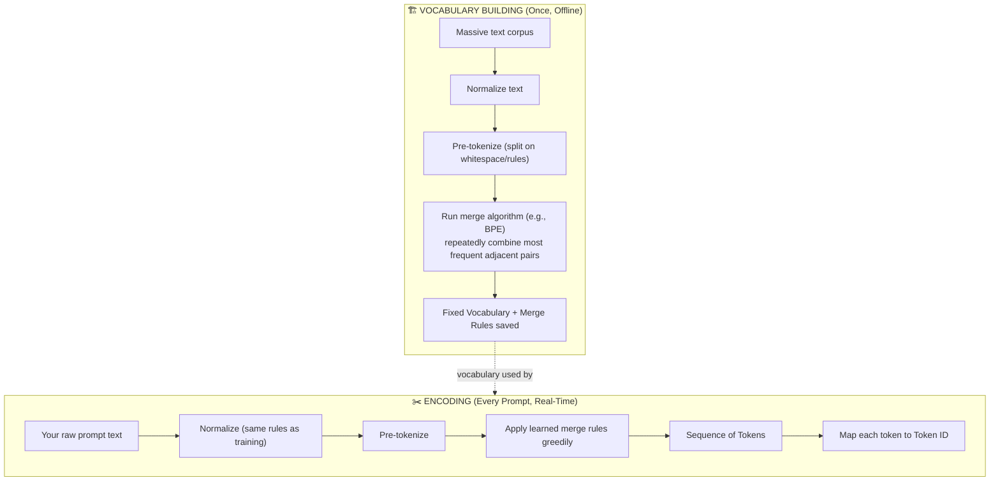
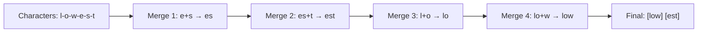

# 04 — Tokenization

> **Series:** Prompt Engineering Knowledge Library
> **File 4 of 10** | **Level:** Beginner → Advanced
> **Prerequisites:** [`03_Tokens.md`](./03_Tokens.md)
> **Next:** [`05_Context_Window.md`](./05_Context_Window.md)

---

## Table of Contents

1. [Definition](#definition)
2. [Why It Matters](#why-it-matters)
3. [Core Concepts](#core-concepts)
4. [How It Works](#how-it-works)
5. [Internal Mechanism](#internal-mechanism)
6. [Types of Tokenization Algorithms](#types-of-tokenization-algorithms)
7. [Syntax / Structure](#syntax--structure)
8. [Examples (Simple → Advanced)](#examples-simple--advanced)
9. [Best Practices](#best-practices)
10. [Common Mistakes](#common-mistakes)
11. [Real-World Applications](#real-world-applications)
12. [Comparison with Related Concepts](#comparison-with-related-concepts)
13. [Advantages & Limitations](#advantages--limitations)
14. [FAQs](#faqs)
15. [Summary](#summary)
16. [Cheat Sheet](#cheat-sheet)
17. [Glossary](#glossary)
18. [References](#references)

---

## Definition

**Tokenization** is the algorithmic *process* of converting raw text into a sequence of [tokens](./03_Tokens.md). While a token is the *unit* (covered in File 3), tokenization is the *procedure* — the specific algorithm and trained vocabulary that decides exactly where to split a given piece of text.

> **Key distinction:** "Token" = the noun (the resulting piece). "Tokenization" = the verb/process (how you get there). This file focuses on the *how* — the algorithms, training process, and mechanics behind that splitting decision.

Tokenization happens in two very different contexts, and it's important to distinguish them:

1. **Vocabulary construction (done once, by the model creator):** An algorithm analyzes a huge training corpus to *build* the fixed vocabulary of tokens the model will use.
2. **Encoding (done every single time you send a prompt):** The trained tokenizer applies that fixed vocabulary to *split your specific input text* into tokens, deterministically.

---

## Why It Matters

Understanding tokenization mechanics — not just that tokens exist, but *how the splitting algorithm decides where to cut* — unlocks a deeper level of prompt engineering skill:

- **Predicting token-sensitive failures** — knowing *why* a word gets split a certain way helps you predict which inputs (rare words, code, numbers, non-English text) will be token-expensive or behavior-fragile.
- **Debugging unexpected model behavior** — many strange LLM errors (poor arithmetic, inconsistent handling of similar-looking inputs) trace directly back to inconsistent tokenization of superficially similar text.
- **Designing token-efficient systems** — engineers building high-volume LLM applications need to understand tokenization deeply enough to optimize prompt templates, not just guess.
- **Cross-model portability** — different models use different tokenization algorithms and vocabularies; understanding the general mechanics (not just one model's specifics) lets you reason about *any* model you encounter.

---

## Core Concepts

| Concept | Definition |
|---|---|
| **Corpus** | The large body of training text used to build the tokenizer's vocabulary |
| **Merge Rule** | A learned rule specifying that two adjacent tokens should be combined into one (core mechanic of BPE) |
| **Vocabulary Size** | The total number of unique tokens a tokenizer can produce, fixed after training |
| **Pre-tokenization** | An initial coarse splitting step (e.g., by whitespace) before the fine-grained sub-word algorithm runs |
| **Encoding** | Converting text → token IDs (what happens when you send a prompt) |
| **Decoding** | Converting token IDs → text (what happens when you read a model's output) |
| **Normalization** | Text cleanup steps (e.g., unicode normalization, lowercasing in some tokenizers) applied before splitting |
| **Byte-level Fallback** | A safety mechanism ensuring *any* possible input (even unknown symbols/emoji) can always be tokenized, by falling back to raw byte representation if needed |

---

## How It Works



---

## Internal Mechanism

The dominant family of algorithms used by modern LLMs is **Byte-Pair Encoding (BPE)** and its close variants (like SentencePiece and WordPiece). Here is exactly how BPE builds a vocabulary, step by step — this is the actual mechanism, simplified but accurate:

### Step-by-step BPE vocabulary construction

**1. Start with individual characters (or bytes) as the base vocabulary.**

```
Corpus word frequencies (toy example):
"low" ×5, "lower" ×2, "newest" ×6, "widest" ×3
```

Initial representation (each word split into characters, with an end-of-word marker `·`):
```
l o w ·         (×5)
l o w e r ·     (×2)
n e w e s t ·   (×6)
w i d e s t ·   (×3)
```

**2. Count all adjacent character pairs across the entire corpus.**

```
Pair counts: ("e","s") = 9, ("s","t") = 9, ("l","o") = 7, ("o","w") = 7, ...
```

**3. Merge the single most frequent pair into a new token.**

```
Most frequent: ("e", "s") → merge into "es"
```

**4. Repeat: recount pairs (now including the new "es" token), merge the next most frequent pair.**

```
Next merge: ("es", "t") → "est"
Next merge: ("l", "o") → "lo"
Next merge: ("lo", "w") → "low"
...and so on, thousands of times
```

**5. Stop when the vocabulary reaches a predetermined target size** (e.g., 50,000 tokens) — this is a hyperparameter chosen by the model creator before training begins.

### What this produces, mechanically

After thousands of merge iterations, common English word fragments like `"the"`, `"ing"`, `"tion"`, `"pre"` end up as single tokens (because they appeared frequently enough to earn a merge), while rare, unusual, or foreign-language sequences remain split into smaller pieces (because they never accumulated enough frequency to justify a merge).



### Encoding a new piece of text (what happens every time you prompt)

Once the vocabulary and merge rules are fixed, encoding *your* prompt text applies these same learned merge rules **greedily and deterministically**, in the exact order they were learned:

```
Input: "lowest"
Step 1: l-o-w-e-s-t  (start as characters)
Step 2: apply merges in learned order: (e,s)→es, then (es,t)→est, then (l,o)→lo, then (lo,w)→low
Result: [low] [est]
```

This is why tokenization is **fully deterministic** — the same input text, with the same tokenizer, will *always* produce the exact same token sequence, every single time.

---

## Types of Tokenization Algorithms

| Algorithm | Core Idea | Notable Usage |
|---|---|---|
| **Byte-Pair Encoding (BPE)** | Iteratively merge the most frequent adjacent character/token pairs | GPT family, many open-source models |
| **Byte-level BPE** | BPE applied over raw bytes rather than unicode characters, guaranteeing any input is representable | GPT-2 and later OpenAI models |
| **WordPiece** | Similar to BPE, but merges are chosen to maximize training data likelihood, not just raw frequency | BERT and related Google models |
| **SentencePiece** | A tokenizer framework (supporting both BPE and Unigram algorithms) that treats input as a raw stream, including whitespace as a regular character — enables language-agnostic tokenization without pre-splitting on spaces | Many multilingual models (T5, Llama, and others) |
| **Unigram Language Model** | Starts with a large candidate vocabulary and iteratively *removes* tokens that least hurt overall corpus likelihood, rather than building up via merges | Often paired with SentencePiece |
| **Word-Level Tokenization** | Simple whitespace/punctuation-based splitting into whole words (largely legacy) | Older/simpler NLP systems, rarely used for modern LLMs |
| **Character-Level Tokenization** | Every single character is its own token | Some specialized or research models; not standard for production LLMs |

---

## Syntax / Structure

You interact with a tokenizer programmatically, using the official library for a given model family. This is the practical "syntax" of tokenization work:

```python
# Example: Hugging Face tokenizers library (general pattern, model-agnostic style)
from transformers import AutoTokenizer

tokenizer = AutoTokenizer.from_pretrained("model-name-here")

text = "Tokenization determines how prompts are processed."

# Encoding: text → tokens → IDs
token_ids = tokenizer.encode(text)
tokens = tokenizer.convert_ids_to_tokens(token_ids)

print(tokens)      # e.g., ['Token', 'ization', ' determines', ' how', ' prompts', ...]
print(token_ids)   # e.g., [1234, 5678, 91011, ...]

# Decoding: IDs → text
decoded = tokenizer.decode(token_ids)
print(decoded)     # "Tokenization determines how prompts are processed."
```

```python
# Example: OpenAI's tiktoken
import tiktoken

enc = tiktoken.get_encoding("cl100k_base")  # a specific BPE vocabulary
print(enc.encode("Tokenization is deterministic."))
print(enc.decode(enc.encode("Tokenization is deterministic.")))
```

---

## Examples (Simple → Advanced)

### Level 1 — Observing Deterministic Splitting

```text
Input: "playing"
Tokenized (illustrative): ["play", "ing"]

Input: "playing" (again, run 10 more times)
Tokenized: ["play", "ing"]   ← always identical
```

### Level 2 — Same Meaning, Different Token Count (Casing & Spacing)

```text
"HELLO"        → often tokenized differently than →   "hello"
"hello world"  → 2 tokens (approx)
"helloworld"   → could be forced into fewer, oddly-split tokens, since the tokenizer never learned "helloworld" as a merge unit
```
*This illustrates that tokenization is sensitive to exact surface form — capitalization and spacing are not "normalized away" by most modern tokenizers the way a human reader would mentally ignore them.*

### Level 3 — Numbers Tokenize Inconsistently

```text
"2024"    → might be a single token
"20242"   → might split as ["202", "42"] or ["2024", "2"], depending on learned merges
"3.14159" → might split unpredictably around the decimal point
```
*This inconsistency in how numbers are chunked is one documented contributing factor to LLMs sometimes struggling with precise multi-digit arithmetic — the model may not "see" digit sequences in a consistent, place-value-aligned way (this connects directly to the arithmetic example in [File 2](./02_How_Large_Language_Models_Work.md)).*

### Level 4 — Code Tokenization

```python
def calculate_total(price, tax_rate):
    return price * (1 + tax_rate)
```
Code tokenizes distinctly from prose — indentation whitespace, underscores in `calculate_total`, and symbols like `*`, `(`, `)` are all tokenized based on patterns learned from code-heavy training data. Models with tokenizers trained on large code corpora (or code-emphasized training data) handle this more token-efficiently than general-purpose tokenizers, which is part of why some models are specifically marketed as strong "code models."

### Level 5 — Advanced: Cross-Lingual Tokenization Disparity

```text
English: "How are you today?"          → ~5–6 tokens
French:  "Comment allez-vous aujourd'hui ?"  → ~9–10 tokens (approx)
Japanese: "今日の調子はどうですか？"        → often 10–15+ tokens, since CJK (Chinese/Japanese/Korean) characters frequently each consume more of the byte-level vocabulary space per character of meaning
```
This is a direct, measurable, and well-documented consequence of tokenizer vocabularies being disproportionately trained on English/Latin-script-heavy corpora. **Practical impact:** a multilingual application serving non-English users may hit [context window](./05_Context_Window.md) limits and incur higher costs for functionally equivalent content — a critical consideration in real-world, production-grade prompt engineering and system design.

---

## Best Practices

1. **Always test tokenization on your exact production text**, especially if it includes code, numbers, non-English content, or unusual formatting — don't assume general rules of thumb apply uniformly.
2. **Prefer consistent formatting** in prompt templates (consistent casing, spacing) to get more predictable, cacheable tokenization patterns.
3. **For numeric precision tasks**, consider explicit formatting strategies (e.g., spacing out digits: `"1 2 3 4"`) if you observe tokenization-related arithmetic errors, since this can force more granular, consistent digit-level tokens.
4. **When building multilingual products**, budget context window and cost estimates *per target language*, not just based on English testing.
5. **Use the exact tokenizer for the exact model** you're deploying against — tokenizers are not interchangeable across model families, and even between different versions of the same family.

---

## Common Mistakes

| Mistake | Consequence | Fix |
|---|---|---|
| Assuming tokenization is "smart" or semantic | Believing the tokenizer understands meaning, when it's actually a fixed, frequency-based statistical procedure | Understand tokenization as mechanical pattern-matching, not comprehension |
| Using one model's tokenizer to estimate another model's token count | Inaccurate cost/limit estimates | Always use the specific target model's official tokenizer |
| Assuming identical text always tokenizes identically across models | False — vocabularies differ entirely between model families | Test per-model; never assume portability of token counts |
| Ignoring case-sensitivity effects | Unexpected token count differences between seemingly similar strings | Test both cases if casing is a variable in your application |
| Believing tokenization can be "fixed" via prompting alone | Tokenization happens *before* the model sees anything — no prompt instruction can change how the tokenizer itself splits text | Address via input formatting/preprocessing outside the prompt, not prompt wording |

---

## Real-World Applications

- **Tokenizer libraries in production pipelines** — `tiktoken` (OpenAI), Hugging Face `tokenizers`, SentencePiece — integrated directly into applications for cost estimation and truncation logic.
- **Prompt compression tools** — systems that specifically restructure text to reduce token count while preserving semantic content, relying on deep tokenization knowledge.
- **Multilingual product cost modeling** — global SaaS companies model per-language token costs differently based on measured tokenization disparities.
- **Custom tokenizer training** — organizations building domain-specific models (e.g., for legal, medical, or code-heavy domains) sometimes train custom vocabularies, adding domain-frequent terms as single tokens for efficiency.
- **Truncation and chunking logic in RAG systems** — document chunking strategies for retrieval systems must be tokenization-aware to avoid cutting documents at semantically poor boundaries (further explored in [File 6](./06_Context_Management.md)).

---

## Comparison with Related Concepts

| Concept | Difference from Tokenization |
|---|---|
| **Token (File 3)** | Tokenization is the *process*; a token is the *output/result* of that process |
| **Stemming / Lemmatization (classic NLP)** | Older NLP techniques that reduce words to root forms (e.g., "running" → "run") based on *linguistic* rules; tokenization (BPE-style) is purely *statistical/frequency*-based and doesn't aim to find linguistic roots |
| **Text Normalization** | A *preprocessing step* (e.g., lowercasing, unicode cleanup) that often happens *before* tokenization, but is a distinct step |
| **Embedding (File 2)** | Embedding happens *after* tokenization — tokenization produces discrete integer IDs; embedding converts those IDs into continuous numeric vectors |

---

## Advantages & Limitations

### ✅ Advantages of Modern (BPE-style) Tokenization

- **Deterministic and fast** — encoding is a simple, highly optimized lookup/merge process, not a slow neural computation.
- **Handles any input** — via byte-level fallback, even entirely novel symbols, emoji, or made-up words can always be tokenized.
- **Balances vocabulary size and sequence length** — a well-tuned middle ground versus pure character-level or pure word-level approaches.
- **Learned from real data** — merge rules reflect actual frequency patterns in the training corpus, making common language efficient by construction.

### ⚠️ Limitations

- **Frequency bias toward training data composition** — languages, dialects, or domains underrepresented in the training corpus get less efficient (more token-expensive) tokenization.
- **No semantic awareness** — the algorithm merges based on raw frequency, not meaning, occasionally producing splits that look linguistically odd.
- **Fixed after training** — a deployed model's tokenizer cannot be updated without retraining/redeploying the model, so it cannot adapt to genuinely new vocabulary (e.g., a brand-new slang term) the way a human reader instantly can.
- **Sensitive to surface form** — casing, spacing, and punctuation variations can produce different token sequences for text a human would consider equivalent.

---

## FAQs

**Q: Is tokenization part of the neural network, or separate from it?**
A: Completely separate. Tokenization is a fixed, rule-based preprocessing step that runs *before* any neural network computation happens. The tokenizer itself contains no learned neural network weights — it's a fast, deterministic lookup-and-merge algorithm.

**Q: Can I change how a model tokenizes my text through prompting?**
A: No. Tokenization happens before the model "sees" anything in the neural sense — it's outside the reach of in-prompt instructions. You can only influence tokenization by changing the *actual input text/formatting* you send.

**Q: Why do different AI companies use different tokenizers?**
A: Each company trains its own tokenizer on its own chosen training corpus, often optimized for its specific model's target languages, domains (e.g., extra attention to code), and desired vocabulary size trade-offs.

**Q: Does a bigger vocabulary size always mean better tokenization?**
A: Not necessarily. A larger vocabulary can reduce sequence length (fewer tokens for the same text) but increases the size and computational cost of the model's output layer (since it must compute a probability for every vocabulary entry at each generation step) — it's an engineering trade-off, not a strictly "more is better" parameter.

**Q: What is SentencePiece and how is it different from BPE?**
A: SentencePiece is a tokenizer *framework* that can implement either BPE or a Unigram Language Model algorithm internally. Its key distinguishing design choice is treating whitespace as a regular character within its input stream (rather than using whitespace as a pre-splitting delimiter before running BPE), which makes it more naturally language-agnostic — useful for languages that don't use spaces between words (like Japanese or Thai).

---

## Summary

Tokenization is the deterministic algorithmic process — most commonly Byte-Pair Encoding (BPE) or a close variant like WordPiece or SentencePiece — that converts raw text into a fixed vocabulary of tokens, by iteratively learning to merge the most frequent adjacent character/token pairs from a massive training corpus. This process happens once to build the vocabulary, then runs identically and deterministically on every prompt you ever send. Understanding this mechanism explains real, observable prompt engineering phenomena: why certain words are token-expensive, why arithmetic and character-counting can be unreliable, and why non-English languages often incur higher token costs — all direct, mechanical consequences of how the merge algorithm was trained.

---

## Cheat Sheet

```text
TOKENIZATION QUICK FACTS
Algorithm family: BPE (and variants: WordPiece, SentencePiece, Unigram)
Process: Build vocabulary ONCE (offline) → Apply vocabulary EVERY TIME (encoding)
Determinism: Same text + same tokenizer = same tokens, always
Fallback: Byte-level representation guarantees any input can be tokenized
```

| If you observe... | Root cause | 
|---|---|
| Unexpected token counts for a familiar word | Word wasn't frequent enough in training corpus to earn a full merge |
| Different token counts across languages | Vocabulary trained disproportionately on English/Latin-script text |
| Inconsistent digit handling | Numbers tokenize unpredictably depending on learned merge patterns |
| Same text, different model = different token count | Different models use entirely different trained vocabularies |

---

## Glossary

| Term | Definition |
|---|---|
| **Tokenization** | The algorithmic process of converting text into tokens |
| **Byte-Pair Encoding (BPE)** | The dominant algorithm that builds a vocabulary via iterative frequency-based merging |
| **Merge Rule** | A learned instruction to combine two specific adjacent tokens into one |
| **WordPiece** | A BPE variant that selects merges by maximizing training data likelihood |
| **SentencePiece** | A tokenizer framework treating input as a raw character/byte stream, language-agnostic |
| **Unigram Language Model** | A vocabulary-reduction (rather than merge-based) tokenization algorithm |
| **Pre-tokenization** | Coarse initial splitting (e.g., by whitespace) before fine-grained sub-word splitting |
| **Encoding** | Converting text into token IDs |
| **Decoding** | Converting token IDs back into text |
| **Byte-level Fallback** | Guarantee mechanism ensuring any input, however unusual, can be tokenized |

---

## References

- Sennrich, R. et al. (2016) — *Neural Machine Translation of Rare Words with Subword Units*, arXiv:1508.07909
- Kudo, T. & Richardson, J. (2018) — *SentencePiece: A simple and language independent subword tokenizer*, arXiv:1808.06226
- OpenAI — [tiktoken GitHub Repository](https://github.com/openai/tiktoken)
- Hugging Face — [Tokenizers Documentation](https://huggingface.co/docs/tokenizers/index)
- Google Research — [WordPiece / BERT Tokenization Documentation](https://github.com/google-research/bert)
- Anthropic — [Token Counting Guide](https://docs.claude.com/en/docs/build-with-claude/token-counting)

---

**⬅️ Previous:** [`03_Tokens.md`](./03_Tokens.md)
**➡️ Next:** [`05_Context_Window.md`](./05_Context_Window.md) — How many tokens a model can process at once.
