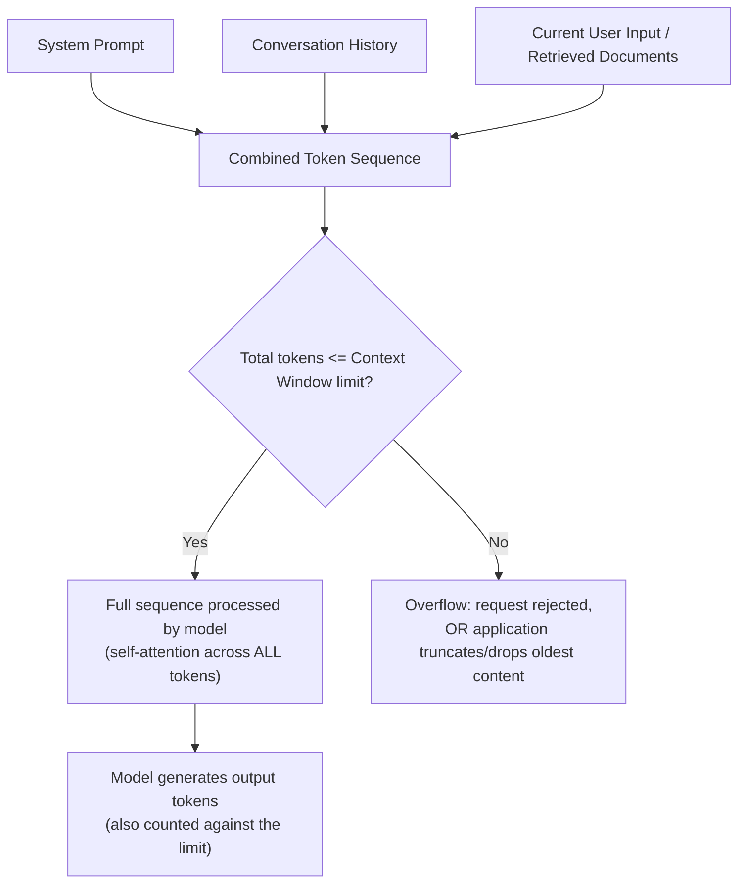
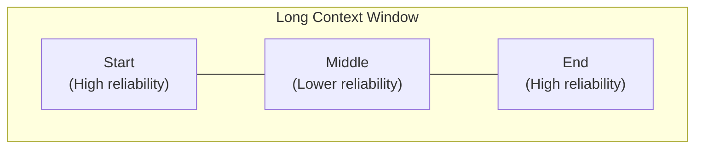

# 05 — Context Window

> **Series:** Prompt Engineering Knowledge Library
> **File 5 of 10** | **Level:** Beginner → Advanced
> **Prerequisites:** [`04_Tokenization.md`](./04_Tokenization.md)
> **Next:** [`06_Context_Management.md`](./06_Context_Management.md)

---

## Table of Contents

1. [Definition](#definition)
2. [Why It Matters](#why-it-matters)
3. [Core Concepts](#core-concepts)
4. [How It Works](#how-it-works)
5. [Internal Mechanism](#internal-mechanism)
6. [Types of Context Window Constraints](#types-of-context-window-constraints)
7. [Syntax / Structure](#syntax--structure)
8. [Examples (Simple → Advanced)](#examples-simple--advanced)
9. [Best Practices](#best-practices)
10. [Common Mistakes](#common-mistakes)
11. [Real-World Applications](#real-world-applications)
12. [Comparison with Related Concepts](#comparison-with-related-concepts)
13. [Advantages & Limitations](#advantages--limitations)
14. [FAQs](#faqs)
15. [Summary](#summary)
16. [Cheat Sheet](#cheat-sheet)
17. [Glossary](#glossary)
18. [References](#references)

---

## Definition

The **Context Window** is the maximum number of [tokens](./03_Tokens.md) — combined across the input prompt (including system instructions, conversation history, and any injected data) **and** the generated output — that a Large Language Model can process or "see" in a single request.

> Think of it as the model's entire working memory for a single interaction. Anything — instructions, documents, prior conversation turns — that doesn't fit inside this window simply does not exist from the model's perspective at generation time.

```
Context Window (example: 128,000 tokens)
├── System Prompt         (e.g., 500 tokens)
├── Conversation History  (e.g., 40,000 tokens)
├── Retrieved Documents   (e.g., 60,000 tokens)
├── Current User Message  (e.g., 200 tokens)
└── Space Reserved for Model's Output (e.g., 27,300 tokens remaining)
    ─────────────────────────────────────────────
    Total: must not exceed 128,000 tokens
```

---

## Why It Matters

The context window is arguably the single most important **hard constraint** in practical prompt engineering — more so than almost any wording choice — because it is a strict, non-negotiable ceiling:

- **Exceeding it causes failure**, not degraded quality — requests are typically rejected outright, or older content is silently truncated/dropped by the surrounding application, depending on system design.
- **It determines what's even possible** — you cannot ask a model to analyze a 500-page document in one shot if that document's token count exceeds the window, no matter how well-crafted your instructions are.
- **It directly shapes system architecture** — entire engineering disciplines exist ([context management](./06_Context_Management.md), retrieval-augmented generation) specifically to work around this limit.
- **It interacts with cost** — since virtually all providers charge per token, larger context windows used inefficiently directly increase cost, even when the request technically succeeds.
- **Position within it affects retrieval quality** — as covered in the Internal Mechanism section below, not all positions in a long context are attended to with equal reliability.

---

## Core Concepts

| Concept | Definition |
|---|---|
| **Context Window Size** | The maximum token capacity of a specific model, fixed by its architecture and training (e.g., 8K, 32K, 128K, 200K, 1M+ tokens) |
| **Input Tokens** | Tokens consumed by everything sent *to* the model (prompt, history, documents) |
| **Output Tokens** | Tokens consumed by the model's generated response |
| **Max Output Tokens** | A separate, often smaller, configurable limit on how many tokens the model is allowed to *generate* in one response (a sub-budget within the total context window) |
| **Truncation** | The (often silent) dropping of content that doesn't fit within the context window |
| **Context Overflow** | The error/failure condition when a request's total token count exceeds the model's context window |
| **Effective Context Length** | The portion of the theoretical context window across which the model *actually* retrieves/attends to information reliably in practice — often smaller than the advertised maximum |
| **"Lost in the Middle" Effect** | An empirically documented phenomenon where models retrieve information from the beginning and end of a long context more reliably than from the middle |
| **KV Cache (Key-Value Cache)** | An internal memory optimization used during inference to avoid recomputing attention for tokens already processed earlier in the same generation — directly tied to how context windows are computationally handled |

---

## How It Works



Critically: **the context window is not a "memory" the model chooses to consult — it is the literal, entire set of tokens the self-attention mechanism (see [File 2](./02_How_Large_Language_Models_Work.md)) has mathematical access to during generation.** There is no external database the model can independently query for "forgotten" content unless the surrounding application explicitly implements one (e.g., via RAG, covered in [File 6](./06_Context_Management.md)).

---

## Internal Mechanism

### Why does a context window limit exist at all?

The standard Transformer's self-attention mechanism computes a relevance score between **every pair of tokens** in the sequence. This means the computational cost grows **quadratically** with sequence length:

```
Sequence length: N tokens
Attention computation cost: proportional to N²

N = 1,000    → ~1,000,000 comparisons
N = 10,000   → ~100,000,000 comparisons
N = 100,000  → ~10,000,000,000 comparisons
```

This quadratic scaling is the fundamental architectural reason context windows historically could not simply be made "infinite" — the compute and memory cost becomes prohibitive. Modern large context windows (100K–1M+ tokens) are achieved through significant engineering work — optimized attention implementations, architectural modifications, and specialized memory management — not by ignoring this underlying cost curve.

### Why the "Lost in the Middle" effect happens

This is one of the most practically important findings in applied LLM research for prompt engineers. Multiple independent studies (see References) have empirically shown that when relevant information is placed in the *middle* of a very long context, models retrieve and use it *less* reliably than when the same information is placed near the *beginning* or *end* of the context — even though, in principle, self-attention should treat all positions with the same architecture.



This is understood to result from a combination of factors, including:
- **Training data distribution** — models may have seen relatively more examples during training where the most important information (e.g., a document's introduction/conclusion, or an instruction) appeared near the start or end of a text.
- **Positional encoding effects** — the mechanism by which token *position* is represented (introduced in [File 2](./02_How_Large_Language_Models_Work.md)) may not distribute attention perfectly uniformly across extremely long sequences.

**Practical, mechanical consequence for prompt engineering:** critical instructions and the most important retrieved facts should generally be placed at the *start* or *end* of a long prompt, not buried in the middle — a direct, evidence-based [design principle](./09_Prompt_Design_Principles.md) covered further in File 9.

### How output tokens share the same budget

A frequently misunderstood mechanic: the context window is **shared** between input and output. If a model has a 128K token context window and your input consumes 127,900 tokens, only 100 tokens remain available for the *entire response* — regardless of how you configure a separate `max_tokens` parameter, since that parameter can only ever request output *up to* whatever budget remains.

---

## Types of Context Window Constraints

| Type | Description |
|---|---|
| **Hard Total Limit** | The absolute maximum combined input + output tokens a model architecture supports |
| **Configurable Output Cap** | An application/API-level setting (`max_tokens`) limiting generation length, independent of (but bounded by) the hard total limit |
| **Effective Retrieval Limit** | The practical, often smaller, range across which the model reliably attends to and uses information (related to the "Lost in the Middle" effect) |
| **Rate-Limited Context** | Some API tiers impose additional throughput-based restrictions (tokens-per-minute) that interact with, but are distinct from, the per-request context window |
| **Sliding Window (in some architectures)** | An alternative design where only the most recent N tokens are directly attended to, rather than the full sequence, used in some efficiency-focused model variants |

### Representative context window sizes (illustrative — always verify current values in official documentation, as these change frequently)

| Model Class Era | Typical Context Window Range |
|---|---|
| Early LLMs (pre-2023) | 2K – 4K tokens |
| Mid-generation models | 8K – 32K tokens |
| Modern general-purpose models | 100K – 200K tokens |
| Long-context specialized models | 1,000,000+ tokens |

> ⚠️ **This table is illustrative only.** Exact context window sizes are model- and provider-specific and change frequently as new models are released. Always check current official documentation (linked in [References](#references)) for exact, up-to-date figures before designing a production system around a specific number.

---

## Syntax / Structure

Context window limits are typically enforced and configured at the API level, not via prompt wording:

```python
# Example: checking token count against a context window before sending a request
import tiktoken

MODEL_CONTEXT_WINDOW = 128_000
MAX_DESIRED_OUTPUT = 4_000

encoding = tiktoken.encoding_for_model("gpt-4o")

system_prompt = "You are a helpful assistant."
conversation_history = "... (prior turns) ..."
user_message = "... (current question) ..."

full_input = system_prompt + conversation_history + user_message
input_tokens = len(encoding.encode(full_input))

available_for_output = MODEL_CONTEXT_WINDOW - input_tokens

if available_for_output < MAX_DESIRED_OUTPUT:
    print("⚠️ Warning: input too large, must truncate history or documents")
else:
    print(f"OK — {available_for_output} tokens available for output")
```

```json
// API-level output cap configuration (illustrative)
{
  "model": "model-name",
  "messages": [ /* ... */ ],
  "max_tokens": 4000   // Caps OUTPUT length; does not expand total context window
}
```

---

## Examples (Simple → Advanced)

### Level 1 — Understanding the Basic Budget

```text
Model context window: 32,000 tokens
System prompt: 300 tokens
User question: 50 tokens
─────────────────────────
Tokens used so far: 350
Tokens remaining for model's response: up to 31,650
```

### Level 2 — A Multi-Turn Conversation Hitting the Limit

```text
Turn 1: 200 tokens (user) + 400 tokens (assistant) = 600 tokens
Turn 2: 150 tokens (user) + 500 tokens (assistant) = 650 tokens
... (continues over many turns) ...
Turn 40: cumulative history reaches 31,800 tokens

Model context window: 32,000 tokens
→ Only 200 tokens remain for the next user message + entire response.
→ Application must now truncate older turns, summarize history,
   or the request will fail. (See File 6 — Context Management.)
```

### Level 3 — Document Analysis Exceeding the Window

```text
Task: "Analyze this entire 300-page research paper and summarize each chapter."
Document token count: ~180,000 tokens
Model context window: 128,000 tokens
─────────────────────────
Result: OVERFLOW. The document alone exceeds the window before 
even adding instructions or leaving room for output.

Fix: Chunk the document and process it in sections (see File 6),
     or use a model with a larger context window, verified 
     against current official specifications.
```

### Level 4 — The "Lost in the Middle" Effect in Practice

```text
Scenario: A 50,000-token context containing 20 retrieved documents,
where the single relevant fact needed to answer the user's question
is located in Document #11 (roughly the middle of the context).

Empirically observed risk: the model may fail to surface or correctly
use that fact, even though it is technically present within the context
window and self-attention has mathematical access to it.

Mitigation: Re-rank retrieved documents so the most relevant ones are
positioned at the START or END of the context, not buried in the middle
— a direct application of the mechanism explained above.
```

### Level 5 — Advanced: Budgeting Across a Production RAG Pipeline

```text
Model context window: 200,000 tokens
Reserved for system prompt + instructions:     1,000 tokens
Reserved for conversation history (last 5 turns): 3,000 tokens
Reserved for model's output:                   4,000 tokens
─────────────────────────────────────────────────────
Remaining budget for retrieved documents: 
200,000 - 1,000 - 3,000 - 4,000 = 192,000 tokens

→ Retrieval system must select and rank documents to fit within
  this 192,000-token budget, prioritizing the most relevant chunks
  and positioning the highest-relevance content at the start/end
  of the retrieved-document block to counteract the "Lost in the
  Middle" effect.
```
*This kind of explicit, engineered token budgeting — not just "hoping it fits" — is standard practice in production LLM application architecture, and is formalized further in [File 6 — Context Management](./06_Context_Management.md).*

---

## Best Practices

1. **Always calculate token budgets explicitly** in production systems — never assume content "probably fits."
2. **Reserve dedicated budget for output** — don't let input consume 100% of the window, or the model will have no room to respond.
3. **Position critical information at the start or end** of long contexts, not the middle, to counteract the "Lost in the Middle" effect.
4. **Summarize or truncate conversation history** proactively before hitting the hard limit, rather than reactively handling overflow errors (see [File 6](./06_Context_Management.md)).
5. **Verify current context window sizes from official documentation** before architecting a system — these values change frequently as providers release new models.
6. **Test retrieval quality across the full context length you intend to use**, not just at small scale — a model's "effective" reliable context can differ from its advertised maximum.
7. **Don't confuse `max_tokens` (output cap) with the total context window** — they are related but distinct settings.

---

## Common Mistakes

| Mistake | Consequence | Fix |
|---|---|---|
| Assuming "bigger context window" always means "perfect recall at any position" | Silent quality degradation on facts buried mid-context | Position critical info at start/end; test empirically |
| Not reserving output token budget | Request fails or output is cut off mid-generation | Explicitly subtract expected output tokens from the total budget |
| Letting conversation history grow unbounded | Eventually hits hard context overflow, breaking the application | Implement history truncation/summarization proactively |
| Confusing context window with model "memory" across sessions | Assuming the model remembers past *separate* conversations | Understand each new session starts with an empty context unless the application explicitly reloads relevant history |
| Ignoring that documents/history you don't need still consume budget | Wasted capacity, higher cost, worse retrieval reliability | Actively curate what's included, not just append everything available |

---

## Real-World Applications

- **RAG (Retrieval-Augmented Generation) systems** — must select, rank, and fit retrieved documents within the available context budget (see [File 6](./06_Context_Management.md)).
- **Long document summarization tools** — require chunking strategies when source documents exceed the context window.
- **AI coding assistants** — must manage which files/code context to include when a codebase vastly exceeds the context window.
- **Customer support chat systems** — must decide how much conversation history to retain versus summarize as conversations grow long.
- **AI agents with memory systems** — implement external memory (databases, vector stores) specifically because the context window alone cannot hold indefinitely long operational history.
- **Multi-document research assistants** — must rank and prioritize which source documents to include when total available material exceeds the window.

---

## Comparison with Related Concepts

| Concept | Difference from Context Window |
|---|---|
| **Token (File 3)** | The token is the *unit* being counted; the context window is the *limit* on how many of those units fit |
| **Model's "Knowledge"** | The model's trained/learned knowledge (from pre-training) is separate from the context window — the context window is about what's available *in this specific request*, not the model's general training-derived knowledge |
| **RAM / Computer Memory (analogy)** | Loosely analogous — both are finite working-space constraints — but a context window is measured in tokens and is architecturally tied to attention computation cost, not raw data storage in the traditional computing sense |
| **Persistent Memory / Long-Term Memory Systems** | Application-layer features (often built using external databases) that simulate memory *across* separate context windows/sessions — a workaround built *because* the context window itself doesn't persist automatically |

---

## Advantages & Limitations

### ✅ Advantages of the Context Window Model

- **Predictable, well-defined boundary** — engineers can calculate exact capacity, unlike vaguer "memory" systems.
- **Enables the full power of self-attention** — every token within the window can, in principle, directly relate to every other token, unlike older sequential architectures with more limited effective memory.
- **Scales with engineering investment** — providers can and do increase context windows over time through architectural improvements.

### ⚠️ Limitations

- **Hard ceiling, not a soft degradation** — unlike some systems that gracefully degrade, exceeding the context window is typically an outright failure or requires truncation.
- **Quadratic computational cost (in standard attention)** — a fundamental architectural reason unlimited context isn't trivially achievable.
- **Uneven effective reliability** — as shown by the "Lost in the Middle" research, the advertised maximum size does not guarantee uniformly reliable retrieval across that entire length.
- **No automatic cross-session persistence** — each new context window typically starts empty unless the application explicitly reloads relevant prior information.
- **Cost scales with usage** — larger contexts used by default (rather than curated) directly increase per-request cost.

---

## FAQs

**Q: If a model has a 1-million-token context window, can I just dump everything into it without worrying about structure?**
A: Technically it may fit, but the "Lost in the Middle" effect and general best practices strongly suggest that *curated, well-structured* context outperforms *maximally stuffed* context, even within the technical limit. Bigger windows increase what's *possible*, not necessarily what's *optimal* by default.

**Q: Does the context window include the system prompt?**
A: Yes. The system prompt, conversation history, retrieved documents, the current user message, and the model's own output all share the same total token budget, unless a specific provider's architecture explicitly documents an exception.

**Q: What happens if my request exceeds the context window?**
A: Behavior depends on the provider/API — commonly, the request is rejected with an explicit error, though some application layers implement automatic truncation of the oldest content instead. Always check the specific API's documented behavior rather than assuming.

**Q: Is a larger context window always better than a smaller one?**
A: Not unconditionally — larger windows generally cost more per token processed and, per the "Lost in the Middle" research, don't guarantee uniformly reliable use of all that content. The right size depends on the specific task's actual information requirements.

**Q: How is context window size different between models?**
A: It's a fixed architectural/training characteristic of each specific model, determined by its creator, and it varies significantly across models and evolves over time as new versions are released — always verify current figures from official sources rather than relying on memorized numbers, which go stale quickly.

---

## Summary

The context window is the fixed maximum number of tokens — spanning system instructions, conversation history, injected documents, the current input, and the generated output combined — that an LLM can process in a single request, arising directly from the computational cost of the self-attention mechanism. Exceeding it causes failure or truncation, not graceful degradation, making it one of the most important hard constraints in real-world prompt engineering. Critically, even content that technically fits within the window is not retrieved with perfectly uniform reliability — the empirically documented "Lost in the Middle" effect means information placed at the start or end of a long context is generally used more reliably than information buried in the middle, a direct, actionable insight for structuring effective prompts and the foundation for the context management strategies covered next.

---

## Cheat Sheet

```text
CONTEXT WINDOW QUICK FACTS
Shared budget = System Prompt + History + Documents + User Input + Model Output
Exceeding it  = Failure or truncation (not graceful degradation)
Position matters = Start/End > Middle (Lost in the Middle effect)
Always verify current model-specific limits — these change frequently
```

| Question to Ask Before Sending a Request | Why |
|---|---|
| What's the total token count of everything I'm sending? | Avoid silent overflow/truncation |
| Have I reserved enough budget for the output? | Prevent cut-off responses |
| Is my most critical info near the start or end? | Counteract Lost in the Middle |
| Am I including content I don't actually need? | Reduce cost, improve reliability |
| Have I verified this model's current context limit? | Limits change across model versions |

---

## Glossary

| Term | Definition |
|---|---|
| **Context Window** | Max combined input+output tokens a model can process in one request |
| **Input Tokens** | Tokens sent to the model |
| **Output Tokens** | Tokens generated by the model |
| **Max Output Tokens** | Configurable cap on generation length, within the total context budget |
| **Truncation** | Dropping content that doesn't fit within the limit |
| **Context Overflow** | Failure state when total tokens exceed the limit |
| **Lost in the Middle Effect** | Empirical finding that mid-context information is retrieved less reliably than start/end information |
| **Effective Context Length** | The practically reliable portion of the theoretical maximum context window |
| **KV Cache** | Inference-time optimization avoiding redundant attention recomputation |

---

## References

- Liu, N. F. et al. (2023) — *Lost in the Middle: How Language Models Use Long Contexts*, arXiv:2307.03172
- Anthropic — [Context Windows Documentation](https://docs.claude.com/en/docs/build-with-claude/context-windows)
- OpenAI — [Models Overview & Context Length Documentation](https://platform.openai.com/docs/models)
- Google DeepMind — [Gemini Long Context Documentation](https://ai.google.dev/gemini-api/docs/long-context)
- Vaswani, A. et al. (2017) — *Attention Is All You Need*, arXiv:1706.03762 (foundational quadratic attention cost)

---

**⬅️ Previous:** [`04_Tokenization.md`](./04_Tokenization.md)
**➡️ Next:** [`06_Context_Management.md`](./06_Context_Management.md) — Strategies for working within the context window limit.
