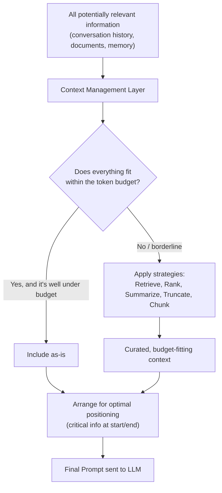
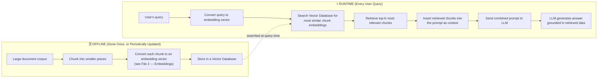
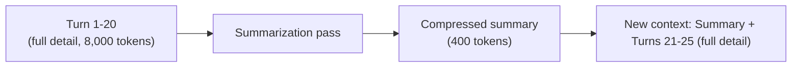

# 06 — Context Management

> **Series:** Prompt Engineering Knowledge Library
> **File 6 of 10** | **Level:** Beginner → Advanced
> **Prerequisites:** [`05_Context_Window.md`](./05_Context_Window.md)
> **Next:** [`07_Prompt_Anatomy.md`](./07_Prompt_Anatomy.md)

---

## Table of Contents

1. [Definition](#definition)
2. [Why It Matters](#why-it-matters)
3. [Core Concepts](#core-concepts)
4. [How It Works](#how-it-works)
5. [Internal Mechanism](#internal-mechanism)
6. [Types of Context Management Strategies](#types-of-context-management-strategies)
7. [Syntax / Structure](#syntax--structure)
8. [Examples (Simple → Advanced)](#examples-simple--advanced)
9. [Best Practices](#best-practices)
10. [Common Mistakes](#common-mistakes)
11. [Real-World Applications](#real-world-applications)
12. [Comparison with Related Concepts](#comparison-with-related-concepts)
13. [Advantages & Limitations](#advantages--limitations)
14. [FAQs](#faqs)
15. [Summary](#summary)
16. [Cheat Sheet](#cheat-sheet)
17. [Glossary](#glossary)
18. [References](#references)

---

## Definition

**Context Management** is the set of engineering strategies used to decide **what information goes into the [context window](./05_Context_Window.md)**, in what form, and in what order — so that a fixed, finite token budget is used as effectively as possible to produce accurate, reliable model output.

> If the context window (File 5) is the *constraint*, context management is the *discipline of working within it intelligently*. It answers the practical question: "I have more potentially relevant information than fits — what do I include, what do I leave out, how do I compress it, and how do I arrange it?"

Context management is not a single technique — it is an umbrella covering retrieval, summarization, truncation, memory systems, and structural arrangement, all aimed at the same goal: maximizing the *useful information density* of every token spent.

---

## Why It Matters

As covered in [File 5](./05_Context_Window.md), the context window is a hard, non-negotiable limit. Context management is what turns that limit from a system-breaking obstacle into a manageable engineering constraint:

- **Without it**, any real-world application with growing conversation history, large documents, or accumulated knowledge will eventually hit context overflow and simply break.
- **It directly controls output quality**, not just capacity — because of the "Lost in the Middle" effect (File 5), *how* you arrange and curate context measurably affects whether the model actually uses the right information, even when everything technically fits.
- **It controls cost** — every unnecessary token included in a request is unnecessary spend, at scale, across potentially millions of requests.
- **It is the foundation of advanced architectures** like RAG (Retrieval-Augmented Generation) and long-running AI agents, which are fundamentally context management systems built around an LLM core.

---

## Core Concepts

| Concept | Definition |
|---|---|
| **Context Curation** | The active, deliberate selection of what information is worth including, as opposed to including everything available by default |
| **Truncation** | Dropping content (often the oldest) that doesn't fit within budget |
| **Summarization (as context management)** | Compressing older or less-critical content into a shorter form to preserve its gist while freeing token budget |
| **Retrieval-Augmented Generation (RAG)** | An architecture that stores knowledge externally (in a searchable database) and retrieves only the most relevant pieces into the context window per-request, rather than trying to fit all knowledge at once |
| **Chunking** | Splitting large documents into smaller, retrievable pieces, sized appropriately for both retrieval precision and token budget |
| **Sliding Window (conversation)** | Retaining only the most recent N turns of a conversation, dropping older ones |
| **Memory System** | An application-layer mechanism (often a database) that persists important information *across* separate context windows/sessions, re-injecting relevant pieces as needed |
| **Context Compression** | Any technique that reduces the token footprint of information while attempting to preserve its usefulness (summarization, key-fact extraction, structural reformatting) |
| **Re-ranking** | Reordering retrieved/available content by relevance so the most important pieces occupy the most attention-reliable positions (start/end of context) |

---

## How It Works



Context management typically operates as a distinct engineering layer *between* raw available data (a full conversation log, a document database, a knowledge base) and the actual prompt sent to the model. It is application-level engineering, not something achieved through prompt wording alone.

---

## Internal Mechanism

### The core trade-off context management navigates

Every context management decision balances three competing goals:

```
        Completeness  ←——————→  Token Budget
              ↕
          Relevance/Quality
```

Including *more* context can improve completeness but costs more tokens and risks diluting relevance (per the "Lost in the Middle" effect). Including *less* context saves tokens but risks omitting something the model actually needed. Context management is the systematic practice of finding the best point on this trade-off for a given task.

### Mechanism: Retrieval-Augmented Generation (RAG), step by step

RAG is the most architecturally significant context management strategy in production LLM systems today. Here's exactly how it works mechanically:



**Why this solves the context window problem:** instead of trying to fit an entire knowledge base (which could be millions of tokens) into every single prompt, RAG fits only the *most relevant handful of chunks* (often just a few thousand tokens) — dynamically selected per query. This is the dominant real-world solution to "the model needs to know something too large to fit in context."

> **Vector Database:** A specialized database that stores embeddings (numeric vector representations of text) and can efficiently search for the vectors *most mathematically similar* to a given query vector — the technical engine that makes RAG's retrieval step fast even across millions of documents.

### Mechanism: Summarization-based history compression

For long-running conversations, a common pattern is to periodically compress older turns:



This trades some fidelity of older information for a dramatic reduction in token footprint, keeping the conversation viable indefinitely rather than hitting a hard wall.

---

## Types of Context Management Strategies

| Strategy | Description | Best For |
|---|---|---|
| **Truncation (Sliding Window)** | Drop oldest content when budget is exceeded | Simple chat applications where recent context matters most |
| **Summarization** | Compress older content into a shorter gist | Long-running conversations, ongoing agent sessions |
| **Retrieval-Augmented Generation (RAG)** | Store knowledge externally, retrieve only relevant pieces per query | Large knowledge bases, document Q&A, enterprise search |
| **Hierarchical Summarization** | Summarize summaries, creating multiple levels of compression for very long histories | Extremely long-running agents/sessions |
| **Chunking with Overlap** | Split documents into pieces with slight content overlap between chunks, preserving context at chunk boundaries | Document retrieval systems, avoiding mid-sentence/mid-idea cuts |
| **Re-ranking** | Reorder retrieved content by relevance, positioning the most important pieces at the start/end | Any system using multiple retrieved documents (counters Lost in the Middle) |
| **Selective Field Injection** | Include only specific structured fields from a data source (not the whole record) | Structured data systems (e.g., only relevant customer fields, not the entire database record) |
| **External Memory Systems** | Persist key facts/preferences in a database, re-injected as short, curated context in future sessions | AI agents, personal assistants requiring cross-session continuity |
| **Prompt Caching** | A provider-level optimization that reuses computation for repeated, unchanged portions of a prompt (e.g., a static system prompt) across multiple requests, improving cost/latency — an infrastructure-level context management technique | High-volume applications with stable system prompts |

---

## Syntax / Structure

Context management is implemented in application code, orchestrating calls to the LLM API alongside retrieval/storage systems. A simplified, illustrative pattern:

```python
def build_context(user_query, conversation_history, knowledge_base, token_budget):
    """
    Illustrative context management pipeline.
    """
    # 1. Reserve fixed budgets
    system_prompt_budget = 500
    output_budget = 2000
    remaining_budget = token_budget - system_prompt_budget - output_budget

    # 2. Retrieve relevant knowledge (RAG step)
    query_embedding = embed(user_query)
    retrieved_chunks = knowledge_base.search(query_embedding, top_k=8)

    # 3. Re-rank so most relevant chunks are at start/end (counter Lost in the Middle)
    retrieved_chunks = rerank_by_relevance(retrieved_chunks)

    # 4. Fit conversation history within remaining budget (summarize if needed)
    history_tokens = count_tokens(conversation_history)
    if history_tokens > remaining_budget * 0.3:
        conversation_history = summarize(conversation_history)

    # 5. Assemble final context, trimming retrieved chunks to fit what's left
    final_context = assemble(
        system_prompt=SYSTEM_PROMPT,
        history=conversation_history,
        documents=fit_to_budget(retrieved_chunks, remaining_budget),
        user_query=user_query
    )

    return final_context
```

---

## Examples (Simple → Advanced)

### Level 1 — Simple Sliding Window

```text
Chat application keeps only the last 10 message turns in context.
Turn 11 arrives → Turn 1 is dropped from the context sent to the model.
The model has no awareness Turn 1 ever happened, unless it was 
explicitly summarized and preserved beforehand.
```

### Level 2 — Basic Document Chunking for RAG

```text
Source: A 50-page product manual (~25,000 tokens)
Chunking strategy: split into ~500-token chunks, with 50-token overlap 
between consecutive chunks (to avoid cutting a relevant sentence in half 
at a chunk boundary).
Result: ~55 retrievable chunks stored in a vector database.

User question: "How do I reset the device to factory settings?"
→ System retrieves only the 2-3 chunks most semantically related to 
  "reset" and "factory settings" — not all 55 chunks.
→ Context sent to model: ~1,200 tokens of highly relevant material,
  instead of 25,000 tokens of mostly-irrelevant manual content.
```

### Level 3 — Summarization to Extend Conversation Life

```text
❌ Without context management:
Turn 50 of a long support conversation → full history = 45,000 tokens
→ Approaching context window limit; eventually fails or truncates 
  crudely (dropping oldest, potentially important, turns).

✅ With context management:
Every 10 turns, older turns are summarized:
"User previously reported a login issue on iOS, resolved by 
clearing app cache. Then asked about billing cycle, informed 
it renews on the 1st of each month."
→ 45,000 tokens of raw history compressed into ~150 tokens of summary,
  preserving key facts while freeing massive token budget for 
  continued conversation.
```

### Level 4 — Re-ranking to Counter "Lost in the Middle"

```text
RAG system retrieves 10 chunks for a query, ranked by relevance score:
Chunk relevance (highest to lowest): C1, C2, C3, C4, C5, C6, C7, C8, C9, C10

❌ Naive ordering (by retrieval order, not attention-optimized):
[C1, C2, C3, C4, C5, C6, C7, C8, C9, C10]
→ If C1 (most relevant) ends up positioned in the "middle" of the 
  final assembled prompt once system instructions and history are 
  added around it, retrieval reliability may suffer.

✅ Context-management-aware ordering:
Most relevant chunks placed at the very start AND end of the 
document block, less relevant ones sandwiched in the middle:
[C1, C3, C5, C7, C9, C10, C8, C6, C4, C2]
→ Directly applies the empirical finding from File 5 to maximize 
  the chance the model actually uses the most relevant content.
```

### Level 5 — Advanced: Multi-Layered Context Management in an AI Agent

```text
A long-running AI coding agent working on a large codebase across 
many hours needs several context management layers simultaneously:

1. WORKING MEMORY (context window, ~200K tokens):
   - Current file being edited (full content)
   - Immediate task instructions
   - Last 5 tool-call results

2. RETRIEVAL LAYER (RAG over the codebase):
   - Rather than loading the entire codebase, the agent retrieves 
     only the specific files/functions relevant to the current task, 
     via semantic or keyword search over an indexed codebase.

3. SUMMARIZED HISTORY:
   - Earlier work sessions/turns are compressed into a running 
     "progress log" summary (e.g., "Refactored auth module; 
     added tests for payment flow; TODO: fix rate limiter bug").

4. EXTERNAL PERSISTENT MEMORY:
   - Key project facts (coding conventions, architectural decisions) 
     stored in a separate file/database, retrieved and injected 
     only when relevant to the current task — not kept in context 
     at all times.

→ This layered approach allows the agent to operate effectively 
  across a task scope (an entire large codebase, potentially millions 
  of tokens of source code) that vastly exceeds any single context 
  window, by never trying to hold everything in working memory at once.
```
*This layered pattern — working memory + retrieval + summarized history + external persistent memory — is the standard architecture underlying essentially all production-grade long-running AI agents and assistants.*

---

## Best Practices

1. **Default to curation, not inclusion** — treat every piece of context as something that must earn its place in the token budget, not something to include "just in case."
2. **Chunk documents with overlap** to avoid losing meaning at chunk boundaries in RAG systems.
3. **Re-rank retrieved content** so the most relevant material sits at the start or end of the context, directly countering the "Lost in the Middle" effect.
4. **Summarize proactively, not reactively** — compress history before hitting hard limits, not only after a failure occurs.
5. **Separate "what the model needs to know" from "what happened"** — a full conversation log and a curated summary serve different purposes; know which one to inject.
6. **Measure retrieval quality, not just retrieval speed** — a fast RAG system that retrieves irrelevant chunks is worse than a slightly slower one that retrieves the right ones.
7. **Use prompt caching for stable, repeated content** (like a fixed system prompt) where the provider supports it, to reduce cost and latency across many requests.
8. **Test with realistic context loads**, not just small examples — context management failures often only appear at scale (long conversations, large document sets).

---

## Common Mistakes

| Mistake | Consequence | Fix |
|---|---|---|
| Including entire documents "just in case" instead of retrieving relevant sections | Wastes budget, risks Lost in the Middle degradation, increases cost | Use RAG/chunked retrieval instead of full-document inclusion by default |
| Naive truncation that drops the oldest content indiscriminately | Can lose critical early context (e.g., an important early instruction or fact) | Consider summarization instead of blind truncation for important history |
| No chunk overlap in document splitting | Relevant information split across a chunk boundary becomes unretrievable in either piece | Add reasonable overlap (e.g., 10-20% of chunk size) between chunks |
| Treating RAG as "install once, never revisit" | Retrieval quality degrades as the underlying knowledge base grows or content becomes outdated | Periodically evaluate and tune retrieval relevance; keep the knowledge base current |
| Ignoring positional effects when assembling multi-source context | Even well-retrieved content underperforms if buried in context middle | Apply re-ranking/positioning strategies |
| Summarizing without preserving specific critical details (e.g., exact numbers, names) | Summary loses precision needed for the task | Use structured extraction (preserve key fields explicitly) rather than purely narrative summarization for detail-critical use cases |

---

## Real-World Applications

- **Enterprise knowledge base chatbots** — RAG over internal documentation, wikis, and policies.
- **Customer support systems** — conversation summarization to maintain long support relationships without unbounded context growth.
- **AI coding agents** — retrieval over large codebases combined with working-memory management of the current task.
- **Legal/medical document analysis tools** — chunked retrieval over massive document sets that could never fit in a single context window.
- **Personal AI assistants** — external memory systems that persist user preferences/facts across sessions.
- **Search engines with AI-generated summaries** — retrieve top-ranked web results and synthesize an answer, a large-scale RAG pattern.
- **Multi-agent systems** — context management determines what each individual agent "sees" from a shared overall task state.

---

## Comparison with Related Concepts

| Concept | Relationship to Context Management |
|---|---|
| **Context Window (File 5)** | The context window is the fixed *constraint*; context management is the *set of strategies* for operating effectively within that constraint |
| **Fine-Tuning** | An alternative (or complementary) approach to teaching a model new knowledge — fine-tuning bakes knowledge into model weights permanently, while context management (especially RAG) supplies knowledge dynamically per-request without altering the model at all |
| **Prompt Engineering (general, File 1)** | Context management is a *specialized subset* of prompt engineering, focused specifically on the "what information to include and how to arrange it" problem, as opposed to instruction wording or format specification |
| **Caching (general software engineering concept)** | Prompt caching (a context management technique) applies the general software engineering concept of caching specifically to repeated, unchanged prompt segments |
| **Database Indexing** | Vector databases used in RAG are conceptually related to traditional database indexing — both aim to make retrieval of relevant data fast — but use semantic similarity search rather than exact-match/range queries |

---

## Advantages & Limitations

### ✅ Advantages of Strong Context Management

- **Enables working with effectively unlimited knowledge** — via RAG, an application can be "aware of" a knowledge base far larger than any context window, by retrieving only what's relevant per query.
- **Reduces cost** — sending only curated, relevant context instead of everything available directly reduces token spend.
- **Improves output reliability** — well-managed context (properly positioned, appropriately compressed) measurably improves the odds the model uses the right information correctly.
- **Enables long-running, stateful applications** — agents and assistants can operate coherently across sessions/timeframes far exceeding any single context window.

### ⚠️ Limitations

- **Added system complexity** — context management introduces additional engineering components (vector databases, summarization pipelines, ranking logic) beyond the LLM call itself, each a potential point of failure.
- **Retrieval is imperfect** — RAG systems can retrieve irrelevant chunks or miss relevant ones, especially with ambiguous queries or poorly chunked source data.
- **Summarization introduces information loss** — compression inherently discards some detail; poorly designed summarization can lose critical specifics.
- **No universal "best" strategy** — the right context management approach is highly task-dependent, requiring evaluation and tuning rather than a one-size-fits-all default.
- **Latency overhead** — retrieval and summarization steps add processing time compared to a single direct LLM call.

---

## FAQs

**Q: Is RAG the same thing as fine-tuning?**
A: No. RAG dynamically retrieves and injects relevant information into the prompt *at request time*, without changing the model's weights at all. Fine-tuning permanently modifies the model's internal weights through additional training. They solve related but distinct problems and can be used together.

**Q: Do I need a vector database for every context management use case?**
A: No — vector databases and RAG are specifically for scenarios involving retrieval from a large, searchable knowledge base. Simpler context management needs (like conversation history truncation or summarization) don't require this infrastructure at all.

**Q: How do I decide chunk size when building a RAG system?**
A: It's a trade-off: smaller chunks improve retrieval precision (less irrelevant content per chunk) but risk losing broader context; larger chunks preserve more surrounding context but reduce precision and cost more tokens per retrieved item. This typically requires empirical testing against your specific use case and documents.

**Q: Can context management fully solve the context window limitation?**
A: It can make the limitation manageable and largely invisible to end users for most practical purposes, but it cannot make the context window itself infinite — it works *around* the constraint through intelligent curation, not by eliminating it.

**Q: What's the difference between summarizing conversation history and using RAG?**
A: Summarization compresses information you already *have* (like past conversation turns) to save space. RAG retrieves information you *don't yet have in context* from an external store, based on relevance to the current query. They're complementary techniques often used together in the same system.

---

## Summary

Context management is the discipline of deciding what information enters the fixed, finite [context window](./05_Context_Window.md), in what form, and in what arrangement — because real-world applications almost always have more potentially relevant information than can fit at once. Its core strategies include truncation, summarization, chunking, re-ranking, and — most significantly — Retrieval-Augmented Generation (RAG), which stores knowledge externally in a vector database and retrieves only the most relevant pieces per query. Effective context management doesn't just prevent overflow errors; it directly improves output quality by curating relevant content and positioning it to counteract effects like "Lost in the Middle," making it the essential engineering layer that turns a fundamentally limited context window into the foundation for large-scale, long-running, knowledge-grounded AI applications.

---

## Cheat Sheet

```text
CONTEXT MANAGEMENT STRATEGY SELECTOR

Problem: Conversation growing too long
→ Solution: Sliding window + periodic summarization

Problem: Need to reference a large knowledge base
→ Solution: RAG (chunk + embed + retrieve)

Problem: Retrieved content not being used correctly by the model
→ Solution: Re-rank; position critical content at start/end

Problem: High cost from repeated stable content (e.g., system prompt)
→ Solution: Prompt caching (if supported by provider)

Problem: Need cross-session memory (facts, preferences)
→ Solution: External memory system (database) + selective re-injection
```

| Strategy | Solves | Adds |
|---|---|---|
| Truncation | Simplicity, hard limit compliance | Risk of losing important old content |
| Summarization | Long-term continuity | Some information loss |
| RAG | Access to knowledge beyond context size | Retrieval infrastructure complexity |
| Re-ranking | Positional attention reliability | Ranking logic overhead |
| Prompt Caching | Cost/latency on repeated content | Provider-specific support required |

---

## Glossary

| Term | Definition |
|---|---|
| **Context Management** | Strategies for selecting, arranging, and fitting information within the context window |
| **RAG (Retrieval-Augmented Generation)** | Architecture retrieving relevant external data per-query instead of fitting all knowledge in context |
| **Vector Database** | A database optimized for similarity search over embedding vectors |
| **Chunking** | Splitting large documents into smaller, retrievable pieces |
| **Summarization (context management sense)** | Compressing content to preserve gist while reducing token footprint |
| **Sliding Window** | Retaining only the most recent N turns/items, dropping older ones |
| **Re-ranking** | Reordering content by relevance to optimize positional attention reliability |
| **Prompt Caching** | Provider-level reuse of computation for repeated, unchanged prompt segments |
| **External Memory System** | A persistent store (e.g., database) holding information across separate context windows/sessions |

---

## References

- Lewis, P. et al. (2020) — *Retrieval-Augmented Generation for Knowledge-Intensive NLP Tasks*, arXiv:2005.11401
- Liu, N. F. et al. (2023) — *Lost in the Middle: How Language Models Use Long Contexts*, arXiv:2307.03172
- Anthropic — [Context Windows & Prompt Caching Documentation](https://docs.claude.com/en/docs/build-with-claude/prompt-caching)
- OpenAI — [Retrieval and RAG Cookbook](https://cookbook.openai.com/examples/retrieval)
- Google Cloud — [Vector Search / RAG Architecture Documentation](https://cloud.google.com/vertex-ai/docs/vector-search/overview)
- LangChain / LlamaIndex — Official documentation on chunking, retrieval, and memory patterns (framework-level implementations of these concepts)

---

**⬅️ Previous:** [`05_Context_Window.md`](./05_Context_Window.md)
**➡️ Next:** [`07_Prompt_Anatomy.md`](./07_Prompt_Anatomy.md) — The structural building blocks of an effective prompt.
