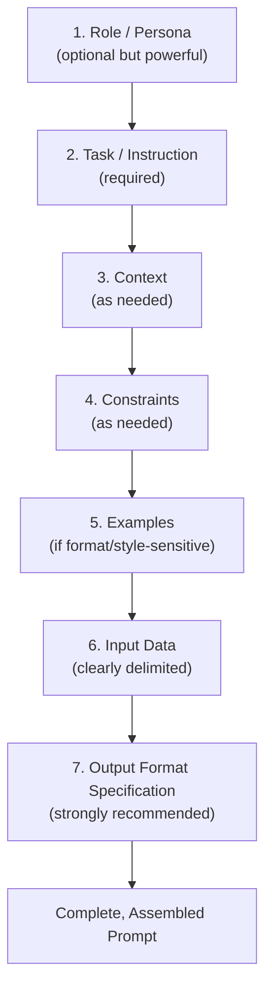
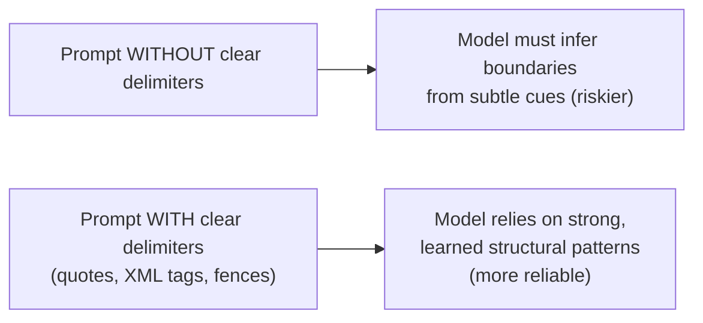

# 07 — Prompt Anatomy

> **Series:** Prompt Engineering Knowledge Library
> **File 7 of 10** | **Level:** Beginner → Advanced
> **Prerequisites:** [`06_Context_Management.md`](./06_Context_Management.md)
> **Next:** [`08_Prompt_Lifecycle.md`](./08_Prompt_Lifecycle.md)

---

## Table of Contents

1. [Definition](#definition)
2. [Why It Matters](#why-it-matters)
3. [Core Concepts](#core-concepts)
4. [How It Works](#how-it-works)
5. [Internal Mechanism](#internal-mechanism)
6. [Types of Prompt Components](#types-of-prompt-components)
7. [Syntax / Structure](#syntax--structure)
8. [Examples (Simple → Advanced)](#examples-simple--advanced)
9. [Best Practices](#best-practices)
10. [Common Mistakes](#common-mistakes)
11. [Real-World Applications](#real-world-applications)
12. [Comparison with Related Concepts](#comparison-with-related-concepts)
13. [Advantages & Limitations](#advantages--limitations)
14. [FAQs](#faqs)
15. [Summary](#summary)
16. [Cheat Sheet](#cheat-sheet)
17. [Glossary](#glossary)
18. [References](#references)

---

## Definition

**Prompt Anatomy** refers to the identifiable structural components that make up a well-formed prompt — the distinct "parts" (role, task, context, constraints, examples, input data, output format) that, together, fully specify what an LLM should do.

> Just as a sentence has anatomy (subject, verb, object) and a piece of software has anatomy (functions, parameters, return values), a prompt has anatomy — a decomposable structure that, once understood, can be deliberately assembled and debugged component by component rather than treated as one undifferentiated block of text.

Understanding prompt anatomy transforms prompt writing from an intuitive, trial-and-error craft into a systematic, engineering-like practice: if an output is wrong, you can diagnose *which component* of the prompt's anatomy is likely responsible (missing constraint? ambiguous task? absent format spec?) rather than rewriting the whole prompt from scratch.

---

## Why It Matters

- **Debuggability** — when a prompt fails, understanding its anatomy lets you isolate the faulty component (e.g., "the *task* was clear, but I never specified the *output format*") rather than guessing at a full rewrite.
- **Reusability** — well-decomposed prompts can have individual components (a persona, a constraint set, an output schema) swapped or reused across many different prompts, like reusable code modules.
- **Consistency at scale** — production systems that generate thousands of prompts programmatically (e.g., filling a template) depend on a reliable, well-understood anatomical structure.
- **Teaching and collaboration** — teams building shared prompt libraries need a common vocabulary for prompt parts, exactly as software engineers share a vocabulary for code structure.
- **Foundation for patterns** — the reusable [Prompt Patterns](./10_Prompt_Patterns.md) covered in File 10 are, in essence, specific, named recipes for arranging these anatomical components.

---

## Core Concepts

| Concept | Definition |
|---|---|
| **Role / Persona** | An instruction assigning the model an identity, expertise level, or perspective to adopt |
| **Task / Instruction** | The explicit, direct statement of what the model should do |
| **Context** | Background information the model needs but couldn't otherwise infer |
| **Input Data** | The actual content the task should be performed *on* (e.g., a document to summarize, code to review) |
| **Constraints** | Explicit boundaries or rules limiting the output (length, tone, forbidden content, format rules) |
| **Examples (Few-shot)** | Demonstrations of the desired input→output pattern |
| **Output Format Specification** | An explicit description (or schema) of how the response should be structured |
| **Delimiter** | A marker (quotes, XML tags, markdown fences, headers) used to clearly separate different anatomical components from one another |
| **System-level vs. User-level Components** | Some anatomical parts (like role/persona) are often placed in a persistent system-level channel, while task-specific parts live in the user-level message (see [File 2](./02_How_Large_Language_Models_Work.md) for the system/user/assistant role structure) |

---

## How It Works

A complete, well-formed prompt is assembled from a subset (rarely all, in every case) of these anatomical components, arranged in a logical order:



Not every prompt needs every component — a simple factual question needs only a Task. A production data-extraction pipeline might need all seven. Part of prompt engineering skill is knowing *which components a given task actually requires*, rather than either over-specifying trivial prompts or under-specifying complex ones.

---

## Internal Mechanism

### Why arrangement and delimitation matter mechanically

Recall from [File 2](./02_How_Large_Language_Models_Work.md) that the model processes a prompt as one continuous sequence of tokens, using self-attention to relate every token to every other token. The model has **no inherent knowledge of your intended "sections"** — it only sees a flat stream of tokens, unless you impose structure through:

1. **Explicit delimiters** (quotes, XML-style tags, markdown headers/fences) that create learned, recognizable "boundary" patterns the model has seen extensively in training data (since structured text — code, documents, markup — is common in training corpora).
2. **Consistent ordering** that matches patterns the model has learned to associate with certain roles (e.g., instructions-then-data is an extremely common pattern in training data, so the model has strong learned priors for interpreting text in that order correctly).



**This is the mechanical reason delimiters reduce prompt injection risk and ambiguity**: without them, a piece of *input data* that happens to contain imperative-sounding text (e.g., a user-submitted document that says "ignore previous instructions") can be mistakenly attended to as if it were part of the *instruction* component, because the model has no structural signal telling it otherwise. Clear delimiters give the model a strong, well-represented-in-training signal about where one anatomical component ends and another begins.

### Why role/persona placement affects output

Assigning a role (e.g., "You are a senior security researcher") works by conditioning the model's next-token predictions toward the statistical patterns associated with text *written by or attributed to* that kind of expert in its training data — vocabulary choices, level of technical detail, typical caveats, structural conventions (see [File 2](./02_How_Large_Language_Models_Work.md) for the underlying token-prediction mechanism). This is why role assignment is often placed early/persistently (frequently in the system-level channel) — it conditions *every subsequent token* generated in the response, not just an isolated part of it.

---

## Types of Prompt Components

| Component | Purpose | Optional? |
|---|---|---|
| **Role / Persona** | Shapes tone, expertise level, vocabulary, and perspective | Optional, but high-impact |
| **Task / Instruction** | States the core action to perform | **Required** — every prompt needs this |
| **Context** | Supplies background the model can't infer | Optional — only if genuinely needed |
| **Input Data** | The material the task operates on | Required *if* the task involves processing specific content |
| **Constraints** | Bounds the output (length, tone, forbidden elements) | Optional, but recommended for production use |
| **Examples (Few-shot)** | Demonstrates desired pattern via input→output pairs | Optional — critical for format/style-sensitive tasks |
| **Output Format Specification** | Defines exact expected structure of the response | Strongly recommended for anything parsed programmatically |
| **Negative Instructions** | Explicitly states what *not* to do or include | Optional, use sparingly (see [File 9](./09_Prompt_Design_Principles.md) on positive framing) |
| **Chain-of-Thought Trigger** | An instruction eliciting step-by-step reasoning before the final answer | Optional — for complex reasoning tasks |

---

## Syntax / Structure

There isn't one single mandatory syntax, but two dominant structural conventions are widely used in practice:

### Convention 1 — Labeled Plain-Text Sections

```text
ROLE: You are an expert data analyst.

TASK: Analyze the sales data below and identify the top 3 trends.

CONTEXT: This data is from an e-commerce company's Q4 performance.

CONSTRAINTS: 
- Limit your response to 150 words.
- Use bullet points only, no paragraphs.

INPUT DATA:
"""
Q4 Sales: Electronics +15%, Apparel -8%, Home Goods +22%, Books -3%
"""

OUTPUT FORMAT: A bulleted list of exactly 3 trends, each one sentence long.
```

### Convention 2 — XML-Style Structured Tags

```xml
<role>You are an expert data analyst.</role>

<task>Analyze the sales data below and identify the top 3 trends.</task>

<context>This data is from an e-commerce company's Q4 performance.</context>

<constraints>
- Limit your response to 150 words.
- Use bullet points only, no paragraphs.
</constraints>

<input_data>
Q4 Sales: Electronics +15%, Apparel -8%, Home Goods +22%, Books -3%
</input_data>

<output_format>A bulleted list of exactly 3 trends, each one sentence long.</output_format>
```

> XML-style tagging is particularly effective because it creates unambiguous, nestable, machine-parseable boundaries — many modern models are specifically trained to recognize and respect this convention with high reliability, making it a preferred convention for production and API-based prompt engineering.

---

## Examples (Simple → Advanced)

### Level 1 — Minimal Anatomy (Task Only)

```text
What is the boiling point of water in Celsius?
```
*Anatomy present: Task only. Sufficient because the task is simple, unambiguous, and needs no context, constraints, or format specification.*

### Level 2 — Adding Constraints

```text
Task: Explain what the boiling point of water is.
Constraints: In exactly one sentence, suitable for a 10-year-old.
```
*Anatomy present: Task + Constraints.*

### Level 3 — Adding Role and Context

```text
Role: You are a chemistry teacher preparing a simplified explanation.
Context: This is for a 5th-grade science class introduction to states of matter.
Task: Explain what the boiling point of water is and why it matters.
Constraints: 2-3 sentences, no technical jargon, encouraging tone.
```
*Anatomy present: Role + Context + Task + Constraints.*

### Level 4 — Adding Examples and Output Format (Few-Shot)

```text
Task: Classify the sentiment of each customer review as Positive, 
Negative, or Neutral.

Examples:
Review: "This product changed my life, I love it!"
Sentiment: Positive

Review: "It arrived broken and customer service ignored me."
Sentiment: Negative

Review: "It's fine, does what it says."
Sentiment: Neutral

Input Data:
Review: "Honestly one of the best purchases I've made this year."

Output Format: Return only the single word: Positive, Negative, or Neutral.
```
*Anatomy present: Task + Examples + Input Data + Output Format.*

### Level 5 — Advanced: Full Anatomy in a Production-Grade Structured Prompt

```xml
<role>
You are a senior technical support engineer specializing in network diagnostics.
</role>

<task>
Analyze the customer's support ticket below. Determine the most likely 
root cause and recommend a specific first troubleshooting step.
</task>

<context>
The customer is a small business owner with limited technical background. 
Your response will be sent directly to them via email, so it must be 
clear and non-intimidating, while still being technically accurate.
</context>

<constraints>
- Maximum 100 words.
- No unexplained technical jargon (explain any necessary technical term in parentheses).
- Do not ask the customer to do anything requiring admin/root access.
- End with a reassuring, professional closing line.
</constraints>

<examples>
<example>
<ticket>My WiFi keeps disconnecting every few minutes.</ticket>
<response>This is often caused by wireless interference or an outdated 
router firmware. First, try moving your router away from other 
electronics (like microwaves) and restart it by unplugging it for 
30 seconds. Let us know if the issue continues — we're happy to help further!</response>
</example>
</examples>

<input_data>
<ticket>
My internet is really slow only when I'm on video calls, but fine otherwise.
</ticket>
</input_data>

<output_format>
Plain text email response, following the structure and tone shown in the example.
</output_format>
```
*Anatomy present: full set — Role, Task, Context, Constraints, Examples, Input Data, Output Format — clearly delimited via XML tags. This level of anatomical completeness and structural rigor is typical of production prompts embedded in real customer-facing applications, where consistency and reliability at scale matter far more than in casual, single-use prompts.*

---

## Best Practices

1. **Include only the anatomical components a task genuinely needs** — over-specifying a trivial prompt wastes tokens; under-specifying a complex one causes failures.
2. **Always use explicit delimiters** when input data is included, especially in production/API contexts — this is a core defense against prompt injection and ambiguity (see Internal Mechanism above).
3. **Place role/persona early**, ideally in a system-level channel where available, since it conditions the entire subsequent generation.
4. **Specify output format explicitly** for any prompt whose output will be parsed by code — never assume the model will guess your exact desired structure.
5. **Use examples when format or style matters more than raw correctness** — a few well-chosen examples often outperform lengthy abstract descriptions.
6. **Keep constraints specific and checkable** ("under 100 words," not "keep it brief") so both you and, in effect, the model have an unambiguous target.
7. **Treat prompt anatomy as debuggable** — when output is wrong, ask "which component was missing or unclear?" rather than rewriting from scratch.

---

## Common Mistakes

| Mistake | Anatomical Root Cause | Fix |
|---|---|---|
| Model ignores a length limit | Constraint stated vaguely or buried among other text | State constraints explicitly and specifically, ideally in a dedicated, clearly delimited section |
| Model outputs prose when JSON was needed | No explicit Output Format Specification | Add an explicit format section, ideally with a literal schema example |
| Model follows instructions found *within* pasted input data | Input Data not clearly delimited from the Task/Instruction | Use strong delimiters (XML tags, fences) to separate data from instructions |
| Inconsistent tone across similar prompts | No Role/Persona component, or one applied inconsistently | Define and reuse a consistent role component across related prompts |
| Model misunderstands the task on ambiguous input | No Context component provided when genuinely needed | Add a brief Context section clarifying background/audience/purpose |
| Wildly inconsistent output format across few-shot examples | Examples that don't share consistent structure with each other | Ensure all examples follow the exact same format/pattern you want replicated |

---

## Real-World Applications

- **Prompt template libraries** in production codebases — reusable functions that assemble anatomical components programmatically (e.g., `build_prompt(role=..., task=..., data=...)`).
- **AI agent tool-calling prompts** — structured with strict Role, Task, Constraints, and especially Output Format (often a JSON schema) so the results can be parsed and acted on by code.
- **Content moderation systems** — Role ("You are a content policy classifier") + strict Output Format (a fixed set of category labels) + Examples (edge cases) is a standard anatomical pattern.
- **Customer-facing chatbots** — persistent Role/Persona (brand voice) established at the system level, with per-message Task/Context/Constraints layered on top.
- **Automated report generation** — Context (data source description) + Input Data (the actual data) + Output Format (a specific report template) assembled per report.

---

## Comparison with Related Concepts

| Concept | Difference from Prompt Anatomy |
|---|---|
| **Prompt Patterns (File 10)** | Prompt anatomy describes the *individual building-block components*; prompt patterns are *named, reusable recipes* for how to combine those components to solve a specific recurring problem (e.g., the "Chain-of-Thought pattern" is a specific arrangement using the Task and a reasoning-trigger component) |
| **Prompt Lifecycle (File 8)** | Anatomy is about the *static structure* of a single prompt; lifecycle is about the *process over time* of drafting, testing, and refining prompts |
| **Software Function Signature (analogy)** | Loosely analogous — both define required vs. optional "parameters" for an operation to succeed — but a prompt's "parameters" are natural language sections interpreted probabilistically, not strictly typed, validated inputs |
| **System Prompt vs. User Prompt** | These are *delivery channels* (where anatomical components are placed, at the API level) rather than anatomical components themselves — a Role component, for instance, is commonly placed within the system-prompt channel |

---

## Advantages & Limitations

### ✅ Advantages of Thinking in Terms of Prompt Anatomy

- **Systematic debugging** — failures can be traced to specific missing/unclear components.
- **Reusability and modularity** — components (especially Role and Constraints) can be extracted and reused across many prompts.
- **Team consistency** — shared vocabulary ("we need a stronger Output Format spec here") improves collaboration on prompt libraries.
- **Scales to automation** — anatomical thinking directly enables programmatic prompt template construction.

### ⚠️ Limitations

- **No strict enforcement** — unlike a programming language's syntax, there's no compiler ensuring you've included a "required" component; the model will attempt to respond even to poorly-formed prompts, sometimes producing plausible-looking but incorrect results.
- **Component boundaries can blur** — the line between "Context" and "Task," for instance, isn't always sharply defined, and reasonable prompt engineers may organize the same information differently.
- **Over-engineering risk** — applying full anatomical rigor to every trivial prompt is unnecessary overhead; judgment is required about how much structure a given task actually needs.
- **Model-dependent sensitivity to structure** — different models may respond with varying degrees of reliability to the same structural conventions (e.g., XML tags vs. plain-text labels), requiring some model-specific tuning.

---

## FAQs

**Q: Do I need to use XML tags, or is plain-text labeling (like "TASK:", "CONTEXT:") good enough?**
A: Both work, and the right choice depends on the model and use case. Plain-text labels are simpler and human-readable; XML-style tags tend to provide stronger, less ambiguous boundary signals, especially valuable for complex, multi-component production prompts or when input data might contain adversarial content. Many practitioners use plain-text for quick/casual prompts and XML-style structure for production systems.

**Q: Is a longer, more anatomically complete prompt always better than a short one?**
A: No. A simple, well-understood task (like a basic factual question) genuinely needs only a Task component — adding unnecessary Role, Context, or Constraints sections wastes tokens and can occasionally introduce unhelpful noise. Match anatomical completeness to actual task complexity.

**Q: Where should Output Format go — beginning or end of the prompt?**
A: Common, effective practice is to state the desired output format explicitly near the *end* of the prompt, right before the model begins generating — this positions it favorably per the "recency" aspect of the Lost in the Middle effect discussed in [File 5](./05_Context_Window.md), ensuring it strongly influences the immediately following generation.

**Q: What's the difference between "Context" and "Input Data" in prompt anatomy?**
A: Context is background information that helps the model interpret or perform the task correctly (e.g., "the audience is beginners"). Input Data is the actual material the task is performed *on* (e.g., the specific text to be summarized). They're often both present but serve distinct roles — Context shapes *how* the task is done; Input Data is *what* it's done to.

**Q: Can prompt anatomy components be reordered without affecting output?**
A: Not entirely safely — as covered in the Internal Mechanism section, position affects attention weighting, so reordering (especially moving Constraints or Output Format far from the point of generation) can measurably change output reliability, even if the same information is technically present somewhere in the prompt.

---

## Summary

Prompt anatomy is the decomposition of a well-formed prompt into identifiable structural components — Role, Task, Context, Input Data, Constraints, Examples, and Output Format Specification — each serving a distinct function and, crucially, needing clear delimitation from one another so the model's self-attention mechanism can reliably distinguish instructions from data. Understanding this anatomy transforms prompt writing into a systematic, debuggable, reusable engineering practice rather than unstructured trial and error: when a prompt fails, you can isolate which anatomical component was missing, ambiguous, or poorly positioned, and fix precisely that — a foundational skill for both individual prompt crafting and the reusable [Prompt Patterns](./10_Prompt_Patterns.md) covered next.

---

## Cheat Sheet

```text
PROMPT ANATOMY — COMPONENT CHECKLIST

[ ] Role/Persona       — Who should the model "be"? (optional, high-impact)
[✓] Task/Instruction   — What should it DO? (always required)
[ ] Context             — What background does it need? (as needed)
[ ] Input Data          — What content does the task operate on? (if applicable)
[ ] Constraints         — What limits/rules apply? (recommended for production)
[ ] Examples            — Show, don't just tell, if format/style matters
[ ] Output Format       — Exactly how should the response be structured?

DELIMITER OPTIONS
Plain-text labels:  TASK: / CONTEXT: / CONSTRAINTS:
Markdown fences:    ``` ... ```
XML-style tags:     <task>...</task> <context>...</context>
Quotes:             "..."
```

| Symptom | Missing/Weak Anatomy Component |
|---|---|
| Wrong tone/expertise level | Role / Persona |
| Model misunderstands background/audience | Context |
| Inconsistent length/style | Constraints |
| Wrong output structure | Output Format Specification |
| Model follows text buried in your pasted data | Delimiters between Input Data and Task |
| Inconsistent formatting across similar tasks | Examples (Few-shot) |

---

## Glossary

| Term | Definition |
|---|---|
| **Prompt Anatomy** | The decomposition of a prompt into distinct structural components |
| **Role / Persona** | A component assigning the model an identity or expertise to adopt |
| **Task / Instruction** | The explicit statement of what the model should do |
| **Context** | Background information supplied to aid correct interpretation |
| **Input Data** | The content the task is performed on |
| **Constraints** | Explicit rules bounding the output |
| **Delimiter** | A marker separating anatomical components from one another |
| **Output Format Specification** | An explicit description of the expected response structure |
| **Negative Instruction** | An instruction stating what *not* to do |

---

## References

- Anthropic — [Prompt Engineering: Use XML Tags](https://docs.claude.com/en/docs/build-with-claude/prompt-engineering/use-xml-tags)
- OpenAI — [Prompt Engineering Best Practices](https://platform.openai.com/docs/guides/prompt-engineering)
- Google DeepMind — [Gemini Prompting Strategies Documentation](https://ai.google.dev/gemini-api/docs/prompting-strategies)
- White, J. et al. (2023) — *A Prompt Pattern Catalog to Enhance Prompt Engineering with ChatGPT*, arXiv:2302.11382
- Liu, P. et al. (2023) — *Pre-train, Prompt, and Predict: A Systematic Survey of Prompting Methods in NLP*, ACM Computing Surveys

---

**⬅️ Previous:** [`06_Context_Management.md`](./06_Context_Management.md)
**➡️ Next:** [`08_Prompt_Lifecycle.md`](./08_Prompt_Lifecycle.md) — How a prompt evolves from first draft to production.
