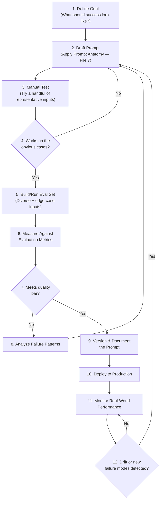
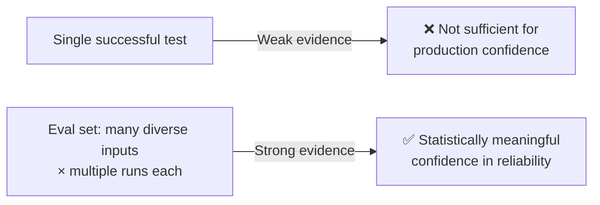

# 08 — Prompt Lifecycle

> **Series:** Prompt Engineering Knowledge Library
> **File 8 of 10** | **Level:** Beginner → Advanced
> **Prerequisites:** [`07_Prompt_Anatomy.md`](./07_Prompt_Anatomy.md)
> **Next:** [`09_Prompt_Design_Principles.md`](./09_Prompt_Design_Principles.md)

---

## Table of Contents

1. [Definition](#definition)
2. [Why It Matters](#why-it-matters)
3. [Core Concepts](#core-concepts)
4. [How It Works](#how-it-works)
5. [Internal Mechanism](#internal-mechanism)
6. [Types of Prompt Lifecycle Models](#types-of-prompt-lifecycle-models)
7. [Syntax / Structure](#syntax--structure)
8. [Examples (Simple → Advanced)](#examples-simple--advanced)
9. [Best Practices](#best-practices)
10. [Common Mistakes](#common-mistakes)
11. [Real-World Applications](#real-world-applications)
12. [Comparison with Related Concepts](#comparison-with-related-concepts)
13. [Advantages & Limitations](#advantages--limitations)
14. [FAQs](#faqs)
15. [Summary](#summary)
16. [Cheat Sheet](#cheat-sheet)
17. [Glossary](#glossary)
18. [References](#references)

---

## Definition

The **Prompt Lifecycle** is the complete, repeatable process a prompt goes through — from initial goal definition, through drafting, testing, evaluation, and refinement, to deployment and ongoing maintenance — analogous to the software development lifecycle (SDLC) applied specifically to prompt engineering.

> A prompt is not a one-time creative writing exercise — in any serious application, it is a **versioned artifact** that gets tested against real inputs, evaluated against measurable criteria, deployed, monitored, and revised over time as models update, requirements change, or edge cases are discovered.

```
Goal → Draft → Test → Evaluate → Refine → Deploy → Monitor → (back to Refine)
```

---

## Why It Matters

Treating prompts as disposable, one-off text rather than as engineered, lifecycle-managed artifacts is one of the most common reasons AI-powered features fail in production:

- **Prompts silently break** — a prompt that worked perfectly during development can fail on edge cases never tested, or degrade when the underlying model is updated by the provider.
- **Quality requires iteration, not intuition** — even experienced prompt engineers rarely get a complex production prompt right on the first attempt; the lifecycle formalizes the *expectation* of iteration rather than treating it as failure.
- **Reproducibility and accountability** — without version control and documented evaluation criteria, teams cannot reliably answer "why did we change this prompt?" or "is this new version actually better?"
- **Scale demands process** — a single developer can informally iterate on a prompt in a chat window; a production system serving millions of requests needs a formal, auditable, repeatable lifecycle.
- **Models change underneath you** — since prompt engineering targets a specific model's learned behavior (see [File 2](./02_How_Large_Language_Models_Work.md)), and providers periodically update or deprecate models, a prompt lifecycle must include ongoing monitoring and revalidation, not just a one-time launch.

---

## Core Concepts

| Concept | Definition |
|---|---|
| **Prompt Draft** | An initial or intermediate version of a prompt, not yet validated |
| **Test Set / Eval Set** | A curated collection of representative (and edge-case) inputs used to evaluate a prompt's performance |
| **Evaluation Metric** | A measurable criterion for judging output quality (accuracy, format compliance, tone, latency, cost) |
| **Prompt Versioning** | Tracking distinct iterations of a prompt over time, analogous to source code version control |
| **A/B Testing (for prompts)** | Running two or more prompt variants against real or simulated traffic to compare performance |
| **Regression** | A previously-passing test case that fails after a prompt change — a critical signal requiring investigation |
| **Prompt Drift** | Gradual degradation in prompt performance over time, often due to underlying model updates, changing input distributions, or scope creep |
| **Golden Examples** | A small set of high-confidence, manually verified input/output pairs used as a strong quality baseline during evaluation |
| **Deployment** | Making a validated prompt version live in a production system |
| **Monitoring** | Ongoing observation of a deployed prompt's real-world performance and failure patterns |

---

## How It Works



This is fundamentally a **feedback loop with defined checkpoints**, not a strictly linear one-time process — the arrows back to earlier stages are not exceptions to the lifecycle, they *are* the lifecycle, exactly as iteration is a normal, expected part of the software development lifecycle rather than a sign of failure.

---

## Internal Mechanism

### Why prompts require testing infrastructure, not just "trying it once"

Because LLM output is **probabilistic** (see [File 2](./02_How_Large_Language_Models_Work.md) — sampling and temperature), a prompt that produces a good result once is not proof it will consistently produce good results. Rigorous prompt lifecycle management requires running a prompt against the *same test input multiple times* (to assess consistency) and against a *diverse range of inputs* (to assess generalization) — a single successful trial provides very weak evidence of production readiness.



### Why evaluation must be defined *before* extensive drafting

A subtle but critical lifecycle discipline: defining evaluation criteria (Step 1, "Define Goal," translated into measurable metrics) *before* heavy iteration begins prevents a common failure mode where a prompt engineer unconsciously tunes a prompt to "look good" on whatever informal examples they happen to be glancing at, without a rigorous, pre-committed standard — a prompt-engineering-specific version of the general scientific principle of pre-registering evaluation criteria to avoid biased, post-hoc judgment of results.

### Why deployed prompts need ongoing monitoring (not just pre-launch testing)

Because prompt behavior depends on a specific model's learned statistical patterns, and because real-world input distributions shift over time (new slang, new products, new edge cases users actually send that weren't anticipated during testing), a prompt that passed evaluation at launch can degrade — a phenomenon called **prompt drift**. Additionally, if the underlying model itself is updated or replaced by the provider (common in the industry, as newer model versions are periodically released), the exact same prompt text can produce measurably different output distributions, since the model's learned weights have changed even though the prompt's tokens have not.

---

## Types of Prompt Lifecycle Models

| Model | Description | Best For |
|---|---|---|
| **Ad-hoc / Exploratory Lifecycle** | Informal, single-user iteration in a chat interface, no formal versioning or eval set | Personal use, early exploration, one-off tasks |
| **Structured Manual Lifecycle** | Defined test cases, manual review checkpoints, basic version tracking (e.g., in a shared document) | Small teams, early-stage products |
| **Automated Eval-Driven Lifecycle** | Formal eval sets run programmatically, quantitative metrics, CI/CD-style gating before deployment | Production systems, teams with engineering rigor |
| **Continuous Monitoring Lifecycle** | Adds real-time production monitoring, automated drift/regression detection, and feedback loops from live usage back into the eval set | Large-scale, high-stakes production systems |
| **A/B Tested Lifecycle** | Multiple prompt variants run simultaneously against live (segmented) traffic, with statistical comparison before full rollout | Optimization-focused products with sufficient traffic volume |

---

## Syntax / Structure

While there's no universal "syntax," prompt lifecycle management is commonly implemented using structured documentation and code-like version control practices:

```yaml
# Example: A prompt version record (illustrative structure)
prompt_id: customer_support_classifier
version: v3.2
created_date: 2026-06-15
author: prompt-eng-team
model_target: model-name-v2

changelog: >
  v3.2: Added explicit constraint against suggesting refunds directly;
  fixes regression found in v3.1 where model occasionally promised 
  refunds without escalation.

evaluation_results:
  eval_set: customer_support_v4 (250 examples)
  accuracy: 94.2%
  format_compliance: 99.6%
  regressions_vs_v3.1: 0
  known_failure_modes:
    - "Struggles with sarcasm in ~3% of negative-sentiment tickets"

status: deployed
deployed_date: 2026-06-18
```

```python
# Example: a simple automated eval harness pattern
def run_eval(prompt_template, eval_set):
    results = []
    for example in eval_set:
        output = call_llm(prompt_template.format(input=example["input"]))
        passed = evaluate(output, example["expected_criteria"])
        results.append({"input": example["input"], "passed": passed, "output": output})
    
    accuracy = sum(r["passed"] for r in results) / len(results)
    return accuracy, results

accuracy, results = run_eval(current_prompt_v3, eval_set_v4)
print(f"Accuracy: {accuracy:.1%}")
failures = [r for r in results if not r["passed"]]
```

---

## Examples (Simple → Advanced)

### Level 1 — Informal, Single-User Lifecycle

```text
1. Goal: "I want a prompt that writes a catchy email subject line."
2. Draft: "Write a catchy subject line for this email: [email text]"
3. Test: Try it on 3 different emails, read the results.
4. Refine: Add "Keep it under 8 words" after noticing outputs run long.
5. Done: Use the refined prompt going forward.
```
*This is a valid, appropriately lightweight lifecycle for a low-stakes, personal-use task — full automated evaluation infrastructure would be overkill here.*

### Level 2 — Small Team, Structured Manual Lifecycle

```text
1. Goal: A prompt that classifies support tickets into 5 categories, 
   with >90% agreement against human-labeled examples.
2. Draft: Initial prompt with Role + Task + the 5 category definitions.
3. Test: Run against 20 manually-labeled example tickets.
4. Evaluate: 15/20 correct (75%) — below the 90% target.
5. Analyze: Most errors are "Billing" tickets misclassified as "Technical."
6. Refine: Add explicit distinguishing examples for Billing vs. Technical 
   in a few-shot section (applying File 7 — Prompt Anatomy).
7. Re-test: 19/20 correct (95%) — meets target.
8. Deploy: Document the final prompt version in a shared team doc.
```

### Level 3 — Automated Eval-Driven Lifecycle

```text
1. Goal: Defined quantitatively — F1 score ≥ 0.92 on a 500-example 
   held-out eval set for a sentiment classification prompt.
2. Draft: v1 of the prompt.
3. Automated Eval: Script runs v1 against all 500 examples, computes F1.
   Result: F1 = 0.87 — below target.
4. Analyze: Automated breakdown shows most errors are in "Neutral" 
   sentiment class (frequently confused with "Positive").
5. Refine: v2 adds explicit few-shot examples of ambiguous Neutral cases.
6. Automated Eval: F1 = 0.93 — meets target, zero regressions on 
   previously-passing examples.
7. Version & Deploy: v2 committed to the prompt repository, deployed.
8. CI/CD Gate: Future prompt changes automatically re-run this eval 
   set before any deployment is permitted.
```

### Level 4 — A/B Tested Lifecycle in Production

```text
1. Goal: Improve user satisfaction ratings for an AI writing assistant's 
   "make this more concise" feature.
2. Current prompt (Control, v4): baseline satisfaction rating = 3.8/5.
3. Draft Challenger (v5): Restructures the prompt to explicitly 
   preserve key technical terms (a pattern from File 9 — Design Principles).
4. Offline Eval: v5 passes the existing eval set with no regressions.
5. A/B Test: v5 deployed to 10% of live traffic for 2 weeks, 
   v4 remains control for the other 90%.
6. Measure: v5 achieves 4.3/5 satisfaction vs. v4's 3.8/5 — 
   statistically significant improvement.
7. Full Rollout: v5 promoted to 100% of traffic, v4 formally deprecated 
   and archived (not deleted — retained for rollback capability).
```

### Level 5 — Advanced: Continuous Monitoring Lifecycle with Drift Detection

```text
1. Prompt v6 deployed for a legal document summarization feature, 
   passing all evals at launch (accuracy 96%, format compliance 99%).

2. MONITORING (ongoing, automated):
   - Sample 2% of live production outputs weekly for human spot-review.
   - Track format-compliance failure rate automatically (parseable JSON).
   - Track user-reported "regenerate" button clicks as an implicit 
     quality signal.

3. WEEK 8 — DRIFT DETECTED:
   - Format-compliance rate has silently dropped from 99% to 91%.
   - Investigation reveals the underlying model provider released 
     a new model version that the API now defaults to, and this 
     newer model interprets the existing output-format instruction 
     slightly differently.

4. RESPONSE (feeds back into the lifecycle):
   - This is treated as a new "Draft" trigger, not a bug report to ignore.
   - Prompt is re-evaluated against the eval set using the new model version.
   - Output Format section (per File 7) is tightened with a stricter, 
     more explicit schema example to restore compliance.
   - Full re-evaluation confirms 99%+ compliance restored on the new model.
   - New version (v7) deployed, changelog documents the root cause 
     (model version change) for future institutional knowledge.

5. This cycle — monitor, detect drift, re-enter the lifecycle, redeploy 
   — repeats indefinitely for the life of the production feature. 
   The lifecycle never truly "ends" for an actively-used production prompt.
```
*This illustrates why the Prompt Lifecycle diagram's feedback loops aren't edge cases — for any long-lived production system, continuous re-entry into earlier lifecycle stages is the normal, expected steady state, not a failure of the original design.*

---

## Best Practices

1. **Define measurable success criteria before heavy iteration begins** — avoid unconsciously tuning to informal, un-pre-committed judgment.
2. **Build a diverse eval set early**, including realistic edge cases, not just the "happy path" examples that first come to mind.
3. **Version every meaningful prompt change**, with a changelog explaining *why* the change was made — treat prompts with the same rigor as source code.
4. **Test for regressions, not just new-case improvements** — a change that fixes one failure mode but breaks a previously-passing case is not a net improvement.
5. **Monitor deployed prompts continuously**, not just at launch — prompt drift and model updates are ongoing realities, not one-time launch risks.
6. **Match lifecycle rigor to stakes** — a personal, low-stakes prompt doesn't need a full CI/CD eval pipeline; a production system serving real users and real consequences does.
7. **Retain deprecated prompt versions** (don't delete) for rollback capability and historical analysis when investigating regressions.
8. **Separate "prompt is wrong" from "model output was probabilistically unlucky"** — use multiple runs per test case, not single trials, when the difference matters.

---

## Common Mistakes

| Mistake | Consequence | Fix |
|---|---|---|
| Treating a single successful test as proof of readiness | False confidence; hidden failure modes surface in production | Build and run a genuine, diverse eval set before deployment |
| No versioning of prompt changes | Cannot answer "why did we change this?" or safely roll back a regression | Version prompts like code, with changelogs |
| Only testing "happy path" inputs | Edge cases (empty input, adversarial input, unusual formatting) fail silently in production | Deliberately include edge cases and known failure-prone categories in the eval set |
| No post-deployment monitoring | Prompt drift and model updates go undetected until users complain | Implement ongoing sampling/monitoring of live outputs |
| Defining success criteria informally, after seeing initial results | Biased, retroactively-justified sense of "good enough" | Pre-commit to measurable criteria before extensive iteration |
| Deleting old prompt versions | No rollback path if a new version causes unexpected issues | Archive, don't delete, deprecated versions |

---

## Real-World Applications

- **Prompt engineering teams at AI product companies** — maintain formal prompt repositories with versioning, eval suites, and deployment gates, directly mirroring standard software CI/CD practice.
- **AI feature rollouts in existing software products** — A/B testing prompt variants against real user satisfaction and task-completion metrics before full rollout.
- **Model migration projects** — when a company switches or upgrades the underlying LLM provider/version, the entire prompt lifecycle (re-draft, re-test, re-evaluate) must typically be re-run for every production prompt, since behavior can shift even with identical prompt text.
- **Regulated industries (finance, healthcare, legal)** — formal documentation of the prompt lifecycle (versioning, evaluation criteria, sign-off records) is often required for audit and compliance purposes.
- **Open-source prompt libraries** — community-maintained prompt collections increasingly include structured eval sets and version history, mirroring open-source software project conventions.

---

## Comparison with Related Concepts

| Concept | Difference from Prompt Lifecycle |
|---|---|
| **Prompt Anatomy (File 7)** | Anatomy describes a single prompt's *static structure*; lifecycle describes the *process over time* by which that structure is drafted, tested, and evolved |
| **Software Development Lifecycle (SDLC)** | The direct conceptual parent — prompt lifecycle applies the same disciplined process (define, build, test, deploy, monitor, iterate) specifically to prompts as the artifact, rather than to source code generally |
| **MLOps (Machine Learning Operations)** | A broader discipline covering the lifecycle of trained models (data pipelines, training, deployment, monitoring); prompt lifecycle is a related but distinct discipline, since prompt engineering doesn't involve training new model weights, only iterating on input design |
| **Continuous Integration / Continuous Deployment (CI/CD)** | A software engineering practice that automated eval-driven prompt lifecycles directly borrow from — automated test gates before deployment |

---

## Advantages & Limitations

### ✅ Advantages of a Formal Prompt Lifecycle

- **Higher production reliability** — systematic testing catches failure modes before real users encounter them.
- **Auditability and accountability** — versioning and documented evaluation provide a clear record of what changed, why, and with what measured impact.
- **Faster, safer iteration** — a good eval set allows confident, rapid experimentation, since regressions are caught automatically rather than discovered by users.
- **Resilience to model updates** — a mature monitoring stage catches drift caused by underlying model changes before it causes significant user-facing harm.

### ⚠️ Limitations

- **Overhead for simple use cases** — building a full eval-driven lifecycle for a single, low-stakes personal prompt is disproportionate effort.
- **Eval sets are imperfect proxies** — a prompt that scores well on an eval set can still fail on genuinely novel real-world inputs not represented in that set; eval sets require ongoing curation, not a one-time build.
- **Probabilistic output complicates "passing" a test** — unlike deterministic software testing, a single output failing a test case doesn't always mean the prompt is broken (see Internal Mechanism above on multiple-run testing).
- **Resource-intensive at scale** — comprehensive automated evaluation, especially with human-reviewed golden examples, requires meaningful time and cost investment to build and maintain properly.

---

## FAQs

**Q: Do I need a formal lifecycle for every prompt I write?**
A: No — lifecycle rigor should scale with stakes. A one-off prompt for personal use warrants an informal, lightweight process (Level 1 in the examples above). A prompt embedded in a production system serving real users, especially in regulated or high-consequence domains, warrants the full structured, monitored lifecycle.

**Q: How is prompt versioning different from just saving old copies of a prompt in a text file?**
A: The core difference is *systematic linkage* to evaluation results and deployment status — a mature versioning practice records not just the prompt text itself, but what eval results that version achieved, when/whether it was deployed, and why it was changed from the prior version, enabling informed decisions and safe rollback.

**Q: What should I do if a prompt that passed evaluation still fails on a real user's input in production?**
A: Treat this as valuable new information, not a lifecycle failure — add the failing case (once understood/reproduced) to your eval set, so the fix can be verified against it and future regressions on this same case are automatically caught.

**Q: How often should a deployed prompt be re-evaluated?**
A: There's no universal fixed interval — re-evaluation should be triggered by specific events (a known underlying model update, observed performance drift in monitoring, a significant shift in user input patterns) rather than purely a calendar schedule, though periodic scheduled review (e.g., quarterly) is also common practice as a safety net.

**Q: Is A/B testing necessary for prompt lifecycle management?**
A: Not always — A/B testing is most valuable when you have sufficient live traffic volume to reach statistical significance and when the metric you care about (like user satisfaction) can't be fully captured by offline evaluation alone. Smaller-scale projects often rely primarily on offline eval sets instead.

---

## Summary

The Prompt Lifecycle is the disciplined, iterative process — goal definition, drafting, testing, evaluation, refinement, deployment, and ongoing monitoring — that treats a prompt as a versioned, testable engineering artifact rather than a one-off piece of text, directly mirroring the software development lifecycle applied to this specific domain. Because LLM output is probabilistic and underlying models are periodically updated by providers, a mature lifecycle explicitly includes continuous, ongoing monitoring and feedback loops, not just pre-launch testing — treating deployment as a milestone within an ongoing process rather than an endpoint. Matching lifecycle rigor to actual stakes (lightweight for personal use, fully automated and monitored for production systems) is itself a core lifecycle skill, setting up the concrete, evidence-based writing techniques covered next in [File 9 — Prompt Design Principles](./09_Prompt_Design_Principles.md).

---

## Cheat Sheet

```text
PROMPT LIFECYCLE — STAGE CHECKLIST

[ ] 1. GOAL      — Define measurable success criteria FIRST
[ ] 2. DRAFT     — Apply Prompt Anatomy (File 7)
[ ] 3. TEST      — Try representative examples manually
[ ] 4. EVAL SET  — Build/run against diverse + edge-case inputs
[ ] 5. MEASURE   — Score against pre-defined metrics
[ ] 6. ANALYZE   — Understand failure patterns, not just pass/fail
[ ] 7. REFINE    — Targeted fixes based on analysis
[ ] 8. VERSION   — Document changes, retain history
[ ] 9. DEPLOY    — Ship the validated version
[ ] 10. MONITOR  — Ongoing — never truly "done" for live systems
```

| Lifecycle Rigor Level | Use When |
|---|---|
| Ad-hoc (Level 1) | Personal, one-off, low-stakes tasks |
| Structured Manual (Level 2) | Small team, early-stage product |
| Automated Eval-Driven (Level 3) | Production system, engineering team |
| A/B Tested (Level 4) | Sufficient live traffic, optimization focus |
| Continuous Monitoring (Level 5) | Large-scale, long-lived, high-stakes production |

---

## Glossary

| Term | Definition |
|---|---|
| **Prompt Lifecycle** | The full iterative process of drafting, testing, deploying, and maintaining a prompt |
| **Eval Set** | A curated collection of test inputs used to measure prompt performance |
| **Evaluation Metric** | A measurable criterion for judging output quality |
| **Prompt Versioning** | Systematic tracking of distinct prompt iterations over time |
| **A/B Testing** | Comparing two+ prompt variants against real or simulated traffic |
| **Regression** | A previously-passing test case that fails after a change |
| **Prompt Drift** | Gradual performance degradation over time |
| **Golden Examples** | High-confidence, manually verified reference input/output pairs |
| **Deployment** | Making a validated prompt version live |
| **Monitoring** | Ongoing observation of deployed prompt performance |

---

## References

- Anthropic — [Prompt Engineering Overview & Iteration Guidance](https://docs.claude.com/en/docs/build-with-claude/prompt-engineering/overview)
- OpenAI — [Evaluating Model Outputs (Evals Framework)](https://platform.openai.com/docs/guides/evals)
- Google — [Responsible AI: Testing and Evaluation Practices](https://ai.google/responsibility/)
- Zaharia, M. et al. (2024) — *The Shift from Models to Compound AI Systems*, Berkeley Artificial Intelligence Research (BAIR) Blog (relevant discussion of evaluation-driven LLM system design)
- Humble, J. & Farley, D. — *Continuous Delivery* (foundational SDLC/CI-CD concepts adapted to prompt engineering practice)

---

**⬅️ Previous:** [`07_Prompt_Anatomy.md`](./07_Prompt_Anatomy.md)
**➡️ Next:** [`09_Prompt_Design_Principles.md`](./09_Prompt_Design_Principles.md) — Evidence-based rules for writing effective prompts.
