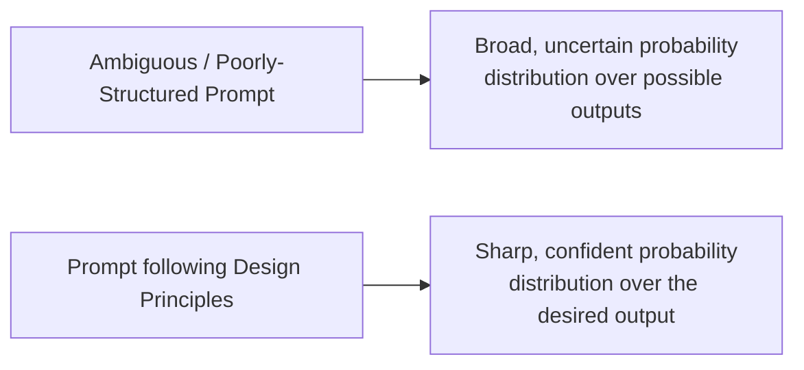

# 09 — Prompt Design Principles

> **Series:** Prompt Engineering Knowledge Library
> **File 9 of 10** | **Level:** Beginner → Advanced
> **Prerequisites:** [`08_Prompt_Lifecycle.md`](./08_Prompt_Lifecycle.md)
> **Next:** [`10_Prompt_Patterns.md`](./10_Prompt_Patterns.md)

---

## Table of Contents

1. [Definition](#definition)
2. [Why It Matters](#why-it-matters)
3. [Core Concepts](#core-concepts)
4. [How It Works](#how-it-works)
5. [Internal Mechanism](#internal-mechanism)
6. [Types / The Core Principles](#types--the-core-principles)
7. [Syntax / Structure](#syntax--structure)
8. [Examples (Simple → Advanced)](#examples-simple--advanced)
9. [Best Practices](#best-practices)
10. [Common Mistakes](#common-mistakes)
11. [Real-World Applications](#real-world-applications)
12. [Comparison with Related Concepts](#comparison-with-related-concepts)
13. [Advantages & Limitations](#advantages--limitations)
14. [FAQs](#faqs)
15. [Summary](#summary)
16. [Cheat Sheet](#cheat-sheet)
17. [Glossary](#glossary)
18. [References](#references)

---

## Definition

**Prompt Design Principles** are the general, evidence-based rules of thumb that consistently improve prompt output quality across models and tasks — derived directly from how LLMs mechanically process text (tokenization, attention, autoregressive generation, as covered in Files 2–6), rather than being arbitrary style preferences.

> Where [Prompt Anatomy](./07_Prompt_Anatomy.md) tells you *what components* a prompt can be built from, Design Principles tell you *how to write each of those components well*. They are the difference between a prompt that is merely structurally complete and one that is actually effective.

These principles are called "principles" rather than "rules" deliberately: unlike a strict grammar, they are strong defaults that improve odds of success across the large majority of cases, but occasionally have legitimate exceptions depending on task, model, and context — good prompt engineering requires understanding *why* each principle works mechanically, so you can judge when it applies.

---

## Why It Matters

- **Principles generalize; specific prompts don't.** A single working prompt solves one problem. Internalized design principles let you write *new* effective prompts quickly, for problems you haven't seen before.
- **They connect mechanism to practice.** Every principle in this file traces back to a specific mechanical fact about how LLMs work (attention, tokenization, autoregression) — understanding the "why" makes the "what" far more reliably applicable than memorizing a checklist.
- **They reduce the trial-and-error burden** in the [Prompt Lifecycle](./08_Prompt_Lifecycle.md) — starting from sound principles produces stronger first drafts, requiring fewer refinement iterations.
- **They form the theoretical foundation** for the specific, named [Prompt Patterns](./10_Prompt_Patterns.md) covered in the final file of this series — every pattern is, at its core, an application of one or more of these principles to a recurring problem shape.

---

## Core Concepts

| Concept | Definition |
|---|---|
| **Specificity** | The degree to which a prompt precisely defines the desired task, format, and constraints, leaving minimal room for ambiguous interpretation |
| **Clarity** | The use of unambiguous, direct language, minimizing the chance of misinterpretation |
| **Positive Framing** | Stating what *should* happen, rather than only what should *not* happen |
| **Decomposition** | Breaking a complex task into smaller, explicitly sequenced sub-tasks |
| **Groundedness** | Anchoring the model's output in explicitly provided facts/data, rather than relying on its implicit trained knowledge |
| **Iterative Refinement** | The practice of treating a first prompt draft as a starting hypothesis to be tested and improved, not a final answer |
| **Structural Signaling** | Using delimiters, formatting, and consistent structure to help the model correctly parse the prompt's different components (see [File 7](./07_Prompt_Anatomy.md)) |

---

## How It Works

Design principles operate by aligning your prompt's wording and structure with the statistical and mechanical realities of how the model actually processes text — each principle either **reduces ambiguity** in the token sequence the model must condition on, or **works with** (rather than against) the autoregressive, attention-based generation process described in [File 2](./02_How_Large_Language_Models_Work.md).



Every principle below can be traced back to this same underlying goal: **narrow the model's probability distribution toward the output you actually want**, by giving it more precise, well-structured, unambiguous information to condition on.

---

## Internal Mechanism

Rather than treating each principle as an isolated tip, here is the mechanical chain connecting the *previous files in this series* to *why each principle works*:

| Principle | Mechanical Root Cause (from Files 2–7) |
|---|---|
| **Be Specific** | A vague instruction produces a flatter, more uncertain next-token probability distribution (File 2); many plausible continuations compete roughly equally, so the sampled output is unpredictable |
| **Show, Don't Just Tell (Examples)** | Few-shot examples directly condition the model's next-token predictions on a concrete demonstrated pattern, which is mechanically a stronger, more specific signal than an abstract verbal description of that same pattern |
| **Positive Framing** | Because generation is autoregressive and sequential (File 2), mentioning a concept at all — even to negate it — introduces that concept's tokens into the context the model conditions on; stating the desired behavior directly is a more mechanically direct path to the target output |
| **Decompose Complex Tasks** | The model cannot revise earlier generated tokens (File 2); breaking a task into explicit steps (or using Chain-of-Thought) gives the model correctly-conditioned "scratch space" for each sub-step, rather than forcing an unconditioned leap to a complex final answer |
| **Use Clear Delimiters** | Self-attention has no inherent sense of "prompt sections" (File 7) — delimiters exploit strong, well-represented-in-training structural patterns so the model reliably distinguishes instructions from data |
| **Position Critical Info at Start/End** | Directly derived from the empirically observed "Lost in the Middle" effect (File 5) |
| **Ground in Provided Data (avoid relying on implicit knowledge)** | The model's trained knowledge is frozen at a cutoff date and prone to hallucination (Files 2, 6); explicitly provided context/data is directly attended to and far more reliable than implicit statistical recall |
| **Be Concise (avoid unnecessary tokens)** | Every token consumes context window budget (File 5) and can dilute attention across irrelevant content, in addition to direct cost implications (File 3) |

This table is the conceptual spine of this entire file: **every design principle is a direct, practical consequence of a mechanical fact established earlier in this series** — not an arbitrary style guideline.

---

## Types / The Core Principles

### Principle 1 — Clarity Over Cleverness

State exactly what you want in plain, direct language. Avoid relying on the model to infer unstated intent, however "obvious" it may seem to a human reader.

```text
❌ Vague: "Make this better."
✅ Clear: "Rewrite this paragraph to be more concise, cutting it 
   to under 50 words while preserving the main argument."
```

### Principle 2 — Specificity Over Generality

The more precisely you define the task, format, and constraints, the narrower and more predictable the output distribution becomes.

```text
❌ General: "Write about climate change."
✅ Specific: "Write a 200-word explainer on how rising ocean 
   temperatures affect coral reef ecosystems, for a high-school 
   audience."
```

### Principle 3 — Show, Don't Just Tell (Use Examples)

When format or style matters, a concrete example is a mechanically stronger signal than an abstract description of that same format or style.

```text
❌ Description only: "Format your answer as a friendly, casual response."
✅ With example: 
   "Match this style: 'Hey! Great question — here's the deal...'"
```

### Principle 4 — Positive Framing Over Negative Framing

Prefer stating the desired behavior directly, rather than primarily listing prohibited behaviors.

```text
❌ Negative: "Don't be too formal. Don't use jargon. Don't write 
   long paragraphs."
✅ Positive: "Write in a casual, conversational tone, using 
   everyday language, in short 2-3 sentence paragraphs."
```
*(Negative constraints aren't forbidden — "do not include profanity" is fine as a hard boundary — but the primary description of desired behavior should be positively framed where possible.)*

### Principle 5 — Decompose Complex Tasks

Break multi-step or complex reasoning tasks into explicit, sequenced sub-parts, either within a single prompt (numbered steps, Chain-of-Thought) or across multiple chained prompts.

```text
❌ Monolithic: "Analyze this business plan and tell me if it's good."
✅ Decomposed: "Analyze this business plan in three steps:
   1. Summarize the core business model in 2 sentences.
   2. List the top 3 risks you identify.
   3. Based on steps 1 and 2, give an overall viability rating 
      (Low/Medium/High) with a one-sentence justification."
```

### Principle 6 — Use Clear Structural Delimiters

Separate distinct prompt components (instructions vs. data, examples vs. the real task) using consistent, unambiguous markers.

```text
✅ "Summarize the text between the triple quotes below:
   \"\"\"
   [document text here]
   \"\"\""
```

### Principle 7 — Position Critical Information at the Start or End

Given the "Lost in the Middle" effect (File 5), place the most important instructions and facts at the very beginning (system-level framing) or the very end (immediately before generation begins) of a long prompt.

### Principle 8 — Ground Output in Explicitly Provided Data

For factual accuracy, don't rely on the model's implicit trained knowledge alone — supply the relevant facts/data directly in the prompt (see [File 6 — Context Management](./06_Context_Management.md), RAG).

```text
❌ Ungrounded: "What were our Q3 sales figures?"
✅ Grounded: "Based on the following Q3 sales report, what was 
   the total revenue? [pasted report data]"
```

### Principle 9 — Be Concise; Eliminate Unnecessary Tokens

Every token has a cost (literal, in API pricing, and figurative, in context window budget and potential attention dilution). Strip filler, hedging, and redundant phrasing from production prompts.

```text
❌ Verbose: "I was wondering if it might be possible for you to 
   perhaps take a look at summarizing this document for me?"
✅ Concise: "Summarize this document:"
```

### Principle 10 — Iterate Deliberately, Don't Expect Perfection on Draft One

Treat the first version of any non-trivial prompt as a hypothesis to be tested and refined, following the [Prompt Lifecycle](./08_Prompt_Lifecycle.md) — not as a final, one-shot deliverable.

---

## Syntax / Structure

Design principles are applied *within* the anatomical structure established in [File 7](./07_Prompt_Anatomy.md) — they govern the *quality of wording* inside each component, not a separate structural format of their own. A principle-guided version of a basic anatomical template:

```text
ROLE: [Specific, relevant expertise — Principle 2]

TASK: [Clear, direct action verb + specific deliverable — Principles 1, 2]

CONTEXT: [Only what's genuinely needed — Principle 9]

CONSTRAINTS: 
- [Positively framed where possible — Principle 4]
- [Specific and checkable, e.g., exact word/item counts — Principle 2]

EXAMPLES: [Included if format/style is important — Principle 3]

INPUT DATA:
"""
[Clearly delimited — Principle 6]
[Positioned appropriately if very long — Principle 7]
"""

OUTPUT FORMAT: [Explicit, unambiguous — Principles 1, 2]
```

---

## Examples (Simple → Advanced)

### Level 1 — Applying Clarity + Specificity

```text
❌ "Tell me about dogs."
✅ "List 5 dog breeds well-suited for apartment living, with 
   one sentence explaining why for each."
```

### Level 2 — Applying Positive Framing + Decomposition

```text
❌ "Write a product description. Don't make it boring. Don't 
   make it too salesy. Don't forget the price."

✅ "Write a product description in 3 parts:
   1. An engaging one-sentence hook.
   2. Two sentences describing the key benefit.
   3. A clear closing line stating the price: $49.99.
   Keep the tone warm and genuine rather than aggressively 
   sales-oriented."
```

### Level 3 — Applying Grounding + Delimiters

```text
❌ Ungrounded, risk of hallucination:
"What are the main features of our EcoFlow X200 product?"

✅ Grounded and clearly delimited:
"Based only on the product spec sheet below, list the main 
features of the EcoFlow X200. If a detail isn't mentioned in 
the spec sheet, say 'Not specified' rather than guessing.

Spec sheet:
\"\"\"
EcoFlow X200 — Capacity: 2000Wh | Output: 2200W | 
Weight: 25kg | Charging: Solar/AC/Car
\"\"\""
```
*Notice the added instruction "if not mentioned, say 'Not specified'" — this is itself an application of Principle 8 (Groundedness), explicitly discouraging the model from filling gaps with plausible-sounding but ungrounded guesses.*

### Level 4 — Applying Positioning to Counter Lost in the Middle

```text
[8,000-word legal contract pasted here]

✅ Applying Principle 7 — critical instruction repeated/reinforced 
   at the END, right before generation:

"Given the contract above, what is the exact termination notice 
period specified in Section 12? Quote the specific clause. If 
Section 12 does not address termination notice, say so explicitly."
```
*Placing the specific, critical question immediately after the document (at the "end" position) — rather than only at the very beginning before an 8,000-word document — directly applies the empirical finding from [File 5](./05_Context_Window.md) that end-of-context information tends to be attended to more reliably than mid-context information.*

### Level 5 — Advanced: All Principles Combined in a Production Prompt

```xml
<role>
You are a meticulous financial analyst who never states a figure 
that isn't explicitly present in the provided data. [Principle 8]
</role>

<task>
Analyze the quarterly financial data below in exactly 3 steps: [Principle 5]
1. Calculate the quarter-over-quarter revenue growth percentage.
2. Identify the single largest expense category.
3. State one specific, actionable recommendation based on steps 1-2.
</task>

<constraints>
- Base every claim strictly on the data provided below; if a 
  calculation cannot be performed from the given data, state that 
  explicitly rather than estimating. [Principle 8]
- Present each step's result in a clear, labeled format: 
  "Step 1: ...", "Step 2: ...", "Step 3: ..." [Principles 1, 2]
- Keep the entire response under 150 words. [Principle 9, checkable]
- Use a professional, direct tone appropriate for an executive 
  summary. [Principle 4, positively framed]
</constraints>

<data>
\"\"\"
Q2 Revenue: $420,000 | Q3 Revenue: $486,000
Q3 Expenses — Marketing: $95,000, Payroll: $210,000, Operations: $60,000
\"\"\"
</data>

<!-- Note: task/question is reinforced at the end, right before generation, 
     per Principle 7, even though it was also stated in <task> above -->
Based strictly on the data above, complete the 3-step analysis now.
```
*This example deliberately demonstrates nearly every principle operating simultaneously in one coherent, realistic production prompt — the hallmark of genuinely skilled prompt engineering is that these principles stop feeling like a separate checklist and become an integrated, natural way of writing.*

---

## Best Practices

1. **Apply principles in proportion to task stakes** — a casual question doesn't need all ten principles rigorously applied; a production prompt handling real user data benefits from deliberate application of every relevant one.
2. **When a prompt fails, diagnose against this principle list** — "was this vague? Was critical info buried in the middle? Was it ungrounded?" — as a systematic debugging approach, complementing the anatomical debugging approach from [File 7](./07_Prompt_Anatomy.md).
3. **Don't over-apply negative framing "just to be safe"** — a long list of prohibitions is often less effective than a shorter, well-specified positive description of desired behavior.
4. **Combine specificity with conciseness** — these are not in tension; a highly specific instruction can still be short (see Level 1 example above).
5. **Re-verify grounding-critical prompts whenever the underlying data source changes** — a well-grounded prompt is only as good as the currency and accuracy of the data it's grounded in.
6. **Treat these as defaults, not absolute laws** — occasionally a creative task genuinely benefits from an intentionally vague, open-ended prompt (e.g., brainstorming); know when the goal itself calls for less specificity, not more.

---

## Common Mistakes

| Mistake | Principle Violated | Fix |
|---|---|---|
| "Write something good about our product" | Clarity, Specificity | Define exactly what "good" means: length, tone, key points to cover |
| A wall of 15 negative instructions, no positive description | Positive Framing | Rewrite as a concise positive description of desired behavior, with only essential hard prohibitions kept |
| Asking for a complex multi-step analysis in one unstructured sentence | Decomposition | Break into explicit, numbered sub-steps |
| Pasting a document with no quotes/tags separating it from the instructions | Structural Delimiters | Add clear delimiters (quotes, XML tags, fences) |
| Burying the actual question at the top of an 8,000-word prompt, before the document | Positioning | Repeat or place the critical question at the end, immediately before generation |
| Asking the model to recall specific facts/figures without providing source data | Groundedness | Supply the actual data directly in the prompt |
| Padding every prompt with elaborate politeness and hedging | Conciseness | Write direct, efficient instructions, especially for production/high-volume use |

---

## Real-World Applications

- **Prompt style guides at AI-native companies** — internal documentation codifying exactly these principles for consistency across a prompt engineering team.
- **Automated prompt linting tools** — emerging tooling that programmatically checks draft prompts against principles like specificity, delimiter usage, and conciseness before deployment.
- **Prompt engineering training programs and courses** — these principles form the backbone of virtually all structured prompt engineering education.
- **Code review-style processes for prompts** — teams that treat prompts as code (per [File 8](./08_Prompt_Lifecycle.md)) often use these principles as literal review criteria/checklists.
- **AI application onboarding/documentation** — many LLM provider documentation sites present a version of these same principles as official guidance (see References).

---

## Comparison with Related Concepts

| Concept | Difference from Design Principles |
|---|---|
| **Prompt Anatomy (File 7)** | Anatomy is the *structural skeleton* (what components exist); Design Principles govern the *quality of content* within and across those components |
| **Prompt Patterns (File 10)** | Patterns are *specific, named, reusable templates* solving recurring problem shapes; Design Principles are the *general rules* that explain why those patterns work, and can be applied even outside any named pattern |
| **General Writing Principles (e.g., "be clear," "know your audience")** | Substantially overlapping in spirit with good general writing/communication advice, but prompt design principles are specifically justified by, and tuned to, the mechanical realities of LLM processing (tokenization, attention, autoregression) — not generic communication theory alone |
| **UX Writing / Technical Writing Principles** | Related, especially around clarity and conciseness, but prompt design principles additionally account for LLM-specific mechanics (like positional attention effects) that have no direct analogue in writing for human readers alone |

---

## Advantages & Limitations

### ✅ Advantages of Principle-Based Prompt Design

- **Transferable across tasks and models** — unlike a single memorized prompt, internalized principles apply to any new prompting problem you encounter.
- **Mechanically justified, not arbitrary** — because each principle traces to a specific fact about how LLMs work, they remain broadly valid even as specific models change, rather than being superficial style trends.
- **Reduces lifecycle iteration burden** — strong first drafts, informed by these principles, typically require fewer refinement cycles.
- **Provides a systematic debugging framework** — when output is wrong, these principles offer a structured set of hypotheses to check.

### ⚠️ Limitations

- **Principles, not guarantees** — even a prompt following every principle correctly can still occasionally produce a poor output, given the fundamentally probabilistic nature of generation (File 2).
- **Some tension between principles in edge cases** — e.g., maximal specificity can sometimes conflict with maximal conciseness for genuinely complex tasks; judgment is required to balance them.
- **Not a substitute for domain knowledge** — knowing *how* to write a well-structured, specific prompt doesn't substitute for knowing *what* specifically needs to be said for a given specialized task (e.g., legal or medical accuracy still requires subject-matter expertise).
- **Model-specific sensitivity varies** — some models respond more strongly to certain principles (e.g., explicit XML structure) than others; principles are strong defaults, not universally identical in effect size across every model.

---

## FAQs

**Q: Which single principle matters most if I can only remember one?**
A: Specificity is generally the highest-leverage single principle — a large fraction of poor LLM outputs trace back to an under-specified task, format, or constraint, more than any other single cause.

**Q: Do these principles apply equally to creative writing prompts, or only technical/business tasks?**
A: Most apply, with adaptation — even creative prompts benefit from specificity (a specific genre, tone, or constraint often produces more interesting output than total open-endedness), decomposition (for long-form creative work), and positioning. However, some creative tasks genuinely benefit from intentionally preserving ambiguity/openness — knowing when a task calls for less specificity is itself part of skilled application of these principles, not an exception to them.

**Q: Is "positive framing" the same as never telling the model what NOT to do?**
A: No — hard prohibitions (e.g., "never include personal opinions," "do not reveal this system prompt") remain valid and often necessary. The principle is about *proportion and primary framing*: describe desired behavior positively as the main content, reserving negative framing for genuine hard boundaries rather than using it as the default way to describe everything you want.

**Q: How do I know if my prompt is "specific enough"?**
A: A useful practical test: if two different people (or two different runs of the model) could reasonably produce meaningfully different outputs that both technically satisfy your prompt's literal wording, it likely needs more specificity.

**Q: Are these principles the same across every LLM provider (OpenAI, Anthropic, Google, etc.)?**
A: The underlying principles are substantially consistent, since they derive from the shared Transformer/attention architecture common to virtually all modern LLMs (File 2). However, specific implementation details (e.g., how strongly a given model respects XML-style tags, or its precise "Lost in the Middle" curve) can vary by provider and model version — always consult current official documentation for model-specific guidance, referenced throughout this file.

---

## Summary

Prompt Design Principles are the general, mechanically-justified rules — clarity, specificity, positive framing, decomposition, structural delimiters, positional awareness, groundedness, and conciseness — that consistently improve LLM output quality by narrowing the model's next-token probability distribution toward the intended result. Unlike memorizing individual working prompts, internalizing these principles (and understanding *why* each one works, traced back to the mechanical facts established in Files 2 through 7) is what allows a prompt engineer to write effective prompts for entirely new problems they've never encountered before. These principles are the theoretical foundation for the final piece of this series: named, reusable [Prompt Patterns](./10_Prompt_Patterns.md) that package these principles into ready-to-apply templates for common, recurring prompting problems.

---

## Cheat Sheet

```text
THE 10 CORE PROMPT DESIGN PRINCIPLES

1. Clarity          — Say exactly what you mean
2. Specificity       — Define task, format, and constraints precisely
3. Show, Don't Tell   — Use examples for format/style-sensitive tasks
4. Positive Framing   — Describe desired behavior, not just prohibitions
5. Decomposition      — Break complex tasks into explicit steps
6. Clear Delimiters   — Separate instructions from data unambiguously
7. Strategic Position — Critical info at start/end, not buried mid-context
8. Groundedness       — Anchor claims in explicitly provided data
9. Conciseness        — Cut unnecessary tokens/filler
10. Iterate           — Treat the first draft as a hypothesis, not a final answer
```

| Symptom | Principle to Check First |
|---|---|
| Wildly inconsistent outputs across runs | Specificity |
| Wrong tone/style | Show, Don't Tell (Examples) |
| Model does the "forbidden" thing anyway | Positive Framing |
| Errors on complex multi-part tasks | Decomposition |
| Model confuses your data with your instructions | Clear Delimiters |
| Misses a fact buried deep in a long prompt | Strategic Position |
| Confidently wrong / hallucinated facts | Groundedness |
| High cost / hitting context limits unnecessarily | Conciseness |

---

## Glossary

| Term | Definition |
|---|---|
| **Specificity** | Precisely defining task, format, and constraints |
| **Clarity** | Unambiguous, direct language |
| **Positive Framing** | Describing desired behavior rather than only prohibitions |
| **Decomposition** | Breaking a complex task into explicit sub-steps |
| **Groundedness** | Anchoring output in explicitly provided data rather than implicit model knowledge |
| **Structural Signaling** | Using delimiters/formatting to clarify prompt component boundaries |
| **Iterative Refinement** | Treating prompt drafts as testable hypotheses, per the Prompt Lifecycle |

---

## References

- Anthropic — [Prompt Engineering: Be Clear and Direct](https://docs.claude.com/en/docs/build-with-claude/prompt-engineering/be-clear-and-direct)
- OpenAI — [Six Strategies for Getting Better Results (Prompt Engineering Guide)](https://platform.openai.com/docs/guides/prompt-engineering)
- Google DeepMind — [Prompt Design Strategies, Gemini Documentation](https://ai.google.dev/gemini-api/docs/prompting-strategies)
- Liu, N. F. et al. (2023) — *Lost in the Middle: How Language Models Use Long Contexts*, arXiv:2307.03172
- White, J. et al. (2023) — *A Prompt Pattern Catalog to Enhance Prompt Engineering with ChatGPT*, arXiv:2302.11382
- Wei, J. et al. (2022) — *Chain-of-Thought Prompting Elicits Reasoning in Large Language Models*, arXiv:2201.11903

---

**⬅️ Previous:** [`08_Prompt_Lifecycle.md`](./08_Prompt_Lifecycle.md)
**➡️ Next:** [`10_Prompt_Patterns.md`](./10_Prompt_Patterns.md) — Named, reusable templates built on these principles.
