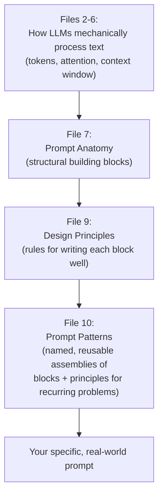

# 10 — Prompt Patterns

> **Series:** Prompt Engineering Knowledge Library
> **File 10 of 10** | **Level:** Beginner → Advanced
> **Prerequisites:** [`09_Prompt_Design_Principles.md`](./09_Prompt_Design_Principles.md)
> **Series Complete.** See also: [`11_Context_Injection.md`](./11_Context_Injection.md) · [`12_Instruction_Hierarchy.md`](./12_Instruction_Hierarchy.md)

---

## Table of Contents

1. [Definition](#definition)
2. [Why It Matters](#why-it-matters)
3. [Core Concepts](#core-concepts)
4. [How It Works](#how-it-works)
5. [Internal Mechanism](#internal-mechanism)
6. [Types of Prompt Patterns](#types-of-prompt-patterns)
7. [Syntax / Structure](#syntax--structure)
8. [Examples (Simple → Advanced)](#examples-simple--advanced)
9. [Best Practices](#best-practices)
10. [Common Mistakes](#common-mistakes)
11. [Real-World Applications](#real-world-applications)
12. [Comparison with Related Concepts](#comparison-with-related-concepts)
13. [Advantages & Limitations](#advantages--limitations)
14. [FAQs](#faqs)
15. [Summary](#summary)
16. [Cheat Sheet](#cheat-sheet)
17. [Glossary](#glossary)
18. [References](#references)

---

## Definition

A **Prompt Pattern** is a named, reusable, generalized template for solving a *recurring category* of prompting problem — analogous to a **design pattern** in software engineering (e.g., "Singleton," "Observer"). Where [Prompt Anatomy](./07_Prompt_Anatomy.md) describes the building blocks and [Design Principles](./09_Prompt_Design_Principles.md) describe the rules for writing each block well, a Prompt Pattern is a specific, battle-tested *assembly* of those blocks and principles, packaged under a memorable name so it can be recognized, taught, and reused instantly.

> Just as a software engineer doesn't reinvent "how to safely share a single resource across a program" every time — they reach for the Singleton pattern — a prompt engineer doesn't reinvent "how to get a model to reason through a hard problem" from scratch every time — they reach for the **Chain-of-Thought pattern**.

```
Prompt Pattern = Problem Category + Named Solution Template + When/Why to Use It
```

---

## Why It Matters

- **Speed** — recognizing "this is a Chain-of-Thought problem" or "this is a Self-Consistency problem" lets you skip straight to a proven structure, rather than starting from a blank page every time.
- **Reliability** — patterns are refined, tested solutions to *known* failure modes; using one avoids re-discovering the same pitfalls other prompt engineers have already solved.
- **Communication** — naming patterns gives teams shared vocabulary ("let's add a Self-Consistency check here") exactly as software design pattern names do, dramatically speeding up collaboration and code/prompt review.
- **Composability** — patterns can be combined (e.g., Role Prompting + Chain-of-Thought + Structured Output, all in one prompt), and understanding them as discrete, nameable units makes combination deliberate rather than accidental.
- **This file is the capstone of the series** — every pattern below is, explicitly, an applied combination of the tokens/context mechanics (Files 2–6), anatomical components (File 7), and design principles (File 9) covered throughout this library. Patterns are where all nine prior files converge into direct, practical technique.

---

## Core Concepts

| Concept | Definition |
|---|---|
| **Pattern** | A named, reusable template solving a specific, recurring prompting problem category |
| **Problem Category** | The general *type* of challenge a pattern addresses (e.g., "the model needs to reason through multiple steps") |
| **Template** | The generalized structural skeleton of the pattern, with placeholders for task-specific content |
| **Composability** | The ability to combine multiple patterns within a single prompt |
| **Trigger Phrase** | A specific wording (e.g., "Let's think step by step") empirically shown to reliably activate a pattern's intended behavior |
| **Anti-pattern** | A common but counterproductive prompting habit — the inverse of a pattern; a known-bad approach to avoid |

---

## How It Works

Patterns sit at the top of a conceptual hierarchy built across this entire series:



When you face a new prompting problem, the practical workflow is:

1. **Identify the problem category** — is this a reasoning problem? A formatting problem? A consistency problem? A knowledge-grounding problem?
2. **Select the matching pattern(s)** from the catalog below.
3. **Instantiate the pattern** with your specific task details, applying [Prompt Anatomy](./07_Prompt_Anatomy.md) structure and [Design Principles](./09_Prompt_Design_Principles.md) wording.
4. **Test and refine** via the [Prompt Lifecycle](./08_Prompt_Lifecycle.md).

---

## Internal Mechanism

Every pattern below works because it exploits a *specific* mechanical property of LLMs established earlier in this series. This table is the key that connects each named pattern back to its underlying mechanism — understanding this is what separates someone who has *memorized* patterns from someone who can *invent new ones* when an existing pattern doesn't quite fit.

| Pattern | Mechanical Basis |
|---|---|
| **Chain-of-Thought** | Autoregressive generation cannot revise earlier tokens (File 2); generating intermediate reasoning tokens correctly conditions later tokens, improving final-answer accuracy |
| **Few-Shot Prompting** | Concrete examples are a mechanically stronger conditioning signal than abstract descriptions of the same pattern (File 9, Principle 3) |
| **Self-Consistency** | Generation is probabilistic/sampled (File 2); running the same reasoning process multiple times and taking the majority answer reduces the impact of any single unlucky sampling path |
| **Role Prompting** | Assigning a persona conditions subsequent token generation toward the statistical patterns associated with that persona's writing in training data (File 2, File 7) |
| **Structured Output / Schema Prompting** | Explicit format specification narrows the output probability distribution (File 9); models have strong learned priors for completing well-known structural patterns like JSON |
| **Retrieval-Augmented Prompting** | Directly implements the Groundedness principle (File 9) and the RAG architecture (File 6) to counter hallucination |
| **Prompt Chaining** | Works around the context window limit (File 5) and the autoregressive single-pass constraint by splitting a task across multiple sequential model calls, each with focused, manageable context |
| **ReAct (Reason + Act)** | Combines Chain-of-Thought's reasoning-token benefit with explicit tool-use steps, interleaving "thinking" tokens with external actions to overcome the model's lack of real-world grounding (File 2, File 6) |

---

## Types of Prompt Patterns

The following catalog groups patterns by the problem category they solve.

### Category A — Reasoning & Accuracy Patterns

| Pattern | Problem It Solves | Core Mechanism |
|---|---|---|
| **Chain-of-Thought (CoT)** | Multi-step reasoning tasks (math, logic) fail when the model must leap directly to an answer | Elicits step-by-step intermediate reasoning tokens before the final answer |
| **Zero-Shot CoT** | Same as above, without needing hand-written example reasoning chains | Simply appending a trigger phrase like "Let's think step by step" |
| **Self-Consistency** | A single reasoning attempt can be probabilistically unlucky | Sample multiple independent reasoning paths, take the majority-vote answer |
| **Least-to-Most Prompting** | Very complex problems overwhelm even standard CoT | Explicitly decompose into a sequence of strictly simpler sub-problems, solved in order |
| **Self-Critique / Reflection** | First-attempt outputs contain errors the model could catch if asked | Prompt the model to review and critique its own prior output, then revise |

### Category B — Format & Structure Patterns

| Pattern | Problem It Solves | Core Mechanism |
|---|---|---|
| **Structured Output / Schema Prompting** | Downstream code needs to parse the model's output reliably | Explicit format instruction, often with a literal example schema (JSON, XML, etc.) |
| **Template Filling** | Need to generate many similar items with consistent structure | A fixed template with clearly marked variable slots |
| **Delimited Input Prompting** | Model confuses instructions with pasted data | Clear delimiters (quotes, XML tags, fences) around input data (File 7) |

### Category C — Style & Persona Patterns

| Pattern | Problem It Solves | Core Mechanism |
|---|---|---|
| **Role / Persona Prompting** | Need domain-specific tone, vocabulary, or perspective | Assigns an identity that conditions subsequent generation |
| **Few-Shot Style Matching** | Need to match a specific voice/style that's hard to describe abstractly | Provide input→output examples demonstrating the target style |
| **Audience Adaptation Prompting** | Same content needs different framing for different readers | Explicit audience specification (e.g., "explain to a 10-year-old" vs. "explain to a PhD researcher") |

### Category D — Knowledge & Accuracy-Grounding Patterns

| Pattern | Problem It Solves | Core Mechanism |
|---|---|---|
| **Retrieval-Augmented Prompting (RAG)** | Model's implicit knowledge is outdated, incomplete, or hallucination-prone | Inject retrieved, verified documents directly into the prompt (File 6) |
| **Cite-Your-Sources Prompting** | Need to verify which specific input the model's claims are based on | Instruct the model to explicitly reference/quote the specific source for each claim |
| **"I Don't Know" Permission Prompting** | Model guesses/hallucinates rather than admitting uncertainty | Explicitly instruct the model that saying "I don't know" or "not specified" is an acceptable, preferred answer when true |

### Category E — Multi-Step & Agentic Patterns

| Pattern | Problem It Solves | Core Mechanism |
|---|---|---|
| **Prompt Chaining** | A task is too complex/long for a single prompt or exceeds context window budget | Split into sequential prompts, each output feeding the next input |
| **ReAct (Reason + Act)** | Task requires both reasoning AND interacting with external tools/data | Interleaves reasoning steps with explicit tool-use/action steps |
| **Plan-and-Execute** | Complex multi-part tasks benefit from an explicit upfront plan | Model first generates a full plan, then executes it step-by-step, referencing the plan |
| **Meta-Prompting** | Need to generate or improve prompts themselves | Uses a prompt whose task is to design, critique, or refine another prompt |

---

## Syntax / Structure

Each pattern has a recognizable template shape. A few representative examples:

### Chain-of-Thought Template

```text
[Problem statement]

Let's think step by step.
```

### Few-Shot Template

```text
[Instruction describing the task category]

Input: [example input 1]
Output: [example output 1]

Input: [example input 2]
Output: [example output 2]

Input: [actual input]
Output:
```

### Self-Consistency Template (conceptual — implemented via multiple API calls)

```text
[Same reasoning prompt sent N times, e.g., N=5, at temperature > 0]
→ Collect all N final answers
→ Return the most common (majority-vote) answer
```

### ReAct Template

```text
Question: [task requiring both reasoning and tool use]

Thought: [model reasons about what it needs to find out]
Action: [model specifies a tool call, e.g., search("query")]
Observation: [tool result is inserted here]
Thought: [model reasons about the observation]
Action: [next tool call, or "Finish" with final answer]
```

### Structured Output Template

```text
[Task instruction]

Return your response as valid JSON matching this exact schema:
{
  "field_name": "type",
  "another_field": "type"
}
Do not include any text outside the JSON object.
```

---

## Examples (Simple → Advanced)

### Level 1 — Chain-of-Thought (Basic)

```text
Q: If a train travels 60 miles in 1.5 hours, what is its average speed?
Let's think step by step.
```
**Output:** `Speed = Distance / Time = 60 / 1.5 = 40 miles per hour.`

### Level 2 — Few-Shot + Structured Output Combined

```text
Extract the product name and price from each review. Return as JSON.

Review: "The UltraBrew coffee maker is fantastic for $89."
Output: {"product": "UltraBrew coffee maker", "price": 89}

Review: "I paid $34 for the SoftGlow desk lamp and it's perfect."
Output: {"product": "SoftGlow desk lamp", "price": 34}

Review: "This NightSound sleep speaker was $22 and works great."
Output:
```
**Output:** `{"product": "NightSound sleep speaker", "price": 22}`

*This demonstrates pattern composability — Few-Shot (Category C-adjacent, demonstrating format) combined with Structured Output (Category B) in one prompt.*

### Level 3 — Self-Consistency (Conceptual Walkthrough)

```text
Prompt sent 5 times independently (temperature = 0.7):
"A store had 3 apples, bought 12 more, then sold half of the total. 
How many apples remain? Let's think step by step."

Run 1: ...reasoning... → Answer: 7 (arithmetic slip)
Run 2: ...reasoning... → Answer: 7.5 → rounds oddly → Answer: 8 (error)
Run 3: ...reasoning... → Answer: 7 
Run 4: ...reasoning... → Answer: 7 
Run 5: ...reasoning... → Answer: 7 

Majority vote: 7 (4 out of 5 runs agree)
→ Correct answer: (3+12)/2 = 7.5... 

[Note: this illustrates the METHOD — take the majority answer across 
independent runs — which measurably reduces the impact of any single 
run's sampling-related error, per File 2's discussion of probabilistic 
generation, even though it doesn't mathematically guarantee correctness 
on every possible problem.]
```

### Level 4 — Retrieval-Augmented Prompting + "I Don't Know" Permission

```text
Based ONLY on the following support documentation, answer the 
customer's question. If the documentation does not contain the 
answer, respond with "This isn't covered in our current 
documentation — I'll escalate this to a specialist," rather than 
guessing.

Documentation:
\"\"\"
[relevant retrieved support articles]
\"\"\"

Customer question: "Can I use my warranty in a different country 
than where I purchased the product?"
```
*This combines Category D's Retrieval-Augmented pattern with the "I Don't Know" Permission pattern — directly applying the Groundedness design principle (File 9) to minimize hallucination risk on a factual support question.*

### Level 5 — Advanced: Full Multi-Pattern Composition (Plan-and-Execute + ReAct + Structured Output)

```text
<role>
You are an autonomous research assistant with access to a web 
search tool.
</role>

<task>
Research and produce a brief comparison of three cloud storage 
providers' pricing for 1TB of storage.
</task>

<process>
First, output a numbered PLAN of the steps you'll take.
Then, execute the plan using this format for each step requiring 
information you don't have:

Thought: [your reasoning about what to look up next]
Action: search("[your query]")
Observation: [search results will be inserted here]

Continue until you have gathered pricing for all three providers, 
then produce your Final Answer.
</process>

<output_format>
End with a Final Answer as valid JSON:
{
  "providers": [
    {"name": "string", "price_per_tb_monthly": "number or 'not found'"}
  ]
}
</output_format>
```
*This single prompt composes: Role Prompting (persona), Plan-and-Execute (upfront plan), ReAct (interleaved Thought/Action/Observation for tool use), and Structured Output (final JSON schema) — representative of real-world agentic system prompts, where multiple named patterns from this catalog are combined deliberately, each solving a distinct sub-problem within one larger task.*

---

## Best Practices

1. **Diagnose the problem category first, then select a pattern** — don't reach for Chain-of-Thought out of habit if the actual problem is a formatting issue better solved by Structured Output.
2. **Combine patterns deliberately, not accidentally** — understand *which* problem each pattern in a composed prompt is solving, so you can debug them independently if something fails.
3. **Use Self-Consistency for high-stakes reasoning tasks** where a single wrong answer is costly, and the added cost of multiple runs is justified.
4. **Reserve ReAct/agentic patterns for tasks genuinely requiring external tools or real-world data** — they add complexity and latency, unnecessary for tasks solvable with a single well-crafted prompt.
5. **Always pair Retrieval-Augmented patterns with "I Don't Know" permission** — grounding reduces but doesn't eliminate hallucination risk; explicitly permitting uncertainty closes more of the gap.
6. **Treat this catalog as a starting point, not an exhaustive list** — new patterns continue to be discovered and published as the field evolves; the mechanical understanding from this series (especially the Internal Mechanism section above) is what lets you recognize or invent a pattern not yet named here.

---

## Common Mistakes

| Mistake | Consequence | Fix |
|---|---|---|
| Using Chain-of-Thought for simple factual lookups | Unnecessary token cost/latency with no accuracy benefit | Reserve CoT for genuinely multi-step reasoning tasks |
| Using Few-Shot examples that are inconsistent with each other | Confuses rather than clarifies the target pattern | Ensure all examples share identical structure/format |
| Applying Self-Consistency without enough independent runs | Majority vote on too few samples doesn't meaningfully reduce error | Use a sufficient number of runs (commonly 3-10+, task-dependent) for the majority-vote signal to be meaningful |
| Treating patterns as mutually exclusive | Missing opportunities for more powerful composed prompts | Recognize when a task needs multiple patterns together (as in the Level 5 example) |
| Copying a pattern template without adapting wording to the specific task | Generic, underperforming results | Instantiate the pattern's placeholders with genuinely specific, well-crafted content per [File 9](./09_Prompt_Design_Principles.md) |
| Using agentic patterns (ReAct, Plan-and-Execute) for tasks solvable with a single direct prompt | Unnecessary complexity, latency, and failure surface area | Match pattern complexity to actual task complexity |

---

## Real-World Applications

- **AI coding assistants** — heavily use ReAct-style patterns (reason about code, take an action like running tests, observe results, reason again) and Structured Output for diffs/edits.
- **Customer support automation** — Retrieval-Augmented + "I Don't Know" Permission patterns are standard for grounding responses in verified documentation while minimizing hallucinated policy claims.
- **Data extraction pipelines** — Few-Shot + Structured Output composition is the standard pattern for converting unstructured text into reliable, parseable structured data at scale.
- **Research and analysis assistants** — Plan-and-Execute and ReAct patterns power multi-step research agents that search, synthesize, and report.
- **Mathematical and logical reasoning tools/tutors** — Chain-of-Thought and Self-Consistency are foundational to any application requiring reliable multi-step calculation or logic.
- **Content generation at scale** — Template Filling and Role/Persona patterns underpin systems generating large volumes of consistently-styled content (product descriptions, marketing copy).

---

## Comparison with Related Concepts

| Concept | Difference from Prompt Patterns |
|---|---|
| **Prompt Anatomy (File 7)** | Anatomy is the generic set of *possible components*; a pattern is a *specific, named, purpose-built assembly* of some of those components for a particular recurring problem |
| **Prompt Design Principles (File 9)** | Principles are *general rules* (be specific, be concise); patterns are *concrete, named applications* of one or more principles bundled into a reusable template for a specific problem shape |
| **Software Design Patterns (direct analogy)** | The conceptual parent this file's terminology is deliberately borrowed from — both are named, reusable, problem-category-specific solution templates, refined by a practitioner community over time |
| **AI Agent Architecture** | Broader than prompt patterns alone — agent architecture includes patterns like ReAct as *components*, but also involves system design (memory, tool integration, orchestration) beyond any single prompt |

---

## Advantages & Limitations

### ✅ Advantages of Using Named Prompt Patterns

- **Proven, battle-tested starting points** — patterns encode collective, refined community/research knowledge rather than requiring individual rediscovery.
- **Faster development** — recognizing a problem category and reaching for its matching pattern dramatically accelerates prompt drafting (File 8's lifecycle "Draft" stage).
- **Improved team communication** — shared pattern vocabulary functions like a technical shorthand.
- **Composability enables sophisticated systems** — complex, production-grade agentic behavior emerges from deliberately combining simpler, well-understood patterns.

### ⚠️ Limitations

- **No pattern is universally optimal** — the right pattern is task- and context-dependent; blindly applying a familiar pattern to a mismatched problem can underperform a simpler, direct approach.
- **Added complexity/cost for multi-step patterns** — ReAct, Self-Consistency, and Plan-and-Execute all increase token usage, latency, and cost compared to a single direct prompt; this overhead must be justified by the task's actual needs.
- **Patterns can become outdated** — as models improve, some patterns (e.g., certain explicit CoT trigger phrases) may become less necessary as newer models exhibit stronger default reasoning behavior; practitioners should periodically re-validate pattern necessity against current-generation models rather than assuming permanence.
- **Risk of cargo-culting** — using a pattern without understanding its underlying mechanism (this file's "Internal Mechanism" section) leads to misapplication when a novel problem doesn't quite fit any existing named pattern.

---

## FAQs

**Q: Do I need to memorize every pattern in this catalog?**
A: No — the goal is recognizing the *problem categories* (reasoning, formatting, grounding, multi-step) well enough to know when to reach for a matching pattern, and understanding the *mechanical reasons* patterns work well enough to adapt or invent variations for problems that don't fit an existing named pattern exactly.

**Q: Can multiple patterns be used in a single prompt?**
A: Yes, extensively — the Level 5 example above combines four distinct patterns in one prompt. Real-world production prompts, especially for agentic systems, very commonly compose multiple patterns deliberately.

**Q: Is Chain-of-Thought still necessary with newer, more advanced reasoning-focused models?**
A: Some newer models are specifically trained to perform extended internal reasoning by default, reducing the need for explicit CoT triggering in the prompt itself. However, understanding the underlying mechanism remains valuable for working with any model, debugging reasoning failures, and recognizing when a task-specific reasoning prompt still adds value even on advanced models. Always verify against current model documentation and empirical testing rather than assuming.

**Q: What's the difference between Prompt Chaining and ReAct?**
A: Prompt Chaining is a broader pattern where any multi-step task is split into sequential, separate prompts/calls, each potentially independent. ReAct is a more specific pattern *within* that broader category, defined by its particular interleaved Thought → Action → Observation structure, specifically designed for tasks requiring external tool use interspersed with reasoning.

**Q: How do I know when to invent a new pattern rather than use an existing one?**
A: When your problem's core mechanical challenge doesn't match any existing pattern's "Mechanical Basis" (see the Internal Mechanism table above) — for instance, if you're solving a genuinely novel category of problem not covered by reasoning, formatting, style, grounding, or multi-step categories — that's a signal to design a new, purpose-built structure using the underlying principles (File 9) and anatomy (File 7) directly, rather than forcing an ill-fitting existing pattern.

---

## Summary

A Prompt Pattern is a named, reusable template — directly analogous to a software design pattern — that packages specific [Prompt Anatomy](./07_Prompt_Anatomy.md) components and [Design Principles](./09_Prompt_Design_Principles.md) into a proven solution for a recurring category of prompting problem. This file's catalog spans five major categories — Reasoning & Accuracy (Chain-of-Thought, Self-Consistency), Format & Structure (Structured Output, Template Filling), Style & Persona (Role Prompting), Knowledge & Grounding (Retrieval-Augmented Prompting), and Multi-Step & Agentic (ReAct, Plan-and-Execute) — each traceable to a specific mechanical property of how LLMs process text, established across Files 2 through 9 of this series. Patterns are highly composable, and real-world production prompts frequently combine several at once; true prompt engineering mastery lies not in memorizing this catalog, but in understanding the underlying mechanisms deeply enough to select, combine, adapt, and when necessary invent patterns for problems this catalog doesn't yet name.

---

## Cheat Sheet

```text
PROMPT PATTERN SELECTOR — "WHAT'S MY PROBLEM?"

Multi-step reasoning/math failing?     → Chain-of-Thought / Zero-Shot CoT
Need higher reasoning reliability?     → Self-Consistency
Need a specific, hard-to-describe format/style? → Few-Shot Prompting
Need parseable output for code?        → Structured Output / Schema Prompting
Need consistent domain tone/expertise? → Role / Persona Prompting
Model hallucinating facts?             → Retrieval-Augmented Prompting
Model should admit uncertainty?        → "I Don't Know" Permission
Task too big for one prompt/context?   → Prompt Chaining
Task needs external tools/data mid-reasoning? → ReAct
Complex task benefits from upfront structure? → Plan-and-Execute
Need to design/improve a prompt itself? → Meta-Prompting
```

| Category | Representative Patterns |
|---|---|
| Reasoning & Accuracy | Chain-of-Thought, Self-Consistency, Least-to-Most, Self-Critique |
| Format & Structure | Structured Output, Template Filling, Delimited Input |
| Style & Persona | Role Prompting, Few-Shot Style Matching, Audience Adaptation |
| Knowledge & Grounding | RAG Prompting, Cite-Your-Sources, "I Don't Know" Permission |
| Multi-Step & Agentic | Prompt Chaining, ReAct, Plan-and-Execute, Meta-Prompting |

---

## Glossary

| Term | Definition |
|---|---|
| **Prompt Pattern** | A named, reusable template solving a recurring category of prompting problem |
| **Chain-of-Thought (CoT)** | Pattern eliciting step-by-step reasoning before a final answer |
| **Self-Consistency** | Pattern using majority-vote across multiple independent reasoning runs |
| **Few-Shot Prompting** | Pattern using input/output examples to demonstrate a desired pattern |
| **Structured Output** | Pattern enforcing a specific, parseable response format |
| **Role / Persona Prompting** | Pattern assigning the model an identity/expertise to shape output |
| **Retrieval-Augmented Prompting (RAG)** | Pattern grounding output in retrieved, verified external data |
| **Prompt Chaining** | Pattern splitting a large task across multiple sequential prompts |
| **ReAct** | Pattern interleaving reasoning and external tool-use actions |
| **Plan-and-Execute** | Pattern generating an explicit upfront plan before step-by-step execution |
| **Meta-Prompting** | Pattern using a prompt to generate or refine another prompt |
| **Anti-pattern** | A known counterproductive prompting habit to avoid |

---

## References

- Wei, J. et al. (2022) — *Chain-of-Thought Prompting Elicits Reasoning in Large Language Models*, arXiv:2201.11903
- Wang, X. et al. (2022) — *Self-Consistency Improves Chain of Thought Reasoning in Language Models*, arXiv:2203.11171
- Yao, S. et al. (2022) — *ReAct: Synergizing Reasoning and Acting in Language Models*, arXiv:2210.03629
- Zhou, D. et al. (2022) — *Least-to-Most Prompting Enables Complex Reasoning in Large Language Models*, arXiv:2205.10625
- Lewis, P. et al. (2020) — *Retrieval-Augmented Generation for Knowledge-Intensive NLP Tasks*, arXiv:2005.11401
- White, J. et al. (2023) — *A Prompt Pattern Catalog to Enhance Prompt Engineering with ChatGPT*, arXiv:2302.11382
- Anthropic — [Prompt Engineering Techniques Documentation](https://docs.claude.com/en/docs/build-with-claude/prompt-engineering/overview)
- OpenAI — [Prompt Engineering Guide](https://platform.openai.com/docs/guides/prompt-engineering)

---

**⬅️ Previous:** [`09_Prompt_Design_Principles.md`](./09_Prompt_Design_Principles.md)

**➡️ Continuing the library:** [`11_Context_Injection.md`](./11_Context_Injection.md) · [`12_Instruction_Hierarchy.md`](./12_Instruction_Hierarchy.md)

---

## 🏁 Original 10-File Series Index

| # | File | Topic |
|---|---|---|
| 01 | [`01_What_is_Prompt_Engineering.md`](./01_What_is_Prompt_Engineering.md) | Foundational definition and scope |
| 02 | [`02_How_Large_Language_Models_Work.md`](./02_How_Large_Language_Models_Work.md) | Transformer architecture, attention, inference |
| 03 | [`03_Tokens.md`](./03_Tokens.md) | The fundamental unit of LLM processing |
| 04 | [`04_Tokenization.md`](./04_Tokenization.md) | The algorithm (BPE) that creates tokens |
| 05 | [`05_Context_Window.md`](./05_Context_Window.md) | The hard token limit per request |
| 06 | [`06_Context_Management.md`](./06_Context_Management.md) | Strategies for working within that limit (RAG, summarization) |
| 07 | [`07_Prompt_Anatomy.md`](./07_Prompt_Anatomy.md) | Structural components of a prompt |
| 08 | [`08_Prompt_Lifecycle.md`](./08_Prompt_Lifecycle.md) | Draft → test → deploy → monitor process |
| 09 | [`09_Prompt_Design_Principles.md`](./09_Prompt_Design_Principles.md) | Evidence-based rules for writing prompts well |
| 10 | [`10_Prompt_Patterns.md`](./10_Prompt_Patterns.md) | Named, reusable templates (this file) |
