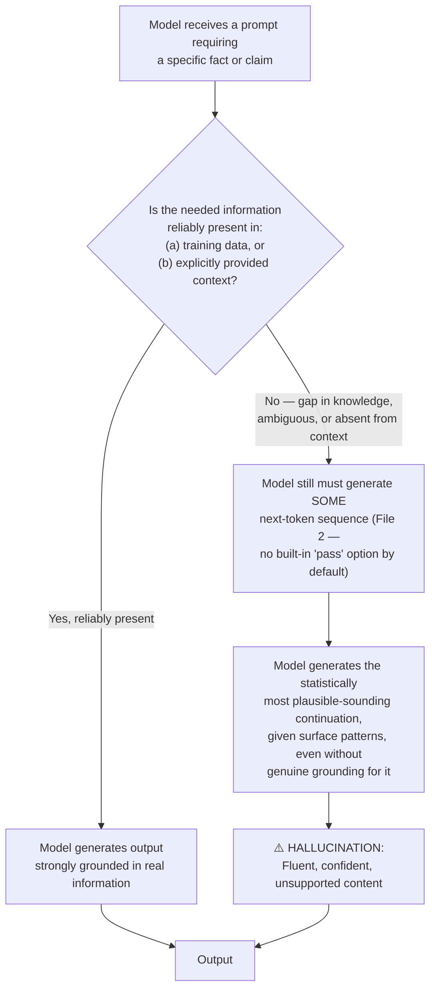
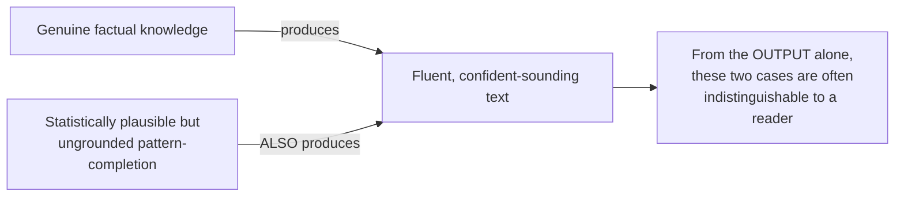

# 14 — Hallucination

> **Series:** Prompt Engineering Knowledge Library
> **File 14 of 15** | **Level:** Beginner → Advanced
> **Prerequisites:** [`02_How_Large_Language_Models_Work.md`](./02_How_Large_Language_Models_Work.md), [`06_Context_Management.md`](./06_Context_Management.md), [`09_Prompt_Design_Principles.md`](./09_Prompt_Design_Principles.md)
> **Next:** [`15_Prompt_Engineering_Fundamentals.md`](./15_Prompt_Engineering_Fundamentals.md)

---

## Table of Contents

1. [Definition](#definition)
2. [Why It Matters](#why-it-matters)
3. [Core Concepts](#core-concepts)
4. [How It Works](#how-it-works)
5. [Internal Mechanism](#internal-mechanism)
6. [Types of Hallucination](#types-of-hallucination)
7. [Syntax / Structure](#syntax--structure)
8. [Examples (Simple → Advanced)](#examples-simple--advanced)
9. [Best Practices](#best-practices)
10. [Common Mistakes](#common-mistakes)
11. [Real-World Applications](#real-world-applications)
12. [Comparison with Related Concepts](#comparison-with-related-concepts)
13. [Advantages & Limitations](#advantages--limitations)
14. [FAQs](#faqs)
15. [Summary](#summary)
16. [Cheat Sheet](#cheat-sheet)
17. [Glossary](#glossary)
18. [References](#references)

---

## Definition

**Hallucination** is the phenomenon where a Large Language Model generates content that is fluent, confident, and internally coherent, but factually incorrect, fabricated, or unsupported by any real source — including the model's own training data or, in grounded systems, the context it was explicitly given.

> **A note on this file's place in the series:** the word "hallucination" has appeared repeatedly across this library — in [File 2](./02_How_Large_Language_Models_Work.md)'s discussion of the model having no ground-truth fact database, [File 6](./06_Context_Management.md)'s RAG-as-mitigation coverage, [File 8](./08_Prompt_Lifecycle.md)'s evaluation-metric mentions, [File 9](./09_Prompt_Design_Principles.md)'s Groundedness principle, [File 10](./10_Prompt_Patterns.md)'s "I Don't Know" Permission pattern, and [File 11](./11_Context_Injection.md)'s discussion of grounding reducing hallucination risk — but none of those files treated it as its own systematic topic. This file is that consolidation: a single, authoritative place gathering every prior scattered reference into one coherent treatment, then extending it with the causal taxonomy and mitigation depth those earlier mentions didn't have room for.

The term is a metaphor borrowed from human psychology (perceiving something that isn't there), and it's a useful, if imperfect, one: like a human hallucination, the *output itself* often has no internal marker distinguishing it from accurate content — it can be stated with exactly the same fluency and apparent confidence as a correct answer, which is precisely what makes it a distinct, difficult problem rather than simply "the model being wrong in an obviously detectable way."

```
Hallucination ≠ "the model doesn't know something"
Hallucination = "the model generates a fluent, confident answer 
                 anyway, when it should have expressed uncertainty 
                 or had no answer at all"
```

---

## Why It Matters

- **It is the single most consequential reliability problem in production LLM systems.** Unlike a context window overflow (File 5, which fails loudly) or a malformed JSON output (File 7, which fails visibly), hallucination often fails *silently* — the output looks exactly as polished as a correct one, so a user or downstream system has no built-in signal to catch it.
- **It directly undermines trust at scale.** A single dramatic, publicly visible hallucination (a fabricated legal citation, an invented statistic in a report) can cause disproportionate reputational and even legal harm relative to how "rare" any individual hallucination might statistically be.
- **It cannot be fully eliminated with current methods**, only reduced and managed — this is a mechanical consequence of *how* LLMs generate text at all (established in File 2), not a bug specific to any one model or provider, meaning every serious LLM application needs a deliberate hallucination-mitigation strategy rather than treating it as an occasional, dismissible glitch.
- **It interacts with nearly every other concept in this series** — tokenization and training cutoffs (Files 2, 4), context grounding (Files 6, 9, 11), evaluation methodology (File 8), and even security (Files 13's injection techniques can specifically *induce* certain hallucinations) — making it a genuinely cross-cutting concern rather than an isolated topic, which is exactly why it earns a dedicated file rather than staying scattered across mentions.

---

## Core Concepts

| Concept | Definition |
|---|---|
| **Confabulation** | A term sometimes used interchangeably with hallucination, borrowed from the psychological phenomenon of confidently generating a false memory without intent to deceive — some researchers prefer it as more precise than "hallucination," since it emphasizes the *fabrication-without-malice* quality |
| **Groundedness** | The degree to which a model's output is directly supported by explicitly provided context or verifiable source data, as opposed to relying on implicit trained knowledge (first introduced in [File 9](./09_Prompt_Design_Principles.md)) |
| **Faithfulness** | Specifically, whether a model's output about a *given piece of provided context* (e.g., a document it was asked to summarize) accurately reflects that context, as distinct from open-domain factual accuracy |
| **Confidence Calibration** | How well a model's expressed certainty (if any) matches its actual likelihood of being correct — a well-calibrated model says "I'm not sure" proportionally to how often it's actually wrong |
| **Training Cutoff Gap** | The specific hallucination risk arising from a model being asked about events/facts after its training data ends (first introduced in [File 2](./02_How_Large_Language_Models_Work.md)) |
| **Fabricated Citation** | A specific, common hallucination pattern where a model invents a plausible-sounding but nonexistent source, quote, or reference |
| **Attribution** | The practice of explicitly linking a generated claim back to its specific supporting source, as a mitigation and verification technique |

---

## How It Works



The critical insight this diagram captures, and the reason hallucination is a *fundamental* property of how these models work rather than an occasional bug: **the model has no built-in, universal mechanism to simply refuse to generate an answer when it lacks genuine grounding.** Unless explicitly trained or prompted to recognize and express uncertainty (covered in Best Practices and File 10's "I Don't Know" Permission pattern), the autoregressive generation process (File 2) will produce *a* plausible continuation regardless of whether solid grounding exists for it — because "produce the most statistically likely next token" doesn't inherently distinguish between "likely because it's true" and "likely because it merely sounds right."

---

## Internal Mechanism

### Why hallucination is a direct, mechanical consequence of next-token prediction

Recall from [File 2](./02_How_Large_Language_Models_Work.md): an LLM does not query a fact database to answer a question — it computes a probability distribution over possible next tokens based on statistical patterns learned during training, then samples from it. This has a specific, important consequence:



The model's training process optimizes for predicting plausible continuations of text as they actually appeared in training data — and the vast majority of fluent, well-formed, confident-sounding text in that training data *was* factually accurate (competent human writers don't usually write confidently about things they've fabricated). This means the model learns a strong *statistical correlation* between "fluent and confident" and "correct" — but that correlation is not a *guarantee*, and when the model is pushed into a genuine knowledge gap (an obscure fact, a training-cutoff-gap event, an ambiguous or leading question), it can still produce the *surface features* of confident correctness (fluency, specificity, appropriate register) without the underlying grounding that usually accompanies those features in its training data.

### Why specific, plausible-sounding fabrications (like citations) are especially common

This connects directly to [Tokenization](./04_Tokenization.md) and [File 2](./02_How_Large_Language_Models_Work.md)'s discussion of learned patterns: academic citations, legal case names, and similar structured references have a highly regular, learnable *format* (Author, Year; Journal Name, Volume, Pages) that the model learns extremely well — independent of learning the specific, correct pairing of any given claim with a real citation. This means the model can generate a citation that is *structurally* perfect and *stylistically* indistinguishable from a real one, while being entirely fabricated — a specific, well-documented failure mode precisely because the *format* is easy to learn thoroughly while the *specific factual pairing* is much harder to learn reliably for the vast long tail of possible claims.

### Why grounding (RAG) reduces, but does not eliminate, hallucination

Extending [File 6](./06_Context_Management.md) and [File 11](./11_Context_Injection.md): when relevant facts are explicitly injected into the context window, the model's self-attention mechanism can directly condition on that provided text, rather than relying solely on implicit, diffuse statistical patterns from training. This substantially narrows the probability distribution toward grounded content (the same underlying mechanism behind [File 9](./09_Prompt_Design_Principles.md)'s Groundedness principle). However, grounding does not eliminate hallucination entirely, for several mechanical reasons:

- **Faithfulness failures** — the model can still misread, misremember, or subtly distort the provided context during generation, especially across a long context (recall [File 5](./05_Context_Window.md)'s "Lost in the Middle" effect).
- **Extrapolation beyond the provided context** — the model may blend genuinely grounded information with ungrounded implicit knowledge, especially when a question's literal answer isn't fully present in the given context but something *related* is.
- **Retrieval failures upstream** — if the RAG system (File 6) retrieves irrelevant or incomplete documents, the model may still be forced into a knowledge gap despite the *system* having a grounding mechanism in place.

---

## Types of Hallucination

### By source of error

| Type | Description | Example |
|---|---|---|
| **Factual Fabrication** | Inventing a fact, statistic, event, or entity that does not exist | Citing a study that was never published |
| **Factual Inaccuracy** | Misstating a real fact incorrectly (as opposed to inventing one from nothing) | Getting a real historical figure's birth year wrong |
| **Faithfulness Hallucination** | Misrepresenting content from context the model was explicitly given | Summarizing a document and attributing a claim to it that the document doesn't actually contain |
| **Fabricated Citation/Source** | Inventing a plausible-sounding but nonexistent reference | A fake academic paper, legal case, or URL |
| **Reasoning Hallucination** | Producing a logically invalid step within an otherwise fluent chain of reasoning, especially in complex multi-step tasks | An arithmetic or logical error embedded in an otherwise well-formatted Chain-of-Thought response (see [File 10](./10_Prompt_Patterns.md)) |
| **Temporal/Cutoff Hallucination** | Confidently answering about events after the model's training cutoff as if they were within its knowledge, rather than recognizing the gap | Describing a "current" state of affairs that has since changed |
| **Entity Conflation** | Merging attributes of two real, distinct entities into one incorrect composite | Attributing one person's achievement to a different, similarly-named person |

### By severity/consequence

| Type | Description |
|---|---|
| **Benign Hallucination** | Low-stakes, easily-correctable errors with minimal real-world consequence (e.g., a minor detail in a casual creative-writing context) |
| **Consequential Hallucination** | Errors with genuine real-world impact if acted upon (a fabricated medical, legal, or financial claim) |
| **Cascading Hallucination** | An initial hallucinated claim that then becomes the (false) premise for further generated reasoning or action, compounding the error — particularly relevant in [agentic systems](./10_Prompt_Patterns.md) where one step's output feeds the next |

---

## Syntax / Structure

Hallucination mitigation is implemented through prompt structure and application-layer verification, extending patterns established in Files 6, 9, and 10:

```xml
<role>
You are a research assistant who prioritizes accuracy over 
completeness. It is better to say a fact is unknown or unverifiable 
than to guess.
</role>

<task>
Answer the user's question using ONLY the provided source document 
below.
</task>

<constraints>
- If the answer is not explicitly present in the source document, 
  respond: "This isn't addressed in the provided source."
- Do not supplement the source document with your own general 
  knowledge, even if you believe you know the answer.
- For every factual claim in your response, include a direct 
  reference to which part of the source document supports it.
</constraints>

<source_document>
"""
[document text]
"""
</source_document>

<question>
[user's question]
</question>
```

```python
# Application-layer pattern: a simple post-generation verification step
def verify_grounding(generated_claim: str, source_document: str) -> bool:
    """
    Illustrative pattern: check whether a generated claim can be
    substantiated against the source it was supposedly grounded in.
    Real implementations often use a second model call, dedicated
    fact-verification tooling, or retrieval-based cross-checking.
    """
    verification_prompt = f"""
    Source document: \"\"\"{source_document}\"\"\"
    Claim to verify: \"\"\"{generated_claim}\"\"\"
    
    Is this claim directly supported by the source document?
    Respond only: SUPPORTED, PARTIALLY_SUPPORTED, or NOT_SUPPORTED.
    """
    result = call_llm(verification_prompt)
    return result.strip() == "SUPPORTED"
```

---

## Examples (Simple → Advanced)

### Level 1 — Basic Training-Cutoff Hallucination

```text
Prompt (asked of a model with an outdated training cutoff, with no 
web search or current data provided): "Who is the current CEO of 
[a company that changed leadership after the model's cutoff]?"

⚠️ Without mitigation: the model may confidently name the PREVIOUS 
CEO (accurate as of its training data) as if it were current 
information, with no indication that this could be outdated.

✅ With mitigation (applying File 9's principles): the model 
explicitly notes its knowledge has a cutoff and that leadership may 
have changed since, rather than presenting outdated information as 
definitively current — or, better, the application uses a search 
tool to retrieve current information (bypassing the hallucination 
risk entirely by grounding in live data, per File 6).
```

### Level 2 — Fabricated Citation

```text
Prompt: "What does research say about the benefits of a four-day 
work week? Cite specific studies."

⚠️ Without mitigation: the model may generate a response citing 
"Smith et al. (2019), Journal of Organizational Psychology" — a 
citation that sounds completely plausible in format and topic, but 
does not correspond to any real published study.

✅ With mitigation: an explicit instruction such as "only cite 
studies you are highly confident actually exist by name, author, 
and publication; if uncertain, describe the general research finding 
without a specific citation" reduces (though does not guarantee 
elimination of) fabricated citation risk — and pairing this with a 
retrieval step (searching for and verifying real studies before 
citing them) provides much stronger protection than prompting alone.
```

### Level 3 — Faithfulness Hallucination (Misrepresenting Provided Context)

```text
Source document (provided in the prompt): "The trial showed a 
12% improvement in symptoms for the treatment group compared to 
placebo, though this did not reach statistical significance (p=0.08)."

User: "Did the treatment work?"

⚠️ Without mitigation: the model might respond "Yes, the treatment 
showed a significant improvement in symptoms" — dropping the 
crucial "did not reach statistical significance" qualifier present 
in the actual source, producing a faithfulness hallucination even 
though grounding data was explicitly provided.

✅ With mitigation: an explicit instruction to preserve important 
qualifiers and nuance from the source (extending File 9's 
Groundedness principle) produces: "The treatment group showed a 
12% improvement, but this difference was not statistically 
significant (p=0.08), so the results don't provide strong evidence 
the treatment worked."
```

### Level 4 — Reasoning Hallucination in a Multi-Step Task

```text
Prompt: "A car travels 150 miles using 5 gallons of gas. At this 
rate, how many gallons would it need for a 480-mile trip? 
Let's think step by step."

⚠️ Without careful verification: the model's Chain-of-Thought 
(File 10) might contain a subtle arithmetic slip mid-reasoning 
(e.g., miscalculating the miles-per-gallon rate), producing a 
fluent, well-structured, but ultimately incorrect final answer — 
the reasoning LOOKS rigorous, which can make this type of 
hallucination especially easy for a reader to miss compared to an 
obviously implausible claim.

✅ With mitigation: applying Self-Consistency (File 10) — running 
the same reasoning multiple times and checking for a consistent 
answer — or explicitly asking the model to double-check its own 
arithmetic in a distinct verification step, catches many reasoning 
hallucinations that a single, un-verified pass would miss.
```

### Level 5 — Advanced: Cascading Hallucination in an Agentic Workflow

```text
Scenario: An AI research agent (File 10's Plan-and-Execute pattern) 
is tasked with compiling a competitive analysis report across 
several steps, using web search as a tool.

Step 1: Agent searches for "Company X annual revenue" and, due to 
an ambiguous or low-quality search result, hallucinates a specific 
revenue figure not actually supported by any retrieved source.

Step 2: The agent's NEXT step uses that (hallucinated) revenue 
figure to calculate a "market share percentage" relative to a 
correctly-sourced industry total.

Step 3: The agent's FINAL report presents both the fabricated 
revenue figure AND the resulting (now doubly-wrong) market share 
calculation, with the same fluent confidence as the report's other, 
genuinely well-sourced claims.

⚠️ This demonstrates CASCADING hallucination: a single early error 
compounds through subsequent reasoning steps, and by the final 
output, the fabrication is now embedded inside a calculation that 
looks methodologically sound, making it substantially harder for a 
reader to spot than the original, isolated fabrication would have been.

DEFENSE (combining techniques from across this series):
1. GROUNDING VERIFICATION AT EACH STEP (not just the final output): 
   Extending File 9's Groundedness principle, each intermediate 
   claim (like Step 1's revenue figure) should be explicitly checked 
   against its supporting source BEFORE being used in later 
   calculations — not verified only retrospectively at the end.
2. EXPLICIT SOURCE ATTRIBUTION THROUGHOUT (not just in the final 
   report): Each intermediate step's output should carry its own 
   source reference, so a break in the grounding chain is visible 
   and traceable rather than hidden inside a later aggregate 
   calculation.
3. "I DON'T KNOW" PERMISSION AT THE STEP LEVEL (File 10): The agent 
   should be explicitly permitted to report "Step 1 search did not 
   return a reliable revenue figure" and either retry the search or 
   flag the gap, rather than proceeding to Step 2 with a fabricated 
   placeholder value.
4. HUMAN REVIEW CHECKPOINTS for consequential, multi-step agentic 
   outputs (extending File 13's confirmation-step guidance) — 
   especially valuable specifically BECAUSE cascading hallucination 
   is harder to catch in a final polished report than a single, 
   isolated claim would be.

→ This example illustrates why hallucination mitigation in agentic 
  systems (File 10) requires MORE than the single-response 
  techniques sufficient for a simple Q&A prompt — the multi-step, 
  compounding nature of agentic workflows means an ungrounded claim 
  early in a chain can silently propagate and amplify, a risk 
  pattern with no direct analogue in a single-turn interaction.
```

---

## Best Practices

1. **Ground responses in explicitly provided context whenever factual accuracy matters** (File 6, File 9) — this is the single highest-leverage mitigation available, though not a complete solution on its own.
2. **Explicitly permit and encourage "I don't know" / "not specified" responses** (File 10's dedicated pattern) — a model instructed that uncertainty is an acceptable, even preferred, answer hallucinates measurably less than one implicitly pressured to always produce a confident, complete-sounding response.
3. **Require source attribution for factual claims**, especially in research, legal, medical, or financial contexts — asking the model to point to exactly which part of the provided context supports each claim makes faithfulness failures more visible and checkable.
4. **Use Self-Consistency (File 10) for high-stakes reasoning tasks** — running the same reasoning multiple times and checking for a consistent answer catches many reasoning hallucinations a single pass would miss.
5. **Verify claims at each step in multi-step/agentic workflows, not just the final output** (Level 5) — cascading hallucination specifically exploits systems that only check the polished end result.
6. **Treat hallucination rate as a first-class evaluation metric** in the [Prompt Lifecycle](./08_Prompt_Lifecycle.md), with dedicated test cases specifically designed to probe known-weak areas (obscure facts, training-cutoff-adjacent questions, long-context faithfulness).
7. **Prefer retrieval/search tools over relying on implicit model knowledge** whenever current, verifiable, or highly specific factual accuracy is required — this bypasses much of the underlying risk rather than merely reducing it through prompt wording.
8. **Never present a single model's unverified output as ground truth for consequential decisions** — human review remains an essential final layer for high-stakes applications, exactly as [File 13](./13_Prompt_Injection.md) emphasizes for security-consequential agentic actions.

---

## Common Mistakes

| Mistake | Consequence | Fix |
|---|---|---|
| Assuming a model's confident tone correlates with accuracy | Confident-sounding hallucinations are accepted at face value | Treat tone/fluency as no signal of accuracy whatsoever; verify independently |
| Only checking the final output of a multi-step agentic task | Cascading hallucinations go undetected until they've compounded | Verify grounding at each intermediate step, not just the end result |
| Never explicitly permitting uncertainty in the prompt | Model is implicitly pressured toward always producing a complete, confident-sounding answer | Explicitly state that "I don't know" or "not specified" is an acceptable, preferred response when true (File 10) |
| Assuming RAG/grounding eliminates hallucination entirely | False confidence in grounded systems; faithfulness failures still occur | Understand grounding reduces but does not eliminate the risk (this file's Internal Mechanism section); verify faithfulness specifically |
| Treating hallucination as a rare edge case not worth systematic testing | Production systems ship without dedicated hallucination evaluation | Include hallucination-probing test cases as a standard category in the Prompt Lifecycle's eval set (File 8) |
| Using an ungrounded model for high-stakes citation/reference tasks | Fabricated citations presented with the same confidence as real ones | Require explicit source verification, ideally via retrieval, for any citation-bearing output |

---

## Real-World Applications

- **Legal research and drafting tools** — a widely publicized category of hallucination incident (fabricated case citations submitted in real legal filings), making citation verification a critical, non-optional feature for any legal AI application.
- **Medical information systems** — faithfulness to provided clinical context and explicit uncertainty expression are essential given the direct real-world consequence of medical misinformation.
- **Financial analysis and reporting tools** — cascading hallucination (Level 5) is a particularly relevant risk pattern for any multi-step financial calculation or analysis pipeline.
- **Academic and research assistants** — fabricated citations and misrepresented source findings are a well-documented risk category specifically targeted by attribution-requiring prompt design.
- **Customer support systems** — faithfulness to actual company policy documents (rather than plausible-sounding but incorrect policy statements) directly affects both customer experience and potential liability.
- **News summarization and fact-checking tools** — faithfulness hallucination (misrepresenting a source article's actual content) is a direct, central risk for any application whose entire value proposition depends on accurately reflecting source material.
- **AI research/analysis agents** (Level 5) — any agentic system performing multi-step research and synthesis carries elevated cascading-hallucination risk relative to single-turn Q&A.

---

## Comparison with Related Concepts

| Concept | Difference from Hallucination |
|---|---|
| **Groundedness (File 9)** | Groundedness is the *design principle/property* (anchoring output in provided data); hallucination is the *failure mode* that occurs when groundedness is absent or insufficient — they are two sides of the same underlying concern |
| **Context Injection / RAG (Files 6, 11)** | RAG is a specific *architectural mitigation* for hallucination (among other benefits); hallucination is the broader *problem* that RAG, among other techniques, partially addresses |
| **Prompt Injection (File 13)** | A distinct problem with a different root cause — prompt injection is an *adversarial manipulation* of model behavior via crafted input; hallucination is an *emergent, unintentional* failure of the generation process itself, occurring even with no adversarial input present at all. Notably, some injection techniques can specifically *induce* certain hallucinations (e.g., an injected false "fact" the model then treats as grounded), showing the two concepts can interact without being the same phenomenon |
| **Bias (a related but distinct LLM concern)** | Bias refers to systematic skew in model output reflecting patterns (often problematic ones) in training data; hallucination refers to factual fabrication/inaccuracy — a model's output can be biased without being factually false, and can hallucinate without exhibiting any particular directional bias; they are overlapping but analytically separate concerns |
| **Human Memory Error (the psychological analogy)** | A useful but imperfect metaphor (as the Definition section notes) — human false memories and LLM hallucination share the surface quality of confident, fluent fabrication, but arise from entirely different underlying mechanisms (human memory reconstruction vs. next-token statistical prediction) |

---

## Advantages & Limitations

### ⚠️ This section frames "advantages" differently than other files

Because hallucination is a failure mode rather than a technique, this section addresses what's sometimes gained by the *same underlying generative flexibility* that produces hallucination, alongside the limitations of current mitigation approaches — rather than "advantages of hallucinating."

### The trade-off: generative flexibility vs. factual reliability

- **The same mechanism that enables hallucination also enables genuinely valuable capabilities** — creative writing, brainstorming, hypothetical reasoning, and fiction all depend on the model's ability to generate fluent, plausible content *not* strictly tied to verified fact. A model with zero capacity for "ungrounded" generation would also be unable to perform these legitimately valuable, non-factual tasks. This is why hallucination mitigation techniques (like RAG grounding) are typically applied *selectively*, to factual/high-stakes tasks, rather than as a blanket, always-on constraint that would also cripple creative use cases.

### ⚠️ Limitations of current mitigation approaches

- **No current technique eliminates hallucination entirely** — grounding, explicit uncertainty permission, and verification steps all measurably *reduce* the rate and severity of hallucination, but none provide an absolute guarantee, for the mechanical reasons established in this file's Internal Mechanism section.
- **Verification itself has costs and imperfections** — using a second model call to verify a first model's claim (as in this file's Syntax section example) adds latency and cost, and is itself not immune to error (a verification step can itself hallucinate about whether the original claim was well-supported).
- **Calibration remains an open challenge** — getting a model to express uncertainty *proportionally* to its actual likelihood of error (rather than being either overconfident across the board or unhelpfully hedging on things it actually knows well) is an active area of ongoing research, not a fully solved problem.
- **Detection is harder than prevention in many cases** — a fluent hallucination often provides no internal signal distinguishing it from accurate content, making automated or even careful human detection genuinely difficult, especially for claims a reader cannot easily independently verify.

---

## FAQs

**Q: Is hallucination a bug that will eventually be "fixed" as models improve?**
A: Based on current understanding, hallucination is better understood as an inherent property of how autoregressive, next-token-prediction generation works (per this file's Internal Mechanism section) rather than a simple, isolated bug. More capable and better-aligned models do generally exhibit measurably lower hallucination rates and improved calibration, but "eliminated entirely" would require either a fundamentally different generation mechanism or perfect calibration — neither of which current methods achieve. Treat improvement as an ongoing trend to track, not a problem to assume is already or will soon be fully solved.

**Q: Does asking the model "are you sure?" or "double-check your answer" reliably catch hallucinations?**
A: It can help in some cases (similar in spirit to Self-Consistency, File 10) by giving the model an additional generation pass that sometimes catches an error the first pass missed — but it is not a reliable, guaranteed mechanism, since the model's "double-checking" is itself just another round of the same underlying generative process, which can also produce a confidently-stated (but equally ungrounded) confirmation of the original error.

**Q: Is hallucination worse in longer responses?**
A: Not inherently by length alone, but longer, more complex responses — especially those involving multiple factual claims, multi-step reasoning, or synthesis across a long context — provide more individual opportunities for an error to occur somewhere within them, and (per Level 5's cascading example) more opportunity for an early error to compound. This is why per-claim/per-step verification (rather than only whole-response verification) becomes increasingly valuable as task complexity grows.

**Q: How is hallucination different across different model providers?**
A: Hallucination rates and characteristics vary by model, training approach, and how recently the model's training data was updated, and these differences are actively measured and change with each new model release — always consult current, model-specific benchmarks and provider documentation (see References) rather than assuming any fixed comparison remains accurate over time.

**Q: Can hallucination happen even when a model is given the correct information directly in the prompt?**
A: Yes — this is precisely what "faithfulness hallucination" (this file's Types section, and the Level 3 example) describes: even with correct source material explicitly provided, the model can still misread, drop important nuance from, or subtly distort that material during generation. Providing correct context substantially reduces hallucination risk but does not, on its own, guarantee faithful use of that context.

---

## Summary

Hallucination is the generation of fluent, confident, but factually incorrect or unsupported content — a phenomenon referenced throughout this series (Files 2, 6, 8, 9, 10, 11) but given its full, systematic treatment here: a direct, mechanical consequence of autoregressive next-token prediction (File 2), which produces the statistically most plausible continuation regardless of whether genuine grounding exists for it, since the model has no universal built-in mechanism to simply decline to answer when it lacks real knowledge. This file's taxonomy spans error sources (factual fabrication, faithfulness failures, fabricated citations, reasoning errors, temporal/cutoff gaps) and severity levels (benign through cascading), while its mitigation guidance consolidates and extends techniques introduced earlier in the series — grounding (Files 6, 9, 11), explicit uncertainty permission (File 10), source attribution, Self-Consistency (File 10), and step-level verification for agentic workflows — into a coherent, defense-in-depth approach that measurably reduces hallucination risk without claiming to eliminate it entirely, since no current method achieves that. Understanding hallucination this systematically — as an inherent property to be managed rather than an occasional bug to be dismissed — is essential groundwork for the final file in this series, which distills the fundamentals across all fourteen preceding files into a single practitioner's reference.

---

## Cheat Sheet

```text
HALLUCINATION — QUICK REFERENCE

TYPES BY SOURCE                      TYPES BY SEVERITY
Factual Fabrication                  Benign
Factual Inaccuracy                   Consequential
Faithfulness Failure                 Cascading
Fabricated Citation
Reasoning Hallucination
Temporal/Cutoff Hallucination
Entity Conflation

WHY IT HAPPENS (root cause)
Next-token prediction has no built-in "I genuinely don't know, so 
I'll refuse to answer" default — it always produces SOME plausible 
continuation unless explicitly trained/prompted otherwise.

MITIGATION LAYERS (reduce, do not eliminate — use several together)
[ ] Ground in explicitly provided context (RAG, Files 6/11)
[ ] Explicitly permit "I don't know" (File 10 pattern)
[ ] Require source attribution per claim
[ ] Self-Consistency for high-stakes reasoning (File 10)
[ ] Verify EACH step in multi-step/agentic workflows, not just the end
[ ] Prefer retrieval/search over implicit model knowledge for facts
[ ] Include hallucination-probing tests in your eval set (File 8)
[ ] Human review for consequential, unverifiable claims
```

| Symptom | Likely Hallucination Type |
|---|---|
| Plausible-looking citation you can't verify exists | Fabricated Citation |
| Summary drops an important qualifier from the source | Faithfulness Failure |
| Confident answer about something "current" | Temporal/Cutoff Hallucination |
| Well-formatted multi-step answer with a wrong final number | Reasoning Hallucination |
| Multi-step agent's error grows worse over the workflow | Cascading Hallucination |
| Two real people's facts blended into one description | Entity Conflation |

---

## Glossary

| Term | Definition |
|---|---|
| **Hallucination** | Fluent, confident, but factually incorrect or unsupported generated content |
| **Confabulation** | An alternate term emphasizing fabrication without intent to deceive |
| **Groundedness** | The degree to which output is supported by explicitly provided context |
| **Faithfulness** | Whether output accurately reflects specifically provided source context |
| **Confidence Calibration** | How well expressed certainty matches actual correctness likelihood |
| **Training Cutoff Gap** | Hallucination risk from being asked about post-training-cutoff events |
| **Fabricated Citation** | An invented but plausible-sounding nonexistent reference |
| **Attribution** | Explicitly linking a claim back to its specific supporting source |
| **Cascading Hallucination** | An early hallucinated claim compounding through subsequent reasoning/steps |

---

## References

- Ji, Z. et al. (2023) — *Survey of Hallucination in Natural Language Generation*, ACM Computing Surveys
- Huang, L. et al. (2023) — *A Survey on Hallucination in Large Language Models*, arXiv:2311.05232
- Anthropic — [Reducing Hallucinations Documentation](https://docs.claude.com/en/docs/test-and-evaluate/strengthen-guardrails/reduce-hallucinations)
- OpenAI — [Why Language Models Hallucinate](https://openai.com/index/why-language-models-hallucinate/)
- Lewis, P. et al. (2020) — *Retrieval-Augmented Generation for Knowledge-Intensive NLP Tasks*, arXiv:2005.11401
- Manakul, P. et al. (2023) — *SelfCheckGPT: Zero-Resource Black-Box Hallucination Detection for Generative Large Language Models*, arXiv:2303.08896
- Lin, S. et al. (2022) — *TruthfulQA: Measuring How Models Mimic Human Falsehoods*, arXiv:2109.07958

---

**⬅️ Previous:** [`13_Prompt_Injection.md`](./13_Prompt_Injection.md)
**➡️ Next:** [`15_Prompt_Engineering_Fundamentals.md`](./15_Prompt_Engineering_Fundamentals.md) — Distilling all fourteen files into a practitioner's core reference.
