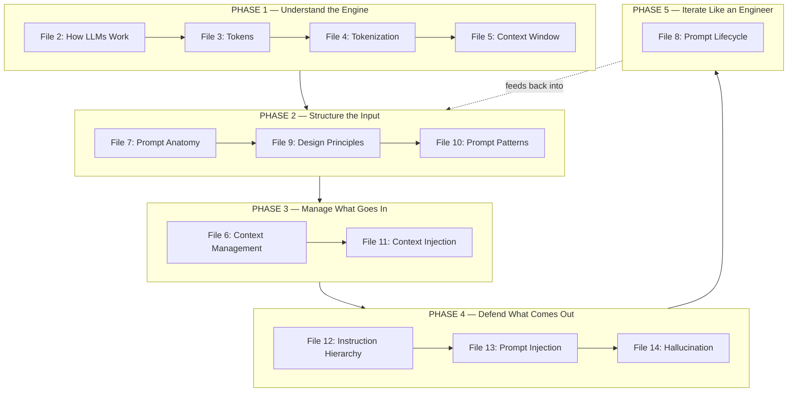

# 15 — Prompt Engineering Fundamentals

> **Series:** Prompt Engineering Knowledge Library
> **File 15 of 15 (Final File)** | **Level:** Beginner → Advanced
> **Prerequisites:** All prior files — this is the series capstone
> **Series Complete.** See [`README.md`](./README.md) for the full library index.

---

## Table of Contents

1. [Definition](#definition)
2. [Why It Matters](#why-it-matters)
3. [Core Concepts](#core-concepts)
4. [How It Works](#how-it-works)
5. [Internal Mechanism](#internal-mechanism)
6. [Types / The Fundamentals Framework](#types--the-fundamentals-framework)
7. [Syntax / Structure](#syntax--structure)
8. [Examples (Simple → Advanced)](#examples-simple--advanced)
9. [Best Practices](#best-practices)
10. [Common Mistakes](#common-mistakes)
11. [Real-World Applications](#real-world-applications)
12. [Comparison with Related Concepts](#comparison-with-related-concepts)
13. [Advantages & Limitations](#advantages--limitations)
14. [FAQs](#faqs)
15. [Summary](#summary)
16. [Cheat Sheet](#cheat-sheet)
17. [Glossary](#glossary)
18. [References](#references)

---

## Definition

**Prompt Engineering Fundamentals** is this series' capstone synthesis: the distilled, applied core of everything covered across Files 01–14, reorganized not by *concept* (as each prior file was) but by **practitioner workflow** — what you actually need to know, in what order, to go from "I have a task for an LLM" to "I have a reliable, tested, production-ready prompt."

> Every prior file in this library taught one concept in depth. This file teaches none of those concepts for the first time — instead, it teaches **how they combine** in the order a working prompt engineer actually reaches for them, and it exists specifically to answer the question a learner has after finishing File 14: *"Okay, I understand all fourteen pieces — now how do I actually use them together, starting from a blank page?"*

The fundamentals, at their most compressed:

```
Understand the Engine (Files 2-6)
    → Structure the Input (Files 7, 9, 10)
    → Manage What Goes In (Files 6, 11)
    → Defend What Comes Out (Files 12, 13, 14)
    → Iterate Like an Engineer (File 8)
```

This is the "fundamental topic" of prompt engineering — not a fifteenth new idea, but the map showing how the other fourteen fit together into one working discipline.

---

## Why It Matters

- **Concept mastery and applied fluency are different skills.** Someone can understand tokens, attention, RAG, and instruction hierarchy individually and still freeze in front of a blank prompt box — because knowing the pieces isn't the same as knowing the *sequence* in which to reach for them. This file exists to close that specific gap.
- **It gives a fast on-ramp for returning readers.** A practitioner who read this library once, six months ago, and needs a refresher shouldn't have to re-read fourteen files — this file is the fifteen-minute version that still respects the depth underneath it, with links back to the full treatment whenever more is needed.
- **It's the natural onboarding document for a team.** A new hire joining a prompt engineering team benefits enormously from one file that says "here's the mental model, here's the workflow, here's where to go deeper on any piece" — exactly the role this file is built to play, and exactly why the [`README.md`](./README.md) points newcomers here early.
- **It forces genuine synthesis, which is where real understanding shows.** Writing (and reading) a fundamentals file that has to correctly connect all fourteen prior concepts — not just list them — is a stronger test of whether the material actually holds together than any single-concept file could be on its own.

---

## Core Concepts

This section doesn't introduce new terms — it's a single consolidated map of where every term from Files 01–14 lives, so this file can function as a real index into the rest of the library.

| Concept | Defined In | One-Line Recap |
|---|---|---|
| Prompt Engineering (the discipline) | [File 1](./01_What_is_Prompt_Engineering.md) | Designing input to reliably shape LLM output |
| Transformer / Self-Attention | [File 2](./02_How_Large_Language_Models_Work.md) | The mechanism that makes an LLM an LLM |
| Token | [File 3](./03_Tokens.md) | The atomic unit the model actually processes |
| Tokenization (BPE) | [File 4](./04_Tokenization.md) | The algorithm that creates tokens from raw text |
| Context Window | [File 5](./05_Context_Window.md) | The hard token ceiling per request |
| Context Management / RAG | [File 6](./06_Context_Management.md) | Strategies for working within that ceiling |
| Prompt Anatomy | [File 7](./07_Prompt_Anatomy.md) | The structural building blocks of a prompt |
| Prompt Lifecycle | [File 8](./08_Prompt_Lifecycle.md) | Draft → test → deploy → monitor, as a discipline |
| Design Principles | [File 9](./09_Prompt_Design_Principles.md) | The evidence-based rules for writing each block well |
| Prompt Patterns | [File 10](./10_Prompt_Patterns.md) | Named, reusable templates for recurring problems |
| Context Injection | [File 11](./11_Context_Injection.md) | Inserting external content — mechanism and risk |
| Instruction Hierarchy | [File 12](./12_Instruction_Hierarchy.md) | Resolving conflicts between instruction sources |
| Prompt Injection | [File 13](./13_Prompt_Injection.md) | The attack discipline built on File 11's risk surface |
| Hallucination | [File 14](./14_Hallucination.md) | Confident, fluent, ungrounded output — and its mitigation |

---

## How It Works

The fundamentals framework organizes the entire library into **five practitioner-facing phases**, each phase drawing on a cluster of the fourteen prior files:



**Phase 1 (mechanism)** is why-it-works knowledge — you rarely re-derive it on every task, but every later decision traces back to it. **Phases 2–4 (build, feed, defend)** are what you actually *do* on a given prompt-engineering task, roughly in that order. **Phase 5 (iterate)** is not a final step but a loop — it's why the diagram's last arrow points backward into Phase 2, exactly matching [File 8](./08_Prompt_Lifecycle.md)'s own feedback-loop structure.

---

## Internal Mechanism

### Why this five-phase ordering, specifically — the dependency logic

This isn't an arbitrary sequence. Each phase mechanically depends on the one before it, and this file's ordering makes that dependency chain explicit in a way no single prior file needed to, since each of them only had to justify its own internal content:

| Phase | Depends On | Because |
|---|---|---|
| **Phase 2 (Structure)** requires **Phase 1 (Engine)** | Tokens, attention, context window | You can't apply delimiters correctly (File 7) without knowing *why* delimiters work (File 2's attention mechanism); you can't apply Design Principles (File 9) without knowing they're mechanically justified, not stylistic opinion |
| **Phase 3 (Manage Input)** requires **Phase 2 (Structure)** | Anatomy, patterns | Context injection (File 11) is itself an anatomical component (Input Data, File 7) — you need the structural vocabulary before you can reason about how injected content should be delimited within it |
| **Phase 4 (Defend Output)** requires **Phase 3 (Manage Input)** | Context injection | Instruction hierarchy (File 12) and prompt injection (File 13) are literally the security *response* to what Phase 3 introduces — you cannot meaningfully defend against a risk you haven't yet established the mechanism for |
| **Phase 5 (Iterate)** wraps **all of Phase 1–4** | Everything | The Prompt Lifecycle (File 8) is a process applied *to* a prompt already built through Phases 1–4 — it has nothing to test or version until those phases have produced a draft |

### Why hallucination sits at the end of Phase 4, not earlier

This is worth making explicit, since it's a genuine design decision in how this file organizes the series: [File 14](./14_Hallucination.md) could conceptually sit right after [File 2](./02_How_Large_Language_Models_Work.md) (since its root cause is next-token prediction, established there). It's placed in Phase 4 instead because *practically*, hallucination mitigation is something you actively defend against *after* you've structured your prompt (Phase 2) and decided how context enters it (Phase 3) — grounding (the primary mitigation) *is* a Phase 3 technique applied for a Phase 4 purpose. This file's phase structure is organized around **when a practitioner acts on each concept**, not strictly around **when each concept was first mechanically caused** — a deliberate synthesis choice that a pure concept-index couldn't make, and part of why this file adds real value beyond just repeating the Table of Contents from Files 1–14.

---

## Types / The Fundamentals Framework

### The Five Phases, in full

#### Phase 1 — Understand the Engine (Files 2–5)

*What you need before writing a single word of prompt.*

- The model predicts tokens, it doesn't retrieve facts ([File 2](./02_How_Large_Language_Models_Work.md))
- Text becomes tokens via a fixed, deterministic algorithm ([Files 3](./03_Tokens.md)–[4](./04_Tokenization.md))
- Everything — instructions, data, output — shares one finite token budget ([File 5](./05_Context_Window.md))

#### Phase 2 — Structure the Input (Files 7, 9, 10)

*What you do every time you sit down to write a prompt.*

- Decompose the task into anatomical components: Role, Task, Context, Constraints, Examples, Input Data, Output Format ([File 7](./07_Prompt_Anatomy.md))
- Write each component following evidence-based principles: clarity, specificity, positive framing, decomposition, delimiters, positioning, groundedness, conciseness ([File 9](./09_Prompt_Design_Principles.md))
- Recognize the problem category and reach for a matching named pattern — Chain-of-Thought, Few-Shot, Structured Output, RAG, ReAct — rather than starting from scratch ([File 10](./10_Prompt_Patterns.md))

#### Phase 3 — Manage What Goes In (Files 6, 11)

*What you do when your task needs more than the model's own trained knowledge.*

- Decide what external information is genuinely needed and how to fit it in budget: truncation, summarization, RAG ([File 6](./06_Context_Management.md))
- Insert that content with explicit trust tagging, distinguishing developer-controlled from third-party/untrusted sources ([File 11](./11_Context_Injection.md))

#### Phase 4 — Defend What Comes Out (Files 12, 13, 14)

*What you do to make sure the system behaves safely and accurately once real inputs start flowing through it.*

- Establish explicit precedence so system rules survive contact with user requests and injected content ([File 12](./12_Instruction_Hierarchy.md))
- Red-team against the full taxonomy of injection technique — direct, indirect, stored, obfuscated, multi-turn ([File 13](./13_Prompt_Injection.md))
- Mitigate hallucination through grounding, explicit uncertainty permission, and step-level verification ([File 14](./14_Hallucination.md))

#### Phase 5 — Iterate Like an Engineer (File 8)

*The loop that never stops for a live system.*

- Define measurable success criteria before heavy iteration
- Build a real eval set, including adversarial and edge cases from Phases 3–4
- Version, deploy, and — critically — keep monitoring, since drift and new attack techniques don't stop after launch ([File 8](./08_Prompt_Lifecycle.md))

---

## Syntax / Structure

There's no new syntax in this file — the "syntax" of the fundamentals is the **checklist sequence** itself, which doubles as a template for approaching any new prompt engineering task from a blank page:

```text
PROMPT ENGINEERING FUNDAMENTALS — WORKING SEQUENCE

□ PHASE 1 CHECK (rarely re-derived per task, but keep in mind)
  - Am I asking for something that requires precision the tokenizer
    might not give me cleanly? (File 3-4)
  - Will my input + expected output fit the context window? (File 5)

□ PHASE 2 BUILD
  - What anatomical components does THIS task actually need? (File 7)
  - Have I applied the relevant design principles to each? (File 9)
  - Does this problem match a named pattern I should just reuse? (File 10)

□ PHASE 3 FEED (if the task needs external knowledge)
  - What's the minimum context that actually needs to go in? (File 6)
  - Is every injected piece trust-tagged appropriately? (File 11)

□ PHASE 4 DEFEND (if this will run in production, or on untrusted input)
  - Have I stated explicit precedence for system vs. user vs. data? (File 12)
  - Have I tested this against direct AND indirect injection? (File 13)
  - Have I grounded factual claims and permitted "I don't know"? (File 14)

□ PHASE 5 ITERATE (always, for anything beyond a one-off)
  - Do I have a real eval set, not just a few manual spot checks? (File 8)
  - Is this versioned, with monitoring in place post-launch? (File 8)
```

---

## Examples (Simple → Advanced)

### Level 1 — A One-Off Personal Task (Phases 1–2 Only)

```text
Task: "Summarize this article for me."

Phase 1: Not actively considered — a single short article is nowhere 
near the context window limit, and no special tokenization concern applies.

Phase 2: 
- Anatomy (File 7): Task + Input Data is sufficient; no Role or 
  Constraints genuinely needed for a casual request.
- Design Principles (File 9): Reasonably specific already 
  ("summarize"), concise.
- Pattern (File 10): None needed — this is simple enough to not 
  require a named pattern.

Phases 3-5: Not applicable — no external retrieval, no security 
surface, no production lifecycle for a single casual request.

→ Fundamentals correctly tell you: for a task this simple, most of 
  the five-phase framework is irrelevant, and reaching for all of 
  it would be over-engineering (a direct callback to File 9's own 
  Limitations section on this exact point).
```

### Level 2 — A Small Team Project (Phases 1, 2, 5)

```text
Task: Build a prompt that classifies support tickets into 5 categories 
for a 3-person startup's internal tool.

Phase 1: Confirm ticket text + category definitions comfortably fit 
the context window (File 5) — trivially true here.

Phase 2:
- Anatomy: Role ("You are a support ticket classifier") + Task + 
  the 5 category definitions as Context + Output Format (single 
  category label).
- Design Principles: Specific category definitions, positively framed.
- Pattern: Few-Shot (File 10) — a handful of example ticket→category 
  pairs, since this is a format/consistency-sensitive task.

Phase 3: Not needed — no external knowledge base, categories are 
static and known.

Phase 4: Minimal — internal tool, no untrusted third-party content, 
low security surface; a brief hallucination check (does the model 
ever invent a 6th category not in the list?) is still worth a quick test.

Phase 5: Structured Manual Lifecycle (File 8, Level 2 example) — 
20 hand-labeled test tickets, iterate until >90% agreement, done.

→ Fundamentals correctly scale phase depth to actual stakes: full 
  Phase 4 rigor would be disproportionate for a low-exposure internal tool.
```

### Level 3 — A Customer-Facing RAG Chatbot (All Five Phases, Moderate Depth)

```text
Task: Build a customer support chatbot answering questions from a 
company's help-center documentation.

Phase 1: Documentation corpus far exceeds any context window — this 
IS a live constraint here, not a formality.

Phase 2: Full anatomy — Role (support persona), Task, Constraints 
(tone, scope boundaries), Output Format. Retrieval-Augmented pattern 
(File 10) as the core pattern.

Phase 3: RAG required (File 6) — chunk documentation, embed, 
retrieve top-K per query. Retrieved chunks trust-tagged as 
developer-controlled-but-should-still-be-verified content (File 11) 
since it's the company's own docs, not fully open third-party content.

Phase 4: 
- Instruction Hierarchy (File 12): system rules ("only discuss our 
  products") stated as non-overridable.
- Prompt Injection (File 13): test direct override attempts ("ignore 
  your instructions") since this is a public-facing surface.
- Hallucination (File 14): explicit "if not in the docs, say so" 
  instruction; source attribution per answer.

Phase 5: Automated Eval-Driven Lifecycle (File 8) — accuracy against 
a labeled Q&A set, injection-resistance test cases, hallucination 
rate tracked as a first-class metric, ongoing monitoring post-launch.

→ This is the realistic default shape for most production, 
  customer-facing LLM applications — moderate depth across all 
  five phases, not maximal depth in any single one.
```

### Level 4 — An Agentic System with Tool Access (All Five Phases, High Depth)

```text
Task: An AI assistant that reads a user's email and can draft/send 
replies on their behalf.

Phase 1: Context window budgeting across email threads, attachments, 
and conversation history (File 5) is an active, ongoing engineering 
concern, not a one-time check.

Phase 2: Full anatomy with ReAct pattern (File 10) — the agent must 
reason about email content and take tool actions (draft, send) in 
an interleaved loop.

Phase 3: Every email is context-injected content (File 11) — and 
critically, EVERY email is from a third party the application 
developer does NOT control, making this maximally high-risk on 
File 11's trust spectrum.

Phase 4: 
- Instruction Hierarchy (File 12): "never send without confirmation" 
  established as absolutely non-overridable.
- Prompt Injection (File 13): full layered defense per File 13's 
  Level 5 example — this IS the canonical high-stakes indirect 
  injection scenario the series uses repeatedly.
- Hallucination (File 14): the agent must not fabricate email 
  content or invent facts about senders when drafting replies.
- ADDITIONALLY, beyond prompt-level defenses: application-layer 
  confirmation steps and least-privilege tool scoping (File 11, 13) 
  — this is a task where Phase 4 explicitly extends past prompting 
  alone into system architecture.

Phase 5: Continuous Monitoring Lifecycle (File 8, Level 5 example) 
— given the consequential, ongoing, high-exposure nature of this 
system, monitoring for drift and novel injection techniques is a 
permanent operational requirement, not a launch-time checkbox.

→ This example deliberately mirrors the highest-stakes examples 
  used throughout Files 8, 11, 13, and 14 individually — the 
  fundamentals framework's real value here is showing that these 
  weren't four separate hard problems, but ONE task that happens 
  to activate every phase at maximum depth simultaneously.
```

### Level 5 — Advanced: Using the Fundamentals Framework to Diagnose an Existing, Failing Prompt

```text
Scenario: A production prompt has started producing unreliable 
output. Rather than randomly guessing at fixes, use the five-phase 
framework AS A DIAGNOSTIC TOOL, working through each phase as a 
hypothesis in order:

PHASE 1 CHECK: Has the input grown to approach the context window 
limit (File 5)? → Check token counts. [If yes: this alone may 
explain degraded quality via silent truncation or Lost-in-the-Middle 
effects — fix here before looking further.]

PHASE 2 CHECK: Did the task change, or did the anatomy stop matching 
it (File 7)? Are design principles being followed, or has the prompt 
accumulated vague, unchecked additions over time (File 9)? Is the 
wrong pattern being used for a problem that has since evolved 
(File 10)?

PHASE 3 CHECK: Has the underlying knowledge source changed — new 
document formats, a stale RAG index, degraded retrieval quality 
(File 6)? Has a new injection vector opened up through an added 
data source (File 11)?

PHASE 4 CHECK: Has a new instruction hierarchy conflict emerged from 
a recent feature addition (File 12)? Are there novel injection 
techniques in the wild that weren't accounted for at launch 
(File 13)? Has the hallucination rate on a specific claim type 
crept up, perhaps due to an underlying model update (File 14)?

PHASE 5 CHECK: Was this even being monitored (File 8)? If the answer 
is no, THIS is very likely the actual root cause — an unmonitored 
system has no early-warning mechanism for any of the above.

→ Working through the phases IN ORDER, rather than jumping straight 
  to the most "interesting" hypothesis, is itself an application of 
  this file's central insight: the five phases aren't just a build 
  sequence, they're also a systematic, ordered debugging sequence — 
  the same dependency logic that governs how you BUILD a prompt 
  (Internal Mechanism section, above) also governs the most 
  efficient order to DIAGNOSE one that's broken.
```

---

## Best Practices

1. **Use the five phases as your default starting checklist for any new task** — even a ten-second mental pass ("does this need Phase 3? Phase 4?") prevents both under-engineering a production system and over-engineering a casual one.
2. **Match phase depth to actual stakes, every time** — Level 1 through Level 4 above deliberately show the same framework producing very different amounts of work; the framework's job is to help you *scale* correctly, not to maximize effort on every task.
3. **Treat Phase 5 as a loop, not a finish line** — the moment a prompt is "done" is the moment monitoring begins, not the moment it ends, exactly as [File 8](./08_Prompt_Lifecycle.md) establishes and this file's diagram makes structurally explicit.
4. **When something breaks, diagnose in phase order** (Level 5) — it's a more efficient debugging path than jumping straight to whichever concept feels most likely, precisely because the phases encode a real dependency chain.
5. **Use this file as a map back into the other fourteen, not a replacement for them** — every claim in this file is intentionally shallow relative to its source file; when a phase-level summary isn't enough, the linked file is where the actual depth, mechanism, and edge cases live.
6. **Revisit this file periodically as your own skill grows** — a fundamentals synthesis reads differently (and more usefully) once you've actually built a few systems; it's worth re-reading after real practice, not just once at the start.

---

## Common Mistakes

| Mistake | Consequence | Fix |
|---|---|---|
| Treating this file as a substitute for reading the other fourteen | Shallow understanding that breaks down the moment a real edge case appears | Use this file as the map, but go to the linked source file whenever a task actually requires that depth |
| Applying all five phases at maximum depth to every task, regardless of stakes | Massive over-engineering on simple, low-stakes prompts (Level 1 vs. Level 4 contrast) | Explicitly scale phase depth to actual consequence, as demonstrated across the Examples section |
| Skipping Phase 4 (Defend) for "internal only" tools that later get exposed externally | Security surface expands without corresponding defense investment | Re-run the phase checklist whenever a system's exposure or user base changes, not only at initial build time |
| Treating Phase 5 as a one-time launch checklist rather than an ongoing loop | Prompt drift, new injection techniques, and model updates go undetected | Build monitoring in from the start, per File 8's Continuous Monitoring Lifecycle |
| Jumping to Phase 2 without ever having internalized Phase 1 | Design choices (like ignoring positional effects, or not budgeting tokens) that File 9 and File 5 already explain, get rediscovered the hard way through production failures | Treat Phase 1 as genuine prerequisite knowledge, not optional background reading |

---

## Real-World Applications

- **Team onboarding documentation** — this file's role is explicitly this: the single document a new prompt engineering hire reads first, with the other fourteen files as the reference library they grow into.
- **Project kickoff checklists** — the Phase 1–5 checklist (Syntax section) is directly usable as a literal starting checklist for scoping a new LLM feature's engineering requirements.
- **Production incident diagnosis** — Level 5's diagnostic walkthrough is a directly reusable troubleshooting framework for an underperforming live prompt.
- **Prompt engineering training curricula** — the five-phase structure offers a natural teaching sequence distinct from, and complementary to, reading Files 1–14 in strict numerical order.
- **Cross-functional stakeholder communication** — when explaining to a non-specialist (a product manager, an executive) why a given LLM feature needs a certain amount of engineering investment, the phase framework gives a concrete, non-technical vocabulary for that conversation ("we're still light on Phase 4 for this feature" communicates something real without requiring the listener to understand attention mechanisms).

---

## Comparison with Related Concepts

| Concept | Difference from This File |
|---|---|
| **File 1 — What is Prompt Engineering** | File 1 defines the discipline from a standing start, for someone who has read nothing else in the series; this file assumes all fourteen prior files are already understood and synthesizes them into an applied workflow — they serve opposite ends of the same series (opening definition vs. closing synthesis) |
| **The README.md (library index)** | The README is a *navigational* document — what exists, in what order, with what one-line description — built for someone deciding what to read next. This file is a *synthesis* document — what it all means together — built for someone who has already read the material and needs it consolidated into usable form |
| **Any Individual Prior File (2–14)** | Each prior file goes deep on ONE concept with full mechanical justification; this file goes shallow on ALL of them, trading depth for the connective structure that only becomes visible once every piece is on the table simultaneously |
| **A Software Engineering "Getting Started" Guide (analogy)** | Directly analogous in role — just as a getting-started guide doesn't re-teach a programming language's full syntax but shows how the pieces combine into a working program, this file doesn't re-teach tokens or RAG but shows how they combine into a working, production-grade prompt engineering practice |

---

## Advantages & Limitations

### ✅ Advantages of the Fundamentals-as-Synthesis Approach

- **Closes the concept-to-application gap** — directly addresses the specific failure mode of understanding fourteen individual ideas without being able to sequence them under real task pressure.
- **Scales naturally from trivial to maximally complex tasks** — the same five-phase framework correctly produces very different amounts of work depending on stakes, as demonstrated across all five Examples levels, rather than being a one-size-fits-all heavy process.
- **Doubles as both a build sequence and a diagnostic sequence** — the dependency logic in the Internal Mechanism section works in both directions, a genuine structural insight that a simple index or table of contents wouldn't surface.
- **Provides a durable mental model** even as specific techniques within each phase evolve (especially Phase 4, given File 13's explicit note about the injection arms race) — the five-phase shape itself is more stable than any individual technique catalog within it.

### ⚠️ Limitations

- **Necessarily shallow by design** — this file's value is connective, not depth-providing; anyone relying on this file alone, without the source files behind it, will lack the mechanical grounding needed to handle genuinely novel situations not covered by the Examples section.
- **Phase boundaries are a teaching simplification, not a rigid law** — real tasks sometimes genuinely require revisiting an "earlier" phase mid-work (e.g., discovering mid-build that a context window constraint you thought you'd cleared in Phase 1 is actually binding after all); the five phases are a strong default ordering, not an inviolable sequence.
- **A synthesis file ages differently than its sources** — as new patterns, injection techniques, or mitigation approaches emerge and get added to Files 10, 13, or 14, this file's phase-level summaries should be periodically revisited to make sure they still accurately represent the current depth of their source files.
- **Risk of becoming a substitute rather than a supplement** — precisely because it's the shortest, most immediately usable file in the series, there's a natural temptation to stop here; its actual intended role is as a gateway back into the full depth of Files 1–14, not a replacement for them.

---

## FAQs

**Q: Should I read this file first, or last?**
A: This file is written as the series *capstone* and assumes familiarity with Files 1–14 — reading it first will make sense structurally (it does describe the whole shape of the library) but will feel abstract without the concrete grounding the other fourteen files provide. The recommended path is Files 1–14 in order, then this file as consolidation — though a practitioner returning to the library later, who's already internalized the material once, can reasonably use this file as a standalone refresher from that point on.

**Q: Do I really need to work through all five phases for every single prompt I write?**
A: No — as Level 1 through Level 4 of the Examples section deliberately demonstrate, the *framework* applies universally as a quick mental checklist, but the *depth of work* within each phase should scale sharply with actual task stakes. A casual one-off summary request correctly uses almost none of Phases 3–5; a consequential agentic system correctly uses all five at real depth.

**Q: Is this five-phase framework an official, standard industry framework, or something specific to this library?**
A: This specific five-phase structure — Understand the Engine, Structure the Input, Manage What Goes In, Defend What Comes Out, Iterate Like an Engineer — is this library's own synthesis and organizing device for its own fourteen preceding files, not a claim of an external, universally standardized industry framework. The underlying *concepts* within each phase (tokens, RAG, instruction hierarchy, evaluation practice, and so on) are drawn from and consistent with widely-documented industry and research practice, referenced throughout Files 1–14's own References sections.

**Q: What should I do if a real task doesn't cleanly fit into one of the four example levels shown?**
A: The four levels (Files 1-file summary task, small-team classifier, RAG chatbot, full agentic tool-use system) are illustrative anchor points along a stakes spectrum, not an exhaustive taxonomy of every possible task shape. Use Level 5's diagnostic approach as a model: work through the five phases as a series of questions ("does this need Phase 3? How much of Phase 4?") tailored to your specific task's actual context-injection surface and consequence profile, rather than trying to force-fit your task into exactly one of the four illustrated levels.

**Q: This file references "the arms race" and says some content will age — how should I handle that?**
A: This is most relevant to Phase 4 specifically, per [File 13](./13_Prompt_Injection.md)'s explicit note that injection technique and defense evolve faster than the rest of this series' more mechanically stable content (Files 2–9). The five-phase *structure* itself is built to remain durable; the *specific technique catalogs* within Files 10, 13, and 14 are the parts most worth periodically re-checking against current provider documentation and research, exactly as those files' own References sections are designed to support.

---

## Summary

Prompt Engineering Fundamentals is this library's capstone: not a fifteenth new concept, but the applied synthesis of all fourteen preceding files, reorganized around the sequence a practitioner actually follows — Understand the Engine (Files 2–5), Structure the Input (Files 7, 9, 10), Manage What Goes In (Files 6, 11), Defend What Comes Out (Files 12, 13, 14), and Iterate Like an Engineer (File 8) — with an explicit, feedback-looping dependency chain connecting each phase to the one before it. Its central, demonstrated insight, worked through across five examples spanning a one-off casual summary to a full agentic email assistant, is that this same five-phase framework scales correctly from trivial to maximally complex tasks by adjusting *depth within each phase* rather than by changing the framework itself — and that the same phase-ordered logic used to *build* a prompt also provides the most efficient sequence for *diagnosing* one that has started to fail in production. This file's purpose is deliberately connective rather than depth-providing: every claim here is a compressed pointer back into the full mechanical grounding of Files 1 through 14, and its success is measured by how effectively it sends a reader back into that depth exactly when a real task demands it.

---

## Cheat Sheet

```text
PROMPT ENGINEERING FUNDAMENTALS — THE FIVE PHASES

1. UNDERSTAND THE ENGINE     (Files 2-5)
   Tokens, attention, context window — the "why" behind everything else

2. STRUCTURE THE INPUT       (Files 7, 9, 10)
   Anatomy + Design Principles + Patterns — what you build every time

3. MANAGE WHAT GOES IN       (Files 6, 11)
   Context Management + Context Injection — external knowledge, safely

4. DEFEND WHAT COMES OUT     (Files 12, 13, 14)
   Instruction Hierarchy + Prompt Injection + Hallucination — reliability & safety

5. ITERATE LIKE AN ENGINEER  (File 8)
   Draft → Test → Deploy → Monitor — the loop that never really ends

SCALE DEPTH TO STAKES:
Casual one-off        → Phases 1-2 only, lightly
Small internal tool    → Phases 1-2-5, moderate
Customer-facing RAG    → All 5 phases, moderate depth
Agentic + tool access  → All 5 phases, maximum depth

WHEN SOMETHING BREAKS:
Diagnose in phase order (1→2→3→4→5) — the same dependency chain
that governs building a prompt also governs debugging one.
```

---

## Glossary

This file introduces no new terms of its own — every term used throughout is defined in its originating file. See each prior file's own Glossary section for full definitions, or the [`README.md`](./README.md) for a single navigational index into all of them.

| Term Used in This File | Fully Defined In |
|---|---|
| Token, Context Window | [File 3](./03_Tokens.md), [File 5](./05_Context_Window.md) |
| Prompt Anatomy, Design Principles, Patterns | [File 7](./07_Prompt_Anatomy.md), [File 9](./09_Prompt_Design_Principles.md), [File 10](./10_Prompt_Patterns.md) |
| Context Management, Context Injection, Trust Tagging | [File 6](./06_Context_Management.md), [File 11](./11_Context_Injection.md) |
| Instruction Hierarchy, Prompt Injection, Hallucination | [File 12](./12_Instruction_Hierarchy.md), [File 13](./13_Prompt_Injection.md), [File 14](./14_Hallucination.md) |
| Prompt Lifecycle, Eval Set, Monitoring | [File 8](./08_Prompt_Lifecycle.md) |

---

## References

Because this file synthesizes rather than introduces new research, its authoritative references are the References sections of all fourteen prior files. The most load-bearing sources across the series, gathered here for convenience:

- Vaswani, A. et al. (2017) — *Attention Is All You Need*, arXiv:1706.03762
- Wei, J. et al. (2022) — *Chain-of-Thought Prompting Elicits Reasoning in Large Language Models*, arXiv:2201.11903
- Liu, N. F. et al. (2023) — *Lost in the Middle: How Language Models Use Long Contexts*, arXiv:2307.03172
- Lewis, P. et al. (2020) — *Retrieval-Augmented Generation for Knowledge-Intensive NLP Tasks*, arXiv:2005.11401
- Greshake, K. et al. (2023) — *Not What You've Signed Up For: Compromising Real-World LLM-Integrated Applications with Indirect Prompt Injection*, arXiv:2302.12173
- Wallace, E. et al. (2024) — *The Instruction Hierarchy: Training LLMs to Prioritize Privileged Instructions*, arXiv:2404.13208
- Huang, L. et al. (2023) — *A Survey on Hallucination in Large Language Models*, arXiv:2311.05232
- Anthropic — [Prompt Engineering Overview](https://docs.claude.com/en/docs/build-with-claude/prompt-engineering/overview)
- OWASP — [Top 10 for Large Language Model Applications](https://owasp.org/www-project-top-10-for-large-language-model-applications/)

---

**⬅️ Previous:** [`14_Hallucination.md`](./14_Hallucination.md)
**🏠 Home:** [`README.md`](./README.md)

---

## 🏁 Complete 15-File Series Index

| # | File | Topic |
|---|---|---|
| 01 | [`01_What_is_Prompt_Engineering.md`](./01_What_is_Prompt_Engineering.md) | Foundational definition and scope |
| 02 | [`02_How_Large_Language_Models_Work.md`](./02_How_Large_Language_Models_Work.md) | Transformer architecture, attention, inference |
| 03 | [`03_Tokens.md`](./03_Tokens.md) | The fundamental unit of LLM processing |
| 04 | [`04_Tokenization.md`](./04_Tokenization.md) | The algorithm (BPE) that creates tokens |
| 05 | [`05_Context_Window.md`](./05_Context_Window.md) | The hard token limit per request |
| 06 | [`06_Context_Management.md`](./06_Context_Management.md) | Strategies for working within that limit (RAG, summarization) |
| 07 | [`07_Prompt_Anatomy.md`](./07_Prompt_Anatomy.md) | Structural components of a prompt |
| 08 | [`08_Prompt_Lifecycle.md`](./08_Prompt_Lifecycle.md) | Draft → test → deploy → monitor process |
| 09 | [`09_Prompt_Design_Principles.md`](./09_Prompt_Design_Principles.md) | Evidence-based rules for writing prompts well |
| 10 | [`10_Prompt_Patterns.md`](./10_Prompt_Patterns.md) | Named, reusable templates |
| 11 | [`11_Context_Injection.md`](./11_Context_Injection.md) | Inserting external content — technique and security |
| 12 | [`12_Instruction_Hierarchy.md`](./12_Instruction_Hierarchy.md) | Resolving conflicts between instruction sources |
| 13 | [`13_Prompt_Injection.md`](./13_Prompt_Injection.md) | The attack discipline — taxonomy and defense |
| 14 | [`14_Hallucination.md`](./14_Hallucination.md) | Confident, ungrounded output — causes and mitigation |
| 15 | [`15_Prompt_Engineering_Fundamentals.md`](./15_Prompt_Engineering_Fundamentals.md) | Applied synthesis of all 14 files (this file) |
