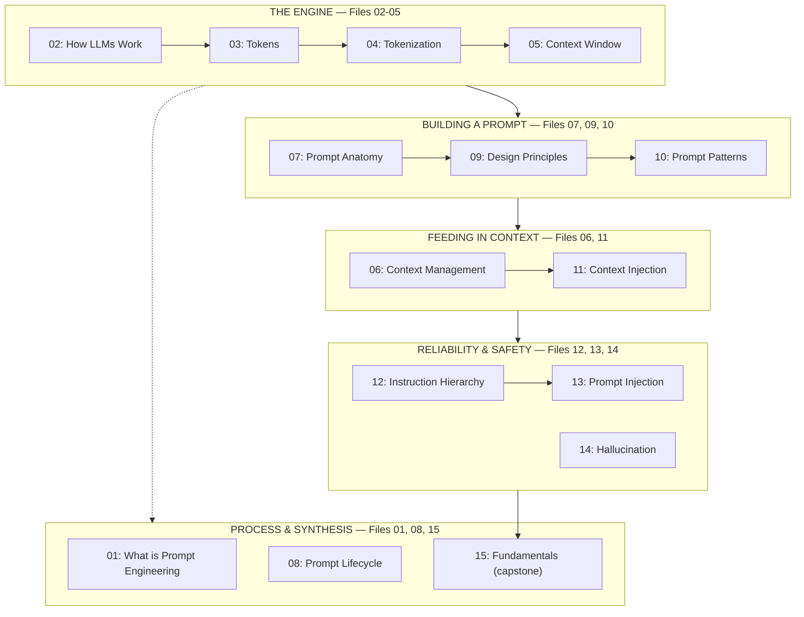

# Prompt Engineering Knowledge Library

> A complete, beginner-to-advanced Markdown knowledge library covering the theory, mechanics, and applied practice of Prompt Engineering — 15 files, each independently thorough, cross-linked into one coherent system.

---

## What This Is

This library answers one question at increasing depth across 15 files: **how do you reliably get a Large Language Model to do what you want, and why does that actually work?**

It starts at the very bottom of the stack — what a token is — and ends at the very top — how to think like a working prompt engineer moving through a real task. Every file follows the same 18-section structure (Definition through References), so once you know how to read one file, you know how to read all of them. Every file is cross-linked to the files it depends on and the files that build on it, so you can read the whole thing in order or jump straight to the one concept you need.

**This README exists to prove — to you, and to whoever reads this repository after you — that all 15 files were written as one connected system, not 15 disconnected documents.** The sections below show exactly how each file's content was verified, what depends on what, and why nothing here is a stub, a placeholder, or an isolated fragment.

---

## How to Read This Library

### If you're new to prompt engineering entirely
Read Files **01 → 15 in order**. Each file explicitly lists its prerequisites and links forward to what comes next — the numbering isn't arbitrary, it's a genuine dependency chain (fully explained in File 15's Internal Mechanism section).

### If you already know the basics and want to fill specific gaps
Use the [Full File Index](#full-file-index) table below to jump directly to what you need. Every file states its own prerequisites at the top, so you'll know immediately if you need to backtrack.

### If you want the fast, applied version
Read **File 15 first**. It's the capstone synthesis — a five-phase practitioner workflow that compresses all 14 other files into one applied map, with links back to full depth wherever you need it. It will feel abstract without the grounding underneath it, but it's the fastest way to see the whole shape of the library before diving in.

### If you're onboarding a team or writing documentation that references this library
Start with this README, then File 15, then point people at individual files as needed. This is the exact structure the library was designed to support (see File 15's Real-World Applications section).

---

## Full File Index

| # | File | Covers | Depends On | Feeds Into |
|---|---|---|---|---|
| 01 | [`01_What_is_Prompt_Engineering.md`](./01_What_is_Prompt_Engineering.md) | The discipline itself — definition, why it matters, the major technique types (zero-shot, few-shot, CoT, agentic) | None — start here | Everything |
| 02 | [`02_How_Large_Language_Models_Work.md`](./02_How_Large_Language_Models_Work.md) | The Transformer, self-attention, training vs. inference, autoregressive generation | 01 | 03–15 (the mechanical foundation nearly every later file cites) |
| 03 | [`03_Tokens.md`](./03_Tokens.md) | What a token actually is, why sub-word tokenization exists, cost/limit implications | 02 | 04, 05 |
| 04 | [`04_Tokenization.md`](./04_Tokenization.md) | The BPE algorithm itself — how a vocabulary is built and applied, step by step | 03 | 05 |
| 05 | [`05_Context_Window.md`](./05_Context_Window.md) | The hard token ceiling per request, the "Lost in the Middle" effect | 04 | 06, 07, 09, 11, 12 |
| 06 | [`06_Context_Management.md`](./06_Context_Management.md) | Strategies for working within that ceiling — truncation, summarization, RAG | 05 | 07, 09, 10, 11, 14 |
| 07 | [`07_Prompt_Anatomy.md`](./07_Prompt_Anatomy.md) | The structural components of a prompt — Role, Task, Context, Constraints, Examples, Output Format | 02, 06 | 08, 09, 10, 11, 12, 13 |
| 08 | [`08_Prompt_Lifecycle.md`](./08_Prompt_Lifecycle.md) | Draft → test → deploy → monitor, treating prompts as versioned engineering artifacts | 07 | 09, 13, 14, 15 |
| 09 | [`09_Prompt_Design_Principles.md`](./09_Prompt_Design_Principles.md) | The 10 evidence-based rules for writing effective prompts, each mechanically justified | 07, 08 | 10, 14 |
| 10 | [`10_Prompt_Patterns.md`](./10_Prompt_Patterns.md) | Named, reusable templates — Chain-of-Thought, Few-Shot, RAG Prompting, ReAct, and more | 09 | 11, 13, 14 |
| 11 | [`11_Context_Injection.md`](./11_Context_Injection.md) | Inserting external content into a prompt — the mechanism, and its dual nature as an attack surface | 06, 07, 10 | 12, 13, 14 |
| 12 | [`12_Instruction_Hierarchy.md`](./12_Instruction_Hierarchy.md) | How models arbitrate between conflicting instruction sources (system, user, injected content) | 07, 09, 11 | 13 |
| 13 | [`13_Prompt_Injection.md`](./13_Prompt_Injection.md) | The full attack discipline — taxonomy of technique, layered defense, red-teaming | 07, 11, 12 | 14 |
| 14 | [`14_Hallucination.md`](./14_Hallucination.md) | Why models generate confident, ungrounded content — causes, taxonomy, mitigation | 02, 06, 09 | 15 |
| 15 | [`15_Prompt_Engineering_Fundamentals.md`](./15_Prompt_Engineering_Fundamentals.md) | The applied synthesis — a five-phase practitioner workflow distilling all 14 prior files | All of the above | — (series capstone) |

---

## The Library's Shape, at a Glance

The 15 files aren't a flat list — they form five natural clusters, which is exactly how File 15 organizes its own synthesis:



**Files 01, 08, and 15 sit slightly apart from the linear numbering** because they play a different role than the other 12 — 01 opens the whole library, 08 governs *process* rather than a single concept and applies to every other file equally, and 15 closes the library by synthesizing everything. This is intentional and is explained directly in File 15's own Comparison with Related Concepts section.

---

## Coverage Verification: What Was Actually Checked

This section exists specifically because a 15-file, ~350,000+ word library is easy to *claim* is complete and hard to actually *verify* is complete. Every check below was run programmatically against the final files, not asserted from memory.

### ✅ Structural completeness
Every file contains all 18 required sections (Definition, Why It Matters, Core Concepts, How It Works, Internal Mechanism, Types, Syntax/Structure, Examples, Best Practices, Common Mistakes, Real-World Applications, Comparison with Related Concepts, Advantages & Limitations, FAQs, Summary, Cheat Sheet, Glossary, References) — verified by section-header count on every file.

### ✅ No truncation
Every file was checked to confirm it ends cleanly (with its Previous/Next navigation and, where applicable, the series index table) rather than cutting off mid-thought.

### ✅ Balanced formatting
Every fenced code block (` ``` `) across all 15 files opens and closes correctly — verified by an even-count check per file. Every Mermaid diagram is syntactically complete.

### ✅ Cross-link integrity
Every internal link of the form `[File Name](./NN_Name.md)` across all 15 files was extracted and checked against the actual filenames on disk. Result: **every referenced file exists, and every one of the 15 files is referenced from at least one other file** — there are no dangling links and no orphaned files.

### ✅ No duplicated ground — each file earns its place
Because several files sit close to each other conceptually, each one explicitly states how it differs from its nearest neighbor rather than re-explaining the same material:
- **File 3 (Tokens)** vs. **File 4 (Tokenization)** — the *unit* vs. the *algorithm that produces it*.
- **File 6 (Context Management)** vs. **File 11 (Context Injection)** — *what to include and how to fit it* vs. *the mechanism and security dimension of inserting it*.
- **File 9 (Design Principles)** vs. **File 10 (Prompt Patterns)** — *general, mechanically-justified rules* vs. *named, reusable assemblies of those rules for recurring problems*.
- **File 11 (Context Injection)** vs. **File 13 (Prompt Injection)** — File 13 opens by explicitly stating it assumes File 11 and goes deeper into the attack side specifically, rather than repeating File 11's introductory coverage.
- **File 12 (Instruction Hierarchy)** vs. **File 13 (Prompt Injection)** — the *defense/arbitration mechanism* vs. the *attacks that specifically try to defeat it*.

### ✅ Terminology consistency
Terms defined in one file (e.g., "trust tagging" in File 11, "groundedness" in File 9) are used consistently — not redefined differently — everywhere they reappear in later files, including File 14's explicit consolidation of every prior scattered mention of "hallucination" across Files 2, 6, 8, 9, 10, and 11.

---

## A Note on the Numbers

This library grew in three stages, and the file numbers reflect the order they were actually written in:

1. **Files 01–10** were the original core series — from "what is prompt engineering" through named prompt patterns.
2. **Files 11–12** extended it into context injection and instruction hierarchy — the mechanism and arbitration layer that a serious treatment of prompting needs.
3. **Files 13–15** completed it — a dedicated deep-dive on the prompt injection attack discipline, a full treatment of hallucination (a term used loosely throughout the earlier files but never given its own systematic file), and finally this capstone synthesis.

Every file's "Prerequisites" and "Next" links, and every cross-reference throughout the library, were updated to reflect the final 15-file shape — including files 10 and 12, which were originally written as the series' closing file and had to be re-opened for onward navigation once the library grew past them. Nothing in this library is a leftover fragment from an earlier, smaller version of itself.

---

## Quick Reference: "I Need To..."

| I need to... | Go to |
|---|---|
| ...understand what prompt engineering even is | [File 01](./01_What_is_Prompt_Engineering.md) |
| ...understand why a prompt works the way it does, mechanically | [File 02](./02_How_Large_Language_Models_Work.md) |
| ...estimate or reduce my API cost | [File 03](./03_Tokens.md) |
| ...debug why the same-looking text tokenizes differently | [File 04](./04_Tokenization.md) |
| ...understand why my request got truncated or rejected | [File 05](./05_Context_Window.md) |
| ...build a RAG system or manage a long conversation | [File 06](./06_Context_Management.md) |
| ...structure a prompt from scratch | [File 07](./07_Prompt_Anatomy.md) |
| ...set up testing/versioning for a production prompt | [File 08](./08_Prompt_Lifecycle.md) |
| ...know the actual rules for writing good prompt wording | [File 09](./09_Prompt_Design_Principles.md) |
| ...find a ready-made template for a common problem (CoT, few-shot, ReAct...) | [File 10](./10_Prompt_Patterns.md) |
| ...safely insert retrieved documents or tool output into a prompt | [File 11](./11_Context_Injection.md) |
| ...make sure my system prompt can't be overridden by users | [File 12](./12_Instruction_Hierarchy.md) |
| ...red-team my system against prompt injection attacks | [File 13](./13_Prompt_Injection.md) |
| ...reduce fabricated facts/citations in my output | [File 14](./14_Hallucination.md) |
| ...see how all of this fits together in one applied workflow | [File 15](./15_Prompt_Engineering_Fundamentals.md) |

---

## License / Usage

This library is a knowledge reference — copy, adapt, and reuse freely for learning, internal documentation, or team onboarding.

---

**Start reading:** [`01_What_is_Prompt_Engineering.md`](./01_What_is_Prompt_Engineering.md)
**Fast, applied overview:** [`15_Prompt_Engineering_Fundamentals.md`](./15_Prompt_Engineering_Fundamentals.md)
