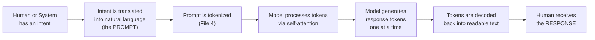
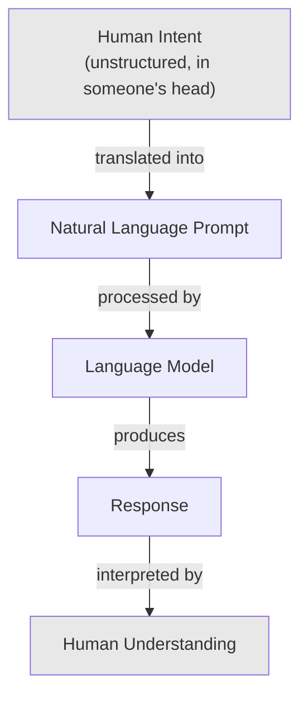
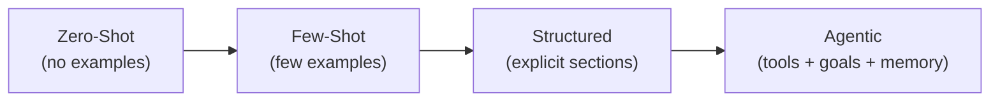

# 01 — What is a Prompt

> **Series:** Prompt Engineering Knowledge Library
> **File 1 of 60** | **Level:** Beginner
> **Prerequisites:** None — this is the entry point
> **Next:** [`02_History_of_Prompts.md`](./02_History_of_Prompts.md)

---

## Table of Contents

1. [Definition](#definition)
2. [Why It Matters](#why-it-matters)
3. [Core Concepts](#core-concepts)
4. [How It Works](#how-it-works)
5. [Internal Mechanism](#internal-mechanism)
6. [Types of Prompts](#types-of-prompts)
7. [Syntax / Structure](#syntax--structure)
8. [Examples (Simple → Advanced)](#examples-simple--advanced)
9. [Best Practices](#best-practices)
10. [Common Mistakes](#common-mistakes)
11. [Real-World Applications](#real-world-applications)
12. [Comparison with Related Concepts](#comparison-with-related-concepts)
13. [Advantages & Limitations](#advantages--limitations)
14. [FAQs](#faqs)
15. [Summary](#summary)
16. [Cheat Sheet](#cheat-sheet)
17. [Glossary](#glossary)
18. [References](#references)
19. [Visual Diagram Gallery](#visual-diagram-gallery)

---

## Definition

A **prompt** is the input text (and, in modern multimodal systems, sometimes images, audio, or other data) given to a language model to elicit a response. It is the sole mechanism by which a human — or another piece of software — communicates intent to a large language model (LLM). Everything the model "knows" about what you want in a given interaction is conveyed through the prompt; the model has no other channel for receiving instructions at inference time.

> A prompt is not merely a "question." It can be an instruction, a partial sentence to complete, a block of data to transform, a persona to adopt, a set of examples to learn from, or any combination of these. The unifying property is that **a prompt is whatever text sits in the model's input context immediately before it begins generating.**

```
PROMPT = everything the model reads
RESPONSE = everything the model generates in reply
```

---

## Why It Matters

- **It is the only interface.** Unlike traditional software, where behavior is fixed by code, an LLM's behavior for any given task is shaped almost entirely by the prompt at inference time. Change the prompt, and you change the effective "program" the model runs — without touching a single model weight.
- **Small wording changes cause large output changes.** Because LLMs are highly sensitive to phrasing, structure, and framing, two prompts that a human would consider "basically the same" can produce meaningfully different outputs in quality, tone, or correctness.
- **It democratizes AI development.** Prompting requires no machine learning expertise, no training infrastructure, and no code — which is precisely why prompt engineering emerged as a distinct discipline rather than remaining a narrow subfield of ML research.
- **It is the foundation every other file in this library builds on.** Every subsequent topic — anatomy, lifecycle, optimization, evaluation, system prompts, output control — is a refinement of "how do I write better prompts," which presupposes a clear understanding of what a prompt fundamentally *is*.

---

## Core Concepts

| Concept | Definition |
|---|---|
| **Input** | The text (and optional multimodal data) submitted to the model |
| **Output / Completion** | The text the model generates in response to the input |
| **Context Window** | The finite space (measured in tokens) that holds both the prompt and the growing response |
| **Token** | The basic unit of text the model reads and generates (roughly a word-piece; see [File 4](./04_How_LLMs_Interpret_Prompts.md)) |
| **Inference** | The act of running a prompt through the model to produce a response, as opposed to training |
| **Instruction** | A prompt element that tells the model what to do |
| **Data** | A prompt element that supplies content for the model to work on or reference |
| **Persona / Role** | A framing device within a prompt that asks the model to respond as if it were a particular character or expert |

---

## How It Works



At the highest level, a prompt is the bridge between a human intent (which lives in someone's head, ambiguous and unstructured) and a machine-readable instruction (which must be explicit enough for a statistical model to act on correctly). The entire discipline of prompt engineering exists because this translation step — from vague intent to precise, effective natural language — is neither trivial nor mechanical; it is a skill with principles, patterns, and failure modes, which the remaining 29 files of this library systematically cover.

---

## Internal Mechanism

Mechanically, a prompt is not "read" by the model the way a human reads a page. Before any computation happens:

1. The raw prompt string is broken into **tokens** — sub-word units from a fixed vocabulary (covered in depth in [File 4](./04_How_LLMs_Interpret_Prompts.md)).
2. Each token is converted into a numerical vector (an **embedding**).
3. These vectors are combined with **positional information**, since the model needs to know token order.
4. The resulting sequence of vectors is what actually enters the neural network — the model never sees "words" in any human sense, only these numerical representations.

This matters for prompt engineering practically: because the model operates on tokens, not words, some interventions that seem like they "should" work from a human-language perspective (e.g., certain formatting, spacing, or capitalization choices) can have outsized or unexpected effects, since they alter the underlying token sequence in non-obvious ways.

---

## Types of Prompts

| Type | Description | Example Use Case |
|---|---|---|
| **Instructional Prompt** | Directly tells the model what task to perform | "Summarize this article in 3 bullet points." |
| **Completion Prompt** | Gives a partial input for the model to continue | "The capital of France is" |
| **Conversational Prompt** | Part of an ongoing multi-turn dialogue | A chat message in an existing thread |
| **Few-Shot Prompt** | Includes examples of the desired input/output pattern | Showing 3 sample translations before asking for a 4th |
| **Zero-Shot Prompt** | Asks the model to perform a task with no examples given | "Translate this sentence to Spanish." |
| **System-Level Prompt** | Sets persistent behavior/context for an entire session (see [File 21](./21_System_Prompts.md)) | "You are a helpful customer support agent for Acme Corp." |
| **Multimodal Prompt** | Combines text with images, audio, or other data types | "Describe what's happening in this image." |

---

## Syntax / Structure

At its simplest, a prompt has no required syntax at all — plain natural language is a completely valid prompt:

```text
Write a short poem about the ocean.
```

As tasks grow more complex, structure becomes valuable (this is expanded fully in [File 5 — Prompt Components](./05_Prompt_Components.md) and [File 6 — Prompt Anatomy](./06_Prompt_Anatomy.md)):

```text
[ROLE]       You are an expert marine biologist.
[TASK]       Explain why coral reefs are dying.
[CONSTRAINT] Keep the explanation under 100 words.
[FORMAT]     Respond in plain prose, no bullet points.
```

```xml
<!-- Structured/delimited style, common in production systems -->
<instruction>
Summarize the following article in exactly 3 sentences.
</instruction>

<article>
[article text goes here]
</article>
```

---

## Examples (Simple → Advanced)

**Level 1 — Minimal:**
```text
What is the capital of Japan?
```

**Level 2 — Instructional with constraint:**
```text
Explain what the capital of Japan is, in exactly one sentence.
```

**Level 3 — Role + task:**
```text
You are a geography teacher speaking to a 10-year-old. 
Explain what a capital city is, using Japan as the example.
```

**Level 4 — Few-shot pattern:**
```text
Q: What is the capital of France?
A: Paris.

Q: What is the capital of Italy?
A: Rome.

Q: What is the capital of Japan?
A:
```

**Level 5 — Full structured prompt with data injection:**
```xml
<role>You are a travel assistant.</role>
<task>Given the country below, state its capital and one 
notable landmark located there.</task>
<constraints>
- Respond in exactly two sentences.
- Do not include any country other than the one given.
</constraints>
<data>
Country: Japan
</data>
```

---

## Best Practices

1. **Start simple, then add structure only as complexity demands it** — not every prompt needs XML tags and role framing; over-engineering a simple request wastes effort and can sometimes confuse rather than clarify.
2. **Be explicit rather than assuming shared context** — the model only knows what is in the prompt (and its training data); it cannot infer unstated intent the way a human colleague might.
3. **Separate instructions from data clearly** once a prompt includes external content, using delimiters (fully covered in [File 6](./06_Prompt_Anatomy.md) and [File 26](./26_Context_Injection.md)).
4. **Treat the prompt as the primary lever for behavior change** — before assuming a task is "impossible" for a model, consider whether a better-engineered prompt would succeed.
5. **Read your own prompt as if you were the model**, with zero outside context — this simple habit catches a large fraction of ambiguity issues before they cause bad outputs.

---

## Common Mistakes

| Mistake | Consequence | Fix |
|---|---|---|
| Assuming the model shares context it was never given | Irrelevant or generic responses | Explicitly state all necessary background in the prompt |
| Vague, open-ended phrasing ("make this better") | Unpredictable, inconsistent outputs | State the specific dimension of improvement wanted (clarity, brevity, tone, etc.) |
| Mixing instructions and data with no separation | Model may misinterpret data as instructions | Use clear delimiters (quotes, XML tags, headers) |
| Treating the first response as final | Missed opportunities for refinement | Iterate on the prompt (see [File 16](./16_Prompt_Iteration.md)) |
| Ignoring that wording changes behavior | Inconsistent results across similar-seeming prompts | Test variations systematically ([File 14](./14_Prompt_Testing.md)) |

---

## Real-World Applications

- **Search and question-answering systems** — a user's query is itself a prompt handed to an underlying model.
- **Coding assistants** — natural-language prompts are translated into code generation or code explanation tasks.
- **Content generation tools** — marketing copy, blog posts, and creative writing are all produced from prompts.
- **Customer support chatbots** — system-level prompts define the bot's persona and boundaries for every user interaction.
- **Data extraction and transformation pipelines** — prompts instruct models to convert unstructured text into structured formats (see [File 29](./29_Output_Formatting.md)).
- **Agentic systems** — prompts define the goals, tools, and constraints an autonomous AI agent operates under.

---

## Comparison with Related Concepts

| Concept | Difference from a Prompt |
|---|---|
| **Query (traditional search)** | A search query retrieves existing documents via keyword/semantic matching; a prompt generates *new* text via a model's learned parameters |
| **Program / Code** | Code is a fixed, deterministic set of instructions executed the same way every time; a prompt is natural language interpreted probabilistically, and can yield different outputs even when repeated |
| **Training Data** | Training data shapes the model's underlying weights over a long process; a prompt provides input at inference time, after training is already complete, and does not alter the model's weights |
| **System Prompt (File 21)** | A system prompt is a *specific category* of prompt — persistent, session-level configuration — whereas "prompt" is the general term for any input to the model |

---

## Advantages & Limitations

### ✅ Advantages

- **No specialized technical skill required** to get started — natural language is the interface.
- **Instant iteration** — changing behavior means changing text, not retraining a model.
- **Extremely flexible** — a single model can perform an enormous range of tasks purely through different prompts.

### ⚠️ Limitations

- **Sensitive to phrasing** — small wording changes can cause disproportionate output changes, which can feel unpredictable to newcomers.
- **No persistent memory across separate sessions** (absent an external system) — each prompt is generally processed fresh unless conversation history is explicitly re-included ([File 25](./25_Context_Management.md)).
- **Bounded by the context window** — there is a hard limit to how much prompt (plus response) a model can process at once.
- **Cannot fix a fundamentally incapable model** — prompting improves how well a model *expresses* its capabilities but cannot grant capabilities the underlying model does not have at all.

---

## FAQs

**Q: Is a prompt the same thing as a "question"?**
A: No. A question is one type of prompt, but prompts also include instructions, partial text for completion, data for transformation, and more, as shown in the Types section above.

**Q: Does a longer prompt always produce a better response?**
A: Not necessarily. Length should match the complexity of the task — see [File 9 — Prompt Design Principles](./09_Prompt_Design_Principles.md) for the specificity/concision balance.

**Q: Can a prompt include things other than text?**
A: Yes, in multimodal systems, prompts can include images, audio, or other data alongside or instead of text.

**Q: Who "writes" prompts — only end users?**
A: No. Prompts are written by end users, by application developers (system prompts), and increasingly by other AI systems in agentic pipelines. See [Files 21–23](./21_System_Prompts.md) for the full breakdown of prompt sources.

---

## Summary

A prompt is the fundamental unit of communication between a human (or system) and a large language model — the sole channel through which intent is conveyed at inference time. It can take many forms (instructional, conversational, few-shot, multimodal) and can range from a single unstructured sentence to a highly structured block with explicit roles, constraints, and injected data. Understanding a prompt as "everything the model reads before it responds" is the conceptual foundation for every other topic in this library, from its historical evolution ([File 2](./02_History_of_Prompts.md)) through to advanced output validation ([File 30](./30_Response_Validation.md)).

---

## Cheat Sheet

```text
WHAT IS A PROMPT — QUICK REFERENCE

PROMPT = Input given to a model to elicit a response
       = Instructions + Data + (optional) Examples + (optional) Persona

CORE TRUTH: The model only knows what's in the prompt (+ training data)

QUICK CHECKLIST FOR ANY PROMPT
[ ] Is the task explicitly stated?
[ ] Is all necessary context included?
[ ] Are instructions separated from data?
[ ] Is the desired output format clear?
[ ] Have I read it as if I were the model, with no outside context?
```

| If your prompt is... | Then... |
|---|---|
| A single simple question | Plain natural language is enough |
| A complex multi-part task | Add structure (see File 6) |
| Including external data | Use delimiters (see File 6, File 26) |
| Meant to persist across a session | Consider a system prompt (File 21) |

---

## Glossary

| Term | Definition |
|---|---|
| **Prompt** | The input text/data given to a model to elicit a response |
| **Response / Completion** | The text a model generates in reply to a prompt |
| **Token** | The basic unit of text a model reads/generates |
| **Context Window** | The total space available for prompt + response |
| **Inference** | Running a prompt through a trained model to get an output |
| **Zero-Shot** | A prompt with no examples given |
| **Few-Shot** | A prompt that includes example input/output pairs |
| **System Prompt** | A persistent, session-level prompt setting overall behavior |

---

## References

- Radford, A. et al. (2019) — *Language Models are Unsupervised Multitask Learners* (GPT-2 paper), OpenAI
- Brown, T. et al. (2020) — *Language Models are Few-Shot Learners* (GPT-3 paper), arXiv:2005.14165
- Vaswani, A. et al. (2017) — *Attention Is All You Need*, arXiv:1706.03762
- Anthropic — [Introduction to Prompt Engineering](https://docs.claude.com/en/docs/build-with-claude/prompt-engineering/overview)
- OpenAI — [Prompt Engineering Guide](https://platform.openai.com/docs/guides/prompt-engineering)

---

## Visual Diagram Gallery

**Diagram 1 — The Prompt as a Bridge**


**Diagram 2 — Anatomy at a Glance (previewing File 6)**
```text
┌─────────────────────────────────────────┐
│                 PROMPT                  │
│  ┌───────────┐  ┌────────┐  ┌────────┐  │
│  │  Persona  │  │  Task  │  │  Data  │  │
│  │ (optional)│  │(usually│  │(often  │  │
│  │           │  │required)│  │optional)│  │
│  └───────────┘  └────────┘  └────────┘  │
│  ┌────────────────────────────────────┐ │
│  │      Constraints / Format           │ │
│  │           (optional)                │ │
│  └────────────────────────────────────┘ │
└─────────────────────────────────────────┘
```

**Diagram 3 — Prompt Types Spectrum**


---

**⬅️ Previous:** None — this is the first file
**➡️ Next:** [`02_History_of_Prompts.md`](./02_History_of_Prompts.md) — How prompting evolved from early NLP to modern LLMs.
