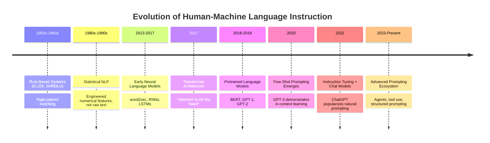
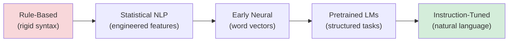
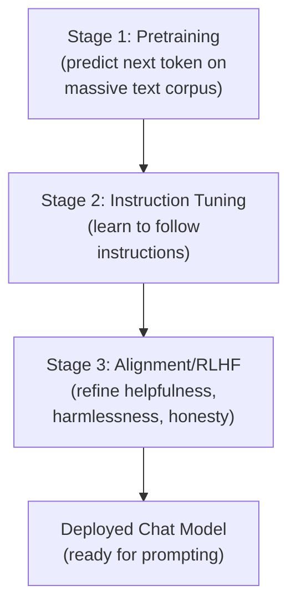

# 02 — History of Prompts

> **Series:** Prompt Engineering Knowledge Library
> **File 2 of 60** | **Level:** Beginner
> **Prerequisites:** [`01_What_is_a_Prompt.md`](./01_What_is_a_Prompt.md)
> **Next:** [`03_Why_Prompts_Matter.md`](./03_Why_Prompts_Matter.md)

---

## Table of Contents

1. [Definition](#definition)
2. [Why It Matters](#why-it-matters)
3. [Core Concepts](#core-concepts)
4. [How It Works](#how-it-works)
5. [Internal Mechanism](#internal-mechanism)
6. [Types of Historical Eras](#types-of-historical-eras)
7. [Syntax / Structure](#syntax--structure)
8. [Examples (Simple → Advanced)](#examples-simple--advanced)
9. [Best Practices](#best-practices)
10. [Common Mistakes](#common-mistakes)
11. [Real-World Applications](#real-world-applications)
12. [Comparison with Related Concepts](#comparison-with-related-concepts)
13. [Advantages & Limitations](#advantages--limitations)
14. [FAQs](#faqs)
15. [Summary](#summary)
16. [Cheat Sheet](#cheat-sheet)
17. [Glossary](#glossary)
18. [References](#references)
19. [Visual Diagram Gallery](#visual-diagram-gallery)

---

## Definition

The **History of Prompts** traces how the practice of instructing machines with natural language evolved — from rigid, keyword-based command systems in early computing, through statistical NLP's engineered feature inputs, to the modern era where a single well-phrased sentence can direct a general-purpose model to perform almost any language task. Understanding this history matters because prompt engineering is not an isolated invention; it is the natural endpoint of a decades-long trend toward making human-machine communication increasingly closer to natural human language.

> This is fundamentally a story of **decreasing rigidity**: each era removed a layer of formal syntax that the previous era required, culminating in today's LLMs, which can be usefully directed with plain, unstructured sentences.

---

## Why It Matters

- **Context prevents reinventing the wheel.** Many "modern" prompting insights (the value of examples, the importance of clear task framing) echo lessons learned decades earlier in rule-based and statistical NLP systems.
- **It explains *why* LLMs respond to natural language at all.** This capability is the product of a specific research trajectory (statistical language modeling → neural language modeling → large-scale pretraining → instruction tuning), not a spontaneous property.
- **It clarifies the boundary between "prompting" and "programming."** Seeing how far the field has moved from explicit command syntax toward natural language helps engineers understand what today's models can and cannot yet do reliably.
- **It sets up every later file's assumptions.** Concepts like few-shot learning ([File 1](./01_What_is_a_Prompt.md)) and instruction tuning (referenced throughout this file and expanded in [File 10](./10_Prompt_Engineering_Basics.md)) only make sense with their historical origin in view.

---

## Core Concepts

| Concept | Definition |
|---|---|
| **Rule-Based NLP** | Early systems that processed language using hand-written grammatical rules, not learned statistics |
| **Statistical NLP** | Systems that learned language patterns from data using probability, but still required engineered numerical features as input |
| **Neural Language Model** | A model that learns a probability distribution over text using neural networks, the direct predecessor of modern LLMs |
| **Pretraining** | Training a model on a large, general corpus of text before any task-specific tuning |
| **Instruction Tuning** | Further training a pretrained model specifically to follow natural-language instructions well |
| **Emergent Behavior** | Capabilities (like strong few-shot prompting) that appeared at scale without being explicitly programmed |
| **In-Context Learning** | The ability of a model to "learn" a task from examples given directly in the prompt, without any weight updates |

---

## How It Works



Each transition in this timeline represents a reduction in the *formality burden* placed on the human. Rule-based systems required precise, often unnatural syntax matching hard-coded patterns. Statistical NLP required practitioners to hand-engineer numerical features from text before a model could use it at all. Only with large-scale neural pretraining, culminating in the Transformer architecture and models trained at massive scale, did the field reach a point where raw, unstructured natural language became a sufficient and effective input on its own.

---

## Internal Mechanism

### Why scale unlocked natural-language prompting

The pivotal, empirically observed mechanism behind this history is that **certain capabilities do not appear gradually — they emerge relatively suddenly once model size, data size, and compute cross certain thresholds.** Early small language models could complete text plausibly but could not reliably follow novel instructions they had never been explicitly trained on. As models scaled — more parameters, more training tokens, more compute — a qualitatively different capability appeared: the ability to generalize to *new* tasks described only in natural language at inference time, with no gradient updates at all. This is what researchers term **in-context learning**, and its emergence is the single most important mechanical fact explaining why "prompt engineering," as a discipline, only became possible (let alone necessary) in the last several years.

### Why instruction tuning was a separate, necessary step

Raw pretrained models (trained purely to predict the next token on internet-scale text) are not naturally well-behaved instruction-followers — a purely pretrained model often continues text in unhelpful ways (e.g., turning a question into a list of *more* questions, since that pattern appears in its training data). **Instruction tuning** — further training on datasets of (instruction, ideal response) pairs, often refined further with human feedback — is the mechanism that shaped models specifically toward reliably interpreting a prompt *as an instruction to fulfill*, rather than merely text to continue statistically. This is why "prompt engineering" as commonly practiced today assumes an instruction-tuned chat model, not a raw pretrained one.

---

## Types of Historical Eras

| Era | Approx. Period | Defining Characteristic |
|---|---|---|
| **Rule-Based Era** | 1950s–1970s | Hard-coded grammar and pattern-matching rules (e.g., ELIZA); no learning from data |
| **Statistical NLP Era** | 1980s–2000s | Probabilistic models learned from data, but relied on engineered features, not raw prompts |
| **Early Neural Era** | 2013–2017 | Word embeddings and recurrent networks; still largely task-specific, non-conversational |
| **Transformer & Pretraining Era** | 2017–2019 | The Transformer architecture enables efficient large-scale pretraining (BERT, GPT-1/2) |
| **Few-Shot / Emergent Era** | 2020 | GPT-3 demonstrates strong in-context learning from prompts alone, without fine-tuning |
| **Instruction-Tuned / Conversational Era** | 2021–2023 | Models explicitly tuned to follow natural-language instructions and hold dialogue |
| **Modern Agentic Era** | 2023–Present | Prompting extends beyond single-turn text to tool use, memory, and multi-step agents |

---

## Syntax / Structure

Comparing prompt "syntax" across eras illustrates the trend toward natural language directly:

```text
RULE-BASED ERA (illustrative, ELIZA-style pattern matching)
Input pattern:  "I am * "
Rule response:  "Why do you say you are {1}?"
(Not a prompt in the modern sense — a fixed rule triggered by keyword match)
```

```text
STATISTICAL NLP ERA (illustrative feature-based input)
Input to model: [word_freq_vector, POS_tags, n_gram_counts, ...]
(Not natural language at all — pre-processed numerical features)
```

```text
MODERN LLM ERA (natural language prompt)
Input: "Summarize this article in three bullet points, 
        focused on financial implications."
(Direct, unstructured natural language — no preprocessing required)
```

---

## Examples (Simple → Advanced)

**Level 1 — Rule-based interaction (historical, illustrative):**
```text
User:   I am feeling sad.
ELIZA:  Why do you say you are feeling sad?
```
*(A fixed rule matched the "I am ___" pattern — no genuine understanding.)*

**Level 2 — Early statistical NLP (conceptual, not a real prompt):**
```text
Task: Classify sentiment of "I am feeling sad."
System required: hand-built feature vector, e.g.
  [contains_negative_word=1, sentence_length=5, ...]
  fed into a trained classifier — the raw sentence itself
  was not the direct input.
```

**Level 3 — Early neural LM (word embedding era):**
```text
Task: Predict next word.
Input: "I am feeling"
Output: "sad" (probabilistically likely continuation,
         based on learned word-vector relationships)
```

**Level 4 — GPT-3-style few-shot prompting (2020):**
```text
Review: "This movie was fantastic!" → Sentiment: Positive
Review: "Waste of time." → Sentiment: Negative
Review: "I am feeling sad about this film." → Sentiment:
```

**Level 5 — Modern instruction-tuned conversational prompting:**
```text
You are a sentiment analysis assistant. Analyze the 
following review and respond with only one word: 
Positive, Negative, or Neutral.

Review: "I am feeling sad about this film."
```
*(No examples required at all — the instruction alone is sufficient, thanks to instruction tuning.)*

---

## Best Practices

1. **Recognize that few-shot examples remain useful even today**, as a direct legacy of the GPT-3 era — when zero-shot instructions underperform, adding examples is a well-established fallback (fully covered in [File 19 — Prompt Patterns](./19_Prompt_Patterns.md)).
2. **Understand that not all models are equally instruction-tuned** — a raw or lightly-tuned model may behave more like the "completion" era than the modern conversational era, which affects how prompts should be written for it.
3. **Don't assume older NLP techniques are obsolete** — structured feature extraction and rule-based logic still have their place in hybrid systems, particularly for validation ([File 30](./30_Response_Validation.md)).
4. **Track the field's rapid pace** — because this history spans mere years for its most dramatic shifts, best practices from even 2–3 years prior can be meaningfully outdated.

---

## Common Mistakes

| Mistake | Consequence | Fix |
|---|---|---|
| Assuming all language models behave like modern instruction-tuned chat models | Confusing or poor results with raw/base models | Check whether a model is instruction-tuned before writing prompts as if it were |
| Treating prompt engineering as an entirely new invention with no precedent | Missing transferable lessons from decades of NLP research | Study prior eras' insights on clarity, examples, and structure |
| Ignoring that in-context learning is an emergent, scale-dependent property | Expecting small/older models to handle novel instructions as well as large modern ones | Match expectations to the specific model's scale and training |
| Assuming today's prompting techniques will remain unchanged | Outdated practices as the field evolves | Stay current with ongoing research and practitioner guides |

---

## Real-World Applications

- **Understanding legacy chatbot limitations** — customer service bots built on older rule-based or statistical architectures explain much of the frustration users historically had with "bots," context that informs expectations for modern systems.
- **Model selection for production systems** — knowing an era's characteristics helps engineers choose between a lightweight statistical classifier, a smaller neural model, or a large instruction-tuned LLM based on task needs and cost.
- **Research and academic study** — the history of prompting is itself an active area of NLP and AI research, tracing capability emergence at scale.
- **Educating stakeholders** — explaining *why* current AI can be prompted with plain English (when older systems couldn't) helps set realistic expectations in non-technical audiences.

---

## Comparison with Related Concepts

| Concept | Difference from "History of Prompts" |
|---|---|
| **History of AI (general)** | Broader field covering symbolic AI, robotics, computer vision, etc.; History of Prompts is specifically the narrower thread concerning natural-language instruction of models |
| **Model Architecture History** | Focuses on the technical design of models (RNNs → Transformers); History of Prompts focuses on the human-facing *interface* to those models, which changed as a downstream consequence |
| **Prompt Engineering (the discipline, File 10)** | Prompt Engineering is the *current practice*; History of Prompts is the *backstory* explaining how and why that practice became possible and necessary |

---

## Advantages & Limitations

### ✅ Advantages of Understanding This History

- **Builds calibrated expectations** for what different model generations can and cannot do.
- **Surfaces transferable techniques** (clarity, examples, structured input) that recur across eras under different names.
- **Provides a mental model for the field's trajectory**, useful for anticipating near-future developments.

### ⚠️ Limitations

- **The field moves quickly** — any historical account risks becoming outdated as new capabilities emerge.
- **Emergent capabilities are not fully predictable** even with historical pattern awareness — researchers still cannot precisely forecast which capabilities will emerge at which scale.
- **Historical understanding alone does not teach practical skill** — it must be paired with the hands-on principles covered in [Files 9–19](./09_Prompt_Design_Principles.md) of this library.

---

## FAQs

**Q: When did "prompt engineering" become a widely used term?**
A: The term gained significant mainstream traction around 2020–2022, alongside GPT-3's public API access and the subsequent release of conversational instruction-tuned models, though the underlying practice of carefully crafting model inputs existed in narrower forms earlier.

**Q: Were early chatbots like ELIZA using "prompts" in the modern sense?**
A: Not really — ELIZA and similar rule-based systems matched fixed patterns rather than genuinely interpreting flexible natural-language instructions, which is the defining trait of modern prompting.

**Q: What single development most directly enabled modern prompting?**
A: The Transformer architecture (2017), combined with large-scale pretraining, is generally credited as the technical foundation; GPT-3 (2020) is generally credited as the moment strong in-context, few-shot prompting became publicly visible and widely usable.

**Q: Is prompt engineering likely to remain a distinct skill going forward?**
A: This is genuinely debated in the field — some argue models will become so capable that careful prompting matters less over time, while others argue new capabilities (agents, tool use) will keep creating new prompting challenges. This library covers current best practices as of its writing.

---

## Summary

The history of prompts traces a multi-decade shift from rigid, rule-based, and feature-engineered machine instruction toward today's natural-language prompting of large, instruction-tuned models. Key milestones — rule-based systems, statistical NLP, the Transformer architecture, GPT-3's emergent few-shot learning, and instruction tuning — each removed a layer of formal syntax previously required, converging on the modern reality where plain English is often sufficient to direct powerful AI systems. This history is not merely academic trivia; it explains *why* prompt engineering exists as a discipline at all and provides calibrated context for the practical techniques covered throughout the rest of this library, beginning with why these techniques matter in [File 3](./03_Why_Prompts_Matter.md).

---

## Cheat Sheet

```text
HISTORY OF PROMPTS — QUICK TIMELINE

1950s-70s   Rule-Based Systems        (ELIZA, SHRDLU)
1980s-2000s Statistical NLP           (engineered features)
2013-2017   Early Neural LMs          (word2vec, RNNs)
2017        Transformer Architecture  ("Attention Is All You Need")
2018-2019   Pretrained LMs            (BERT, GPT-1/2)
2020        Few-Shot Emergence        (GPT-3)
2021-2023   Instruction Tuning        (ChatGPT and peers)
2023-Now    Agentic/Tool-Use Era      (multi-step, tool-augmented)

KEY INSIGHT: Each era reduced the formality required from humans.
```

---

## Glossary

| Term | Definition |
|---|---|
| **Rule-Based NLP** | Language processing via hard-coded grammatical rules |
| **Statistical NLP** | Language processing learned from data, using engineered features |
| **Transformer** | The neural network architecture underlying essentially all modern LLMs |
| **Pretraining** | Initial large-scale, general-purpose model training |
| **Instruction Tuning** | Further training to follow natural-language instructions well |
| **In-Context Learning** | Learning a task from prompt examples alone, with no weight updates |
| **Emergent Behavior** | A capability appearing at scale without explicit programming |

---

## References

- Weizenbaum, J. (1966) — *ELIZA — A Computer Program for the Study of Natural Language Communication Between Man and Machine*, Communications of the ACM
- Vaswani, A. et al. (2017) — *Attention Is All You Need*, arXiv:1706.03762
- Devlin, J. et al. (2018) — *BERT: Pre-training of Deep Bidirectional Transformers for Language Understanding*, arXiv:1810.04805
- Brown, T. et al. (2020) — *Language Models are Few-Shot Learners*, arXiv:2005.14165
- Ouyang, L. et al. (2022) — *Training Language Models to Follow Instructions with Human Feedback*, arXiv:2203.02155
- Wei, J. et al. (2022) — *Emergent Abilities of Large Language Models*, arXiv:2206.07682

---

## Visual Diagram Gallery

**Diagram 1 — The Formality Reduction Trend**


**Diagram 2 — Capability Emergence at Scale**
```text
Model Capability
      ^
      |                                    ___-- Strong in-context learning
      |                              ___---
      |                        ___---
      |                  __---
      |            __----          <- Emergence threshold
      |      __----
      |__----________________________________> Model Scale (params/data/compute)
```

**Diagram 3 — Three Training Stages of a Modern LLM**


---

**⬅️ Previous:** [`01_What_is_a_Prompt.md`](./01_What_is_a_Prompt.md)
**➡️ Next:** [`03_Why_Prompts_Matter.md`](./03_Why_Prompts_Matter.md) — The practical and business case for careful prompt design.
