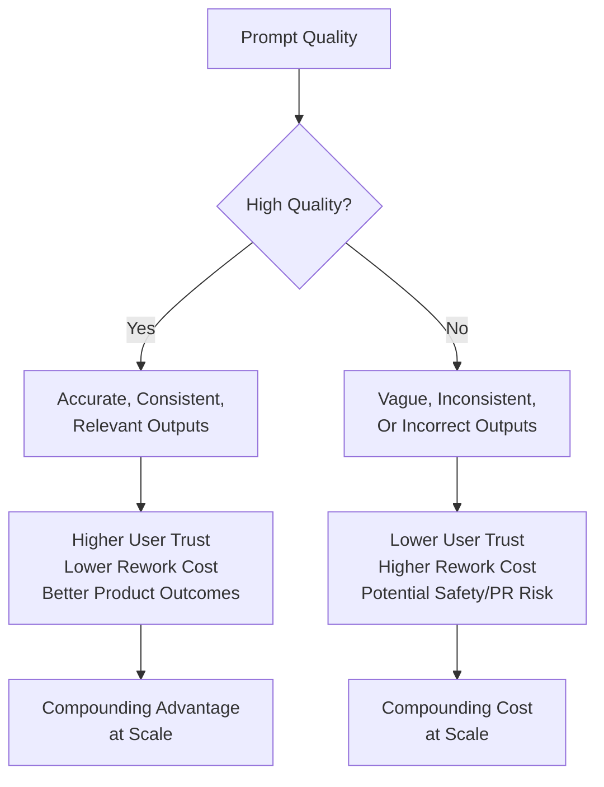
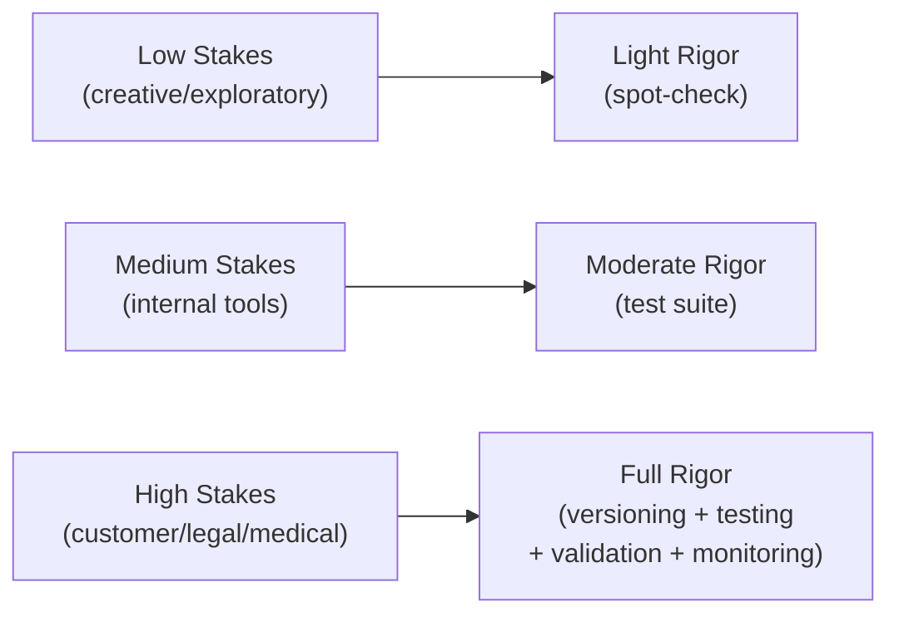
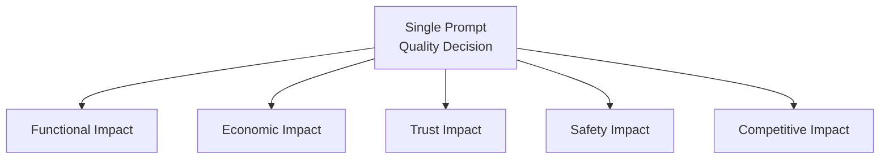

# 03 — Why Prompts Matter

> **Series:** Prompt Engineering Knowledge Library
> **File 3 of 60** | **Level:** Beginner
> **Prerequisites:** [`01_What_is_a_Prompt.md`](./01_What_is_a_Prompt.md), [`02_History_of_Prompts.md`](./02_History_of_Prompts.md)
> **Next:** [`04_How_LLMs_Interpret_Prompts.md`](./04_How_LLMs_Interpret_Prompts.md)

---

## Table of Contents

1. [Definition](#definition)
2. [Why It Matters](#why-it-matters)
3. [Core Concepts](#core-concepts)
4. [How It Works](#how-it-works)
5. [Internal Mechanism](#internal-mechanism)
6. [Types of Impact](#types-of-impact)
7. [Syntax / Structure](#syntax--structure)
8. [Examples (Simple → Advanced)](#examples-simple--advanced)
9. [Best Practices](#best-practices)
10. [Common Mistakes](#common-mistakes)
11. [Real-World Applications](#real-world-applications)
12. [Comparison with Related Concepts](#comparison-with-related-concepts)
13. [Advantages & Limitations](#advantages--limitations)
14. [FAQs](#faqs)
15. [Summary](#summary)
16. [Cheat Sheet](#cheat-sheet)
17. [Glossary](#glossary)
18. [References](#references)
19. [Visual Diagram Gallery](#visual-diagram-gallery)

---

## Definition

**"Why Prompts Matter"** addresses the practical, human, and business case for treating prompt quality as a first-class engineering concern rather than an afterthought. This file distinguishes itself from [File 4](./04_How_LLMs_Interpret_Prompts.md) — which explains the *mechanical/technical* reasons prompts affect output (tokenization, attention) — by focusing instead on the *outcome-level* stakes: cost, reliability, user trust, safety, and competitive advantage that flow from the quality of the prompts an organization or individual writes.

> In short: File 4 answers "*how* does a prompt change output, mechanically?" This file answers "*so what* — what actually happens, in the real world, when prompts are good versus bad?"

---

## Why It Matters

- **Prompt quality directly determines product quality** in any application built on an LLM — a customer-facing chatbot, a coding assistant, or a data pipeline is only as reliable as the prompts driving it.
- **Poor prompts have real costs**: wasted compute (re-running failed requests), wasted human time (manually fixing bad outputs), reputational damage (a chatbot giving embarrassing or incorrect answers publicly), and in high-stakes domains, potential safety harms.
- **Prompt quality is a competitive differentiator.** Two teams using the identical underlying model can produce dramatically different quality products purely based on prompt engineering skill — this is a genuinely learnable and transferable skill, not luck.
- **It scales.** A single flawed prompt template deployed in production doesn't fail once — it fails on every single request that passes through it, potentially thousands or millions of times, making upfront prompt quality investment disproportionately valuable.

---

## Core Concepts

| Concept | Definition |
|---|---|
| **Output Quality** | How well a model's response satisfies the actual intent behind a task |
| **Reliability / Consistency** | How similarly a model behaves across many similar inputs |
| **Cost Efficiency** | The relationship between prompt design and compute/token cost per useful output |
| **User Trust** | The degree to which end users believe and rely on an AI system's outputs |
| **Failure Mode** | A specific, recurring way a prompt or system produces unwanted results |
| **ROI (Return on Investment)** | The value gained relative to the effort spent crafting and refining a prompt |

---

## How It Works



The causal chain is straightforward but easy to underweight: prompt quality is the *earliest* point of leverage in an LLM-powered system, meaning any deficiency introduced there propagates through every downstream step — generation, any tool calls made based on that generation, and ultimately what a human or another system does with the result. Because this chain repeats on every single inference call, small per-prompt quality differences compound into large aggregate differences at production scale.

---

## Internal Mechanism

### Why prompt quality effects compound rather than average out

A single well-known reliability issue with LLMs is **output variance** — even with the same prompt, outputs can differ slightly between runs (especially with non-zero sampling temperature). A vague or ambiguous prompt *widens* this variance further, because the model has more "room" for divergent valid interpretations. A precise, well-constrained prompt *narrows* it. At small scale (a handful of manual uses), this difference is barely noticeable. At production scale (thousands of automated calls), a widened variance distribution means a meaningfully larger fraction of individual outputs fall outside acceptable quality bounds — not because the model got "worse," but because ambiguity in the prompt is mechanically translated into unpredictability in the output, call after call.

### Why the cost of a bad prompt is asymmetric

In most production systems, the cost of a **false negative** (the model fails to do something useful) and a **false positive** (the model does something actively wrong or harmful) are not symmetric. A vague prompt in a low-stakes creative writing tool might merely produce a mediocre poem — low cost. The identical *level* of vagueness in a prompt driving a medical information summarizer, a financial advice tool, or an autonomous agent with real-world actions carries a dramatically higher cost per failure. This is why "why prompts matter" cannot be answered with a single universal cost figure — the stakes scale directly with what the output is used for, which is why later files on evaluation ([File 15](./15_Prompt_Evaluation.md)) and validation ([File 30](./30_Response_Validation.md)) emphasize calibrating rigor to actual risk.

---

## Types of Impact

| Impact Type | Description | Example |
|---|---|---|
| **Functional Impact** | Whether the task gets done correctly at all | A data-extraction prompt that misses required fields |
| **Economic Impact** | Direct cost implications (compute, human rework time) | Re-running failed API calls due to malformed prompts |
| **Trust Impact** | Effect on user confidence in the system | A support bot giving confidently wrong answers |
| **Safety Impact** | Risk of harmful, biased, or dangerous outputs | An unconstrained prompt allowing unsafe content generation |
| **Competitive Impact** | Relative product quality versus alternatives using the same base model | Two companies, same model, different prompt engineering maturity |
| **Scalability Impact** | How well a prompt's quality holds up across volume and edge cases | A prompt that works in demos but breaks on real-world input diversity |

---

## Syntax / Structure

This file is conceptual rather than syntax-driven, but the practical takeaway is structural: organizations that treat prompts seriously typically version-control and document them like code, rather than treating them as disposable strings:

```yaml
# Example: a prompt treated as a versioned, documented artifact
prompt_id: customer_support_triage_v3
owner: support-eng-team
last_updated: 2026-06-01
purpose: >
  Classify incoming support tickets into one of five 
  predefined categories for routing.
known_failure_modes:
  - Misclassifies billing questions as "technical" ~4% of the time
change_log:
  - v3: Added explicit category definitions to reduce billing misclassification
  - v2: Added few-shot examples
  - v1: Initial zero-shot version
```

This treatment — versioning, ownership, documented failure modes — is precisely what distinguishes teams for whom "prompts matter" as a stated value from teams for whom it is only a stated value, expanded fully in [File 17 — Prompt Versioning](./17_Prompt_Versioning.md).

---

## Examples (Simple → Advanced)

**Level 1 — Low-stakes, vague prompt (acceptable cost of failure):**
```text
Write something fun about cats.
```
*Low stakes: if the output is mediocre, the cost is trivial.*

**Level 2 — Same vagueness, higher-stakes context (now costly):**
```text
Write something about our refund policy for the customer.
```
*The vagueness here risks incorrect or inconsistent policy information reaching a real customer.*

**Level 3 — Improved, still moderate stakes:**
```text
Using ONLY the refund policy text provided below, answer the 
customer's question. If the answer isn't in the policy text, 
say so explicitly rather than guessing.

Policy: [text]
Question: [customer question]
```

**Level 4 — High-stakes production prompt with explicit guardrails:**
```text
You are a customer support assistant for Acme Corp. Follow 
these rules strictly:
1. Only answer using the policy document provided below.
2. If the question cannot be answered from the document, 
   respond: "I don't have that information — let me connect 
   you with a human agent."
3. Never invent policy details not present in the document.
4. Do not discuss competitor products.

[policy document]
[customer question]
```

**Level 5 — Enterprise-grade prompt with validation hook (ties to File 30):**
```text
[Full structured prompt as Level 4, PLUS:]

Additionally, output your response in this exact JSON schema 
so it can be automatically validated before reaching the customer:

{
  "answer": "string",
  "source_found_in_policy": true/false,
  "confidence": "high/medium/low"
}
```
*This version doesn't just improve the prompt — it engineers the output so a downstream system can automatically catch and flag low-confidence or unsourced answers before a human customer ever sees them.*

---

## Best Practices

1. **Match prompt engineering investment to actual stakes** — a low-stakes creative tool doesn't need the same rigor as a medical or financial application; over- and under-investing are both mistakes.
2. **Treat production prompts as engineering artifacts**, not throwaway text — version them, document known failure modes, and review changes ([File 17](./17_Prompt_Versioning.md)).
3. **Measure, don't assume, prompt quality** — use structured evaluation ([File 15](./15_Prompt_Evaluation.md)) rather than relying on a handful of manual spot-checks.
4. **Consider the full cost chain**, not just immediate output quality — factor in downstream rework, user trust erosion, and compounding effects at scale.
5. **Communicate the "why" to non-technical stakeholders** — framing prompt engineering in terms of cost, trust, and reliability (rather than purely technical terms) helps secure appropriate organizational investment.

---

## Common Mistakes

| Mistake | Consequence | Fix |
|---|---|---|
| Treating all prompts as equally low-stakes | Under-investment in prompts feeding high-consequence systems | Explicitly assess stakes before deciding how much rigor to apply |
| Never revisiting a prompt after initial deployment | Silent quality degradation as edge cases accumulate | Establish ongoing monitoring ([File 7 — Prompt Lifecycle](./07_Prompt_Lifecycle.md)) |
| Assuming a "good enough" demo prompt will hold up at scale | Production failures on inputs the demo never tested | Test against realistic input diversity ([File 14 — Prompt Testing](./14_Prompt_Testing.md)) |
| Ignoring the asymmetric cost of false positives vs. false negatives | Mis-calibrated risk tolerance for the actual use case | Explicitly reason about which failure type is more costly for this specific application |
| Under-communicating prompt engineering value to leadership | Insufficient resourcing for what is treated as "just typing" | Frame impact in business terms: cost, trust, risk, competitive advantage |

---

## Real-World Applications

- **Customer-facing chatbots** — prompt quality is the direct determinant of whether users trust and continue using the product.
- **Enterprise data pipelines** — a poorly engineered extraction prompt silently corrupts downstream data at scale, often undetected for a long time.
- **Legal and compliance-adjacent tools** — the cost of an imprecise prompt in these domains can include real regulatory or liability exposure.
- **Developer productivity tools** (coding assistants) — prompt quality determines whether suggested code is genuinely useful or introduces subtle bugs.
- **Healthcare-adjacent information tools** — among the highest-stakes domains, where prompt imprecision has directly safety-relevant consequences.

---

## Comparison with Related Concepts

| Concept | Difference from "Why Prompts Matter" |
|---|---|
| **How LLMs Interpret Prompts (File 4)** | File 4 explains the *mechanical* reason prompts affect output (tokenization, attention weighting); this file explains the *practical/business* stakes of that mechanical fact |
| **Prompt Design Principles (File 9)** | File 9 provides the *actionable maxims* for writing good prompts; this file provides the *motivation* for why following those maxims is worth the effort |
| **Prompt Evaluation (File 15)** | Evaluation is the *measurement methodology*; this file is the *conceptual case* for why that measurement is worth doing in the first place |

---

## Advantages & Limitations

### ✅ Advantages of Internalizing "Why Prompts Matter"

- **Justifies proper resourcing** for prompt engineering as a discipline within a team or organization.
- **Improves risk calibration** — teams that understand the stakes make better decisions about how much rigor a given prompt needs.
- **Encourages proactive rather than reactive practices** — versioning, testing, and monitoring before failures occur, not only after.

### ⚠️ Limitations

- **Understanding "why" doesn't teach "how"** — this file is motivational/conceptual, not a technical skill in itself; skill comes from [Files 9 onward](./09_Prompt_Design_Principles.md).
- **Stakes assessment itself requires judgment** — reasonably determining "how much does this prompt matter" is not always obvious and can itself be a source of miscalibration.
- **Diminishing returns exist** — beyond a certain point, additional prompt refinement effort yields shrinking quality improvements, and recognizing that point is also a skill (see [File 11 — Prompt Optimization](./11_Prompt_Optimization.md)).

---

## FAQs

**Q: Does prompt quality matter equally for every single use case?**
A: No — stakes vary enormously by domain and consequence of failure, as covered in the Types of Impact section above. Calibrating effort to actual stakes is itself a best practice.

**Q: Can better prompt engineering fully compensate for a weaker underlying model?**
A: Partially, but not entirely — prompting improves how well a model *expresses* its existing capabilities; it cannot grant capabilities the model fundamentally lacks. See the Limitations section in [File 1](./01_What_is_a_Prompt.md).

**Q: Is prompt engineering's business value mainly about cost savings, or also about product quality?**
A: Both — the Types of Impact section above shows that functional, economic, trust, safety, and competitive impacts are all distinct, simultaneous consequences of prompt quality.

**Q: How do teams measure whether their prompts are "good enough"?**
A: Through structured evaluation practices, covered fully in [File 15 — Prompt Evaluation](./15_Prompt_Evaluation.md), rather than informal judgment alone.

---

## Summary

Prompt quality is not a cosmetic concern — it is the earliest and highest-leverage point in any LLM-powered system, directly determining functional correctness, cost efficiency, user trust, safety, and competitive standing. Because these effects compound at production scale (the same ambiguity that's harmless in a single manual use becomes a systematic, repeated cost across thousands of automated calls), and because failure costs are asymmetric across different use cases, treating prompt engineering with appropriate rigor — calibrated to actual stakes — is a genuinely consequential decision, not a stylistic preference. This practical "why" motivates the mechanical "how" explored next in [File 4](./04_How_LLMs_Interpret_Prompts.md), and the concrete design principles that follow throughout the rest of this library.

---

## Cheat Sheet

```text
WHY PROMPTS MATTER — QUICK REFERENCE

THE COMPOUNDING EFFECT
Bad Prompt (1 use)     = Minor annoyance
Bad Prompt (1000 uses) = Systematic cost, at scale

STAKES CALIBRATION
Low stakes  (creative, exploratory)  -> Lighter rigor acceptable
Med stakes  (internal tools)         -> Moderate testing/review
High stakes (customer-facing, legal,
             medical, financial)     -> Full rigor: versioning,
                                         testing, validation, monitoring

IMPACT TYPES TO CONSIDER
[ ] Functional   — does it work?
[ ] Economic     — what does failure cost?
[ ] Trust        — does it erode user confidence?
[ ] Safety       — could failure cause harm?
[ ] Competitive  — does quality differentiate us?
```

---

## Glossary

| Term | Definition |
|---|---|
| **Output Quality** | How well a response satisfies the true intent behind a task |
| **Output Variance** | The degree to which outputs differ across repeated similar inputs |
| **Failure Mode** | A specific, recurring way a prompt produces unwanted results |
| **Stakes** | The real-world consequence/cost of a given prompt failing |
| **ROI (Prompt Engineering)** | The value gained relative to the effort invested in prompt quality |
| **Compounding Cost** | The way small per-instance failures accumulate into large costs at scale |

---

## References

- Anthropic — [Prompt Engineering Overview](https://docs.claude.com/en/docs/build-with-claude/prompt-engineering/overview)
- OpenAI — [Best Practices for Prompt Engineering](https://help.openai.com/en/articles/6654000-best-practices-for-prompt-engineering-with-the-openai-api)
- Liang, P. et al. (2022) — *Holistic Evaluation of Language Models (HELM)*, arXiv:2211.09110
- Ribeiro, M. et al. (2020) — *Beyond Accuracy: Behavioral Testing of NLP Models with CheckList*, ACL 2020

---

## Visual Diagram Gallery

**Diagram 1 — The Cost Compounding Curve**
```text
Cumulative Cost
      ^
      |                                        Bad Prompt
      |                                    __--
      |                              __---
      |                        __---
      |                  __---
      |            __--- Good Prompt
      |__----________________________________> Number of Requests
```

**Diagram 2 — Stakes-to-Rigor Mapping**


**Diagram 3 — The Impact Fan-Out**


---

**⬅️ Previous:** [`02_History_of_Prompts.md`](./02_History_of_Prompts.md)
**➡️ Next:** [`04_How_LLMs_Interpret_Prompts.md`](./04_How_LLMs_Interpret_Prompts.md) — The technical/mechanical side of how models process prompts.
