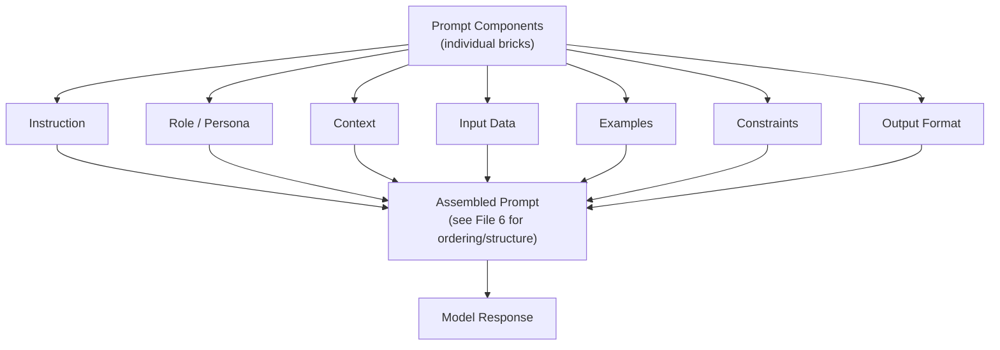
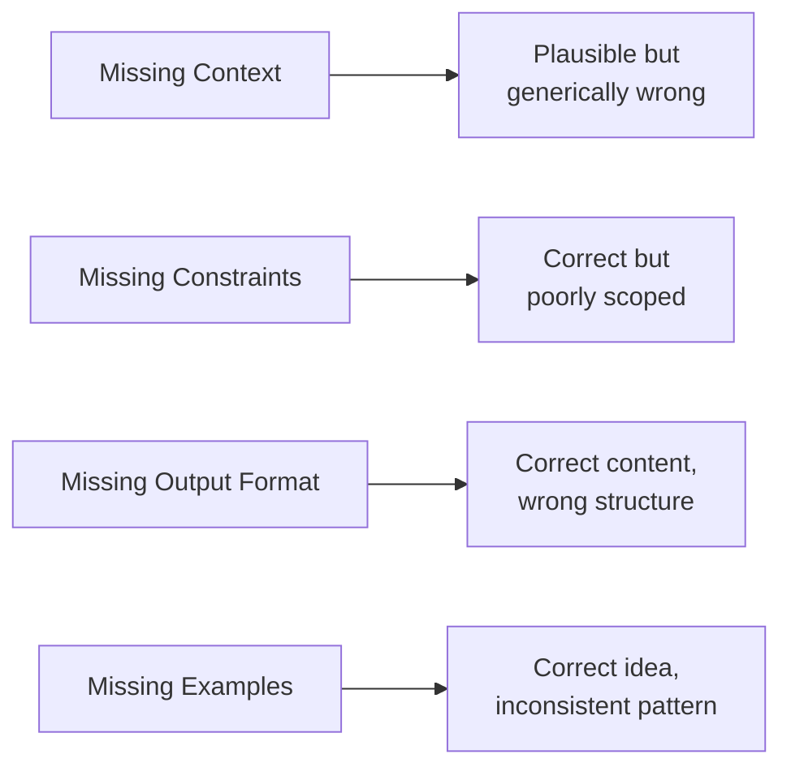
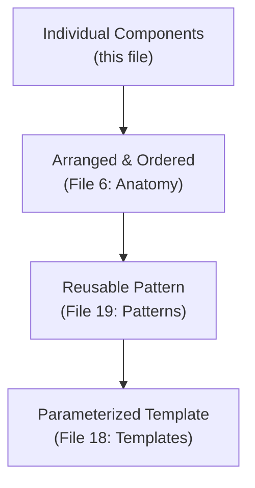

# 05 — Prompt Components

> **Series:** Prompt Engineering Knowledge Library
> **File 5 of 60** | **Level:** Beginner → Intermediate
> **Prerequisites:** [`04_How_LLMs_Interpret_Prompts.md`](./04_How_LLMs_Interpret_Prompts.md)
> **Next:** [`06_Prompt_Anatomy.md`](./06_Prompt_Anatomy.md)

---

## Table of Contents

1. [Definition](#definition)
2. [Why It Matters](#why-it-matters)
3. [Core Concepts](#core-concepts)
4. [How It Works](#how-it-works)
5. [Internal Mechanism](#internal-mechanism)
6. [Types of Components](#types-of-components)
7. [Syntax / Structure](#syntax--structure)
8. [Examples (Simple → Advanced)](#examples-simple--advanced)
9. [Best Practices](#best-practices)
10. [Common Mistakes](#common-mistakes)
11. [Real-World Applications](#real-world-applications)
12. [Comparison with Related Concepts](#comparison-with-related-concepts)
13. [Advantages & Limitations](#advantages--limitations)
14. [FAQs](#faqs)
15. [Summary](#summary)
16. [Cheat Sheet](#cheat-sheet)
17. [Glossary](#glossary)
18. [References](#references)
19. [Visual Diagram Gallery](#visual-diagram-gallery)

---

## Definition

**Prompt Components** are the individual, reusable building blocks that can be combined to construct an effective prompt — task instructions, role/persona framing, context, examples, constraints, and output format specifications. This file catalogs each component *individually*, establishing a shared vocabulary; [File 6 — Prompt Anatomy](./06_Prompt_Anatomy.md) then covers how these components are *assembled and ordered* into a coherent whole.

> Think of components as the individual LEGO bricks, and anatomy (File 6) as the instructions for how to snap them together into a specific structure.

---

## Why It Matters

- **A shared vocabulary prevents miscommunication.** Teams that agree on terms like "role," "constraint," and "few-shot example" can discuss and review prompts far more precisely than teams working with only vague, informal descriptions.
- **Modularity enables reuse.** Once a component (e.g., a well-tested output format specification) is understood as a distinct, portable unit, it can be reused across many different prompts rather than reinvented each time.
- **It supports systematic debugging.** When a prompt underperforms, understanding its distinct components lets an engineer isolate *which* component is likely responsible, rather than rewriting the entire prompt from scratch ([File 13 — Prompt Debugging](./13_Prompt_Debugging.md)).
- **It is the direct prerequisite for templating.** [File 18 — Prompt Templates](./18_Prompt_Templates.md) relies entirely on being able to identify which parts of a prompt are fixed structure versus variable content — a distinction only possible once components are clearly understood.

---

## Core Concepts

| Concept | Definition |
|---|---|
| **Instruction** | The core statement of what task the model should perform |
| **Role / Persona** | A framing device asking the model to respond from a particular perspective or expertise |
| **Context** | Background information the model needs to complete the task correctly |
| **Input Data** | The specific content the task should be performed on |
| **Examples (Shots)** | Sample input/output pairs demonstrating the desired pattern |
| **Constraints** | Explicit limits or rules the output must adhere to |
| **Output Format** | A specification of the structure the response should take |
| **Tone / Style Guidance** | Instructions about the voice, formality, or style of the response |

---

## How It Works



Each component serves a distinct functional purpose, and — critically — a prompt does not need to include every component to be effective. A simple task may need only an instruction. A complex, production-grade task may draw on all seven. The skill of prompt engineering substantially involves correctly judging *which* components a given task actually requires, and then, as covered next, ordering and structuring them well.

---

## Internal Mechanism

### Why components map to distinct functional roles, not just stylistic choices

Recall from [File 4](./04_How_LLMs_Interpret_Prompts.md) that the model has no innate concept of "instruction" versus "data" versus "example" — it relies on learned statistical patterns from training data about what each of these typically *looks like* in context. This means each prompt component isn't merely a human-organizational convenience; it is, mechanically, an attempt to trigger a specific learned pattern in the model. An "instruction" phrased as an imperative sentence ("Summarize the following...") triggers different learned associations than the same content phrased as a question or a statement. A component clearly formatted as an "example" (often via consistent Q/A or input/output pairing) triggers the model's in-context learning behavior specifically, rather than being processed as ordinary background text. Understanding components this way — as targeted mechanism triggers, not just labels — helps explain why *how* a component is phrased and formatted matters as much as *whether* it's present at all.

### Why redundant or missing components cause specific, predictable failure patterns

Because each component addresses a distinct informational need, omitting one produces a *specific*, often diagnosable failure pattern rather than generic "bad output": missing context tends to produce plausible-but-generically-wrong answers; missing constraints tends to produce technically-responsive-but-poorly-scoped answers (too long, wrong tone, extra caveats); missing output format tends to produce correct-content-wrong-structure answers. This predictability is precisely what makes systematic debugging ([File 13](./13_Prompt_Debugging.md)) possible — a skilled engineer can often infer which component is missing or weak directly from the *shape* of a bad output.

---

## Types of Components

| Component | Purpose | Required? |
|---|---|---|
| **Instruction** | States the core task | Almost always required |
| **Role / Persona** | Frames perspective, expertise, or tone | Optional — useful for domain-specific or stylistic tasks |
| **Context** | Supplies necessary background | Required when the task depends on information the model wouldn't otherwise have |
| **Input Data** | Provides the specific content to act on | Required for any transformation/analysis task |
| **Examples** | Demonstrates the desired pattern | Optional — valuable when the desired format/style is hard to describe purely in words |
| **Constraints** | Bounds the output (length, scope, exclusions) | Optional — increasingly important as stakes rise |
| **Output Format** | Specifies response structure | Optional — required whenever downstream systems need a predictable structure |
| **Tone / Style** | Shapes voice and register | Optional — important for user-facing content |

---

## Syntax / Structure

Each component can be written as plain prose or explicitly labeled — labeling becomes more valuable as prompts grow more complex:

```text
[ROLE]
You are a senior financial analyst.

[CONTEXT]
The user is a small business owner reviewing quarterly expenses.

[INSTRUCTION]
Review the expense data below and identify the three largest 
cost categories.

[INPUT DATA]
[expense data here]

[CONSTRAINTS]
- Do not provide investment advice.
- Keep the response under 150 words.

[OUTPUT FORMAT]
Respond as a numbered list of exactly three items.
```

This same content, written as flowing natural language, is equally valid for simpler cases:

```text
As a senior financial analyst, review the expense data below 
for a small business owner and identify the three largest cost 
categories. Don't give investment advice, keep it under 150 
words, and list exactly three items.

[expense data here]
```

---

## Examples (Simple → Advanced)

**Level 1 — Instruction only:**
```text
Translate "Good morning" into Spanish.
```

**Level 2 — Instruction + Input Data:**
```text
Translate the following sentence into Spanish: "The weather 
is beautiful today."
```

**Level 3 — Instruction + Role + Constraint:**
```text
As a professional translator, translate the following sentence 
into formal (not casual) Spanish: "The weather is beautiful today."
```

**Level 4 — Full set with Examples (few-shot):**
```text
Translate the following English sentences into formal Spanish.

English: "How are you?"
Spanish: "¿Cómo está usted?"

English: "Thank you very much."
Spanish: "Muchas gracias."

English: "The weather is beautiful today."
Spanish:
```

**Level 5 — All components combined, production-style:**
```text
[ROLE] You are a professional English-to-Spanish translator 
specializing in formal business communication.

[CONTEXT] This translation will be used in a formal client 
email for a Spanish-speaking business partner.

[INSTRUCTION] Translate the sentence below into formal 
(usted form) Spanish.

[EXAMPLES]
English: "How are you?" → Spanish: "¿Cómo está usted?"
English: "Thank you very much." → Spanish: "Muchas gracias."

[INPUT DATA] "The weather is beautiful today."

[CONSTRAINTS] Use formal register only. Do not use casual "tú" form.

[OUTPUT FORMAT] Return only the translated sentence, no explanation.
```

---

## Best Practices

1. **Include only the components a task genuinely needs** — adding role, examples, and heavy constraints to a trivial task adds noise without benefit ([File 9 — Prompt Design Principles](./09_Prompt_Design_Principles.md)).
2. **Make each component's boundary clear** once a prompt uses more than two or three components, using labels or delimiters (see [File 6](./06_Prompt_Anatomy.md)).
3. **Order components thoughtfully** — as a general starting heuristic, role and context typically precede the core instruction, while examples and format specifications typically follow it (fully justified in [File 6](./06_Prompt_Anatomy.md)'s ordering discussion).
4. **Keep components internally consistent** — a role of "concise technical writer" paired with a constraint demanding elaborate flowery prose creates conflicting signals.
5. **Treat components as independently testable units** when debugging ([File 13](./13_Prompt_Debugging.md)) — change one component at a time to isolate its effect.

---

## Common Mistakes

| Mistake | Consequence | Fix |
|---|---|---|
| Treating every prompt as needing all components | Bloated, harder-to-maintain prompts for simple tasks | Match component set to actual task complexity |
| Blending instruction and context into one undifferentiated paragraph | Harder for the model (and humans reviewing the prompt) to parse what's task versus background | Separate components clearly, especially as complexity grows |
| Specifying constraints only implicitly ("keep it short") | Inconsistent adherence — "short" is subjective | State constraints with concrete, unambiguous terms (e.g., "under 50 words") |
| Omitting output format when a downstream system expects structured data | Parsing failures downstream | Always include explicit output format for any programmatically consumed response ([File 29](./29_Output_Formatting.md)) |
| Providing contradictory guidance across components | Confused or inconsistent model behavior | Review the full assembled prompt for internal consistency before use |

---

## Real-World Applications

- **Prompt template libraries** — organizations build internal libraries of reusable components (a standard "role" block, a standard "output format" block) that get mixed and matched across many prompts.
- **Prompt review processes** — code-review-style processes for prompts often check component-by-component (is context sufficient? are constraints explicit? is format specified?).
- **Automated prompt generation systems** — some tools programmatically assemble prompts from a database of components based on task type, which requires this exact component-level decomposition.
- **Training and onboarding** — teaching new prompt engineers to recognize distinct components is a common, effective pedagogical starting point.

---

## Comparison with Related Concepts

| Concept | Difference from "Prompt Components" |
|---|---|
| **Prompt Anatomy (File 6)** | Components are the individual *parts*; Anatomy is how those parts are *arranged and structured* into a complete, working prompt |
| **Prompt Templates (File 18)** | A template is a *reusable pattern* with fixed components and variable slots; components are the more granular, atomic concept a template is built from |
| **Prompt Patterns (File 19)** | A pattern is a *named, proven arrangement of components* for a recurring problem type (e.g., few-shot pattern, chain-of-thought pattern); components are the raw material patterns are built from |

---

## Advantages & Limitations

### ✅ Advantages of Thinking in Components

- **Enables precise, shared communication** about prompt design among teams.
- **Supports modular reuse** across many different prompts and projects.
- **Makes systematic debugging tractable**, since failures can often be traced to a specific missing or weak component.

### ⚠️ Limitations

- **Overly rigid componentization can reduce natural fluency** — for simple tasks, forcing a full component breakdown can produce stilted, over-engineered prompts where plain language would suffice.
- **Component boundaries aren't always crisp** — context and instruction, for instance, can blend naturally in well-written prose, and forcing an artificial separation isn't always beneficial.
- **This framework describes common practice, not a rigid standard** — different practitioners and organizations use varying terminology for similar concepts.

---

## FAQs

**Q: Do I need to explicitly label every component in every prompt?**
A: No — labeling helps with complex, multi-component prompts, but simple tasks are often better served by natural, unlabeled prose. Match formality to complexity.

**Q: What's the difference between "context" and "input data" as components?**
A: Context is background information that shapes *how* the model should approach the task (e.g., "the user is a beginner"); input data is the specific content the task is actually performed *on* (e.g., the text to be summarized).

**Q: Is "role/persona" always beneficial to include?**
A: No — it's most useful when domain framing genuinely shapes the desired response (e.g., expertise level, tone). For purely factual or mechanical tasks, it can be unnecessary. See [File 24 — Role Prompting](./24_Role_Prompting.md) for a full treatment.

**Q: Can components be nested or repeated?**
A: Yes — complex prompts sometimes repeat key constraints for emphasis, or nest multiple examples within an "examples" component. This is a legitimate technique, not necessarily redundancy.

---

## Summary

Prompt Components are the discrete, reusable building blocks — instruction, role, context, input data, examples, constraints, and output format — from which effective prompts are constructed. Understanding these as distinct units, each triggering a specific learned pattern in the model rather than being an arbitrary organizational label, enables modular reuse, precise team communication, and systematic debugging when a prompt underperforms. With this component-level vocabulary established, the library proceeds to [File 6 — Prompt Anatomy](./06_Prompt_Anatomy.md), which covers how these individual pieces are arranged, ordered, and structured into a complete, coherent, effective prompt.

---

## Cheat Sheet

```text
PROMPT COMPONENTS — QUICK REFERENCE

CORE COMPONENTS
Instruction     -> What to do (almost always required)
Role/Persona    -> Who the model should "be" (optional)
Context         -> Necessary background (situational)
Input Data      -> The content to act on (task-dependent)
Examples        -> Demonstrated pattern (optional, powerful)
Constraints     -> Explicit limits/rules (raises reliability)
Output Format   -> Required response structure (for downstream use)
Tone/Style      -> Voice and register (for user-facing content)

RULE OF THUMB: Include only what the task genuinely needs.
```

---

## Glossary

| Term | Definition |
|---|---|
| **Instruction** | The core statement of the task to perform |
| **Role / Persona** | A framing device assigning perspective or expertise |
| **Context** | Background information necessary for the task |
| **Input Data** | The specific content the task acts upon |
| **Few-Shot Examples** | Sample input/output pairs demonstrating a desired pattern |
| **Constraint** | An explicit rule or limit on the output |
| **Output Format** | A specification of the response's required structure |

---

## References

- Anthropic — [Prompt Engineering: Be Clear and Direct](https://docs.claude.com/en/docs/build-with-claude/prompt-engineering/be-clear-and-direct)
- Brown, T. et al. (2020) — *Language Models are Few-Shot Learners*, arXiv:2005.14165
- White, J. et al. (2023) — *A Prompt Pattern Catalog to Enhance Prompt Engineering with ChatGPT*, arXiv:2302.11382
- OpenAI — [Prompt Engineering Guide: Six Strategies](https://platform.openai.com/docs/guides/prompt-engineering)

---

## Visual Diagram Gallery

**Diagram 1 — Component Building Blocks**
```text
┌──────────┐  ┌──────────┐  ┌──────────┐  ┌──────────┐
│  Role    │  │ Context  │  │  Input   │  │ Examples │
│(optional)│  │(situational)│ │  Data    │  │(optional)│
└──────────┘  └──────────┘  └──────────┘  └──────────┘
      \____________|______________|_____________/
                        |
                        v
              ┌──────────────────┐
              │   INSTRUCTION     │  <- almost always required
              └──────────────────┘
                        |
                        v
        ┌──────────┐        ┌──────────────┐
        │Constraints│        │Output Format │
        └──────────┘        └──────────────┘
```

**Diagram 2 — Component-to-Failure-Pattern Mapping**


**Diagram 3 — From Component to Assembled Prompt**


---

**⬅️ Previous:** [`04_How_LLMs_Interpret_Prompts.md`](./04_How_LLMs_Interpret_Prompts.md)
**➡️ Next:** [`06_Prompt_Anatomy.md`](./06_Prompt_Anatomy.md) — How these components are structured and ordered into a complete prompt.
