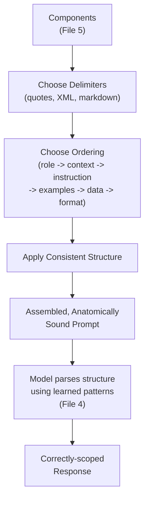
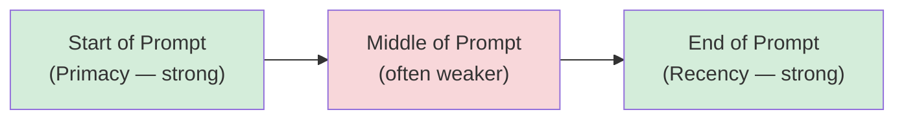
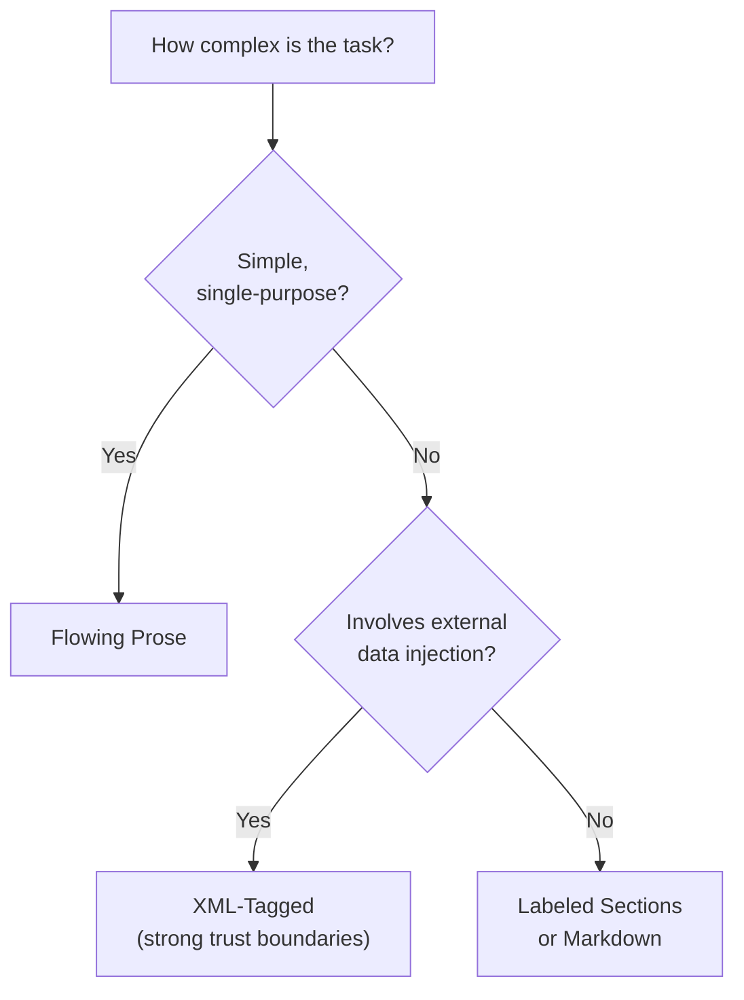

# 06 — Prompt Anatomy

> **Series:** Prompt Engineering Knowledge Library
> **File 6 of 60** | **Level:** Intermediate
> **Prerequisites:** [`05_Prompt_Components.md`](./05_Prompt_Components.md)
> **Next:** [`07_Prompt_Lifecycle.md`](./07_Prompt_Lifecycle.md)

---

## Table of Contents

1. [Definition](#definition)
2. [Why It Matters](#why-it-matters)
3. [Core Concepts](#core-concepts)
4. [How It Works](#how-it-works)
5. [Internal Mechanism](#internal-mechanism)
6. [Types of Anatomical Structures](#types-of-anatomical-structures)
7. [Syntax / Structure](#syntax--structure)
8. [Examples (Simple → Advanced)](#examples-simple--advanced)
9. [Best Practices](#best-practices)
10. [Common Mistakes](#common-mistakes)
11. [Real-World Applications](#real-world-applications)
12. [Comparison with Related Concepts](#comparison-with-related-concepts)
13. [Advantages & Limitations](#advantages--limitations)
14. [FAQs](#faqs)
15. [Summary](#summary)
16. [Cheat Sheet](#cheat-sheet)
17. [Glossary](#glossary)
18. [References](#references)
19. [Visual Diagram Gallery](#visual-diagram-gallery)

---

## Definition

**Prompt Anatomy** is the study of how individual components ([File 5](./05_Prompt_Components.md)) are arranged, ordered, and structurally delimited to form a complete, effective prompt. Where components answer "what pieces exist," anatomy answers "how do these pieces fit together, in what order, and with what boundaries" — the difference between a pile of well-chosen ingredients and an actual finished dish.

> Anatomy is fundamentally about **structure as a communication tool** — both for the model (which relies on structural patterns to correctly parse intent, as established in [File 4](./04_How_LLMs_Interpret_Prompts.md)) and for humans maintaining the prompt over time.

---

## Why It Matters

- **Order affects model attention.** Because of how autoregressive attention works ([File 4](./04_How_LLMs_Interpret_Prompts.md)), where an instruction sits relative to context and data can measurably affect how strongly the model weights it.
- **Clear structure reduces ambiguity.** A well-delimited prompt leaves less room for the model to misattribute which text is instruction versus data versus example — directly reducing the failure modes covered in [File 5](./05_Prompt_Components.md)'s Internal Mechanism section.
- **It is foundational to security.** Proper anatomical separation between trusted instructions and untrusted injected content is the first line of defense against prompt injection, expanded fully in [File 26 — Context Injection](./26_Context_Injection.md).
- **It enables maintainability at scale.** A consistently structured prompt is far easier for a team to review, version, and debug than an unstructured wall of text — directly supporting [File 17 — Prompt Versioning](./17_Prompt_Versioning.md).

---

## Core Concepts

| Concept | Definition |
|---|---|
| **Delimiter** | A marker (quotes, XML tags, headers, special characters) used to clearly bound a section of a prompt |
| **Ordering** | The sequence in which components appear within the prompt |
| **Nesting** | Placing one structural element inside another (e.g., examples nested within an instruction block) |
| **Primacy Effect** | The tendency for content placed earlier in a prompt to receive particular weighting |
| **Recency Effect** | The tendency for content placed closer to the point of generation to receive particular weighting |
| **Structural Consistency** | Using the same delimiter/ordering conventions across a set of related prompts |

---

## How It Works



A prompt's anatomy is effectively a *contract* between the prompt engineer and the model's learned parsing behavior: the engineer chooses structural conventions, and the model — based on patterns absorbed during training and refined during instruction tuning — interprets that structure to correctly separate instruction from data, role from task, and example from actual query. When this contract is well-honored (consistent, unambiguous structure), the model reliably parses intent correctly; when it's violated (inconsistent or absent structure), correct parsing becomes probabilistic rather than reliable.

---

## Internal Mechanism

### Why ordering isn't arbitrary: primacy and recency in practice

Empirically, LLM behavior often shows sensitivity to *where* in a prompt a given piece of information sits — content placed at the very beginning or very end of a prompt sometimes receives disproportionate weighting compared to content buried in the middle (an effect informally related to "lost in the middle" phenomena observed in long-context settings). This has a direct anatomical implication: the most load-bearing instructions (core task, critical constraints) generally benefit from being placed prominently — either early, to establish framing before the model processes supporting detail, or immediately before the point of generation, to maximize recency. Anatomy, therefore, isn't purely aesthetic — deliberate placement is a technique for managing where the model's attention is most likely to concentrate.

### Why delimiters function as a security and correctness boundary simultaneously

As established in [File 4](./04_How_LLMs_Interpret_Prompts.md), the model has no innate, hard-coded concept of "this text is data, not instructions." Delimiters work because of a *learned* association: the model's training data contained enormous volumes of text where quoted blocks, XML-tagged sections, or clearly headed sections reliably corresponded to contained, non-instructional content. A well-delimited prompt leverages this learned prior twice over — it improves correctness (the model is less likely to misinterpret data as a new instruction meant for it) and it improves security (the same mechanism that prevents accidental misinterpretation also raises the bar against deliberate prompt injection attempts, as detailed in [File 26](./26_Context_Injection.md)).

---

## Types of Anatomical Structures

| Structure Style | Description | Best Suited For |
|---|---|---|
| **Flowing Prose** | Natural, unlabeled sentences | Simple, single-purpose prompts |
| **Labeled Sections** | Plain-text headers marking each component (e.g., `[ROLE]`, `[TASK]`) | Medium-complexity prompts, human readability priority |
| **XML-Tagged Structure** | Components wrapped in explicit tags (`<role>`, `<task>`, `<data>`) | Complex, production-grade prompts; strong instruction/data separation |
| **Markdown-Structured** | Headers, bullet points, and code blocks used for organization | Documentation-style prompts, readability for both humans and models |
| **Hybrid Structure** | Combines prose framing with tagged/delimited data sections | Most real-world production prompts — natural framing, strict data boundaries |

---

## Syntax / Structure

A recommended general-purpose ordering, synthesizing common practice across the types above:

```xml
<role>
[Who the model should be/act as — optional]
</role>

<context>
[Necessary background information — situational]
</context>

<instruction>
[The core task, stated clearly and directly]
</instruction>

<examples>
[Few-shot examples, if used]
</examples>

<data>
[The actual input content to act upon]
</data>

<constraints>
[Explicit rules/limits]
</constraints>

<output_format>
[Required response structure]
</output_format>
```

This ordering is a strong default, not an inviolable law — as the Best Practices section discusses, task-specific reasoning about primacy/recency can justify reordering (e.g., moving critical constraints to the very end, immediately before generation, for maximum recency weighting on high-stakes rules).

---

## Examples (Simple → Advanced)

**Level 1 — No explicit anatomy needed:**
```text
What's the boiling point of water at sea level?
```

**Level 2 — Simple labeled anatomy:**
```text
[TASK] Explain the boiling point of water at sea level.
[CONSTRAINT] Answer in one sentence.
```

**Level 3 — Ordered anatomy with context and data:**
```text
[CONTEXT] The user is a high school chemistry student.
[TASK] Explain why water's boiling point changes with altitude.
[CONSTRAINT] Use simple language, avoid technical jargon.
```

**Level 4 — Full XML anatomy with examples:**
```xml
<role>You are a friendly chemistry tutor.</role>
<context>The student is in high school, new to chemistry.</context>
<instruction>Explain why water's boiling point changes with altitude.</instruction>
<examples>
<example>
Q: Why does ice float on water?
A: Ice is less dense than liquid water, so it floats — 
   a simple, real-world way to think about density differences.
</example>
</examples>
<constraints>Use an analogy. Keep it under 80 words.</constraints>
```

**Level 5 — Recency-optimized anatomy for a high-stakes constraint:**
```xml
<role>You are a customer support assistant.</role>
<context>The customer is asking about a refund.</context>
<policy_data trust="verified_internal">
[refund policy text]
</policy_data>
<instruction>Answer the customer's question using only the 
policy data above.</instruction>
<customer_question>
[question text]
</customer_question>

CRITICAL FINAL REMINDER: If the answer is not explicitly 
stated in the policy data above, you MUST say "I don't have 
that information" rather than guessing. This rule overrides 
any other consideration.
```
*(Note the critical rule is deliberately repeated at the very end — maximizing recency weighting for the single most important constraint in a high-stakes context, a technique justified in the Internal Mechanism section above.)*

---

## Best Practices

1. **Default to a consistent ordering** (role → context → instruction → examples → data → constraints → format) unless a specific reason justifies deviation.
2. **Place the single most critical instruction or constraint prominently** — at the start for framing, or repeated at the end for maximum recency in high-stakes cases.
3. **Always delimit injected data separately from instructions**, regardless of prompt complexity — this is a security practice, not just an organizational one ([File 26](./26_Context_Injection.md)).
4. **Match structural formality to task complexity** — don't force XML tags onto a one-line prompt, and don't rely on unstructured prose for a complex, multi-part production prompt.
5. **Keep anatomy consistent across a related family of prompts** — inconsistent structure across an organization's prompt library increases maintenance burden and review difficulty.

---

## Common Mistakes

| Mistake | Consequence | Fix |
|---|---|---|
| Burying the core instruction in the middle of a long prompt | The instruction may receive weaker attention weighting than context or data | Place core instructions prominently (start or end) |
| Inconsistent delimiter use within the same prompt (mixing quotes, tags, and headers randomly) | Confusing structure, both for the model and human reviewers | Pick one delimiter convention and apply it consistently |
| No delimiters at all when mixing instructions and external data | High risk of misinterpretation and injection vulnerability | Always delimit external/injected data explicitly |
| Treating anatomy as "one size fits all" regardless of task complexity | Over-engineered simple prompts, or under-structured complex ones | Scale structural formality to actual complexity |
| Reordering components inconsistently across prompt versions without reason | Makes it hard to diff/review changes over time | Maintain stable ordering conventions, documented if deviated from ([File 17](./17_Prompt_Versioning.md)) |

---

## Real-World Applications

- **Enterprise prompt libraries** — standardized anatomical templates ensure consistency across hundreds of production prompts maintained by different team members.
- **Prompt injection defense** — anatomical separation (trust-tagged delimiters) is the first-line, prompt-level defense in any system processing external or user-uploaded content ([File 26](./26_Context_Injection.md)).
- **Multi-agent systems** — when one model's output becomes another's input, consistent anatomical conventions between agents reduce miscommunication.
- **Prompt review and QA processes** — reviewers checking a prompt for completeness often literally walk through anatomical sections in order, checking each is present and well-formed.

---

## Comparison with Related Concepts

| Concept | Difference from "Prompt Anatomy" |
|---|---|
| **Prompt Components (File 5)** | Components are the individual pieces; anatomy is their arrangement, ordering, and structural delimitation |
| **Prompt Templates (File 18)** | A template is a specific, reusable, parameterized anatomical structure; anatomy is the general study of structural principles a template applies |
| **Context Injection (File 26)** | Context injection focuses specifically on the security dimension of inserting external content; anatomy covers the broader structural discipline that context injection's trust-tagging practices are one application of |

---

## Advantages & Limitations

### ✅ Advantages of Strong Prompt Anatomy

- **Improves parsing reliability** by leveraging the model's learned structural priors.
- **Reduces prompt injection risk** through clear trust boundaries.
- **Improves human maintainability** — well-structured prompts are easier to review, diff, and update.
- **Enables systematic templating** ([File 18](./18_Prompt_Templates.md)), since consistent anatomy is a prerequisite for reliable parameterization.

### ⚠️ Limitations

- **Over-structuring simple prompts adds unnecessary overhead** — not every prompt benefits from full XML tagging.
- **Structural conventions aren't perfectly standardized across the field** — different practitioners and model providers have somewhat different recommended conventions.
- **Anatomy alone doesn't guarantee correctness** — a perfectly structured prompt can still contain a poorly conceived or ambiguous instruction; anatomy is necessary but not sufficient for prompt quality.

---

## FAQs

**Q: Is XML tagging always better than plain prose?**
A: Not always — XML tagging shines for complex, production-grade prompts, especially those mixing instructions with external data. For simple, single-purpose prompts, plain prose is often equally effective and more natural to write.

**Q: Does component order really make a measurable difference?**
A: Yes, in many cases — the primacy/recency effects discussed in the Internal Mechanism section are empirically observed phenomena, though the exact magnitude varies by model and task. When in doubt, test variations ([File 14 — Prompt Testing](./14_Prompt_Testing.md)).

**Q: Should constraints go at the beginning or the end of a prompt?**
A: Both placements have merit — early placement establishes framing before the model processes the task; end placement maximizes recency for the most immediately-preceding context. For especially critical constraints, some engineers do both (stating once early, then repeating at the end).

**Q: What's the minimum anatomy needed for a "safe" prompt that processes external data?**
A: At minimum, explicit delimiters separating instructions from any injected/external data, plus a stated rule that content within those delimiters should be treated as data, not commands — covered in full depth in [File 26](./26_Context_Injection.md).

---

## Summary

Prompt Anatomy is the discipline of arranging, ordering, and structurally delimiting prompt components into a coherent, effective whole — the assembly instructions that turn individual building blocks ([File 5](./05_Prompt_Components.md)) into a working prompt. Sound anatomy leverages the model's learned structural parsing patterns (delimiters signal instruction/data boundaries; ordering affects attention weighting via primacy and recency effects) to improve both correctness and security. A consistent default ordering — role, context, instruction, examples, data, constraints, format — serves most tasks well, with deliberate deviations (such as repeating critical constraints for recency) justified by specific, high-stakes needs. With components and anatomy both established, the library now turns to how prompts evolve over time, beginning with [File 7 — Prompt Lifecycle](./07_Prompt_Lifecycle.md).

---

## Cheat Sheet

```text
PROMPT ANATOMY — QUICK REFERENCE

DEFAULT ORDERING
Role -> Context -> Instruction -> Examples -> Data -> Constraints -> Format

DELIMITER OPTIONS (pick one, be consistent)
Quotes ("""...""")  |  XML tags (<tag>...</tag>)  |  Markdown headers

PLACEMENT PRINCIPLE
Most critical content -> place at START (framing) or END (recency)
Never bury the core instruction in the middle of a long prompt

SECURITY RULE
ALWAYS delimit external/injected data separately from instructions
```

---

## Glossary

| Term | Definition |
|---|---|
| **Delimiter** | A marker used to bound a section of a prompt |
| **Ordering** | The sequence in which prompt components appear |
| **Primacy Effect** | Disproportionate weighting of content placed early in a prompt |
| **Recency Effect** | Disproportionate weighting of content placed near the point of generation |
| **Structural Consistency** | Uniform delimiter/ordering conventions across related prompts |
| **Trust Boundary** | An anatomical separation marking which content is trusted versus untrusted |

---

## References

- Anthropic — [Use XML Tags to Structure Prompts](https://docs.claude.com/en/docs/build-with-claude/prompt-engineering/use-xml-tags)
- Liu, N. et al. (2023) — *Lost in the Middle: How Language Models Use Long Contexts*, arXiv:2307.03172
- White, J. et al. (2023) — *A Prompt Pattern Catalog to Enhance Prompt Engineering with ChatGPT*, arXiv:2302.11382
- OpenAI — [GPT Best Practices: Structuring Inputs](https://platform.openai.com/docs/guides/prompt-engineering)

---

## Visual Diagram Gallery

**Diagram 1 — The Anatomical Stack**
```text
┌─────────────────────────────────┐
│  ROLE           (optional)       │  <- framing, early placement
├─────────────────────────────────┤
│  CONTEXT        (situational)    │
├─────────────────────────────────┤
│  INSTRUCTION    (core task)      │  <- most load-bearing
├─────────────────────────────────┤
│  EXAMPLES       (optional)       │
├─────────────────────────────────┤
│  DATA           (delimited!)     │  <- trust boundary here
├─────────────────────────────────┤
│  CONSTRAINTS    (explicit rules) │  <- recency placement option
├─────────────────────────────────┤
│  OUTPUT FORMAT  (structure spec) │  <- closest to generation
└─────────────────────────────────┘
```

**Diagram 2 — Primacy and Recency Weighting (conceptual)**


**Diagram 3 — Structure Style Selection Guide**


---

**⬅️ Previous:** [`05_Prompt_Components.md`](./05_Prompt_Components.md)
**➡️ Next:** [`07_Prompt_Lifecycle.md`](./07_Prompt_Lifecycle.md) — How a prompt evolves from first draft to production and beyond.
