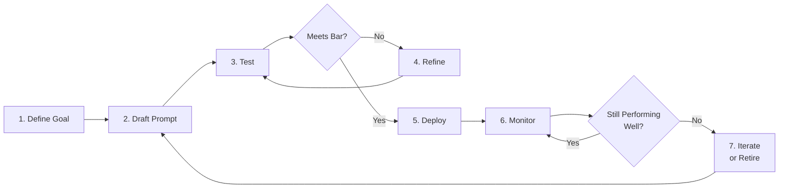
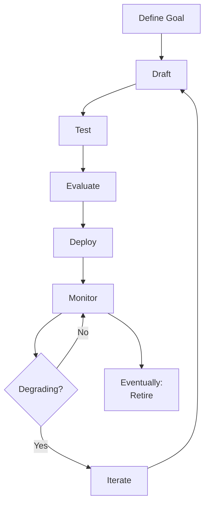
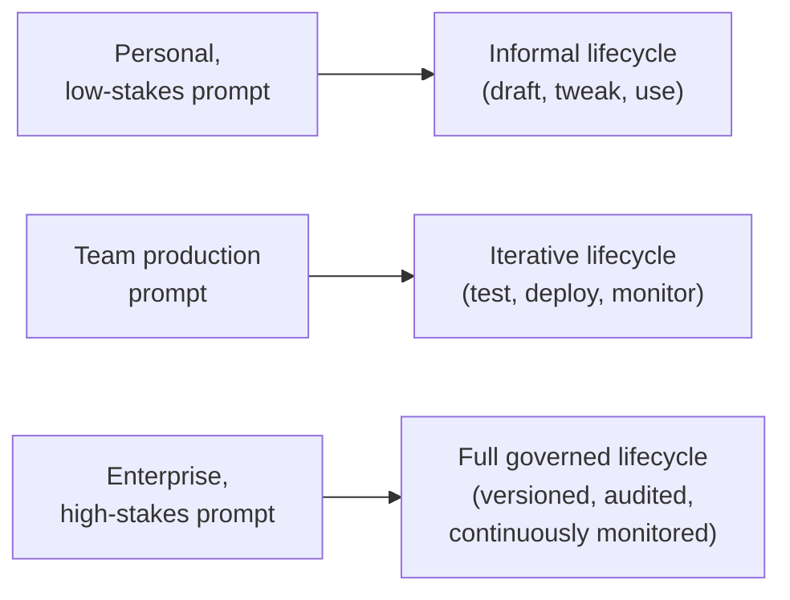

# 07 — Prompt Lifecycle

> **Series:** Prompt Engineering Knowledge Library
> **File 7 of 60** | **Level:** Intermediate
> **Prerequisites:** [`06_Prompt_Anatomy.md`](./06_Prompt_Anatomy.md)
> **Next:** [`08_Prompt_Workflow.md`](./08_Prompt_Workflow.md)

---

## Table of Contents

1. [Definition](#definition)
2. [Why It Matters](#why-it-matters)
3. [Core Concepts](#core-concepts)
4. [How It Works](#how-it-works)
5. [Internal Mechanism](#internal-mechanism)
6. [Types of Lifecycle Models](#types-of-lifecycle-models)
7. [Syntax / Structure](#syntax--structure)
8. [Examples (Simple → Advanced)](#examples-simple--advanced)
9. [Best Practices](#best-practices)
10. [Common Mistakes](#common-mistakes)
11. [Real-World Applications](#real-world-applications)
12. [Comparison with Related Concepts](#comparison-with-related-concepts)
13. [Advantages & Limitations](#advantages--limitations)
14. [FAQs](#faqs)
15. [Summary](#summary)
16. [Cheat Sheet](#cheat-sheet)
17. [Glossary](#glossary)
18. [References](#references)
19. [Visual Diagram Gallery](#visual-diagram-gallery)

---

## Definition

The **Prompt Lifecycle** is the full end-to-end sequence of stages a prompt passes through, from initial conception through drafting, testing, deployment, ongoing monitoring, and eventual retirement or replacement. It reframes a prompt from a one-off piece of text into what it actually is in any serious production system: a living artifact with a beginning, an active maintenance period, and — eventually — an end.

> The lifecycle concept exists because **a prompt's first working draft is rarely its final form**, and treating deployment as the finish line (rather than the midpoint) is one of the most common, costly mistakes in applied prompt engineering.

---

## Why It Matters

- **It prevents "deploy and forget."** Models, user behavior, and business requirements all change over time; a prompt that performed well at launch can silently degrade in relevance or accuracy without ongoing attention.
- **It provides a shared mental model across a team.** When everyone understands prompts as lifecycle artifacts, testing, versioning, and monitoring become expected steps rather than optional extras someone has to argue for.
- **It connects otherwise-isolated topics in this library.** Testing ([File 14](./14_Prompt_Testing.md)), evaluation ([File 15](./15_Prompt_Evaluation.md)), iteration ([File 16](./16_Prompt_Iteration.md)), and versioning ([File 17](./17_Prompt_Versioning.md)) are not separate, unrelated activities — they are named stages within this single unifying lifecycle.
- **It directly supports the business case from [File 3](./03_Why_Prompts_Matter.md)** — proactive lifecycle management is precisely the mechanism by which the compounding costs of prompt failures are caught and controlled before they scale.

---

## Core Concepts

| Concept | Definition |
|---|---|
| **Drafting** | The initial creation of a prompt based on a defined goal |
| **Testing** | Running a prompt against representative and edge-case inputs before deployment |
| **Evaluation** | Scoring prompt outputs against defined quality criteria |
| **Deployment** | Putting a prompt into live, production use |
| **Monitoring** | Ongoing observation of a deployed prompt's real-world performance |
| **Iteration** | Cyclical refinement based on monitoring or evaluation findings |
| **Deprecation / Retirement** | Formally retiring a prompt, typically in favor of a replacement |

---

## How It Works



The lifecycle is explicitly cyclical, not linear — the arrow from monitoring back to drafting/refinement is the single most important feature of this diagram. A prompt that reaches deployment has not "graduated" out of the process; it has entered an ongoing phase where monitoring findings continuously feed back into further refinement, exactly mirroring how mature software engineering treats deployed code as requiring ongoing maintenance, not a one-time delivery.

---

## Internal Mechanism

### Why prompts degrade in production even when unchanged themselves

A prompt's *text* can remain byte-for-byte identical while its *effective performance* degrades, for several distinct underlying reasons: (1) the underlying model itself may be updated or deprecated by its provider, subtly shifting behavior even against an unchanged prompt; (2) the real-world distribution of inputs the prompt receives can drift over time (new slang, new product categories, new user demographics) in ways the original testing set didn't anticipate; (3) downstream system requirements can change (a new field is now expected in structured output) without the prompt being updated to match. This is the core mechanical justification for why "monitoring" must be a standing lifecycle stage, not a one-time launch check — a prompt that was rigorously validated at t=0 provides no guarantee about its performance at t=6 months, for reasons entirely outside the prompt text itself.

### Why iteration must be evidence-driven, not intuition-driven, at scale

Early in the lifecycle (drafting, initial testing), a prompt engineer's intuition about what will and won't work is often sufficient and efficient — manually trying variations and reading outputs. As a prompt matures toward and through production deployment, this approach breaks down for a specific reason: production-scale input diversity vastly exceeds what any individual can manually sample, and subtle regressions (a change that helps 95% of cases but silently breaks 5%) are often invisible to spot-checking. This is why later lifecycle stages increasingly rely on structured evaluation ([File 15](./15_Prompt_Evaluation.md)) with defined metrics and representative test sets ([File 14](./14_Prompt_Testing.md)), rather than continuing to rely on the same informal methods that worked fine for an early draft.

---

## Types of Lifecycle Models

| Model | Description | Best Suited For |
|---|---|---|
| **Linear/Waterfall Lifecycle** | Draft → Test → Deploy, treated as largely sequential, one-time stages | Low-stakes, simple, rarely-changed prompts |
| **Iterative/Agile Lifecycle** | Repeated short cycles of draft-test-refine before and after deployment | Most production prompts; matches modern software practice |
| **Continuous Monitoring Lifecycle** | Emphasizes standing, automated post-deployment observation as a core, permanent stage | High-stakes, high-volume production systems |
| **Versioned Lifecycle** | Each significant change produces a new tracked version, with rollback capability | Enterprise systems requiring auditability ([File 17](./17_Prompt_Versioning.md)) |

---

## Syntax / Structure

While the lifecycle itself isn't "written" like a prompt, mature teams often formalize it as a checklist or process document:

```yaml
# Example: a lifecycle stage-gate checklist
prompt_lifecycle_stages:
  - stage: draft
    exit_criteria: "Clear goal statement; initial version written"
  - stage: test
    exit_criteria: "Passes representative test set (File 14); 
                    edge cases identified"
  - stage: evaluate
    exit_criteria: "Meets defined quality bar (File 15)"
  - stage: deploy
    exit_criteria: "Approved by owner; versioned (File 17)"
  - stage: monitor
    exit_criteria: "Ongoing — never formally 'exited' while live"
  - stage: iterate_or_retire
    trigger: "Monitoring reveals degradation, or new requirements emerge"
```

---

## Examples (Simple → Advanced)

**Level 1 — Informal lifecycle (personal/low-stakes use):**
```text
1. Write a prompt to summarize articles.
2. Try it on a few articles.
3. Tweak the wording until happy.
4. Use it going forward.
```
*(No formal monitoring or versioning — acceptable for casual, low-stakes personal use.)*

**Level 2 — Basic team lifecycle:**
```text
1. Define goal: "Summarize support tickets for triage."
2. Draft prompt v1.
3. Test on 20 sample tickets.
4. Refine based on results.
5. Deploy to production.
6. (No formal ongoing monitoring yet — a common early-stage gap.)
```

**Level 3 — Adding monitoring:**
```text
1-5. [Same as Level 2]
6. Set up weekly manual review of 10 random production outputs.
7. Flag and address any recurring quality issues found.
```

**Level 4 — Structured, versioned lifecycle:**
```text
1. Define goal + success metrics (File 15).
2. Draft prompt v1.0.
3. Test against defined test suite (File 14).
4. Evaluate against metrics; iterate to v1.1, v1.2 as needed.
5. Deploy v1.2 with version tracking (File 17).
6. Automated monitoring dashboard tracks key metrics continuously.
7. Monthly review: metrics still healthy? -> continue monitoring.
                    metrics degrading? -> trigger iteration -> v2.0.
```

**Level 5 — Enterprise lifecycle with full governance:**
```text
1. Goal + stakeholder sign-off + success metrics defined.
2. Draft with documented rationale.
3. Automated test suite (File 14) + adversarial/injection test cases.
4. Formal evaluation against rubric (File 15), reviewed by 
   a second engineer.
5. Staged rollout (canary -> partial -> full deployment).
6. Automated monitoring + alerting on metric thresholds.
7. Scheduled quarterly review regardless of alerts.
8. Full version history + rollback capability maintained (File 17).
9. Formal deprecation process when retiring, including 
   migration plan for dependent systems.
```

---

## Best Practices

1. **Never treat deployment as the final stage** — build in monitoring from the start, even if lightweight, rather than adding it reactively after a failure.
2. **Match lifecycle rigor to stakes**, consistent with [File 3](./03_Why_Prompts_Matter.md)'s calibration principle — not every prompt needs the full enterprise-grade process.
3. **Define success metrics before drafting**, not after — this makes later evaluation ([File 15](./15_Prompt_Evaluation.md)) objective rather than retroactively justified.
4. **Version every deployed prompt**, even informally, so that regressions can be diagnosed and rolled back ([File 17](./17_Prompt_Versioning.md)).
5. **Schedule monitoring reviews proactively** rather than waiting for a visible failure to trigger attention — silent degradation is common and easy to miss without deliberate checking.

---

## Common Mistakes

| Mistake | Consequence | Fix |
|---|---|---|
| Treating deployment as "done" | Silent quality degradation goes uncaught | Build standing monitoring into the lifecycle from the start |
| Skipping the testing stage under time pressure | Production failures that testing would have caught | Protect a minimum testing bar even under deadline pressure |
| No defined success metrics before drafting | Evaluation becomes subjective and inconsistent later | Define metrics upfront ([File 15](./15_Prompt_Evaluation.md)) |
| No version history maintained | Impossible to diagnose when/why a regression was introduced | Adopt versioning practices from first deployment ([File 17](./17_Prompt_Versioning.md)) |
| Assuming an unchanged prompt means unchanged performance | Misses drift from model updates or input distribution shifts | Monitor actively regardless of whether the prompt text has changed |

---

## Real-World Applications

- **MLOps and LLMOps pipelines** — formal lifecycle stages map directly onto CI/CD-style automated testing and deployment pipelines for prompts.
- **Enterprise AI governance** — regulated industries often require documented lifecycle processes (testing, approval, monitoring) as part of compliance.
- **Product development for AI features** — product teams use lifecycle thinking to plan not just initial launch but ongoing maintenance resourcing.
- **Incident response** — when a production prompt causes a visible failure, lifecycle thinking helps trace which stage's gap (inadequate testing? no monitoring?) allowed the issue through.

---

## Comparison with Related Concepts

| Concept | Difference from "Prompt Lifecycle" |
|---|---|
| **Prompt Workflow (File 8)** | Workflow describes the *day-to-day, tactical process* an individual or team follows while working; lifecycle describes the *full strategic arc* a prompt exists across, of which a workflow is one implementation |
| **Prompt Iteration (File 16)** | Iteration is *one specific stage/activity* within the lifecycle (the refine-and-repeat loop); lifecycle is the complete, broader sequence including drafting, deployment, and retirement |
| **Prompt Versioning (File 17)** | Versioning is the *record-keeping mechanism* that supports the lifecycle's deployment and iteration stages; it is a tool the lifecycle relies on, not the lifecycle itself |

---

## Advantages & Limitations

### ✅ Advantages of Lifecycle Thinking

- **Prevents the common "deploy and forget" failure pattern** that leads to silent, compounding quality degradation.
- **Provides a shared process vocabulary** for teams, improving coordination and handoffs.
- **Naturally incorporates other library topics** (testing, evaluation, versioning) into a single coherent mental model rather than isolated techniques.

### ⚠️ Limitations

- **Formal lifecycle processes carry real overhead** — for a one-off, low-stakes personal prompt, a full enterprise lifecycle would be disproportionate effort.
- **Not all degradation is preventable even with perfect process** — some causes (unannounced underlying model changes) are outside the prompt engineer's direct control.
- **Requires organizational buy-in to sustain** — monitoring and iteration stages, in particular, require ongoing resourcing commitment that can be deprioritized under competing demands.

---

## FAQs

**Q: Does every prompt need to go through a formal, multi-stage lifecycle?**
A: No — as with the stakes-calibration principle from [File 3](./03_Why_Prompts_Matter.md), lifecycle rigor should match actual stakes. A personal, one-off prompt can reasonably skip formal versioning and monitoring.

**Q: What triggers moving from "monitor" back to "iterate"?**
A: Typically either a measured metric falling below a defined threshold, a qualitative pattern of complaints/failures observed during review, or an external change (new requirements, model updates) that necessitates a prompt update.

**Q: How is "retirement" different from just replacing a prompt with a new version?**
A: A new version is typically a direct evolution of the same underlying prompt/purpose; retirement generally means the prompt's purpose itself is being discontinued or fundamentally replaced by a different approach, not merely refined.

**Q: Who is typically responsible for a prompt's lifecycle in a production team?**
A: This varies by organization, but commonly a designated "owner" (documented as in the versioning example in [File 3](./03_Why_Prompts_Matter.md)) is responsible for the prompt's ongoing lifecycle, even if drafting and testing involve multiple contributors.

---

## Summary

The Prompt Lifecycle reframes a prompt as a living artifact moving through defined stages — drafting, testing, evaluation, deployment, monitoring, and iteration or retirement — rather than a static piece of text finished once it first works. This cyclical model, explicitly looping from monitoring back into iteration, exists because prompts can degrade in production even when their text is unchanged, due to model updates, input drift, or shifting downstream requirements. Understanding this lifecycle unifies many of this library's other topics (testing, evaluation, iteration, versioning) as named stages of one coherent process, rather than isolated techniques — and sets up the next file's focus on the concrete, tactical day-to-day workflow a prompt engineer or team follows while actually executing these stages, covered in [File 8 — Prompt Workflow](./08_Prompt_Workflow.md).

---

## Cheat Sheet

```text
PROMPT LIFECYCLE — QUICK REFERENCE

THE STAGES (cyclical, not linear)
1. Define Goal   -> 2. Draft   -> 3. Test   -> 4. Refine (loop)
-> 5. Deploy   -> 6. Monitor   -> 7. Iterate or Retire (loop back)

KEY PRINCIPLE: Deployment is the MIDPOINT, not the finish line.

WHY PROMPTS DEGRADE EVEN WHEN UNCHANGED
[ ] Underlying model updated by provider
[ ] Real-world input distribution has drifted
[ ] Downstream requirements have changed

MATCH RIGOR TO STAKES (see File 3)
Low stakes  -> informal lifecycle acceptable
High stakes -> full versioned, monitored, governed lifecycle
```

---

## Glossary

| Term | Definition |
|---|---|
| **Drafting** | Initial creation of a prompt |
| **Testing** | Running a prompt against representative/edge-case inputs pre-deployment |
| **Evaluation** | Scoring outputs against defined quality criteria |
| **Deployment** | Putting a prompt into live production use |
| **Monitoring** | Ongoing observation of a deployed prompt's performance |
| **Iteration** | Cyclical refinement based on findings |
| **Deprecation** | Formally retiring a prompt |
| **Input Drift** | Gradual change in the real-world distribution of inputs over time |

---

## References

- Anthropic — [Prompt Engineering Overview](https://docs.claude.com/en/docs/build-with-claude/prompt-engineering/overview)
- Sculley, D. et al. (2015) — *Hidden Technical Debt in Machine Learning Systems*, NeurIPS 2015
- Google Cloud — [MLOps: Continuous Delivery and Automation Pipelines in Machine Learning](https://cloud.google.com/architecture/mlops-continuous-delivery-and-automation-pipelines-in-machine-learning)
- Amershi, S. et al. (2019) — *Software Engineering for Machine Learning: A Case Study*, ICSE-SEIP 2019

---

## Visual Diagram Gallery

**Diagram 1 — The Full Lifecycle Loop**


**Diagram 2 — Why Performance Degrades Without Text Changes**
```text
                    PROMPT TEXT: unchanged
                            |
        ┌───────────────────┼───────────────────┐
        v                   v                   v
  Model Updated      Input Drift        Requirements
  by Provider         Over Time            Changed
        \                   |                   /
         \                  |                  /
          v                 v                 v
              EFFECTIVE PERFORMANCE: degraded
```

**Diagram 3 — Lifecycle Rigor vs. Stakes**


---

**⬅️ Previous:** [`06_Prompt_Anatomy.md`](./06_Prompt_Anatomy.md)
**➡️ Next:** [`08_Prompt_Workflow.md`](./08_Prompt_Workflow.md) — The tactical, day-to-day process of working with prompts.
