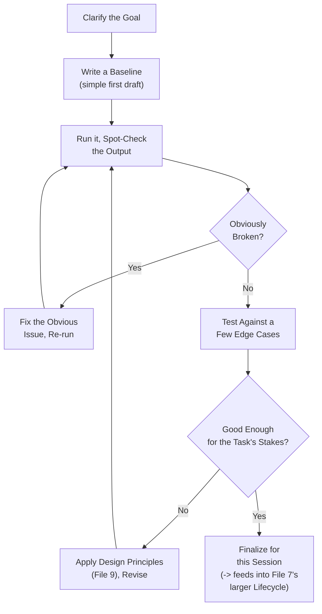
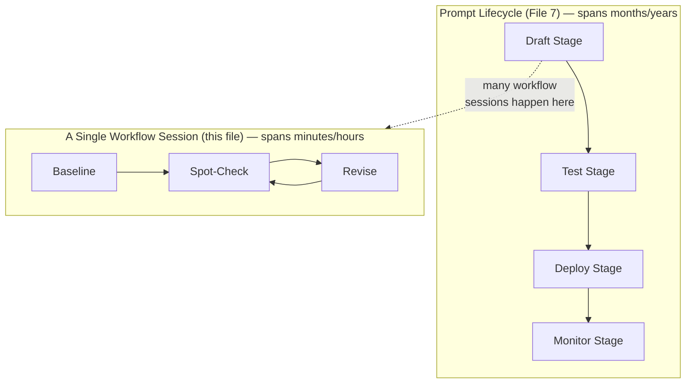
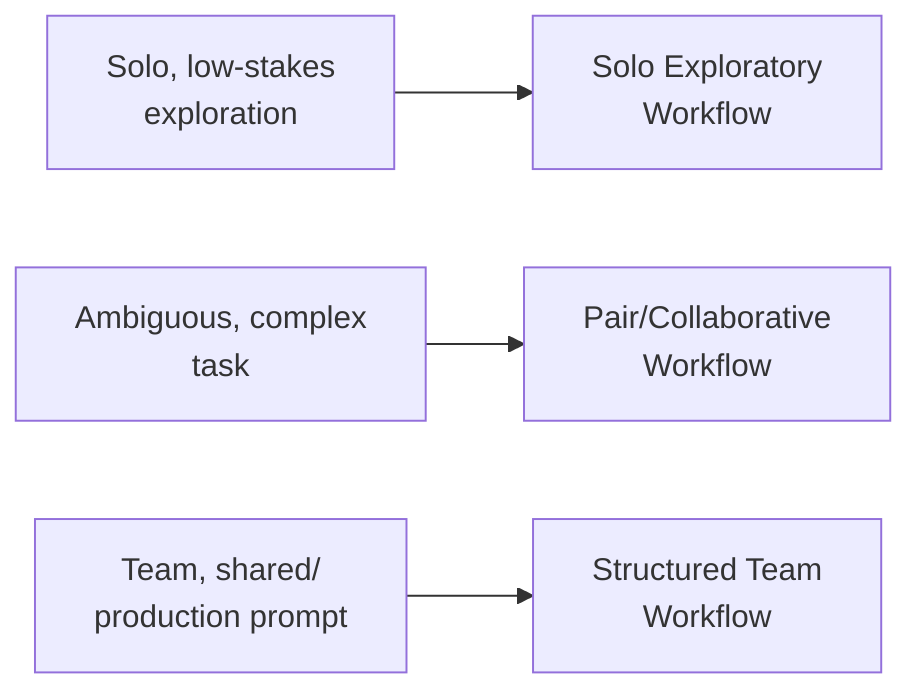

# 08 — Prompt Workflow

> **Series:** Prompt Engineering Knowledge Library
> **File 8 of 60** | **Level:** Intermediate
> **Prerequisites:** [`07_Prompt_Lifecycle.md`](./07_Prompt_Lifecycle.md)
> **Next:** [`09_Prompt_Design_Principles.md`](./09_Prompt_Design_Principles.md)

---

## Table of Contents

1. [Definition](#definition)
2. [Why It Matters](#why-it-matters)
3. [Core Concepts](#core-concepts)
4. [How It Works](#how-it-works)
5. [Internal Mechanism](#internal-mechanism)
6. [Types of Workflows](#types-of-workflows)
7. [Syntax / Structure](#syntax--structure)
8. [Examples (Simple → Advanced)](#examples-simple--advanced)
9. [Best Practices](#best-practices)
10. [Common Mistakes](#common-mistakes)
11. [Real-World Applications](#real-world-applications)
12. [Comparison with Related Concepts](#comparison-with-related-concepts)
13. [Advantages & Limitations](#advantages--limitations)
14. [FAQs](#faqs)
15. [Summary](#summary)
16. [Cheat Sheet](#cheat-sheet)
17. [Glossary](#glossary)
18. [References](#references)
19. [Visual Diagram Gallery](#visual-diagram-gallery)

---

## Definition

**Prompt Workflow** is the concrete, tactical, day-to-day process an individual or team actually follows while writing, testing, and refining a prompt in a single working session — as distinct from [File 7](./07_Prompt_Lifecycle.md)'s broader, longer-arc view of a prompt's entire existence from creation to retirement. If the lifecycle is the map of the whole journey, the workflow is the specific route taken on any given afternoon of active prompt-writing work.

> Workflow answers: *"Right now, sitting down to write or fix a prompt, what do I actually do, in what order, in the next 30 minutes?"*

---

## Why It Matters

- **It turns abstract principles into repeatable habits.** Knowing design principles ([File 9](./09_Prompt_Design_Principles.md)) is not the same as having a reliable process for applying them consistently under real working conditions.
- **It reduces wasted effort.** A haphazard, unstructured approach to prompt writing often means re-discovering the same issues repeatedly; a defined workflow builds in checks that catch common problems early.
- **It enables collaboration.** When a team shares a common workflow, handing off partially-developed prompts between team members becomes far smoother.
- **It is where most of this library's individual techniques actually get applied.** Design principles, component selection, anatomy, testing — a good workflow is the connective tissue that sequences all of these into an efficient working process.

---

## Core Concepts

| Concept | Definition |
|---|---|
| **Working Session** | A single, bounded period of active prompt development work |
| **Draft-Test-Revise Loop** | The core tactical cycle of writing a version, checking it, and adjusting |
| **Baseline** | An initial, simple version of a prompt used as a reference point for comparison |
| **Spot-Check** | A quick, informal review of a small number of outputs, as opposed to formal evaluation |
| **Checkpoint** | A defined point in the workflow to pause and assess before continuing |
| **Handoff** | Passing a prompt (with sufficient context) from one person or stage to another |

---

## How It Works



This tactical loop is intentionally lightweight compared to the full lifecycle from [File 7](./07_Prompt_Lifecycle.md) — it's meant to be run many times, quickly, within a single working session, rather than representing formal stage-gates. The workflow's output (a working, spot-checked prompt) is precisely the *input* to the more formal testing and evaluation stages of the broader lifecycle when the prompt is headed toward real deployment.

---

## Internal Mechanism

### Why starting with a deliberately simple baseline works better than starting complex

A common tactical mistake is attempting to write a "final," fully-featured prompt (full anatomy, all components, all edge cases handled) on the first attempt. This tends to backfire for a specific, practical reason: when a complex first draft doesn't work, it's genuinely difficult to diagnose *which* of its many simultaneous design choices caused the failure — was it the role framing? A constraint? The example format? Starting instead from a deliberately minimal baseline (as simple as the task allows) and *adding* complexity only as spot-checks reveal a genuine need, means that when something breaks, there is a much smaller, more recent set of changes to investigate — directly mirroring the software engineering principle of making small, testable, incremental changes rather than large, hard-to-debug ones. This connects directly to [File 13 — Prompt Debugging](./13_Prompt_Debugging.md)'s isolation techniques.

### Why spot-checking is workflow-appropriate while formal evaluation is lifecycle-appropriate

Formal evaluation ([File 15](./15_Prompt_Evaluation.md)) — running a defined test set, scoring against a rubric — is valuable but has real overhead: it takes time to set up and run. Within a fast-moving tactical workflow, applying this overhead at every single small iteration would be highly inefficient. Spot-checking (quickly reading a handful of outputs) is the workflow-appropriate proxy: fast enough to run many times per session, good enough to catch obvious problems, while explicitly *not* claiming to provide the statistical confidence that formal evaluation later provides before a prompt is trusted for real deployment. Knowing when to graduate from workflow-level spot-checking to lifecycle-level formal evaluation is itself an important judgment call, generally triggered by rising stakes as the prompt approaches actual production use.

---

## Types of Workflows

| Workflow Type | Description | Best Suited For |
|---|---|---|
| **Solo Exploratory Workflow** | Individual, informal, rapid draft-test-revise cycling | Early-stage experimentation, personal use, low stakes |
| **Pair/Collaborative Workflow** | Two or more people actively co-developing a prompt together | Complex or ambiguous tasks benefiting from multiple perspectives |
| **Structured Team Workflow** | Defined roles (drafter, reviewer), checkpoints, and handoff documentation | Team environments building prompts for shared/production use |
| **Tool-Assisted Workflow** | Uses dedicated prompt-development tools/platforms with built-in testing, versioning, or comparison features | Teams with mature prompt engineering tooling infrastructure |

---

## Syntax / Structure

A workflow isn't a prompt syntax itself, but many practitioners benefit from a lightweight working template to structure a session:

```text
SESSION LOG (informal working template)

Goal: [one sentence — what should this prompt accomplish?]

Baseline v0:
[simplest possible first draft]

Spot-check results:
[what did I notice? obviously broken? mostly fine?]

Edge cases tried:
[list 2-3 unusual/boundary inputs tried]

Revision v1:
[what changed, and why]

Session outcome:
[ ] Ready for formal testing (File 14) / deployment consideration
[ ] Needs another session
[ ] Blocked — need more information about the actual requirement
```

---

## Examples (Simple → Advanced)

**Level 1 — Minimal solo workflow:**
```text
1. Write: "Summarize this email in one sentence."
2. Try it on 2 emails.
3. Looks fine -> done for now.
```

**Level 2 — Adding a baseline-then-iterate step:**
```text
1. Baseline: "Summarize this email in one sentence."
2. Test on 3 emails — notice summaries sometimes miss the 
   action item the email requires.
3. Revise: "Summarize this email in one sentence, making sure 
   to include any requested action item."
4. Re-test — better. Done for this session.
```

**Level 3 — Adding edge-case spot-checking:**
```text
1-4. [Same as Level 2]
5. Try an edge case: an email with NO action item at all.
   -> Notice the model sometimes invents one anyway.
6. Revise: "...include any requested action item, if one 
   exists. If there is no action item, do not invent one."
7. Re-test edge case — fixed.
```

**Level 4 — Collaborative workflow with a checkpoint:**
```text
1. Person A drafts baseline + tests informally.
2. CHECKPOINT: shares draft + notes with Person B.
3. Person B tries additional edge cases A didn't consider 
   (e.g., a very long email, an email in a different language).
4. Both revise together based on combined findings.
5. Document final version + open questions for later formal testing.
```

**Level 5 — Structured team workflow feeding into the lifecycle:**
```text
1. Drafter writes baseline against a documented goal + 
   initial success criteria.
2. Drafter self-spot-checks against 5 representative inputs.
3. HANDOFF to Reviewer with session log (see Syntax section).
4. Reviewer spot-checks independently + tries adversarial 
   edge cases (very short input, very long input, malformed 
   input, injected instructions).
5. Joint revision session resolves any disagreements.
6. Final workflow output is handed to the formal testing 
   stage of the broader Prompt Lifecycle (File 7), no longer 
   purely a workflow-level artifact.
```

---

## Best Practices

1. **Start with the simplest possible baseline** and add complexity only when spot-checking reveals a genuine gap — never start with a "kitchen sink" first draft.
2. **Always spot-check at least one deliberately unusual edge case** per session, not just typical/expected inputs — this catches a disproportionate share of real issues early and cheaply.
3. **Keep a lightweight log of what changed and why** during a session, even informally — this becomes invaluable both for personal learning and for any later handoff.
4. **Know when to graduate from workflow to lifecycle** — once a prompt is heading toward real deployment or shared/production use, formal testing and evaluation (Files 14, 15) should take over from purely informal spot-checking.
5. **Don't skip the "clarify the goal" step**, even when it feels obvious — a surprising number of workflow inefficiencies trace back to solving a subtly different problem than what was actually needed.

---

## Common Mistakes

| Mistake | Consequence | Fix |
|---|---|---|
| Starting with an overly complex first draft | Hard to diagnose which design choice caused a given failure | Start minimal, add complexity incrementally |
| Only testing typical/expected inputs during workflow | Edge-case failures surface later, in more costly contexts | Always spot-check at least one deliberately unusual input |
| No record of what was tried and why | Repeated rediscovery of the same issues; poor handoffs | Keep a lightweight session log |
| Treating informal spot-checking as sufficient for production deployment | False confidence; issues formal testing would catch go unnoticed | Graduate to formal testing/evaluation (Files 14, 15) before real deployment |
| Skipping goal clarification | Effort spent solving the wrong problem | Always state the goal explicitly before drafting |

---

## Real-World Applications

- **Individual developers rapidly prototyping** an AI feature before committing to a formal build.
- **Prompt engineering pair sessions**, common when a task's requirements are ambiguous enough to benefit from real-time discussion.
- **Onboarding new team members** to an existing prompt engineering practice — workflow documentation is often the most practical, hands-on training material.
- **Rapid-response prompt fixes** during an active production issue, where the tactical workflow (not the full formal lifecycle) is what's actually used to develop and validate a hotfix before it goes through expedited review.

---

## Comparison with Related Concepts

| Concept | Difference from "Prompt Workflow" |
|---|---|
| **Prompt Lifecycle (File 7)** | Lifecycle is the full strategic arc (creation to retirement) a prompt exists across; workflow is the tactical process used *within* any single active working session, which may occur many times throughout that lifecycle |
| **Prompt Testing (File 14)** | Testing is a formal, structured lifecycle stage with defined test sets; workflow's "spot-checking" is a lighter-weight, session-level practice that often precedes and informs formal testing |
| **Prompt Iteration (File 16)** | Iteration is the general concept of cyclical refinement, applicable at both the workflow level (this file) and the lifecycle level (File 7); workflow describes the specific, concrete tactics of one such iterative session |

---

## Advantages & Limitations

### ✅ Advantages of a Defined Workflow

- **Reduces wasted effort** through incremental, diagnosable changes rather than complex, hard-to-debug first drafts.
- **Catches a meaningful share of issues early and cheaply**, before they reach more costly, formal stages.
- **Improves collaboration and handoffs** through lightweight but consistent session documentation.

### ⚠️ Limitations

- **Workflow-level spot-checking is not a substitute for formal evaluation** — it provides confidence proportional to its informality, which is insufficient for high-stakes deployment decisions on its own.
- **Overly rigid workflow process can slow down early-stage exploration** — for genuinely open-ended, exploratory work, heavy process can sometimes hinder rather than help.
- **Individual working styles vary** — a workflow that suits one person or team's habits may not transfer perfectly to another.

---

## FAQs

**Q: Is "workflow" just a smaller version of "lifecycle"?**
A: Related but not simply smaller — lifecycle is about the stages a prompt passes through over its *entire existence* (potentially months or years); workflow is about the *tactical steps within a single active working session*, which might happen repeatedly at various points across that lifecycle.

**Q: How many edge cases should I spot-check during a typical workflow session?**
A: There's no fixed universal number — a practical heuristic is at least one clearly atypical case beyond the obvious "happy path" inputs, scaled up as the task's eventual stakes increase.

**Q: When should informal workflow give way to formal testing?**
A: Generally, once a prompt is being seriously considered for shared, production, or otherwise consequential use — the transition point is closely tied to the stakes-calibration principle introduced in [File 3](./03_Why_Prompts_Matter.md).

**Q: Does a solo hobbyist need a "workflow" at all?**
A: Even an extremely lightweight, informal version (start simple, test a couple of cases, revise) tends to produce better results faster than a completely unstructured approach — but the level of formality shown in this file's Level 4–5 examples would be disproportionate for casual personal use.

---

## Summary

Prompt Workflow is the concrete, tactical process followed within a single active working session — starting from a deliberately simple baseline, spot-checking outputs (including at least one deliberate edge case), and incrementally revising — as distinct from [File 7](./07_Prompt_Lifecycle.md)'s broader view of a prompt's full multi-stage existence. Starting simple and changing incrementally makes failures easier to diagnose; lightweight spot-checking serves as a fast, session-appropriate proxy for the more rigorous formal evaluation that takes over once a prompt approaches real deployment. With both the strategic lifecycle and tactical workflow now established, the library turns to the foundational maxims that guide good decisions *within* these processes: [File 9 — Prompt Design Principles](./09_Prompt_Design_Principles.md).

---

## Cheat Sheet

```text
PROMPT WORKFLOW — QUICK REFERENCE

THE SESSION LOOP
Clarify Goal -> Simple Baseline -> Spot-Check -> 
  Obviously broken? -> Fix, re-run
  Looks OK? -> Try an edge case -> 
    Good enough? -> Done (for this session)
    Not yet? -> Revise, loop back

KEY HABITS
[ ] Always start simpler than feels "complete"
[ ] Always spot-check at least 1 atypical/edge-case input
[ ] Keep a lightweight log of what changed and why
[ ] Know when to graduate to formal Testing (File 14) / 
    Evaluation (File 15) before real deployment
```

---

## Glossary

| Term | Definition |
|---|---|
| **Working Session** | A bounded period of active prompt development |
| **Baseline** | An initial, simple prompt version used as a reference point |
| **Spot-Check** | A quick, informal review of a small number of outputs |
| **Checkpoint** | A defined pause-and-assess point in a workflow |
| **Handoff** | Passing a prompt, with context, between people or stages |
| **Draft-Test-Revise Loop** | The core tactical cycle of writing, checking, and adjusting |

---

## References

- Anthropic — [Prompt Engineering Overview](https://docs.claude.com/en/docs/build-with-claude/prompt-engineering/overview)
- Beck, K. et al. (2001) — *Manifesto for Agile Software Development* (workflow/iteration parallels)
- OpenAI — [Iterating on Prompts](https://platform.openai.com/docs/guides/prompt-engineering)
- Fowler, M. — [Refactoring: Improving the Design of Existing Code] (incremental-change principle parallels)

---

## Visual Diagram Gallery

**Diagram 1 — Workflow Within Lifecycle (nesting relationship)**


**Diagram 2 — The Incremental Change Principle**
```text
COMPLEX FIRST DRAFT (harder to debug)
[Role + Context + 5 Constraints + Examples + Format] -> BROKEN
                    "which of these 8 things caused it?"

SIMPLE BASELINE, INCREMENTAL ADDITIONS (easier to debug)
[Task only] -> works -> +[Constraint] -> works -> +[Format] -> BROKEN
                    "clearly the Format addition — easy to isolate"
```

**Diagram 3 — Workflow Type Selection**


---

**⬅️ Previous:** [`07_Prompt_Lifecycle.md`](./07_Prompt_Lifecycle.md)
**➡️ Next:** [`09_Prompt_Design_Principles.md`](./09_Prompt_Design_Principles.md) — The timeless maxims underlying every good prompting decision.
