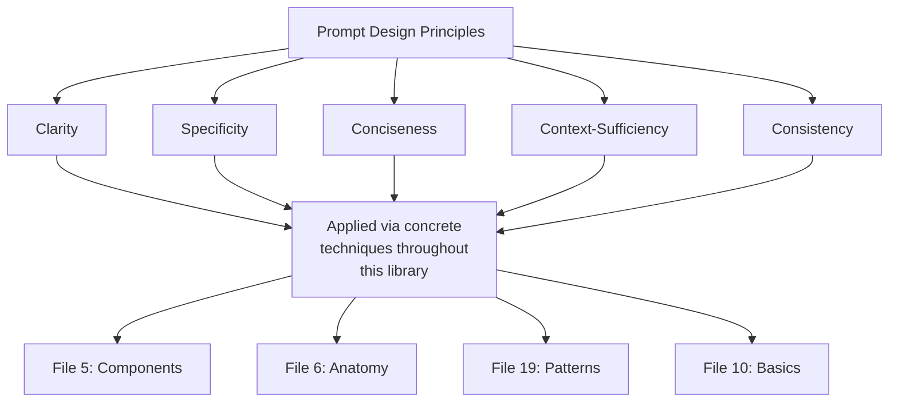
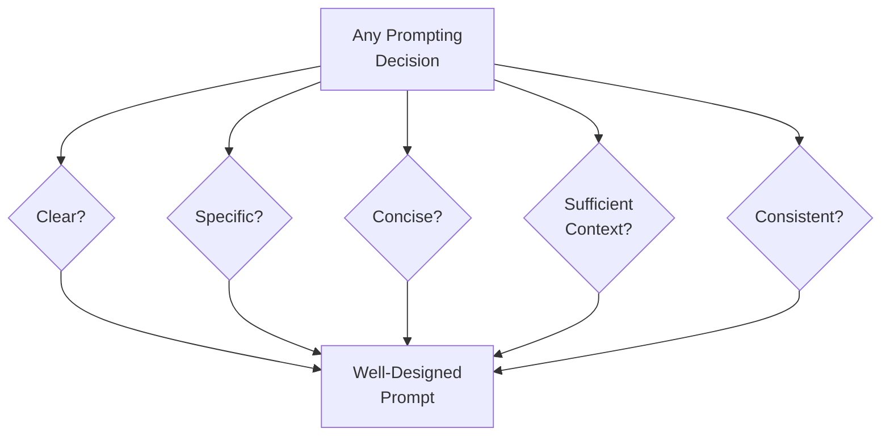
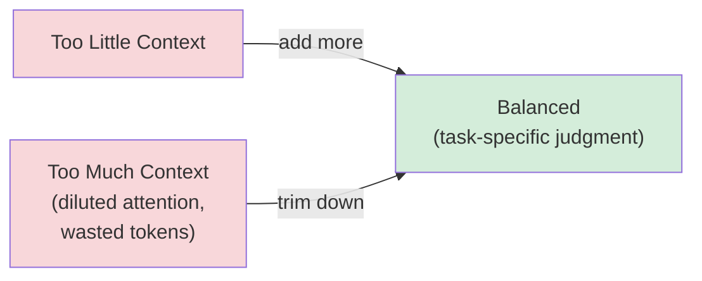

# 09 — Prompt Design Principles

> **Series:** Prompt Engineering Knowledge Library
> **File 9 of 60** | **Level:** Beginner → Intermediate
> **Prerequisites:** [`08_Prompt_Workflow.md`](./08_Prompt_Workflow.md)
> **Next:** [`10_Prompt_Engineering_Basics.md`](./10_Prompt_Engineering_Basics.md)

---

## Table of Contents

1. [Definition](#definition)
2. [Why It Matters](#why-it-matters)
3. [Core Concepts](#core-concepts)
4. [How It Works](#how-it-works)
5. [Internal Mechanism](#internal-mechanism)
6. [Types of Principles](#types-of-principles)
7. [Syntax / Structure](#syntax--structure)
8. [Examples (Simple → Advanced)](#examples-simple--advanced)
9. [Best Practices](#best-practices)
10. [Common Mistakes](#common-mistakes)
11. [Real-World Applications](#real-world-applications)
12. [Comparison with Related Concepts](#comparison-with-related-concepts)
13. [Advantages & Limitations](#advantages--limitations)
14. [FAQs](#faqs)
15. [Summary](#summary)
16. [Cheat Sheet](#cheat-sheet)
17. [Glossary](#glossary)
18. [References](#references)
19. [Visual Diagram Gallery](#visual-diagram-gallery)

---

## Definition

**Prompt Design Principles** are the small set of timeless, model-agnostic maxims — clarity, specificity, conciseness, context-sufficiency, and consistency — that underlie good prompting decisions regardless of which specific technique, model, or task is involved. This file is deliberately philosophical and durable rather than tactical: where [File 10 — Prompt Engineering Basics](./10_Prompt_Engineering_Basics.md) provides the practical, step-by-step *how-to* for a beginner's first prompts, this file establishes the underlying *why* — the principles that File 10's concrete steps are actually applications of.

> These principles have remained remarkably stable even as specific techniques, model architectures, and best practices have evolved rapidly (as chronicled in [File 2](./02_History_of_Prompts.md)) — which is precisely what qualifies them as "principles" rather than "current techniques."

---

## Why It Matters

- **Principles outlast techniques.** Specific prompting tricks can become obsolete as models improve; the underlying principles they were serving (clarity, specificity) remain relevant across model generations.
- **They provide a way to evaluate *novel* situations.** When facing a genuinely new task with no established pattern to follow, returning to first-principles reasoning (is this clear? specific? sufficiently contextualized?) provides a reliable starting point.
- **They explain *why* techniques from other files work.** Few-shot examples ([File 19](./19_Prompt_Patterns.md)) work partly because they add specificity; XML structuring ([File 6](./06_Prompt_Anatomy.md)) works partly because it adds clarity of boundaries — principles are the common thread.
- **They provide a diagnostic checklist when a prompt underperforms.** Before reaching for an advanced technique, checking a prompt against these basic principles often reveals the actual issue.

---

## Core Concepts

| Concept | Definition |
|---|---|
| **Clarity** | The degree to which a prompt's intent is unambiguous and easy to parse |
| **Specificity** | The degree to which a prompt precisely defines what is wanted, rather than leaving it open to interpretation |
| **Conciseness** | Conveying necessary information without unnecessary length or complexity |
| **Context-Sufficiency** | Providing all information the model genuinely needs, without assuming unstated shared knowledge |
| **Consistency** | Using stable, non-contradictory language and structure within and across related prompts |
| **Explicitness** | Stating requirements directly rather than relying on implication or assumed convention |

---

## How It Works



These principles function less like a rigid checklist and more like a set of *lenses* — any given concrete prompting decision can usually be justified or critiqued by asking which of these principles it serves or violates. A vague instruction fails the clarity and specificity lenses simultaneously; an overly padded, redundant prompt fails the conciseness lens even if it's technically clear.

---

## Internal Mechanism

### Why clarity and specificity are mechanically distinct, not synonyms

It's tempting to treat "clarity" and "specificity" as the same thing, but they address different failure modes, traceable to different aspects of the model's interpretation process discussed in [File 4](./04_How_LLMs_Interpret_Prompts.md). A prompt can be perfectly *clear* (grammatically unambiguous, easy to parse) while still being insufficiently *specific* — "write a good essay" is clear English with an entirely unclear target: good by what standard, what length, what tone? Clarity is about the *parseability* of the request; specificity is about the *narrowness* of the space of acceptable outputs the request defines. Because a language model samples from a probability distribution shaped by the prompt ([File 4](./04_How_LLMs_Interpret_Prompts.md)), a clear-but-unspecific prompt still leaves a wide, high-variance distribution of "valid" completions — the model isn't failing to understand; it's correctly interpreting an intentionally (if unintentionally) open-ended request.

### Why conciseness and context-sufficiency are in genuine tension, not aligned

These two principles are often listed together as if complementary, but they actually pull in opposite directions, and skilled prompt engineering is precisely the practiced judgment of where to draw the line between them for a given task. Every additional piece of context reduces the risk of the model lacking necessary information — but every additional sentence also uses context window budget ([File 25](./25_Context_Management.md)) and, per the primacy/recency effects discussed in [File 6](./06_Prompt_Anatomy.md), can dilute the relative attention weight of the most critical instructions. There is no principle-level formula resolving this tension automatically; it must be judged per-task, which is exactly why prompt engineering remains a skill rather than a fully mechanical checklist.

---

## Types of Principles

| Principle | Failure Mode When Violated | Typical Fix |
|---|---|---|
| **Clarity** | Ambiguous, hard-to-parse instructions | Simplify sentence structure; avoid nested conditions |
| **Specificity** | Wide variance in acceptable interpretations | Add concrete criteria (length, format, scope) |
| **Conciseness** | Diluted attention on key instructions; wasted tokens | Remove redundant or non-load-bearing content |
| **Context-Sufficiency** | Model lacks needed background, produces generic/wrong output | Explicitly state necessary background, don't assume shared knowledge |
| **Consistency** | Contradictory or confusing signals within a prompt | Review the full prompt for internal alignment before use |
| **Explicitness** | Model relies on its own (possibly wrong) assumptions | State requirements directly rather than implying them |

---

## Syntax / Structure

These principles don't have their own syntax, but their application is visible in prompt revision:

```text
BEFORE (violates specificity, context-sufficiency):
"Write about our product."

AFTER (specificity + context-sufficiency applied):
"Write a 100-word product description for our reusable water 
bottle (key features: insulated, BPA-free, 24oz), targeted at 
outdoor/fitness-focused customers, in an upbeat, energetic tone."
```

```text
BEFORE (violates conciseness — redundant restatement):
"Please write a summary. I want you to summarize this. Make 
sure the summary captures the main points. The summary should 
be a good summary of the key points in the text below."

AFTER (conciseness applied):
"Summarize the key points of the text below in 3 sentences."
```

---

## Examples (Simple → Advanced)

**Level 1 — Applying clarity alone:**
```text
BEFORE: "Do something with this data maybe like clean it up 
         or whatever seems useful I guess."
AFTER:  "Remove duplicate rows and empty cells from this data."
```

**Level 2 — Adding specificity:**
```text
"Remove duplicate rows and empty cells from this data. 
Duplicates are rows with identical values in the 'email' 
column. Preserve the first occurrence of each duplicate."
```

**Level 3 — Balancing conciseness with context-sufficiency:**
```text
[Too verbose:]
"I have some data. It's customer data. I collected it from 
our website. There might be some issues with it. I think 
there could be duplicates. Please look through it and if you 
find duplicates please remove them, specifically looking at..."

[Concise but sufficient:]
"This is website signup data. Remove duplicate rows (matched 
on 'email' column), keeping the first occurrence."
```

**Level 4 — Applying consistency across a multi-part prompt:**
```text
[Inconsistent — conflicting length guidance:]
"Write a detailed, comprehensive summary. Keep it to 2 sentences."

[Consistent:]
"Write a concise 2-sentence summary covering only the single 
most important point."
```

**Level 5 — All principles applied together:**
```text
[CLEAR + SPECIFIC + CONCISE + CONTEXT-SUFFICIENT + CONSISTENT]

You are summarizing customer feedback for a weekly product 
review meeting. Summarize the feedback below in exactly 3 
bullet points, each under 15 words, ordered by frequency of 
mention. Focus only on actionable product issues — exclude 
general praise or unrelated comments.

Feedback: [data]
```

---

## Best Practices

1. **Use these principles as a diagnostic checklist** when a prompt underperforms, before reaching for more advanced techniques — often the issue is a basic principle violation, not a need for a fancier pattern.
2. **Resolve the conciseness/context-sufficiency tension deliberately, not by default** — actively decide what's genuinely necessary context versus what's padding, rather than defaulting to either extreme.
3. **Re-read a finished prompt specifically checking for internal consistency** — contradictions often creep in during editing, especially in longer, multi-revised prompts.
4. **Prefer concrete, checkable criteria over vague quality descriptors** — "under 100 words" is checkable; "concise" alone is not.
5. **Treat these as durable principles, not a replacement for testing** — principles guide good default decisions, but empirical testing ([File 14](./14_Prompt_Testing.md)) remains necessary to confirm they've actually produced the intended effect for a specific model and task.

---

## Common Mistakes

| Mistake | Consequence | Fix |
|---|---|---|
| Conflating clarity with specificity | A grammatically clear but wide-open prompt still produces inconsistent results | Explicitly add concrete criteria, not just clearer phrasing |
| Treating "more context is always better" as an absolute rule | Bloated prompts that dilute attention on key instructions | Weigh added context against the genuine cost of length |
| Using vague quality adjectives ("good," "professional," "engaging") without definition | Inconsistent interpretation across runs | Replace with concrete, checkable criteria |
| Introducing contradictions during iterative editing | Confusing or unpredictable model behavior | Do a final full-prompt consistency review before finalizing |
| Assuming principles alone guarantee good output, skipping testing | False confidence in unvalidated prompts | Always pair principled design with empirical testing (File 14) |

---

## Real-World Applications

- **Prompt review/QA checklists** — many organizations literally structure prompt review against these named principles.
- **Teaching and onboarding** — these principles are commonly the first substantive content taught to new prompt engineers, before specific techniques.
- **Cross-model portability** — because these principles are model-agnostic, prompts designed around them tend to transfer more gracefully when switching between different LLM providers or versions.
- **Rapid troubleshooting** — experienced practitioners often mentally run through this checklist first when diagnosing an underperforming prompt, before assuming a more exotic cause.

---

## Comparison with Related Concepts

| Concept | Difference from "Prompt Design Principles" |
|---|---|
| **Prompt Engineering Basics (File 10)** | This file covers *durable, philosophical maxims*; File 10 covers the *concrete, practical, step-by-step process* a beginner follows, which is an application of these maxims |
| **Prompt Patterns (File 19)** | Patterns are *specific, named, reusable techniques* (few-shot, chain-of-thought); principles are the more abstract, general qualities that make any given pattern effective in the first place |
| **Prompt Components (File 5)** | Components are the *structural pieces* of a prompt; principles are the *quality standards* applied when writing the content of those pieces |

---

## Advantages & Limitations

### ✅ Advantages of Principle-Based Thinking

- **Remains relevant even as specific techniques and models change**, providing durable footing in a fast-moving field.
- **Provides a reliable starting point for genuinely novel situations** with no established pattern to follow.
- **Offers a fast, effective diagnostic checklist** for troubleshooting underperforming prompts.

### ⚠️ Limitations

- **Principles alone don't resolve genuine trade-offs** (like conciseness versus context-sufficiency) — applying them still requires judgment specific to the task.
- **Principles are necessary but not sufficient** — following them well doesn't guarantee optimal results without empirical testing and iteration.
- **Some principles can pull in different directions simultaneously** on a given prompt, requiring the engineer to weigh and prioritize rather than mechanically apply all of them at once.

---

## FAQs

**Q: Which principle is most important if I can only focus on one?**
A: Context is usually decisive, but as a general starting heuristic, specificity tends to have the largest single impact on output consistency and quality, since it most directly narrows the space of acceptable model interpretations.

**Q: Do these principles apply the same way to every type of task (creative, analytical, coding)?**
A: The principles themselves are general, but their *application* varies — for instance, "specificity" for a creative writing prompt might mean specifying tone and theme rather than a rigid factual answer format, while for a data-extraction prompt it might mean an exact schema.

**Q: Are these principles specific to any one LLM provider?**
A: No — that's precisely what distinguishes a "principle" from a "technique" in this library's usage; these maxims are drawn from common, cross-provider prompt engineering guidance and remain broadly applicable.

**Q: How do I know if I've added "enough" context without over-doing it?**
A: There's no universal formula (see the Internal Mechanism section's discussion of this genuine tension) — a practical check is asking "would a knowledgeable person with zero other context be able to complete this task correctly using only what I've written?"

---

## Summary

Prompt Design Principles — clarity, specificity, conciseness, context-sufficiency, and consistency — are the durable, model-agnostic maxims underlying every effective prompting decision, remaining stable even as specific techniques and models evolve rapidly. These principles function as diagnostic lenses: clarity and specificity address distinct failure modes (parseability versus narrowness of acceptable outputs), while conciseness and context-sufficiency exist in genuine, unresolvable-by-formula tension requiring task-specific judgment. Understanding these principles provides both a reliable starting point for novel situations and a fast troubleshooting checklist for underperforming prompts. With this philosophical foundation established, the library turns to the concrete, practical starting steps a beginner actually follows in [File 10 — Prompt Engineering Basics](./10_Prompt_Engineering_Basics.md).

---

## Cheat Sheet

```text
PROMPT DESIGN PRINCIPLES — QUICK REFERENCE

THE FIVE PRINCIPLES
Clarity            -> Is the intent unambiguous?
Specificity         -> Is the target narrowly defined?
Conciseness         -> Is it free of unnecessary length?
Context-Sufficiency -> Is all necessary background included?
Consistency          -> Is it free of internal contradictions?

DIAGNOSTIC QUESTION when a prompt underperforms:
"Which of these five is this prompt actually violating?"

REMEMBER: Conciseness and Context-Sufficiency are IN TENSION —
there is no formula, only task-specific judgment.
```

---

## Glossary

| Term | Definition |
|---|---|
| **Clarity** | Unambiguous, easily parsed intent |
| **Specificity** | Precisely defined target, narrowing acceptable outputs |
| **Conciseness** | Necessary information without unnecessary length |
| **Context-Sufficiency** | All genuinely needed background information included |
| **Consistency** | Absence of internal contradiction within a prompt |
| **Explicitness** | Stating requirements directly rather than implying them |

---

## References

- Anthropic — [Be Clear, Direct, and Detailed](https://docs.claude.com/en/docs/build-with-claude/prompt-engineering/be-clear-and-direct)
- OpenAI — [Six Strategies for Getting Better Results](https://platform.openai.com/docs/guides/prompt-engineering)
- Google — [Prompt Design Strategies](https://ai.google.dev/gemini-api/docs/prompting-strategies)
- Reynolds, L. & McDonell, K. (2021) — *Prompt Programming for Large Language Models: Beyond the Few-Shot Paradigm*, arXiv:2102.07350

---

## Visual Diagram Gallery

**Diagram 1 — The Five Principles as Lenses**


**Diagram 2 — Clarity vs. Specificity (distinct axes)**
```text
                 HIGH SPECIFICITY
                        |
   Clear AND    |   Clear AND
   Specific     |   Specific
   (ideal)      |   (ideal)
   -------------+-------------  LOW CLARITY <-----> HIGH CLARITY
   Unclear AND  |   Unclear but
   Unspecific   |   "Specific-ish"
   (worst)      |   (rare, confusing)
                        |
                 LOW SPECIFICITY
```

**Diagram 3 — The Conciseness / Context-Sufficiency Tension**


---

**⬅️ Previous:** [`08_Prompt_Workflow.md`](./08_Prompt_Workflow.md)
**➡️ Next:** [`10_Prompt_Engineering_Basics.md`](./10_Prompt_Engineering_Basics.md) — The practical, step-by-step entry point for writing your first effective prompts.
