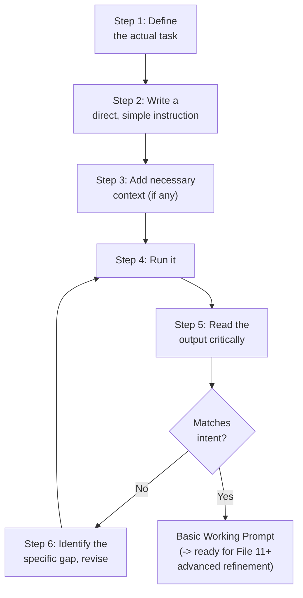
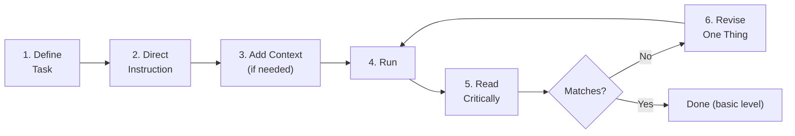
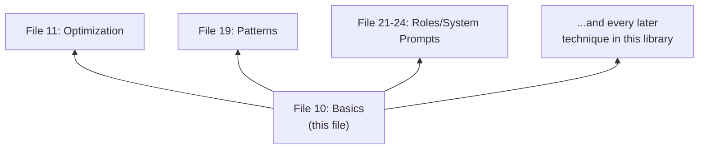

# 10 — Prompt Engineering Basics

> **Series:** Prompt Engineering Knowledge Library
> **File 10 of 60** | **Level:** Beginner
> **Prerequisites:** [`09_Prompt_Design_Principles.md`](./09_Prompt_Design_Principles.md)
> **Next:** [`11_Prompt_Optimization.md`](./11_Prompt_Optimization.md)

---

## Table of Contents

1. [Definition](#definition)
2. [Why It Matters](#why-it-matters)
3. [Core Concepts](#core-concepts)
4. [How It Works](#how-it-works)
5. [Internal Mechanism](#internal-mechanism)
6. [Types of Beginner Techniques](#types-of-beginner-techniques)
7. [Syntax / Structure](#syntax--structure)
8. [Examples (Simple → Advanced)](#examples-simple--advanced)
9. [Best Practices](#best-practices)
10. [Common Mistakes](#common-mistakes)
11. [Real-World Applications](#real-world-applications)
12. [Comparison with Related Concepts](#comparison-with-related-concepts)
13. [Advantages & Limitations](#advantages--limitations)
14. [FAQs](#faqs)
15. [Summary](#summary)
16. [Cheat Sheet](#cheat-sheet)
17. [Glossary](#glossary)
18. [References](#references)
19. [Visual Diagram Gallery](#visual-diagram-gallery)

---

## Definition

**Prompt Engineering Basics** is the concrete, practical, step-by-step starting process for writing effective prompts as a beginner — the hands-on complement to [File 9](./09_Prompt_Design_Principles.md)'s abstract maxims. Where File 9 asks "what qualities make a prompt good, in principle?", this file asks "concretely, what do I actually type, in what order, to get started right now?"

> This file is intentionally the most actionable, least abstract file in the library's early sequence — a direct on-ramp for someone who has understood *why* prompts matter (Files 1–9) and now needs a concrete starting process.

---

## Why It Matters

- **It converts understanding into action.** A beginner can understand every principle in [File 9](./09_Prompt_Design_Principles.md) and still not know how to start writing an actual prompt — this file closes that gap.
- **It establishes good habits early.** Techniques learned as "the basics" tend to become deeply ingrained default behavior; starting with genuinely sound basics pays dividends throughout a practitioner's later, more advanced work.
- **It reduces the intimidation barrier.** Prompt engineering can seem deceptively simple ("just type a sentence") or intimidatingly complex (given later files on optimization, evaluation, and agentic patterns); a clear basics process right-sizes the actual starting complexity.
- **It is the direct foundation for every subsequent technique file.** Optimization ([File 11](./11_Prompt_Optimization.md)) and beyond all assume a working baseline competency this file is designed to establish.

---

## Core Concepts

| Concept | Definition |
|---|---|
| **Task Definition** | Clearly identifying what outcome is actually wanted before writing anything |
| **First Draft** | An initial, honest attempt at a prompt, not expected to be perfect |
| **Direct Instruction** | Stating the task as a clear, imperative request |
| **Iterative Refinement** | The basic beginner practice of trying, observing, and adjusting |
| **Output Inspection** | Actually reading and critically assessing what the model produced |
| **Minimal Viable Prompt** | The simplest prompt version that could plausibly work, used as a starting point |

---

## How It Works



This five-to-six step process is deliberately simple — it is the beginner's version of the more sophisticated workflow covered in [File 8](./08_Prompt_Workflow.md) and the full lifecycle in [File 7](./07_Prompt_Lifecycle.md). Mastering this basic loop reliably is what makes the more advanced processes in those files learnable, rather than overwhelming, later.

---

## Internal Mechanism

### Why "define the task first" is not a trivial or obvious step to skip

A surprisingly common beginner failure mode is starting to type a prompt before genuinely clarifying, even to oneself, what output would actually count as success. This isn't a matter of general carelessness — it reflects a real asymmetry: humans can hold a vague, half-formed intent in mind and still feel like they "know what they want," while a language model has no access to that half-formed mental state at all, only to whatever got translated into the actual prompt text ([File 1](./01_What_is_a_Prompt.md)). The "define the task first" step exists specifically to force that translation to happen deliberately and explicitly, rather than being attempted implicitly and incompletely while typing.

### Why critically reading output is a distinct, learnable skill

Beginners often under-invest in Step 5 (reading the output critically) relative to Steps 1–4, treating any plausible-looking response as sufficient. This matters mechanically because of a documented property of LLM outputs: they are often *fluent* regardless of whether they are *correct* — a model can produce grammatically perfect, confident-sounding text that is nonetheless factually wrong or subtly off-target (loosely related to what's sometimes called "hallucination" in later, more advanced discussions). Genuinely critical reading — actively checking the output against the originally defined task, not just checking that it "sounds reasonable" — is therefore a distinct, necessary skill beginners must deliberately practice, not an automatic byproduct of getting any response back at all.

---

## Types of Beginner Techniques

| Technique | Description | When to Use |
|---|---|---|
| **Direct Instruction** | Stating the task plainly as an imperative | Nearly always, as a starting point |
| **Simple Context Addition** | Adding one or two sentences of necessary background | When the task depends on information the model wouldn't otherwise have |
| **Basic Constraint Setting** | Adding a simple limit (length, format) | When the default response tends toward the wrong scope |
| **Trial-and-Error Iteration** | Repeatedly running and adjusting based on observed output | Always, as the core basic feedback loop |
| **Single Example Demonstration** | Providing one example of the desired output style | When describing the desired format in words alone proves difficult |

---

## Syntax / Structure

The basic starting syntax deliberately avoids heavy structure (XML tags, labeled sections) in favor of plain, direct sentences — heavier structure is introduced as genuinely needed, per [File 6](./06_Prompt_Anatomy.md)'s complexity-matching principle:

```text
[Direct instruction, optionally + context, optionally + one constraint]

Explain [TOPIC] in simple terms, as if to someone with no 
background in the subject. Keep it under 100 words.
```

```text
[Basic single-example technique]

Rewrite this sentence to be more formal.

Example:
Casual: "Hey, can you send that over?"
Formal: "Could you please send that over at your earliest convenience?"

Now rewrite: "Yeah that sounds good to me."
```

---

## Examples (Simple → Advanced)

**Level 1 — Absolute basic direct instruction:**
```text
Explain photosynthesis.
```

**Level 2 — Adding a basic constraint after noticing the output was too long:**
```text
Explain photosynthesis in 3 sentences.
```

**Level 3 — Adding context after noticing the output was too technical:**
```text
Explain photosynthesis in 3 sentences, for a curious 8-year-old 
with no science background yet.
```

**Level 4 — Full basic iterative process shown:**
```text
[Attempt 1] "Explain photosynthesis in 3 sentences for an 
8-year-old."
-> Output uses the word "chlorophyll" without explaining it.

[Attempt 2, revised after critical reading] "Explain 
photosynthesis in 3 sentences for an 8-year-old. Avoid 
technical terms, or briefly explain any you must use."
-> Output now explains chlorophyll simply. Good.
```

**Level 5 — Basic technique combined with a single example:**
```text
Explain scientific concepts simply for an 8-year-old, following 
this style:

Example:
Concept: Gravity
Explanation: "Gravity is like an invisible hand that pulls 
everything down toward the ground — that's why when you drop 
a ball, it falls instead of floating away!"

Now explain: Photosynthesis
```

---

## Best Practices

1. **Always complete the "define the task" step explicitly**, even if only mentally, before writing the first word of the actual prompt.
2. **Write a genuinely simple first attempt** — resist the beginner urge to front-load every possible instruction before seeing how the model responds to something simpler.
3. **Actually read the output against the original goal**, not just for general plausibility — this critical-reading habit compounds in value as tasks grow more complex.
4. **Change one thing at a time when revising**, mirroring the incremental-change principle from [File 8 — Prompt Workflow](./08_Prompt_Workflow.md), so it's clear what each change actually did.
5. **Don't be discouraged by an imperfect first attempt** — iterative refinement is the normal, expected process, not a sign of doing something wrong.

---

## Common Mistakes

| Mistake | Consequence | Fix |
|---|---|---|
| Starting to type without a clear task definition in mind | Vague, unfocused prompts producing off-target output | Explicitly state the goal to yourself before drafting |
| Writing an overly complex first attempt | Hard to tell what's working versus not; overwhelming for a beginner | Start minimal, per [File 8](./08_Prompt_Workflow.md)'s baseline principle |
| Accepting the first output without critical review | Fluent-but-wrong output goes unnoticed | Actively check output against the original defined goal |
| Changing many things at once when revising | Unclear which change actually helped | Adjust one element at a time |
| Giving up after one or two attempts | Missing the genuine gains iterative refinement typically provides | Treat 2-3+ rounds of revision as the normal expected process |

---

## Real-World Applications

- **First-time users of any AI chat assistant** — this is, quite literally, the starting skill set for productive use of tools like Claude, ChatGPT, or similar systems.
- **Educational and onboarding materials** — most introductory prompt engineering courses and guides cover essentially this basic process before moving to advanced techniques.
- **Quick, everyday personal tasks** — drafting an email, summarizing an article, brainstorming ideas — for the vast majority of casual daily use, these basics are entirely sufficient without needing advanced techniques at all.
- **A foundation before specializing** — even practitioners heading toward advanced agentic or production prompt engineering benefit from having genuinely internalized this basic loop first.

---

## Comparison with Related Concepts

| Concept | Difference from "Prompt Engineering Basics" |
|---|---|
| **Prompt Design Principles (File 9)** | Principles are the *abstract qualities* (clarity, specificity) a good prompt exhibits; Basics is the *concrete step-by-step process* a beginner follows to actually produce one |
| **Prompt Optimization (File 11)** | Optimization is *systematic, often metric-driven* improvement of an already-working prompt; Basics is the *initial process* of getting to a first working version at all |
| **Prompt Workflow (File 8)** | Workflow is the more general, mature tactical process (including baselines, spot-checks, edge cases); Basics is the simplified, beginner-appropriate entry point into that same general idea |

---

## Advantages & Limitations

### ✅ Advantages of Mastering the Basics First

- **Builds a reliable, transferable foundation** that every more advanced technique in this library builds upon.
- **Establishes good habits early** (task definition, critical reading, incremental revision) that compound in value over time.
- **Is immediately, broadly useful** — sufficient on its own for the large majority of everyday, non-production prompting needs.

### ⚠️ Limitations

- **Basic techniques alone are insufficient for complex, high-stakes, or production use cases** — those genuinely require the more advanced techniques covered later in this library (patterns, optimization, evaluation, validation).
- **The simplicity that makes this a good starting point also makes it an inadequate stopping point** for anyone pursuing serious prompt engineering skill or production deployment.
- **Trial-and-error alone doesn't scale** — as covered in [File 7](./07_Prompt_Lifecycle.md), purely informal iteration becomes insufficient once stakes and volume rise significantly.

---

## FAQs

**Q: Is it normal for my first prompt attempt to not work well?**
A: Yes, entirely normal and expected — iterative refinement (the basic Step 5-6 loop above) is the standard process, not a sign of prompting incorrectly from the start.

**Q: How many times should I revise a basic prompt before it's "done"?**
A: There's no fixed number — a practical basic heuristic is to keep revising as long as each round is closing a clearly identifiable gap between output and intent; once revisions stop producing a noticeable improvement, the basic prompt is likely as refined as this stage of skill/technique can take it (advanced techniques in later files may improve it further).

**Q: Do I need to learn XML tags and structured anatomy (File 6) as a basic technique?**
A: Not at the true beginner stage — as covered in File 6's complexity-matching guidance, heavier structure becomes valuable as task complexity grows, but isn't a "basic" requirement for simple, everyday prompts.

**Q: What's the single most valuable basic habit to build?**
A: Critically reading output against the originally defined goal (Step 5) is arguably the highest-leverage basic habit, since it's what actually drives useful, targeted revision rather than aimless retrying.

---

## Summary

Prompt Engineering Basics is the concrete, practical step-by-step process — define the task, write a direct first attempt, add necessary context and simple constraints, run it, critically read the output against the original goal, and revise incrementally — that converts the abstract principles of [File 9](./09_Prompt_Design_Principles.md) into an actionable starting skill. This basic loop is intentionally simple, avoiding the heavier structure and systematic rigor of later files, and is entirely sufficient for the vast majority of everyday, non-production prompting needs. Having established both the philosophical principles and the practical basic process, the library now turns to systematic, often metric-driven improvement of prompts that are already working but could work better, beginning with [File 11 — Prompt Optimization](./11_Prompt_Optimization.md).

---

## Cheat Sheet

```text
PROMPT ENGINEERING BASICS — QUICK REFERENCE

THE 6-STEP BASIC LOOP
1. Define the task (to yourself, explicitly)
2. Write a direct, simple first instruction
3. Add context/constraints ONLY if genuinely needed
4. Run it
5. Read the output CRITICALLY against the original goal
6. If it doesn't match: identify the specific gap, revise ONE 
   thing, go back to step 4

REMEMBER
- A weak first attempt is normal, not a failure
- Change one thing at a time when revising
- Don't accept fluent-sounding output without checking it's 
  actually correct/on-target
```

---

## Glossary

| Term | Definition |
|---|---|
| **Task Definition** | Explicitly clarifying the desired outcome before drafting |
| **First Draft** | An initial, non-final prompt attempt |
| **Direct Instruction** | A plainly stated, imperative task request |
| **Iterative Refinement** | The basic practice of trying, observing, and adjusting |
| **Output Inspection** | Critically reading and assessing model output |
| **Minimal Viable Prompt** | The simplest plausible starting version of a prompt |

---

## References

- Anthropic — [Prompt Engineering Overview](https://docs.claude.com/en/docs/build-with-claude/prompt-engineering/overview)
- OpenAI — [Prompt Engineering Guide for Beginners](https://platform.openai.com/docs/guides/prompt-engineering)
- Google — [Introduction to Prompting](https://ai.google.dev/gemini-api/docs/prompting-intro)
- Ji, Z. et al. (2023) — *Survey of Hallucination in Natural Language Generation*, ACM Computing Surveys (fluency-vs-correctness background)

---

## Visual Diagram Gallery

**Diagram 1 — The Basic 6-Step Loop**


**Diagram 2 — Fluency vs. Correctness (why critical reading matters)**
```text
                    HIGH CORRECTNESS
                            |
   Fluent AND       |    Fluent AND
   Correct           |    Correct
   (goal)            |    (goal)
   ------------------+------------------  LOW FLUENCY <---> HIGH FLUENCY
   Awkward AND       |    Fluent but
   Wrong             |    WRONG  <- the trap!
   (obvious to spot) |    (easy to miss without
                      |     critical reading)
                    LOW CORRECTNESS
```

**Diagram 3 — Basics as Foundation for the Rest of the Library**


---

**⬅️ Previous:** [`09_Prompt_Design_Principles.md`](./09_Prompt_Design_Principles.md)
**➡️ Next:** [`11_Prompt_Optimization.md`](./11_Prompt_Optimization.md) — Systematic, metric-driven improvement of already-working prompts.
