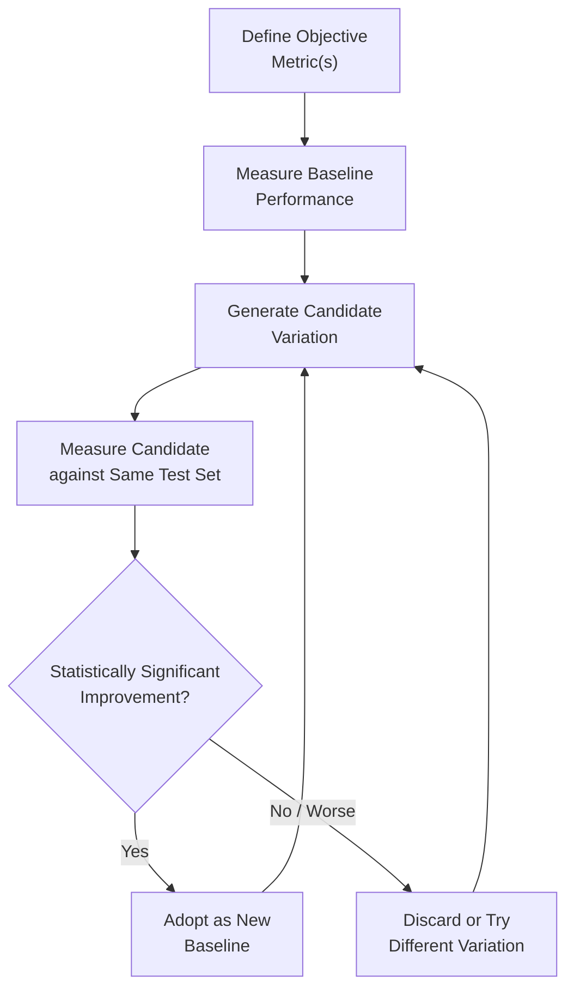
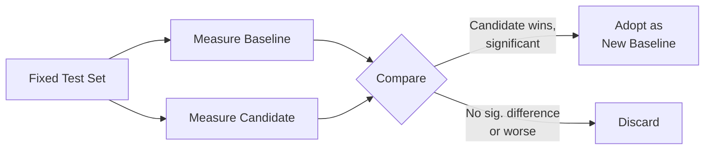
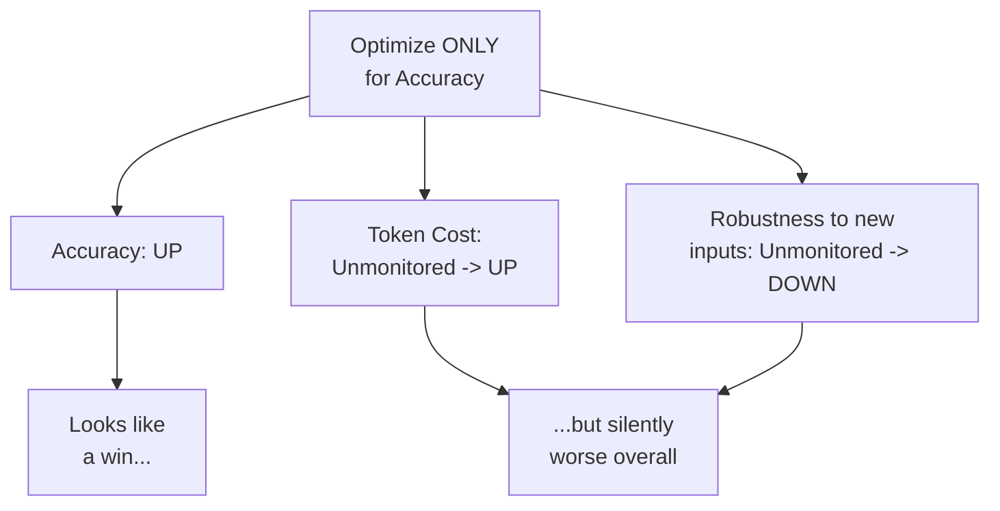

# 11 — Prompt Optimization

> **Series:** Prompt Engineering Knowledge Library
> **File 11 of 60** | **Level:** Intermediate → Advanced
> **Prerequisites:** [`10_Prompt_Engineering_Basics.md`](./10_Prompt_Engineering_Basics.md)
> **Next:** [`12_Prompt_Refinement.md`](./12_Prompt_Refinement.md)

---

## Table of Contents

1. [Definition](#definition)
2. [Why It Matters](#why-it-matters)
3. [Core Concepts](#core-concepts)
4. [How It Works](#how-it-works)
5. [Internal Mechanism](#internal-mechanism)
6. [Types of Optimization](#types-of-optimization)
7. [Syntax / Structure](#syntax--structure)
8. [Examples (Simple → Advanced)](#examples-simple--advanced)
9. [Best Practices](#best-practices)
10. [Common Mistakes](#common-mistakes)
11. [Real-World Applications](#real-world-applications)
12. [Comparison with Related Concepts](#comparison-with-related-concepts)
13. [Advantages & Limitations](#advantages--limitations)
14. [FAQs](#faqs)
15. [Summary](#summary)
16. [Cheat Sheet](#cheat-sheet)
17. [Glossary](#glossary)
18. [References](#references)
19. [Visual Diagram Gallery](#visual-diagram-gallery)

---

## Definition

**Prompt Optimization** is the systematic, often metric-driven process of improving an already-functional prompt against defined, measurable objectives — accuracy, cost (token usage), latency, or consistency — as opposed to informal, qualitative polishing. This file is deliberately scoped narrower than "making a prompt better" in general: it specifically covers improvement driven by *measurement* against a *defined metric*, distinguishing it from [File 12 — Prompt Refinement](./12_Prompt_Refinement.md)'s more manual, qualitative, judgment-driven polishing process.

> The distinguishing question: optimization asks **"does this change measurably improve a defined metric, tested systematically?"** Refinement (File 12) asks **"does this read better / feel more correct to an experienced eye?"** Both are legitimate and often used together, but they are different activities with different tools.

---

## Why It Matters

- **It moves improvement from intuition to evidence.** At scale, relying purely on "this feels better" (however experienced the judge) is insufficient — optimization provides objective, repeatable evidence of actual improvement.
- **It surfaces trade-offs explicitly.** A change that improves accuracy might increase token cost or latency; optimization makes these trade-offs visible and quantifiable rather than accidental.
- **It prevents regression.** Systematic, metric-based comparison catches cases where a "clearly better" qualitative change actually harms performance on a meaningful subset of cases — something purely subjective review often misses.
- **It is essential once a prompt reaches production scale**, where even small per-request metric improvements (cost, accuracy) compound significantly across high request volumes, directly connecting to the compounding-cost logic from [File 3](./03_Why_Prompts_Matter.md).

---

## Core Concepts

| Concept | Definition |
|---|---|
| **Objective Metric** | A defined, measurable target (accuracy, cost, latency, consistency) used to judge improvement |
| **Baseline** | The current prompt version's measured metric performance, used as a comparison point |
| **A/B Testing** | Comparing two prompt versions' metric performance against the same input set |
| **Token Efficiency** | How much useful output/behavior is achieved per token of prompt+response cost |
| **Trade-off Curve** | The relationship between improving one metric (e.g., accuracy) potentially at the cost of another (e.g., latency) |
| **Statistical Significance** | Confidence that an observed metric difference reflects a real improvement, not random variance |

---

## How It Works



Optimization is explicitly cyclical and comparative — a candidate is never judged in isolation, only relative to a measured baseline on the same test conditions. This directly distinguishes it from ad hoc refinement: every optimization claim ("this version is better") is backed by a specific, repeatable measurement, not a general impression.

---

## Internal Mechanism

### Why optimization requires holding the test set constant

A core methodological requirement, borrowed directly from general experimental practice, is that a candidate prompt variation must be measured against the *same* test inputs as the baseline it's being compared to. Without this control, an apparent "improvement" could simply reflect the candidate having been tested on an easier subset of cases — a confound that makes the comparison meaningless. This is why formal prompt optimization is tightly coupled to [File 14 — Prompt Testing](./14_Prompt_Testing.md)'s concept of a defined, representative test set: optimization's validity is entirely dependent on that test set being stable, representative, and used consistently across all compared candidates.

### Why single-metric optimization can produce misleading "improvements"

A common and important pitfall: optimizing purely for one metric (say, accuracy on a narrow test set) without monitoring others can produce a prompt that scores well on the optimized metric while silently degrading on unmeasured dimensions — becoming needlessly verbose (hurting cost/latency), becoming overly rigid (hurting generalization to inputs slightly outside the test set), or overfitting to the specific test set's quirks rather than genuinely improving underlying task performance. This mirrors a well-known phenomenon in general machine learning practice (sometimes called "Goodhart's Law" colloquially — when a measure becomes a target, it ceases to be a good measure). Sound optimization practice therefore tracks multiple relevant metrics simultaneously, even when primarily optimizing for one, specifically to catch this failure mode early.

---

## Types of Optimization

| Type | Objective | Typical Trade-off |
|---|---|---|
| **Accuracy Optimization** | Maximize correctness/quality of output | May increase prompt length/cost |
| **Cost Optimization** | Minimize token usage (prompt + response) | May reduce accuracy or robustness if over-trimmed |
| **Latency Optimization** | Minimize response generation time | Often correlated with cost optimization (shorter = faster) |
| **Consistency Optimization** | Minimize output variance across repeated/similar inputs | May require more explicit constraints, increasing length |
| **Robustness Optimization** | Maximize performance across diverse/edge-case inputs, not just the "happy path" | Requires broader, harder-to-assemble test sets |

---

## Syntax / Structure

Optimization is typically documented as a structured comparison, not expressed as prompt syntax itself:

```yaml
# Example: an optimization experiment record
experiment: reduce_token_cost_v2
baseline: 
  prompt_version: v1.3
  avg_tokens: 450
  accuracy: 92%
candidate:
  prompt_version: v1.4
  changes: "Removed redundant instruction repetition; 
            condensed examples from 3 to 2"
  avg_tokens: 310
  accuracy: 91%
decision: "Adopted — 31% token reduction for 1pp accuracy 
           trade-off, deemed acceptable for this use case"
```

```text
# Example: optimizing a prompt for token efficiency
BEFORE (450 tokens, redundant):
"Please carefully read the following text. I want you to 
summarize it. Make sure your summary is good and captures 
the important points. The summary you write should be a 
high-quality summary that reflects the key ideas well."

AFTER (310 tokens, same intent, less redundancy):
"Summarize the key points of the following text in 3 sentences."
```

---

## Examples (Simple → Advanced)

**Level 1 — Simple manual metric comparison:**
```text
v1: "Summarize this." -> avg. summary length: 180 words 
    (too long for the use case)
v2: "Summarize this in 2 sentences." -> avg. summary length: 
    45 words (matches requirement)
Decision: v2 adopted based on measured length metric.
```

**Level 2 — Accuracy-focused optimization:**
```text
Baseline prompt: 78% correct classification on 50-item test set
Candidate (added explicit category definitions): 89% correct 
on the SAME 50-item test set
Decision: Candidate adopted — clear, tested improvement.
```

**Level 3 — Multi-metric trade-off consideration:**
```text
Baseline: 89% accuracy, 420 avg tokens, 1.2s avg latency
Candidate A (more examples added): 93% accuracy, 680 tokens, 1.9s
Candidate B (clearer instructions, no new examples): 91% 
accuracy, 440 tokens, 1.3s
Decision: Depends on priorities — B chosen for a latency-
sensitive application; A would be preferred for an accuracy-
critical, latency-tolerant one.
```

**Level 4 — Systematic A/B test across a larger set:**
```text
Test set: 200 representative production-sampled inputs
Baseline v2.1: 84.5% pass rate (rubric-scored, File 15)
Candidate v2.2: 87.0% pass rate on SAME 200 inputs
Statistical check: difference exceeds noise threshold given 
sample size -> genuine improvement, not random variance
Decision: v2.2 promoted to new baseline; v2.1 archived (File 17).
```

**Level 5 — Full optimization cycle with regression monitoring:**
```text
1. Baseline v3.0 measured: 91% accuracy, 380 tokens, 
   consistency score 0.88 (File 15 metric)
2. Candidate v3.1 (condensed instructions): 90% accuracy 
   (-1pp), 260 tokens (-32%), consistency 0.85 (-0.03)
3. Candidate v3.2 (condensed instructions + 1 clarifying 
   example re-added): 91% accuracy (unchanged), 300 tokens 
   (-21%), consistency 0.89 (+0.01)
4. Decision: v3.2 strictly dominates the baseline on all 
   three tracked metrics simultaneously -> clear adopt decision, 
   no trade-off judgment even required.
```

---

## Best Practices

1. **Always define the objective metric(s) before optimizing**, not after — retroactively picking a metric that happens to favor a preferred candidate undermines the entire exercise.
2. **Hold the test set constant** across baseline and candidate comparisons — this is a hard methodological requirement, not a nice-to-have.
3. **Track multiple relevant metrics simultaneously**, even when primarily optimizing for one, to catch single-metric overfitting early.
4. **Be explicit about trade-off decisions** when no candidate strictly dominates on every metric — document the reasoning, as shown in Level 3 above.
5. **Don't optimize prematurely** — a prompt should generally reach basic functional correctness ([File 10](./10_Prompt_Engineering_Basics.md)) before investing in systematic, metric-driven optimization of it.

---

## Common Mistakes

| Mistake | Consequence | Fix |
|---|---|---|
| Comparing candidates against different or shifting test sets | Invalid, misleading comparisons | Hold the test set rigorously constant |
| Optimizing for a single metric with no monitoring of others | Silent degradation on unmeasured dimensions | Track multiple relevant metrics simultaneously |
| Treating small, statistically insignificant differences as real improvements | Chasing noise rather than genuine gains | Apply basic statistical reasoning to sample sizes and observed differences |
| Optimizing before reaching basic functional correctness | Wasted systematic effort on a fundamentally flawed prompt | Establish basic correctness first (File 10), optimize second |
| No documentation of optimization decisions and trade-offs | Repeated re-litigation of the same decisions later; unclear history | Document experiments and decisions, as in the Syntax section's example |

---

## Real-World Applications

- **High-volume production LLM applications** — where per-request token cost or latency improvements compound significantly at scale.
- **Model migration projects** — when switching between LLM providers or versions, systematic optimization re-establishes strong performance on the new model against defined metrics.
- **Competitive/benchmark-driven contexts** — research and product benchmarking often explicitly requires this rigorous, metric-driven comparison methodology.
- **Cost-sensitive deployments** — startups and cost-conscious teams frequently prioritize token optimization specifically, applying the trade-off reasoning covered in this file.

---

## Comparison with Related Concepts

| Concept | Difference from "Prompt Optimization" |
|---|---|
| **Prompt Refinement (File 12)** | Refinement is manual, qualitative, judgment-driven polishing; optimization is systematic, metric-driven, and comparative against a held-constant test set |
| **Prompt Iteration (File 16)** | Iteration is the general, higher-level cyclical process connecting testing, refinement, and versioning over time; optimization is one specific, rigorous *type* of iterative activity, distinguished by its metric-driven methodology |
| **Prompt Evaluation (File 15)** | Evaluation is the *measurement methodology itself* (how to score outputs); optimization is the *process* that uses evaluation's scoring to systematically compare and select between candidate prompts |

---

## Advantages & Limitations

### ✅ Advantages of Systematic Optimization

- **Provides objective, repeatable evidence** of genuine improvement, rather than relying on subjective impression alone.
- **Surfaces trade-offs explicitly**, enabling deliberate, informed decisions rather than accidental ones.
- **Prevents both false-positive improvements** (chasing noise) **and hidden regressions** (single-metric overfitting) through rigorous methodology.

### ⚠️ Limitations

- **Requires meaningful upfront investment** — defining metrics, building test sets, and running systematic comparisons takes real time and effort, which may not be justified for low-stakes, one-off prompts.
- **Metrics can fail to capture genuinely important qualities** that are hard to quantify (e.g., subtle tone appropriateness), meaning optimization can miss what purely qualitative refinement would catch.
- **Statistical rigor has diminishing returns at small scale** — for low-volume use cases, the overhead of formal A/B testing may exceed its practical value compared to simpler refinement approaches.

---

## FAQs

**Q: Do I need a large test set to do meaningful prompt optimization?**
A: Larger test sets generally provide more statistical confidence, but even a modest, carefully chosen representative set (see [File 14 — Prompt Testing](./14_Prompt_Testing.md)) can support meaningful optimization, especially for large, obvious improvements. Formal statistical significance testing becomes more important as observed differences get smaller.

**Q: Can optimization and refinement (File 12) be used together?**
A: Yes, and this is common practice — refinement often generates the candidate variations that optimization then rigorously evaluates and compares.

**Q: What if two metrics I care about conflict, with no candidate winning on both?**
A: This is a genuine trade-off requiring explicit, documented judgment about priorities for the specific use case (see Level 3 example above) — optimization surfaces the trade-off clearly, but resolving it is a product/business decision, not something the optimization process itself can automate away.

**Q: Is prompt optimization only relevant for high-volume production systems?**
A: It's most clearly valuable there due to compounding effects at scale, but the core discipline (measure before and after, don't rely purely on impression) has value even at smaller scale, proportional to the task's stakes ([File 3](./03_Why_Prompts_Matter.md)).

---

## Summary

Prompt Optimization is the systematic, metric-driven process of improving an already-functional prompt against defined, measurable objectives — accuracy, cost, latency, or consistency — through rigorous, held-constant comparison between a baseline and candidate variations. This differs fundamentally from qualitative refinement in its methodology: every optimization claim is backed by specific measurement, not general impression, which both prevents chasing statistical noise and catches silent regressions from single-metric overfitting. Optimization's value compounds significantly at production scale and becomes essential once a prompt has reached basic functional correctness and needs to perform reliably and efficiently under real-world volume. Having covered this rigorous, measurement-driven approach, the library turns next to its manual, judgment-driven counterpart in [File 12 — Prompt Refinement](./12_Prompt_Refinement.md).

---

## Cheat Sheet

```text
PROMPT OPTIMIZATION — QUICK REFERENCE

CORE METHODOLOGY
1. Define objective metric(s) FIRST
2. Measure baseline on a fixed test set
3. Generate candidate variation
4. Measure candidate on the SAME test set
5. Compare — statistically significant improvement? Adopt.
   Otherwise? Discard or try again.

COMMON METRICS
Accuracy | Cost (tokens) | Latency | Consistency | Robustness

GOLDEN RULE: Hold the test set CONSTANT across all comparisons.
WATCH FOR: Single-metric optimization causing silent regressions 
           elsewhere — track multiple metrics simultaneously.
```

---

## Glossary

| Term | Definition |
|---|---|
| **Objective Metric** | A defined, measurable improvement target |
| **Baseline** | Current measured performance, used as a comparison point |
| **A/B Testing** | Comparing two versions' metrics on the same input set |
| **Token Efficiency** | Useful output achieved per token of cost |
| **Trade-off Curve** | The relationship between competing metric improvements |
| **Statistical Significance** | Confidence that a measured difference is real, not noise |

---

## References

- Anthropic — [Prompt Engineering Overview](https://docs.claude.com/en/docs/build-with-claude/prompt-engineering/overview)
- Zhou, Y. et al. (2022) — *Large Language Models Are Human-Level Prompt Engineers*, arXiv:2211.01910
- Pryzant, R. et al. (2023) — *Automatic Prompt Optimization with "Gradient Descent" and Beam Search*, arXiv:2305.03495
- Liang, P. et al. (2022) — *Holistic Evaluation of Language Models (HELM)*, arXiv:2211.09110

---

## Visual Diagram Gallery

**Diagram 1 — The Optimization Comparison Cycle**


**Diagram 2 — The Multi-Metric Trade-off Space**
```text
                Accuracy
                    ^
                    |    * Candidate A (high acc, high cost)
                    |   /
                    |  /
        Baseline -> * 
                    | \
                    |  \
                    |   * Candidate B (lower acc, low cost)
                    +---------------------------> Cost/Latency
        (No single "best" — depends on priorities)
```

**Diagram 3 — Single-Metric Overfitting Risk**


---

**⬅️ Previous:** [`10_Prompt_Engineering_Basics.md`](./10_Prompt_Engineering_Basics.md)
**➡️ Next:** [`12_Prompt_Refinement.md`](./12_Prompt_Refinement.md) — Manual, qualitative polishing as optimization's complementary counterpart.
