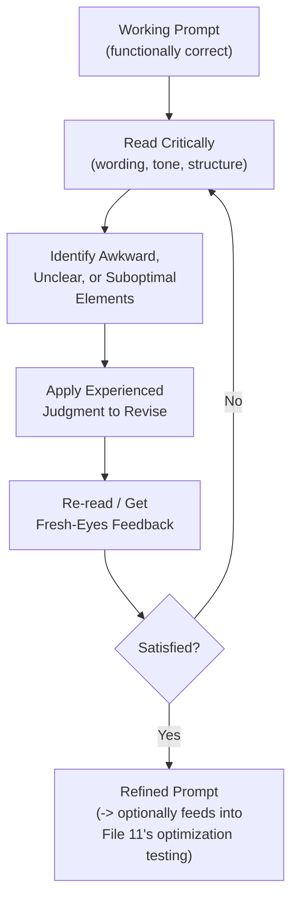
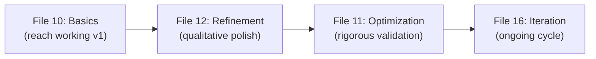

# 12 — Prompt Refinement

> **Series:** Prompt Engineering Knowledge Library
> **File 12 of 60** | **Level:** Intermediate
> **Prerequisites:** [`11_Prompt_Optimization.md`](./11_Prompt_Optimization.md)
> **Next:** [`13_Prompt_Debugging.md`](./13_Prompt_Debugging.md)

---

## Table of Contents

1. [Definition](#definition)
2. [Why It Matters](#why-it-matters)
3. [Core Concepts](#core-concepts)
4. [How It Works](#how-it-works)
5. [Internal Mechanism](#internal-mechanism)
6. [Types of Refinement](#types-of-refinement)
7. [Syntax / Structure](#syntax--structure)
8. [Examples (Simple → Advanced)](#examples-simple--advanced)
9. [Best Practices](#best-practices)
10. [Common Mistakes](#common-mistakes)
11. [Real-World Applications](#real-world-applications)
12. [Comparison with Related Concepts](#comparison-with-related-concepts)
13. [Advantages & Limitations](#advantages--limitations)
14. [FAQs](#faqs)
15. [Summary](#summary)
16. [Cheat Sheet](#cheat-sheet)
17. [Glossary](#glossary)
18. [References](#references)
19. [Visual Diagram Gallery](#visual-diagram-gallery)

---

## Definition

**Prompt Refinement** is the manual, qualitative process of polishing a prompt based on expert judgment, careful reading, and pattern-recognition experience — improving wording, structure, and framing based on *how the prompt and its outputs read to a skilled eye*, rather than against a formally defined, measured metric. This complements [File 11 — Prompt Optimization](./11_Prompt_Optimization.md)'s rigorous, comparative methodology: refinement is the craft-based counterpart to optimization's science-based one.

> A useful shorthand: **optimization asks "did this measurably move the needle?"; refinement asks "does this now read the way an experienced prompt engineer would want it to read?"** Both are legitimate, and mature practice typically uses refinement to generate candidates that optimization then rigorously tests.

---

## Why It Matters

- **Not everything valuable is easily measurable.** Tone appropriateness, natural phrasing, and subtle framing choices often resist clean quantification, yet meaningfully affect real-world prompt quality — refinement is where this qualitative judgment lives.
- **It's faster for early-stage and low-stakes work.** Setting up formal metrics and test sets (required for optimization) has real overhead; for many everyday tasks, experienced qualitative judgment reaches a good result faster.
- **It draws on accumulated pattern-recognition expertise.** Experienced prompt engineers develop an intuitive sense for what tends to work, built from extensive prior exposure — refinement is the practice of applying that accumulated judgment directly.
- **It generates the candidates optimization tests.** In mature workflows, refinement isn't a competitor to optimization but its upstream partner — generating thoughtful variations that are subsequently, rigorously compared.

---

## Core Concepts

| Concept | Definition |
|---|---|
| **Qualitative Judgment** | Assessment based on experienced reading rather than formal measurement |
| **Wordsmithing** | Careful attention to precise word choice and phrasing |
| **Tone Calibration** | Adjusting the register/voice of a prompt or its expected output |
| **Pattern Recognition** | Drawing on prior experience to recognize likely-effective or likely-problematic phrasing |
| **Read-Aloud Test** | An informal technique of reading a prompt as if speaking it, to catch awkwardness |
| **Fresh-Eyes Review** | Revisiting a prompt after time away, or having someone else review it, to catch issues familiarity has obscured |

---

## How It Works



Refinement is inherently more subjective and less procedurally rigid than optimization — there is no fixed algorithm, only accumulated craft applied through repeated careful reading and revision. This doesn't make it less valuable, but it does make it harder to fully delegate, automate, or formally verify compared to optimization's measurable methodology.

---

## Internal Mechanism

### Why experienced judgment can catch what metrics miss

A skilled prompt engineer's qualitative judgment is, in effect, a highly compressed model of accumulated pattern-recognition experience — having seen many prompts succeed and fail, certain phrasing patterns come to "feel" risky or promising even before formal testing confirms it. This isn't mystical; it's the same kind of expert pattern recognition seen in many skilled crafts (a chess player recognizing a "good-looking" position, an editor recognizing awkward prose). Crucially, this judgment can catch issues that a narrowly defined metric wouldn't be designed to measure at all — a subtle tonal mismatch, for instance, might not show up in an accuracy metric, but an experienced eye reading the output can immediately sense it's "off" in a way worth fixing.

### Why refinement alone is insufficient at scale, and needs optimization's discipline

The same subjectivity that makes refinement valuable and fast also makes it a poor sole methodology once stakes and scale rise. Expert judgment, however skilled, is not immune to blind spots, inconsistency between different reviewers, or simple human error in extrapolating from a small number of manually reviewed examples to how a prompt will actually perform across a large, diverse, real-world input distribution. This is precisely why mature practice treats refinement and optimization as complementary rather than substitutable: refinement's speed and qualitative insight generate promising candidates; optimization's rigor and scale validate whether that qualitative impression actually holds up systematically.

---

## Types of Refinement

| Type | Focus | Typical Technique |
|---|---|---|
| **Wording Refinement** | Precise, unambiguous word choice | Replacing vague terms with concrete ones |
| **Structural Refinement** | Improving organization/flow of the prompt | Reordering components ([File 6](./06_Prompt_Anatomy.md)) for clarity |
| **Tone Refinement** | Adjusting voice/register | Softening or sharpening phrasing to match intended context |
| **Redundancy Refinement** | Removing unnecessary repetition or padding | Consolidating restated instructions |
| **Edge-Case Sensitivity Refinement** | Anticipating and addressing likely misinterpretations | Adding a clarifying phrase after imagining an unusual input |

---

## Syntax / Structure

Refinement is process-oriented rather than syntax-oriented, but its output is visible in side-by-side before/after comparison:

```text
BEFORE (functional but unrefined):
"Write a response to the customer. Be nice about it and 
explain the situation and don't make them upset."

AFTER (refined — clearer, more actionable, better calibrated):
"Write an empathetic response to the customer that clearly 
explains the delay's cause, avoids blame-shifting language, 
and offers a concrete next step."
```

The refined version isn't necessarily *measurably* different on some formal metric — it's improved based on an experienced read that "be nice" and "don't make them upset" are vague, non-actionable guidance, replaced with more concrete, professionally-calibrated direction.

---

## Examples (Simple → Advanced)

**Level 1 — Basic wordsmithing:**
```text
BEFORE: "Make this text better."
AFTER:  "Improve this text's clarity and flow without 
         changing its meaning."
```

**Level 2 — Tone calibration:**
```text
BEFORE: "Tell the user their request was denied."
AFTER:  "Inform the user, with genuine empathy, that their 
         request could not be approved at this time, and 
         explain the reason clearly."
```

**Level 3 — Structural refinement (reordering for clarity):**
```text
BEFORE: "Here's some data. Also please note we need this in 
         JSON format. Analyze the sentiment of each review. 
         Oh and ignore reviews under 5 words."

AFTER:  "Analyze the sentiment of each review below, ignoring 
         any review under 5 words. Return results in JSON 
         format.

         Data: [reviews]"
```

**Level 4 — Anticipatory edge-case refinement:**
```text
BEFORE: "Extract the person's name from this text."

[Experienced engineer imagines: what if there's no name, or 
multiple names?]

AFTER: "Extract the person's name from this text. If multiple 
        names appear, extract only the first one mentioned. 
        If no name is present, return 'None'."
```

**Level 5 — Full refinement pass with fresh-eyes review noted:**
```text
[First draft, by original author:]
"Summarize customer complaints. Make it useful for the team."

[Self-refinement pass:]
"Summarize the customer complaints below into themes useful 
for the product team's weekly review."

[Fresh-eyes review by a colleague, catching an ambiguity 
the original author was too close to the task to notice:]
"'Themes' is still vague — does this mean 3 themes? 10? 
Should each theme include example quotes?"

[Final refined version, incorporating the fresh-eyes feedback:]
"Summarize the customer complaints below into the 3-5 most 
common themes for the product team's weekly review. For each 
theme, include one representative example quote."
```

---

## Best Practices

1. **Use the read-aloud test** — awkward phrasing that's easy to skim past in silent reading often becomes obvious when read as if speaking it.
2. **Seek fresh-eyes review when possible** — the person who wrote a prompt is often too close to it to spot ambiguities a new reader would immediately notice (see Level 5 above).
3. **Refine after achieving basic functional correctness**, not before — polishing wording on a fundamentally broken prompt wastes refinement effort ([File 10](./10_Prompt_Engineering_Basics.md) should come first).
4. **Don't over-refine indefinitely** — refinement has diminishing returns; recognize when further wordsmithing is unlikely to meaningfully change output quality.
5. **Feed promising refinements into optimization testing** ([File 11](./11_Prompt_Optimization.md)) for anything heading toward production use, rather than trusting qualitative impression alone at that stage.

---

## Common Mistakes

| Mistake | Consequence | Fix |
|---|---|---|
| Refining before reaching basic functional correctness | Wasted polish on a fundamentally broken approach | Establish basic correctness first (File 10) |
| Treating refinement as a substitute for optimization at production scale | Unvalidated qualitative impressions deployed without rigorous testing | Use refinement to generate candidates, optimization (File 11) to validate them |
| Never seeking outside/fresh-eyes review | Author's own blind spots go uncaught | Build in fresh-eyes review, especially for important prompts |
| Endless refinement with no stopping point | Diminishing-returns effort that could be better spent elsewhere | Recognize when further wordsmithing isn't meaningfully changing output |
| Refining based on a single output example | Overfitting the prompt's wording to one specific case | Read multiple outputs across varied inputs before refining |

---

## Real-World Applications

- **Content and communication-focused prompts** (marketing copy, customer messaging) where tone and phrasing genuinely matter beyond raw factual correctness.
- **Prompt review/editing processes**, analogous to editorial review of written content, common in teams producing user-facing AI-generated text.
- **Early-stage and exploratory prompt development**, where the overhead of formal optimization testing isn't yet justified.
- **Collaborative prompt-writing sessions**, where fresh-eyes review from a colleague is a core, deliberately built-in refinement technique.

---

## Comparison with Related Concepts

| Concept | Difference from "Prompt Refinement" |
|---|---|
| **Prompt Optimization (File 11)** | Optimization is systematic and metric-driven with a held-constant test set; refinement is manual, qualitative, and judgment-driven — they're complementary, not competing |
| **Prompt Engineering Basics (File 10)** | Basics is the beginner's initial process to reach a *functionally working* first version; refinement is the subsequent polishing of an already-functional prompt |
| **Prompt Debugging (File 13)** | Debugging is *reactive* — fixing a known-broken prompt; refinement is typically applied to an already-working prompt to make it better, not to fix something broken |

---

## Advantages & Limitations

### ✅ Advantages of Qualitative Refinement

- **Fast and low-overhead** compared to setting up formal optimization infrastructure, well-suited to early-stage or low-stakes work.
- **Captures qualities that resist clean quantification** (tone, natural phrasing, subtle appropriateness).
- **Leverages valuable accumulated expertise** that experienced practitioners bring to bear efficiently.

### ⚠️ Limitations

- **Subjective and inconsistent across different reviewers** — what reads well to one experienced engineer may not to another.
- **Doesn't scale to validate performance across large, diverse real-world input distributions** — a small number of manually reviewed examples cannot substitute for systematic testing.
- **Prone to reviewer blind spots and overconfidence** without deliberate countermeasures like fresh-eyes review.

---

## FAQs

**Q: Should I refine a prompt before or after testing it (File 14)?**
A: Typically an initial refinement pass happens before formal testing (to reach a genuinely good candidate worth rigorously testing), and further refinement may follow based on what testing reveals — the two activities often alternate rather than strictly precede one another.

**Q: Is refinement less rigorous or less valuable than optimization?**
A: Not less valuable — different. Refinement captures qualities and moves faster in ways optimization's formal methodology doesn't easily replicate; the two are complementary tools for different purposes and stages, not a hierarchy of rigor.

**Q: How do I know when to stop refining?**
A: A practical signal is when further wordsmithing attempts no longer produce outputs you can clearly articulate as "better" than the previous version — at that point, further refinement effort likely has low marginal value, and testing/optimization (if the stakes warrant it) becomes the more productive next step.

**Q: Can refinement be done collaboratively, or is it inherently solo?**
A: It works well both ways — solo refinement leverages one person's accumulated judgment quickly; collaborative refinement (especially fresh-eyes review) explicitly guards against individual blind spots, as shown in the Level 5 example.

---

## Summary

Prompt Refinement is the manual, qualitative process of polishing an already-functional prompt through experienced judgment, careful wordsmithing, tone calibration, and structural improvement — capturing qualities like natural phrasing and subtle appropriateness that resist easy quantification, complementing rather than competing with [File 11](./11_Prompt_Optimization.md)'s rigorous, metric-driven methodology. Because expert judgment, however skilled, carries inherent subjectivity and blind-spot risk, mature practice typically uses refinement to generate thoughtful candidate improvements and then, for anything reaching real scale or stakes, validates those candidates through optimization's more rigorous testing. Having covered both the systematic and craft-based approaches to improving a working prompt, the library now turns to the reactive process of fixing a prompt that isn't working at all: [File 13 — Prompt Debugging](./13_Prompt_Debugging.md).

---

## Cheat Sheet

```text
PROMPT REFINEMENT — QUICK REFERENCE

REFINEMENT vs. OPTIMIZATION (File 11)
Refinement: qualitative, judgment-driven, fast, subjective
Optimization: quantitative, metric-driven, rigorous, objective
             (often used together — refinement generates candidates,
              optimization validates them)

CORE TECHNIQUES
[ ] Read-aloud test for awkward phrasing
[ ] Fresh-eyes review to catch author blind spots
[ ] Read multiple outputs before refining wording
[ ] Anticipate edge cases an experienced eye would flag

STOPPING SIGNAL: When you can no longer articulate why a new 
version is "better" than the last, stop refining.
```

---

## Glossary

| Term | Definition |
|---|---|
| **Qualitative Judgment** | Assessment based on experienced reading, not formal measurement |
| **Wordsmithing** | Careful, precise word-choice revision |
| **Tone Calibration** | Adjusting the voice/register of a prompt or output |
| **Pattern Recognition** | Applying accumulated experience to spot likely issues |
| **Read-Aloud Test** | Reading a prompt as if speaking it, to catch awkwardness |
| **Fresh-Eyes Review** | Review by someone without the author's familiarity/blind spots |

---

## References

- Anthropic — [Prompt Engineering Overview](https://docs.claude.com/en/docs/build-with-claude/prompt-engineering/overview)
- Zinsser, W. — *On Writing Well* (craft-based revision principles, broadly applicable)
- OpenAI — [Iterating on Prompts](https://platform.openai.com/docs/guides/prompt-engineering)
- Reynolds, L. & McDonell, K. (2021) — *Prompt Programming for Large Language Models*, arXiv:2102.07350

---

## Visual Diagram Gallery

**Diagram 1 — Refinement and Optimization as Partners**


**Diagram 2 — The Refinement Read-Revise Loop**
```text
    ┌─────────────┐
    │ Read prompt  │
    │  critically  │
    └──────┬───────┘
           v
    ┌─────────────┐
    │  Identify    │
    │ awkward spot │
    └──────┬───────┘
           v
    ┌─────────────┐      ┌──────────────┐
    │   Revise     │ ---> │ Fresh-eyes    │
    │              │      │ review (opt.) │
    └──────┬───────┘      └──────┬───────┘
           v                     │
           └─────────────────────┘
           (loop until satisfied)
```

**Diagram 3 — Where Refinement Fits in the Broader Process**


---

**⬅️ Previous:** [`11_Prompt_Optimization.md`](./11_Prompt_Optimization.md)
**➡️ Next:** [`13_Prompt_Debugging.md`](./13_Prompt_Debugging.md) — Reactively diagnosing and fixing a prompt that isn't working.
