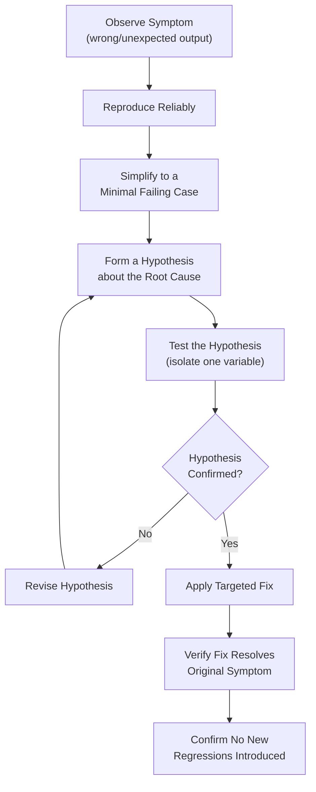
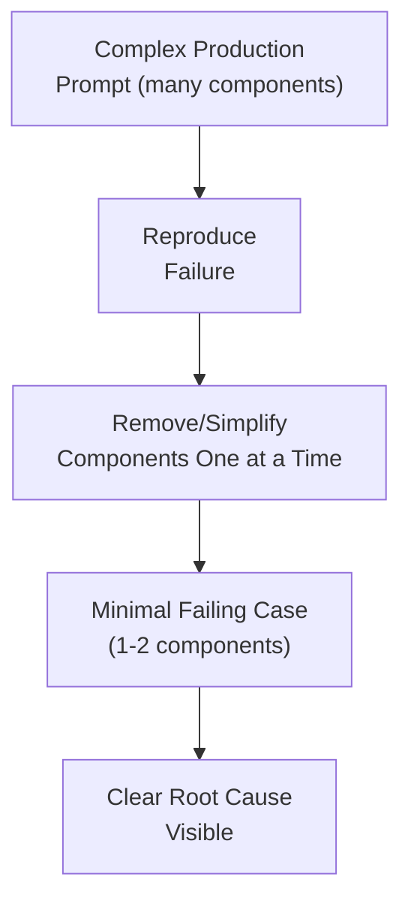
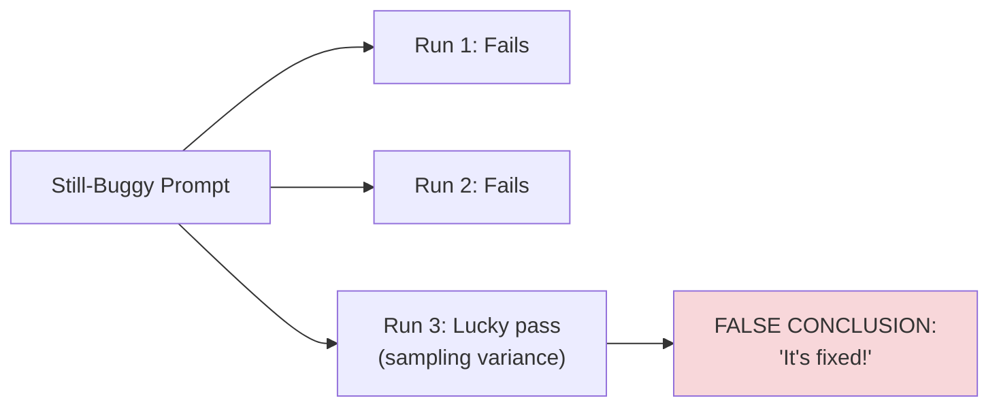

# 13 — Prompt Debugging

> **Series:** Prompt Engineering Knowledge Library
> **File 13 of 60** | **Level:** Intermediate
> **Prerequisites:** [`12_Prompt_Refinement.md`](./12_Prompt_Refinement.md)
> **Next:** [`14_Prompt_Testing.md`](./14_Prompt_Testing.md)

---

## Table of Contents

1. [Definition](#definition)
2. [Why It Matters](#why-it-matters)
3. [Core Concepts](#core-concepts)
4. [How It Works](#how-it-works)
5. [Internal Mechanism](#internal-mechanism)
6. [Types of Prompt Bugs](#types-of-prompt-bugs)
7. [Syntax / Structure](#syntax--structure)
8. [Examples (Simple → Advanced)](#examples-simple--advanced)
9. [Best Practices](#best-practices)
10. [Common Mistakes](#common-mistakes)
11. [Real-World Applications](#real-world-applications)
12. [Comparison with Related Concepts](#comparison-with-related-concepts)
13. [Advantages & Limitations](#advantages--limitations)
14. [FAQs](#faqs)
15. [Summary](#summary)
16. [Cheat Sheet](#cheat-sheet)
17. [Glossary](#glossary)
18. [References](#references)
19. [Visual Diagram Gallery](#visual-diagram-gallery)

---

## Definition

**Prompt Debugging** is the *reactive* process of diagnosing and fixing a prompt that is producing known-incorrect, unexpected, or failing output — as opposed to [File 14 — Prompt Testing](./14_Prompt_Testing.md)'s *proactive* practice of running structured test cases before a failure is known to exist at all. Debugging starts from a symptom ("this specific output is wrong") and works backward to a root cause; testing starts from a hypothesis ("this input category might reveal a problem") and works forward to a discovery.

> The distinguishing trigger: debugging begins **after** you already know something is broken. Testing is designed to find out **before** you'd otherwise know.

---

## Why It Matters

- **Failures happen even to well-designed prompts.** No amount of upfront design principles ([File 9](./09_Prompt_Design_Principles.md)) or testing ([File 14](./14_Prompt_Testing.md)) guarantees zero failures; debugging skill determines how efficiently those failures, when they occur, get resolved.
- **Systematic debugging is dramatically faster than random tweaking.** A structured diagnostic approach isolates root causes efficiently; unstructured trial-and-error on a broken prompt often burns significant time without converging on the actual issue.
- **It directly prevents recurring failures.** Debugging that stops at "changed something until it worked" (without understanding *why* the original version failed) risks the same class of bug recurring elsewhere.
- **It connects tightly to the component-level thinking from [File 5](./05_Prompt_Components.md)** — one of debugging's most powerful techniques is isolating which specific component is responsible for a failure, which is only possible when components are clearly identified.

---

## Core Concepts

| Concept | Definition |
|---|---|
| **Symptom** | The observable, incorrect behavior that triggered the debugging process |
| **Root Cause** | The actual underlying reason the prompt produced the symptom |
| **Isolation** | Narrowing down which specific part of a prompt is responsible for a failure |
| **Reproduction** | Reliably triggering the same failure again, to confirm it's understood and later fixed |
| **Minimal Failing Case** | The simplest possible input/prompt combination that still triggers the bug |
| **Hypothesis Testing** | Forming a specific guess about the cause and directly testing whether it's correct |

---

## How It Works



This process deliberately mirrors traditional software debugging methodology, adapted for prompts: reproduce, simplify, hypothesize, isolate, fix, verify. The "simplify to a minimal failing case" step (Step 3) is often the single highest-leverage step, directly connecting to [File 8 — Prompt Workflow](./08_Prompt_Workflow.md)'s incremental-change principle — a complex, multi-component prompt makes root-cause isolation far harder than a stripped-down reproduction of the same failure.

---

## Internal Mechanism

### Why "minimal failing case" reduction works, mechanically

A production prompt failure often occurs within a large, multi-component prompt (role, context, several constraints, examples, data). When many components are present simultaneously, a failure could plausibly trace back to any of them, or to an interaction between several — the diagnostic search space is large. Deliberately removing components one at a time (or building back up from nothing) while checking whether the failure persists directly narrows this search space with each removal, converging on the actual responsible element far faster than reasoning about the full complex prompt all at once. This is a direct, practical application of the same incremental-isolation logic introduced in [File 8](./08_Prompt_Workflow.md) and [File 5](./05_Prompt_Components.md)'s discussion of component-level failure patterns — debugging is where that theoretical value becomes concretely realized.

### Why "it works now" isn't the same as "the bug is fixed"

A specific, common pitfall: after some change, a previously-failing case now produces correct output, and debugging is declared complete. This can be misleading for a mechanical reason tied to output variance ([File 4](./04_How_LLMs_Interpret_Prompts.md)): due to sampling, a genuinely still-buggy prompt might occasionally produce a correct-looking output by chance, especially at non-zero temperature. True confirmation that a root cause has actually been fixed (not merely that one lucky run succeeded) requires re-running the minimal failing case multiple times, and ideally understanding *why* the fix should work mechanically — not just observing that it happened to work once.

---

## Types of Prompt Bugs

| Bug Type | Symptom | Typical Root Cause |
|---|---|---|
| **Ambiguity Bug** | Inconsistent or wildly varying outputs across similar inputs | Vague or underspecified instruction (violates specificity, [File 9](./09_Prompt_Design_Principles.md)) |
| **Context Gap Bug** | Plausible-sounding but factually wrong or generic output | Missing necessary background information |
| **Format Bug** | Correct content, wrong structure | Output format not explicitly specified ([File 29](./29_Output_Formatting.md)) |
| **Instruction Conflict Bug** | Model seems to follow one instruction while ignoring another | Contradictory guidance within the prompt |
| **Injection/Boundary Bug** | Model treats embedded data as a new instruction | Insufficient delimitation between instructions and data ([File 26](./26_Context_Injection.md)) |
| **Edge-Case Bug** | Works on typical inputs, fails on unusual ones | Prompt only ever tested against typical, "happy path" cases |

---

## Syntax / Structure

Debugging is typically documented as a structured investigation log, useful both for the current fix and future reference:

```yaml
# Example: a prompt debugging record
symptom: "Model occasionally invents a phone number that 
          wasn't in the source document"
reproduction: "Occurs ~1 in 10 runs on documents that mention 
               a person but no phone number"
minimal_failing_case: "Extract contact info from: 'John Smith, 
                        Marketing Director'" 
                       (no phone number present in this minimal input)
hypothesis: "Prompt doesn't explicitly instruct the model on 
             what to do when a requested field is absent"
fix_applied: "Added: 'If a field is not present in the source, 
              output null for that field rather than inventing one.'"
verification: "Re-ran minimal failing case 10 times: 0/10 
               invented a phone number (previously ~1/10)"
```

---

## Examples (Simple → Advanced)

**Level 1 — Simple symptom-to-fix debugging:**
```text
Symptom: Summaries are consistently too long.
Root cause: No length constraint specified.
Fix: Add "in 2-3 sentences" to the instruction.
```

**Level 2 — Isolating via minimal case:**
```text
Symptom: Complex multi-step prompt sometimes skips step 3.
Minimal failing case (stripped down): Testing just steps 2-4 
in isolation reveals step 3's instruction is genuinely 
ambiguous about whether it's conditional on step 2's outcome.
Fix: Clarify step 3 is unconditional, always required.
```

**Level 3 — Isolating a specific component as the culprit:**
```text
Symptom: Adding a new example seemed to make overall output 
quality worse, not better.
Isolation: Removed the example -> quality returned to normal.
Root cause: The added example's format subtly conflicted with 
the requested output format elsewhere in the prompt.
Fix: Corrected the example to match the specified format exactly.
```

**Level 4 — Diagnosing an instruction conflict:**
```text
Symptom: Model sometimes gives very short answers, sometimes 
very detailed ones, for similar questions.
Investigation: Prompt contains both "be concise" (early) and 
"provide thorough explanations" (later) — a direct contradiction.
Fix: Resolved into a single consistent instruction: "Be concise 
but ensure the explanation is complete — 3-5 sentences."
```

**Level 5 — Full debugging cycle for a subtle, intermittent bug:**
```text
Symptom: In production, ~2% of customer support responses 
reference a policy that doesn't exist.
Reproduction: Initially hard to reproduce — intermittent.
Minimal failing case: After testing with progressively shorter 
policy documents, found the bug reproduces reliably when the 
policy document doesn't cover the customer's specific question.
Hypothesis: Model is "filling in" a plausible-sounding policy 
when the real one doesn't address the question, rather than 
acknowledging the gap.
Isolation test: Confirmed - explicitly asking "does the policy 
address X?" separately shows the model DOES know when 
information is missing; the issue is the main prompt doesn't 
give it permission/instruction to say so in that case.
Fix: Added explicit instruction: "If the policy does not 
address the customer's specific question, respond that you 
don't have that information rather than making an assumption."
Verification: Re-tested against 50 policy-gap cases (a 
purpose-built edge-case test set, connecting to File 14): 
0/50 invented policies post-fix, versus a measured ~2/50 pre-fix.
```

---

## Best Practices

1. **Always reproduce the failure reliably before attempting a fix** — fixing based on a single, possibly-lucky-or-unlucky observation risks chasing noise rather than the actual bug.
2. **Simplify to a minimal failing case whenever the failure occurs in a complex prompt** — this is consistently the highest-leverage debugging step.
3. **Form an explicit hypothesis before changing anything**, rather than making speculative changes and seeing what happens — this keeps the process diagnostic rather than merely reactive.
4. **Verify a fix with multiple re-runs**, not just one, given output variance ([File 4](./04_How_LLMs_Interpret_Prompts.md)).
5. **Check for regressions after fixing** — a fix targeted at one symptom can sometimes introduce a new problem elsewhere; re-test broadly, not just the originally failing case.

---

## Common Mistakes

| Mistake | Consequence | Fix |
|---|---|---|
| Changing multiple things at once while debugging | Unclear which change actually fixed (or didn't fix) the issue | Isolate and test one variable at a time |
| Declaring victory after one successful re-run | Mistaking sampling luck for an actual fix | Re-run the minimal failing case multiple times to confirm |
| Debugging directly on the full, complex production prompt | Large search space makes root-cause isolation slow and error-prone | Reduce to a minimal failing case first |
| Fixing the symptom without understanding the root cause | Same underlying bug class likely recurs elsewhere | Form and confirm an explicit hypothesis about the actual cause |
| Not checking for regressions after a fix | A new problem is introduced while fixing the old one | Re-test broadly, not just the originally failing case, after any fix |

---

## Real-World Applications

- **Production incident response** — when a live prompt causes a visible failure, systematic debugging is the direct process for diagnosing and resolving it, often under time pressure.
- **Customer-reported issue triage** — support/product teams debugging specific instances of "the AI gave a wrong answer" reported by end users.
- **Pre-deployment bug hunting** — applying debugging techniques proactively to failures discovered during testing ([File 14](./14_Prompt_Testing.md)), before they ever reach production.
- **Cross-team prompt handoffs** — a well-documented debugging record (as in the Syntax section) is invaluable when a different team member later needs to understand why a prompt is structured a certain way.

---

## Comparison with Related Concepts

| Concept | Difference from "Prompt Debugging" |
|---|---|
| **Prompt Testing (File 14)** | Testing is proactive — running structured cases to find unknown issues before deployment; debugging is reactive — resolving a specific, already-observed failure |
| **Prompt Refinement (File 12)** | Refinement improves an already-working prompt; debugging fixes a prompt that is demonstrably broken for at least some inputs |
| **Prompt Optimization (File 11)** | Optimization systematically improves metrics on an already-working prompt; debugging restores basic correctness where it's currently absent |

---

## Advantages & Limitations

### ✅ Advantages of Systematic Debugging

- **Dramatically more efficient than unstructured trial-and-error**, especially for complex, multi-component prompt failures.
- **Produces genuine understanding of root causes**, reducing the risk of the same bug class recurring elsewhere.
- **Generates valuable documentation** (debugging records) that benefits future maintenance and team knowledge-sharing.

### ⚠️ Limitations

- **Some bugs are genuinely difficult to reproduce reliably**, especially rare, intermittent issues tied to specific, hard-to-identify input characteristics.
- **Root cause isolation can be time-consuming** for subtle bugs, even with a systematic process — this file provides a methodology, not a guarantee of speed.
- **Debugging alone doesn't prevent future bugs** — pairing it with proactive testing ([File 14](./14_Prompt_Testing.md)) is necessary to catch classes of issues before they reach production in the first place.

---

## FAQs

**Q: What's the very first step when I notice a prompt producing wrong output?**
A: Confirm you can reliably reproduce the failure — a single anomalous output might be sampling variance rather than a genuine, consistent bug; reproducing it establishes there's really something to debug.

**Q: How do I find the "minimal failing case" for a complex production prompt?**
A: Systematically remove or simplify components (role, context, specific constraints, examples) one at a time, re-testing after each removal, until the failure either disappears (meaning the last-removed component was responsible) or you reach the simplest form that still reproduces it.

**Q: Is prompt debugging fundamentally different from debugging traditional code?**
A: The overall methodology (reproduce, isolate, hypothesize, fix, verify) is closely analogous, but a key practical difference is output variance from sampling ([File 4](./04_How_LLMs_Interpret_Prompts.md)) — traditional code is typically deterministic, so a single successful re-run is stronger evidence of a fix than it is for a prompt.

**Q: Should every debugging session produce a written record?**
A: For anything beyond a trivial, one-off personal prompt, yes — a debugging record (per the Syntax section's example) is valuable both immediately (clarifying your own thinking) and for future team members encountering related issues.

---

## Summary

Prompt Debugging is the reactive, systematic process of diagnosing and resolving a prompt failure that has already been observed — reproducing it reliably, simplifying to a minimal failing case, forming and testing an explicit hypothesis about the root cause, and verifying the fix across multiple re-runs to account for output variance. This structured approach, directly adapted from traditional software debugging methodology, is dramatically more efficient than unstructured trial-and-error and produces genuine understanding that helps prevent the same bug class from recurring elsewhere. Having covered how to react effectively to known failures, the library now turns to the proactive counterpart — discovering issues before they're ever reported, in [File 14 — Prompt Testing](./14_Prompt_Testing.md).

---

## Cheat Sheet

```text
PROMPT DEBUGGING — QUICK REFERENCE

THE 6-STEP DEBUGGING PROCESS
1. Observe the symptom
2. Reproduce it RELIABLY (not just once)
3. Simplify to a MINIMAL FAILING CASE
4. Form an explicit HYPOTHESIS about root cause
5. Test the hypothesis, isolating one variable at a time
6. Apply fix -> verify with MULTIPLE re-runs -> check for regressions

COMMON BUG TYPES
Ambiguity | Context Gap | Format | Instruction Conflict | 
Injection/Boundary | Edge-Case

GOLDEN RULE: One successful re-run is not proof of a fix — 
sampling variance can produce a lucky output even from a 
still-broken prompt.
```

---

## Glossary

| Term | Definition |
|---|---|
| **Symptom** | The observable incorrect behavior triggering debugging |
| **Root Cause** | The actual underlying reason for the symptom |
| **Isolation** | Narrowing down which prompt part is responsible for a failure |
| **Reproduction** | Reliably triggering the same failure again |
| **Minimal Failing Case** | The simplest input/prompt combination that still triggers a bug |
| **Hypothesis Testing** | Forming and directly testing a specific guess about a cause |

---

## References

- Anthropic — [Prompt Engineering Overview](https://docs.claude.com/en/docs/build-with-claude/prompt-engineering/overview)
- Zeller, A. (2009) — *Why Programs Fail: A Guide to Systematic Debugging* (methodology directly adapted here)
- Ribeiro, M. et al. (2020) — *Beyond Accuracy: Behavioral Testing of NLP Models with CheckList*, ACL 2020
- OpenAI — [Debugging Prompts](https://platform.openai.com/docs/guides/prompt-engineering)

---

## Visual Diagram Gallery

**Diagram 1 — The Debugging Funnel**


**Diagram 2 — Debugging vs. Testing (trigger direction)**
```text
DEBUGGING (reactive)
Known Failure  --backward-->  Root Cause  --> Fix

TESTING (proactive)
Hypothesis about  --forward-->  Structured Test Cases  --> 
possible failure                                    Discovery
```

**Diagram 3 — Why One Successful Re-run Isn't Enough**


---

**⬅️ Previous:** [`12_Prompt_Refinement.md`](./12_Prompt_Refinement.md)
**➡️ Next:** [`14_Prompt_Testing.md`](./14_Prompt_Testing.md) — Proactively discovering issues before they're ever reported.
