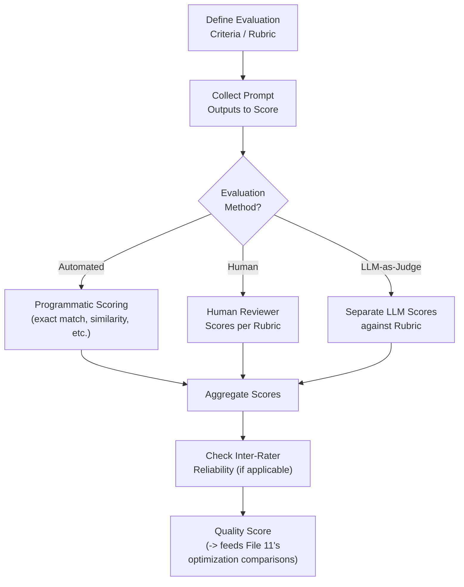
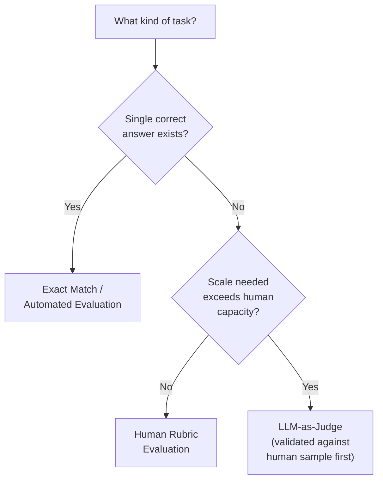
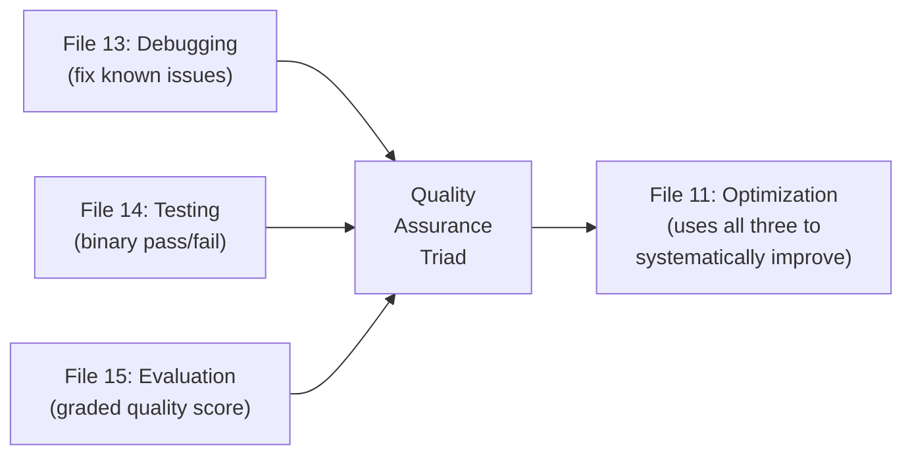

# 15 — Prompt Evaluation

> **Series:** Prompt Engineering Knowledge Library
> **File 15 of 60** | **Level:** Intermediate → Advanced
> **Prerequisites:** [`14_Prompt_Testing.md`](./14_Prompt_Testing.md)
> **Next:** [`16_Prompt_Iteration.md`](./16_Prompt_Iteration.md)

---

## Table of Contents

1. [Definition](#definition)
2. [Why It Matters](#why-it-matters)
3. [Core Concepts](#core-concepts)
4. [How It Works](#how-it-works)
5. [Internal Mechanism](#internal-mechanism)
6. [Types of Evaluation](#types-of-evaluation)
7. [Syntax / Structure](#syntax--structure)
8. [Examples (Simple → Advanced)](#examples-simple--advanced)
9. [Best Practices](#best-practices)
10. [Common Mistakes](#common-mistakes)
11. [Real-World Applications](#real-world-applications)
12. [Comparison with Related Concepts](#comparison-with-related-concepts)
13. [Advantages & Limitations](#advantages--limitations)
14. [FAQs](#faqs)
15. [Summary](#summary)
16. [Cheat Sheet](#cheat-sheet)
17. [Glossary](#glossary)
18. [References](#references)
19. [Visual Diagram Gallery](#visual-diagram-gallery)

---

## Definition

**Prompt Evaluation** is the practice of scoring a prompt's output quality against defined criteria — using metrics, rubrics, or a combination of automated and human judgment — to produce a continuous or graded quality assessment, rather than [File 14 — Prompt Testing](./14_Prompt_Testing.md)'s more binary pass/fail check against specific cases. Where testing asks "does this specific case work correctly, yes or no?", evaluation asks "*how good*, overall, is this prompt's output quality, and by how much?"

> Testing and evaluation are closely related and often implemented together in practice — but evaluation's continuous, rubric-based scoring is what makes [File 11 — Prompt Optimization](./11_Prompt_Optimization.md)'s nuanced, multi-metric comparisons possible, beyond simple pass/fail counts.

---

## Why It Matters

- **Many real-world tasks don't have a single "correct" output.** Summarization, creative writing, and open-ended reasoning tasks need graded quality assessment, not binary pass/fail — evaluation provides the methodology for this.
- **It provides the objective grounding optimization requires.** [File 11](./11_Prompt_Optimization.md)'s entire comparative methodology depends on having a reliable, consistent way to score outputs — this file covers how.
- **It surfaces quality dimensions that simple correctness checks miss** — tone, helpfulness, safety, coherence — through structured rubrics designed to capture these harder-to-quantify qualities.
- **It supports accountability and continuous improvement** at scale, providing the measurement infrastructure that makes tracking quality trends over time (connecting to [File 7 — Prompt Lifecycle](./07_Prompt_Lifecycle.md)'s monitoring stage) possible at all.

---

## Core Concepts

| Concept | Definition |
|---|---|
| **Rubric** | A structured set of criteria and scoring guidelines used to judge output quality |
| **Automated Evaluation** | Scoring performed programmatically, without direct human judgment per-instance |
| **Human Evaluation** | Scoring performed by human reviewers, often for qualities resistant to automation |
| **LLM-as-Judge** | Using a separate LLM call to score another model's output against defined criteria |
| **Inter-Rater Reliability** | The degree to which different evaluators (human or automated) agree on scores |
| **Benchmark** | A standardized, shared evaluation task/dataset used for broad comparison |

---

## How It Works



Evaluation methodology explicitly branches based on what's being measured: purely factual, deterministic tasks (does the extracted number match?) support fast, cheap automated evaluation; open-ended, qualitative tasks (is this response appropriately empathetic?) more often require human judgment or, increasingly, a carefully validated LLM-as-judge approach as a scalable proxy for human judgment.

---

## Internal Mechanism

### Why LLM-as-judge works, and where it can fail

LLM-as-judge — using a separate model call to score outputs against a rubric — has become a popular scalable alternative to pure human evaluation, and it works reasonably well for a specific mechanical reason: evaluating whether a response meets stated criteria is often a genuinely *easier* task for a language model than *generating* a high-quality response in the first place (recognition versus generation asymmetry, loosely echoing this file's Advantages section). However, this approach carries a known failure mode worth explicit caution: LLM judges can exhibit systematic biases, such as favoring longer responses regardless of actual quality, or being influenced by superficial stylistic polish rather than substantive correctness. Because of this, rigorous evaluation practice typically validates an LLM-as-judge setup against a smaller set of human-scored examples first, confirming reasonable agreement, before trusting it to scale evaluation broadly — treating it as a calibrated tool, not an infallible oracle.

### Why inter-rater reliability matters even for automated evaluation

It's tempting to assume automated, programmatic scoring is inherently "objective" and doesn't need the same reliability scrutiny as human evaluation. This isn't quite right: an automated metric is only as good as its underlying design, and a poorly designed automated metric (for instance, exact-string-match scoring applied to a task where paraphrased-but-correct answers should count as valid) can produce consistently *wrong* scores — consistent, but consistently misleading. Checking whether an automated evaluation method's judgments align with human judgment on a sample of cases (essentially a form of inter-rater reliability check between the automated method and human ground truth) is therefore a necessary validation step even for supposedly "objective" automated scoring, not a formality that only applies to subjective human evaluation.

---

## Types of Evaluation

| Type | Description | Best Suited For |
|---|---|---|
| **Exact Match Evaluation** | Output must precisely match an expected answer | Deterministic tasks (classification, structured extraction) |
| **Similarity-Based Evaluation** | Scores based on semantic/textual similarity to a reference | Tasks with acceptable variation in exact phrasing |
| **Rubric-Based Human Evaluation** | Human reviewers score against defined criteria | Open-ended, qualitative tasks (tone, helpfulness, creativity) |
| **LLM-as-Judge Evaluation** | A separate LLM scores output against a rubric | Scalable proxy for human judgment, once validated |
| **Benchmark Evaluation** | Scoring against a standardized, shared task/dataset | Cross-model or cross-version broad comparison |
| **Safety/Harm Evaluation** | Scoring specifically for policy compliance, harmful content absence | High-stakes or safety-sensitive applications |

---

## Syntax / Structure

A rubric is the central structural artifact of evaluation practice:

```yaml
# Example: a rubric for evaluating customer support responses
rubric: customer_support_response_quality
criteria:
  - name: accuracy
    description: "Response is factually correct per the 
                  provided policy documents"
    scale: "0 (incorrect) to 2 (fully accurate)"
  - name: empathy
    description: "Response acknowledges the customer's 
                  situation appropriately"
    scale: "0 (dismissive) to 2 (genuinely empathetic)"
  - name: actionability
    description: "Response gives the customer a clear next step"
    scale: "0 (no clear step) to 2 (clear, specific next step)"
  - name: conciseness
    description: "Response is appropriately brief, no padding"
    scale: "0 (bloated) to 2 (appropriately concise)"
scoring: "Sum of all criteria; max score 8"
passing_threshold: 6
```

---

## Examples (Simple → Advanced)

**Level 1 — Simple exact-match evaluation:**
```text
Task: Extract the invoice total from this document.
Expected: "$1,240.00"
Output: "$1,240.00"
Score: Match (1/1)
```

**Level 2 — Similarity-based evaluation for a paraphrase-tolerant task:**
```text
Task: Summarize this paragraph in one sentence.
Reference summary: "The company reported strong Q3 earnings 
driven by international sales growth."
Output: "Strong international sales growth drove the company's 
solid Q3 results."
Score: High semantic similarity — acceptable, despite different 
exact wording.
```

**Level 3 — Simple rubric-based human evaluation:**
```text
Task: Write a product description.
Output: [description text]
Rubric scoring:
  Clarity: 2/2
  Persuasiveness: 1/2 (a bit generic)
  Accuracy: 2/2
  Total: 5/6
```

**Level 4 — LLM-as-judge, validated against human scores:**
```text
1. 20 outputs scored by both a human rater and an LLM-as-judge 
   using the same rubric.
2. Agreement check: LLM judge scores match human scores within 
   1 point on 18/20 cases (90% agreement) — deemed acceptable 
   for scaling.
3. LLM-as-judge now used to score the remaining 500 production 
   outputs at scale, with periodic human spot-checks maintained 
   as an ongoing calibration check.
```

**Level 5 — Multi-dimensional evaluation feeding into optimization:**
```text
Prompt v2.0 evaluated across 100 test cases:
  Accuracy (rubric):     avg 1.8/2.0
  Empathy (rubric):      avg 1.5/2.0
  Actionability (rubric): avg 1.9/2.0
  Format Compliance (automated): 98/100 valid JSON

Prompt v2.1 (revised for empathy) evaluated on SAME 100 cases:
  Accuracy:     avg 1.8/2.0 (unchanged)
  Empathy:      avg 1.9/2.0 (+0.4 — clear improvement)
  Actionability: avg 1.9/2.0 (unchanged)
  Format Compliance: 97/100 (-1, within noise)

Decision (feeding directly into File 11's optimization process): 
v2.1 adopted — clear, targeted empathy improvement with no 
meaningful cost elsewhere.
```

---

## Best Practices

1. **Define the rubric or scoring criteria before collecting outputs to evaluate**, not after — retroactive criteria selection risks unconsciously favoring a preferred outcome.
2. **Match evaluation method to task type** — deterministic tasks support cheap automated evaluation; open-ended tasks generally need human judgment or a carefully validated LLM-as-judge proxy.
3. **Validate LLM-as-judge against human judgment on a sample** before trusting it to scale, given known biases like length preference.
4. **Check inter-rater reliability**, even for automated methods, rather than assuming consistency implies correctness.
5. **Use evaluation results to inform, not replace, human decision-making** — a quality score is an input to a decision, not a fully automatic verdict, especially for high-stakes prompts.

---

## Common Mistakes

| Mistake | Consequence | Fix |
|---|---|---|
| Using exact-match evaluation on tasks with legitimate output variation | Penalizing correct-but-differently-phrased outputs | Use similarity-based or rubric-based evaluation for tasks tolerating paraphrase |
| Trusting LLM-as-judge without validating against human judgment first | Unnoticed systematic biases (e.g., favoring longer responses) skew results | Validate on a human-scored sample before scaling |
| Vague, subjective rubric criteria ("is it good?") | Inconsistent scoring, low inter-rater reliability | Write concrete, checkable rubric criteria with defined scales |
| Evaluating only a single dimension (e.g., only accuracy) | Missing important quality dimensions like tone or safety | Use multi-dimensional rubrics covering all relevant quality aspects |
| Treating a single evaluation run as final and permanent | Missing quality drift as the prompt, model, or usage evolves | Re-evaluate periodically as part of ongoing lifecycle monitoring ([File 7](./07_Prompt_Lifecycle.md)) |

---

## Real-World Applications

- **Model and prompt comparison at scale** — evaluation infrastructure is what makes rigorous, large-scale comparison of different prompts or underlying models practically feasible.
- **Quality dashboards for production systems** — ongoing evaluation scores feeding into monitoring dashboards, directly supporting [File 7](./07_Prompt_Lifecycle.md)'s standing monitoring stage.
- **Research and academic benchmarking** — standardized evaluation benchmarks are central to how the broader field measures and compares model/technique progress.
- **Responsible AI and safety review** — safety-focused evaluation rubrics are a core practical tool for assessing whether a system meets defined harm-avoidance standards before deployment.

---

## Comparison with Related Concepts

| Concept | Difference from "Prompt Evaluation" |
|---|---|
| **Prompt Testing (File 14)** | Testing is typically binary (pass/fail) against specific defined cases; evaluation is typically continuous/graded (a quality score), often across a rubric with multiple dimensions — closely related and often used together |
| **Prompt Optimization (File 11)** | Optimization is the *process* of comparing candidates to select improvements; evaluation is the *measurement methodology* optimization relies on to actually score each candidate |
| **Response Validation (File 30)** | Validation is typically automated, real-time, per-response checking (does this specific output meet a schema/safety bar right now?) in a live system; evaluation is more often a broader, often offline or periodic, quality-assessment process across many outputs |

---

## Advantages & Limitations

### ✅ Advantages of Structured Evaluation

- **Enables graded, nuanced quality assessment** for tasks without a single "correct" answer.
- **Provides the objective grounding** that rigorous optimization ([File 11](./11_Prompt_Optimization.md)) depends on.
- **Surfaces quality dimensions** (tone, safety, helpfulness) that simple correctness checks would miss entirely.

### ⚠️ Limitations

- **Human evaluation doesn't scale cheaply**, creating real practical tension for large-scale, ongoing evaluation needs.
- **LLM-as-judge carries known bias risks** (length preference, stylistic polish over substance) that require active validation and monitoring, not blind trust.
- **Rubric design itself requires skill and iteration** — a poorly designed rubric can produce consistent but ultimately misleading scores, echoing the Internal Mechanism section's caution.

---

## FAQs

**Q: When should I use human evaluation versus LLM-as-judge?**
A: Human evaluation is generally preferred for the highest-stakes decisions or when validating a new evaluation approach for the first time; LLM-as-judge is valuable once validated, for scaling evaluation to volumes human review can't practically cover.

**Q: How is a "rubric" different from the "pass/fail criteria" used in testing (File 14)?**
A: Pass/fail criteria are typically binary and case-specific; a rubric usually defines multiple graded dimensions (e.g., 0-2 scale across several criteria) producing a richer, more nuanced quality signal than a single pass/fail judgment.

**Q: Can automated evaluation fully replace human evaluation?**
A: Not entirely, especially for genuinely open-ended or high-stakes qualitative judgments — but automated and LLM-as-judge methods, once properly validated, can substantially reduce how much human evaluation volume is needed, reserving human judgment for spot-checks, validation, and the highest-stakes cases.

**Q: What's a reasonable inter-rater reliability standard to aim for?**
A: There's no single universal number — a practical approach is defining what's "close enough" agreement for a specific task's stakes, then measuring whether your evaluation method actually achieves it, rather than assuming reliability without checking.

---

## Summary

Prompt Evaluation is the practice of scoring output quality against defined rubrics or metrics — via automated methods for deterministic tasks, human review for genuinely qualitative judgments, or LLM-as-judge as a validated, scalable proxy — providing the graded, nuanced quality assessment that binary pass/fail testing ([File 14](./14_Prompt_Testing.md)) alone cannot. This evaluation methodology is the essential measurement infrastructure underlying [File 11](./11_Prompt_Optimization.md)'s rigorous optimization process, and requires its own internal rigor — validating LLM-as-judge against human judgment, checking inter-rater reliability even for automated methods — to avoid producing consistent but misleading scores. Having now covered debugging, testing, and evaluation as the library's core quality-assurance triad, the discussion turns to how these activities combine into an ongoing, cyclical improvement process over a prompt's full working life: [File 16 — Prompt Iteration](./16_Prompt_Iteration.md).

---

## Cheat Sheet

```text
PROMPT EVALUATION — QUICK REFERENCE

METHOD SELECTION
Deterministic task     -> Automated (exact match / similarity)
Open-ended, qualitative -> Human evaluation, or validated 
                            LLM-as-judge

RUBRIC ESSENTIALS
[ ] Multiple concrete, checkable criteria (not "is it good?")
[ ] Defined numeric/graded scale per criterion
[ ] Defined aggregation method (sum, average, weighted)

VALIDATION RULE: Before trusting LLM-as-judge at scale, validate 
its scores against a human-scored sample first.

KNOWN LLM-JUDGE BIAS RISKS: length preference, stylistic 
polish over substance — watch for these specifically.
```

---

## Glossary

| Term | Definition |
|---|---|
| **Rubric** | A structured set of criteria and scoring guidelines |
| **Automated Evaluation** | Programmatic scoring without per-instance human judgment |
| **Human Evaluation** | Scoring performed directly by human reviewers |
| **LLM-as-Judge** | Using a separate LLM call to score output against criteria |
| **Inter-Rater Reliability** | Degree of agreement between different evaluators |
| **Benchmark** | A standardized, shared evaluation task/dataset |

---

## References

- Zheng, L. et al. (2023) — *Judging LLM-as-a-Judge with MT-Bench and Chatbot Arena*, arXiv:2306.05685
- Liang, P. et al. (2022) — *Holistic Evaluation of Language Models (HELM)*, arXiv:2211.09110
- Anthropic — [Empirical Evaluation Guidance](https://docs.claude.com/en/docs/build-with-claude/prompt-engineering/overview)
- Chiang, C. & Lee, H. (2023) — *Can Large Language Models Be an Alternative to Human Evaluations?*, arXiv:2305.01937

---

## Visual Diagram Gallery

**Diagram 1 — Evaluation Method Selection Tree**


**Diagram 2 — The LLM-as-Judge Validation Loop**
```text
┌──────────────────┐
│ Human-scored      │
│ sample (e.g. n=20) │
└─────────┬─────────┘
          v
┌──────────────────┐      ┌────────────────┐
│ LLM-as-judge      │ ---> │ Compare scores  │
│ scores same sample │      │ (agreement %)   │
└──────────────────┘      └────────┬───────┘
                                    v
                          ┌──────────────────┐
                          │ Acceptable?        │
                          │ Yes -> scale up     │
                          │ No -> revise rubric │
                          │       or judge prompt│
                          └──────────────────┘
```

**Diagram 3 — Evaluation's Place in the Quality Triad**


---

**⬅️ Previous:** [`14_Prompt_Testing.md`](./14_Prompt_Testing.md)
**➡️ Next:** [`16_Prompt_Iteration.md`](./16_Prompt_Iteration.md) — The ongoing cyclical process connecting testing, refinement, and versioning over time.
