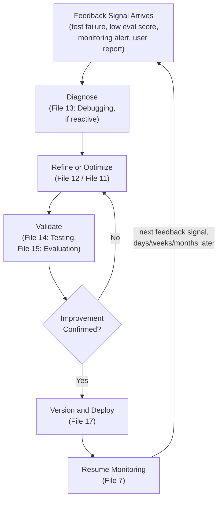
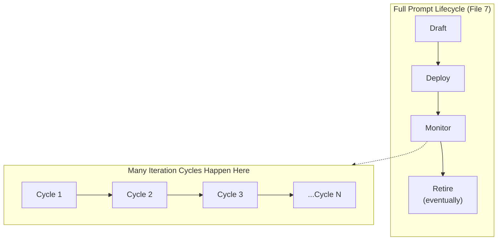
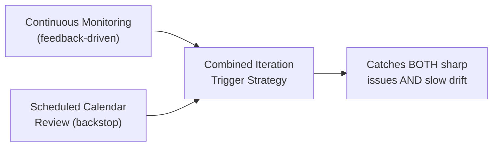

# 16 — Prompt Iteration

> **Series:** Prompt Engineering Knowledge Library
> **File 16 of 60** | **Level:** Intermediate
> **Prerequisites:** [`15_Prompt_Evaluation.md`](./15_Prompt_Evaluation.md)
> **Next:** [`17_Prompt_Versioning.md`](./17_Prompt_Versioning.md)

---

## Table of Contents

1. [Definition](#definition)
2. [Why It Matters](#why-it-matters)
3. [Core Concepts](#core-concepts)
4. [How It Works](#how-it-works)
5. [Internal Mechanism](#internal-mechanism)
6. [Types of Iteration Cycles](#types-of-iteration-cycles)
7. [Syntax / Structure](#syntax--structure)
8. [Examples (Simple → Advanced)](#examples-simple--advanced)
9. [Best Practices](#best-practices)
10. [Common Mistakes](#common-mistakes)
11. [Real-World Applications](#real-world-applications)
12. [Comparison with Related Concepts](#comparison-with-related-concepts)
13. [Advantages & Limitations](#advantages--limitations)
14. [FAQs](#faqs)
15. [Summary](#summary)
16. [Cheat Sheet](#cheat-sheet)
17. [Glossary](#glossary)
18. [References](#references)
19. [Visual Diagram Gallery](#visual-diagram-gallery)

---

## Definition

**Prompt Iteration** is the general, higher-level cyclical process that connects testing ([File 14](./14_Prompt_Testing.md)), refinement ([File 12](./12_Prompt_Refinement.md)), and versioning ([File 17](./17_Prompt_Versioning.md)) into a single, ongoing improvement loop that spans a prompt's *entire* working life — not a single working session ([File 8 — Prompt Workflow](./08_Prompt_Workflow.md)), and not a single rigorous optimization experiment ([File 11](./11_Prompt_Optimization.md)), but the broader, sustained rhythm of repeated cycles that a prompt undergoes across weeks, months, or years of active use.

> Where [File 7 — Prompt Lifecycle](./07_Prompt_Lifecycle.md) maps the full *stages* a prompt exists across (draft, test, deploy, monitor, retire), Iteration is specifically about the *cyclical, repeating nature* of the middle of that lifecycle — the loop that runs many times between initial deployment and eventual retirement.

---

## Why It Matters

- **It's the mechanism by which prompts actually improve over time.** No single drafting session, however careful, produces a permanently optimal prompt — sustained quality comes from repeated, disciplined cycles of feedback and adjustment.
- **It unifies previously separate library concepts into one coherent practice.** Testing, evaluation, refinement, and versioning can each be understood in isolation, but iteration is where they combine into the actual, ongoing rhythm of real prompt engineering work.
- **It provides a check against both stagnation and thrashing.** Good iterative practice avoids both extremes: never revisiting a prompt (stagnation, risking the degradation discussed in [File 7](./07_Prompt_Lifecycle.md)) and constantly, unsystematically changing it (thrashing, without the discipline optimization and versioning provide).
- **It directly enables long-term compounding quality gains** — each disciplined cycle, however small, builds on the last, mirroring how the compounding-cost logic from [File 3](./03_Why_Prompts_Matter.md) works in the positive direction when iteration is done well.

---

## Core Concepts

| Concept | Definition |
|---|---|
| **Iteration Cycle** | One complete pass through observe-adjust-validate, at whatever cadence a prompt operates |
| **Feedback Signal** | Any information (test failure, evaluation score, user complaint, monitoring alert) that triggers or informs an iteration |
| **Cumulative Improvement** | The compounding benefit of many small, disciplined iterative cycles over time |
| **Iteration Cadence** | How frequently a prompt is deliberately revisited for potential iteration |
| **Convergence** | The point at which further iteration yields diminishing or negligible improvement |
| **Drift-Triggered Iteration** | Iteration prompted specifically by detected real-world input or requirement drift ([File 7](./07_Prompt_Lifecycle.md)) |

---

## How It Works



The critical feature distinguishing this diagram from [File 7](./07_Prompt_Lifecycle.md)'s broader lifecycle diagram is *repetition frequency and triggering* — this exact loop can run dozens or hundreds of times over a prompt's working life, each time triggered by some specific feedback signal, each time drawing on the specific techniques (debugging, refinement, optimization, testing, evaluation, versioning) covered in the library's preceding files as needed for that particular cycle.

---

## Internal Mechanism

### Why iteration cadence should be feedback-driven, not purely calendar-driven

A common organizational question is "how often should we revisit this prompt?" — and while some baseline calendar cadence (e.g., a quarterly review) has genuine value as a backstop, the most valuable iterations are typically triggered by specific feedback signals rather than the calendar alone. This is because a feedback signal (a failing test, a dropping evaluation score, a monitoring alert) carries concrete, actionable information about *what specifically* needs attention, whereas a purely calendar-triggered review must first spend effort rediscovering whether anything needs attention at all. Mature iterative practice therefore typically combines both: continuous, automated feedback-signal monitoring for prompt cycles that matter most, backstopped by a periodic calendar-based review to catch anything that continuous monitoring might have missed (particularly slow, gradual drift that no single sharp signal flags).

### Why iterative improvement shows diminishing returns, and why that's not a failure

An important, realistic expectation to set: the rate of quality improvement per iteration cycle is not constant — early cycles on a new prompt often yield large, visible gains (fixing obvious gaps), while later cycles on an already-well-refined prompt tend to yield progressively smaller improvements, a pattern sometimes described as *convergence*. This isn't a sign that the iterative process is failing; it's an expected, normal pattern, directly analogous to diminishing returns observed broadly in iterative improvement processes across many disciplines. Recognizing this pattern helps set realistic expectations for later-stage iteration efforts and informs the decision of when further iteration investment is no longer worth its cost relative to other priorities — itself echoing the stakes-calibration principle from [File 3](./03_Why_Prompts_Matter.md).

---

## Types of Iteration Cycles

| Cycle Type | Typical Trigger | Typical Cadence |
|---|---|---|
| **Reactive Iteration** | A specific observed failure (debugging-driven) | As-needed, immediate |
| **Scheduled Review Iteration** | Calendar-based, periodic check regardless of alerts | Weekly, monthly, or quarterly, depending on stakes |
| **Metric-Driven Iteration** | A tracked evaluation/optimization metric crosses a defined threshold | Triggered by monitoring dashboards |
| **Drift-Triggered Iteration** | Detected shift in real-world input patterns or requirements | Triggered by monitoring analysis |
| **Opportunistic Iteration** | A new technique or model capability becomes available, prompting a revisit | As new developments arise |

---

## Syntax / Structure

Iteration history is typically documented as a running log, distinct from (but closely linked to) the formal version history covered in [File 17](./17_Prompt_Versioning.md):

```yaml
# Example: an iteration history log
prompt: customer_support_triage
iteration_log:
  - date: 2026-02-01
    trigger: "Scheduled monthly review"
    finding: "No significant issues found"
    action: "No change"
  - date: 2026-03-15
    trigger: "Evaluation score dropped 4 points 
              (File 15 monitoring)"
    finding: "New product category launched; prompt's category 
              list was outdated"
    action: "Updated category list -> v2.4"
  - date: 2026-04-02
    trigger: "User-reported failure (debugging, File 13)"
    finding: "Edge case: multi-issue tickets sometimes 
              mis-categorized"
    action: "Added handling instruction for multi-issue 
             tickets -> v2.5"
```

---

## Examples (Simple → Advanced)

**Level 1 — Simple single iteration:**
```text
Cycle 1: Prompt works well for typical inputs.
Feedback: A user reports it fails on very short inputs.
Action: Add explicit handling for short/empty input -> done.
```

**Level 2 — Two sequential cycles:**
```text
Cycle 1: Fixed short-input handling (as above).
Cycle 2 (2 weeks later): Evaluation reveals tone is sometimes 
too formal for the intended casual audience.
Action: Refine tone guidance -> re-evaluate -> confirmed improved.
```

**Level 3 — Combining scheduled and reactive triggers:**
```text
Scheduled monthly review: No issues found, no change needed.
[3 weeks later] Reactive: Monitoring alert - format compliance 
dropped from 99% to 91%.
Investigation (File 13): A recent minor prompt edit for an 
unrelated reason had accidentally weakened the format instruction.
Action: Restored clear format instruction -> compliance back to 99%.
```

**Level 4 — Drift-triggered iteration:**
```text
Monitoring detects: the distribution of support ticket topics 
has shifted significantly over 3 months (new product line 
launched, driving a new category of questions the original 
test set never covered).
Action: New test cases added (File 14) reflecting the new 
topic distribution; prompt refined to explicitly handle the 
new category; re-evaluated and versioned.
```

**Level 5 — Long-running iteration history showing convergence:**
```text
v1.0 -> v1.1: Accuracy 74% -> 85% (large gain, obvious gaps fixed)
v1.1 -> v1.2: Accuracy 85% -> 90% (solid gain, edge cases addressed)
v1.2 -> v1.3: Accuracy 90% -> 92% (smaller gain)
v1.3 -> v1.4: Accuracy 92% -> 92.3% (marginal gain)
v1.4 -> v1.5: Accuracy 92.3% -> 92.4% (negligible gain)

Team decision: Diminishing returns clearly visible -> further 
accuracy-focused iteration deprioritized in favor of addressing 
a different tracked metric (latency), consistent with the 
convergence pattern discussed in the Internal Mechanism section.
```

---

## Best Practices

1. **Combine feedback-driven and scheduled iteration triggers** — don't rely purely on either continuous monitoring alerts or purely on a calendar; each catches issues the other might miss.
2. **Keep a running iteration log**, distinct from formal version history, to preserve institutional memory of *why* each cycle happened, not just *what* changed.
3. **Expect and plan for diminishing returns** as a prompt matures — recognize convergence and reallocate iteration effort to genuinely higher-value areas rather than over-investing in a fully converged metric.
4. **Ensure every iteration cycle closes the loop through validation** (testing/evaluation) before considering it complete — an unvalidated change is not a completed iteration.
5. **Connect iteration cadence to actual stakes** ([File 3](./03_Why_Prompts_Matter.md)) — high-stakes prompts warrant tighter feedback loops and more frequent scheduled reviews than low-stakes ones.

---

## Common Mistakes

| Mistake | Consequence | Fix |
|---|---|---|
| Relying only on scheduled reviews, no continuous feedback monitoring | Slow response to sudden, sharp issues between review cycles | Combine both scheduled and feedback-driven triggers |
| Relying only on reactive/feedback triggers, no scheduled backstop | Slow, gradual drift goes unnoticed since no sharp signal ever fires | Maintain a periodic scheduled review as backstop |
| Continuing to heavily invest in a converged metric | Wasted effort for negligible additional gain | Recognize diminishing returns and reallocate effort |
| Making changes without closing the loop through validation | Unvalidated changes deployed, risking regressions | Always validate (testing/evaluation) before considering a cycle complete |
| No iteration log kept | Lost institutional memory of why past changes were made | Maintain a running iteration log alongside formal version history |

---

## Real-World Applications

- **Long-running production AI features** — nearly all mature, sustained AI products undergo exactly this kind of ongoing iterative cycle over their operational life.
- **Quarterly business reviews of AI system performance** — a common organizational cadence combining scheduled review with accumulated feedback-driven findings from the preceding period.
- **Post-launch monitoring and improvement programs** — the standard operating pattern for any team responsible for an AI feature's ongoing quality after initial launch.
- **Competitive response iteration** — teams often iterate specifically in response to competitor capability changes or new model releases (an opportunistic iteration trigger).

---

## Comparison with Related Concepts

| Concept | Difference from "Prompt Iteration" |
|---|---|
| **Prompt Lifecycle (File 7)** | Lifecycle maps the full *stages* a prompt exists across, start to end; iteration is specifically the *repeating cyclical pattern* that occurs many times during the lifecycle's middle, ongoing phase |
| **Prompt Workflow (File 8)** | Workflow is the tactical process *within one single working session*; iteration is the broader pattern connecting *many separate sessions and cycles* over a much longer time span |
| **Prompt Optimization (File 11)** | Optimization is one specific, rigorous *type* of activity that might occur within a given iteration cycle; iteration is the general, higher-level cyclical umbrella that optimization (along with refinement, testing, etc.) operates within |

---

## Advantages & Limitations

### ✅ Advantages of Disciplined Iteration

- **Is the actual mechanism producing sustained, long-term quality improvement**, rather than a one-time drafting effort.
- **Unifies multiple library concepts into one coherent, practical rhythm** rather than leaving them as disconnected techniques.
- **Provides a structured middle ground** between harmful stagnation and unsystematic thrashing.

### ⚠️ Limitations

- **Requires sustained organizational commitment** — iteration only works if resourced consistently over time, not treated as a one-time launch activity.
- **Diminishing returns are real and must be actively recognized** — indefinite iteration investment on an already-converged metric is genuinely wasteful.
- **Feedback signals themselves can be noisy or misleading** — not every fluctuation warrants a full iteration cycle; distinguishing genuine signal from noise (echoing [File 11](./11_Prompt_Optimization.md)'s statistical-significance discussion) remains necessary.

---

## FAQs

**Q: How is "iteration" different from just "making changes to a prompt over time"?**
A: The key difference is discipline and structure — genuine iteration follows the observe-diagnose-adjust-validate loop, closing each cycle through proper validation, rather than making ad hoc, unvalidated changes whenever the mood strikes.

**Q: How do I know when a prompt has "converged" and further iteration isn't worth it?**
A: A practical signal, shown in the Level 5 example, is tracking the metric improvement per cycle over time — when successive cycles yield consistently negligible gains relative to the effort invested, that's a strong convergence signal worth acting on.

**Q: Should every single small change to a prompt count as a full "iteration cycle"?**
A: Not necessarily formally, but even small changes benefit from at minimum a lightweight version of the loop (some validation before considering it done) — the formality of documentation and process should scale with the stakes and significance of the change, consistent with this library's general stakes-calibration principle.

**Q: What's the relationship between iteration and the "monitoring" stage from File 7's lifecycle?**
A: Monitoring is what generates many of iteration's feedback signals — the two are tightly coupled: effective ongoing monitoring is largely what makes feedback-driven iteration (as opposed to purely calendar-driven) possible at all.

---

## Summary

Prompt Iteration is the disciplined, ongoing cyclical process — observe a feedback signal, diagnose, refine or optimize, validate, version and deploy, resume monitoring — that connects testing, refinement, evaluation, and versioning into the sustained rhythm actually responsible for improving prompt quality over a prompt's entire working life. Effective iteration combines both feedback-driven triggers (fast response to specific signals) and scheduled reviews (a backstop against slow, gradual drift that no sharp signal flags), while realistically expecting and planning for diminishing returns as a prompt matures toward convergence. Having established this unifying cyclical practice, the library turns to the specific record-keeping discipline that supports it — tracking exactly what changed, when, and why — in [File 17 — Prompt Versioning](./17_Prompt_Versioning.md).

---

## Cheat Sheet

```text
PROMPT ITERATION — QUICK REFERENCE

THE ITERATION LOOP
Feedback Signal -> Diagnose -> Refine/Optimize -> Validate -> 
Version & Deploy -> Resume Monitoring -> (repeat)

TRIGGER TYPES (use BOTH, not just one)
Reactive       -> a specific observed failure
Scheduled      -> calendar-based backstop review
Metric-Driven  -> tracked score crosses a threshold
Drift-Triggered -> detected shift in real-world patterns

EXPECT DIMINISHING RETURNS
Early cycles: large gains (obvious gaps)
Later cycles: progressively smaller gains (convergence)
-> This is NORMAL, not a sign of failure — reallocate effort 
   to higher-value areas once converged.
```

---

## Glossary

| Term | Definition |
|---|---|
| **Iteration Cycle** | One complete observe-adjust-validate pass |
| **Feedback Signal** | Information that triggers or informs an iteration |
| **Cumulative Improvement** | The compounding benefit of many disciplined cycles |
| **Iteration Cadence** | How frequently a prompt is deliberately revisited |
| **Convergence** | The point where further iteration yields negligible gains |
| **Drift-Triggered Iteration** | Iteration prompted by detected real-world drift |

---

## References

- Anthropic — [Prompt Engineering Overview](https://docs.claude.com/en/docs/build-with-claude/prompt-engineering/overview)
- Beck, K. et al. (2001) — *Manifesto for Agile Software Development* (iterative cycle parallels)
- Sculley, D. et al. (2015) — *Hidden Technical Debt in Machine Learning Systems*, NeurIPS 2015
- Amershi, S. et al. (2019) — *Software Engineering for Machine Learning: A Case Study*, ICSE-SEIP 2019

---

## Visual Diagram Gallery

**Diagram 1 — Iteration Nested Within the Broader Lifecycle**


**Diagram 2 — The Diminishing Returns Curve**
```text
Quality/Accuracy Gain per Cycle
      ^
      |  *
      |    *
      |       *
      |           *
      |               *  *  *  *  (convergence — 
      |                            diminishing returns)
      +----------------------------------> Iteration Cycle Number
```

**Diagram 3 — Combining Trigger Types**


---

**⬅️ Previous:** [`15_Prompt_Evaluation.md`](./15_Prompt_Evaluation.md)
**➡️ Next:** [`17_Prompt_Versioning.md`](./17_Prompt_Versioning.md) — The record-keeping discipline tracking what changed, when, and why.
