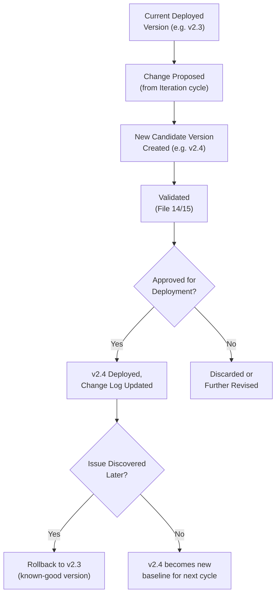
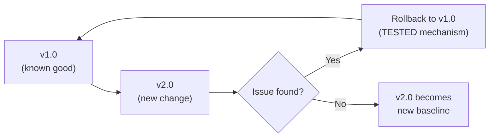
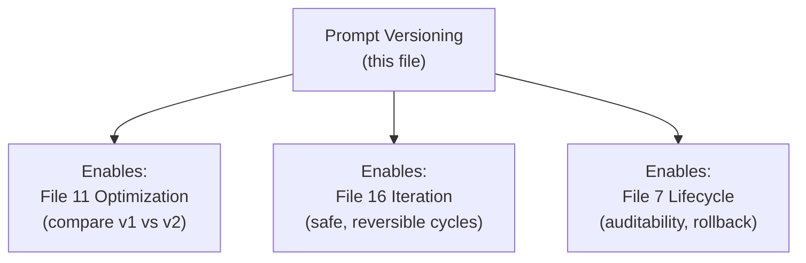

# 17 — Prompt Versioning

> **Series:** Prompt Engineering Knowledge Library
> **File 17 of 60** | **Level:** Intermediate
> **Prerequisites:** [`16_Prompt_Iteration.md`](./16_Prompt_Iteration.md)
> **Next:** [`18_Prompt_Templates.md`](./18_Prompt_Templates.md)

---

## Table of Contents

1. [Definition](#definition)
2. [Why It Matters](#why-it-matters)
3. [Core Concepts](#core-concepts)
4. [How It Works](#how-it-works)
5. [Internal Mechanism](#internal-mechanism)
6. [Types of Versioning Systems](#types-of-versioning-systems)
7. [Syntax / Structure](#syntax--structure)
8. [Examples (Simple → Advanced)](#examples-simple--advanced)
9. [Best Practices](#best-practices)
10. [Common Mistakes](#common-mistakes)
11. [Real-World Applications](#real-world-applications)
12. [Comparison with Related Concepts](#comparison-with-related-concepts)
13. [Advantages & Limitations](#advantages--limitations)
14. [FAQs](#faqs)
15. [Summary](#summary)
16. [Cheat Sheet](#cheat-sheet)
17. [Glossary](#glossary)
18. [References](#references)
19. [Visual Diagram Gallery](#visual-diagram-gallery)

---

## Definition

**Prompt Versioning** is the disciplined practice of tracking, labeling, and preserving the history of a prompt's changes over time — recording exactly what changed, when, why, and by whom — enabling comparison, auditing, and rollback. It is the concrete record-keeping infrastructure that supports [File 16 — Prompt Iteration](./16_Prompt_Iteration.md)'s cyclical process and [File 11 — Prompt Optimization](./11_Prompt_Optimization.md)'s comparative methodology, both of which depend on being able to precisely identify and reference specific, distinct prompt states.

> Without versioning, a statement like "v2.1 improved empathy scores over v2.0" (as seen in [File 15](./15_Prompt_Evaluation.md)'s examples) would be meaningless — there would be no reliable way to know exactly what "v2.0" and "v2.1" actually contained, or to return to either one if needed.

---

## Why It Matters

- **It enables reliable rollback.** When an iteration or deployment introduces an unexpected regression, versioning is what makes it possible to quickly and confidently revert to a known-good prior state.
- **It supports rigorous comparison.** Every optimization experiment ([File 11](./11_Prompt_Optimization.md)) and evaluation comparison ([File 15](./15_Prompt_Evaluation.md)) implicitly depends on being able to precisely reference "this exact version" versus "that exact version."
- **It provides auditability**, increasingly important as AI governance and compliance requirements grow — being able to answer "what prompt was live on this date, and why was it changed since?" is often a genuine organizational or regulatory need.
- **It preserves institutional knowledge**, preventing the common, costly pattern of a team losing track of why a prompt looks the way it does, or accidentally reintroducing a bug that was already fixed and then lost track of.

---

## Core Concepts

| Concept | Definition |
|---|---|
| **Version Number** | A unique identifier (e.g., v2.1) distinguishing one prompt state from another |
| **Change Log** | A record documenting what changed, and why, between versions |
| **Rollback** | Reverting to a previously deployed, known-good version |
| **Diff** | A precise comparison showing exactly what differs between two versions |
| **Version History** | The complete, ordered sequence of all versions a prompt has passed through |
| **Semantic Versioning** | A structured numbering convention (major.minor.patch) conveying the significance of a change |

---

## How It Works



Versioning's core value proposition is precisely this: every deployed state is a distinct, precisely identifiable, and — critically — *recoverable* artifact. This transforms prompt changes from a one-way, potentially risky operation into a safely reversible one, directly supporting the confidence needed to iterate ([File 16](./16_Prompt_Iteration.md)) actively rather than cautiously avoiding changes for fear of unrecoverable mistakes.

---

## Internal Mechanism

### Why version numbers should convey meaning, not just sequence

A purely sequential versioning scheme (v1, v2, v3, ...) conveys *that* something changed, but not *how significant* the change was — a critical piece of information for anyone deciding whether to review a change carefully or trust it as routine. Semantic versioning conventions (major.minor.patch, e.g., v2.4.1) address this directly: a major version bump (v2 → v3) signals a substantial change in behavior or approach, warranting careful review; a patch bump (v2.4.0 → v2.4.1) signals a minor fix, typically low-risk. This convention, borrowed directly from software engineering practice, gives version numbers themselves diagnostic value beyond mere sequence-tracking — a team member can infer something meaningful about a change's likely scope just from the version number pattern, before even reading the change log.

### Why rollback must be tested and confirmed working, not merely assumed

A specific, easy-to-overlook risk: teams often assume rollback capability exists and works correctly simply because version history is being recorded — but recording history and having a *tested, reliable* rollback mechanism are not automatically the same thing. If a "previous version" is only preserved informally (e.g., in someone's memory, or scattered across chat messages) rather than in a system specifically designed to make retrieval and redeployment fast and reliable, "rollback" may in practice take much longer or be more error-prone than assumed during an actual incident — precisely the worst time to discover this. This is why mature versioning practice treats periodically testing the actual rollback mechanism (not just recording history) as a necessary, distinct verification step, analogous to how backup systems are only truly validated once a restore has actually been successfully tested.

---

## Types of Versioning Systems

| System | Description | Best Suited For |
|---|---|---|
| **Sequential Numbering** | Simple v1, v2, v3... incrementing | Low-stakes, informal personal use |
| **Semantic Versioning** | major.minor.patch (e.g., v2.4.1) conveying change significance | Team/production environments needing risk signaling |
| **Date-Based Versioning** | Versions labeled by date (e.g., 2026-03-15) | Contexts where chronology matters more than semantic significance |
| **Git-Based Versioning** | Full version control system (branches, commits, diffs) | Production engineering teams with existing software version control practices |
| **Named/Milestone Versioning** | Descriptive names for significant versions (e.g., "launch version," "post-incident-fix version") | Communicating significance to non-technical stakeholders |

---

## Syntax / Structure

A well-structured version record typically combines a clear identifier with a documented change log:

```yaml
# Example: a prompt version record
prompt_name: customer_support_triage
current_version: v2.5.1
version_history:
  - version: v1.0.0
    date: 2025-11-01
    change: "Initial deployment"
  - version: v2.0.0
    date: 2026-01-15
    change: "MAJOR: Restructured to XML-tagged anatomy (File 6) 
             for improved reliability"
    author: "team-lead"
  - version: v2.4.0
    date: 2026-03-15
    change: "MINOR: Updated product category list for new launch"
    author: "engineer-a"
  - version: v2.5.0
    date: 2026-04-02
    change: "MINOR: Added multi-issue ticket handling"
    author: "engineer-b"
  - version: v2.5.1
    date: 2026-04-10
    change: "PATCH: Fixed typo in constraint section, no 
             behavioral change intended"
    author: "engineer-b"
rollback_tested: "Confirmed working — successfully rolled back 
                   to v2.4.0 during a drill on 2026-03-20"
```

---

## Examples (Simple → Advanced)

**Level 1 — Simple sequential versioning:**
```text
v1: "Summarize this article in 3 bullet points."
v2: "Summarize this article in 3 bullet points, focusing on 
     key financial figures."
(Informal, but at least the two versions are clearly 
distinguished and both preserved.)
```

**Level 2 — Adding a basic change log:**
```text
v1 (2026-01-10): Initial version.
v2 (2026-01-15): Added focus on financial figures, after 
                 noticing v1 summaries were too general for 
                 the finance team's needs.
```

**Level 3 — Semantic versioning applied:**
```text
v1.0.0: Initial version.
v1.1.0 (MINOR): Added length constraint.
v1.1.1 (PATCH): Fixed a typo, no behavior change.
v2.0.0 (MAJOR): Completely restructured with XML anatomy 
                and few-shot examples — significant behavior change.
```

**Level 4 — Versioning with tested rollback:**
```text
Current: v2.0.0
Incident: v2.0.0 introduces an unexpected format compliance 
regression, discovered via monitoring (File 7).
Action: Rollback executed to v1.1.1 (last known-good version).
Rollback confirmed successful within 5 minutes — format 
compliance immediately restored to expected levels.
Post-incident: v2.0.0 investigated and fixed offline before 
re-attempting deployment as v2.0.1.
```

**Level 5 — Full production versioning with governance:**
```yaml
prompt: legal_document_classifier
version_control: git-based
current_production_version: v4.2.0 (commit: a1b2c3d)
approval_required_for: "MAJOR and MINOR changes"
patch_changes: "Can be deployed by author without separate approval"
rollback_drill_schedule: "Tested quarterly"
last_rollback_drill: "2026-06-01 — successful, 3 min recovery time"
audit_trail: "Full history available via git log, including 
              diffs for every change"
compliance_note: "Version history retained per legal document 
                   retention policy — 7 years minimum"
```

---

## Best Practices

1. **Use a versioning scheme that conveys meaning**, such as semantic versioning, once a prompt matters enough for team/production use — not just sequential numbering.
2. **Document *why* a change was made, not just *what* changed** — this context is invaluable for future maintainers trying to understand a prompt's evolution.
3. **Actually test the rollback mechanism periodically**, not just assume it works because history is recorded — treat this like testing a backup restore process.
4. **Scale versioning formality to stakes**, consistent with [File 3](./03_Why_Prompts_Matter.md) — a personal, low-stakes prompt doesn't need full git-based version control with approval workflows.
5. **Preserve full version history, not just the current state** — retaining prior versions (even ones no longer in use) supports both rollback and historical learning about what approaches were tried and why they were or weren't adopted.

---

## Common Mistakes

| Mistake | Consequence | Fix |
|---|---|---|
| Only keeping the current prompt version, discarding history | No rollback capability if a new version fails | Preserve full version history, not just the latest state |
| Using purely sequential numbering for significant, high-stakes prompts | No signal of change risk/significance to reviewers | Adopt semantic versioning to convey change scope |
| Recording history without ever testing actual rollback | False confidence in a rollback capability that may not work smoothly in practice | Periodically test the rollback mechanism directly |
| No documented reasoning for changes, only the change itself | Future maintainers can't understand why a prompt looks the way it does | Document the "why," not just the "what," for each version |
| Treating versioning formality as one-size-fits-all | Excessive overhead for low-stakes prompts, or insufficient rigor for high-stakes ones | Scale versioning practice to the prompt's actual stakes |

---

## Real-World Applications

- **Production LLM application engineering** — versioning is a standard, expected practice for any prompt treated as a genuine engineering artifact, directly connecting to [File 3](./03_Why_Prompts_Matter.md)'s framing.
- **Regulatory and compliance contexts** — industries with audit or retention requirements often mandate documented prompt version history as part of broader AI governance.
- **Incident response** — reliable, tested rollback capability is frequently the fastest, most effective immediate mitigation when a production prompt issue is discovered.
- **Collaborative team environments** — versioning with clear change logs is essential infrastructure for multiple people safely working on and understanding the same shared prompts over time.

---

## Comparison with Related Concepts

| Concept | Difference from "Prompt Versioning" |
|---|---|
| **Prompt Iteration (File 16)** | Iteration is the *ongoing cyclical process* of improvement; versioning is the *record-keeping mechanism* that makes each cycle's changes trackable, comparable, and reversible |
| **Prompt Lifecycle (File 7)** | Lifecycle is the full stage-based arc a prompt exists across; versioning is a specific supporting practice used throughout the deployment and monitoring stages of that lifecycle |
| **Prompt Templates (File 18)** | A template is a reusable *pattern* with variable slots; versioning tracks change history for any specific prompt (including a template's own evolution over time) — related but addressing different concerns |

---

## Advantages & Limitations

### ✅ Advantages of Disciplined Versioning

- **Enables confident, safe iteration** by making changes reversible rather than risky one-way operations.
- **Supports rigorous comparison** required by optimization and evaluation practices.
- **Provides auditability and preserved institutional knowledge**, valuable both for compliance and ordinary team continuity.

### ⚠️ Limitations

- **Carries genuine overhead**, particularly for elaborate versioning systems (approval workflows, formal change logs) — disproportionate for low-stakes, informal use.
- **Recording history alone doesn't guarantee reliable rollback** — as discussed in the Internal Mechanism section, the mechanism itself must be actively tested.
- **Versioning discipline requires sustained team buy-in** — like other lifecycle and iteration practices in this library, it degrades quickly if treated as optional busywork rather than genuine infrastructure.

---

## FAQs

**Q: Is formal versioning necessary for a personal, casual prompt I use for myself?**
A: Not typically — informal versioning (keeping a simple text file with dated entries, per Level 2 above) is usually proportionate; the more elaborate systems in this file's later examples are aimed at team/production contexts.

**Q: What's the difference between a "MAJOR" and "MINOR" change in semantic versioning for prompts?**
A: There's no universally fixed rule, but a reasonable convention (mirroring software practice) treats MAJOR as substantial behavioral change or restructuring (as in Level 3's v2.0.0 example) and MINOR as feature additions or meaningful adjustments that don't fundamentally alter existing behavior, with PATCH reserved for non-behavioral fixes like typos.

**Q: How often should rollback capability actually be tested?**
A: This depends on stakes, but the Level 5 example's quarterly cadence is a reasonable default for genuinely production-critical prompts — the key principle is that it should be tested on some regular, deliberate cadence, not left entirely unverified until an actual incident forces the question.

**Q: Does versioning replace the need for a separate change log/iteration history (File 16)?**
A: They're closely related and often merged into a single practical record (as shown in this file's Syntax section example), but conceptually versioning is about *precisely identifying and preserving distinct states*, while iteration's log (File 16) is more about the *broader narrative of triggers and reasoning* across a prompt's ongoing improvement process.

---

## Summary

Prompt Versioning is the disciplined practice of tracking, labeling, and preserving a prompt's change history — using meaningful version identifiers (ideally semantic versioning, which conveys change significance) alongside documented reasoning for each change — enabling reliable comparison, auditing, and, critically, tested rollback to a known-good state. This infrastructure directly supports both the rigorous comparative methodology of [File 11 — Prompt Optimization](./11_Prompt_Optimization.md) and the confident, ongoing cyclical improvement of [File 16 — Prompt Iteration](./16_Prompt_Iteration.md), transforming prompt changes from risky, potentially unrecoverable operations into safely reversible ones — provided the rollback mechanism itself is actually tested, not merely assumed to work because history is being recorded. Having covered how individual prompts are tracked and preserved through change, the library now turns to reusable, parameterized prompt patterns designed for repeated use across many different specific inputs: [File 18 — Prompt Templates](./18_Prompt_Templates.md).

---

## Cheat Sheet

```text
PROMPT VERSIONING — QUICK REFERENCE

SEMANTIC VERSIONING CONVENTION
MAJOR (v2.0.0) -> Substantial behavioral change/restructuring
MINOR (v2.1.0) -> Feature addition, meaningful adjustment
PATCH (v2.1.1) -> Non-behavioral fix (typo, formatting)

ESSENTIAL PRACTICES
[ ] Preserve FULL version history, not just current state
[ ] Document WHY a change was made, not just what changed
[ ] TEST rollback periodically — don't just assume it works
[ ] Scale formality to actual stakes (File 3)

GOLDEN RULE: Recording history ≠ having working rollback.
Test the actual mechanism, don't just trust the record exists.
```

---

## Glossary

| Term | Definition |
|---|---|
| **Version Number** | A unique identifier distinguishing one prompt state from another |
| **Change Log** | A record documenting what changed and why between versions |
| **Rollback** | Reverting to a previously deployed, known-good version |
| **Diff** | A precise comparison of what differs between two versions |
| **Version History** | The complete, ordered sequence of all versions |
| **Semantic Versioning** | A major.minor.patch numbering convention signaling change significance |

---

## References

- Preston-Werner, T. — [Semantic Versioning 2.0.0](https://semver.org/)
- Anthropic — [Prompt Engineering Overview](https://docs.claude.com/en/docs/build-with-claude/prompt-engineering/overview)
- Chacon, S. & Straub, B. — *Pro Git* (version control principles, directly applicable)
- Sculley, D. et al. (2015) — *Hidden Technical Debt in Machine Learning Systems*, NeurIPS 2015

---

## Visual Diagram Gallery

**Diagram 1 — The Versioning Safety Net**


**Diagram 2 — Semantic Versioning Breakdown**
```text
              v 2  .  4  .  1
                |     |     |
                |     |     +-- PATCH: non-behavioral fix
                |     +-------- MINOR: feature/adjustment
                +-------------- MAJOR: substantial change
```

**Diagram 3 — Versioning Supporting Other Practices**


---

**⬅️ Previous:** [`16_Prompt_Iteration.md`](./16_Prompt_Iteration.md)
**➡️ Next:** [`18_Prompt_Templates.md`](./18_Prompt_Templates.md) — Reusable, parameterized prompt patterns for repeated use.
