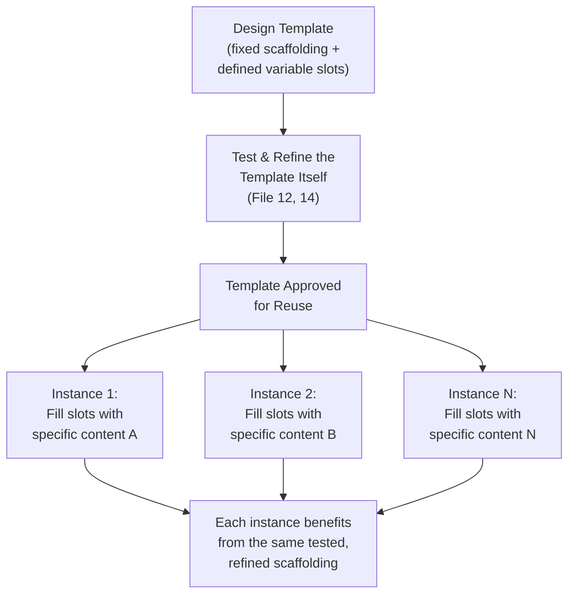
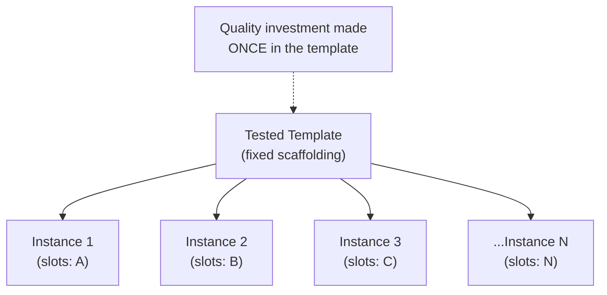
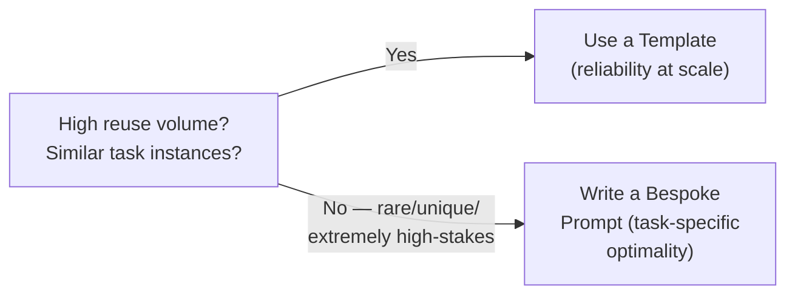

# 18 — Prompt Templates

> **Series:** Prompt Engineering Knowledge Library
> **File 18 of 60** | **Level:** Intermediate
> **Prerequisites:** [`17_Prompt_Versioning.md`](./17_Prompt_Versioning.md)
> **Next:** [`19_Prompt_Patterns.md`](./19_Prompt_Patterns.md)

---

## Table of Contents

1. [Definition](#definition)
2. [Why It Matters](#why-it-matters)
3. [Core Concepts](#core-concepts)
4. [How It Works](#how-it-works)
5. [Internal Mechanism](#internal-mechanism)
6. [Types of Templates](#types-of-templates)
7. [Syntax / Structure](#syntax--structure)
8. [Examples (Simple → Advanced)](#examples-simple--advanced)
9. [Best Practices](#best-practices)
10. [Common Mistakes](#common-mistakes)
11. [Real-World Applications](#real-world-applications)
12. [Comparison with Related Concepts](#comparison-with-related-concepts)
13. [Advantages & Limitations](#advantages--limitations)
14. [FAQs](#faqs)
15. [Summary](#summary)
16. [Cheat Sheet](#cheat-sheet)
17. [Glossary](#glossary)
18. [References](#references)
19. [Visual Diagram Gallery](#visual-diagram-gallery)

---

## Definition

A **Prompt Template** is a reusable, parameterized prompt structure with fixed instructional scaffolding and clearly defined variable "slots" meant to be filled with different specific content on each use — enabling a single, well-tested prompt design to serve many distinct instances of the same underlying task. A template is where the anatomical structure from [File 6](./06_Prompt_Anatomy.md) becomes explicitly *reusable across different inputs*, rather than being written fresh for a single, one-off use.

> The defining property: a template separates a prompt into **fixed parts** (the scaffolding, tested and stable) and **variable parts** (slots, filled differently each time) — precisely the distinction that makes systematic reuse and versioning ([File 17](./17_Prompt_Versioning.md)) of the fixed scaffolding possible, independent of whatever specific content fills the slots on any given use.

---

## Why It Matters

- **It enables efficient reuse at scale.** Once a template is well-tested ([File 14](./14_Prompt_Testing.md)) and refined ([File 12](./12_Prompt_Refinement.md)), the same proven design can serve thousands of distinct instances of the same task type without re-deriving the prompt from scratch each time.
- **It concentrates quality investment.** All the careful design, testing, and iteration effort ([File 16](./16_Prompt_Iteration.md)) invested in a template benefits every single future use of it, rather than being a one-time, non-transferable effort.
- **It supports consistent behavior.** A shared template ensures that many different instances of "the same kind of task" are handled with genuinely consistent quality and approach, rather than each being independently (and inconsistently) hand-crafted.
- **It is a direct prerequisite for automated, programmatic prompt generation** — any system that assembles prompts dynamically from application code depends on this fixed-scaffolding/variable-slot separation.

---

## Core Concepts

| Concept | Definition |
|---|---|
| **Template** | A reusable prompt structure with fixed scaffolding and variable slots |
| **Variable Slot / Placeholder** | A marked location in a template meant to be filled with specific content per use |
| **Instantiation** | The act of filling a template's slots with specific values to produce an actual, usable prompt |
| **Scaffolding** | The fixed, non-variable structural and instructional content of a template |
| **Parameterization** | The general practice of designing a template's variable slots |
| **Template Library** | A curated collection of reusable templates for different task types |

---

## How It Works



The critical structural insight is that testing and refinement effort is invested *once*, in the template's fixed scaffolding, and then amortized across every future instantiation — a template that has been rigorously tested against 50 representative cases provides much stronger quality assurance for its 1000th real-world use than a fresh, ad hoc prompt written for that single use ever could.

---

## Internal Mechanism

### Why slot design quality directly determines template robustness

A template's variable slots are, mechanically, the specific points where uncontrolled, potentially adversarial or unexpected external content enters the otherwise-stable scaffolding — directly connecting to the instruction/data separation concerns discussed in [File 4](./04_How_LLMs_Interpret_Prompts.md) and [File 6](./06_Prompt_Anatomy.md). A poorly designed slot (inserted without clear delimiters, or without guidance on how to handle unexpected slot content like an empty value or malformed input) undermines the reliability benefit the fixed scaffolding was meant to provide — because even though the scaffolding itself is well-tested, each specific instantiation's actual behavior depends on the interaction between that scaffolding and whatever unpredictable content lands in the slots. This is precisely why templates require deliberately testing not just typical slot content but boundary and adversarial slot content specifically ([File 14](./14_Prompt_Testing.md)'s categories applied directly to slot-filling), since a robust template must handle the full realistic range of what might actually be inserted, not merely the examples that happened to be used during initial design.

### Why templates trade some task-specific optimality for broad reliability

A template, by its nature, is designed to work reasonably well across *many* different instances of a task category — which means it typically cannot be as finely tuned to any single specific instance as a bespoke, individually hand-crafted prompt could theoretically be for that one case. This is a genuine, structural trade-off, not a flaw to be engineered away: a template optimizes for consistent, reliable performance across the *distribution* of expected inputs, accepting that it may be marginally suboptimal for any single particular input compared to a prompt written specifically and exclusively for that one case. Understanding this trade-off helps clarify when templating is the right choice (high-volume, repeated task types where consistency and reuse efficiency matter) versus when a bespoke, one-off prompt remains more appropriate (rare, highly unique, or extremely high-stakes individual tasks warranting dedicated design attention).

---

## Types of Templates

| Type | Description | Example Use Case |
|---|---|---|
| **Simple Fill-in-Blank Template** | A single variable slot within otherwise fixed text | "Translate the following into [LANGUAGE]: [TEXT]" |
| **Multi-Slot Structured Template** | Several distinct variable slots across a structured anatomy | A customer support template with slots for policy text, customer question, and customer name |
| **Conditional Template** | Includes logic determining which scaffolding sections apply based on slot content | A template that includes extra clarifying instructions only when a "complexity level" slot is set to "beginner" |
| **Composable Template** | Built from smaller, independently reusable sub-templates | A report-generation template combining separate "summary section" and "detail section" sub-templates |
| **Domain-Specific Template Family** | A related set of templates sharing common scaffolding conventions across a specific business domain | A company's full family of customer-support-related templates, sharing a consistent tone/format convention |

---

## Syntax / Structure

Templates are commonly expressed using clear placeholder syntax, often with a structured anatomy ([File 6](./06_Prompt_Anatomy.md)):

```text
# Simple template syntax
Translate the following text into {{target_language}}:

"{{source_text}}"
```

```xml
<!-- Multi-slot structured template -->
<role>You are a customer support assistant for {{company_name}}.</role>
<policy>{{policy_document}}</policy>
<instruction>
Answer the customer's question using only the policy above. 
If the answer isn't covered, say so explicitly rather than guessing.
</instruction>
<customer_question>{{customer_question}}</customer_question>
```

```yaml
# Template metadata (supports File 17 versioning of the template itself)
template_id: customer_support_answer_v3
slots:
  - name: company_name
    required: true
  - name: policy_document
    required: true
  - name: customer_question
    required: true
    validation: "must not be empty"
```

---

## Examples (Simple → Advanced)

**Level 1 — Basic single-slot template:**
```text
Template: "Explain {{topic}} in simple terms."
Instance 1: "Explain photosynthesis in simple terms."
Instance 2: "Explain gravity in simple terms."
```

**Level 2 — Multi-slot template:**
```text
Template: "Summarize the following {{document_type}} in 
{{sentence_count}} sentences: {{document_text}}"

Instance: "Summarize the following news article in 3 
sentences: [article text]"
```

**Level 3 — Template with slot content guidance:**
```text
Template:
"Classify the sentiment of the following review as Positive, 
Negative, or Neutral: {{review_text}}

Note: if {{review_text}} is empty or unrelated to a product, 
respond 'Unable to classify' instead of guessing."
```
*(The slot-handling guidance directly reflects the Internal Mechanism section's point about robust slot design.)*

**Level 4 — Conditional template:**
```text
Template:
"Explain {{topic}} {{#if beginner_level}}using simple language 
and everyday analogies, avoiding jargon{{else}}at a technical, 
detailed level appropriate for an expert audience{{/if}}."

Instance A (beginner_level=true): "Explain quantum entanglement 
using simple language and everyday analogies, avoiding jargon."

Instance B (beginner_level=false): "Explain quantum entanglement 
at a technical, detailed level appropriate for an expert audience."
```

**Level 5 — Production template with full metadata and versioning:**
```yaml
template_id: support_response_generator
version: v4.2 (per File 17 versioning practices)
scaffolding: |
  <role>You are a support assistant for {{company_name}}.</role>
  <context>Customer tier: {{customer_tier}}</context>
  <policy>{{policy_document}}</policy>
  <instruction>
  Answer using only the policy. If {{customer_tier}} is 
  "premium", offer to escalate to a live agent if the policy 
  doesn't fully resolve the issue. Otherwise, direct to the 
  standard help center.
  </instruction>
  <question>{{customer_question}}</question>
slots:
  - company_name: {required: true}
  - customer_tier: {required: true, allowed_values: 
                    [standard, premium]}
  - policy_document: {required: true}
  - customer_question: {required: true, validation: 
                         "non-empty"}
tested_against: "File 14 test suite: 45 cases across all slot 
                 combinations, including boundary/adversarial 
                 slot content — 44/45 passing"
```

---

## Best Practices

1. **Design and clearly mark variable slots explicitly** using consistent placeholder syntax, and delimit them clearly from fixed scaffolding — connecting directly to [File 6](./06_Prompt_Anatomy.md)'s anatomical and security guidance.
2. **Test a template against the realistic range of possible slot content**, not just the examples used during initial design — including boundary and adversarial slot content specifically ([File 14](./14_Prompt_Testing.md)).
3. **Include explicit guidance for unexpected or missing slot content** (empty values, malformed input) directly within the template's scaffolding, rather than assuming slots will always be filled with well-formed, expected content.
4. **Version the template itself** ([File 17](./17_Prompt_Versioning.md)), independent of any specific instantiation, since the scaffolding is the reusable asset actually being maintained over time.
5. **Recognize when a bespoke, one-off prompt is more appropriate than forcing a template** — for rare, highly unique, or extremely high-stakes individual tasks, dedicated design may outperform a general-purpose template's necessary trade-offs.

---

## Common Mistakes

| Mistake | Consequence | Fix |
|---|---|---|
| Poorly delimited variable slots | Increased risk of slot content being misinterpreted as new instructions ([File 26](./26_Context_Injection.md)) | Use clear, consistent delimiters around every slot |
| Testing only with "typical" slot content | Template breaks on unexpected real-world slot values | Test across boundary/adversarial slot content, not just typical examples |
| No guidance for missing or malformed slot content | Unpredictable behavior when a slot is empty or unusual | Explicitly instruct the template's scaffolding on how to handle these cases |
| Treating a template as permanently fixed, never revisited | Template quality degrades as it's used against evolving real-world conditions | Apply the same iteration ([File 16](./16_Prompt_Iteration.md)) and versioning ([File 17](./17_Prompt_Versioning.md)) discipline to templates as to any other prompt |
| Forcing every task into a template, even rare/unique ones | Suboptimal results for cases genuinely poorly served by generalized scaffolding | Recognize when a bespoke prompt is the better choice |

---

## Real-World Applications

- **Customer support and chatbot systems** — nearly universally built on templates, with slots filled dynamically per conversation (customer question, account context, policy content).
- **Content generation platforms** — marketing copy, product description, and email-drafting tools typically use templates with slots for product details, tone preferences, and target audience.
- **Data extraction and transformation pipelines** — a single well-tested extraction template, with a slot for the specific document being processed, scales efficiently across large document volumes.
- **Internal developer/team tooling** — organizations commonly maintain internal template libraries for recurring task types (code review prompts, documentation generation, meeting summary prompts).

---

## Comparison with Related Concepts

| Concept | Difference from "Prompt Templates" |
|---|---|
| **Prompt Anatomy (File 6)** | Anatomy is the general study of structural arrangement principles; a template is a *specific, concrete, reusable instance* of anatomical structure, with defined variable slots layered on top |
| **Prompt Patterns (File 19)** | A pattern is a *named, proven general technique* for a recurring problem type (e.g., "the few-shot pattern"); a template is a *concrete, literal, fill-in-the-blank artifact*, which often implements one or more underlying patterns |
| **Prompt Versioning (File 17)** | Versioning tracks change history for any prompt, including a template's own scaffolding evolution over time; templating itself is about the fixed-scaffolding/variable-slot reuse structure, a distinct concern versioning supports |

---

## Advantages & Limitations

### ✅ Advantages of Templating

- **Concentrates quality investment**, amortizing testing and refinement effort across many future uses.
- **Ensures consistent behavior** across many instances of the same underlying task type.
- **Enables efficient, scalable, programmatic prompt generation** in production systems.

### ⚠️ Limitations

- **Trades some task-specific optimality for broad reliability**, as discussed in the Internal Mechanism section — a template is rarely as finely tuned as a bespoke prompt could theoretically be for any single specific case.
- **Poor slot design directly undermines the whole approach's reliability benefit**, making careful slot design (delimiting, guidance for edge cases) a genuine skill requirement, not an afterthought.
- **Not suited to genuinely rare, unique, or highly individualized tasks**, where the overhead of general-purpose template design isn't justified by reuse volume.

---

## FAQs

**Q: How is a "template" different from just a "reusable prompt"?**
A: The defining, specific feature is the explicit fixed-scaffolding/variable-slot separation — a template is deliberately designed with clearly marked points meant to be filled differently each time, not merely a prompt that happens to get copy-pasted and lightly edited on reuse.

**Q: Should every slot in a template be required, or can some be optional?**
A: Both are valid design choices depending on the task — as shown in the Level 5 example's metadata, explicitly marking each slot's requirement status (and any validation rules) is good practice, rather than leaving this implicit.

**Q: How do I decide between designing a template versus writing individual bespoke prompts?**
A: The Internal Mechanism section's trade-off discussion is the key consideration — templating pays off with genuine reuse volume across similar task instances; for rare, highly unique, or extremely high-stakes individual cases, dedicated bespoke design often better serves that single case's specific needs.

**Q: Can a template include conditional logic, or must it be purely fill-in-the-blank?**
A: Conditional templates (Level 4 above) are a well-established, more advanced template type — many production templating systems support conditional scaffolding sections based on slot values, not just simple literal substitution.

---

## Summary

A Prompt Template is a reusable, parameterized prompt structure with fixed, well-tested scaffolding and clearly defined, deliberately delimited variable slots, enabling a single design investment to reliably serve many distinct instances of the same underlying task — concentrating quality effort and ensuring consistency across production-scale use. Because slots are precisely the points where uncontrolled external content enters otherwise-stable scaffolding, robust template design requires deliberate, security-conscious slot delimiting and explicit guidance for unexpected slot content, tested across the full realistic range of what might be inserted, not just convenient initial examples. Having covered this fill-in-the-blank, literal reuse mechanism, the library turns to a related but distinct concept — named, proven general *techniques* for recurring problem types, which templates often implement: [File 19 — Prompt Patterns](./19_Prompt_Patterns.md).

---

## Cheat Sheet

```text
PROMPT TEMPLATES — QUICK REFERENCE

CORE STRUCTURE
Fixed Scaffolding (tested, stable) + Variable Slots (filled per use)

SLOT DESIGN CHECKLIST
[ ] Clearly delimited (quotes, XML tags, {{placeholders}})
[ ] Tested against typical, boundary, AND adversarial slot content
[ ] Explicit guidance for empty/missing/malformed slot content
[ ] Required vs. optional slots clearly defined

WHEN TO TEMPLATE vs. WHEN NOT TO
High reuse volume, similar task instances -> Template
Rare, unique, extremely high-stakes single case -> Bespoke prompt
```

---

## Glossary

| Term | Definition |
|---|---|
| **Template** | A reusable prompt structure with fixed scaffolding and variable slots |
| **Variable Slot / Placeholder** | A marked location meant to be filled with specific content per use |
| **Instantiation** | Filling a template's slots to produce an actual usable prompt |
| **Scaffolding** | The fixed, non-variable structural content of a template |
| **Parameterization** | The practice of designing a template's variable slots |
| **Template Library** | A curated collection of reusable templates |

---

## References

- Anthropic — [Use Prompt Templates and Variables](https://docs.claude.com/en/docs/build-with-claude/prompt-engineering/use-xml-tags)
- White, J. et al. (2023) — *A Prompt Pattern Catalog to Enhance Prompt Engineering with ChatGPT*, arXiv:2302.11382
- OpenAI — [Prompt Templates in Production Systems](https://platform.openai.com/docs/guides/prompt-engineering)
- Gamma, E. et al. — *Design Patterns: Elements of Reusable Object-Oriented Software* (general reusability principles)

---

## Visual Diagram Gallery

**Diagram 1 — Fixed Scaffolding vs. Variable Slots**
```text
┌───────────────────────────────────────────┐
│  FIXED SCAFFOLDING (tested, stable)         │
│  "Summarize the following {{doc_type}}      │
│   in {{count}} sentences:"                  │
│                    ^            ^            │
│                    |            |            │
│              VARIABLE     VARIABLE           │
│               SLOT          SLOT             │
│  {{document_text}}  <- another VARIABLE SLOT │
└───────────────────────────────────────────┘
```

**Diagram 2 — One Template, Many Instances**


**Diagram 3 — Template vs. Bespoke Decision**


---

**⬅️ Previous:** [`17_Prompt_Versioning.md`](./17_Prompt_Versioning.md)
**➡️ Next:** [`19_Prompt_Patterns.md`](./19_Prompt_Patterns.md) — Named, proven general techniques for recurring prompting problems.
