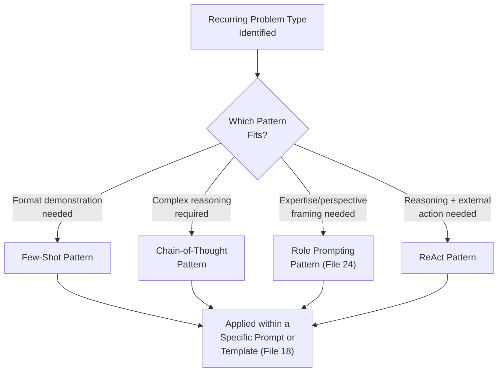
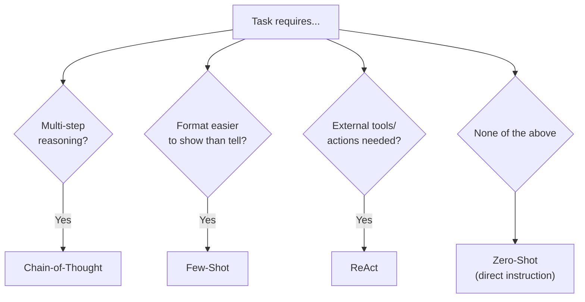
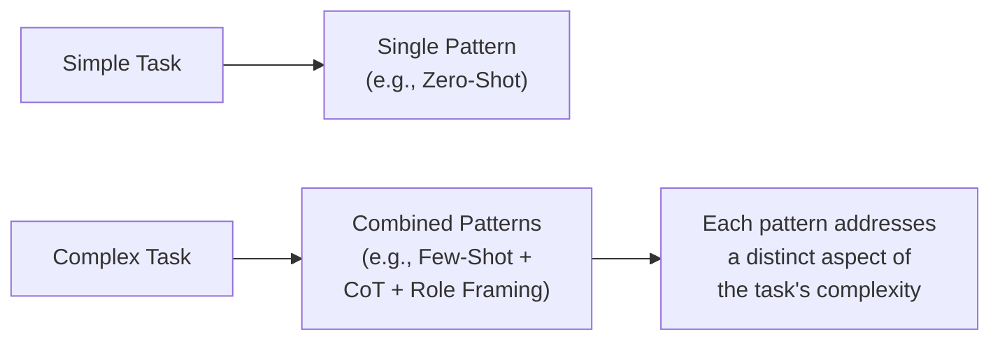

# 19 — Prompt Patterns

> **Series:** Prompt Engineering Knowledge Library
> **File 19 of 60** | **Level:** Intermediate → Advanced
> **Prerequisites:** [`18_Prompt_Templates.md`](./18_Prompt_Templates.md)
> **Next:** [`20_Prompt_Frameworks.md`](./20_Prompt_Frameworks.md)

---

## Table of Contents

1. [Definition](#definition)
2. [Why It Matters](#why-it-matters)
3. [Core Concepts](#core-concepts)
4. [How It Works](#how-it-works)
5. [Internal Mechanism](#internal-mechanism)
6. [Types of Patterns](#types-of-patterns)
7. [Syntax / Structure](#syntax--structure)
8. [Examples (Simple → Advanced)](#examples-simple--advanced)
9. [Best Practices](#best-practices)
10. [Common Mistakes](#common-mistakes)
11. [Real-World Applications](#real-world-applications)
12. [Comparison with Related Concepts](#comparison-with-related-concepts)
13. [Advantages & Limitations](#advantages--limitations)
14. [FAQs](#faqs)
15. [Summary](#summary)
16. [Cheat Sheet](#cheat-sheet)
17. [Glossary](#glossary)
18. [References](#references)
19. [Visual Diagram Gallery](#visual-diagram-gallery)

---

## Definition

**Prompt Patterns** are named, well-documented, empirically proven prompting techniques for recurring problem types — reusable *approaches* like few-shot prompting, chain-of-thought reasoning, or role-based framing — as distinct from [File 18](./18_Prompt_Templates.md)'s literal, fill-in-the-blank reusable artifacts. Where a template is a concrete piece of text with slots, a pattern is a more abstract, general *technique* that can be applied across many different templates or bespoke prompts, much like a software design pattern (Singleton, Observer) describes a general solution approach rather than a specific code file.

> A useful distinction: a **pattern** is "use few-shot examples to establish a format"; a **template** is the actual, specific prompt text implementing that pattern for one particular task.

---

## Why It Matters

- **Patterns provide proven, transferable solutions** to recurring problem types, sparing practitioners from re-deriving effective approaches from scratch for every new task.
- **They give the field a shared, precise vocabulary** — saying "use chain-of-thought" communicates a specific, well-understood technique far more efficiently than re-explaining the approach each time.
- **They are empirically grounded**, not folklore — most major patterns in this file trace to specific published research demonstrating their effectiveness, distinguishing genuine patterns from unfounded "prompting tips."
- **They compose.** Sophisticated production prompts often combine several patterns simultaneously (e.g., few-shot examples *and* chain-of-thought *and* role framing), and recognizing each as a distinct, named pattern helps engineers deliberately reason about which combination fits a given task.

---

## Core Concepts

| Concept | Definition |
|---|---|
| **Pattern** | A named, general, reusable prompting technique for a recurring problem type |
| **Few-Shot Prompting** | Providing example input/output pairs to establish a desired pattern |
| **Chain-of-Thought (CoT)** | Inducing the model to generate intermediate reasoning steps before a final answer |
| **Role/Persona Framing** | Assigning the model a specific perspective or expertise (fully covered in [File 24](./24_Role_Prompting.md)) |
| **Self-Consistency** | Generating multiple independent reasoning paths and selecting the most consistent answer |
| **ReAct (Reason + Act)** | Interleaving reasoning steps with tool-use/action steps, common in agentic systems |

---

## How It Works



Recognizing which pattern (or combination of patterns) fits a given recurring problem type is itself a core prompt engineering skill — patterns function as a practitioner's toolkit of named, proven solutions to reach for, rather than requiring each new problem to be approached with no prior technique in mind.

---

## Internal Mechanism

### Why chain-of-thought works, mechanically (connecting back to File 4)

As established in [File 4](./04_How_LLMs_Interpret_Prompts.md)'s Internal Mechanism section, autoregressive generation means each new token is conditioned on everything generated before it, including the model's own prior output. Chain-of-thought exploits this directly: by inducing the model to generate explicit intermediate reasoning steps *before* committing to a final answer, those reasoning tokens become part of the context the final answer is conditioned on — effectively giving the model a form of "working memory" or "scratch space" that a direct, single-token-conditioned jump to an answer wouldn't have. This mechanical grounding is why CoT reliably helps on tasks requiring multi-step reasoning (math, logic, multi-hop questions) but provides less benefit on tasks that don't genuinely require intermediate steps — the technique's value is tied to a specific mechanical property, not general "trying harder."

### Why few-shot prompting works as a form of in-context learning

As established in [File 2](./02_History_of_Prompts.md)'s discussion of emergent capabilities, large models trained at sufficient scale exhibit in-context learning — the ability to infer a task pattern from examples given directly in the prompt, without any weight updates. Few-shot prompting is the direct, deliberate application of this capability: providing a small number of demonstrated input/output pairs gives the model concrete pattern information (format, style, level of detail, edge-case handling) that can be substantially harder to fully specify through instruction alone. This explains a practical corollary: few-shot prompting tends to be most valuable precisely when the desired output pattern is easier to *show* than to *describe* — a genuinely mechanistic, not arbitrary, guideline for when to reach for this pattern.

---

## Types of Patterns

| Pattern | Core Technique | Best Suited For |
|---|---|---|
| **Zero-Shot** | Direct instruction, no examples | Simple, well-understood tasks the model handles natively |
| **Few-Shot** | Example input/output pairs provided | Tasks where the desired format/style is easier to show than describe |
| **Chain-of-Thought (CoT)** | Induces intermediate reasoning before a final answer | Multi-step reasoning, math, logic tasks |
| **Self-Consistency** | Multiple independent reasoning paths, majority/consistency vote | High-stakes reasoning tasks where a single CoT pass may be unreliable |
| **Role/Persona Framing** | Assigns a specific expertise/perspective | Domain-specific tone or expertise framing (see [File 24](./24_Role_Prompting.md)) |
| **ReAct (Reason + Act)** | Interleaves reasoning with tool-use actions | Agentic systems needing to reason about when/how to use external tools |
| **Least-to-Most Prompting** | Breaks a complex problem into progressively solved sub-problems | Complex, decomposable multi-part problems |

---

## Syntax / Structure

Each pattern has a recognizable structural signature:

```text
# Few-Shot pattern syntax
Input: [example 1] -> Output: [example 1 result]
Input: [example 2] -> Output: [example 2 result]
Input: [actual query] -> Output:
```

```text
# Chain-of-Thought pattern syntax
[Question requiring reasoning]

Think through this step by step, showing your reasoning, 
before giving your final answer.
```

```text
# ReAct pattern syntax (simplified illustrative structure)
Thought: [reasoning about what to do next]
Action: [tool call or action taken]
Observation: [result of that action]
Thought: [reasoning based on the observation]
... (repeats until task complete)
Final Answer: [conclusion]
```

---

## Examples (Simple → Advanced)

**Level 1 — Zero-shot (baseline, no pattern applied):**
```text
Is the following statement true or false: "The sun rises in 
the west."
```

**Level 2 — Few-shot pattern applied:**
```text
Statement: "Paris is the capital of France." -> True
Statement: "The Pacific is the smallest ocean." -> False
Statement: "The sun rises in the west." -> 
```

**Level 3 — Chain-of-thought pattern applied to a reasoning task:**
```text
A store had 120 apples. They sold 45 in the morning and 
received a new shipment of 30 in the afternoon, then sold 
25 more. How many apples are left?

Think through this step by step before giving your final answer.
```

**Level 4 — Combining few-shot and chain-of-thought:**
```text
Q: A store had 50 items, sold 20. How many remain?
A: Starting amount: 50. Sold: 20. Remaining: 50 - 20 = 30.

Q: A store had 120 apples, sold 45, then received 30 more, 
then sold 25. How many remain?
A: [model continues with similar step-by-step reasoning, 
having seen the demonstrated pattern]
```

**Level 5 — ReAct pattern in an agentic context:**
```text
Task: Find the current weather in Tokyo and recommend 
appropriate clothing.

Thought: I need current weather data for Tokyo, which I don't 
have — I should use the weather tool.
Action: weather_lookup("Tokyo")
Observation: 18°C, light rain expected.

Thought: 18°C with rain suggests a light jacket and umbrella 
would be appropriate.
Final Answer: It's 18°C in Tokyo with light rain expected — 
I'd recommend a light jacket and bringing an umbrella.
```

---

## Best Practices

1. **Match the pattern to the mechanistic reason it works** — use chain-of-thought specifically for genuine multi-step reasoning tasks, not as a default add-on to every prompt regardless of need.
2. **Prefer few-shot when the desired output is easier to show than describe** — this is the specific signal pointing toward this pattern's value, per the Internal Mechanism section.
3. **Combine patterns deliberately, not accidentally** — recognize when a task genuinely benefits from multiple patterns together (Level 4 above) versus when combining adds unnecessary complexity.
4. **Keep few-shot examples genuinely representative and consistent** — inconsistent or unrepresentative examples can teach the wrong pattern just as effectively as they can teach the right one.
5. **Test whether a pattern actually helps for your specific task and model** ([File 14](./14_Prompt_Testing.md)) — patterns are proven general techniques, but their magnitude of benefit varies by task and model, and empirical confirmation remains valuable.

---

## Common Mistakes

| Mistake | Consequence | Fix |
|---|---|---|
| Applying chain-of-thought to tasks that don't require multi-step reasoning | Unnecessary verbosity/cost with no meaningful accuracy benefit | Reserve CoT for genuinely multi-step reasoning tasks |
| Using inconsistent or contradictory few-shot examples | Model learns an unclear or wrong pattern | Ensure examples are consistent in format, style, and correctness |
| Treating patterns as mutually exclusive, never combining them | Missing genuine benefits from patterns working well together | Deliberately consider combinations for complex tasks (Level 4) |
| Assuming a pattern will help without testing on the specific task | Wasted prompt complexity for unconfirmed benefit | Empirically validate a pattern's actual impact for your use case |
| Confusing patterns with templates | Miscommunication about what's actually being reused (a technique vs. literal text) | Keep the pattern/template distinction clear, per this file's Definition |

---

## Real-World Applications

- **Mathematical and logical reasoning applications** — chain-of-thought is a near-standard pattern for any task requiring the model to work through multi-step problems.
- **Format-sensitive content generation** — few-shot prompting is heavily used wherever a very specific output format or style needs to be reliably demonstrated, not just described.
- **Agentic and tool-using AI systems** — the ReAct pattern (or close variants) underlies much of how modern AI agents interleave reasoning with real-world tool calls.
- **High-stakes reasoning applications** — self-consistency (generating multiple reasoning paths and checking agreement) is used specifically where single-pass reasoning reliability isn't sufficient for the stakes involved.

---

## Comparison with Related Concepts

| Concept | Difference from "Prompt Patterns" |
|---|---|
| **Prompt Templates (File 18)** | A pattern is a general, abstract *technique* (e.g., "use few-shot examples"); a template is the concrete, literal *artifact* that may implement one or more patterns for a specific task |
| **Prompt Frameworks (File 20)** | A framework is typically a larger, more structured *methodology* composing multiple patterns and principles into an overarching approach; an individual pattern is one focused technique that a framework might incorporate |
| **Prompt Design Principles (File 9)** | Principles are abstract, durable qualities (clarity, specificity); patterns are specific, concrete, named *techniques* that, when applied well, tend to embody those underlying principles |

---

## Advantages & Limitations

### ✅ Advantages of Pattern-Based Thinking

- **Provides proven, empirically grounded solutions** to recurring problem types, avoiding the need to re-derive effective approaches from scratch.
- **Creates a precise, efficient shared vocabulary** for discussing and applying specific techniques.
- **Enables deliberate composition** — recognizing and combining multiple relevant patterns for genuinely complex tasks.

### ⚠️ Limitations

- **Patterns aren't universally beneficial for every task** — applying a pattern (especially CoT) where it isn't mechanistically warranted adds cost and complexity without corresponding benefit.
- **The catalog of named patterns continues to evolve** as research progresses — this file covers well-established patterns as of its writing, but the field continues to develop new ones.
- **Pattern effectiveness can vary by specific model and task**, meaning empirical validation ([File 14](./14_Prompt_Testing.md)) remains necessary even when applying a generally well-proven pattern.

---

## FAQs

**Q: How many few-shot examples are typically needed?**
A: There's no universal fixed number — even a single example can help substantially in some cases, while more complex pattern demonstration might benefit from several; the right number depends on task complexity and is often determined empirically ([File 14](./14_Prompt_Testing.md)).

**Q: Does chain-of-thought always improve accuracy?**
A: No — its mechanistic benefit is specifically tied to tasks requiring genuine multi-step reasoning; for simple, single-step tasks, CoT typically adds unnecessary length without meaningful accuracy improvement.

**Q: Can multiple patterns be combined in a single prompt?**
A: Yes, and this is common practice for complex tasks (Level 4's few-shot + CoT combination, or ReAct's combination of reasoning and role-implicit tool use) — deliberate combination is a legitimate, often valuable, advanced technique.

**Q: Is self-consistency the same as just running a prompt multiple times?**
A: Related but more specific — self-consistency specifically involves generating multiple independent reasoning *paths* (not just multiple final answers) and using agreement/consistency across those paths as a signal for selecting or trusting the final answer, rather than simply averaging or picking randomly among repeated runs.

---

## Summary

Prompt Patterns are named, empirically proven, general prompting techniques — few-shot prompting, chain-of-thought, role framing, self-consistency, ReAct, and others — for recurring problem types, distinct from [File 18](./18_Prompt_Templates.md)'s concrete, literal reusable artifacts. Each major pattern has a specific mechanistic grounding (chain-of-thought exploits autoregressive conditioning to provide reasoning "scratch space"; few-shot exploits in-context learning to demonstrate patterns more effectively than description alone), which is precisely what should guide *when* to apply each pattern rather than treating them as universally beneficial defaults. Sophisticated tasks often benefit from deliberately combining multiple patterns. Having covered this toolkit of specific, named techniques, the library turns to how these patterns compose into larger, more comprehensive structured methodologies: [File 20 — Prompt Frameworks](./20_Prompt_Frameworks.md).

---

## Cheat Sheet

```text
PROMPT PATTERNS — QUICK REFERENCE

PATTERN SELECTION GUIDE
Simple, well-understood task    -> Zero-Shot
Format easier to show than tell -> Few-Shot
Multi-step reasoning needed     -> Chain-of-Thought (CoT)
High-stakes reasoning reliability -> Self-Consistency
Domain expertise/tone framing   -> Role Prompting (File 24)
Agentic tool-use reasoning      -> ReAct

MECHANISTIC GROUNDING (why they work — not folklore)
CoT: exploits autoregressive conditioning -> "scratch space"
Few-Shot: exploits in-context learning -> demonstrates > describes

REMEMBER: Patterns CAN be combined for complex tasks — this 
is legitimate, not overcomplication, when genuinely warranted.
```

---

## Glossary

| Term | Definition |
|---|---|
| **Pattern** | A named, general, reusable prompting technique |
| **Few-Shot Prompting** | Providing example input/output pairs |
| **Chain-of-Thought (CoT)** | Inducing intermediate reasoning before a final answer |
| **Self-Consistency** | Multiple reasoning paths, selecting the most consistent answer |
| **ReAct** | Interleaving reasoning with tool-use/action steps |
| **In-Context Learning** | Learning a task pattern from prompt examples alone |

---

## References

- Wei, J. et al. (2022) — *Chain-of-Thought Prompting Elicits Reasoning in Large Language Models*, arXiv:2201.11903
- Brown, T. et al. (2020) — *Language Models are Few-Shot Learners*, arXiv:2005.14165
- Wang, X. et al. (2022) — *Self-Consistency Improves Chain of Thought Reasoning*, arXiv:2203.11171
- Yao, S. et al. (2022) — *ReAct: Synergizing Reasoning and Acting in Language Models*, arXiv:2210.03629
- Zhou, D. et al. (2022) — *Least-to-Most Prompting Enables Complex Reasoning*, arXiv:2205.10625

---

## Visual Diagram Gallery

**Diagram 1 — The Pattern Selection Decision Tree**


**Diagram 2 — Chain-of-Thought's Mechanistic Effect**
```text
WITHOUT CoT:
[Question] -> [Single token conditioning] -> [Answer]
             (limited "thinking room")

WITH CoT:
[Question] -> [Reasoning Step 1] -> [Reasoning Step 2] -> 
              [Reasoning Step 3] -> [Answer]
             (each step becomes context for the next —
              much larger effective "thinking room")
```

**Diagram 3 — Pattern Composition for Complex Tasks**


---

**⬅️ Previous:** [`18_Prompt_Templates.md`](./18_Prompt_Templates.md)
**➡️ Next:** [`20_Prompt_Frameworks.md`](./20_Prompt_Frameworks.md) — How individual patterns compose into larger, structured methodologies.
