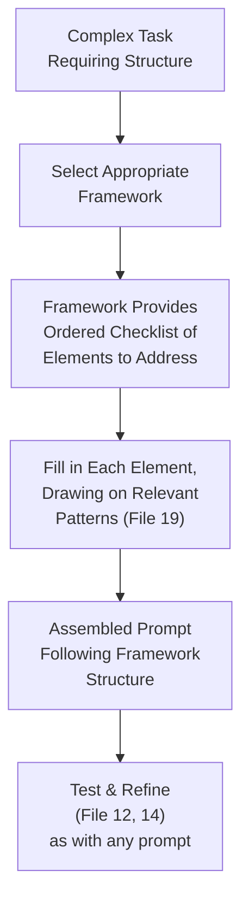
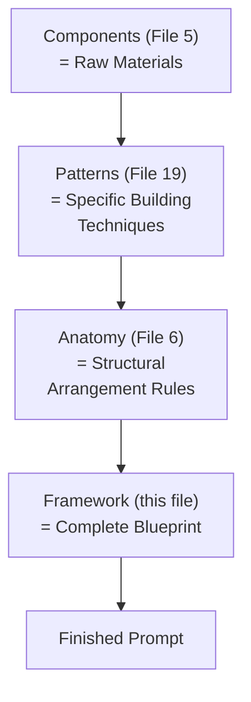
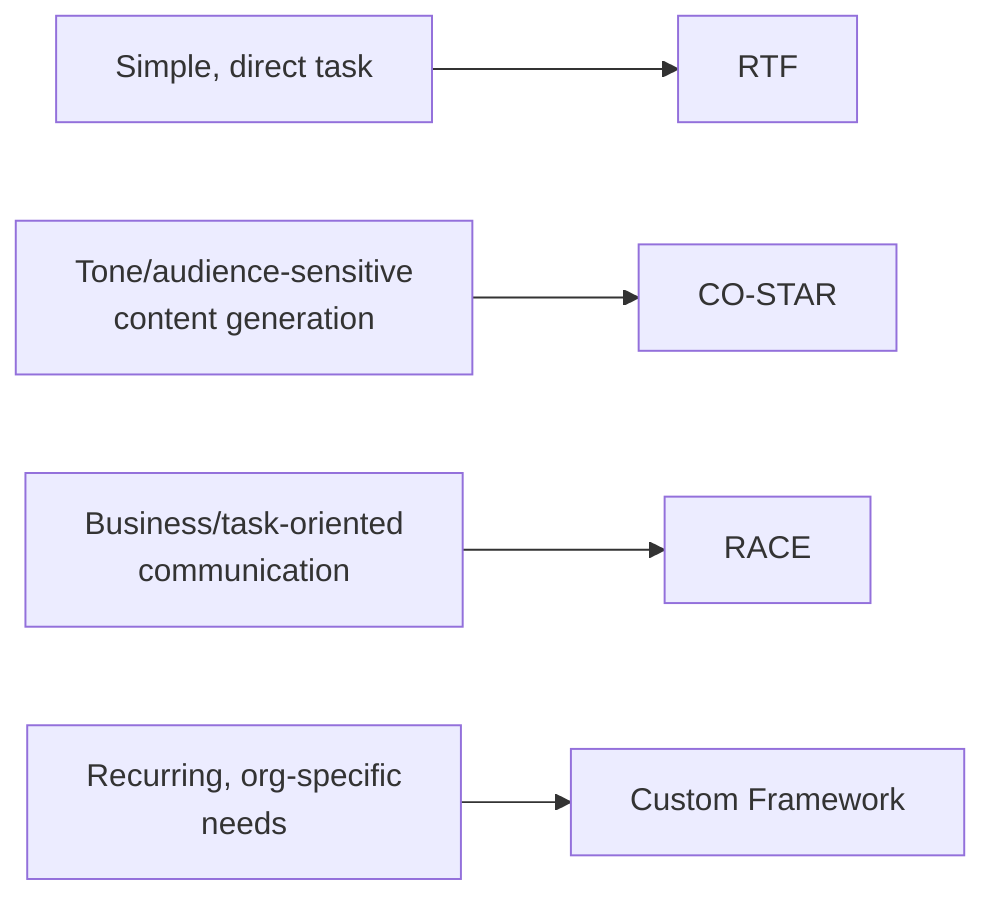

# 20 — Prompt Frameworks

> **Series:** Prompt Engineering Knowledge Library
> **File 20 of 60** | **Level:** Advanced
> **Prerequisites:** [`19_Prompt_Patterns.md`](./19_Prompt_Patterns.md)
> **Next:** [`21_System_Prompts.md`](./21_System_Prompts.md)

---

## Table of Contents

1. [Definition](#definition)
2. [Why It Matters](#why-it-matters)
3. [Core Concepts](#core-concepts)
4. [How It Works](#how-it-works)
5. [Internal Mechanism](#internal-mechanism)
6. [Types of Frameworks](#types-of-frameworks)
7. [Syntax / Structure](#syntax--structure)
8. [Examples (Simple → Advanced)](#examples-simple--advanced)
9. [Best Practices](#best-practices)
10. [Common Mistakes](#common-mistakes)
11. [Real-World Applications](#real-world-applications)
12. [Comparison with Related Concepts](#comparison-with-related-concepts)
13. [Advantages & Limitations](#advantages--limitations)
14. [FAQs](#faqs)
15. [Summary](#summary)
16. [Cheat Sheet](#cheat-sheet)
17. [Glossary](#glossary)
18. [References](#references)
19. [Visual Diagram Gallery](#visual-diagram-gallery)

---

## Definition

**Prompt Frameworks** are larger, structured methodologies that compose multiple individual patterns ([File 19](./19_Prompt_Patterns.md)), design principles ([File 9](./09_Prompt_Design_Principles.md)), and anatomical conventions ([File 6](./06_Prompt_Anatomy.md)) into a comprehensive, named, repeatable approach for a broad category of complex tasks — such as the widely-referenced RTF (Role-Task-Format), CO-STAR, or RACE frameworks. Where a pattern addresses one specific technique (use examples, induce reasoning), a framework provides an overarching *structure* for organizing an entire prompt from end to end.

> The relationship is compositional: a **framework** is the overall blueprint of a house; **patterns** are specific, proven techniques for building parts of it (a particular kind of joint, a particular wiring approach); **components** ([File 5](./05_Prompt_Components.md)) are the raw materials.

---

## Why It Matters

- **It provides a complete, memorable checklist** for constructing complex prompts, reducing the risk of omitting an important element (as identified in [File 5](./05_Prompt_Components.md) and [File 6](./06_Prompt_Anatomy.md)) under time pressure or unfamiliarity.
- **It standardizes team communication and training.** A team that agrees to use a specific named framework (e.g., "we always structure prompts using CO-STAR") has an immediately shared, teachable, and reviewable standard.
- **It reduces the cognitive load of prompt design from scratch.** Rather than independently re-deriving which components, patterns, and ordering to use for a complex prompt each time, a framework provides a proven starting structure.
- **It bridges individual technique knowledge (patterns, principles) into practical, end-to-end application** — the culmination of nearly every preceding file's concepts into ready-to-use, named structures.

---

## Core Concepts

| Concept | Definition |
|---|---|
| **Framework** | A named, structured methodology composing multiple patterns/principles into a complete prompt-construction approach |
| **Acronym-Based Mnemonic** | A memorable naming convention (e.g., each letter representing a required prompt element) common to many popular frameworks |
| **Framework Coverage** | The specific set of prompt elements a given framework ensures are considered |
| **Framework Selection** | The practice of choosing an appropriate framework for a given task's needs |
| **Framework Customization** | Adapting a general framework's structure to a specific organization's or task's particular requirements |

---

## How It Works



A framework's value is specifically in providing *comprehensive, ordered coverage* — ensuring a complex prompt doesn't accidentally omit a critical element (role, task, constraints, format) simply because the author didn't happen to think of it in an unstructured drafting process. This directly extends [File 6](./06_Prompt_Anatomy.md)'s anatomical thinking into named, memorable, ready-to-apply structures.

---

## Internal Mechanism

### Why acronym-based mnemonics are a deliberate cognitive design choice, not decoration

Most well-known prompt frameworks use memorable acronyms (RTF: Role, Task, Format; CO-STAR: Context, Objective, Style, Tone, Audience, Response; RACE: Role, Action, Context, Expectation) — and this isn't a cosmetic naming convenience. Cognitive research on checklists and mnemonic devices broadly demonstrates that memorable, structured recall aids meaningfully reduce the rate of accidentally omitted steps compared to relying on unstructured memory or judgment alone, particularly under time pressure or when a task is unfamiliar. A framework's acronym functions exactly this way for prompt construction — it's a deliberately engineered recall aid ensuring that, even when working quickly, an author is more likely to have addressed each critical element than if working from memory of general good-prompting advice alone.

### Why frameworks are compositions, not replacements, of underlying patterns and principles

It's a common misunderstanding to treat a framework as an entirely separate, self-contained technique unrelated to the patterns and principles covered elsewhere in this library. Mechanically, this isn't accurate: a framework's "Task" element still benefits from the specificity principle ([File 9](./09_Prompt_Design_Principles.md)); its "Format" element still relies on the output formatting techniques covered in [File 29](./29_Output_Formatting.md); and filling in any given framework element for a complex reasoning task might still benefit from applying chain-of-thought ([File 19](./19_Prompt_Patterns.md)) within that element. A framework organizes *where* to apply these underlying techniques within a complete prompt structure; it doesn't substitute for understanding and correctly applying the techniques themselves.

---

## Types of Frameworks

| Framework | Elements | Best Suited For |
|---|---|---|
| **RTF (Role-Task-Format)** | Role, Task, Format | Simple to moderate complexity tasks needing basic structure |
| **CO-STAR** | Context, Objective, Style, Tone, Audience, Response | Content generation tasks where tone/audience matter significantly |
| **RACE** | Role, Action, Context, Expectation | Task-oriented prompts needing clear expectation-setting |
| **CRISPE** | Capacity/Role, Insight, Statement, Personality, Experiment | Creative and exploratory tasks benefiting from iterative framing |
| **TAG (Task-Action-Goal)** | Task, Action, Goal | Simple, goal-oriented instructional prompts |
| **Custom Organizational Frameworks** | Varies — tailored to a specific team's/domain's recurring needs | Organizations with distinctive, recurring prompt structure needs |

---

## Syntax / Structure

Each framework has a recognizable, structured syntax directly reflecting its named elements:

```text
# RTF Framework
[ROLE] You are an experienced technical writer.
[TASK] Rewrite the following paragraph for clarity, targeting 
       a non-technical audience.
[FORMAT] Return only the rewritten paragraph, no explanation.
```

```text
# CO-STAR Framework
[CONTEXT] This response will be used in a company blog post 
          about our new product launch.
[OBJECTIVE] Generate an engaging opening paragraph.
[STYLE] Conversational but professional.
[TONE] Enthusiastic, optimistic.
[AUDIENCE] Existing customers familiar with our brand.
[RESPONSE] A single paragraph, under 100 words.
```

```text
# RACE Framework
[ROLE] You are a customer success specialist.
[ACTION] Draft a follow-up email checking on the customer's 
         satisfaction with a recent purchase.
[CONTEXT] The customer purchased a premium subscription 2 
          weeks ago and hasn't logged in since.
[EXPECTATION] Warm, non-pushy tone; include a specific, easy 
              next step for them to take.
```

---

## Examples (Simple → Advanced)

**Level 1 — Basic RTF framework application:**
```text
[ROLE] You are a helpful cooking assistant.
[TASK] Suggest a simple dinner recipe using chicken and rice.
[FORMAT] List ingredients, then numbered steps.
```

**Level 2 — CO-STAR framework for a content task:**
```text
[CONTEXT] Writing for a personal finance newsletter.
[OBJECTIVE] Explain compound interest simply.
[STYLE] Clear, approachable, uses a relatable analogy.
[TONE] Encouraging, not intimidating.
[AUDIENCE] Young adults new to personal finance.
[RESPONSE] 3 short paragraphs.
```

**Level 3 — RACE framework for a task-oriented business prompt:**
```text
[ROLE] You are a project coordinator.
[ACTION] Draft a status update message for the team.
[CONTEXT] The project is on schedule but a key dependency 
          (external vendor delivery) has a 3-day delay risk.
[EXPECTATION] Transparent about the risk without causing 
              alarm; propose a mitigation next step.
```

**Level 4 — Comparing two frameworks for the same underlying task:**
```text
[Same task: writing a product announcement, via RTF]
[ROLE] Marketing copywriter.
[TASK] Write a product announcement for our new app feature.
[FORMAT] 2 paragraphs, ending with a call-to-action.

[Same task, via CO-STAR — notably richer framing]
[CONTEXT] For our email newsletter to existing users.
[OBJECTIVE] Announce the new feature and drive trial usage.
[STYLE] Friendly, benefit-focused, not overly technical.
[TONE] Excited but credible.
[AUDIENCE] Existing users who already trust our brand.
[RESPONSE] 2 paragraphs, ending with a clear call-to-action.
```
*(CO-STAR's additional Style/Tone/Audience elements provide finer control for this content-generation task than RTF's simpler structure — illustrating framework selection trade-offs.)*

**Level 5 — Custom organizational framework, composing multiple patterns:**
```text
# Internal "Support Response Framework" (custom, organization-specific)
[ROLE] Support agent persona (File 24)
[POLICY CONTEXT] Delimited policy data (File 26 security practices)
[CUSTOMER CONTEXT] Tier, prior interaction history
[TASK] Core instruction, incorporating chain-of-thought (File 19) 
       for complex multi-part questions: "think through which 
       policy sections apply before answering"
[TONE] Empathy calibration guidance (File 12 refinement principles)
[FORMAT] Structured JSON output for downstream validation (File 30)
[FALLBACK INSTRUCTION] Explicit guidance for policy-gap cases 
                        (per File 13's debugging findings)

-> This custom framework explicitly composes anatomy (File 6), 
   a specific pattern (CoT, File 19), security practice 
   (File 26), and output engineering (File 29/30) into one 
   named, reusable organizational structure.
```

---

## Best Practices

1. **Select a framework based on task needs**, not habit — RTF's simplicity suits straightforward tasks; CO-STAR's richer elements suit tone-sensitive content generation; custom frameworks suit organization-specific recurring needs.
2. **Remember a framework organizes *where* to apply techniques, not what those techniques are** — still apply the specificity principle ([File 9](./09_Prompt_Design_Principles.md)), appropriate patterns ([File 19](./19_Prompt_Patterns.md)), and sound anatomy ([File 6](./06_Prompt_Anatomy.md)) *within* each framework element.
3. **Consider developing a custom organizational framework** once recurring task types and structural needs become clear within a specific team or domain (Level 5 above).
4. **Don't force-fit every task into a rigid framework** — for genuinely simple, one-off tasks, full framework structure can be disproportionate overhead ([File 9](./09_Prompt_Design_Principles.md)'s conciseness principle still applies).
5. **Treat a chosen framework as a living convention**, subject to the same iteration ([File 16](./16_Prompt_Iteration.md)) and versioning ([File 17](./17_Prompt_Versioning.md)) discipline as any other prompt engineering asset.

---

## Common Mistakes

| Mistake | Consequence | Fix |
|---|---|---|
| Treating a framework as a complete substitute for understanding underlying patterns/principles | Mechanically filling in framework elements without genuine quality within each | Apply appropriate principles and patterns within each framework element |
| Using an elaborate framework for a trivially simple task | Unnecessary overhead and complexity | Match framework choice (or the decision to skip one) to actual task complexity |
| Never adapting a framework to organization-specific needs | Missing genuine efficiency gains from a tailored, recurring structure | Consider custom framework development for clearly recurring task types |
| Confusing framework selection with actual prompt quality | Assuming a well-chosen framework guarantees good output regardless of execution within it | Recognize the framework provides structure, not a guarantee — quality still requires careful execution |
| Rigidly forcing a task into an ill-fitting framework's elements | Awkward, unnatural forcing of content into inappropriate categories | Select a framework whose elements genuinely match the task, or adapt/combine elements as needed |

---

## Real-World Applications

- **Marketing and content team prompt standards** — CO-STAR and similar frameworks are widely adopted specifically for their tone/audience-sensitive structure, well-suited to content generation work.
- **Enterprise prompt engineering guidelines** — many organizations formally adopt or adapt a named framework as their standard prompt-construction convention, directly supporting consistent team practice.
- **Prompt engineering training and onboarding** — frameworks are commonly among the first practical, applicable tools taught to new team members, providing an immediately usable structure.
- **Complex, multi-stakeholder prompt design** — frameworks provide a shared vocabulary and checklist that helps ensure all relevant considerations (tone, audience, format, constraints) are addressed when multiple people collaborate on a single complex prompt.

---

## Comparison with Related Concepts

| Concept | Difference from "Prompt Frameworks" |
|---|---|
| **Prompt Patterns (File 19)** | A pattern is one focused, specific technique (few-shot, CoT); a framework is a larger, comprehensive structure that organizes where and how multiple patterns and principles get applied across an entire prompt |
| **Prompt Anatomy (File 6)** | Anatomy is the general study of structural arrangement principles; a framework is a specific, named, memorable *application* of anatomical thinking, packaged as a ready-to-use checklist |
| **Prompt Templates (File 18)** | A framework provides a general *structural blueprint* (which elements to include, in what order); a template is a *concrete, literal artifact* that might be built by following a specific framework for a specific recurring task |

---

## Advantages & Limitations

### ✅ Advantages of Framework-Based Prompt Construction

- **Provides comprehensive, memorable coverage**, reducing the risk of accidentally omitting important elements, especially under time pressure.
- **Standardizes team communication and training** around a shared, teachable structure.
- **Bridges individual technique knowledge into practical, end-to-end application**, synthesizing much of this library's earlier content into ready-to-use structures.

### ⚠️ Limitations

- **A framework alone doesn't guarantee quality** — as emphasized in the Internal Mechanism section, it organizes where to apply techniques, but genuine execution quality within each element still requires the underlying skills covered throughout this library.
- **Can be disproportionate overhead for simple tasks** — full framework structure isn't always warranted, echoing [File 9](./09_Prompt_Design_Principles.md)'s conciseness principle.
- **No single framework fits every task perfectly** — framework selection itself requires judgment, and rigid, ill-fitting application can produce awkward, unnatural results.

---

## FAQs

**Q: Which framework should I use — RTF, CO-STAR, RACE, or another?**
A: This depends on task type — RTF suits simple, straightforward tasks; CO-STAR suits tone/audience-sensitive content generation; RACE suits task-oriented business communication; the Types of Frameworks section provides general guidance, but task-specific judgment (and testing, [File 14](./14_Prompt_Testing.md)) remains valuable.

**Q: Can I combine elements from different frameworks?**
A: Yes — as Level 5's custom organizational framework example shows, adapting and combining elements to fit a specific recurring organizational need is legitimate and common practice, not a violation of "proper" framework use.

**Q: Do I need to memorize a framework's acronym to benefit from it?**
A: The acronym itself is a memory aid (per the Internal Mechanism section's discussion of cognitive checklist research), so genuinely internalizing it is part of the practical benefit — though the underlying principle (comprehensive, ordered element coverage) can be applied even without perfect acronym recall, using a written checklist instead.

**Q: Is developing a custom framework only appropriate for large organizations?**
A: Not necessarily — even an individual practitioner or small team can benefit from developing a lightweight, personalized structural convention for their own frequently recurring task types, following the same underlying logic as Level 5's example at a smaller scale.

---

## Summary

Prompt Frameworks are larger, named, structured methodologies — RTF, CO-STAR, RACE, and others, often organized as memorable acronyms — that compose individual patterns, design principles, and anatomical conventions into a comprehensive, ready-to-use checklist for constructing complex prompts end to end. Their value lies specifically in providing structured, memorable coverage that reduces the risk of accidentally omitting important elements, particularly valuable under time pressure or for less experienced practitioners, while still depending entirely on the underlying skills (specificity, appropriate pattern selection, sound anatomy) covered throughout the rest of this library for genuine execution quality within each framework element. Having now covered the full progression from individual components through to comprehensive frameworks, the library turns to a related but distinct axis of prompt classification — the different *sources* prompts can come from within a conversation, beginning with [File 21 — System Prompts](./21_System_Prompts.md).

---

## Cheat Sheet

```text
PROMPT FRAMEWORKS — QUICK REFERENCE

MAJOR FRAMEWORKS AT A GLANCE
RTF     -> Role, Task, Format (simple tasks)
CO-STAR -> Context, Objective, Style, Tone, Audience, Response 
           (tone-sensitive content)
RACE    -> Role, Action, Context, Expectation (business tasks)
CRISPE  -> Capacity, Insight, Statement, Personality, 
           Experiment (creative tasks)

KEY PRINCIPLE: A framework organizes WHERE to apply techniques 
(patterns, principles) — it doesn't replace needing to apply 
them well WITHIN each element.

SELECTION RULE: Match framework richness to task complexity — 
don't over-structure simple tasks, don't under-structure 
complex, tone-sensitive ones.
```

---

## Glossary

| Term | Definition |
|---|---|
| **Framework** | A named, structured methodology composing multiple techniques into a full prompt-construction approach |
| **Acronym-Based Mnemonic** | A memorable naming convention aiding comprehensive element recall |
| **Framework Coverage** | The specific set of elements a framework ensures are considered |
| **Framework Selection** | Choosing an appropriate framework for a given task |
| **Framework Customization** | Adapting a general framework to specific organizational needs |

---

## References

- White, J. et al. (2023) — *A Prompt Pattern Catalog to Enhance Prompt Engineering with ChatGPT*, arXiv:2302.11382
- Anthropic — [Prompt Engineering Overview](https://docs.claude.com/en/docs/build-with-claude/prompt-engineering/overview)
- Gawande, A. — *The Checklist Manifesto* (cognitive basis for structured mnemonic frameworks)
- OpenAI — [Structuring Complex Prompts](https://platform.openai.com/docs/guides/prompt-engineering)

---

## Visual Diagram Gallery

**Diagram 1 — Framework as Composition (the house-building analogy)**


**Diagram 2 — Framework Comparison at a Glance**
```text
RTF:     [Role]------[Task]------[Format]
                                          (3 elements — simple)

CO-STAR: [Context][Objective][Style][Tone][Audience][Response]
                                          (6 elements — rich)

RACE:    [Role]--[Action]--[Context]--[Expectation]
                                          (4 elements — task-focused)
```

**Diagram 3 — Framework Selection Guide**


---

**⬅️ Previous:** [`19_Prompt_Patterns.md`](./19_Prompt_Patterns.md)
**➡️ Next:** [`21_System_Prompts.md`](./21_System_Prompts.md) — The persistent, session-level prompt type that configures overall model behavior.
