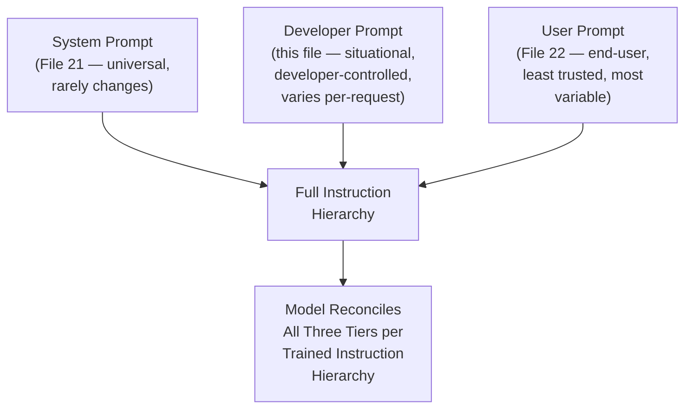
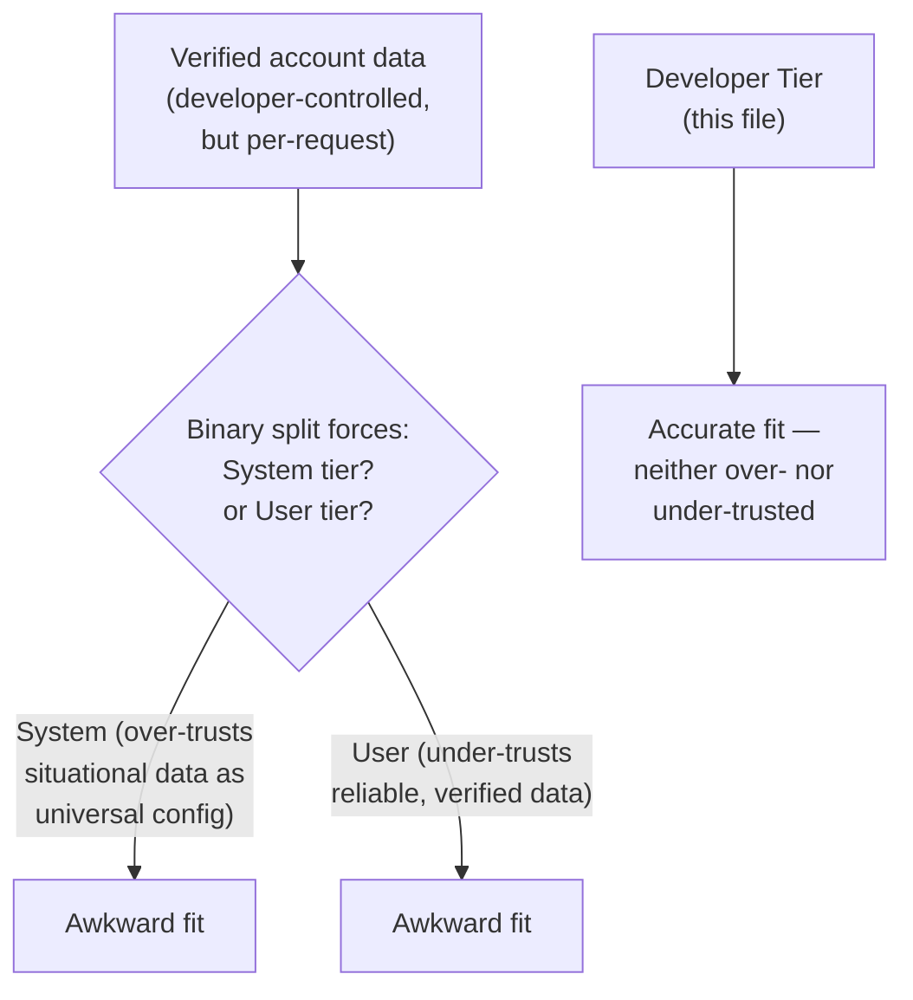
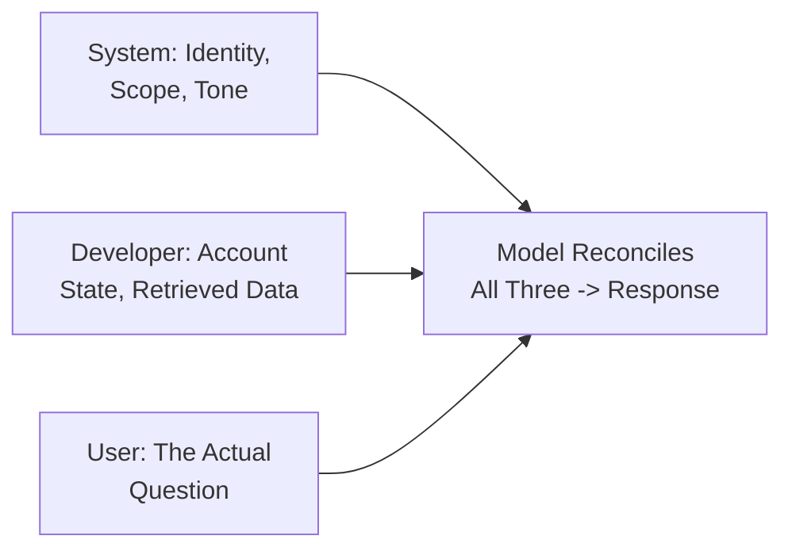

# 23 — Developer Prompts

> **Series:** Prompt Engineering Knowledge Library
> **File 23 of 60** | **Level:** Intermediate → Advanced
> **Prerequisites:** [`22_User_Prompts.md`](./22_User_Prompts.md)
> **Next:** [`24_Role_Prompting.md`](./24_Role_Prompting.md)

---

## Table of Contents

1. [Definition](#definition)
2. [Why It Matters](#why-it-matters)
3. [Core Concepts](#core-concepts)
4. [How It Works](#how-it-works)
5. [Internal Mechanism](#internal-mechanism)
6. [Types of Developer Prompt Content](#types-of-developer-prompt-content)
7. [Syntax / Structure](#syntax--structure)
8. [Examples (Simple → Advanced)](#examples-simple--advanced)
9. [Best Practices](#best-practices)
10. [Common Mistakes](#common-mistakes)
11. [Real-World Applications](#real-world-applications)
12. [Comparison with Related Concepts](#comparison-with-related-concepts)
13. [Advantages & Limitations](#advantages--limitations)
14. [FAQs](#faqs)
15. [Summary](#summary)
16. [Cheat Sheet](#cheat-sheet)
17. [Glossary](#glossary)
18. [References](#references)
19. [Visual Diagram Gallery](#visual-diagram-gallery)

---

## Definition

A **Developer Prompt** is a distinct instruction role, available in some model APIs and technical contexts, that sits conceptually between the [System Prompt](./21_System_Prompts.md) and [User Prompt](./22_User_Prompts.md) in the trust hierarchy — typically representing instructions from the application developer that are more specific and situational than broad system-level configuration, while still carrying higher trust priority than end-user input. Not every platform or API exposes this as a separate, named role — where it exists, it provides finer-grained control than a binary system/user split alone would allow.

> Where a system prompt might establish "you are a customer support assistant" once for an entire deployment, a developer prompt might inject "the customer's account tier is Premium and their last three tickets involved billing issues" — genuinely developer-controlled, trusted content, but tied to the specific situation rather than being universal, persistent configuration.

---

## Why It Matters

- **It enables finer-grained trust and priority control** than a simple two-tier system/user split, useful in sophisticated applications with layered configuration needs.
- **It separates "universal application configuration" from "situational, programmatically-injected context."** A system prompt rarely changes; developer-role content often varies per-request based on real-time application state, even though it's still fundamentally developer-controlled rather than end-user-authored.
- **It matters directly for building robust, secure applications** — understanding exactly which trust tier a given piece of content occupies is essential for correctly implementing the trust-hierarchy and injection-defense principles introduced in [File 21](./21_System_Prompts.md) and covered fully in [File 26](./26_Context_Injection.md).
- **It reflects an evolving, increasingly nuanced area of model API design** — as instruction-following research matures (see [File 27 — Instruction Following](./27_Instruction_Following.md)), more platforms are exploring exactly this kind of finer-grained role distinction beyond a simple binary.

---

## Core Concepts

| Concept | Definition |
|---|---|
| **Intermediate Trust Tier** | A priority level between system-level and user-level content |
| **Situational Injection** | Developer-controlled content that varies per-request based on real-time application state |
| **Programmatic Context** | Information inserted into a prompt by application code rather than typed directly by a human |
| **Instruction Hierarchy** | The broader, formalized concept of ranking instruction sources by trust/priority |
| **Dynamic Configuration** | Developer-role content that changes based on user account state, session history, or other real-time factors |

---

## How It Works



The developer prompt role exists specifically to fill the gap between "content that's fixed once at deployment time" (system) and "content the end user directly authors" (user) — situational, per-request context that's still fully within the application developer's control and trust, but that legitimately varies request to request based on real application state rather than being static configuration.

---

## Internal Mechanism

### Why an intermediate trust tier provides genuine value beyond a binary split

Recall from [File 21](./21_System_Prompts.md) that trust hierarchy is a trained model property, not an automatic architectural given. A pure binary system/user split forces a difficult choice for situational-but-developer-controlled content: either treat it with full system-level trust (potentially over-trusting content that, while developer-generated, might itself incorporate some user-influenced elements — e.g., a summary of the user's own prior messages) or treat it with only user-level trust (potentially under-trusting genuinely reliable, developer-verified application state like account tier or verified order history). A distinct intermediate tier resolves this tension directly, allowing an application to accurately signal "this is developer-controlled and generally reliable, but not the same category of foundational, universal configuration as the core system prompt" — a genuinely more precise trust signal than either binary alternative would allow.

### Why this finer-grained approach connects directly to broader instruction hierarchy research

The general concept of ranking instruction sources by trust and resolving conflicts between them accordingly — sometimes formalized as an "instruction hierarchy" in technical literature — extends naturally beyond just a two- or three-tier named-role split. The same underlying principle (more privileged sources should be harder to override than less privileged ones, and the model should be able to recognize and act on this distinction reliably) is what motivates ongoing research and product development in this area, including the general concept explored in [File 27 — Instruction Following](./27_Instruction_Following.md). A developer prompt role, where a specific platform provides it, is essentially one concrete, currently-available implementation of this broader instruction hierarchy concept in practice.

---

## Types of Developer Prompt Content

| Content Type | Purpose | Example |
|---|---|---|
| **Account/Session State** | Injects real-time user account information | "Account tier: Premium. Account age: 3 years." |
| **Retrieved Context** | Injects content fetched from a database or knowledge base | "Relevant knowledge base article: [retrieved content]" |
| **Prior Interaction Summary** | Summarizes earlier session/conversation history | "Customer previously reported a billing issue, resolved on [date]." |
| **Feature Flags/Configuration** | Signals which application features/modes are currently active | "Beta feature X is enabled for this user." |
| **Situational Constraints** | Request-specific rules that don't belong in universal system config | "This is a time-sensitive request — prioritize brevity in the response." |

---

## Syntax / Structure

Where a platform supports a distinct developer role, it's typically expressed as a separate message role in an API call structure, conceptually similar to but distinct from the system role:

```json
{
  "messages": [
    {"role": "system", "content": "You are Acme Corp's support assistant. [universal, persistent configuration per File 21]"},
    {"role": "developer", "content": "Customer account tier: Premium. Account age: 3 years. Last contact: billing issue, resolved 2026-05-01."},
    {"role": "user", "content": "Hi, I have a question about my last order."}
  ]
}
```

On platforms without a distinct developer role, the same conceptual separation can still be achieved structurally within the system prompt itself, using clear internal delimiting:

```xml
<system>
<universal_config>
[Persistent identity, scope, tone — rarely changes]
</universal_config>

<situational_context trust="developer_verified">
[Per-request injected context: account tier, retrieved data, etc.]
</situational_context>
</system>
```

---

## Examples (Simple → Advanced)

**Level 1 — Basic developer-role content (account context):**
```text
[Developer role] Customer's order history: 3 orders, most 
recent delivered 2026-06-01, no returns.
```

**Level 2 — Retrieved knowledge base context:**
```text
[Developer role] Relevant policy excerpt (retrieved via search): 
"Standard returns are accepted within 30 days of delivery."
```

**Level 3 — Combining account state and retrieved context:**
```text
[Developer role] 
Account tier: Standard.
Retrieved policy: "Standard tier: 30-day returns. Premium 
tier: 60-day returns."
Order delivered: 2026-05-15 (22 days ago, per current date).
```

**Level 4 — Situational constraint alongside context:**
```text
[Developer role]
Customer account flagged as high-priority escalation (3rd 
contact this week on the same issue).
Situational instruction: Prioritize a definitive resolution 
or clear escalation path in this response — avoid generic 
troubleshooting steps already covered in prior contacts.
```

**Level 5 — Full three-tier example showing the complete hierarchy in action:**
```json
{
  "messages": [
    {"role": "system", "content": "You are Aria, Acme's support assistant. Scope: orders, products, accounts. Tone: warm, professional. [Universal, per File 21]"},
    {"role": "developer", "content": "Account: Premium tier, 3yr customer. Order #4471 delivered 2026-05-15. Retrieved policy: Premium tier gets 60-day returns. [Situational, verified, per this file]"},
    {"role": "user", "content": "Can I return the item from my last order? It's been about 3 weeks."}
  ]
}
```
*(The model reconciles: system scope confirms this is in-bounds; developer context provides the verified, specific facts — Premium tier, 60-day window, 3 weeks elapsed; user prompt provides the actual question. The developer-tier content is what allows a precise, confident answer — "Yes, you're well within your 60-day return window" — rather than a generic, hedged response.)*

---

## Best Practices

1. **Use a developer tier (where available) for genuinely situational, per-request, developer-controlled content** — not as a dumping ground for content that actually belongs in the more stable system prompt.
2. **Clearly distinguish developer-injected content from user-authored content**, even when a platform doesn't offer a distinct named role — internal delimiting and trust-labeling (as in the Syntax section's XML example) can achieve similar separation.
3. **Verify the actual reliability of developer-tier content before trusting it as such** — if "developer context" is itself partly derived from unverified user input (e.g., an unvalidated user-provided account number), it may not deserve the elevated trust this tier implies.
4. **Keep developer-tier content genuinely relevant to the current request** — avoid bloating it with excessive, only-tangentially-relevant application state that dilutes the model's attention on what actually matters for this specific turn.
5. **Test the full three-tier interaction**, not just system and user prompts in isolation, particularly for applications where developer-injected context significantly shapes expected responses.

---

## Common Mistakes

| Mistake | Consequence | Fix |
|---|---|---|
| Treating unverified, user-influenced data as fully-trusted developer content | Inappropriately elevated trust for content that isn't actually reliable | Verify actual data provenance before trust-labeling it as developer-tier |
| Using developer-tier content for genuinely universal, static configuration | Redundant, harder-to-maintain duplication of what belongs in the system prompt | Keep universal config in the system prompt; use developer tier for genuinely situational content |
| Overloading developer context with excessive, low-relevance application state | Diluted attention on what's actually important for the current request | Keep developer-tier content focused and genuinely relevant per-request |
| Assuming every platform provides a distinct developer role | Confusion or miscommunication when working across different model providers/APIs | Recognize this as an available-where-supported feature, using structural workarounds where it's absent |
| Not testing the full three-tier interaction together | Missing issues that only emerge from the interplay between all three content sources | Test system + developer + user content combinations explicitly |

---

## Real-World Applications

- **Personalized customer support systems** — injecting real-time account state, order history, or prior interaction summaries as developer-tier content is a common, high-value pattern.
- **RAG (Retrieval-Augmented Generation) systems** — retrieved knowledge base content is frequently injected precisely at this intermediate trust tier, distinct from both static system configuration and user input.
- **Multi-agent and orchestrated AI systems** — when one system component passes verified, structured context to a model call (as opposed to raw, unstructured user input), a developer-tier-style trust level is often the appropriate conceptual fit.
- **Enterprise applications with complex, layered configuration needs** — larger, more sophisticated deployments frequently benefit from finer-grained trust distinctions than a simple system/user binary provides.

---

## Comparison with Related Concepts

| Concept | Difference from "Developer Prompts" |
|---|---|
| **System Prompts (File 21)** | System prompts are universal, persistent, rarely-changing configuration; developer prompts are situational, per-request, developer-controlled content that still commands elevated trust but isn't foundational, static configuration |
| **User Prompts (File 22)** | User prompts are directly end-user-authored and typically least trusted; developer prompts, while sometimes containing information *about* the user (account state), are themselves developer-controlled and verified, warranting higher trust |
| **Context Injection (File 26)** | Context injection covers the general security dynamics of external content entering a prompt; the developer tier is one specific, deliberately-designed mechanism for safely incorporating verified situational context, as opposed to the more adversarial-risk scenario of unverified injected content |

---

## Advantages & Limitations

### ✅ Advantages of a Distinct Developer Tier

- **Enables finer-grained, more accurate trust signaling** than a binary system/user split alone provides.
- **Supports rich personalization and situational awareness** without compromising the stability of universal system configuration.
- **Reflects and applies genuine instruction hierarchy principles** in a practical, currently-available form.

### ⚠️ Limitations

- **Not universally supported** — many platforms and APIs offer only a simpler system/user structure, requiring workaround approaches (structural delimiting) to achieve similar separation.
- **Requires careful data provenance verification** — mislabeling unverified or user-influenced content as trusted "developer" content undermines the entire purpose of the tier.
- **Adds genuine complexity** — a three-tier (or more) trust structure is more sophisticated to design, test, and reason about than a simpler binary split, which may not be justified for simpler applications.

---

## FAQs

**Q: Do I need a distinct developer prompt tier for a simple application?**
A: Not necessarily — for straightforward applications without significant situational, per-request context needs, a well-designed system/user split (Files 21-22) is often entirely sufficient; the developer tier's value is most clear in more sophisticated, personalized, or context-rich applications.

**Q: What happens if my platform doesn't offer a distinct "developer" role?**
A: The underlying principle (distinguishing static universal configuration from situational developer-verified context) can still be achieved structurally, using clear internal delimiting and trust-labeling within the system prompt, as shown in this file's Syntax section.

**Q: How is "developer prompt" different from what File 5 called the "context" component?**
A: Related but different scope — [File 5](./05_Prompt_Components.md)'s "context" component is a general concept applicable within any single prompt; "developer prompt" (this file) is specifically about a distinct *role/trust tier* in a multi-message conversation structure, which situational context is often delivered through.

**Q: Should retrieved RAG content always go in the developer tier?**
A: Generally yes, where available, since it's typically developer-verified (the retrieval process is application-controlled) rather than directly user-authored — though the specific trust level should still reflect the actual reliability of the retrieval and verification process in a given system.

---

## Summary

A Developer Prompt is a distinct instruction role, available on some platforms, occupying an intermediate trust tier between the universal, persistent [System Prompt](./21_System_Prompts.md) and the variable, less-trusted [User Prompt](./22_User_Prompts.md) — designed specifically for situational, per-request, developer-controlled content like verified account state, retrieved knowledge base data, or prior interaction summaries. This finer-grained trust distinction resolves a genuine tension a simple binary split creates, allowing applications to accurately signal that certain content is developer-verified and reliable without conflating it with truly foundational, rarely-changing system configuration — directly reflecting broader instruction hierarchy principles explored further in [File 27 — Instruction Following](./27_Instruction_Following.md). Having now covered all three prompt source/role categories relevant to a typical conversation structure, the library turns to a specific, powerful *technique* often implemented across any of these roles: [File 24 — Role Prompting](./24_Role_Prompting.md).

---

## Cheat Sheet

```text
DEVELOPER PROMPTS — QUICK REFERENCE

THE THREE-TIER HIERARCHY (where supported)
System    -> Universal, persistent, rarely changes (File 21)
Developer -> Situational, per-request, developer-verified (this file)
User      -> End-user authored, most variable, least trusted (File 22)

TYPICAL DEVELOPER-TIER CONTENT
[ ] Account/session state
[ ] Retrieved (RAG) context
[ ] Prior interaction summaries
[ ] Feature flags/configuration
[ ] Situational, per-request constraints

VERIFICATION RULE: Only trust-label content as "developer tier" 
if it's genuinely developer-verified — not if it's actually 
unverified or user-influenced data in disguise.
```

---

## Glossary

| Term | Definition |
|---|---|
| **Intermediate Trust Tier** | A priority level between system-level and user-level content |
| **Situational Injection** | Developer-controlled content varying per-request based on real-time state |
| **Programmatic Context** | Information inserted by application code, not typed directly by a human |
| **Instruction Hierarchy** | The formalized concept of ranking instruction sources by trust/priority |
| **Dynamic Configuration** | Developer-role content that changes based on real-time factors |

---

## References

- Wallace, E. et al. (2024) — *The Instruction Hierarchy: Training LLMs to Prioritize Privileged Instructions*, arXiv:2404.13208
- OpenAI — [Developer Messages in the API](https://platform.openai.com/docs/guides/text-generation)
- Anthropic — [Prompt Engineering Overview](https://docs.claude.com/en/docs/build-with-claude/prompt-engineering/overview)
- Lewis, P. et al. (2020) — *Retrieval-Augmented Generation for Knowledge-Intensive NLP Tasks*, arXiv:2005.11401 (RAG context relevance)

---

## Visual Diagram Gallery

**Diagram 1 — The Three-Tier Trust Hierarchy**
```text
┌─────────────────────────────────────────┐
│  SYSTEM       — universal, persistent     │  (File 21)
├─────────────────────────────────────────┤
│  DEVELOPER    — situational, verified,    │  (this file)
│                 per-request                │
├─────────────────────────────────────────┤
│  USER         — end-user authored,        │  (File 22)
│                 most variable              │
└─────────────────────────────────────────┘
```

**Diagram 2 — Why a Binary Split Creates Tension (resolved by the middle tier)**


**Diagram 3 — A Full Request's Three-Tier Composition**


---

**⬅️ Previous:** [`22_User_Prompts.md`](./22_User_Prompts.md)
**➡️ Next:** [`24_Role_Prompting.md`](./24_Role_Prompting.md) — The technique of assigning a persona or perspective, applicable across any of these prompt roles.
