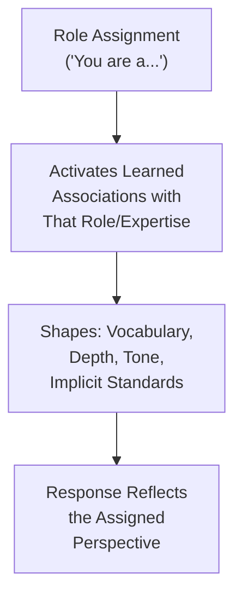
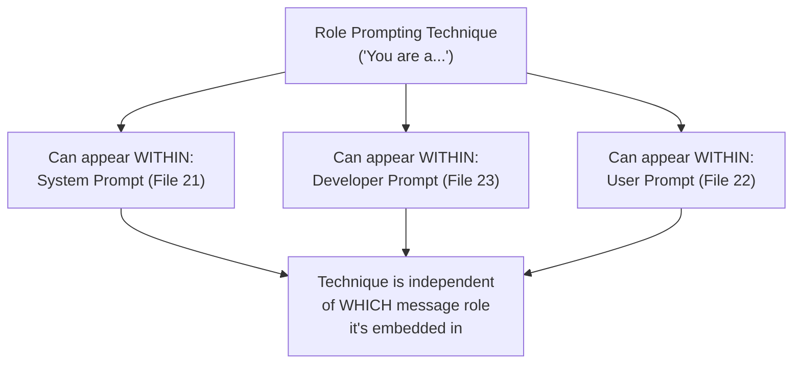
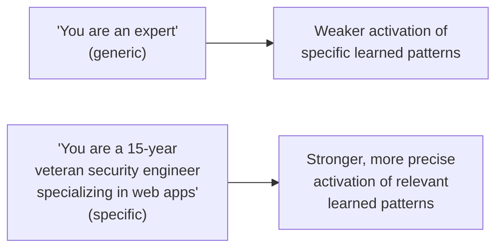

# 24 — Role Prompting

> **Series:** Prompt Engineering Knowledge Library
> **File 24 of 60** | **Level:** Intermediate
> **Prerequisites:** [`23_Developer_Prompts.md`](./23_Developer_Prompts.md)
> **Next:** [`25_Context_Management.md`](./25_Context_Management.md)

---

## Table of Contents

1. [Definition](#definition)
2. [Why It Matters](#why-it-matters)
3. [Core Concepts](#core-concepts)
4. [How It Works](#how-it-works)
5. [Internal Mechanism](#internal-mechanism)
6. [Types of Role Prompting](#types-of-role-prompting)
7. [Syntax / Structure](#syntax--structure)
8. [Examples (Simple → Advanced)](#examples-simple--advanced)
9. [Best Practices](#best-practices)
10. [Common Mistakes](#common-mistakes)
11. [Real-World Applications](#real-world-applications)
12. [Comparison with Related Concepts](#comparison-with-related-concepts)
13. [Advantages & Limitations](#advantages--limitations)
14. [FAQs](#faqs)
15. [Summary](#summary)
16. [Cheat Sheet](#cheat-sheet)
17. [Glossary](#glossary)
18. [References](#references)
19. [Visual Diagram Gallery](#visual-diagram-gallery)

---

## Definition

**Role Prompting** is the specific technique of assigning a model a persona, perspective, or area of expertise — "You are an experienced tax attorney," "Respond as a skeptical scientific peer reviewer" — to shape the tone, framing, and depth of its responses. This is deliberately distinct from [Files 21–23](./21_System_Prompts.md)'s coverage of *message roles* (system/developer/user, the structural conversation-position categories) — role prompting is a *content technique* that can be applied within any of those message roles, most commonly within a system prompt, but not exclusively so.

> Disambiguation, since the terminology overlaps: **"role" in Files 21-23** means *which conversational slot a message occupies* (system, developer, or user). **"Role" in this file** means *what persona or perspective the model is asked to adopt* within its response. A single system prompt can use role-prompting technique ("You are an expert...") while itself occupying the system message-role.

---

## Why It Matters

- **It's one of the most widely used and empirically effective prompting techniques**, directly shaping tone, vocabulary sophistication, and the implicit standards a response is held to.
- **It provides an efficient shorthand for complex, hard-to-fully-specify requirements.** "Respond as a senior software architect reviewing this code" efficiently conveys a whole cluster of expectations (depth, technical vocabulary, attention to scalability/maintainability) that would take much longer to enumerate explicitly.
- **It directly connects to the component-level treatment in [File 5](./05_Prompt_Components.md)** — this file provides the full, dedicated treatment of the "role/persona" component introduced there.
- **It has documented, genuine effects on output quality and style** for many tasks, making it a core technique worth understanding deeply rather than treating as a superficial flourish.

---

## Core Concepts

| Concept | Definition |
|---|---|
| **Persona** | The specific character, expertise, or identity assigned to the model |
| **Perspective Framing** | Shaping a response through a particular viewpoint or lens |
| **Expertise Invocation** | Assigning a specific domain expertise to shape response depth/vocabulary |
| **Audience Simulation** | Using role assignment to implicitly define the standards a response should meet |
| **Role Consistency** | Maintaining a coherent persona throughout a response or conversation |
| **Role Limitation** | The boundary of what role assignment can and cannot genuinely achieve (see Limitations) |

---

## How It Works



Role prompting works by leveraging the vast amount of role-associated text patterns present in a model's training data — text written by or about doctors, lawyers, teachers, skeptical reviewers, and countless other roles carries characteristic vocabulary, structural conventions, and implicit standards that the model has learned to associate with that role, and assigning the role activates those learned associations.

---

## Internal Mechanism

### Why role prompting works: activating learned distributional patterns, not genuine expertise acquisition

It's important to be mechanistically precise about what role prompting actually does. As established in [File 4](./04_How_LLMs_Interpret_Prompts.md), the model's behavior is shaped by learned statistical patterns from training data. Assigning a role like "expert tax attorney" doesn't grant the model new knowledge or capabilities it didn't already have — instead, it shifts the model's output *distribution* toward patterns statistically associated with that role in its training data: more precise legal terminology, more caveats about jurisdiction-specific variation, a more formal register. This distinction matters practically: role prompting can reliably improve *how* a response is framed, styled, and structured, but it cannot manufacture genuine expertise or factual knowledge the underlying model doesn't actually possess — a critical limitation covered further below.

### Why role prompting particularly affects implicit standards, not just explicit style

A subtler but important effect: assigning a role often shifts not just surface style but the *implicit bar* a response is held to. Asking a model to respond "as a careful peer reviewer" doesn't just add reviewer-like vocabulary — it tends to activate learned patterns around what careful peer review characteristically *does*: identifying potential weaknesses, asking clarifying questions, avoiding overstatement. This is why role prompting is often more effective for shaping the *substantive character* of a response (its rigor, its caution, its thoroughness) than techniques focused purely on explicit formatting or length constraints alone — it's tapping into a richer, more holistic learned pattern than a narrow style instruction would.

---

## Types of Role Prompting

| Type | Description | Example |
|---|---|---|
| **Professional Expertise Role** | Assigns a specific professional domain expertise | "You are an experienced pediatrician." |
| **Perspective/Stance Role** | Assigns a particular viewpoint or critical stance | "Respond as a skeptical fact-checker." |
| **Audience-Calibration Role** | Uses role assignment to implicitly set the target audience's level | "Explain this as if teaching a bright high schooler." |
| **Character/Persona Role** | Assigns a specific fictional or stylized character/voice | "Write this in the voice of an enthusiastic nature documentarian." |
| **Functional Role** | Assigns a specific task-oriented function rather than a broad identity | "Act as a strict grammar and style editor." |
| **Multi-Role/Panel Role** | Assigns multiple distinct roles for a comparative or dialectical response | "Provide both a proponent's and a skeptic's perspective." |

---

## Syntax / Structure

Role prompting is typically expressed as a direct, early statement, often but not exclusively within a system prompt:

```text
You are [ROLE/PERSONA]. [Optional: additional context about 
the role's specific relevant experience/perspective.]

[The actual task/instruction]
```

```text
# Simple version
You are a patient, encouraging math tutor for middle school 
students.

Explain how to solve for x in: 2x + 5 = 15
```

```text
# Richer version with role-specific context
You are a senior security engineer conducting a code review. 
You have 15 years of experience specifically in web application 
security and are known for catching subtle vulnerabilities 
others miss.

Review the following code for security issues: [code]
```

---

## Examples (Simple → Advanced)

**Level 1 — Basic role assignment:**
```text
You are a friendly chef. Suggest a simple dinner recipe.
```

**Level 2 — Role affecting depth/vocabulary:**
```text
You are a professional nutritionist. Explain the health 
benefits of a balanced dinner including protein, vegetables, 
and whole grains.
```

**Level 3 — Perspective/stance role shaping critical approach:**
```text
You are a skeptical restaurant critic. Evaluate this recipe 
idea, being honest about any potential weaknesses: [recipe idea]
```

**Level 4 — Audience-calibration role for teaching:**
```text
You are an experienced cooking instructor teaching complete 
beginners. Explain how to properly dice an onion, anticipating 
common beginner mistakes and being encouraging about the 
learning process.
```

**Level 5 — Multi-role panel for a balanced, dialectical response:**
```text
Provide two perspectives on meal-prepping for the week:

[ROLE 1] As a busy working parent who values efficiency: 
what are the practical benefits?

[ROLE 2] As a chef who values fresh, made-to-order cooking: 
what are the genuine trade-offs or drawbacks?

Present both perspectives fairly, without favoring one.
```

---

## Best Practices

1. **Use role prompting to shape tone, depth, and implicit standards, not to manufacture facts the model doesn't have** — per the Internal Mechanism section, it activates learned patterns, it doesn't grant new knowledge.
2. **Match role specificity to the actual need** — "expert" alone is often less effective than a more specific, characteristic role ("15-year veteran security engineer specializing in web applications") that activates richer, more precise learned associations.
3. **Combine role prompting with other patterns when appropriate** ([File 19](./19_Prompt_Patterns.md)) — role assignment and chain-of-thought, for instance, can work well together for tasks requiring both expert framing and careful reasoning.
4. **Consider multi-role/panel prompting for genuinely balanced, dialectical tasks** where a single perspective would be insufficient (Level 5 above).
5. **Verify factual claims independently when a role prompt is used for a knowledge-dependent task** — remember role prompting shapes framing and style, not underlying factual reliability.

---

## Common Mistakes

| Mistake | Consequence | Fix |
|---|---|---|
| Assuming role assignment grants genuine new expertise/knowledge | Overconfidence in factual accuracy that role framing alone doesn't guarantee | Treat role prompting as a style/framing tool, verify facts independently |
| Using overly generic role labels ("expert," "professional") | Weaker activation of specific, useful learned associations | Use more specific, characteristic role descriptions |
| Applying an inconsistent or contradictory role mid-response | Confused, inconsistent output tone/style | Maintain role consistency throughout ([File 9](./09_Prompt_Design_Principles.md)'s consistency principle) |
| Using role prompting where it doesn't genuinely serve the task | Unnecessary complexity with limited actual benefit | Reserve role prompting for tasks where tone/perspective genuinely matters |
| Assuming role prompting alone resolves need for factual verification | Downstream errors from treating styled-but-unverified output as authoritative | Combine with appropriate validation ([File 30](./30_Response_Validation.md)) for high-stakes factual tasks |

---

## Real-World Applications

- **Educational and tutoring applications** — audience-calibration roles ("explain as if to a beginner") are widely used to appropriately pitch explanations.
- **Professional writing and communication tools** — expertise roles help produce appropriately register-matched content (legal, medical, technical) while still requiring human review for factual accuracy in high-stakes domains.
- **Content review and critique tools** — perspective/stance roles (skeptical reviewer, careful editor) are commonly used to elicit more critical, thorough feedback than a neutral request might.
- **Creative writing and entertainment applications** — character/persona roles are foundational to many creative and conversational AI applications with a distinctive voice.

---

## Comparison with Related Concepts

| Concept | Difference from "Role Prompting" |
|---|---|
| **System/Developer/User Prompts (Files 21-23)** | Those files cover the structural *message-role* categories (which conversational slot content occupies); this file covers a *content technique* (persona/perspective assignment) that can be applied within any of those message roles |
| **Prompt Components (File 5)** | File 5 briefly introduced "role/persona" as one component type; this file provides the full, dedicated technical treatment of that specific component |
| **Prompt Patterns (File 19)** | Role prompting is itself one specific, named pattern among the broader catalog covered in File 19 — this file provides deeper, focused coverage of this particular pattern |

---

## Advantages & Limitations

### ✅ Advantages of Role Prompting

- **Efficiently conveys complex, hard-to-enumerate expectations** through a single, concise role assignment.
- **Genuinely shapes implicit response standards**, not just surface style — often more effective than narrow, purely stylistic instructions.
- **Widely applicable and easy to combine** with other techniques and patterns.

### ⚠️ Limitations

- **Does not grant genuine new knowledge or expertise** — this is the single most important limitation to understand, per the Internal Mechanism section; role prompting shapes framing, not underlying factual reliability.
- **Effectiveness varies by task and role specificity** — generic role labels tend to produce weaker effects than specific, characteristic ones.
- **Can occasionally produce stylistic overcommitment** — an assigned role, if not well-calibrated, can sometimes lead to responses that prioritize sounding appropriately "in character" over substantive accuracy or directness, warranting awareness and testing.

---

## FAQs

**Q: Does telling a model "you are a doctor" make its medical advice more accurate?**
A: Not necessarily in terms of underlying factual accuracy — per the Internal Mechanism section, role prompting shapes tone, vocabulary, and framing (e.g., more appropriately cautious, more clinically precise language) more reliably than it improves the actual correctness of medical facts, which depends on the model's underlying knowledge, not the role framing.

**Q: Is a more elaborate, detailed role description always better than a simple one?**
A: Not automatically — while specific, characteristic roles (Best Practices point 2) tend to outperform generic ones, excessive, irrelevant role backstory can also dilute focus without adding genuine value; match role detail to what's actually relevant to the task.

**Q: Can role prompting be used within a user prompt, not just a system prompt?**
A: Yes — while role prompting is commonly placed in system prompts for persistent effect ([File 21](./21_System_Prompts.md)), it's equally applicable within an individual user prompt for a one-off, turn-specific role request.

**Q: How does role prompting interact with a system prompt that already defines a different persona?**
A: This can create tension or ambiguity if not handled carefully — per the trust hierarchy discussion in [File 21](./21_System_Prompts.md), system-level role/persona definitions generally take precedence, and a well-designed application should anticipate and resolve potential conflicts between a system-level persona and any role-prompting attempted within a user turn.

---

## Summary

Role Prompting is the specific technique of assigning a model a persona, expertise, or perspective to shape tone, vocabulary, depth, and implicit response standards — distinct from the structural message-role categories (system, developer, user) covered in [Files 21–23](./21_System_Prompts.md), since role prompting is a content technique applicable within any of those structural roles. Mechanistically, role assignment shifts a model's output toward learned patterns statistically associated with the assigned role in its training data, making it genuinely effective for shaping framing, tone, and implicit standards — but importantly, it does not grant new knowledge or manufacture genuine expertise the underlying model doesn't already possess, a distinction that should guide when and how the technique is applied, especially for knowledge-dependent tasks. Having now covered the full landscape of prompt roles, sources, and this key persona-assignment technique, the library turns to a foundational, practical concern spanning all of them: how information is managed and preserved within a model's finite context window over time — [File 25 — Context Management](./25_Context_Management.md).

---

## Cheat Sheet

```text
ROLE PROMPTING — QUICK REFERENCE

WHAT IT DOES
Shapes: tone, vocabulary, depth, implicit standards
Does NOT: grant new knowledge or guarantee factual accuracy

TYPES
Professional Expertise | Perspective/Stance | Audience-Calibration | 
Character/Persona | Functional | Multi-Role/Panel

BEST PRACTICE: Specific, characteristic roles ("15-year veteran 
security engineer") outperform generic labels ("expert").

REMEMBER: Role prompting ≠ Message roles (Files 21-23).
"Role" here = persona/perspective TECHNIQUE, applicable within 
ANY message role (system, developer, or user).
```

---

## Glossary

| Term | Definition |
|---|---|
| **Persona** | The specific character, expertise, or identity assigned to the model |
| **Perspective Framing** | Shaping a response through a particular viewpoint or lens |
| **Expertise Invocation** | Assigning domain expertise to shape response depth/vocabulary |
| **Audience Simulation** | Using role assignment to implicitly define response standards |
| **Role Consistency** | Maintaining a coherent persona throughout a response |
| **Role Limitation** | The boundary of what role assignment can genuinely achieve |

---

## References

- Anthropic — [Give Claude a Role with a System Prompt](https://docs.claude.com/en/docs/build-with-claude/prompt-engineering/system-prompts)
- Kong, A. et al. (2023) — *Better Zero-Shot Reasoning with Role-Play Prompting*, arXiv:2308.07702
- White, J. et al. (2023) — *A Prompt Pattern Catalog to Enhance Prompt Engineering with ChatGPT*, arXiv:2302.11382
- Shanahan, M. et al. (2023) — *Role-Play with Large Language Models*, arXiv:2305.16367

---

## Visual Diagram Gallery

**Diagram 1 — Role Prompting Across Different Message Roles**


**Diagram 2 — What Role Prompting Shifts vs. What It Doesn't**
```text
SHIFTS (reliably):              DOES NOT SHIFT (reliably):
- Vocabulary/register            - Underlying factual knowledge
- Tone/formality                 - Genuine domain expertise
- Implicit standards/rigor       - Accuracy of specific claims
- Structural conventions          (still requires verification)
```

**Diagram 3 — Generic vs. Specific Role Effectiveness**


---

**⬅️ Previous:** [`23_Developer_Prompts.md`](./23_Developer_Prompts.md)
**➡️ Next:** [`25_Context_Management.md`](./25_Context_Management.md) — Managing information within a model's finite context window.
