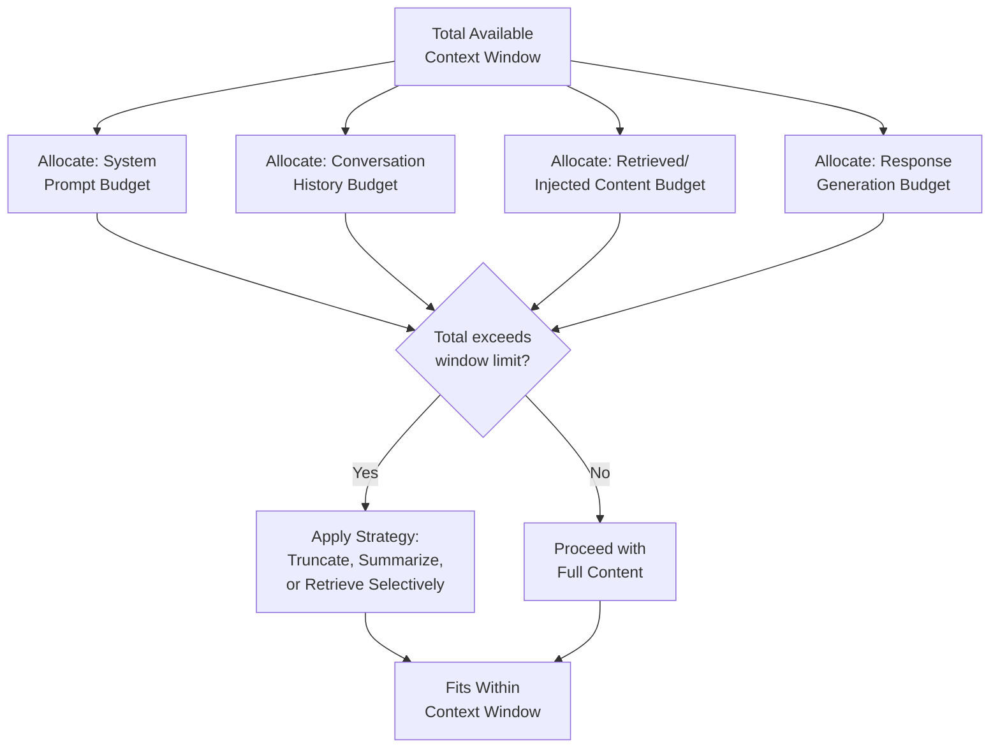
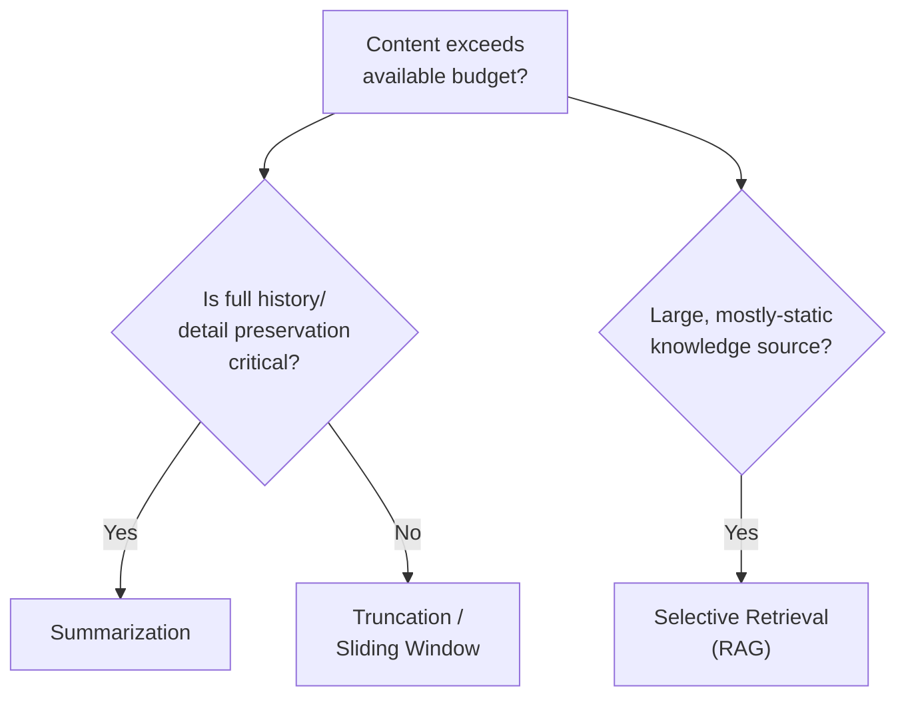
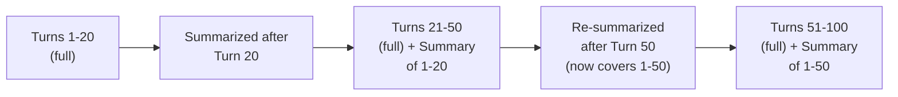

# 25 — Context Management

> **Series:** Prompt Engineering Knowledge Library
> **File 25 of 60** | **Level:** Intermediate → Advanced
> **Prerequisites:** [`24_Role_Prompting.md`](./24_Role_Prompting.md)
> **Next:** [`26_Context_Injection.md`](./26_Context_Injection.md)

---

## Table of Contents

1. [Definition](#definition)
2. [Why It Matters](#why-it-matters)
3. [Core Concepts](#core-concepts)
4. [How It Works](#how-it-works)
5. [Internal Mechanism](#internal-mechanism)
6. [Types of Context Management Strategies](#types-of-context-management-strategies)
7. [Syntax / Structure](#syntax--structure)
8. [Examples (Simple → Advanced)](#examples-simple--advanced)
9. [Best Practices](#best-practices)
10. [Common Mistakes](#common-mistakes)
11. [Real-World Applications](#real-world-applications)
12. [Comparison with Related Concepts](#comparison-with-related-concepts)
13. [Advantages & Limitations](#advantages--limitations)
14. [FAQs](#faqs)
15. [Summary](#summary)
16. [Cheat Sheet](#cheat-sheet)
17. [Glossary](#glossary)
18. [References](#references)
19. [Visual Diagram Gallery](#visual-diagram-gallery)

---

## Definition

**Context Management** is the practice of deliberately deciding what information to include, exclude, summarize, or retrieve within a model's finite context window — across a single prompt, a multi-turn conversation, or a complex application — to ensure the model has what it genuinely needs without exceeding available space or diluting attention on what matters most. This file covers the general *"what to include and how to fit it"* concern; [File 26 — Context Injection](./26_Context_Injection.md) that follows narrows specifically to the *security* dimension of inserting external, potentially untrusted content into that managed context.

> Context management directly confronts a hard, mechanical constraint established back in [File 4](./04_How_LLMs_Interpret_Prompts.md): the context window is finite, and the model has no persistent memory beyond what's actually present in that window at generation time.

---

## Why It Matters

- **The context window is a genuinely hard, finite constraint.** Unlike many software resource constraints that can simply be scaled up, a model's context window has an absolute maximum size, and content exceeding it is either truncated or rejected entirely.
- **More context isn't always better**, directly connecting to [File 9](./09_Prompt_Design_Principles.md)'s conciseness/context-sufficiency tension and [File 6](./06_Prompt_Anatomy.md)'s primacy/recency discussion — poorly managed, excessive context can dilute attention on what's actually load-bearing.
- **Multi-turn conversations accumulate context rapidly.** Without deliberate management, a long conversation can exhaust the available context window, or degrade quality well before hitting that hard limit.
- **It directly enables sophisticated, information-rich applications** (RAG systems, long document analysis, extended agentic workflows) that would be impossible without deliberate strategies for managing what fits, what's retrieved, and what's summarized.

---

## Core Concepts

| Concept | Definition |
|---|---|
| **Context Window** | The finite total space (measured in tokens) available for prompt plus response |
| **Context Budget** | The deliberate allocation of available context space across different content needs |
| **Truncation** | Cutting off content that exceeds available context space |
| **Summarization** | Condensing lengthy content to preserve key information within less space |
| **Retrieval** | Dynamically fetching only the most relevant subset of a larger information store |
| **Context Window Utilization** | How efficiently available context space is being used relative to its limit |

---

## How It Works



Context management is fundamentally a budgeting and allocation problem — with a fixed total resource (the context window) that must be distributed across multiple, often competing needs (persistent instructions, conversation history, task-specific data, and space reserved for the response itself), deliberate strategy is required once naive inclusion of everything available would exceed that fixed budget.

---

## Internal Mechanism

### Why naive "include everything" strategies fail even before hitting the hard limit

It's tempting to think context management only matters once you're at genuine risk of exceeding the absolute context window size — but this understates the issue. As discussed in [File 6](./06_Prompt_Anatomy.md)'s primacy/recency discussion, and connecting to documented "lost in the middle" phenomena in long-context research, model attention doesn't necessarily weight all included content equally, even well within the hard size limit. Simply including large volumes of marginally-relevant content — even when it technically fits — can dilute the model's effective attention on the genuinely critical instructions and data, degrading response quality well before the hard truncation limit is ever reached. This is precisely why context management is a genuine skill, not merely a matter of "cramming in as much as technically fits."

### Why summarization introduces a specific, important information-loss trade-off

Summarization is a powerful context management tool precisely because it compresses lengthy content into much less space — but this compression is not free; it inherently discards some information, by design. The critical judgment call is whether the *specific* information being discarded in a given summarization pass is actually irrelevant to the task at hand, or whether it's information that might later prove necessary but wasn't anticipated as important at summarization time. This is a genuine, unavoidable risk: an overly aggressive summarization strategy optimized for the current turn's apparent needs can inadvertently discard details that a later turn in the same conversation would have needed, a specific failure mode worth deliberately testing for in any application relying heavily on conversation summarization.

---

## Types of Context Management Strategies

| Strategy | Description | Best Suited For |
|---|---|---|
| **Full Inclusion** | Including all available content without reduction | Short conversations/tasks well within context window limits |
| **Truncation** | Cutting off oldest or least relevant content when space runs short | Simple, lower-stakes long conversations where recent context matters most |
| **Summarization** | Condensing prior content into a shorter representation | Long conversations/documents where full detail preservation isn't critical |
| **Selective Retrieval (RAG)** | Dynamically fetching only the most relevant subset of a larger corpus | Large knowledge bases where only a small relevant fraction is needed per query |
| **Sliding Window** | Retaining only the most recent N turns/tokens, discarding older content | Conversations where only recent context is genuinely relevant |
| **Hierarchical Summarization** | Periodically re-summarizing already-summarized content to manage very long sessions | Extended agentic workflows or very long-running conversations |

---

## Syntax / Structure

Context management decisions are typically implemented at the application/system level, not expressed as prompt text itself, but the resulting structure is visible:

```yaml
# Example: a context budget allocation policy
context_window_limit: 200000 tokens
allocation_policy:
  system_prompt: "~2000 tokens (fixed)"
  conversation_history: "up to 50000 tokens, then triggers 
                          summarization of oldest turns"
  retrieved_documents: "up to 100000 tokens, selected via 
                        relevance ranking, most relevant first"
  response_reserve: "~20000 tokens reserved, never consumed 
                     by input content"
overflow_strategy: "Summarize oldest conversation turns first; 
                     if still over budget, reduce retrieved 
                     document count by relevance rank"
```

---

## Examples (Simple → Advanced)

**Level 1 — Simple, no management needed:**
```text
[A short, single-turn question well within any context limit]
"What's the capital of Brazil?"
(No context management strategy needed — trivially fits.)
```

**Level 2 — Basic truncation for a growing conversation:**
```text
[After 30 turns, conversation history approaches a soft limit]
Strategy applied: Keep the system prompt + most recent 15 turns; 
drop the oldest 15 turns entirely.
```

**Level 3 — Summarization instead of raw truncation:**
```text
[Same 30-turn conversation]
Strategy applied: Summarize turns 1-15 into a 200-word summary 
("User initially asked about X, then explored Y, key decision 
made was Z..."), retain turns 16-30 in full.
(Preserves key information from early turns, unlike pure 
truncation which would discard it entirely.)
```

**Level 4 — Selective retrieval (RAG) for a large knowledge base:**
```text
[A 10,000-page internal documentation corpus — far too large 
to include in full]
Strategy applied: On each user question, retrieve only the 
top 5 most relevant document chunks (via semantic search), 
include only those in the prompt, discard the rest of the 
corpus entirely for this specific request.
```

**Level 5 — Combined, hierarchical strategy for an extended agentic session:**
```yaml
Extended multi-hour agentic coding session:
Turn 1-20: Full inclusion (well within budget)
Turn 21-50: Older turns (1-20) summarized into a "session 
            summary" block; turns 21-50 kept in full
Turn 51-100: Session summary re-summarized (now covering 
             turns 1-50); turns 51-100 kept in full
             + Selective retrieval of only currently-relevant 
               code files (not the entire codebase) per request
Result: Session remains coherent and within budget even after 
100+ turns, through hierarchical summarization + selective 
retrieval working together.
```

---

## Best Practices

1. **Don't wait until hitting the hard context limit to start managing context** — as discussed in the Internal Mechanism section, attention dilution from excessive marginal content can degrade quality well before the hard truncation point.
2. **Choose summarization over pure truncation when information preservation matters** — truncation simply discards content, while summarization at least attempts to preserve key information in compressed form.
3. **Test for summarization information loss specifically** — deliberately check whether details a later turn might need have been inadvertently discarded by an earlier summarization pass.
4. **Use selective retrieval (RAG) rather than full inclusion for large knowledge sources** — including an entire large corpus is rarely necessary or even possible; retrieving only the relevant subset is both more efficient and often produces better-focused responses.
5. **Explicitly budget context space** across competing needs (system prompt, history, retrieved content, response reserve) rather than allowing ad hoc, unmanaged accumulation.

---

## Common Mistakes

| Mistake | Consequence | Fix |
|---|---|---|
| Including all available content without considering relevance | Diluted attention on what actually matters, even within the hard size limit | Deliberately curate content relevance, not just technical fit |
| Relying purely on truncation for long conversations | Abrupt, potentially important information loss with no attempt at preservation | Prefer summarization when information preservation matters |
| Summarizing without testing for information loss | Later turns fail because earlier, discarded details turn out to be needed | Deliberately test summarization strategies against realistic multi-turn scenarios |
| Including an entire large corpus instead of using retrieval | Inefficient, likely exceeds context limits, and dilutes focus | Use selective retrieval (RAG) for large knowledge sources |
| No explicit context budget planning | Unpredictable, ad hoc behavior as different content sources compete for space | Deliberately allocate and monitor context budget across needs |

---

## Real-World Applications

- **Long-running customer support chat sessions** — context management strategies determine how well a support bot maintains coherent awareness of a lengthy conversation history.
- **Enterprise knowledge base and documentation Q&A systems** — RAG-based selective retrieval is the standard architecture for making large, otherwise-unfittable knowledge bases usable.
- **Extended agentic coding and workflow assistants** — hierarchical summarization strategies are essential for maintaining coherence across very long, multi-hour or multi-day agentic sessions.
- **Document analysis and summarization tools** — processing lengthy documents (legal contracts, research papers) often requires deliberate chunking and summarization strategies to work within context constraints.

---

## Comparison with Related Concepts

| Concept | Difference from "Context Management" |
|---|---|
| **Context Injection (File 26)** | Context management is the general "what to include and how to fit it" concern; context injection narrows specifically to the *security* dimension of incorporating external, potentially untrusted content — a specific, important subset of the broader context management problem |
| **Prompt Anatomy (File 6)** | Anatomy covers how content is *structurally arranged* within a single prompt; context management covers the broader question of *what content makes it into the window at all*, spanning single prompts and full multi-turn conversations |
| **Prompt Components (File 5)** | Components are the *types* of content a prompt might contain; context management is the *practice of deciding how much of each, and in what form*, actually fits within available space |

---

## Advantages & Limitations

### ✅ Advantages of Deliberate Context Management

- **Enables applications far beyond what naive full-inclusion could support** — large knowledge bases, extended conversations, long documents.
- **Improves response quality by reducing attention dilution**, not just avoiding hard truncation failures.
- **Provides a systematic, budgetable approach** to a resource-constrained problem, rather than unpredictable ad hoc behavior.

### ⚠️ Limitations

- **All compression/reduction strategies (summarization, retrieval, truncation) involve some information loss risk** — there's no free way to fit more information into less space without discarding something.
- **Retrieval quality directly bounds RAG system quality** — if selective retrieval fails to surface the genuinely relevant content, no amount of good prompt engineering on the retrieved content can fully compensate.
- **Context management adds real architectural complexity**, particularly for hierarchical or multi-strategy approaches, which may not be justified for simpler, shorter-context applications.

---

## FAQs

**Q: How do I know if my application needs deliberate context management?**
A: If conversations, documents, or knowledge sources realistically could approach or exceed a model's context window — or if you notice quality degradation in long conversations even before that hard limit — deliberate management strategies are warranted; simple, short-context applications may not need them.

**Q: Is summarization always better than truncation?**
A: Generally yes when information preservation matters, but summarization has its own risks (the information-loss trade-off discussed in the Internal Mechanism section) and adds processing overhead — for genuinely low-stakes contexts where only recent information matters, simple truncation (or a sliding window) may be sufficient and simpler.

**Q: How does selective retrieval (RAG) relate to context management generally?**
A: RAG is one specific, powerful context management strategy — particularly suited to large, mostly-static knowledge sources where only a small relevant fraction is needed per individual query, as opposed to strategies (summarization, truncation) more suited to managing accumulating conversational history.

**Q: What's the risk of over-summarizing conversation history?**
A: The specific risk discussed in the Internal Mechanism section — discarding details that a later turn in the same conversation might actually need, even though they seemed unimportant at the time of summarization; this is why testing summarization strategies against realistic, extended multi-turn scenarios is a genuine best practice.

---

## Summary

Context Management is the deliberate practice of deciding what information to include, exclude, summarize, or retrieve within a model's finite context window, addressing both the hard mechanical limit established in [File 4](./04_How_LLMs_Interpret_Prompts.md) and the subtler attention-dilution risk that can degrade quality well before that hard limit is reached. Strategies range from simple truncation through summarization (which trades information loss for compression) to selective retrieval (RAG, essential for large knowledge sources) and hierarchical approaches combining multiple strategies for extended sessions — with the right choice depending on whether information preservation, recency, or knowledge-source scale matters most for a given application. Having covered this general "what to include and how to fit it" concern, the library narrows specifically to the security dimension of that same general problem — what happens when included content is external and potentially untrusted — in [File 26 — Context Injection](./26_Context_Injection.md).

---

## Cheat Sheet

```text
CONTEXT MANAGEMENT — QUICK REFERENCE

STRATEGY SELECTION GUIDE
Short, single-turn task          -> Full Inclusion (no strategy needed)
Long conversation, recency matters -> Truncation or Sliding Window
Long conversation, info preservation matters -> Summarization
Large, mostly-static knowledge source -> Selective Retrieval (RAG)
Very long/extended sessions       -> Hierarchical Summarization + 
                                      Selective Retrieval combined

KEY INSIGHT: Attention dilution can degrade quality BEFORE 
hitting the hard context window limit — don't wait for the 
hard limit to start managing context deliberately.

WATCH FOR: Summarization discarding details a LATER turn 
actually needed — test against realistic extended scenarios.
```

---

## Glossary

| Term | Definition |
|---|---|
| **Context Window** | The finite total space available for prompt plus response |
| **Context Budget** | Deliberate allocation of context space across content needs |
| **Truncation** | Cutting off content exceeding available context space |
| **Summarization** | Condensing content to preserve key information in less space |
| **Retrieval (RAG)** | Dynamically fetching only the most relevant subset of a larger source |
| **Sliding Window** | Retaining only the most recent content, discarding older |

---

## References

- Liu, N. et al. (2023) — *Lost in the Middle: How Language Models Use Long Contexts*, arXiv:2307.03172
- Lewis, P. et al. (2020) — *Retrieval-Augmented Generation for Knowledge-Intensive NLP Tasks*, arXiv:2005.11401
- Anthropic — [Long Context Prompting Tips](https://docs.claude.com/en/docs/build-with-claude/prompt-engineering/long-context-tips)
- Packer, C. et al. (2023) — *MemGPT: Towards LLMs as Operating Systems*, arXiv:2310.08560 (hierarchical memory management)

---

## Visual Diagram Gallery

**Diagram 1 — The Context Budget Allocation Problem**
```text
┌───────────────────────────────────────────────┐
│           TOTAL CONTEXT WINDOW (fixed size)      │
├──────────┬──────────────┬───────────┬───────────┤
│  System   │ Conversation │ Retrieved │ Response   │
│  Prompt   │   History    │  Content  │  Reserve   │
│  (fixed)  │  (grows over │ (variable)│ (reserved, │
│           │    time)     │           │ never      │
│           │              │           │ consumed   │
│           │              │           │ by input)  │
└──────────┴──────────────┴───────────┴───────────┘
```

**Diagram 2 — Strategy Decision Tree**


**Diagram 3 — Hierarchical Summarization Over an Extended Session**


---

**⬅️ Previous:** [`24_Role_Prompting.md`](./24_Role_Prompting.md)
**➡️ Next:** [`26_Context_Injection.md`](./26_Context_Injection.md) — The security dimension of incorporating external content into managed context.
