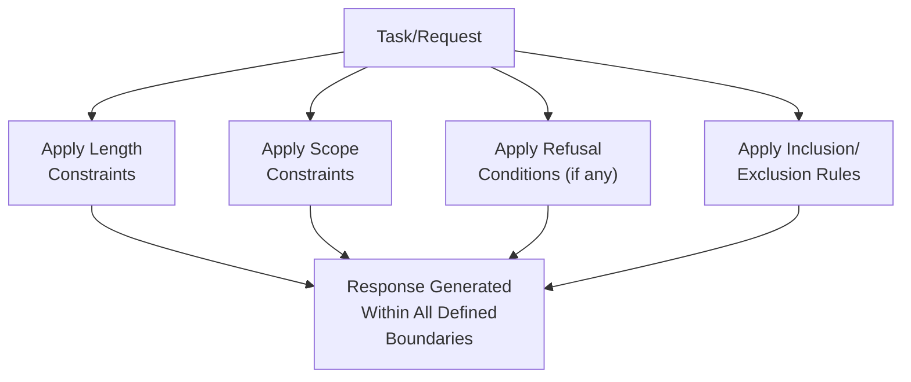
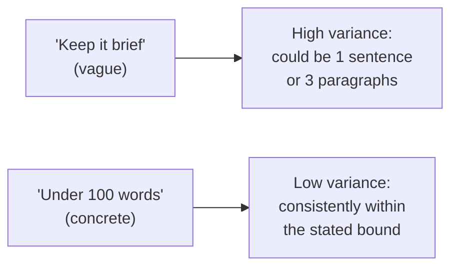

# 28 — Output Control

> **Series:** Prompt Engineering Knowledge Library
> **File 28 of 60** | **Level:** Intermediate
> **Prerequisites:** [`27_Instruction_Following.md`](./27_Instruction_Following.md)
> **Next:** [`29_Output_Formatting.md`](./29_Output_Formatting.md)

---

## Table of Contents

1. [Definition](#definition)
2. [Why It Matters](#why-it-matters)
3. [Core Concepts](#core-concepts)
4. [How It Works](#how-it-works)
5. [Internal Mechanism](#internal-mechanism)
6. [Types of Output Control](#types-of-output-control)
7. [Syntax / Structure](#syntax--structure)
8. [Examples (Simple → Advanced)](#examples-simple--advanced)
9. [Best Practices](#best-practices)
10. [Common Mistakes](#common-mistakes)
11. [Real-World Applications](#real-world-applications)
12. [Comparison with Related Concepts](#comparison-with-related-concepts)
13. [Advantages & Limitations](#advantages--limitations)
14. [FAQs](#faqs)
15. [Summary](#summary)
16. [Cheat Sheet](#cheat-sheet)
17. [Glossary](#glossary)
18. [References](#references)
19. [Visual Diagram Gallery](#visual-diagram-gallery)

---

## Definition

**Output Control** is the practice of precisely constraining *what* a model's response contains and *how much* of it there is — scope boundaries, length limits, refusal conditions, and content inclusion/exclusion rules — as distinct from [File 29 — Output Formatting](./29_Output_Formatting.md)'s focus on *structure* (how the output is organized, e.g., JSON versus prose versus a table). This file addresses the substance and boundaries of a response; the next addresses its shape.

> A useful test: if a technique determines *whether particular content appears at all* or *how long/short the response is*, it's output control. If it determines *how that content is structurally organized*, it's output formatting ([File 29](./29_Output_Formatting.md)).

---

## Why It Matters

- **It directly determines whether a response is fit for its actual purpose.** A technically correct but far-too-long response, or one that includes out-of-scope content, fails to serve its purpose just as surely as a factually wrong one would.
- **It's essential for downstream integration.** Many production systems depend on responses staying within specific length or scope boundaries to function correctly within a larger pipeline — a response that ignores these constraints can break downstream processing even when its content is otherwise good.
- **It directly supports the boundary-setting established in [File 21 — System Prompts](./21_System_Prompts.md)** — scope constraints are precisely how a system prompt's stated boundaries get consistently enforced in individual responses.
- **It's a common, high-frequency source of otherwise-avoidable dissatisfaction** — a response that's substantively correct but wildly too long, or that wanders outside the actual scope of what was asked, is a frequent, addressable failure pattern.

---

## Core Concepts

| Concept | Definition |
|---|---|
| **Length Control** | Constraining how long or short a response should be |
| **Scope Control** | Constraining what topics/content a response should or shouldn't include |
| **Refusal Conditions** | Explicit criteria under which a model should decline to respond substantively |
| **Inclusion/Exclusion Rules** | Specific content that must be present or must be avoided |
| **Verbosity Calibration** | Matching response detail level to actual need, neither over- nor under-explaining |
| **Boundary Enforcement** | Ensuring a response stays within defined scope even under pressure to expand |

---

## How It Works



Output control operates as a set of boundaries layered on top of the core task instruction — the task defines *what to accomplish*, while output control defines *the shape and limits within which that accomplishment must fit*. Both are necessary; a well-specified task with no output control can still produce a technically correct but practically unusable response (far too long, scope-creeping into tangential territory).

---

## Internal Mechanism

### Why explicit length control works better than implicit expectation

A model has no inherent, reliable sense of "how long is appropriate" for a given response absent explicit guidance — its learned patterns draw on an enormous diversity of training text with wildly varying appropriate lengths for superficially similar requests. Without explicit length control, a model's response length is effectively a probabilistic draw from this learned diversity, which can easily mismatch a specific application's actual needs. This is precisely why concrete, checkable length specifications ("3 sentences," "under 100 words," "a single paragraph") — connecting directly to [File 9 — Prompt Design Principles](./09_Prompt_Design_Principles.md)'s specificity principle — produce far more consistent results than vague guidance like "keep it brief," which still leaves substantial room for the model's learned diversity to produce inconsistent outcomes.

### Why scope control requires anticipating boundary-adjacent requests, not just defining the core scope

Simply stating a scope ("only discuss cooking topics") defines the *center* of acceptable content but leaves considerable ambiguity at the *edges* — is a question about kitchen equipment "cooking"? Is a question about restaurant recommendations? A model must resolve this ambiguity somehow, and without explicit guidance about how to handle boundary-adjacent cases specifically, its resolution may be inconsistent across similar-seeming edge cases. This connects directly to [File 22 — User Prompts](./22_User_Prompts.md)'s discussion of boundary-testing requests — effective scope control anticipates and explicitly addresses likely edge cases, rather than only defining the unambiguous core, precisely because real-world requests frequently land in that ambiguous boundary zone rather than safely in the unambiguous center.

---

## Types of Output Control

| Type | Purpose | Example |
|---|---|---|
| **Length Constraint** | Bounds response size | "Respond in exactly 2-3 sentences." |
| **Scope Constraint** | Bounds topical content | "Only address the technical aspects, not pricing." |
| **Refusal Condition** | Defines when to decline | "If the question requires legal advice, decline and suggest consulting a professional." |
| **Mandatory Inclusion** | Requires specific content be present | "Always include a disclaimer about consulting a doctor." |
| **Mandatory Exclusion** | Requires specific content be absent | "Never mention competitor product names." |
| **Verbosity Level** | Sets overall detail/explanation depth | "Assume the reader is an expert — skip basic explanations." |

---

## Syntax / Structure

Output control is typically expressed as explicit, concrete constraints, often gathered together as a distinct prompt section:

```text
[OUTPUT CONSTRAINTS]
- Length: 3-5 sentences, no more.
- Scope: Only address the specific question asked; do not 
  proactively suggest unrelated topics.
- Refusal: If the question involves specific medical dosing, 
  decline and recommend consulting a pharmacist or doctor.
- Mandatory exclusion: Never mention specific drug brand names, 
  only generic/chemical names.
```

```xml
<output_control>
<length>Maximum 100 words.</length>
<scope>Product features and usage only. Do not discuss pricing 
or availability — direct those questions to sales.</scope>
<refusal_condition>
If asked to compare against a named competitor product, 
decline and note you can only discuss this product's own features.
</refusal_condition>
</output_control>
```

---

## Examples (Simple → Advanced)

**Level 1 — Basic length control:**
```text
Explain what photosynthesis is in 2 sentences.
```

**Level 2 — Adding scope control:**
```text
Explain what photosynthesis is in 2 sentences. Focus only on 
the basic process — don't get into the detailed chemistry 
(light reactions, Calvin cycle, etc.).
```

**Level 3 — Adding a refusal condition:**
```text
You are a general science tutor. Explain concepts clearly and 
simply. If asked about topics outside general science education 
(e.g., specific medical diagnosis, legal questions), politely 
decline and note this is outside your intended scope.
```

**Level 4 — Combining inclusion and exclusion rules:**
```text
Summarize this product review. 
Mandatory inclusion: Note the overall star rating if mentioned.
Mandatory exclusion: Do not include the reviewer's name or any 
other personally identifying details, even if present in the 
original text.
```

**Level 5 — Full output control specification anticipating boundary cases:**
```xml
<output_control>
<length>Response must be 50-150 words — no shorter, no longer.</length>

<scope>
Discuss only this specific product's features, setup, and 
troubleshooting. 

Boundary guidance: Questions about "similar products" or 
"alternatives" are OUT of scope — redirect to "I can only 
discuss this specific product's features." Questions about 
warranty or returns ARE in scope, treated as product-related.
</scope>

<refusal_condition>
If the question requires safety-critical guidance (e.g., 
electrical modifications), decline and direct to the official 
safety documentation rather than attempting a direct answer.
</refusal_condition>

<mandatory_exclusion>
Never provide specific numeric pricing — pricing changes 
frequently and should always be directed to the current pricing 
page.
</mandatory_exclusion>
</output_control>
```

---

## Best Practices

1. **Use concrete, checkable length specifications** rather than vague terms like "brief" or "concise" — per the Internal Mechanism section, specific criteria produce far more consistent results.
2. **Explicitly anticipate and address boundary-adjacent scope cases**, not just the unambiguous core scope — real-world requests frequently land in ambiguous territory.
3. **State refusal conditions clearly and specifically**, including what to say when declining (per [File 21](./21_System_Prompts.md)'s guardrail guidance) — a vague refusal condition produces inconsistent refusal behavior just as a vague task produces inconsistent task completion.
4. **Test output control specifically against boundary-testing inputs** ([File 14 — Prompt Testing](./14_Prompt_Testing.md)), not just typical, clearly in-scope or clearly out-of-scope requests.
5. **Balance output control rigor with genuine helpfulness** — overly restrictive scope or refusal conditions can make a system frustratingly unhelpful even for reasonable, legitimate requests; calibrate to actual need rather than maximal restriction by default.

---

## Common Mistakes

| Mistake | Consequence | Fix |
|---|---|---|
| Vague length guidance ("keep it short") | Inconsistent response lengths across similar requests | Use concrete, checkable length specifications |
| Defining only the core scope, not boundary cases | Inconsistent handling of ambiguous, boundary-adjacent requests | Explicitly anticipate and address likely edge cases |
| Vague refusal conditions with no guidance on what to say instead | Inconsistent, sometimes unhelpful refusal behavior | Specify both when to refuse and what the refusal response should look like |
| Overly restrictive output control that frustrates legitimate use | Unhelpful system even for reasonable requests | Calibrate restriction level to genuine need, testing for over-restriction as well as under-restriction |
| No testing specifically targeting output control boundaries | Scope creep or length inconsistency discovered only in production | Include boundary-testing cases specifically for output control in the test suite |

---

## Real-World Applications

- **Customer support systems with defined scope** — output control is the direct mechanism enforcing that a support bot stays within its intended domain rather than answering unrelated questions.
- **Structured content generation pipelines** — length constraints are essential when generated content must fit specific downstream slots (e.g., a product description that must fit a fixed-size UI element).
- **Regulated or safety-sensitive domains** — refusal conditions and mandatory exclusions are the direct mechanism for keeping responses within legally or ethically appropriate boundaries.
- **API-driven applications with cost/latency constraints** — length control directly affects token cost and response latency, making it a practical optimization lever as well as a quality one ([File 11 — Prompt Optimization](./11_Prompt_Optimization.md)).

---

## Comparison with Related Concepts

| Concept | Difference from "Output Control" |
|---|---|
| **Output Formatting (File 29)** | Output control constrains *what content appears and how much*; output formatting constrains *how that content is structurally organized* (JSON, markdown, table) — a response can be well-controlled but poorly formatted, or vice versa |
| **System Prompts (File 21)** | System prompts are the *typical location* where output control constraints are often specified for persistent, session-wide effect; output control is the general *technique category*, applicable within system prompts or elsewhere |
| **Response Validation (File 30)** | Output control is a *prompt-level* technique attempting to shape generation toward desired boundaries; response validation is a *downstream, post-generation* check confirming whether those boundaries were actually respected — output control aims for compliance, validation verifies it |

---

## Advantages & Limitations

### ✅ Advantages of Explicit Output Control

- **Produces far more consistent, predictable response characteristics** than relying on implicit expectation.
- **Directly supports downstream integration needs** where specific length/scope boundaries are functionally required.
- **Provides the concrete mechanism for enforcing system-level scope and safety boundaries** in actual, individual responses.

### ⚠️ Limitations

- **Prompt-level output control is not a perfect, absolute guarantee** — like instruction following generally ([File 27](./27_Instruction_Following.md)), it's a strong but probabilistic influence on behavior, not an architecturally hard-coded constraint; downstream validation ([File 30](./30_Response_Validation.md)) remains valuable for genuinely critical constraints.
- **Overly rigid output control can reduce genuine helpfulness** if not carefully calibrated to actual need versus excessive restriction.
- **Boundary-case anticipation is inherently incomplete** — no matter how thoroughly boundary cases are anticipated, genuinely novel edge cases can still arise in production that weren't specifically addressed.

---

## FAQs

**Q: Is a stated length constraint like "under 100 words" always followed exactly?**
A: Generally reliably followed but not with absolute, guaranteed precision — like other prompt-level instructions, it's a strong, trained behavioral tendency rather than a hard architectural constraint; for genuinely strict length requirements, downstream validation ([File 30](./30_Response_Validation.md)) provides an additional safeguard.

**Q: How specific should refusal conditions be?**
A: Generally, more specific is better, per this file's core theme — vague refusal criteria ("decline inappropriate requests") produce less consistent behavior than concrete, specific criteria with clear examples of what qualifies.

**Q: Should every prompt include explicit output control?**
A: Not necessarily — for simple, low-stakes, conversational use, implicit expectation is often sufficient; explicit output control becomes increasingly valuable as stakes rise, downstream integration requirements become stricter, or scope/safety boundaries matter more.

**Q: What's the risk of overly restrictive output control?**
A: A system that frustrates legitimate users by declining reasonable requests, or that produces unhelpfully truncated responses when more detail would genuinely have served the user better — restriction should be calibrated to genuine need, not maximized by default.

---

## Summary

Output Control is the practice of precisely constraining what a model's response contains and how much of it there is — through length constraints, scope boundaries, refusal conditions, and explicit inclusion/exclusion rules — addressing the substance and limits of a response as distinct from its structural organization. Effective output control requires concrete, checkable specifications rather than vague guidance (since models have no inherent sense of "appropriate" length or scope absent explicit direction) and must deliberately anticipate boundary-adjacent cases, not just an unambiguous core scope, since real-world requests frequently land in genuinely ambiguous territory. Having covered how to control what appears in a response, the library turns to the closely related, complementary concern of how that content is structurally organized: [File 29 — Output Formatting](./29_Output_Formatting.md).

---

## Cheat Sheet

```text
OUTPUT CONTROL — QUICK REFERENCE

CONTROL TYPES
Length Constraint    -> How long/short (use CONCRETE numbers)
Scope Constraint     -> What topics (define the CENTER + BOUNDARIES)
Refusal Condition    -> When to decline (+ WHAT to say instead)
Inclusion Rule       -> What MUST appear
Exclusion Rule       -> What must NEVER appear

KEY PRINCIPLE: Vague guidance ("keep it brief", "stay on topic") 
produces inconsistent results. Concrete, checkable criteria 
("under 100 words", explicit boundary examples) produce 
consistent results.

REMEMBER: Anticipate BOUNDARY-ADJACENT cases specifically — 
most real ambiguity lives at the edges, not the obvious center.
```

---

## Glossary

| Term | Definition |
|---|---|
| **Length Control** | Constraining response size |
| **Scope Control** | Constraining topical content boundaries |
| **Refusal Condition** | Explicit criteria for declining to respond substantively |
| **Inclusion/Exclusion Rules** | Content that must be present or must be avoided |
| **Verbosity Calibration** | Matching detail level to actual need |
| **Boundary Enforcement** | Maintaining defined scope even under pressure to expand |

---

## References

- Anthropic — [Control Output Format and Length](https://docs.claude.com/en/docs/build-with-claude/prompt-engineering/be-clear-and-direct)
- OpenAI — [Prompt Engineering: Specifying Output Requirements](https://platform.openai.com/docs/guides/prompt-engineering)
- Reynolds, L. & McDonell, K. (2021) — *Prompt Programming for Large Language Models*, arXiv:2102.07350
- Wallace, E. et al. (2024) — *The Instruction Hierarchy: Training LLMs to Prioritize Privileged Instructions*, arXiv:2404.13208 (boundary/scope-relevant instruction compliance)

---

## Visual Diagram Gallery

**Diagram 1 — The Output Control Layers**
```text
┌─────────────────────────────────────────┐
│  CORE TASK (what to accomplish)           │
├─────────────────────────────────────────┤
│  + LENGTH CONTROL   (how much)            │
├─────────────────────────────────────────┤
│  + SCOPE CONTROL    (what topics)         │
├─────────────────────────────────────────┤
│  + REFUSAL CONDITIONS (when to decline)   │
├─────────────────────────────────────────┤
│  + INCLUSION/EXCLUSION (must/must-not)    │
└─────────────────────────────────────────┘
         = Fully Controlled Response
```

**Diagram 2 — Scope: Center vs. Boundary Ambiguity**
```text
                    CLEARLY OUT OF SCOPE
                            |
        BOUNDARY ZONE  <---+--->  BOUNDARY ZONE
        (ambiguous,         |      (ambiguous,
         needs explicit     |       needs explicit
         guidance)           |       guidance)
                            |
                     CLEARLY IN SCOPE
                    (the "obvious center")

Most real-world requests land in the boundary zones, 
not safely in the obvious center — this is why explicit 
boundary guidance matters more than defining the center alone.
```

**Diagram 3 — Vague vs. Concrete Constraint Effectiveness**


---

**⬅️ Previous:** [`27_Instruction_Following.md`](./27_Instruction_Following.md)
**➡️ Next:** [`29_Output_Formatting.md`](./29_Output_Formatting.md) — How response content is structurally organized.
