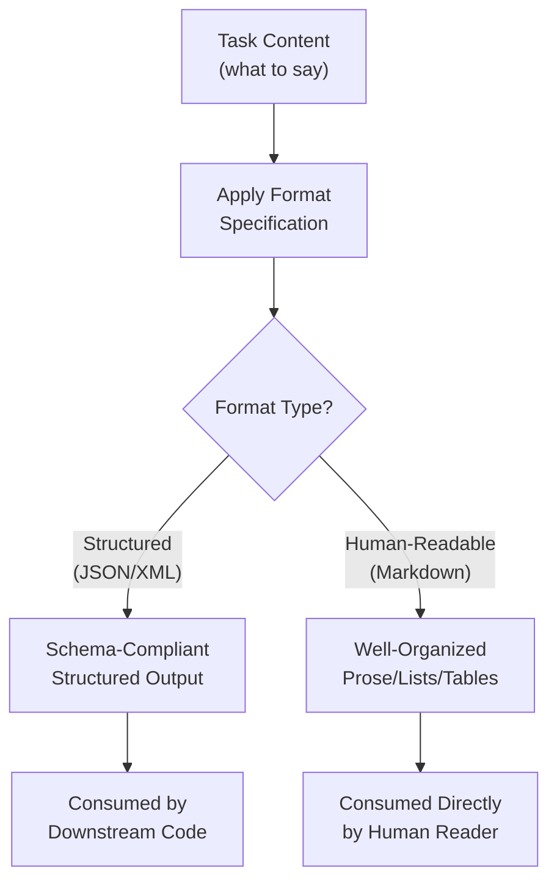
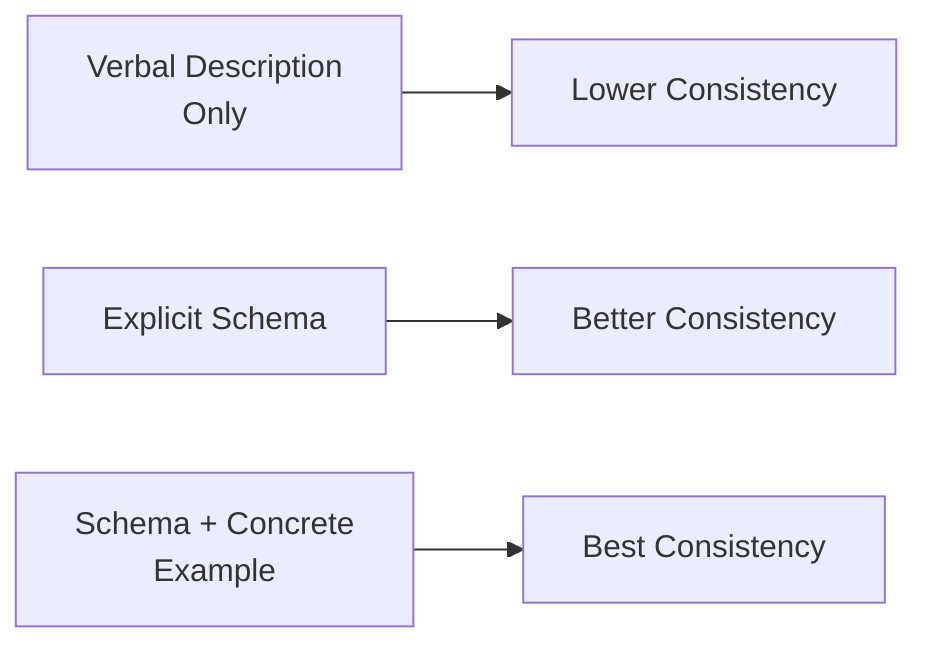
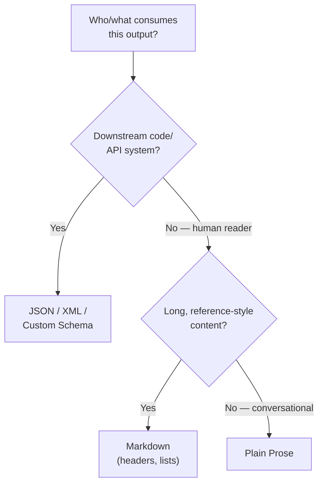

# 29 — Output Formatting

> **Series:** Prompt Engineering Knowledge Library
> **File 29 of 60** | **Level:** Intermediate
> **Prerequisites:** [`28_Output_Control.md`](./28_Output_Control.md)
> **Next:** [`30_Response_Validation.md`](./30_Response_Validation.md)

---

## Table of Contents

1. [Definition](#definition)
2. [Why It Matters](#why-it-matters)
3. [Core Concepts](#core-concepts)
4. [How It Works](#how-it-works)
5. [Internal Mechanism](#internal-mechanism)
6. [Types of Output Formats](#types-of-output-formats)
7. [Syntax / Structure](#syntax--structure)
8. [Examples (Simple → Advanced)](#examples-simple--advanced)
9. [Best Practices](#best-practices)
10. [Common Mistakes](#common-mistakes)
11. [Real-World Applications](#real-world-applications)
12. [Comparison with Related Concepts](#comparison-with-related-concepts)
13. [Advantages & Limitations](#advantages--limitations)
14. [FAQs](#faqs)
15. [Summary](#summary)
16. [Cheat Sheet](#cheat-sheet)
17. [Glossary](#glossary)
18. [References](#references)
19. [Visual Diagram Gallery](#visual-diagram-gallery)

---

## Definition

**Output Formatting** is the practice of precisely specifying the structural organization of a model's response — JSON, XML, markdown, tables, numbered lists, or specific schemas — as distinct from [File 28 — Output Control](./28_Output_Control.md)'s focus on *what content appears and how much*. Where output control asks "what should this response contain, and within what limits," output formatting asks "how should that content be structurally arranged so it's usable by its intended consumer" — whether that consumer is a human reader or a downstream automated system.

> The distinction matters practically: a response can perfectly satisfy every output control constraint (correct scope, correct length) while still being unusable because it's in the wrong structural format for how it needs to be consumed — for instance, correct content delivered as unstructured prose when a downstream system requires valid JSON.

---

## Why It Matters

- **It's essential for programmatic consumption.** Any response that will be parsed by downstream code (rather than read directly by a human) depends entirely on reliable, predictable structural formatting — unstructured prose, however accurate, breaks automated parsing.
- **It directly affects human readability and usability**, even for human-consumed responses — a wall of undifferentiated text is harder to scan and use than the same information organized into a clear list, table, or structured sections where appropriate.
- **It's a distinct skill from content correctness**, connecting to [File 5](./05_Prompt_Components.md)'s "output format" component — a model can have perfectly correct understanding of a task's substance while still needing explicit guidance to produce that substance in a specific required structure.
- **It directly enables the reliable, automated pipelines that make LLMs useful as components within larger software systems**, not just as standalone conversational interfaces.

---

## Core Concepts

| Concept | Definition |
|---|---|
| **Structured Output** | Response content organized according to a defined format (JSON, XML, etc.) |
| **Schema** | A formal specification defining the exact structure/fields a structured output must contain |
| **Format Compliance** | The degree to which actual output matches the specified format requirements |
| **Markup/Markdown Formatting** | Using markdown conventions (headers, bullets, bold) to organize human-readable content |
| **Parseable Output** | Output structured reliably enough to be programmatically extracted/processed |
| **Format Consistency** | Producing the same structural format reliably across repeated requests |

---

## How It Works



Output formatting operates as a layer applied to already-determined content — the model first (in effect) determines *what* to say (shaped by output control, [File 28](./28_Output_Control.md)), then organizes that content according to the specified structural format, whether that's a rigid schema for machine consumption or a readable structure for human consumption.

---

## Internal Mechanism

### Why explicit schema specification dramatically improves structured output reliability

As established in [File 4](./04_How_LLMs_Interpret_Prompts.md), the model generates output token by token, and for structured formats like JSON, this means the model is, in effect, "writing" the structural syntax (brackets, quotes, commas) alongside the actual content simultaneously. Without an explicit, precise schema specification, the model must infer the desired structure purely from the task description — which, for anything beyond the simplest structure, introduces meaningful risk of inconsistency (field names that vary slightly across requests, inconsistent nesting, optional fields sometimes included and sometimes not). Providing an explicit schema — ideally with a concrete example, connecting to [File 19](./19_Prompt_Patterns.md)'s few-shot pattern — gives the model a much more precise target to match token-by-token, substantially improving both structural consistency and correctness compared to relying on the model to infer an unstated desired structure purely from a verbal description.

### Why markdown formatting for human-readable content still benefits from explicit guidance

It might seem like formatting for human readability (as opposed to strict machine-parseable schemas) requires less explicit specification, since there's no rigid schema to match — but this isn't entirely accurate. A model's learned patterns for "how to format a helpful, readable response" are shaped by an enormous diversity of training text with varying formatting conventions, meaning default formatting choices (when should something be a bulleted list versus flowing prose? when do headers help versus add unnecessary structure to a short response?) can be inconsistent absent explicit guidance. This is precisely why organizations with strong content quality standards typically specify formatting conventions explicitly (e.g., "use bullet points for lists of 3+ items; use prose for shorter explanations") rather than leaving these judgment calls entirely to the model's own learned, but variable, defaults.

---

## Types of Output Formats

| Format | Description | Best Suited For |
|---|---|---|
| **JSON** | Structured key-value data format | Programmatic/API consumption, data extraction |
| **XML** | Tagged structured format | Systems requiring explicit hierarchical tagging |
| **Markdown** | Human-readable formatting with headers, lists, emphasis | Documents, explanations, content meant for direct human reading |
| **Plain Prose** | Unstructured flowing text | Conversational responses, narrative content |
| **Tables** | Row/column structured data | Comparative or tabular information |
| **CSV** | Comma-separated structured data | Simple tabular data for spreadsheet/data-processing consumption |
| **Custom Schema** | A specific, application-defined structure | Applications with particular downstream processing requirements |

---

## Syntax / Structure

Explicit format specification, ideally paired with a concrete example (per the Internal Mechanism section):

```text
Respond ONLY in valid JSON matching this exact schema, with 
no additional text before or after the JSON:

{
  "summary": "string, 1-2 sentences",
  "sentiment": "positive" | "negative" | "neutral",
  "key_topics": ["array", "of", "strings"]
}

Example of correctly formatted output:
{
  "summary": "The review praises the product's build quality 
             but criticizes the price.",
  "sentiment": "neutral",
  "key_topics": ["build quality", "price"]
}
```

```text
# Markdown formatting guidance
Format your response using markdown:
- Use a level-2 header (##) for each main section
- Use bullet points for lists of 3 or more related items
- Use **bold** only for genuinely critical warnings or key terms
- Keep paragraphs to 3-4 sentences maximum
```

---

## Examples (Simple → Advanced)

**Level 1 — Basic format specification:**
```text
List the ingredients for pancakes as a bulleted list.
```

**Level 2 — Simple structured output:**
```text
Extract the name and email from this text, formatted as JSON:
{"name": "...", "email": "..."}

Text: "Contact John Smith at john@example.com for details."
```

**Level 3 — More complex schema with types:**
```text
Analyze this product review and return JSON with this exact 
structure:
{
  "rating_mentioned": true or false,
  "rating_value": number or null if not mentioned,
  "sentiment": one of "positive", "negative", "mixed"
}
```

**Level 4 — Markdown formatting guidance for a human-readable response:**
```text
Explain the steps to set up a home wifi network. Format as:
- A brief 1-sentence intro
- A numbered list of steps (not bullets, since order matters)
- A short "troubleshooting tip" section at the end, using a 
  header
```

**Level 5 — Full schema specification with example and edge-case handling:**
```text
Extract structured data from the customer support ticket 
below. Return ONLY valid JSON matching this schema:

{
  "category": "billing" | "technical" | "account" | "other",
  "urgency": "low" | "medium" | "high",
  "customer_sentiment": "frustrated" | "neutral" | "satisfied",
  "action_required": true or false,
  "summary": "string, one sentence"
}

If any field cannot be confidently determined from the ticket, 
use these defaults: category="other", urgency="medium", 
customer_sentiment="neutral".

Example:
{
  "category": "billing",
  "urgency": "high",
  "customer_sentiment": "frustrated",
  "action_required": true,
  "summary": "Customer was charged twice for the same order 
             and wants a refund."
}

Ticket: [ticket text]
```

---

## Best Practices

1. **Provide an explicit schema, not just a verbal description**, for any structured (JSON/XML) output — per the Internal Mechanism section, this substantially improves consistency and correctness.
2. **Pair a schema with a concrete example** whenever feasible, applying the few-shot pattern ([File 19](./19_Prompt_Patterns.md)) specifically to formatting — showing is more reliable than describing alone.
3. **Explicitly handle edge cases within the schema specification** (what to do when a field can't be determined, as in Level 5) — don't leave this ambiguous.
4. **Specify markdown/readability conventions explicitly for important human-facing content**, rather than relying entirely on the model's own variable formatting defaults.
5. **Validate structured output downstream** ([File 30 — Response Validation](./30_Response_Validation.md)) rather than assuming schema compliance is perfectly guaranteed by the prompt specification alone.

---

## Common Mistakes

| Mistake | Consequence | Fix |
|---|---|---|
| Describing a desired JSON structure only verbally, without an explicit schema | Inconsistent field names, structure, or optional-field handling across requests | Provide an explicit, precise schema specification |
| No example paired with a schema specification | Weaker consistency than schema + example together provides | Pair schema specification with a concrete example |
| Leaving edge cases (missing/undeterminable data) unaddressed in the schema | Unpredictable behavior when expected data isn't present in the input | Explicitly specify default/fallback behavior for edge cases |
| Assuming markdown formatting conventions are automatically consistent | Variable formatting choices (when to list vs. prose, header usage) across similar requests | Explicitly specify formatting conventions for important content |
| No downstream validation of structured output | Malformed output silently breaks downstream processing | Validate structured output ([File 30](./30_Response_Validation.md)) rather than trusting prompt-level formatting alone |

---

## Real-World Applications

- **API-integrated LLM applications** — nearly universally depend on reliable structured (typically JSON) output for downstream programmatic processing.
- **Data extraction and transformation pipelines** — precise schema specification is essential for reliably converting unstructured text into structured, usable data.
- **Content management and publishing systems** — markdown formatting guidance ensures generated content matches a publication's style and structural conventions.
- **Function/tool-calling agentic systems** — the specific structured format for a tool call itself is a direct, high-stakes application of precise output formatting, where malformed structure directly breaks tool execution.

---

## Comparison with Related Concepts

| Concept | Difference from "Output Formatting" |
|---|---|
| **Output Control (File 28)** | Output control constrains *what content appears and how much*; output formatting constrains *how that content is structurally organized* — complementary, addressing different dimensions of a response |
| **Prompt Anatomy (File 6)** | Anatomy covers how the *input prompt itself* is structured; output formatting covers how the *resulting response* is structured — related structural thinking applied to opposite ends of the interaction |
| **Response Validation (File 30)** | Output formatting is the *prompt-level specification* of desired structure; response validation is the *downstream verification* of whether that structure was actually, correctly produced — specification versus confirmation |

---

## Advantages & Limitations

### ✅ Advantages of Explicit Output Formatting

- **Enables reliable programmatic consumption**, essential for any LLM component embedded within a larger automated system.
- **Improves human readability and usability** through consistent, well-organized presentation.
- **Substantially improves consistency** when paired with explicit schemas and examples, versus relying on verbal description alone.

### ⚠️ Limitations

- **Not a perfect, absolute guarantee of compliance** — like other prompt-level specifications, format compliance is a strong, trained tendency rather than an architecturally hard-coded constraint; malformed output can still occasionally occur, which is why downstream validation ([File 30](./30_Response_Validation.md)) remains valuable.
- **Overly rigid formatting requirements can occasionally constrain a response's substantive quality** if not thoughtfully designed — a schema too narrow for genuine task complexity can force awkward data-fitting.
- **Adds genuine prompt complexity and length**, particularly for detailed schemas with examples — a cost that should be weighed against the actual downstream need for strict structure.

---

## FAQs

**Q: Is providing an example always necessary for reliable structured output?**
A: Not strictly always necessary for very simple schemas, but per the Internal Mechanism section, it substantially improves consistency for anything beyond the simplest structure, and is generally a low-cost, high-value addition worth including by default for production use.

**Q: How should I handle a field that genuinely can't be determined from the input?**
A: Explicitly specify the desired fallback/default behavior within the schema itself (as in Level 5's example), rather than leaving this ambiguous — ambiguous edge-case handling is a common source of inconsistent structured output.

**Q: Should conversational, human-facing responses always use markdown formatting?**
A: Not necessarily — plain, flowing prose is often more natural and appropriate for genuinely conversational exchanges; markdown structuring (headers, lists) tends to add more value for longer, more complex, or reference-style content where scannable organization genuinely helps.

**Q: If I specify a JSON schema, do I still need to validate the output?**
A: Yes, for any genuinely important use — per this file's Limitations and [File 30 — Response Validation](./30_Response_Validation.md), prompt-level format specification is a strong influence but not an absolute guarantee, and downstream validation catches the cases where it isn't perfectly followed.

---

## Summary

Output Formatting is the practice of precisely specifying the structural organization of a model's response — JSON schemas, XML tags, markdown conventions, tables — addressing how content is organized as distinct from [File 28](./28_Output_Control.md)'s focus on what content appears and how much. Explicit schema specification, especially when paired with a concrete example, substantially improves structural consistency and correctness compared to relying on verbal description alone, since the model is generating structural syntax token-by-token and benefits from a precise target to match rather than an inferred, potentially inconsistent structure. Having now covered both what a response should contain (output control) and how it should be structured (output formatting), the library concludes with the essential downstream counterpart to both — verifying that generated output actually, correctly complies with everything specified: [File 30 — Response Validation](./30_Response_Validation.md).

---

## Cheat Sheet

```text
OUTPUT FORMATTING — QUICK REFERENCE

FORMAT TYPES
JSON/XML       -> Programmatic/machine consumption
Markdown       -> Human-readable, scannable organization
Plain Prose    -> Conversational, narrative content
Tables/CSV     -> Comparative or tabular data

RELIABILITY BOOSTERS (use both together for best results)
[ ] Explicit schema (not just verbal description)
[ ] Concrete example paired with the schema
[ ] Explicit edge-case/fallback handling specified

KEY DISTINCTION
Output Control (File 28)  = WHAT content, HOW MUCH
Output Formatting (this)  = HOW that content is STRUCTURED

GOLDEN RULE: Schema + Example > Schema alone > Verbal 
description alone, for structural consistency.
```

---

## Glossary

| Term | Definition |
|---|---|
| **Structured Output** | Response content organized according to a defined format |
| **Schema** | A formal specification of exact structure/fields required |
| **Format Compliance** | The degree to which output matches specified format requirements |
| **Markup/Markdown Formatting** | Using markdown conventions to organize human-readable content |
| **Parseable Output** | Output structured reliably enough for programmatic extraction |
| **Format Consistency** | Producing the same structural format reliably across requests |

---

## References

- Anthropic — [Increase Output Consistency with Prompt/Prefill and Formatting](https://docs.claude.com/en/docs/build-with-claude/prompt-engineering/increase-consistency)
- OpenAI — [Structured Outputs and JSON Mode](https://platform.openai.com/docs/guides/structured-outputs)
- White, J. et al. (2023) — *A Prompt Pattern Catalog to Enhance Prompt Engineering with ChatGPT*, arXiv:2302.11382
- Brown, T. et al. (2020) — *Language Models are Few-Shot Learners*, arXiv:2005.14165 (example-based consistency)

---

## Visual Diagram Gallery

**Diagram 1 — Content vs. Structure (Output Control vs. Formatting)**
```text
                    A RESPONSE
        ┌───────────────────┴───────────────────┐
        v                                         v
┌───────────────────┐                  ┌───────────────────┐
│  OUTPUT CONTROL      │                  │  OUTPUT FORMATTING  │
│  (File 28)           │                  │  (this file)        │
│  WHAT content, and    │                  │  HOW it's           │
│  HOW MUCH of it        │                  │  structurally       │
│                       │                  │  organized           │
└───────────────────┘                  └───────────────────┘
```

**Diagram 2 — Reliability Improvement: Description vs. Schema vs. Schema+Example**


**Diagram 3 — Format Selection Guide**


---

**⬅️ Previous:** [`28_Output_Control.md`](./28_Output_Control.md)
**➡️ Next:** [`30_Response_Validation.md`](./30_Response_Validation.md) — Downstream verification that generated output actually complies with everything specified.
