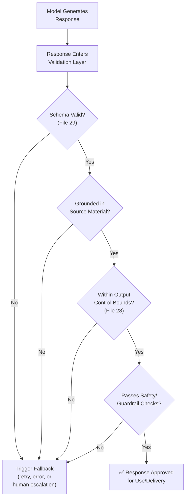
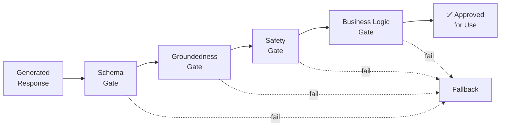
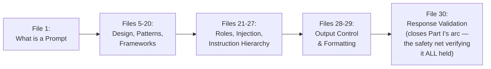

# 30 — Response Validation

> **Series:** Prompt Engineering Knowledge Library
> **File 30 of 60** | **Level:** Advanced
> **Prerequisites:** [`29_Output_Formatting.md`](./29_Output_Formatting.md)
> **Next:** [`31_Constraints.md`](./31_Constraints.md)

---

## Table of Contents

1. [Definition](#definition)
2. [Why It Matters](#why-it-matters)
3. [Core Concepts](#core-concepts)
4. [How It Works](#how-it-works)
5. [Internal Mechanism](#internal-mechanism)
6. [Types of Validation](#types-of-validation)
7. [Syntax / Structure](#syntax--structure)
8. [Examples (Simple → Advanced)](#examples-simple--advanced)
9. [Best Practices](#best-practices)
10. [Common Mistakes](#common-mistakes)
11. [Real-World Applications](#real-world-applications)
12. [Comparison with Related Concepts](#comparison-with-related-concepts)
13. [Advantages & Limitations](#advantages--limitations)
14. [FAQs](#faqs)
15. [Summary](#summary)
16. [Cheat Sheet](#cheat-sheet)
17. [Glossary](#glossary)
18. [References](#references)
19. [Visual Diagram Gallery](#visual-diagram-gallery)
20. [Part I Conclusion](#part-i-conclusion)

---

## Definition

**Response Validation** is the downstream, typically automated, real-time practice of checking whether a specific generated response actually, correctly complies with defined requirements — schema validity, factual groundedness, safety boundaries, format compliance — *after* generation but *before* the response is used, delivered, or acted upon. This is the final, essential safety net closing a theme that has run throughout this entire library: prompt-level techniques (design, control, formatting, instruction hierarchy) are strong, trained influences on model behavior, but none of them constitute an absolute, architecturally guaranteed constraint — validation is what confirms, for each individual response, whether that influence actually held.

> Where [File 15 — Prompt Evaluation](./15_Prompt_Evaluation.md) assesses quality across *many* outputs, often offline or periodically, to judge overall prompt performance, Response Validation checks *one specific, individual response*, typically in real time, before that particular response is actually used — the last checkpoint in the pipeline, not a broader quality assessment.

---

## Why It Matters

- **It's the final safety net for every prompt-level technique covered in this library.** Output control ([File 28](./28_Output_Control.md)), formatting ([File 29](./29_Output_Formatting.md)), and instruction hierarchy ([File 27](./27_Instruction_Following.md)) are all strong but probabilistic influences — validation is what catches the cases where that influence didn't fully hold for a specific response.
- **It's essential for safe automated/agentic system operation.** Any system where a response's content directly triggers a downstream action (sending a message, executing code, making a purchase) needs real-time validation as a genuine safeguard, not merely prompt-level trust.
- **It directly connects to the full arc of this library** — from [File 3](./03_Why_Prompts_Matter.md)'s discussion of the real costs of prompt failures, through the debugging/testing/evaluation triad (Files 13-15), to [File 26](./26_Context_Injection.md)'s emphasis on defense-in-depth — validation is the concrete, final mechanism realizing that defense-in-depth principle in live operation.
- **It prevents malformed or non-compliant output from silently propagating** into downstream systems, users, or actions, where its consequences would be far more costly to discover and remediate than catching it at this final checkpoint.

---

## Core Concepts

| Concept | Definition |
|---|---|
| **Schema Validation** | Programmatically confirming structured output matches a defined schema |
| **Groundedness Check** | Verifying factual claims in a response are actually supported by provided source material |
| **Safety/Guardrail Check** | Confirming a response doesn't violate defined safety or policy boundaries |
| **Fallback Behavior** | The defined action taken when a response fails validation |
| **Real-Time Validation** | Validation performed synchronously, before a response is delivered/acted upon |
| **Validation Layer** | The specific point in a system's pipeline where validation checks occur |

---

## How It Works



Validation functions as a sequential (or sometimes parallel) series of gates, each checking a distinct dimension of compliance — a response must pass all relevant gates before being used, and failing any single gate triggers defined fallback behavior rather than allowing a non-compliant response through by default.

---

## Internal Mechanism

### Why validation must be independent of the generation process, not a request for the model to "check itself"

A critical design principle: genuine validation should generally be an independent, separate process — programmatic schema checking, a separate retrieval-based groundedness check, or safety classification — rather than simply asking the same model, within the same generation, to self-report whether its own output is compliant. This distinction matters because a model's confidence in its own output and that output's actual correctness are related but genuinely distinct properties (echoing [File 15](./15_Prompt_Evaluation.md)'s LLM-as-judge discussion, where even a *separate* judging call requires validation against ground truth) — a model that produces a subtly non-compliant response is not guaranteed to reliably notice and flag that same non-compliance within the same generation pass. Independent validation — checking against the actual schema, actual source material, or actual defined rules, outside the original generation context — provides a genuinely different, more reliable check than self-assessment alone.

### Why fallback behavior design is as important as the validation check itself

A common, incomplete implementation defines validation checks thoroughly but gives little thought to what actually happens when a check fails — and this gap can be as consequential as having no validation at all. A validation failure with a poorly designed fallback (e.g., silently passing through the non-compliant response anyway, or crashing the entire user-facing system) can produce outcomes as bad as, or worse than, skipping validation entirely. Well-designed fallback behavior — a graceful retry with adjusted parameters, a clear error state, escalation to human review for high-stakes cases — is what actually converts a validation *check* into a validation *safeguard*; the check alone, without well-designed downstream handling of failures, only identifies problems without actually preventing their consequences.

---

## Types of Validation

| Type | What It Checks | Typical Method |
|---|---|---|
| **Schema Validation** | Structural format compliance ([File 29](./29_Output_Formatting.md)) | Programmatic schema/type checking (e.g., JSON Schema validation) |
| **Groundedness Validation** | Whether factual claims are supported by provided source material | Cross-referencing claims against source documents, sometimes via a separate retrieval or verification pass |
| **Safety/Policy Validation** | Whether content violates defined safety or policy boundaries | Content classification systems, keyword/pattern checks, or a separate model-based safety classifier |
| **Output Control Validation** | Whether length/scope constraints ([File 28](./28_Output_Control.md)) were actually respected | Programmatic length checking, scope/topic classification |
| **Business Logic Validation** | Whether output satisfies application-specific rules beyond general format/safety | Custom, application-specific rule checking |
| **Consistency Validation** | Whether output is internally consistent (no self-contradiction) | Automated consistency checking, sometimes via a separate model pass |

---

## Syntax / Structure

Validation is typically implemented as application-layer code surrounding the model call, not as prompt text itself:

```python
# Example: a validation pipeline wrapping a model response
def validate_response(response, schema, source_documents):
    # 1. Schema validation
    try:
        parsed = json.loads(response)
        jsonschema.validate(parsed, schema)
    except (json.JSONDecodeError, jsonschema.ValidationError):
        return ValidationResult(passed=False, 
                                 reason="schema_violation",
                                 fallback="retry_with_stricter_prompt")

    # 2. Groundedness validation
    if not claims_supported_by_sources(parsed, source_documents):
        return ValidationResult(passed=False,
                                 reason="ungrounded_claim",
                                 fallback="flag_for_human_review")

    # 3. Safety validation
    if safety_classifier.flags(parsed):
        return ValidationResult(passed=False,
                                 reason="safety_violation",
                                 fallback="block_and_log")

    return ValidationResult(passed=True)
```

```yaml
# Example: a validation policy specification
validation_policy:
  schema_check: 
    required: true
    on_failure: "retry once with error feedback, then escalate"
  groundedness_check:
    required: true
    threshold: "all specific factual claims must be traceable 
                to a provided source"
    on_failure: "flag for human review before delivery"
  safety_check:
    required: true
    on_failure: "block response, log incident, do not retry 
                 automatically"
```

---

## Examples (Simple → Advanced)

**Level 1 — Simple schema validation:**
```text
Model outputs: {"name": "John Smith", "email": "john@example"}
Validation check: Is "email" a valid email format?
Result: FAILS (missing domain extension) -> trigger fallback 
(request regeneration)
```

**Level 2 — Adding groundedness validation:**
```text
Source document: "Standard shipping takes 5-7 business days."
Model response: "Shipping typically takes 3-5 business days."
Validation check: Is this claim grounded in the source?
Result: FAILS (claim contradicts source) -> flag for review, 
do not deliver to customer as-is
```

**Level 3 — Combined schema and business logic validation:**
```text
Schema requires: {"category": string, "urgency": "low"|"medium"|"high"}
Model outputs: {"category": "billing", "urgency": "urgent"}
Validation check: Does "urgency" match the allowed enum values?
Result: FAILS ("urgent" is not in the allowed set) -> trigger 
fallback (map to nearest valid value, or request regeneration)
```

**Level 4 — Full pipeline with defined fallback behavior:**
```text
Response: [customer support answer about a refund policy]

Validation Layer 1 (Schema): PASS — valid JSON structure
Validation Layer 2 (Groundedness): PASS — claim matches 
provided policy document
Validation Layer 3 (Output Control): FAIL — response is 340 
words, exceeds the 150-word maximum specified in output control

Fallback triggered: Response is NOT delivered as-is. 
Application automatically requests a condensed regeneration 
with explicit feedback: "Previous response exceeded length 
limit — condense to under 150 words while preserving all 
factual content."
Regenerated response: PASSES all validation layers -> delivered.
```

**Level 5 — Full agentic validation with human escalation, connecting to File 26's defense-in-depth:**
```yaml
Scenario: An agent drafts an email reply based on retrieved 
inbox content (File 26's defense-in-depth example).

Draft response generated by model.

Validation Layer 1 (Schema): PASS — valid structured draft format
Validation Layer 2 (Safety/Policy): PASS — no policy-violating 
content detected
Validation Layer 3 (Business Logic — File 26's system rule): 
CHECK — does this draft attempt to send to a recipient NOT 
already in the user's verified contact list?
  Result: FLAGGED — recipient "attacker@example.com" is not 
  in the verified contact list.

Fallback triggered (per File 26's confirmation requirement): 
Email is NOT sent automatically. Draft + validation flag are 
surfaced to the human user for explicit review and confirmation 
before any send action occurs.

-> This validation layer is precisely what makes File 26's 
   "application-layer confirmation for consequential actions" 
   principle concrete and operational, closing the loop on 
   defense-in-depth.
```

---

## Best Practices

1. **Implement validation as an independent process, not model self-assessment** — per the Internal Mechanism section, genuine independence provides a more reliable check than asking the same generation to verify itself.
2. **Design well-considered fallback behavior for every validation check**, not just the checks themselves — a check without good fallback handling only identifies problems without preventing their consequences.
3. **Layer multiple validation types** (schema, groundedness, safety, business logic) rather than relying on a single check — different failure modes require different validation approaches.
4. **Reserve human escalation for genuinely high-stakes or ambiguous validation failures**, using automated fallback (retry, reformatting) for lower-stakes, more mechanically resolvable failures — calibrate escalation to actual severity.
5. **Log and monitor validation failures over time** ([File 7 — Prompt Lifecycle](./07_Prompt_Lifecycle.md)'s monitoring stage) — a rising validation failure rate is a valuable, concrete signal that a prompt may need iteration ([File 16](./16_Prompt_Iteration.md)).

---

## Common Mistakes

| Mistake | Consequence | Fix |
|---|---|---|
| Relying on the model to self-report its own output's compliance | Less reliable than independent, separate validation | Implement validation as a genuinely independent process |
| Defining validation checks with no corresponding fallback design | Failures identified but not actually prevented from causing consequences | Design explicit, well-considered fallback behavior for every check |
| Only implementing one type of validation (e.g., schema only) | Other failure modes (groundedness, safety) go uncaught | Layer multiple validation types addressing different failure modes |
| Escalating every single validation failure to human review | Overwhelming, unsustainable human review burden | Calibrate escalation to actual severity/ambiguity; automate resolution for lower-stakes failures |
| Not monitoring validation failure rates over time | Missing a valuable signal that a prompt needs iteration | Track validation failure rates as part of ongoing lifecycle monitoring |

---

## Real-World Applications

- **Any production system with structured output requirements** — schema validation is essentially universal wherever LLM output feeds into downstream programmatic processing.
- **RAG-based Q&A and knowledge assistant systems** — groundedness validation directly addresses hallucination risk by confirming factual claims trace back to actual, provided source material.
- **Content moderation and safety-critical applications** — safety validation provides a genuine, independent checkpoint beyond prompt-level guardrails alone.
- **Agentic systems with real-world action capability** — as shown in the Level 5 example, validation combined with human confirmation is precisely how [File 26](./26_Context_Injection.md)'s defense-in-depth principle becomes concretely operational rather than purely theoretical.

---

## Comparison with Related Concepts

| Concept | Difference from "Response Validation" |
|---|---|
| **Prompt Evaluation (File 15)** | Evaluation assesses quality across many outputs, often offline/periodically, to judge overall prompt performance; validation checks one specific, individual response, typically in real time, before that response is used |
| **Prompt Testing (File 14)** | Testing runs a prompt against defined test cases *before* deployment to discover issues proactively; validation checks *live, individual production responses* as they're actually generated, in real time |
| **Output Control / Formatting (Files 28-29)** | Those files are *prompt-level specification* — attempting to shape generation toward desired boundaries and structure; validation is the *downstream, independent verification* of whether that specification was actually, correctly honored for a given response |

---

## Advantages & Limitations

### ✅ Advantages of Response Validation

- **Provides the essential final safety net** for every prompt-level technique covered throughout this library, catching cases where trained, probabilistic compliance didn't fully hold.
- **Enables safe operation of consequential, real-world-acting systems** through genuine, independent verification rather than trust in prompt wording alone.
- **Generates valuable, concrete monitoring signal** — validation failure rates directly inform when prompt iteration is needed.

### ⚠️ Limitations

- **Adds genuine latency and engineering complexity** — real-time validation, especially involving separate groundedness or safety checks, introduces processing overhead that must be weighed against the risk it mitigates.
- **Validation itself can have false positives and false negatives** — a groundedness or safety check is itself an imperfect system, not an infallible oracle, and its own accuracy should be periodically assessed.
- **Cannot fully substitute for good upstream prompt engineering** — validation is the final safety net, not a replacement for the design principles, testing, and evaluation practices covered throughout the rest of this library; a system relying entirely on validation to catch poor upstream prompt design will face a high failure/fallback rate.

---

## FAQs

**Q: Is response validation necessary for every LLM application?**
A: Not with equal rigor — per this library's recurring stakes-calibration theme ([File 3](./03_Why_Prompts_Matter.md)), a low-stakes, purely conversational application may need minimal validation, while a high-stakes, structured-output, or action-taking system warrants comprehensive, layered validation.

**Q: How is groundedness validation actually performed?**
A: Methods vary — from relatively simple keyword/entity overlap checking against source documents, to more sophisticated approaches using a separate model call specifically tasked with verifying whether a given claim is supported by given source text (itself requiring the LLM-as-judge validation practices discussed in [File 15](./15_Prompt_Evaluation.md)).

**Q: What should happen when validation repeatedly fails for the same type of request?**
A: This is a strong, concrete signal (per Best Practices) that the underlying prompt likely needs iteration ([File 16 — Prompt Iteration](./16_Prompt_Iteration.md)) — a persistently high validation failure rate for a specific request pattern indicates a systematic prompt issue, not merely occasional bad luck.

**Q: Does validation replace the need for good prompt design?**
A: No — as emphasized in the Limitations section, validation is a final safety net, not a substitute for the design principles, testing, and evaluation practices covered throughout this library; relying on validation to compensate for genuinely poor upstream prompt engineering results in an unsustainably high failure/fallback rate.

---

## Summary

Response Validation is the downstream, typically real-time, independent verification that a specific generated response actually complies with defined schema, groundedness, safety, and business logic requirements — the final safety net confirming, for each individual response, whether the trained but probabilistic influence of every upstream prompt-level technique covered throughout this library actually held. Effective validation requires genuine independence from the generation process itself (not model self-assessment), well-designed fallback behavior for every check (since identifying a problem without preventing its consequences provides limited protection), and layered coverage across multiple failure-mode types — with validation failure rates themselves serving as valuable, concrete monitoring signal feeding back into the ongoing prompt lifecycle and iteration processes covered earlier in this library. This closes the full arc from understanding what a prompt fundamentally is ([File 1](./01_What_is_a_Prompt.md)) through to verifying, in live production, that a generated response can be trusted and safely used.

---

## Cheat Sheet

```text
RESPONSE VALIDATION — QUICK REFERENCE

VALIDATION LAYERS (apply as relevant to your system)
[ ] Schema Validation      — structural format compliance
[ ] Groundedness Validation — factual claims traceable to sources
[ ] Safety/Policy Validation — no boundary violations
[ ] Output Control Validation — length/scope actually respected
[ ] Business Logic Validation — app-specific rules satisfied

GOLDEN RULES
1. Validation must be INDEPENDENT of generation — not model 
   self-assessment
2. Every check needs WELL-DESIGNED FALLBACK behavior, not just 
   detection
3. Monitor validation failure RATES over time — rising rates 
   signal a prompt needs iteration (File 16)

REMEMBER: Validation is the FINAL safety net, not a substitute 
for good upstream prompt engineering throughout the rest of 
this library.
```

---

## Glossary

| Term | Definition |
|---|---|
| **Schema Validation** | Programmatically confirming structured output matches a defined schema |
| **Groundedness Check** | Verifying factual claims are supported by provided source material |
| **Safety/Guardrail Check** | Confirming a response doesn't violate defined boundaries |
| **Fallback Behavior** | The defined action taken when a response fails validation |
| **Real-Time Validation** | Validation performed synchronously, before a response is used |
| **Validation Layer** | The specific point in a pipeline where validation checks occur |

---

## References

- Anthropic — [Reducing Hallucinations and Increasing Reliability](https://docs.claude.com/en/docs/build-with-claude/prompt-engineering/reduce-hallucinations)
- OWASP — [Top 10 for Large Language Model Applications](https://owasp.org/www-project-top-10-for-large-language-model-applications/)
- Ji, Z. et al. (2023) — *Survey of Hallucination in Natural Language Generation*, ACM Computing Surveys
- NIST — [AI Risk Management Framework, Generative AI Profile](https://www.nist.gov/itl/ai-risk-management-framework)
- Zheng, L. et al. (2023) — *Judging LLM-as-a-Judge with MT-Bench and Chatbot Arena*, arXiv:2306.05685

---

## Visual Diagram Gallery

**Diagram 1 — The Full Validation Gate Sequence**


**Diagram 2 — Detection Without Fallback vs. Detection With Fallback**
```text
DETECTION ONLY (incomplete):
Validation Check --> "FAILED" --> ...nothing happens next... 
                                    --> Same consequences as 
                                        no validation at all

DETECTION + FALLBACK (complete safeguard):
Validation Check --> "FAILED" --> Defined Fallback Action 
                                    --> Consequence actually 
                                        PREVENTED
```

**Diagram 3 — Response Validation Closing the Library's Full Arc**


---

**⬅️ Previous:** [`29_Output_Formatting.md`](./29_Output_Formatting.md)
**➡️ Next:** [`31_Constraints.md`](./31_Constraints.md) — Part II begins: a comprehensive catalog of named, concrete prompting techniques.

---

## Part I Conclusion

This concludes **Part I** of the Prompt Engineering Knowledge Library (Files 1–30), spanning the full arc from foundational concepts ([File 1 — What is a Prompt](./01_What_is_a_Prompt.md)) through historical context, mechanical understanding, design principles, the full quality-assurance triad of debugging/testing/evaluation, reusable patterns and frameworks, the complete landscape of prompt roles and sources, context management and injection security, instruction hierarchy, and finally output control, formatting, and validation.

A few closing threads worth holding onto before continuing into Part II:

- **Every file connects to others** — this library was deliberately built as an interconnected system, not thirty isolated topics. Revisiting earlier files with the fuller context of later ones (particularly re-reading Files 1-9 after completing Files 21-30) often surfaces connections not fully visible on a first pass.
- **The recurring stakes-calibration theme** (first introduced in [File 3](./03_Why_Prompts_Matter.md)) applies throughout — not every technique in this library is needed for every task. Sound judgment about which techniques a given task's actual stakes warrant is itself a core skill this library aims to support.
- **This field continues to evolve** — as noted particularly in [File 2](./02_History_of_Prompts.md) and [File 27](./27_Instruction_Following.md), prompt engineering as a discipline is young and fast-moving. The principles in this library are drawn from current, well-established understanding, but staying current with ongoing research and practice remains valuable.

**Part I established the meta-layer** — what prompt engineering is, why it matters, and the disciplined process around it. **Part II (Files 31–60)** builds directly on this foundation with a comprehensive catalog of named, concrete techniques: constraints and guardrails, the full shot spectrum (zero/one/few), the complete reasoning-elicitation family (chain-of-thought through step-back prompting), reliability mechanisms, the agentic and multi-agent taxonomy, and finally domain-specific applications showing how it all composes in practice.

Continue to [File 31 — Constraints](./31_Constraints.md) to begin Part II.
