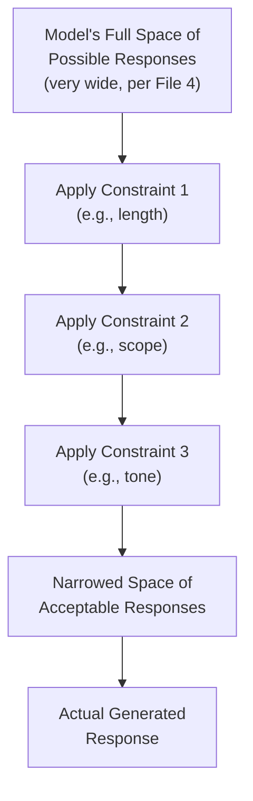
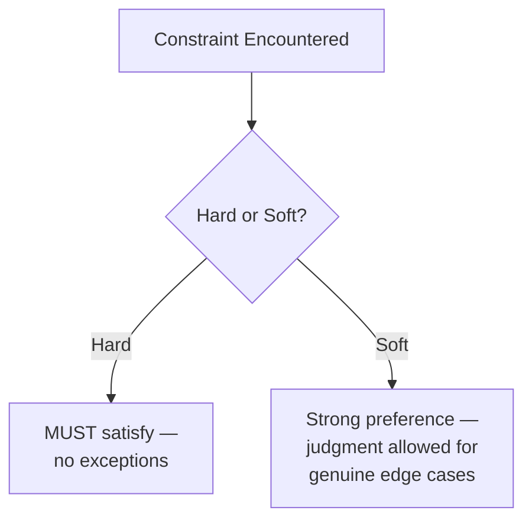
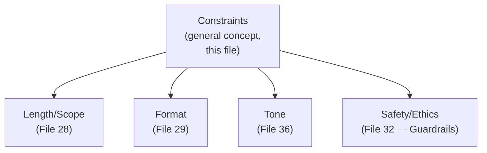

# 31 — Constraints

> **Series:** Prompt Engineering Knowledge Library
> **File 31 of 60** | **Level:** Beginner → Intermediate
> **Prerequisites:** [`05_Prompt_Components.md`](./05_Prompt_Components.md), [`28_Output_Control.md`](./28_Output_Control.md)
> **Next:** [`32_Guardrails.md`](./32_Guardrails.md)

---

## Table of Contents

1. [Definition](#definition)
2. [Why It Matters](#why-it-matters)
3. [Core Concepts](#core-concepts)
4. [How It Works](#how-it-works)
5. [Internal Mechanism](#internal-mechanism)
6. [Types of Constraints](#types-of-constraints)
7. [Syntax / Structure](#syntax--structure)
8. [Examples (Simple → Advanced)](#examples-simple--advanced)
9. [Best Practices](#best-practices)
10. [Common Mistakes](#common-mistakes)
11. [Real-World Applications](#real-world-applications)
12. [Comparison with Related Concepts](#comparison-with-related-concepts)
13. [Advantages & Limitations](#advantages--limitations)
14. [FAQs](#faqs)
15. [Summary](#summary)
16. [Cheat Sheet](#cheat-sheet)
17. [Glossary](#glossary)
18. [References](#references)
19. [Visual Diagram Gallery](#visual-diagram-gallery)

---

## Definition

A **Constraint** is any explicit rule that limits or bounds a model's response — length, scope, format, tone, content inclusion/exclusion, or behavioral boundaries. This file covers the *general umbrella concept*: what a constraint fundamentally is, why it works, and how to write one well, regardless of what specifically it's constraining. [File 32 — Guardrails](./32_Guardrails.md) that follows narrows to a specific, high-stakes *subtype* of constraint — safety and ethical boundaries — while [File 28 — Output Control](./28_Output_Control.md) covers the specific subtype of length/scope constraints already in depth.

> Every constraint answers one of two questions: **"what must this response include or do"** (a positive constraint) or **"what must this response avoid or never do"** (a negative constraint). Nearly every other constrained technique in this library — output control, guardrails, formatting rules — is a specific application of this general concept.

---

## Why It Matters

- **Constraints are the primary mechanism for narrowing a model's vast space of possible responses down to what's actually useful.** As established in [File 9 — Prompt Design Principles](./09_Prompt_Design_Principles.md), specificity is what narrows acceptable outputs — constraints are the concrete technique that implements specificity in practice.
- **Unconstrained prompts produce high-variance output.** Without explicit boundaries, a model draws from the full breadth of patterns learned in training, which can be far wider than what any single application actually needs.
- **Constraints are compositional** — a single prompt typically layers several distinct constraint types simultaneously (length + tone + scope + format), and understanding constraints as a general category makes this composition deliberate rather than accidental.
- **Nearly every other file in this library either applies constraints or is itself a specific type of constraint** — understanding the general concept well pays off across the whole library, not just this one file.

---

## Core Concepts

| Concept | Definition |
|---|---|
| **Positive Constraint** | A rule specifying what must be included or done |
| **Negative Constraint** | A rule specifying what must be avoided or never done |
| **Hard Constraint** | A rule with no acceptable exception |
| **Soft Constraint** | A preference that should generally be followed but allows judgment |
| **Constraint Stacking** | Applying multiple distinct constraints simultaneously within one prompt |
| **Constraint Conflict** | A situation where two or more stated constraints cannot all be simultaneously satisfied |

---

## How It Works



Each additional constraint narrows the effective space of acceptable outputs further — this is precisely why constraint stacking is such a powerful technique, but also why over-constraining (discussed in Limitations) can eventually narrow the space so far that no genuinely good response remains possible within the stated bounds.

---

## Internal Mechanism

### Why explicit constraints outperform implicit expectation, mechanically

As established in [File 4 — How LLMs Interpret Prompts](./04_How_LLMs_Interpret_Prompts.md), a model generates each token as a probabilistic draw shaped by everything in its context. Without an explicit constraint, the model's implicit "default" behavior for a given task is itself a probability distribution learned from enormously diverse training data — meaning the *unconstrained* baseline is not a single predictable behavior but a wide range of plausible ones. An explicit constraint doesn't just express a preference; it mechanically shifts the token-level probability distribution at each generation step toward outputs consistent with that constraint, which is why concrete, explicit constraints produce measurably more consistent results than hoping the model "figures out" an unstated expectation — this directly extends the specificity discussion from [File 9](./09_Prompt_Design_Principles.md) and the length-control discussion from [File 28](./28_Output_Control.md) into the fully general case.

### Why constraint conflicts are a distinct, predictable failure mode

When two stated constraints genuinely cannot both be satisfied (e.g., "be comprehensive" and "answer in one sentence" for a genuinely complex question), the model must implicitly resolve this conflict somehow — and because no explicit priority was given, that resolution is not fully predictable or consistent across runs. This is mechanically similar to the instruction-conflict problem covered in [File 27 — Instruction Following](./27_Instruction_Following.md), but occurring *within* a single instruction source rather than *between* different-trust sources — the fix is the same in spirit: when constraints could conflict, explicitly state which one takes priority, rather than leaving the model to resolve the tension unpredictably.

---

## Types of Constraints

| Type | Description | Example |
|---|---|---|
| **Length Constraint** | Bounds response size (covered fully in [File 28](./28_Output_Control.md)) | "Under 100 words" |
| **Scope Constraint** | Bounds topical content (covered fully in [File 28](./28_Output_Control.md)) | "Only discuss X, not Y" |
| **Format Constraint** | Bounds structural organization (covered fully in [File 29](./29_Output_Formatting.md)) | "Respond only in JSON" |
| **Tone Constraint** | Bounds voice/register (covered fully in [File 36](./36_Tone_Control.md)) | "Formal, no contractions" |
| **Content Inclusion Constraint** | Requires specific content be present | "Always cite a source" |
| **Content Exclusion Constraint** | Requires specific content be absent | "Never mention pricing" |
| **Behavioral/Safety Constraint** | Bounds what actions or content the model will produce at all (the specific focus of [File 32 — Guardrails](./32_Guardrails.md)) | "Never provide medical dosing advice" |

---

## Syntax / Structure

Constraints are typically gathered explicitly, often in a dedicated section, with hard versus soft distinction made clear:

```text
[CONSTRAINTS]
HARD (no exceptions):
- Never include the customer's full payment card number.
- Response must be valid JSON.

SOFT (strong preference, use judgment for edge cases):
- Aim for under 150 words.
- Prefer a warm, conversational tone.

PRIORITY IF CONFLICTING: If satisfying the length constraint 
would require omitting a HARD-constrained required element, 
the HARD constraint always wins — exceed the length rather 
than violate a hard rule.
```

---

## Examples (Simple → Advanced)

**Level 1 — Single constraint:**
```text
Summarize this article in 2 sentences.
```

**Level 2 — Two stacked constraints:**
```text
Summarize this article in 2 sentences, using a neutral, 
journalistic tone.
```

**Level 3 — Positive and negative constraint together:**
```text
Summarize this article in 2 sentences. Include the main 
statistic mentioned. Do not include the author's name.
```

**Level 4 — Hard vs. soft constraint distinction:**
```text
Summarize this article. 
HARD: Must be valid JSON with a "summary" field.
SOFT: Aim for 2-3 sentences, but prioritize completeness over 
strict brevity if the article is unusually complex.
```

**Level 5 — Full constraint stack with explicit conflict resolution:**
```text
[CONSTRAINTS]
- HARD: Response must be valid JSON: {"summary": "string", 
  "word_count": number}
- HARD: Never include specific dollar figures — use 
  "significant cost" instead.
- SOFT: Aim for 50-80 words in the summary field.
- SOFT: Neutral, professional tone.

PRIORITY: If achieving both the 50-80 word target AND full 
coverage of all HARD-required content is not possible, exceed 
the word target rather than omit required content.
```

---

## Best Practices

1. **Distinguish hard from soft constraints explicitly** — treating every constraint as equally rigid, or equally flexible, produces inconsistent results.
2. **State explicit priority when constraints could plausibly conflict**, rather than leaving resolution to chance (per the Internal Mechanism section).
3. **Prefer concrete, checkable constraints over vague ones** — "under 100 words" over "brief," per [File 9](./09_Prompt_Design_Principles.md)'s specificity principle.
4. **Don't over-stack constraints beyond what the task genuinely needs** — each additional constraint narrows the acceptable-output space further, and excessive narrowing can make no good response possible at all.
5. **Test constraint combinations together**, not just individually ([File 14 — Prompt Testing](./14_Prompt_Testing.md)) — two constraints that work fine alone can interact unexpectedly when stacked.

---

## Common Mistakes

| Mistake | Consequence | Fix |
|---|---|---|
| Treating all constraints as equally hard | Rigid, sometimes unhelpful responses in edge cases that would benefit from flexibility | Explicitly distinguish hard from soft constraints |
| Stacking conflicting constraints with no priority stated | Unpredictable resolution of the conflict | Explicitly state which constraint wins when conflicts arise |
| Vague constraint language | Inconsistent adherence | Use concrete, checkable criteria |
| Over-constraining a task | No response can satisfy every stated bound; degraded quality | Constrain only what genuinely needs bounding |
| Testing constraints in isolation only | Missed interaction effects when constraints are combined | Test realistic, full constraint stacks together |

---

## Real-World Applications

- **Production content generation pipelines** — nearly every deployed prompt stacks multiple constraint types simultaneously (length, tone, format, exclusions).
- **Regulated industries** — hard content-exclusion constraints (no specific medical/legal/financial claims without disclaimers) are a direct compliance mechanism.
- **API-integrated systems** — hard format constraints ensure downstream parseability, directly connecting to [File 29 — Output Formatting](./29_Output_Formatting.md).
- **Brand voice consistency** — soft tone constraints, applied consistently across many prompts, maintain a recognizable voice at scale.

---

## Comparison with Related Concepts

| Concept | Difference from "Constraints" |
|---|---|
| **Guardrails (File 32)** | Guardrails are a specific, high-stakes *subtype* of constraint — specifically safety, ethical, and behavioral boundaries — while this file covers the general concept applicable to any limiting rule |
| **Output Control (File 28)** | Output control is the specific application of constraint technique to length and scope; this file is the general umbrella concept those specific applications draw from |
| **Prompt Design Principles (File 9)** | Specificity is the abstract *principle*; constraints are the concrete *technique* that implements specificity in an actual prompt |

---

## Advantages & Limitations

### ✅ Advantages of Explicit Constraint Design

- **Narrows output variance measurably**, producing more consistent, predictable results.
- **Composable** — multiple constraint types stack naturally to shape a response precisely.
- **Provides a general mental model** applicable across nearly every other technique in this library.

### ⚠️ Limitations

- **Over-constraining can eliminate all good responses** — each additional bound narrows the acceptable space, and excessive narrowing can leave no space at all.
- **Constraint conflicts, if unaddressed, produce unpredictable resolution** — this requires deliberate attention, not automatic handling.
- **Like other prompt-level techniques, constraint adherence is a strong but probabilistic tendency**, not an absolute guarantee — validation ([File 30](./30_Response_Validation.md)) remains valuable for hard, critical constraints.

---

## FAQs

**Q: How many constraints can I stack before it becomes counterproductive?**
A: There's no fixed number — the practical signal is whether the constraints, taken together, still leave room for a genuinely good response; test combinations rather than assuming more is always better.

**Q: Should I always state whether a constraint is hard or soft?**
A: For anything beyond the simplest, single-constraint prompt, yes — this explicit distinction (per Best Practices) is what allows the model to resolve edge cases sensibly rather than either being too rigid or too loose.

**Q: What's the difference between a constraint and a guardrail?**
A: A guardrail is a constraint — specifically one bounding safety, ethical, or behavioral territory. Every guardrail is a constraint; not every constraint is a guardrail. See [File 32](./32_Guardrails.md).

**Q: Can constraints be relaxed mid-conversation?**
A: Yes, if explicitly stated — but per [File 21 — System Prompts](./21_System_Prompts.md)'s trust hierarchy, persistent system-level constraints generally shouldn't be overridable by a simple later user request, particularly for hard/safety-relevant ones.

---

## Summary

A Constraint is any explicit rule bounding a model's response — the general concept underlying length control, format specification, tone requirements, content inclusion/exclusion rules, and safety guardrails alike. Constraints work by narrowing the model's token-level probability distribution toward outputs consistent with the stated rule, which is why explicit, concrete constraints reliably outperform implicit expectation; distinguishing hard from soft constraints and explicitly resolving potential conflicts between them prevents the unpredictable resolution that otherwise results. Having covered this general umbrella concept, the library narrows next to its highest-stakes specific subtype: [File 32 — Guardrails](./32_Guardrails.md).

---

## Cheat Sheet

```text
CONSTRAINTS — QUICK REFERENCE

TYPES
Positive (must include) | Negative (must avoid) | 
Hard (no exceptions) | Soft (judgment allowed)

STACKING RULE: State explicit priority when constraints 
could conflict — don't leave resolution to chance.

COMMON CONSTRAINT CATEGORIES (each with its own dedicated file)
Length/Scope    -> File 28 (Output Control)
Format          -> File 29 (Output Formatting)
Tone            -> File 36 (Tone Control)
Safety/Ethics   -> File 32 (Guardrails)
```

---

## Glossary

| Term | Definition |
|---|---|
| **Positive Constraint** | A rule specifying required content or behavior |
| **Negative Constraint** | A rule specifying prohibited content or behavior |
| **Hard Constraint** | A rule with no acceptable exception |
| **Soft Constraint** | A strong preference allowing judgment |
| **Constraint Stacking** | Applying multiple constraints simultaneously |
| **Constraint Conflict** | Two or more constraints that cannot all be satisfied |

---

## References

- Anthropic — [Be Clear, Direct, and Detailed](https://docs.claude.com/en/docs/build-with-claude/prompt-engineering/be-clear-and-direct)
- OpenAI — [Prompt Engineering: Specifying Output Requirements](https://platform.openai.com/docs/guides/prompt-engineering)
- Reynolds, L. & McDonell, K. (2021) — *Prompt Programming for Large Language Models*, arXiv:2102.07350
- Zhou, Y. et al. (2022) — *Large Language Models Are Human-Level Prompt Engineers*, arXiv:2211.01910

---

## Visual Diagram Gallery

**Diagram 1 — Constraint Narrowing the Output Space**
```text
UNCONSTRAINED:  [═══════════ very wide space ═══════════]
+ 1 constraint: [═══════ narrower ═══════]
+ 2 constraints:[═══ narrower still ═══]
+ 3 constraints:[═ precisely targeted ═]
(too many constraints -> [ ] no room left for a good response)
```

**Diagram 2 — Hard vs. Soft Constraint Resolution**


**Diagram 3 — Constraint Taxonomy Across This Library**


---

**⬅️ Previous:** [`30_Response_Validation.md`](./30_Response_Validation.md)
**➡️ Next:** [`32_Guardrails.md`](./32_Guardrails.md) — The safety- and ethics-specific subtype of constraint.
