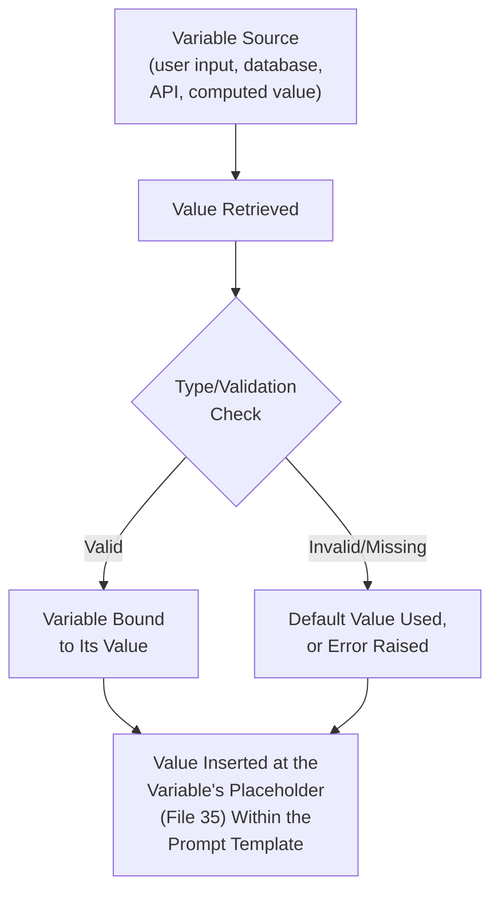
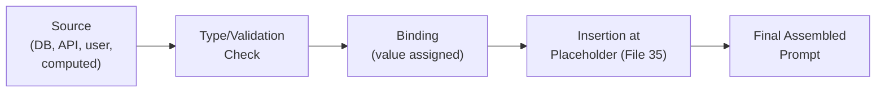
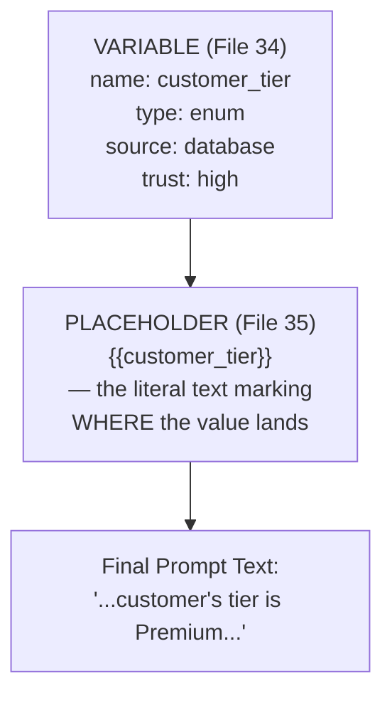

# 34 — Variables

> **Series:** Prompt Engineering Knowledge Library
> **File 34 of 60** | **Level:** Intermediate
> **Prerequisites:** [`33_Delimiters.md`](./33_Delimiters.md), [`18_Prompt_Templates.md`](./18_Prompt_Templates.md)
> **Next:** [`35_Placeholders.md`](./35_Placeholders.md)

---

## Table of Contents

1. [Definition](#definition)
2. [Why It Matters](#why-it-matters)
3. [Core Concepts](#core-concepts)
4. [How It Works](#how-it-works)
5. [Internal Mechanism](#internal-mechanism)
6. [Types of Variables](#types-of-variables)
7. [Syntax / Structure](#syntax--structure)
8. [Examples (Simple → Advanced)](#examples-simple--advanced)
9. [Best Practices](#best-practices)
10. [Common Mistakes](#common-mistakes)
11. [Real-World Applications](#real-world-applications)
12. [Comparison with Related Concepts](#comparison-with-related-concepts)
13. [Advantages & Limitations](#advantages--limitations)
14. [FAQs](#faqs)
15. [Summary](#summary)
16. [Cheat Sheet](#cheat-sheet)
17. [Glossary](#glossary)
18. [References](#references)
19. [Visual Diagram Gallery](#visual-diagram-gallery)

---

## Definition

A **Variable**, in prompt engineering, is a named unit of data that flows into a prompt from the surrounding application at request time — conceptually identical to a variable in ordinary programming, holding a value that can change between uses while the prompt's fixed scaffolding stays constant. This file covers the *conceptual and programmatic* layer: what a variable fundamentally is, how it's scoped, typed, and where its value comes from — as distinct from [File 35 — Placeholders](./35_Placeholders.md), which covers the *concrete syntax conventions* (which bracket style, naming rules, escaping) used to actually mark a variable's insertion point within prompt text.

> A useful distinction: a **variable** is the *thing* — a named slot holding data with a type, a source, and a scope. A **placeholder** ([File 35](./35_Placeholders.md)) is *how you write it* — the specific `{{curly_braces}}` or `[SQUARE_BRACKETS]` syntax marking where that variable's value gets inserted into the literal prompt text.

---

## Why It Matters

- **Variables are what make [templates](./18_Prompt_Templates.md) actually reusable.** A template's "variable slots" are, precisely, variables in this file's sense — named, typed, sourced units of data distinguishing the fixed scaffolding from what changes per use.
- **Understanding variable scope and source prevents a specific, serious class of error** — conflating a variable that should come from a verified, trusted source with one that comes from unverified user input, directly connecting to the trust-tier concepts in [File 23](./23_Developer_Prompts.md) and [File 26](./26_Context_Injection.md).
- **Typed thinking about variables catches errors before they reach the model.** Knowing a variable is expected to be a number, a fixed enum, or free text lets an application validate it before insertion, rather than discovering a malformed value only after a bad response.
- **Variables are the connective tissue between application code and prompt text** — nearly every production LLM system involves some data flowing from a database, an API, or user input into a prompt, and that flow is precisely what this file describes.

---

## Core Concepts

| Concept | Definition |
|---|---|
| **Variable** | A named unit of data that flows into a prompt at request time |
| **Variable Scope** | Where a variable's value is valid and how long it persists (a single turn, a whole session, an application-wide constant) |
| **Variable Type** | The kind of data a variable holds (string, number, enum, boolean, structured object) |
| **Variable Source** | Where a variable's value originates (user input, database, API call, computed value) |
| **Binding** | The act of assigning an actual value to a variable for a specific use |
| **Default Value** | A fallback value used when a variable's actual value is missing or unavailable |

---

## How It Works



A variable's lifecycle runs from source through validation to binding to insertion — the placeholder ([File 35](./35_Placeholders.md)) is only the final, visible step of this chain, marking *where* in the prompt text the already-validated, already-bound value actually lands.

---

## Internal Mechanism

### Why variable source and trust level must be tracked together, not treated as an afterthought

Recall from [File 23 — Developer Prompts](./23_Developer_Prompts.md) and [File 26 — Context Injection](./26_Context_Injection.md) that different content sources warrant different trust levels, and that trust must be structurally, not just textually, established. A variable's *source* directly determines what trust level its bound value should carry once inserted into the prompt — a variable sourced from a verified internal database (e.g., a customer's confirmed account tier) warrants meaningfully higher trust than a variable sourced from raw, unvalidated user input. Treating "variable" as a purely mechanical, source-agnostic concept — just a named slot to be filled — misses this critical distinction; well-designed systems track source and trust level as a property of the variable itself, propagating that trust level through to how the variable's placeholder is delimited and framed in the final prompt (per [File 33 — Delimiters](./33_Delimiters.md)'s trust-tagging practices).

### Why type validation before insertion prevents a specific, avoidable failure class

Because a model generates output as a probabilistic function of its full input context ([File 4](./04_How_LLMs_Interpret_Prompts.md)), inserting a malformed or unexpected-type variable value doesn't cause a clean, traditional software error — it simply becomes part of the prompt text, and the model does its best to work with it, often producing a plausible-looking but subtly wrong response rather than a clear failure signal. This is mechanically different from traditional programming, where a type mismatch typically raises an immediate, loud error. This is precisely why validating a variable's type and expected range *before* insertion — rather than discovering a problem only by inspecting the model's output afterward — is a meaningfully more reliable practice: it converts a silent, hard-to-diagnose failure mode into an explicit, catchable one at the point where the actual error originates.

---

## Types of Variables

| Type | Description | Example |
|---|---|---|
| **String Variable** | Free-text data | Customer's name, a document's body text |
| **Numeric Variable** | Numbers, often with an expected range | Order total, account age in years |
| **Enum Variable** | A value restricted to a fixed, known set of options | Account tier: "standard" \| "premium" |
| **Boolean Variable** | True/false data | "has_active_subscription" |
| **Structured/Object Variable** | Multi-field composite data | A full order record with several sub-fields |
| **Computed Variable** | A value derived from other variables or logic, not sourced directly | "days_since_last_contact", calculated from a timestamp |

---

## Syntax / Structure

While concrete insertion syntax is [File 35](./35_Placeholders.md)'s focus, a variable's *definition* — independent of how it's later marked in prompt text — is typically specified with its type, source, and validation rules:

```yaml
# Example: a variable definition, independent of insertion syntax
variable: customer_account_tier
type: enum
allowed_values: [standard, premium, enterprise]
source: verified_internal_database
trust_level: high
default_if_missing: standard
required: true

variable: customer_message
type: string
source: direct_user_input
trust_level: low  # per File 22 — user-authored, less trusted
max_length: 2000
required: true
```

---

## Examples (Simple → Advanced)

**Level 1 — A single, simple string variable:**
```text
Variable: topic (type: string, source: user input)
Used in: "Explain {topic} in simple terms."
```

**Level 2 — Adding a typed, validated variable:**
```text
Variable: sentence_count (type: number, range: 1-5, 
default: 3, source: application configuration)
Used in: "Summarize this in {sentence_count} sentences."
```

**Level 3 — Enum variable with a fixed value set:**
```text
Variable: tone (type: enum, allowed: [formal, casual, 
technical], source: application configuration)
Used in: "Rewrite this in a {tone} tone."
```

**Level 4 — Structured variable with multiple sub-fields:**
```text
Variable: customer_record (type: object, source: verified 
database)
  Sub-fields: name (string), tier (enum), account_age_years 
  (number)
Used in: "The customer, {customer_record.name}, is a 
{customer_record.tier} member of {customer_record.
account_age_years} years."
```

**Level 5 — Full variable set with mixed trust levels, feeding a production prompt:**
```yaml
variables:
  - name: system_scope
    type: string
    source: developer_authored_constant
    trust_level: highest
  - name: customer_tier
    type: enum
    source: verified_internal_database
    trust_level: high
  - name: retrieved_policy_excerpt
    type: string
    source: rag_retrieval
    trust_level: moderate  # developer-controlled retrieval, 
                            # but content itself may be complex
  - name: customer_question
    type: string
    source: direct_user_input
    trust_level: low
    max_length: 2000

-> Each variable's trust level, established here at the 
   variable-definition layer, directly determines which 
   delimiter style (File 33) and placeholder framing (File 35) 
   it receives once actually inserted into the assembled prompt.
```

---

## Best Practices

1. **Define a variable's type, source, and trust level explicitly**, not just its name — this upfront clarity prevents the trust-conflation risk discussed in the Internal Mechanism section.
2. **Validate variable values before insertion**, not just after observing model output — this converts a silent failure mode into an explicit, catchable one.
3. **Specify sensible default values** for variables that might legitimately be missing, rather than leaving undefined behavior.
4. **Track trust level as a first-class property of each variable**, propagating it through to delimiter and framing choices downstream ([File 33](./33_Delimiters.md)).
5. **Treat structured/object variables as composite units with validated sub-fields**, not as opaque blobs — this supports more precise validation and more semantic insertion.

---

## Common Mistakes

| Mistake | Consequence | Fix |
|---|---|---|
| Treating all variables as equally trusted regardless of source | Under- or over-trusting content once inserted into the prompt | Explicitly track trust level as a variable property, tied to source |
| No type validation before insertion | Malformed values become silent, hard-to-diagnose prompt content rather than a clear error | Validate type/range before insertion, not just after |
| No default value for a variable that might be missing | Undefined, unpredictable behavior on missing data | Specify sensible defaults explicitly |
| Treating structured variables as unstructured blobs | Missed opportunity for sub-field-level validation and precision | Define and validate sub-fields individually |
| Confusing "variable" (the data concept) with its insertion syntax | Conflated thinking that makes trust/type discussions harder to have clearly | Keep the conceptual variable distinct from its placeholder syntax ([File 35](./35_Placeholders.md)) |

---

## Real-World Applications

- **Every templated production prompt** ([File 18](./18_Prompt_Templates.md)) — variables are the data-flow layer underlying template reuse across many requests.
- **RAG and personalization systems** — customer account data, retrieved documents, and conversation history are all variables flowing from distinct sources with distinct trust levels into a single assembled prompt.
- **Multi-tenant AI platforms** — different customers' configuration values are themselves variables, often with an "application configuration" source distinct from both developer-authored constants and end-user input.
- **Structured data extraction pipelines** — the extracted output itself is often designed as a set of typed variables, directly informing the schema specified in [File 29 — Output Formatting](./29_Output_Formatting.md).

---

## Comparison with Related Concepts

| Concept | Difference from "Variables" |
|---|---|
| **Placeholders (File 35)** | Variables are the conceptual data unit (name, type, source, trust); placeholders are the concrete syntax marking where that variable's value is inserted into literal prompt text — variables are "what," placeholders are "how it's written" |
| **Prompt Templates (File 18)** | A template is the complete, reusable prompt structure containing variable slots; variables are the individual data units that fill those slots |
| **Context Injection (File 26)** | Context injection covers the security dynamics of external content entering a prompt broadly; variables provide the more granular, typed, source-tracked unit that context injection's trust principles apply to |

---

## Advantages & Limitations

### ✅ Advantages of Explicit Variable Modeling

- **Enables systematic trust tracking**, preventing the conflation of differently-sourced data at different trust levels.
- **Supports validation before insertion**, converting silent failures into explicit, catchable errors.
- **Provides the conceptual foundation for reliable templating** at production scale.

### ⚠️ Limitations

- **Adds genuine upfront design overhead** — explicitly typing, sourcing, and trust-tagging every variable takes more effort than informally splicing values into a prompt string.
- **Doesn't eliminate the need for downstream validation** ([File 30](./30_Response_Validation.md)) — pre-insertion variable validation and post-generation response validation address different points in the pipeline and both remain valuable.
- **Trust-level assignment itself requires judgment** — determining exactly how much to trust a given source is not always a mechanical decision.

---

## FAQs

**Q: Is a "variable" in this sense the same as a variable in a programming language?**
A: Conceptually very similar — a named unit holding a value that can change between uses — the main addition here is the emphasis on trust level as a first-class property, which matters specifically because of how prompt content is processed ([File 4](./04_How_LLMs_Interpret_Prompts.md)), unlike an ordinary programming variable.

**Q: Do I need to formally define type and source for every variable, even in a simple prompt?**
A: Not for a simple, low-stakes, single-use prompt — this formal modeling earns its value as complexity, reuse, and stakes increase, particularly once multiple variables with different trust levels are combined in one prompt.

**Q: What happens if a variable's actual value doesn't match its defined type?**
A: This should be caught by validation before insertion, per Best Practices — a well-designed system rejects or corrects an invalid value at this stage rather than allowing it to silently become part of the prompt text.

**Q: How is variable trust level different from delimiter choice?**
A: They're related but distinct — trust level (this file) is a property of the *data itself*, determined by its source; delimiter choice ([File 33](./33_Delimiters.md)) is how that trust level gets *expressed and enforced* structurally once the variable's value is actually inserted into the prompt.

---

## Summary

A Variable is a named, typed, sourced unit of data flowing into a prompt from the surrounding application — the conceptual and programmatic layer underlying every reusable template, distinguished by this file from [File 35 — Placeholders](./35_Placeholders.md)'s concrete syntax for marking a variable's insertion point. Because a model has no mechanism for automatically inferring a variable's trust level or catching a type mismatch on its own, well-designed systems track source and trust level as first-class variable properties and validate type/range before insertion — converting what would otherwise be a silent, hard-to-diagnose failure mode into an explicit, catchable one at the point where the actual error originates. Having covered the conceptual data layer, the library turns immediately to the concrete syntax layer that makes variables visible and usable within actual prompt text: [File 35 — Placeholders](./35_Placeholders.md).

---

## Cheat Sheet

```text
VARIABLES — QUICK REFERENCE

DEFINE FOR EVERY VARIABLE
[ ] Type (string, number, enum, boolean, object)
[ ] Source (user input, database, API, computed)
[ ] Trust level (tied directly to source)
[ ] Default value (for when it might be missing)
[ ] Validation rules (range, allowed values, max length)

KEY DISTINCTION
Variable (this file)   = the DATA concept — name, type, source, trust
Placeholder (File 35)  = the SYNTAX — {{how it's written in the prompt}}

GOLDEN RULE: Validate BEFORE insertion — a malformed value 
inserted into a prompt doesn't error cleanly, it just becomes 
confusing prompt text the model tries its best with.
```

---

## Glossary

| Term | Definition |
|---|---|
| **Variable** | A named unit of data flowing into a prompt at request time |
| **Variable Scope** | Where and how long a variable's value is valid |
| **Variable Type** | The kind of data a variable holds |
| **Variable Source** | Where a variable's value originates |
| **Binding** | Assigning an actual value to a variable for a specific use |
| **Default Value** | A fallback used when a variable's value is missing |

---

## References

- Anthropic — [Use Prompt Templates and Variables](https://docs.claude.com/en/docs/build-with-claude/prompt-engineering/use-xml-tags)
- Wallace, E. et al. (2024) — *The Instruction Hierarchy: Training LLMs to Prioritize Privileged Instructions*, arXiv:2404.13208 (source/trust tracking background)
- OpenAI — [Prompt Templates in Production Systems](https://platform.openai.com/docs/guides/prompt-engineering)
- Lewis, P. et al. (2020) — *Retrieval-Augmented Generation for Knowledge-Intensive NLP Tasks*, arXiv:2005.11401 (retrieved-content-as-variable background)

---

## Visual Diagram Gallery

**Diagram 1 — A Variable's Full Lifecycle**


**Diagram 2 — Trust Level Traced from Source to Variable**
```text
SOURCE                         TRUST LEVEL (inherited by variable)
Developer-authored constant  → Highest
Verified internal database   → High
RAG retrieval                → Moderate
Direct user input            → Low
```

**Diagram 3 — Variable vs. Placeholder (the core distinction)**


---

**⬅️ Previous:** [`33_Delimiters.md`](./33_Delimiters.md)
**➡️ Next:** [`35_Placeholders.md`](./35_Placeholders.md) — The concrete syntax conventions for marking a variable's insertion point.
