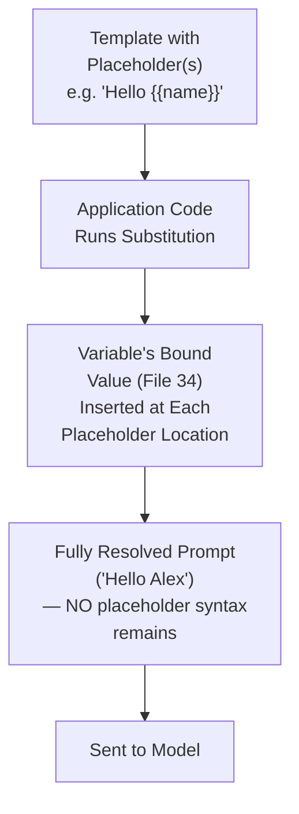
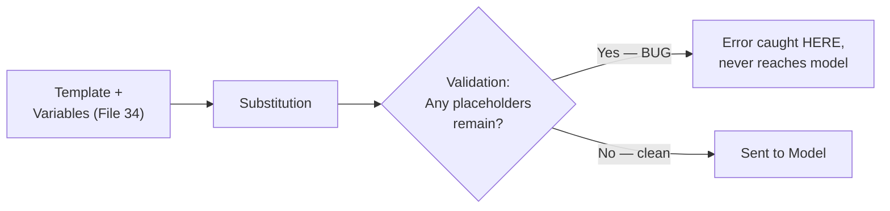

# 35 — Placeholders

> **Series:** Prompt Engineering Knowledge Library
> **File 35 of 60** | **Level:** Beginner → Intermediate
> **Prerequisites:** [`34_Variables.md`](./34_Variables.md), [`33_Delimiters.md`](./33_Delimiters.md)
> **Next:** [`36_Tone_Control.md`](./36_Tone_Control.md)

---

## Table of Contents

1. [Definition](#definition)
2. [Why It Matters](#why-it-matters)
3. [Core Concepts](#core-concepts)
4. [How It Works](#how-it-works)
5. [Internal Mechanism](#internal-mechanism)
6. [Types of Placeholder Syntax](#types-of-placeholder-syntax)
7. [Syntax / Structure](#syntax--structure)
8. [Examples (Simple → Advanced)](#examples-simple--advanced)
9. [Best Practices](#best-practices)
10. [Common Mistakes](#common-mistakes)
11. [Real-World Applications](#real-world-applications)
12. [Comparison with Related Concepts](#comparison-with-related-concepts)
13. [Advantages & Limitations](#advantages--limitations)
14. [FAQs](#faqs)
15. [Summary](#summary)
16. [Cheat Sheet](#cheat-sheet)
17. [Glossary](#glossary)
18. [References](#references)
19. [Visual Diagram Gallery](#visual-diagram-gallery)

---

## Definition

A **Placeholder** is the specific, literal syntax marker — `{{name}}`, `[TOPIC]`, `${value}`, `<var>content</var>` — written directly into prompt text to indicate where a [Variable](./34_Variables.md)'s bound value should be inserted. This file covers the concrete syntax layer: which bracket style to choose, naming conventions, and the parsing considerations that make one placeholder convention more reliable than another — the "how it's written" complement to [File 34](./34_Variables.md)'s "what it conceptually is."

> A placeholder is, in effect, a specialized delimiter ([File 33](./33_Delimiters.md)) — but where a general delimiter bounds a *section* of content, a placeholder marks a *single point* meant to be programmatically replaced before the prompt ever reaches the model. By the time the model sees the prompt, the placeholder itself should be gone, replaced entirely by the variable's actual value.

---

## Why It Matters

- **Placeholder syntax choice directly affects parsing reliability at the application layer**, not the model layer — this is a subtle but important distinction from most of this library's other techniques, since placeholder substitution typically happens in application code *before* the model ever sees the prompt.
- **Consistent, well-chosen placeholder conventions prevent a specific class of bug**: accidental substitution collisions, where the placeholder syntax itself appears naturally in legitimate content and gets mistakenly replaced or mis-parsed.
- **Placeholder readability affects prompt maintainability** — a well-named, consistently-styled placeholder (`{{customer_name}}`) is far easier for a human reviewing or editing a template to understand than a cryptic one (`{{x1}}`).
- **It's the final, concrete link connecting [File 34](./34_Variables.md)'s conceptual variable modeling to [File 18](./18_Prompt_Templates.md)'s actual, working templates** — understanding this layer well is what makes template design genuinely reliable in practice.

---

## Core Concepts

| Concept | Definition |
|---|---|
| **Placeholder Marker** | The specific bracket/syntax style used (e.g., `{{ }}`, `[ ]`, `${ }`) |
| **Substitution** | The application-layer process of replacing a placeholder with its variable's actual value |
| **Naming Convention** | The rules governing how placeholder names are written (case, separators, prefixes) |
| **Substitution Collision** | When placeholder-like syntax appears in legitimate content and is mistakenly parsed as a real placeholder |
| **Pre-Model Resolution** | The principle that placeholders should be fully substituted before the prompt reaches the model |
| **Placeholder Validation** | Checking, before sending a prompt, that every placeholder was successfully substituted (none left unfilled) |

---

## How It Works



The critical structural principle visible in this diagram: placeholder substitution is an *application-layer, pre-model* step. The model should never actually see literal placeholder syntax like `{{name}}` in a well-functioning system — if it does, that's a signal something went wrong in the substitution step, not a normal part of the model's input.

---

## Internal Mechanism

### Why substitution collisions are a genuine, not merely theoretical, risk

Because placeholder substitution is typically implemented as straightforward text-replacement logic in application code, it operates purely syntactically — it has no semantic understanding of *intent*. If a chosen placeholder style happens to use common characters (e.g., plain square brackets `[ ]`, which frequently appear in legitimate user content like "see reference [1]" or casual asides), a naive substitution implementation risks either accidentally matching and mangling that legitimate content, or failing to distinguish a genuine placeholder from incidental bracket use in injected data ([File 26](./26_Context_Injection.md)). This is mechanically analogous to the delimiter collision risk covered in [File 33](./33_Delimiters.md), but occurring one layer earlier — in application code doing the substitution — rather than in the model's interpretation of already-substituted text. This is precisely why more distinctive placeholder syntax (double curly braces `{{ }}`, which rarely appear naturally in ordinary prose) is generally preferred in production templating systems over simple single-bracket styles.

### Why unfilled placeholders are a distinct, checkable failure mode worth validating explicitly

A specific, concrete failure mode unique to this layer: if a variable's value is unexpectedly missing or the substitution step has a bug, the literal placeholder text can end up being sent to the model unchanged (e.g., the model actually receives "Hello {{name}}" rather than "Hello Alex"). Because the model will attempt to respond helpfully to whatever text it receives ([File 4](./04_How_LLMs_Interpret_Prompts.md)), this doesn't necessarily produce an obvious, loud failure — the model might generate a plausible-sounding response that awkwardly incorporates or ignores the literal placeholder text, masking the underlying bug rather than surfacing it clearly. This is exactly why explicit, automated placeholder validation — checking that a fully-substituted prompt contains zero remaining placeholder-syntax patterns before it's sent to the model — is a genuinely valuable, cheap safeguard, converting a potentially silent failure into an immediately caught one.

---

## Types of Placeholder Syntax

| Style | Example | Collision Risk | Best Suited For |
|---|---|---|---|
| **Double Curly Braces** | `{{customer_name}}` | Low (distinctive, rare in prose) | General-purpose production templating; the most common modern convention |
| **Single Square Brackets** | `[TOPIC]` | Moderate-High (brackets appear in ordinary text) | Simple, low-stakes, human-authored templates |
| **Dollar-Brace** | `${value}` | Low-Moderate | Systems already using this convention elsewhere (e.g., shell scripting-adjacent tooling) |
| **XML-Style Variable Tags** | `<var name="topic"/>` | Very Low | High-security or highly structured production systems, combining with [File 33](./33_Delimiters.md)'s XML delimiting |
| **Percent-Style** | `%TOPIC%` | Moderate | Legacy or platform-specific templating conventions |
| **Colon-Prefixed** | `:topic` | Moderate-High | Database query templating (mirrors common SQL parameter conventions) |

---

## Syntax / Structure

```text
# Double curly brace convention (most common modern default)
"Hello {{customer_name}}, your order #{{order_id}} has shipped."

# After substitution (what the model actually receives):
"Hello Alex, your order #48213 has shipped."
```

```xml
<!-- XML-style variable tags, combining with File 33's delimiting 
     for maximum clarity in high-stakes contexts -->
<template>
Dear <var name="customer_name"/>,

Your account tier is <var name="account_tier"/>, and your 
most recent order (<var name="order_id"/>) was delivered on 
<var name="delivery_date"/>.
</template>
```

```python
# Example: application-layer substitution with collision-safe 
# placeholder syntax and explicit unfilled-placeholder validation
import re

def render_template(template: str, variables: dict) -> str:
    result = template
    for name, value in variables.items():
        result = result.replace(f"{{{{{name}}}}}", str(value))

    # Explicit validation: check no unfilled placeholders remain
    remaining = re.findall(r"\{\{[a-zA-Z_]+\}\}", result)
    if remaining:
        raise ValueError(f"Unfilled placeholders detected: {remaining}")

    return result
```

---

## Examples (Simple → Advanced)

**Level 1 — Basic single placeholder:**
```text
Template: "Explain {{topic}} in simple terms."
Substituted: "Explain photosynthesis in simple terms."
```

**Level 2 — Multiple placeholders in one template:**
```text
Template: "Summarize the following {{document_type}} in 
{{sentence_count}} sentences: {{document_text}}"
Substituted: "Summarize the following news article in 3 
sentences: [actual article text]"
```

**Level 3 — Choosing distinctive syntax to avoid collision:**
```text
[Risky choice — user content might contain literal brackets:]
Template: "Customer said: [customer_message]"
Risk: if customer_message itself contains "[note]" or similar, 
naive substitution logic could misparse

[Safer choice:]
Template: "Customer said: {{customer_message}}"
(Double curly braces are far less likely to appear naturally 
in customer-authored text)
```

**Level 4 — Explicit unfilled-placeholder validation:**
```text
Template: "Hello {{customer_name}}, your tier is {{account_tier}}."
Variables provided: {customer_name: "Alex"}  
(account_tier missing!)

Without validation: Model receives "Hello Alex, your tier is 
{{account_tier}}." — a confusing, silently-broken prompt.

With validation: Application detects the unfilled 
{{account_tier}} placeholder BEFORE sending, raises a clear 
error, and the request is caught and fixed rather than 
producing a degraded, confusing response.
```

**Level 5 — Full production placeholder system with typed variables (File 34) and validation:**
```yaml
template: |
  <role>You are a support assistant for {{company_name}}.</role>
  <context>
  Customer tier: {{customer_tier}}
  Order status: {{order_status}}
  </context>
  <question>{{customer_question}}</question>

variables_required: [company_name, customer_tier, order_status, 
                      customer_question]

pre_send_validation:
  - check_no_unfilled_placeholders: true
  - check_all_required_variables_provided: true
  - check_variable_types_match_definitions: true  # per File 34

-> This combines File 34's typed variable definitions with 
   this file's concrete placeholder syntax and validation, 
   producing a template that fails LOUDLY and EARLY on any 
   substitution problem, rather than silently sending a 
   broken prompt to the model.
```

---

## Best Practices

1. **Choose a distinctive placeholder syntax** (double curly braces or XML-style variable tags) over simple, common-character styles for any production or high-stakes template, per the Internal Mechanism section's collision-risk discussion.
2. **Use clear, descriptive placeholder names** — `{{customer_name}}` over `{{x1}}` — directly supporting template maintainability.
3. **Always validate that substitution fully succeeded** before sending a prompt to the model — explicitly check for zero remaining placeholder-syntax patterns, converting a potentially silent failure into an immediately caught one.
4. **Establish and document a single, consistent placeholder convention** across an organization's template library, rather than mixing styles unpredictably.
5. **Combine placeholder syntax with the delimiter and variable-trust practices** from [Files 33](./33_Delimiters.md) and [34](./34_Variables.md) — placeholders don't operate in isolation from the broader trust and structure considerations those files cover.

---

## Common Mistakes

| Mistake | Consequence | Fix |
|---|---|---|
| Using simple, common-character placeholder syntax (plain brackets) | Higher risk of substitution collision with legitimate content | Use more distinctive syntax (double curly braces, XML variable tags) |
| Cryptic, non-descriptive placeholder names | Harder template maintenance and review | Use clear, descriptive names |
| No validation that substitution fully succeeded | Silent failures — literal placeholder text reaching the model undetected | Explicitly validate zero remaining placeholders before sending |
| Inconsistent placeholder conventions across a template library | Increased confusion and maintenance burden | Standardize and document a single convention |
| Treating placeholder substitution as inherently safe/simple | Underestimating the genuine collision and silent-failure risks covered in this file | Apply the same rigor to placeholder design as to other structural techniques |

---

## Real-World Applications

- **Every production prompt template** ([File 18](./18_Prompt_Templates.md)) — placeholder syntax is the concrete mechanism making template reuse actually functional.
- **Email and notification generation systems** — customer name, order details, and account information are near-universally inserted via placeholder substitution.
- **Multi-language/localization templating** — placeholder-based templates allow the same structural template to be reused across different language variants, with only the surrounding fixed text changing.
- **CI/CD and infrastructure-as-code adjacent prompt systems** — some organizations manage prompt templates with the same rigor as configuration templates, including automated placeholder validation as a build-time check.

---

## Comparison with Related Concepts

| Concept | Difference from "Placeholders" |
|---|---|
| **Variables (File 34)** | Variables are the conceptual data unit (type, source, trust); placeholders are the literal syntax marking where that data gets inserted — "what" versus "how it's written" |
| **Delimiters (File 33)** | Delimiters bound a *section* of content as a distinct unit; placeholders mark a *single point* meant for substitution, and are typically fully removed and replaced before the model sees the prompt, unlike a delimiter which usually persists around content the model does see |
| **Prompt Templates (File 18)** | A template is the complete, reusable prompt structure; placeholders are the specific syntax marking that template's variable slots |

---

## Advantages & Limitations

### ✅ Advantages of Well-Chosen Placeholder Syntax

- **Enables reliable, collision-resistant template substitution** at the application layer, before the model is ever involved.
- **Improves template readability and maintainability** through clear, descriptive naming.
- **Supports explicit, cheap validation** that catches substitution failures before they silently reach the model.

### ⚠️ Limitations

- **Placeholder substitution is purely syntactic, not semantic** — it has no inherent understanding of intent, which is precisely why collision risk is a genuine, not merely theoretical, concern.
- **Adds a layer of application-level complexity** beyond simply writing prompt text directly — justified for reusable templates, less so for genuine one-off prompts.
- **Validation only catches missing/unfilled placeholders, not incorrect values** — a placeholder correctly filled with a wrong or malformed value still requires the variable-level type validation covered in [File 34](./34_Variables.md).

---

## FAQs

**Q: Should the model ever actually see literal placeholder syntax like `{{name}}`?**
A: No — per the "pre-model resolution" principle in this file's Core Concepts, placeholders should always be fully substituted before the prompt reaches the model; seeing literal placeholder text in a model's input is a signal of a substitution bug, not normal operation.

**Q: Is double curly brace syntax always the right choice?**
A: It's a strong, common default specifically because of its low collision risk, but the right choice depends on context — a system already using a different convention elsewhere (e.g., dollar-brace in shell-adjacent tooling) might reasonably standardize on that instead for consistency.

**Q: How is validating "no unfilled placeholders" different from validating a variable's type?**
A: They catch different failure classes — unfilled-placeholder validation (this file) confirms the substitution *process* completed; variable type validation ([File 34](./34_Variables.md)) confirms the substituted *value* itself is well-formed and expected — both are valuable and address different points in the pipeline.

**Q: Can I use different placeholder styles for different variable trust levels?**
A: This isn't a common convention, but is a reasonable, defensible practice for genuinely high-security systems — combining placeholder choice with the trust-tagging and delimiter practices from [Files 33-34](./33_Delimiters.md) for maximum structural clarity.

---

## Summary

A Placeholder is the concrete, literal syntax — double curly braces, XML variable tags, or similar — marking where a [Variable](./34_Variables.md)'s bound value gets inserted into prompt text at the application layer, before the model ever sees the result. Because substitution is a purely syntactic process with no semantic understanding, placeholder syntax choice directly affects collision risk (distinctive syntax like `{{ }}` is far safer than common characters like plain brackets), and because unfilled or mis-substituted placeholders don't fail loudly on their own, explicit pre-send validation — checking for zero remaining placeholder patterns — converts a potentially silent failure into an immediately caught one. Having now covered the full structural chain from delimiters through variables to placeholders, the library turns to a substantively different technique: shaping a response's voice and register, beginning with [File 36 — Tone Control](./36_Tone_Control.md).

---

## Cheat Sheet

```text
PLACEHOLDERS — QUICK REFERENCE

RECOMMENDED SYNTAX (low collision risk)
{{double_curly_braces}}  or  <var name="x"/>

AVOID FOR PRODUCTION (higher collision risk)
[single_brackets]  — common characters, appear in ordinary text

VALIDATION CHECKLIST BEFORE SENDING TO MODEL
[ ] Zero remaining placeholder-syntax patterns in the final text
[ ] All required variables were actually provided
[ ] Substituted values match their expected type (File 34)

GOLDEN RULE: The model should NEVER see literal placeholder 
syntax — if it does, that's a caught bug, not normal input.
```

---

## Glossary

| Term | Definition |
|---|---|
| **Placeholder Marker** | The specific bracket/syntax style used for a placeholder |
| **Substitution** | Replacing a placeholder with its variable's actual value |
| **Naming Convention** | Rules governing how placeholder names are written |
| **Substitution Collision** | Placeholder-like syntax in content mistakenly parsed as real |
| **Pre-Model Resolution** | The principle that placeholders are fully substituted before reaching the model |
| **Placeholder Validation** | Checking that all placeholders were successfully substituted |

---

## References

- Anthropic — [Use Prompt Templates and Variables](https://docs.claude.com/en/docs/build-with-claude/prompt-engineering/use-xml-tags)
- Mustache/Handlebars Templating Documentation (widely-adopted double-curly-brace convention background)
- OWASP — [Top 10 for Large Language Model Applications](https://owasp.org/www-project-top-10-for-large-language-model-applications/) (template injection risk background)
- OpenAI — [Prompt Templates in Production Systems](https://platform.openai.com/docs/guides/prompt-engineering)

---

## Visual Diagram Gallery

**Diagram 1 — The Placeholder Substitution Pipeline**
```text
TEMPLATE (with placeholders)        SUBSTITUTED PROMPT
"Hello {{name}}, your      -->      "Hello Alex, your
tier is {{tier}}."                  tier is Premium."
                                     (model ONLY ever sees this)
```

**Diagram 2 — Collision Risk: Bracket Style Comparison**
```text
[TOPIC]  — plain brackets — RISK: "See reference [1] for details"
                              could be mistakenly matched

{{TOPIC}} — double curly — SAFER: rarely occurs naturally in prose
```

**Diagram 3 — Where Placeholder Validation Sits in the Pipeline**


---

**⬅️ Previous:** [`34_Variables.md`](./34_Variables.md)
**➡️ Next:** [`36_Tone_Control.md`](./36_Tone_Control.md) — Shaping a response's voice and register.
