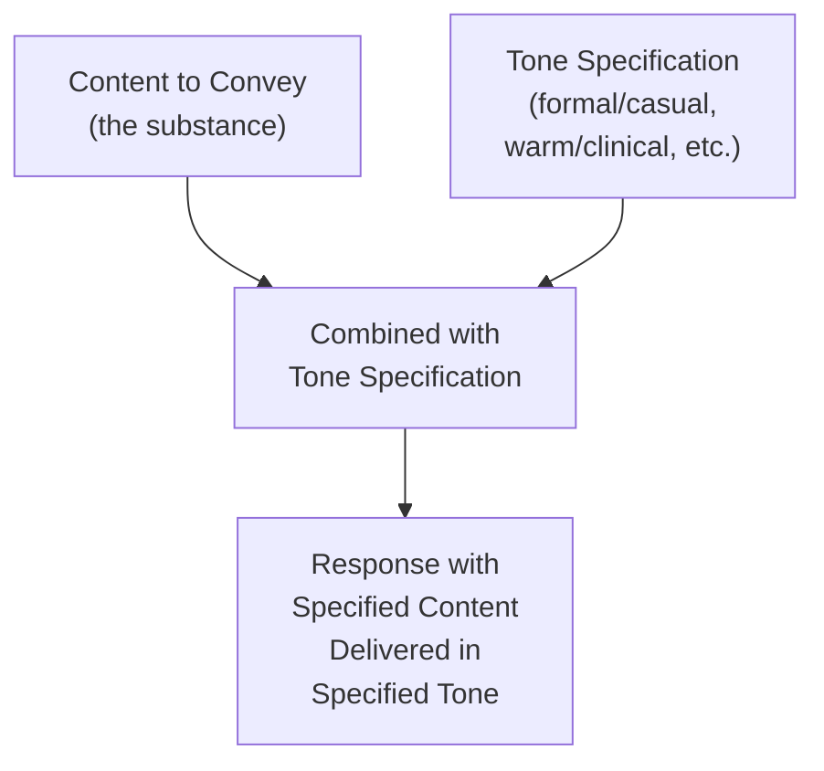
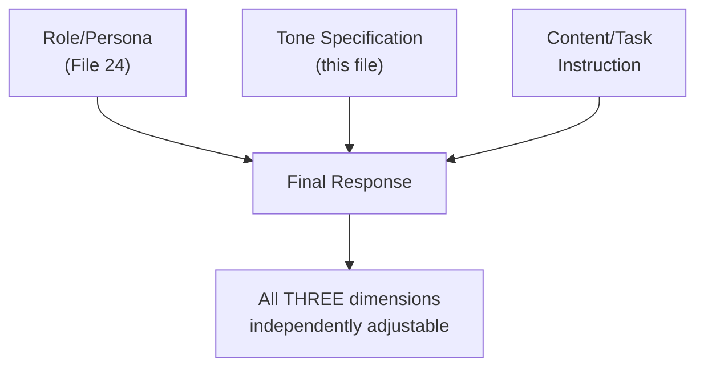

# 36 — Tone Control

> **Series:** Prompt Engineering Knowledge Library
> **File 36 of 60** | **Level:** Beginner → Intermediate
> **Prerequisites:** [`31_Constraints.md`](./31_Constraints.md), [`24_Role_Prompting.md`](./24_Role_Prompting.md)
> **Next:** [`37_Persona_Design.md`](./37_Persona_Design.md)

---

## Table of Contents

1. [Definition](#definition)
2. [Why It Matters](#why-it-matters)
3. [Core Concepts](#core-concepts)
4. [How It Works](#how-it-works)
5. [Internal Mechanism](#internal-mechanism)
6. [Types of Tone](#types-of-tone)
7. [Syntax / Structure](#syntax--structure)
8. [Examples (Simple → Advanced)](#examples-simple--advanced)
9. [Best Practices](#best-practices)
10. [Common Mistakes](#common-mistakes)
11. [Real-World Applications](#real-world-applications)
12. [Comparison with Related Concepts](#comparison-with-related-concepts)
13. [Advantages & Limitations](#advantages--limitations)
14. [FAQs](#faqs)
15. [Summary](#summary)
16. [Cheat Sheet](#cheat-sheet)
17. [Glossary](#glossary)
18. [References](#references)
19. [Visual Diagram Gallery](#visual-diagram-gallery)

---

## Definition

**Tone Control** is the technique of explicitly specifying a response's voice, register, and emotional coloring — formal versus casual, warm versus clinical, urgent versus relaxed — independent of *what* content the response contains. Where [File 24 — Role Prompting](./24_Role_Prompting.md) covers the broader technique of assigning a full persona or expertise ("You are a doctor"), tone control isolates and focuses specifically on the *voice dimension alone*, which can be specified with or without an accompanying role, and which frequently needs finer, more explicit control than role assignment alone reliably provides.

> A useful test: two responses can share an identical persona ("cooking assistant") while differing sharply in tone (one warm and encouraging, one brisk and efficient) — tone is a genuinely separable dimension from role/persona, which is exactly why it warrants its own dedicated technique and file.

---

## Why It Matters

- **Tone mismatches are a common, high-visibility failure mode** — content can be factually perfect while still failing its purpose if the tone is wrong for the context (e.g., a cheerfully upbeat tone delivering bad news).
- **Role assignment alone doesn't fully specify tone**, per [File 24](./24_Role_Prompting.md)'s Internal Mechanism discussion — a role activates a *cluster* of learned associations, of which tone is only one, often producing a broadly appropriate but not precisely calibrated register.
- **Tone directly shapes user trust and experience**, particularly in customer-facing and sensitive contexts, where an inappropriate register can undermine an otherwise excellent response.
- **It's a distinct, separately controllable dimension** — understanding this separation from role/persona and content lets prompt engineers fix a tone problem without needing to redesign the entire prompt's role or substance.

---

## Core Concepts

| Concept | Definition |
|---|---|
| **Register** | The overall formality level of language (formal, neutral, casual) |
| **Emotional Coloring** | The feeling a response's language conveys (warm, urgent, calm, empathetic) |
| **Voice** | The distinctive stylistic character of how something is said |
| **Tone Consistency** | Maintaining the same tone throughout a response or conversation |
| **Tone-Content Independence** | The principle that tone and substantive content are separately specifiable dimensions |
| **Context-Appropriate Tone** | Tone calibrated to the specific situation's emotional and social stakes |

---

## How It Works



Tone control works by adding an explicit, separately-specified constraint on register and emotional coloring, layered on top of whatever content or task instruction is already present — content and tone are treated as independently adjustable dials, not a single combined setting.

---

## Internal Mechanism

### Why tone requires more explicit specification than role alone typically provides

As established in [File 24 — Role Prompting](./24_Role_Prompting.md)'s Internal Mechanism section, assigning a role shifts a model's output toward learned patterns statistically associated with that role — but training text associated with any given role spans an enormous range of actual tones (a "doctor" in training data might be writing a warm patient letter or a clinical case report). Because a role's associated tone range is wide and variable, tone often requires its own explicit, separate specification to reliably land in the intended register, rather than being fully implied by role assignment alone. This is precisely why tone control is treated as its own dedicated technique in this library rather than folded entirely into role prompting — the two frequently need to be specified together but address genuinely different aspects of the learned pattern space.

### Why tone consistency degrades without explicit reinforcement in longer responses

Because a model generates output autoregressively, with each token conditioned on everything generated before it ([File 4](./04_How_LLMs_Interpret_Prompts.md)), tone specified only once at the very start of a long response can, in principle, drift over the course of generation, particularly as the model's own preceding tokens (which may have subtly varied) become an increasingly large share of its immediate context. This is why, for longer or higher-stakes responses, reinforcing tone guidance — not just stating it once at the outset — can measurably improve consistency, mirroring the primacy/recency reinforcement principle already established in [File 6 — Prompt Anatomy](./06_Prompt_Anatomy.md) for other critical constraints.

---

## Types of Tone

| Tone Dimension | Range | Example Specification |
|---|---|---|
| **Formality** | Formal ↔ Casual | "Use formal, professional language, no contractions" |
| **Warmth** | Warm ↔ Clinical/Neutral | "Warm and empathetic, not clinical" |
| **Energy** | Urgent/Energetic ↔ Calm/Measured | "Calm and reassuring, not alarmist" |
| **Confidence** | Assertive ↔ Tentative/Hedged | "Confident and direct, avoid excessive hedging" |
| **Playfulness** | Playful/Humorous ↔ Serious | "Light and playful, appropriate humor welcome" |
| **Directness** | Direct ↔ Diplomatic/Softened | "Direct and clear, don't over-soften difficult feedback" |

---

## Syntax / Structure

```text
[TONE SPECIFICATION]
Formality: Casual but professional (contractions OK, no slang)
Warmth: Genuinely empathetic — this customer is frustrated
Energy: Calm and measured — do not match their frustration 
        with urgency
Confidence: Assertive about what you CAN do; honest and 
            direct about what you cannot
```

```text
# Reinforced tone for longer responses (per Internal Mechanism)
[Tone: warm, patient, encouraging throughout]

[content instruction]

Reminder: maintain the warm, encouraging tone established 
above through the entire response, even when explaining a 
correction or limitation.
```

---

## Examples (Simple → Advanced)

**Level 1 — Basic tone specification:**
```text
Explain how to reset a password. Use a friendly, casual tone.
```

**Level 2 — Tone independent of role (same role, different tone):**
```text
[Version A] You are a technical support agent. Explain the 
password reset process in a warm, patient tone, as if to 
someone who's a bit frustrated.

[Version B] You are a technical support agent. Explain the 
password reset process in a brisk, efficient tone, as if to 
someone who just wants the fastest possible answer.

(Same role in both — the tone specification alone produces 
meaningfully different responses.)
```

**Level 3 — Multi-dimensional tone specification:**
```text
Explain why the customer's refund was denied.
Formality: Professional, not overly casual.
Warmth: Genuinely empathetic about their disappointment.
Directness: Clear and honest about the reason — don't be 
vague or evasive to soften the news.
```

**Level 4 — Tone shift within a single response, explicitly guided:**
```text
This response has two parts. For the first part (acknowledging 
the issue), use a warm, empathetic tone. For the second part 
(explaining the technical fix), shift to a clear, confident, 
instructional tone. Signal the transition naturally.
```

**Level 5 — Full tone specification with reinforcement for a long, sensitive response:**
```text
[TONE: Throughout this entire response — including the 
explanation of the delay, the apology, and the resolution 
steps — maintain: calm, genuinely apologetic, non-defensive, 
solution-focused. Avoid corporate-sounding stock phrases.]

Write a detailed explanation to the customer about the 
shipping delay, the reason for it, and the resolution steps 
being taken.

[REMINDER: as you reach the resolution steps section, keep 
the same calm, apologetic, solution-focused tone established 
above — don't shift into a purely clinical, checklist-style 
register just because the content becomes more procedural.]
```

---

## Best Practices

1. **Specify tone independently of role/persona**, even when both are used together — per the Internal Mechanism section, role alone often under-specifies the intended register.
2. **Use multiple tone dimensions when precision matters** (formality + warmth + directness together) rather than a single vague descriptor like "friendly," which still leaves room for variation.
3. **Reinforce tone guidance for longer responses**, not just stating it once at the start, to counteract potential drift over the course of generation.
4. **Match tone to the situation's actual emotional stakes** — a mismatched tone (upbeat for bad news, clinical for a distressed user) is a common, avoidable failure.
5. **Test tone specifications across varied content**, not just one example — a tone instruction that works well for straightforward content can behave differently when applied to more complex or sensitive content.

---

## Common Mistakes

| Mistake | Consequence | Fix |
|---|---|---|
| Relying on role assignment alone to convey tone | Tone lands in a broadly plausible but imprecisely calibrated register | Specify tone explicitly and separately from role |
| Using a single vague tone descriptor ("friendly") | Room for inconsistent interpretation | Use multiple concrete dimensions (formality, warmth, directness) |
| Specifying tone only once for a long response | Potential tone drift over the course of generation | Reinforce tone guidance, especially near sections likely to pull toward a different register |
| Mismatching tone to situational stakes | Upbeat tone for bad news, clinical tone for distress — undermines trust | Explicitly calibrate tone to the actual emotional context |
| Not testing tone across varied content | Tone instruction that works for simple content may not hold for complex/sensitive content | Test tone specifications against realistic, varied examples |

---

## Real-World Applications

- **Customer support and service messaging** — tone control is directly responsible for whether a response feels genuinely helpful and empathetic versus robotic or dismissive.
- **Brand voice consistency at scale** — organizations maintaining a distinctive brand voice across thousands of AI-generated interactions depend on precise, reinforced tone specification.
- **Sensitive or difficult communications** — bad news delivery, conflict resolution messaging, and health-adjacent communication all require careful, deliberate tone calibration beyond default behavior.
- **Educational and tutoring applications** — tone (patient, encouraging, non-judgmental) is often as important to a good learning experience as the accuracy of the content itself.

---

## Comparison with Related Concepts

| Concept | Difference from "Tone Control" |
|---|---|
| **Role Prompting (File 24)** | Role prompting assigns a full persona/expertise, which shifts a wide cluster of learned associations including but not limited to tone; tone control isolates and precisely specifies the voice/register dimension alone, often used alongside role prompting for finer control |
| **Persona Design (File 37)** | Persona design is the broader discipline of building a complete, consistent, reusable identity (including tone as one component among several); tone control is the specific, narrower technique for the voice dimension itself |
| **Output Control (File 28)** | Output control bounds what content appears and how much; tone control bounds how that content sounds — a genuinely different, complementary dimension |

---

## Advantages & Limitations

### ✅ Advantages of Explicit Tone Control

- **Provides finer-grained voice calibration** than role assignment alone reliably achieves.
- **Directly addresses a common, high-visibility failure mode** — tone mismatches that undermine otherwise-good content.
- **Separately adjustable from content**, allowing tone fixes without redesigning substance.

### ⚠️ Limitations

- **Like other prompt-level techniques, tone adherence is a strong but probabilistic tendency**, not an absolute guarantee, particularly across longer generations without reinforcement.
- **Overly detailed, multi-dimensional tone specifications add real prompt complexity** — proportional to how precisely calibrated the tone genuinely needs to be for the use case.
- **Tone perception itself has some genuine subjectivity** — what reads as "warm" to one person may read as merely "adequate" to another, making tone quality somewhat harder to validate objectively than factual correctness.

---

## FAQs

**Q: If I assign a role, do I still need to specify tone separately?**
A: Often yes, for anything beyond loose, low-stakes needs — per the Internal Mechanism section, a role's associated tone range in training data is typically wide, so explicit tone specification provides more reliable, precise calibration.

**Q: How many tone dimensions should I specify at once?**
A: As many as are genuinely relevant to getting the response right — a simple, low-stakes task might need only one ("casual"), while a sensitive, high-stakes communication might benefit from three or four dimensions specified together (Level 3's example).

**Q: Can tone shift within a single response?**
A: Yes, and this can be appropriate for structured, multi-part responses (Level 4) — but any intentional shift should be explicitly guided, since an unguided shift is more likely to read as inconsistent than deliberate.

**Q: How do I validate that a response actually achieved the intended tone?**
A: This is harder to validate purely programmatically than factual correctness, given tone's inherent subjectivity — human review or rubric-based evaluation ([File 15 — Prompt Evaluation](./15_Prompt_Evaluation.md)) is generally more appropriate than automated checking for tone quality specifically.

---

## Summary

Tone Control is the technique of explicitly and separately specifying a response's voice, register, and emotional coloring — formality, warmth, energy, directness — independent of both the substantive content and the broader role/persona assignment covered in [File 24](./24_Role_Prompting.md). Because a role's learned associations span a wide range of actual tones in training data, explicit tone specification provides meaningfully finer calibration than role assignment alone, and because tone can drift over longer autoregressive generations, reinforcing tone guidance (not just stating it once) measurably improves consistency for longer or higher-stakes responses. Having covered this focused voice-control technique, the library turns to the broader discipline it feeds into — building a complete, consistent, reusable identity: [File 37 — Persona Design](./37_Persona_Design.md).

---

## Cheat Sheet

```text
TONE CONTROL — QUICK REFERENCE

TONE DIMENSIONS (specify multiple for precision)
Formality   -> Formal <-> Casual
Warmth      -> Warm <-> Clinical
Energy      -> Urgent <-> Calm
Confidence  -> Assertive <-> Tentative
Directness  -> Direct <-> Diplomatic

KEY PRINCIPLE: Role assignment alone often under-specifies 
tone — its learned associations span a WIDE tonal range. 
Specify tone explicitly, separately, alongside role.

FOR LONG RESPONSES: Reinforce tone guidance, don't just state 
it once at the start — tone can drift over generation.
```

---

## Glossary

| Term | Definition |
|---|---|
| **Register** | The overall formality level of language |
| **Emotional Coloring** | The feeling a response's language conveys |
| **Voice** | The distinctive stylistic character of expression |
| **Tone Consistency** | Maintaining the same tone throughout a response |
| **Tone-Content Independence** | The principle that tone and content are separately specifiable |
| **Context-Appropriate Tone** | Tone calibrated to the situation's emotional stakes |

---

## References

- Anthropic — [Giving Claude a Role and Tone](https://docs.claude.com/en/docs/build-with-claude/prompt-engineering/system-prompts)
- Kong, A. et al. (2023) — *Better Zero-Shot Reasoning with Role-Play Prompting*, arXiv:2308.07702
- White, J. et al. (2023) — *A Prompt Pattern Catalog to Enhance Prompt Engineering with ChatGPT*, arXiv:2302.11382
- Reynolds, L. & McDonell, K. (2021) — *Prompt Programming for Large Language Models*, arXiv:2102.07350

---

## Visual Diagram Gallery

**Diagram 1 — Tone as Independent from Role and Content**


**Diagram 2 — Same Role, Different Tone (illustrating separability)**
```text
ROLE: "Technical support agent" (CONSTANT across both)

+ TONE: Warm, patient    -> "I totally understand how 
                              frustrating that must be..."

+ TONE: Brisk, efficient -> "Here's the fix: three steps..."
```

**Diagram 3 — Tone Drift Risk Over a Long Response**
```text
Start of response:     [Warm tone clearly established]
Middle of response:    [Tone holding steady... mostly]
End of response:        [Risk: drifting toward more clinical/
                          neutral without reinforcement]

FIX: Reinforce tone guidance near sections likely to pull 
toward a different register (e.g., technical/procedural content).
```

---

**⬅️ Previous:** [`35_Placeholders.md`](./35_Placeholders.md)
**➡️ Next:** [`37_Persona_Design.md`](./37_Persona_Design.md) — Building a complete, consistent, reusable identity.
