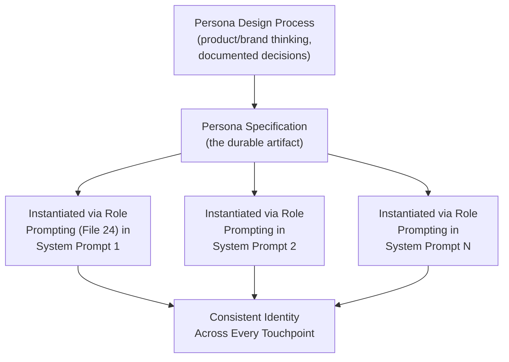
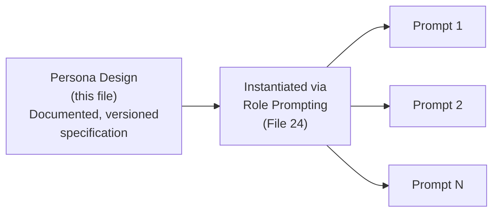
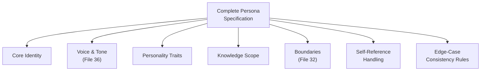

# 37 — Persona Design

> **Series:** Prompt Engineering Knowledge Library
> **File 37 of 60** | **Level:** Intermediate → Advanced
> **Prerequisites:** [`36_Tone_Control.md`](./36_Tone_Control.md), [`24_Role_Prompting.md`](./24_Role_Prompting.md), [`17_Prompt_Versioning.md`](./17_Prompt_Versioning.md)
> **Next:** [`38_Few_Shot_Prompting.md`](./38_Few_Shot_Prompting.md)

---

## Table of Contents

1. [Definition](#definition)
2. [Why It Matters](#why-it-matters)
3. [Core Concepts](#core-concepts)
4. [How It Works](#how-it-works)
5. [Internal Mechanism](#internal-mechanism)
6. [Types of Persona Elements](#types-of-persona-elements)
7. [Syntax / Structure](#syntax--structure)
8. [Examples (Simple → Advanced)](#examples-simple--advanced)
9. [Best Practices](#best-practices)
10. [Common Mistakes](#common-mistakes)
11. [Real-World Applications](#real-world-applications)
12. [Comparison with Related Concepts](#comparison-with-related-concepts)
13. [Advantages & Limitations](#advantages--limitations)
14. [FAQs](#faqs)
15. [Summary](#summary)
16. [Cheat Sheet](#cheat-sheet)
17. [Glossary](#glossary)
18. [References](#references)
19. [Visual Diagram Gallery](#visual-diagram-gallery)

---

## Definition

**Persona Design** is the broader discipline of building a complete, consistent, documented, and reusable identity for an AI system — a full specification of voice, boundaries, knowledge scope, personality traits, and behavioral consistency rules — as a durable product or brand asset, maintained and versioned like any other engineering artifact. This is distinct from [File 24 — Role Prompting](./24_Role_Prompting.md), which is the *in-the-moment technique* of assigning a role within a single prompt ("You are a doctor"); persona design is the *upstream design process* that produces a complete, well-considered identity specification, which role prompting (and tone control, [File 36](./36_Tone_Control.md)) then instantiate consistently across every individual prompt and interaction.

> The relationship: **role prompting** is a sentence you write inside a prompt. **Persona design** is the process — often involving genuine product, brand, and UX thinking — that determines *what that sentence should actually say*, and ensures it stays consistent across every prompt, every version, and every team member who touches the system.

---

## Why It Matters

- **A persona is a product asset, not a one-off prompt detail.** For any AI system with a sustained, recognizable identity (a brand's customer support assistant, a named product feature), that identity needs the same deliberate design and maintenance rigor as a visual brand guide.
- **Inconsistent persona implementation across a product's many prompts is a common, visible quality failure** — a customer noticing that "the assistant" sounds meaningfully different across different features or interactions undermines trust and polish.
- **Persona design surfaces genuine product decisions** beyond pure prompt engineering — how much personality is appropriate, what the persona should never do or say, how it should handle being asked about its own nature — decisions that benefit from deliberate, documented consideration rather than ad hoc, per-prompt improvisation.
- **It directly supports the versioning and lifecycle discipline** covered in [Files 7](./07_Prompt_Lifecycle.md) and [17](./17_Prompt_Versioning.md) — a well-designed persona specification is itself a versioned artifact that many individual prompts reference and inherit from.

---

## Core Concepts

| Concept | Definition |
|---|---|
| **Persona Specification** | The complete, documented definition of an AI system's identity |
| **Voice Guide** | The documented tone, vocabulary, and style rules a persona follows |
| **Boundary Definition** | What a persona will and will not do, discuss, or claim |
| **Personality Traits** | Consistent characteristics that shape how the persona communicates |
| **Self-Reference Handling** | How the persona should respond to questions about its own nature, capabilities, or identity |
| **Persona Drift** | Gradual, unintended inconsistency in how a persona is implemented across different prompts or over time |

---

## How It Works



The critical structural insight: a single, well-documented persona specification is designed once, then referenced and instantiated consistently across every individual prompt that needs it — rather than each prompt engineer independently improvising a "reasonable-sounding" persona description each time, which is precisely how persona drift (inconsistency across touchpoints) tends to emerge.

---

## Internal Mechanism

### Why persona drift emerges naturally without a documented specification

Without a single, shared, documented persona specification, different people writing different prompts for the same product — even with good intentions and a shared general sense of "friendly and helpful" — will naturally produce subtly different implementations, because each is independently translating a general, underspecified impression into specific prompt text. This connects directly to [File 9 — Prompt Design Principles](./09_Prompt_Design_Principles.md)'s specificity principle: an underspecified persona description ("be friendly") leaves meaningful room for varied interpretation, and when multiple people independently fill that gap differently, the aggregate result is exactly the kind of visible inconsistency that undermines a polished, trustworthy product identity. A genuinely specific, documented persona specification closes this gap by giving every prompt engineer the same precise reference to instantiate from, rather than each starting from a vague shared impression.

### Why self-reference handling requires deliberate, upfront design

A recurring, genuinely tricky design question for any persistent persona is how it should respond when directly asked about its own nature — "are you a real person," "what model are you," "do you have feelings." This connects to [File 21 — System Prompts](./21_System_Prompts.md)'s guardrail concept, but deserves dedicated attention within persona design specifically because it's a near-universal question any sustained persona will eventually face, and an inconsistent or evasive answer (sometimes claiming to be human, sometimes not) is both a trust problem and, in many contexts, a genuine ethical and disclosure concern. Deliberately designing and documenting this handling upfront — rather than leaving each prompt to improvise an answer if the question happens to come up — is precisely the kind of decision that distinguishes genuine persona design from ad hoc role prompting.

---

## Types of Persona Elements

| Element | Description | Example |
|---|---|---|
| **Core Identity** | The persona's name, role, and basic self-description | "Aria, a support assistant for Acme Corp" |
| **Voice & Tone Guide** | Documented style rules (connects to [File 36](./36_Tone_Control.md)) | "Warm, plain language, contractions OK, no corporate jargon" |
| **Personality Traits** | Consistent characteristics | "Patient, mildly encouraging, never condescending" |
| **Knowledge Scope** | What the persona knows and discusses | "Product features, orders, account help — not general knowledge" |
| **Boundaries** | What the persona will never do or claim (connects to [File 32](./32_Guardrails.md)) | "Never claims to be human; never makes legal/medical claims" |
| **Self-Reference Handling** | How the persona discusses its own nature | "Honestly acknowledges being an AI assistant if asked directly" |
| **Consistency Rules** | How the persona should behave across edge cases | "Maintains the same voice even when declining a request" |

---

## Syntax / Structure

A persona specification is typically maintained as a standalone, versioned document, separate from any individual prompt, which prompts then reference:

```yaml
# Example: a persona specification document
persona_name: Aria
version: 2.3  # per File 17 versioning practices
last_updated: 2026-06-01

core_identity: >
  A support assistant for Acme Corp, focused on order and 
  account help.

voice_and_tone:
  formality: "Casual-professional — contractions fine, no slang"
  warmth: "Genuinely warm, not performatively cheerful"
  directness: "Clear and honest, including about limitations"

personality_traits:
  - "Patient — never rushes or sounds impatient with confusion"
  - "Mildly encouraging, but not effusive or over-the-top"
  - "Never condescending, even to basic questions"

knowledge_scope:
  in_scope: ["orders", "account management", "product features"]
  out_of_scope: ["general knowledge", "competitor products", 
                  "legal/medical/financial advice"]

boundaries:
  - "Never claims to be human"
  - "Never makes promises beyond documented policy"

self_reference_handling: >
  If asked whether it's human/AI, or about its own nature, 
  Aria answers honestly and directly: "I'm Acme's AI support 
  assistant" — never evasive, never claims to be human, but 
  doesn't need to over-explain unless asked for more detail.

consistency_note: >
  This voice and these boundaries apply EVEN when declining a 
  request, expressing a limitation, or handling an edge case — 
  the persona doesn't "drop character" under pressure.
```

Individual system prompts then reference this specification directly:

```text
[System prompt for a specific feature]
Adopt the Aria persona as specified in persona-spec-v2.3. 
[Feature-specific task instructions follow...]
```

---

## Examples (Simple → Advanced)

**Level 1 — Minimal persona note (no formal spec, low stakes):**
```text
You are a friendly, casual assistant named Sam. Keep responses 
warm and approachable.
```

**Level 2 — Adding explicit boundaries:**
```text
You are Sam, a friendly assistant. Warm and casual tone. If 
asked whether you're a real person, be honest that you're an 
AI assistant.
```

**Level 3 — Adding knowledge scope and consistency guidance:**
```text
You are Sam. Warm, casual tone. Only discuss cooking and 
recipe topics — for anything else, politely redirect. 
Maintain this same warm tone even when declining an 
off-topic request; don't become curt or robotic.
```

**Level 4 — Full persona specification referenced across multiple prompts:**
```text
[Persona spec document exists separately, defining Sam fully 
— voice, boundaries, self-reference handling, consistency rules]

[Prompt A]: "Adopt the Sam persona [per spec]. Task: suggest 
a dinner recipe."

[Prompt B]: "Adopt the Sam persona [per spec]. Task: explain 
why a recipe failed based on the user's description."

(Both prompts reference the SAME underlying specification, 
ensuring Sam sounds consistently like Sam across genuinely 
different tasks.)
```

**Level 5 — Enterprise persona governance with versioning:**
```yaml
persona: Aria (Acme Corp support assistant)
spec_version: 2.3
spec_owner: brand-and-product-team
review_cadence: quarterly

implementing_prompts: 
  - order_status_prompt_v4.1 (references spec v2.3)
  - refund_handling_prompt_v2.0 (references spec v2.3)
  - general_faq_prompt_v6.2 (references spec v2.2 — 
    FLAGGED for update to v2.3)

drift_monitoring: >
  Quarterly review checks a sample of production responses 
  across all implementing prompts against the spec's voice 
  and boundary rules, flagging any prompt whose actual output 
  has drifted from the documented persona.

-> This is persona design treated with the same versioning, 
   ownership, and monitoring rigor as any other production 
   engineering asset (Files 7, 16, 17).
```

---

## Best Practices

1. **Document a persona specification as a standalone artifact**, separate from any individual prompt, once a persona will be used across more than one or two prompts — this is the direct countermeasure to the drift risk covered in the Internal Mechanism section.
2. **Deliberately design self-reference handling upfront**, not as an afterthought — this near-universal question deserves a considered, consistent, honest answer rather than ad hoc improvisation.
3. **Specify consistency rules for edge cases explicitly** — how the persona should behave when declining, correcting, or handling an unusual request, not just its default happy-path behavior.
4. **Version and own the persona specification** like any other production artifact ([File 17](./17_Prompt_Versioning.md)), with a designated owner and periodic review.
5. **Monitor for persona drift over time** across all prompts implementing a shared persona, particularly as new prompts are added by different team members.

---

## Common Mistakes

| Mistake | Consequence | Fix |
|---|---|---|
| No documented persona specification, only informal, shared impression | Persona drift as different prompt engineers independently interpret the persona differently | Document a specific, detailed persona specification as a standalone artifact |
| No deliberate self-reference handling design | Inconsistent, potentially evasive or misleading answers when directly asked about the persona's nature | Design and document honest, consistent self-reference handling upfront |
| Specifying only happy-path persona behavior | Persona "breaks character" under edge cases (declining, correcting, handling confusion) | Explicitly specify consistency rules for edge cases |
| Treating the persona spec as a one-time document, never revisited | Silent drift as the product evolves and new prompts are added without spec awareness | Assign ownership and periodic review, per [File 7](./07_Prompt_Lifecycle.md) |
| Conflating persona design with a single prompt's role assignment | Missing the broader, cross-prompt consistency discipline this file specifically addresses | Treat persona design as upstream of, and broader than, any single role-prompting instance |

---

## Real-World Applications

- **Branded AI assistants and customer-facing chatbots** — nearly universally require deliberate persona design to maintain a consistent, trustworthy identity across every customer touchpoint.
- **Multi-feature products with a shared AI identity** — any product where the "same" assistant appears across several distinct features depends on shared persona specification to avoid the assistant feeling like several different entities.
- **AI companion and character-based products** — persona design is foundational to products where a consistent, recognizable character identity is itself a core part of the product value.
- **Enterprise brand and product governance** — larger organizations increasingly treat AI persona design with the same formal rigor (ownership, versioning, review) as visual brand guidelines.

---

## Comparison with Related Concepts

| Concept | Difference from "Persona Design" |
|---|---|
| **Role Prompting (File 24)** | Role prompting is the in-the-moment technique of assigning a role within a single prompt; persona design is the upstream discipline of specifying a complete, consistent identity that role prompting then instantiates across many prompts |
| **Tone Control (File 36)** | Tone control is one specific, focused technique for the voice dimension alone; persona design is the broader discipline encompassing tone alongside boundaries, knowledge scope, personality, and self-reference handling as a complete package |
| **System Prompts (File 21)** | A system prompt is often where a persona gets instantiated for a given deployment; the persona specification (this file) is the durable, cross-prompt design artifact that many different system prompts may reference and share |

---

## Advantages & Limitations

### ✅ Advantages of Deliberate Persona Design

- **Prevents persona drift** across multiple prompts, team members, and product features through a shared, documented specification.
- **Surfaces genuine product and ethical decisions** (self-reference handling, boundaries) for deliberate, upfront consideration rather than ad hoc improvisation.
- **Enables consistent brand identity** at the same level of rigor as visual brand guidelines.

### ⚠️ Limitations

- **Requires genuine upfront investment** — documenting a full persona specification is more effort than writing an informal role description, justified once a persona spans multiple prompts or carries real brand stakes.
- **A documented specification doesn't automatically guarantee implementation** — individual prompts must actually reference and correctly instantiate it, and drift monitoring remains necessary even with good documentation.
- **Persona design decisions can involve genuine trade-offs and subjectivity** (how much personality is "too much," how to balance warmth with efficiency) that don't have a single objectively correct answer.

---

## FAQs

**Q: When does a project need formal persona design versus just informal role prompting?**
A: Once a persona will be used across more than a couple of prompts, or carries genuine brand/product stakes, formal documentation pays off — for a single, one-off prompt, informal role assignment ([File 24](./24_Role_Prompting.md)) alone is entirely sufficient.

**Q: How should self-reference questions ("are you human?") typically be handled?**
A: Honestly and directly, without evasion — this is both a trust matter and, in many contexts, a genuine disclosure and ethical consideration; the specific wording should be deliberately designed and documented, not improvised.

**Q: Who should own a persona specification within an organization?**
A: This varies, but often sits with a brand, product, or design team in collaboration with prompt engineering, since persona decisions genuinely span both domains — the important point is that ownership is explicit, not that it follows one universal structure.

**Q: How is persona drift actually detected in practice?**
A: Typically through periodic review (Level 5's quarterly cadence example) — sampling actual production responses across all prompts implementing a shared persona and checking them against the documented specification, similar in spirit to the evaluation practices in [File 15](./15_Prompt_Evaluation.md).

---

## Summary

Persona Design is the broader, upstream discipline of building a complete, documented, versioned identity — voice, boundaries, personality, knowledge scope, and deliberately designed self-reference handling — as a durable product asset that individual prompts then instantiate consistently through role prompting ([File 24](./24_Role_Prompting.md)) and tone control ([File 36](./36_Tone_Control.md)). Without a shared, specific, documented specification, different prompts and prompt engineers naturally produce subtly inconsistent implementations of an underspecified shared impression — precisely the persona drift this discipline exists to prevent — and self-reference handling in particular deserves deliberate, upfront design given its near-universal occurrence and genuine trust and disclosure implications. Having covered how to build and maintain a consistent identity, the library turns to a substantively different technique family: demonstrating desired patterns through examples, beginning with [File 38 — Few-Shot Prompting](./38_Few_Shot_Prompting.md).

---

## Cheat Sheet

```text
PERSONA DESIGN — QUICK REFERENCE

FULL SPECIFICATION SHOULD COVER
[ ] Core identity (name, role)
[ ] Voice & tone guide (File 36)
[ ] Personality traits
[ ] Knowledge scope (in/out of bounds)
[ ] Boundaries (what it never does — File 32)
[ ] Self-reference handling (designed upfront, not improvised)
[ ] Consistency rules for edge cases (declining, correcting)

KEY DISTINCTION
Role Prompting (File 24) = the in-the-moment TECHNIQUE
Persona Design (this file) = the upstream DESIGN PROCESS 
                              producing what that technique 
                              should consistently say

GOLDEN RULE: Document once, reference everywhere — this is 
what prevents drift across multiple prompts and team members.
```

---

## Glossary

| Term | Definition |
|---|---|
| **Persona Specification** | The complete, documented definition of an AI system's identity |
| **Voice Guide** | Documented tone, vocabulary, and style rules |
| **Boundary Definition** | What a persona will and will not do or claim |
| **Personality Traits** | Consistent characteristics shaping communication |
| **Self-Reference Handling** | How a persona responds to questions about its own nature |
| **Persona Drift** | Gradual, unintended inconsistency across implementations |

---

## References

- Anthropic — [Giving Claude a Role with a System Prompt](https://docs.claude.com/en/docs/build-with-claude/prompt-engineering/system-prompts)
- Shanahan, M. et al. (2023) — *Role-Play with Large Language Models*, arXiv:2305.16367
- Park, J. et al. (2023) — *Generative Agents: Interactive Simulacra of Human Behavior*, arXiv:2304.03442 (persistent persona/character consistency)
- Kong, A. et al. (2023) — *Better Zero-Shot Reasoning with Role-Play Prompting*, arXiv:2308.07702

---

## Visual Diagram Gallery

**Diagram 1 — Persona Design as Upstream of Role Prompting**


**Diagram 2 — Drift Without vs. With a Shared Specification**
```text
NO SHARED SPEC (drift risk):
Engineer A writes: "friendly, warm assistant"
Engineer B writes: "helpful, upbeat assistant"  
Engineer C writes: "supportive, casual assistant"
-> Three subtly DIFFERENT voices across the product

SHARED SPEC (consistent):
All three reference: persona-spec-v2.3
-> ONE consistent voice, regardless of who wrote the prompt
```

**Diagram 3 — Full Persona Element Coverage**


---

**⬅️ Previous:** [`36_Tone_Control.md`](./36_Tone_Control.md)
**➡️ Next:** [`38_Few_Shot_Prompting.md`](./38_Few_Shot_Prompting.md) — Demonstrating desired patterns through examples.
