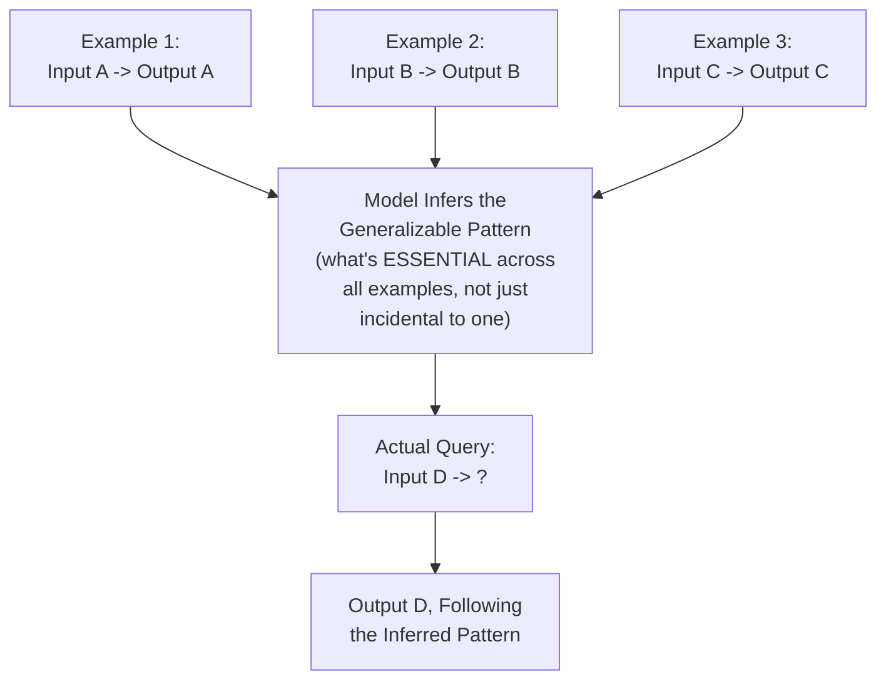
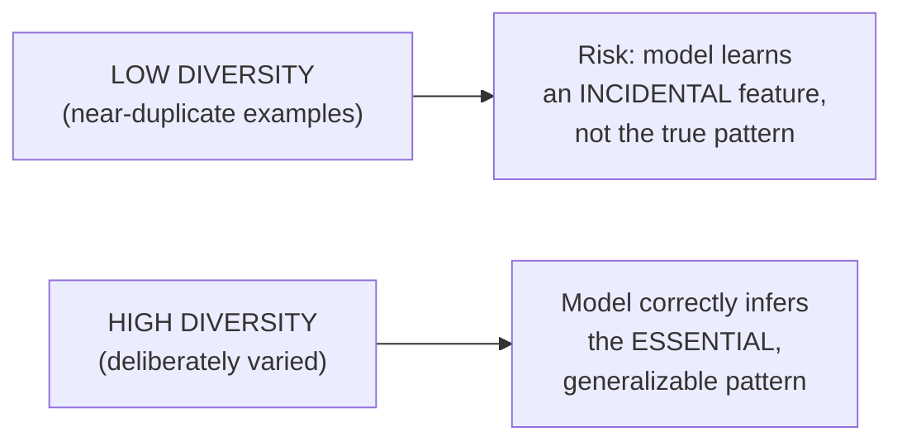

# 38 — Few-Shot Prompting

> **Series:** Prompt Engineering Knowledge Library
> **File 38 of 60** | **Level:** Intermediate
> **Prerequisites:** [`19_Prompt_Patterns.md`](./19_Prompt_Patterns.md), [`33_Delimiters.md`](./33_Delimiters.md)
> **Next:** [`39_One_Shot_Prompting.md`](./39_One_Shot_Prompting.md)

---

## Table of Contents

1. [Definition](#definition)
2. [Why It Matters](#why-it-matters)
3. [Core Concepts](#core-concepts)
4. [How It Works](#how-it-works)
5. [Internal Mechanism](#internal-mechanism)
6. [Types of Few-Shot Prompting](#types-of-few-shot-prompting)
7. [Syntax / Structure](#syntax--structure)
8. [Examples (Simple → Advanced)](#examples-simple--advanced)
9. [Best Practices](#best-practices)
10. [Common Mistakes](#common-mistakes)
11. [Real-World Applications](#real-world-applications)
12. [Comparison with Related Concepts](#comparison-with-related-concepts)
13. [Advantages & Limitations](#advantages--limitations)
14. [FAQs](#faqs)
15. [Summary](#summary)
16. [Cheat Sheet](#cheat-sheet)
17. [Glossary](#glossary)
18. [References](#references)
19. [Visual Diagram Gallery](#visual-diagram-gallery)

---

## Definition

**Few-Shot Prompting** is the technique of providing several (typically 2 or more) example input/output pairs within a prompt to demonstrate a desired pattern, before presenting the actual query the model should answer following that same pattern. [File 19 — Prompt Patterns](./19_Prompt_Patterns.md) introduced this as one entry in the general pattern catalog; this file provides its dedicated deep-dive — the specific mechanics of example selection, ordering, and count that determine whether few-shot prompting works well or poorly for a given task. [Files 39](./39_One_Shot_Prompting.md) and [40](./40_Zero_Shot_Prompting.md) that follow cover this same spectrum's other two points, each with genuinely distinct characteristics, not merely "the same technique with a different number."

> Few-shot prompting's core value: it demonstrates a pattern that might be *genuinely difficult to fully specify in words alone* — format, style, level of detail, or an implicit rule that's easier to show through several consistent examples than to describe explicitly.

---

## Why It Matters

- **It's one of the most reliably effective prompting techniques for pattern demonstration**, directly exploiting the in-context learning capability established in [File 2 — History of Prompts](./02_History_of_Prompts.md).
- **Multiple examples let the model infer the *generalizable* pattern**, distinguishing what's essential to the pattern from what's incidental to any single example — a capability [File 39](./39_One_Shot_Prompting.md) will show a single example genuinely cannot provide.
- **It's often the fastest fix for a format or style problem** that verbal instruction alone hasn't resolved — connecting directly to [File 29 — Output Formatting](./29_Output_Formatting.md)'s finding that schema-plus-example outperforms schema alone.
- **Example quality and selection directly determine outcome quality** — this file's focus on the specific mechanics of good example design is what separates effective few-shot prompting from merely "adding some examples."

---

## Core Concepts

| Concept | Definition |
|---|---|
| **Shot** | A single demonstrated input/output example pair |
| **Pattern Generalization** | The model's inference of the underlying, generalizable rule from multiple examples |
| **Example Diversity** | The degree to which provided examples cover different variations of the pattern |
| **Example Ordering** | The sequence in which examples are presented |
| **Label Distribution** | The balance of different output categories represented across examples (relevant for classification-style tasks) |
| **Incidental vs. Essential Pattern Features** | The distinction between what an example demonstrates by necessity versus by coincidence |

---

## How It Works



The critical mechanical step is pattern *generalization* across multiple examples — this is precisely what distinguishes few-shot from one-shot ([File 39](./39_One_Shot_Prompting.md)): with only one example, the model cannot distinguish which of that example's features are essential to the pattern versus merely incidental to that specific instance; with several, genuinely varied examples, the common thread across all of them becomes the inferable, generalizable pattern.

---

## Internal Mechanism

### Why multiple, varied examples let the model separate essential from incidental features

Consider a single example: "Input: 'The movie was great!' → Output: Positive." A model shown only this one example cannot know whether the pattern is "classify sentiment," "respond Positive to short inputs," "respond Positive to inputs containing an exclamation point," or several other coincidentally-consistent hypotheses — the example is compatible with many different underlying rules. A second, deliberately different example — "Input: 'Terrible service, would not recommend.' → Output: Negative" — immediately rules out several of those incidental hypotheses (it's not about length, not about exclamation points), narrowing the model's inferred pattern toward the genuinely intended one: sentiment classification. This is the precise mechanical reason few-shot prompting with multiple, *deliberately varied* examples produces more reliable pattern generalization than either verbal description alone or a single example — each additional, well-chosen example further constrains which underlying rule is consistent with all observed evidence.

### Why example count has diminishing returns and a genuine upper bound

Because each additional example consumes context window budget ([File 25 — Context Management](./25_Context_Management.md)) and, per [File 6 — Prompt Anatomy](./06_Prompt_Anatomy.md)'s primacy/recency discussion, can dilute attention on the most recent, most relevant content (the actual query), few-shot prompting exhibits genuine diminishing returns — the jump from zero to a few examples typically produces the largest capability gain, while continuing to add examples well beyond the point where the pattern is already clearly demonstrated yields progressively smaller benefit, and eventually can even hurt performance through context dilution. This is why "more examples is always better" is not a sound default; effective few-shot design finds the point where the pattern is clearly, unambiguously demonstrated without unnecessary padding.

---

## Types of Few-Shot Prompting

| Type | Description | Best Suited For |
|---|---|---|
| **Format Demonstration** | Examples showing a specific desired output structure | Structured extraction, consistent formatting needs |
| **Classification Few-Shot** | Examples spanning each category a classification task might produce | Sentiment analysis, categorization tasks |
| **Style/Voice Few-Shot** | Examples demonstrating a specific writing style or voice | Content generation matching a particular register |
| **Edge-Case Few-Shot** | Examples specifically demonstrating how to handle unusual or boundary inputs | Tasks where default handling of edge cases tends to be inconsistent |
| **Reasoning-Pattern Few-Shot** | Examples demonstrating a reasoning approach (often combined with chain-of-thought, [File 41](./41_Chain_of_Thought.md)) | Multi-step problems where the reasoning approach itself needs demonstration |

---

## Syntax / Structure

```text
[Consistent format across all examples, clearly delimited]

Input: "I loved this restaurant, the food was amazing."
Output: Positive

Input: "The wait was way too long and the food was cold."
Output: Negative

Input: "It was fine, nothing special."
Output: Neutral

Input: "{{actual_query}}"
Output:
```

```xml
<!-- Structured few-shot with explicit example delimiting -->
<examples>
<example>
<input>Customer: "My package never arrived."</input>
<output>{"category": "shipping", "urgency": "high"}</output>
</example>
<example>
<input>Customer: "Just wanted to say thanks for the great service!"</input>
<output>{"category": "feedback", "urgency": "low"}</output>
</example>
</examples>

<query>
<input>{{actual_customer_message}}</input>
</query>
```

---

## Examples (Simple → Advanced)

**Level 1 — Basic few-shot (2 examples), format demonstration:**
```text
Word: happy -> Antonym: sad
Word: fast -> Antonym: slow
Word: bright -> Antonym:
```

**Level 2 — Few-shot for classification with varied label distribution:**
```text
Review: "Best purchase I've made all year!" -> Sentiment: Positive
Review: "Broke within a week, total waste of money." -> Sentiment: Negative
Review: "Does what it says, nothing more." -> Sentiment: Neutral
Review: "Absolutely incredible, exceeded expectations!" -> Sentiment:
```

**Level 3 — Few-shot specifically demonstrating edge-case handling:**
```text
Text: "Contact John at john@example.com" -> Email found: john@example.com
Text: "No contact information provided here." -> Email found: None
Text: "Reach us at support@company.com or sales@company.com" -> Email found: support@company.com (first mentioned)
Text: "{{actual_text}}" -> Email found:
```

**Level 4 — Few-shot demonstrating a consistent, non-obvious style:**
```text
Question: What is 15% of 80?
Answer: To find 15% of 80: 0.15 × 80 = 12. So 15% of 80 is 12.

Question: What is 25% of 200?
Answer: To find 25% of 200: 0.25 × 200 = 50. So 25% of 200 is 50.

Question: What is 40% of 150?
Answer:
```
*(These examples demonstrate not just the correct answer, but a consistent explanatory style — the model infers to follow the same "show the calculation, then state the result" pattern.)*

**Level 5 — Full few-shot with deliberate diversity avoiding incidental-feature learning:**
```text
[Task: classify customer messages by category. Examples 
deliberately vary length, tone, and phrasing style to prevent 
the model from learning an incidental pattern like "short 
messages are billing" rather than the genuine category signal.]

Input: "I was charged twice for my subscription this month, 
can someone look into this?" -> Category: billing

Input: "love it!!" -> Category: feedback

Input: "The app crashes every single time I try to upload a 
photo, and I've tried reinstalling twice already with no luck." 
-> Category: technical

Input: "when's my order coming" -> Category: shipping

Input: "{{actual_message}}" -> Category:
```

---

## Best Practices

1. **Use deliberately varied examples, not near-duplicates** — per the Internal Mechanism section, variation is precisely what lets the model separate essential pattern features from incidental ones.
2. **Cover the range of expected categories or variations**, especially for classification tasks — an imbalanced example set risks the model learning a skewed, unintended pattern.
3. **Keep example format perfectly consistent** — inconsistency in how examples themselves are formatted undermines the very pattern-demonstration purpose of the technique.
4. **Stop adding examples once the pattern is clearly, unambiguously demonstrated** — per the diminishing-returns discussion, more isn't automatically better.
5. **Delimit examples clearly from each other and from the actual query** ([File 33 — Delimiters](./33_Delimiters.md)) — ambiguous boundaries between examples and the real query undermine reliability.

---

## Common Mistakes

| Mistake | Consequence | Fix |
|---|---|---|
| Using near-identical, low-diversity examples | Model may learn an incidental feature rather than the genuine, generalizable pattern | Deliberately vary examples along dimensions unrelated to the actual pattern |
| Imbalanced label/category distribution across examples | Skewed inference toward over-represented categories | Cover the expected range of categories roughly evenly |
| Inconsistent example formatting | Undermines the pattern-demonstration purpose itself | Keep format perfectly consistent across every example |
| Adding examples well past the point of clear demonstration | Context dilution, diminishing or even negative returns | Stop once the pattern is unambiguously shown |
| Unclear boundary between examples and the actual query | Model may confuse the query for another example, or vice versa | Use clear, consistent delimiting (File 33) |

---

## Real-World Applications

- **Structured data extraction** — few-shot examples are a near-standard technique for reliably demonstrating an extraction schema beyond what a verbal description alone achieves ([File 29](./29_Output_Formatting.md)).
- **Content style matching** — demonstrating a specific brand voice or writing style through examples, often more reliable than describing the style in the abstract.
- **Classification and categorization pipelines** — few-shot with balanced category coverage is a common, effective technique for consistent classification behavior.
- **Edge-case behavior standardization** — explicitly demonstrating how unusual inputs should be handled, directly addressing the boundary-ambiguity concerns raised in [File 28 — Output Control](./28_Output_Control.md).

---

## Comparison with Related Concepts

| Concept | Difference from "Few-Shot Prompting" |
|---|---|
| **One-Shot Prompting (File 39)** | One-shot uses exactly one example, which — per this file's Internal Mechanism section — cannot support genuine pattern *generalization* the way multiple, varied examples can; one-shot's actual value lies elsewhere, as File 39 explores |
| **Zero-Shot Prompting (File 40)** | Zero-shot relies entirely on instruction and the model's pretrained/instruction-tuned capability, with no demonstrated examples at all |
| **Prompt Patterns (File 19)** | File 19 provides the general catalog entry and selection guidance across many patterns; this file provides the dedicated, deep mechanical treatment specifically for few-shot |

---

## Advantages & Limitations

### ✅ Advantages of Few-Shot Prompting

- **Reliably demonstrates patterns genuinely difficult to fully specify verbally** — format, style, implicit rules.
- **Multiple examples enable genuine pattern generalization**, distinguishing essential from incidental features.
- **Directly improves structured output reliability** when combined with schema specification ([File 29](./29_Output_Formatting.md)).

### ⚠️ Limitations

- **Diminishing and eventually negative returns with excessive example count**, due to context dilution.
- **Consumes meaningful context window budget** compared to zero-shot, a genuine cost at scale ([File 25](./25_Context_Management.md)).
- **Poor example selection (low diversity, imbalanced categories) can actively teach the wrong pattern**, not merely fail to help.

---

## FAQs

**Q: How many examples should a few-shot prompt include?**
A: There's no fixed universal number — the practical signal is whether the pattern is clearly, unambiguously demonstrated; this often lands around 2-5 well-chosen examples for many tasks, but genuinely complex patterns may need more, and simple ones may need fewer.

**Q: Does example order matter?**
A: It can, per [File 6 — Prompt Anatomy](./06_Prompt_Anatomy.md)'s primacy/recency discussion — some practitioners find placing a particularly clear or representative example last (closest to the actual query) can help, though this should be empirically tested for a specific task rather than assumed.

**Q: Should examples always be real, or can they be synthetic/constructed?**
A: Synthetic, deliberately constructed examples are entirely valid and often preferable, since they allow precise control over diversity and category coverage — the key requirement is that they accurately demonstrate the genuine intended pattern, not that they be drawn from real historical data.

**Q: What's the difference between few-shot and providing a detailed verbal description of the task?**
A: They're complementary, not mutually exclusive — a verbal description states the rule explicitly; few-shot examples demonstrate it concretely, and per [File 29](./29_Output_Formatting.md)'s findings, combining both typically outperforms either alone.

---

## Summary

Few-Shot Prompting demonstrates a desired pattern through several deliberately varied example input/output pairs, exploiting the model's in-context learning capability to infer a generalizable rule — a capability specifically enabled by *multiple, varied* examples letting the model distinguish essential pattern features from incidental ones, which a single example alone cannot support. Effective few-shot design requires deliberate example diversity, balanced category coverage, perfectly consistent formatting, and clear delimiting from the actual query, while recognizing genuine diminishing returns beyond the point where the pattern is unambiguously demonstrated. Having covered the multi-example case in depth, the library turns to the single-example case next — genuinely distinct in mechanism and purpose, not merely "few-shot with fewer examples": [File 39 — One-Shot Prompting](./39_One_Shot_Prompting.md).

---

## Cheat Sheet

```text
FEW-SHOT PROMPTING — QUICK REFERENCE

WHY IT WORKS: Multiple, VARIED examples let the model separate 
ESSENTIAL pattern features from INCIDENTAL ones that a single 
example can't distinguish.

DESIGN CHECKLIST
[ ] Examples are deliberately varied (not near-duplicates)
[ ] Category/label distribution is balanced (for classification)
[ ] Formatting is perfectly consistent across all examples
[ ] Clear delimiting between examples and the actual query
[ ] Stopped adding examples once the pattern is unambiguous 
    (diminishing returns beyond that point)
```

---

## Glossary

| Term | Definition |
|---|---|
| **Shot** | A single demonstrated input/output example pair |
| **Pattern Generalization** | Inferring the underlying rule from multiple examples |
| **Example Diversity** | The degree to which examples cover different variations |
| **Example Ordering** | The sequence in which examples are presented |
| **Label Distribution** | The balance of output categories represented across examples |
| **Incidental vs. Essential Features** | Coincidental versus necessary pattern characteristics |

---

## References

- Brown, T. et al. (2020) — *Language Models are Few-Shot Learners*, arXiv:2005.14165
- Min, S. et al. (2022) — *Rethinking the Role of Demonstrations: What Makes In-Context Learning Work?*, arXiv:2202.12837
- Liu, J. et al. (2021) — *What Makes Good In-Context Examples for GPT-3?*, arXiv:2101.06804
- Zhao, Z. et al. (2021) — *Calibrate Before Use: Improving Few-Shot Performance of Language Models*, arXiv:2102.09690

---

## Visual Diagram Gallery

**Diagram 1 — Pattern Narrowing Through Multiple Examples**
```text
1 example:  Consistent with MANY possible rules (ambiguous)
            ["classify sentiment"? "respond to short text"? 
             "respond to exclamation points"? ...]

2 examples: Rules out several incidental hypotheses
3+ examples: Genuine pattern becomes clearly, unambiguously
             inferable
```

**Diagram 2 — Diminishing Returns Curve for Example Count**
```text
Performance Gain
      ^
      |      *
      |    *   *
      |  *        *   *   *   *  (flattens — diminishing,
      | *                         eventually negative from
      |*                          context dilution)
      +------------------------------> Number of Examples
      0    2    4    6    8    10
```

**Diagram 3 — Good vs. Poor Example Diversity**


---

**⬅️ Previous:** [`37_Persona_Design.md`](./37_Persona_Design.md)
**➡️ Next:** [`39_One_Shot_Prompting.md`](./39_One_Shot_Prompting.md) — The single-example case, genuinely distinct in mechanism and purpose.
