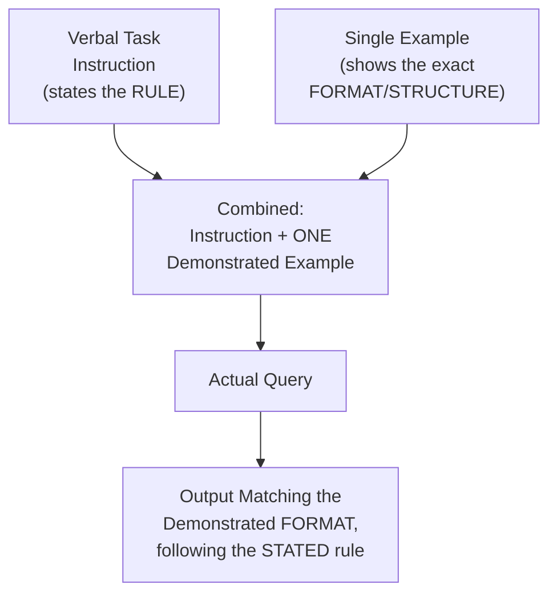
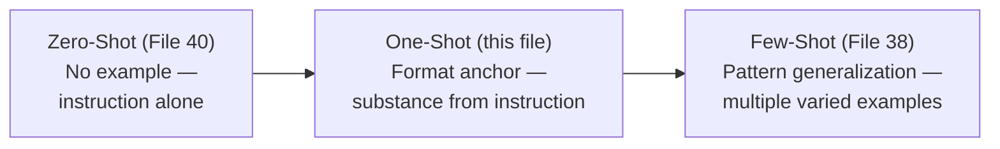

# 39 — One-Shot Prompting

> **Series:** Prompt Engineering Knowledge Library
> **File 39 of 60** | **Level:** Intermediate
> **Prerequisites:** [`38_Few_Shot_Prompting.md`](./38_Few_Shot_Prompting.md)
> **Next:** [`40_Zero_Shot_Prompting.md`](./40_Zero_Shot_Prompting.md)

---

## Table of Contents

1. [Definition](#definition)
2. [Why It Matters](#why-it-matters)
3. [Core Concepts](#core-concepts)
4. [How It Works](#how-it-works)
5. [Internal Mechanism](#internal-mechanism)
6. [Types of One-Shot Prompting](#types-of-one-shot-prompting)
7. [Syntax / Structure](#syntax--structure)
8. [Examples (Simple → Advanced)](#examples-simple--advanced)
9. [Best Practices](#best-practices)
10. [Common Mistakes](#common-mistakes)
11. [Real-World Applications](#real-world-applications)
12. [Comparison with Related Concepts](#comparison-with-related-concepts)
13. [Advantages & Limitations](#advantages--limitations)
14. [FAQs](#faqs)
15. [Summary](#summary)
16. [Cheat Sheet](#cheat-sheet)
17. [Glossary](#glossary)
18. [References](#references)
19. [Visual Diagram Gallery](#visual-diagram-gallery)

---

## Definition

**One-Shot Prompting** is the technique of providing exactly one example input/output pair before presenting the actual query. It is deliberately *not* merely "few-shot with a smaller number" — as established in [File 38](./38_Few_Shot_Prompting.md)'s Internal Mechanism section, a single example cannot support genuine pattern *generalization*, since the model has no second data point to distinguish essential features from incidental ones. One-shot prompting instead serves a distinct, narrower purpose: demonstrating a *specific output format or structure* with minimal risk of the model over-generalizing an unintended pattern from example diversity it was never given.

> The key reframe: one-shot isn't a weaker version of few-shot — it's a technique for a genuinely different job. Where few-shot answers "what is the underlying, generalizable *rule*?", one-shot answers a narrower question: "*exactly what does correct output structure look like*, one time, unambiguously?"

---

## Why It Matters

- **It's often sufficient, and preferable, for pure format demonstration** — when the task's substantive logic is already clear from instruction alone, and only the precise output shape needs clarifying, a single clean example does this efficiently without the context cost of several.
- **It avoids a specific risk that few-shot can introduce**: with multiple examples, subtle unintended commonalities between them (that aren't actually part of the intended pattern) can mislead the model; a single, carefully chosen example has no "other examples" to be accidentally consistent with in an unintended way.
- **It's the natural middle point on the shot spectrum**, and understanding precisely why it differs from both zero-shot ([File 40](./40_Zero_Shot_Prompting.md)) and few-shot ([File 38](./38_Few_Shot_Prompting.md)) sharpens the judgment needed to select correctly among all three.
- **It's more context-efficient than few-shot** while still providing meaningfully more format precision than zero-shot alone — a genuine, distinct point on the efficiency/precision trade-off curve.

---

## Core Concepts

| Concept | Definition |
|---|---|
| **Single Demonstration** | The one example provided, serving as the sole concrete reference |
| **Format Anchoring** | Using one example specifically to fix an exact output structure |
| **Generalization Ceiling** | The inherent limit on pattern inference achievable from a single example |
| **Over-Fitting Risk** | The risk that the model mimics an incidental feature of the one example too literally |
| **Task Clarity Sufficiency** | Whether the task's substantive logic is already clear enough from instruction alone that only format needs demonstrating |

---

## How It Works



The structural division of labor is the key insight: in one-shot prompting, the verbal instruction typically carries the substantive logic/rule, while the single example carries the precise structural/format demonstration — this is different from few-shot, where the examples themselves often carry a meaningful share of the substantive pattern-inference burden, given verbal description alone was judged insufficient.

---

## Internal Mechanism

### Why one-shot is best suited to format anchoring, not rule inference

As established in [File 38](./38_Few_Shot_Prompting.md), a single example is compatible with many different underlying rules — the model cannot use one data point alone to distinguish which of an example's features are essential versus incidental. This means one-shot prompting is mechanistically poorly suited to tasks where the *rule itself* is ambiguous or hard to state verbally — that job requires few-shot's multiple, contrasting examples. But one-shot is well suited to a different, narrower job: when the rule is already clearly and unambiguously stated in the surrounding instruction, a single example serves purely as a concrete structural anchor — "here is exactly what the output should look like" — without needing to also carry the burden of demonstrating which features of that example are essential to a broader pattern, because there is no broader pattern being inferred from the example itself; the pattern comes from the stated instruction.

### Why over-fitting risk is genuinely higher with one-shot than few-shot, and how to mitigate it

Because there is only one reference point, any *incidental* feature of that single example (a particular topic, a particular length, a particular word choice unrelated to the actual required format) has no counter-examples to rule it out as potentially significant — the model may, in some cases, mimic this incidental feature more literally than intended, precisely because it has no second example to reveal that the feature was coincidental rather than essential. This is a genuine, mechanistically-grounded risk unique to (or at least significantly more pronounced in) one-shot compared to few-shot, and the practical mitigation is directly implied by the mechanism: pair the single example with an especially clear, explicit verbal instruction about *which* aspects of the example are the actual requirement (the format) and which are incidental (the specific content used to illustrate it) — reducing reliance on the model correctly inferring this distinction from the example alone.

---

## Types of One-Shot Prompting

| Type | Description | Best Suited For |
|---|---|---|
| **Format Anchor** | One example fixing an exact output structure | Tasks where substance is clear, only format needs demonstrating |
| **Style Anchor** | One example showing a specific tone/voice, with substance stated separately | Content generation where style is hard to describe but easy to show once |
| **Length/Scope Anchor** | One example demonstrating the expected level of detail or brevity | Calibrating response depth beyond what a verbal length constraint alone conveys |
| **Edge-Case Clarifier** | One example specifically resolving a likely ambiguity in an otherwise-clear instruction | Preempting a single, specific, foreseeable misinterpretation |

---

## Syntax / Structure

```text
[Clear verbal instruction carrying the substantive rule]
Extract the key entities from the text below and return them 
as JSON with "people", "organizations", and "locations" arrays.

[ONE example anchoring the exact format]
Example:
Text: "Maria Garcia met with representatives from Acme Corp 
in Chicago."
Output: {"people": ["Maria Garcia"], "organizations": 
["Acme Corp"], "locations": ["Chicago"]}

[Actual query]
Text: "{{actual_text}}"
Output:
```

```text
# Explicit incidental-vs-essential framing (per Internal Mechanism)
The example below demonstrates the exact JSON structure 
required. The specific entities and topic in the example are 
just illustrative — apply the SAME STRUCTURE to whatever 
entities appear in the actual text, not these specific ones.

[example follows]
```

---

## Examples (Simple → Advanced)

**Level 1 — Basic one-shot format anchor:**
```text
Rewrite the sentence to be more concise.
Example: "Due to the fact that it was raining, we decided to 
stay inside." -> "Since it was raining, we stayed inside."

Now rewrite: "In spite of the fact that he was tired, he 
finished the marathon."
```

**Level 2 — One-shot for structured extraction:**
```text
Extract the date and amount from this invoice line.
Example: "Payment received 2026-03-15 for $450.00" -> 
{"date": "2026-03-15", "amount": 450.00}

Extract from: "{{actual_invoice_line}}"
```

**Level 3 — One-shot with explicit incidental-feature clarification:**
```text
Summarize the article in exactly this format (the TOPIC in 
this example is unrelated to your actual task — only match 
the STRUCTURE):

Example format:
"TL;DR: [one sentence]. Key detail: [one specific fact]. 
Why it matters: [one sentence]."

Now summarize the following article in that same structure: 
{{actual_article}}
```

**Level 4 — One-shot style anchor with substance stated separately:**
```text
[Substance, stated clearly in instruction:]
Write a product description covering: material, dimensions, 
and care instructions.

[ONE example anchoring STYLE only, explicitly flagged as such:]
Style reference (match this VOICE, not this specific product):
"Crafted from solid oak, this side table brings warmth to any 
room — compact enough for a cozy apartment, sturdy enough to 
last a lifetime. Wipe clean with a soft, dry cloth."

Now write a description in this SAME voice for: {{actual_product}}
```

**Level 5 — One-shot resolving a specific, foreseeable ambiguity:**
```text
Classify each item in this list as "in stock" or "out of stock" 
based on the quantity field. 

[Instruction alone leaves one genuine ambiguity: what about 
quantity = 0 exactly? One-shot resolves it directly:]

Example clarifying the boundary case:
Item: {"name": "Widget", "quantity": 0} -> "out of stock"
(Quantity of exactly 0 is out of stock, not a special case.)

Now classify: {{actual_item_list}}
```

---

## Best Practices

1. **Reserve one-shot for tasks where the substantive rule is already clear**, using the example purely as a structural or format anchor — per the Internal Mechanism section, this is where one-shot is mechanistically well-suited.
2. **Explicitly flag which parts of the example are incidental versus essential** when there's meaningful risk of over-fitting (Level 3, Level 4) — this directly mitigates the over-fitting risk unique to having only one reference point.
3. **Choose the single example carefully** — since there's no second example to dilute an unfortunate incidental feature, the one example chosen carries outsized influence and deserves deliberate selection.
4. **Escalate to few-shot ([File 38](./38_Few_Shot_Prompting.md)) if one-shot proves insufficient** — if the task genuinely requires demonstrating a *rule*, not just a *format*, one-shot's single data point is mechanistically the wrong tool.
5. **Consider one-shot specifically when context budget is a genuine constraint** ([File 25](./25_Context_Management.md)) and a lighter-weight demonstration will suffice — it's the more efficient middle ground between zero-shot and full few-shot.

---

## Common Mistakes

| Mistake | Consequence | Fix |
|---|---|---|
| Using one-shot when the task genuinely needs rule inference, not just format demonstration | Insufficient pattern information; consider escalating to few-shot | Recognize whether the real need is format-anchoring (one-shot) or rule-inference (few-shot) |
| Choosing a single example with an unfortunate incidental feature | Model over-fits to that incidental detail | Choose the single example carefully; explicitly flag incidental vs. essential aspects |
| No clarification of what's incidental vs. essential in the example | Over-fitting risk goes unmitigated | Explicitly state which parts of the example are illustrative only |
| Treating one-shot as simply "a smaller, weaker few-shot" | Missing its genuinely distinct, appropriate use case | Understand one-shot as format-anchoring, a different job than rule-demonstration |
| Using one-shot for classification/categorization tasks needing balanced category coverage | Single example can't represent multiple categories at once | Use few-shot ([File 38](./38_Few_Shot_Prompting.md)) for classification needing category coverage |

---

## Real-World Applications

- **Structured extraction with a clearly stated schema** — one clean example anchoring the exact JSON structure, when the extraction logic itself is already unambiguous from instruction.
- **Style-matching content generation** — a single reference example demonstrating voice, paired with clearly stated substantive requirements, common in content generation tools.
- **Format clarification in otherwise well-specified prompts** — resolving one specific, foreseeable structural ambiguity without the overhead of a full few-shot example set.
- **Context-budget-constrained applications** — where the efficiency gain over few-shot genuinely matters and the task's format-anchoring need doesn't require multiple examples.

---

## Comparison with Related Concepts

| Concept | Difference from "One-Shot Prompting" |
|---|---|
| **Few-Shot Prompting (File 38)** | Few-shot uses multiple, varied examples specifically to support genuine pattern generalization; one-shot uses exactly one example specifically for format-anchoring where the rule is already clear from instruction — genuinely different jobs, not a matter of degree |
| **Zero-Shot Prompting (File 40)** | Zero-shot relies entirely on instruction with no demonstrated example at all; one-shot adds exactly one concrete structural anchor beyond that |
| **Prompt Templates (File 18)** | A one-shot example within a prompt and a template's fixed example content can look similar, but a template's reusable structure is a broader concept than any single technique's example count |

---

## Advantages & Limitations

### ✅ Advantages of One-Shot Prompting

- **More context-efficient than few-shot** while still providing meaningfully more format precision than zero-shot alone.
- **Well-suited to a genuine, common task type**: format-anchoring when substance is already clear.
- **Avoids few-shot's category-imbalance risk entirely**, since there's no attempt at demonstrating category coverage in the first place.

### ⚠️ Limitations

- **Cannot support genuine pattern generalization** — a single example has no second data point to distinguish essential from incidental features, a hard mechanistic ceiling, not a matter of degree.
- **Higher over-fitting risk to incidental example features** than few-shot, requiring careful example selection and explicit incidental/essential framing to mitigate.
- **Poorly suited to classification tasks needing category coverage** — a structural mismatch, not merely a weaker version of few-shot for that use case.

---

## FAQs

**Q: If one example helps, wouldn't two help even more?**
A: Often yes, if the task genuinely benefits from pattern generalization — at that point, you've moved into few-shot territory ([File 38](./38_Few_Shot_Prompting.md)), which is exactly the right escalation when one-shot's single data point proves insufficient for the actual need.

**Q: How do I know if my task needs one-shot versus few-shot?**
A: Ask whether the substantive rule is already clear and only the format/structure needs anchoring (one-shot) versus whether the rule itself is ambiguous or hard to state verbally and needs demonstrating through multiple, varied examples (few-shot).

**Q: Is one-shot ever the wrong choice even when it "seems to work"?**
A: Yes — if the single chosen example happens to have an unfortunate incidental feature the model over-fits to, a one-shot prompt can appear to work in testing while failing on inputs that differ from that incidental feature; this is why careful example selection and explicit incidental/essential framing matter even when initial results look fine.

**Q: Does one-shot work as well for reasoning tasks as it does for format anchoring?**
A: Generally less reliably — reasoning-pattern demonstration typically benefits more from multiple examples or chain-of-thought techniques ([File 41](./41_Chain_of_Thought.md)) than from a single demonstrated reasoning instance, since reasoning patterns often have more essential structure to correctly generalize than a pure output format does.

---

## Summary

One-Shot Prompting provides exactly one demonstrated example, serving a genuinely distinct purpose from few-shot: format-anchoring — showing precisely what correct output structure looks like — rather than rule-inference, since a single data point mechanistically cannot distinguish essential pattern features from incidental ones the way multiple, varied examples can. It's best suited to tasks where the substantive logic is already clear from verbal instruction and only the structural shape needs concrete demonstration, is more context-efficient than few-shot, but carries a genuinely higher over-fitting risk to the single example's incidental features — mitigated by careful example selection and explicit framing of what's illustrative versus required. Having covered the single-example case, the library completes this spectrum with the no-example case: [File 40 — Zero-Shot Prompting](./40_Zero_Shot_Prompting.md).

---

## Cheat Sheet

```text
ONE-SHOT PROMPTING — QUICK REFERENCE

USE ONE-SHOT WHEN: The rule/substance is already clear from 
instruction — you just need to anchor the exact FORMAT/STRUCTURE.

DON'T USE ONE-SHOT WHEN: The rule itself is ambiguous or needs 
demonstrating (-> use Few-Shot, File 38) — a single example 
can't support genuine pattern generalization.

MITIGATE OVER-FITTING RISK
[ ] Choose the single example carefully — it carries outsized 
    influence with no second data point to dilute it
[ ] Explicitly flag which parts are incidental vs. essential
[ ] Escalate to few-shot if one-shot proves insufficient
```

---

## Glossary

| Term | Definition |
|---|---|
| **Single Demonstration** | The one example serving as the sole concrete reference |
| **Format Anchoring** | Using one example specifically to fix an exact output structure |
| **Generalization Ceiling** | The inherent limit on pattern inference from a single example |
| **Over-Fitting Risk** | Risk of mimicking an incidental feature of the one example too literally |
| **Task Clarity Sufficiency** | Whether instruction alone already makes the substantive rule clear |

---

## References

- Brown, T. et al. (2020) — *Language Models are Few-Shot Learners*, arXiv:2005.14165 (establishes the shot-count spectrum)
- Liu, J. et al. (2021) — *What Makes Good In-Context Examples for GPT-3?*, arXiv:2101.06804
- Min, S. et al. (2022) — *Rethinking the Role of Demonstrations*, arXiv:2202.12837
- Anthropic — [Use Examples to Guide Behavior](https://docs.claude.com/en/docs/build-with-claude/prompt-engineering/use-examples)

---

## Visual Diagram Gallery

**Diagram 1 — One-Shot's Division of Labor**
```text
VERBAL INSTRUCTION           SINGLE EXAMPLE
(carries the RULE)     +     (carries the FORMAT anchor)
        |                            |
        v                            v
              Combined -> Reliable, format-precise output
```

**Diagram 2 — Why One Example Can't Generalize (vs. Few-Shot)**
```text
ONE EXAMPLE:     Compatible with MANY possible rules
                  (no second data point to narrow it down)

TWO+ EXAMPLES:    Rules out incidental hypotheses
                  (genuine generalization becomes possible)

-> This is a MECHANISTIC ceiling, not a matter of "trying harder"
```

**Diagram 3 — The Shot Spectrum, One-Shot's Position**


---

**⬅️ Previous:** [`38_Few_Shot_Prompting.md`](./38_Few_Shot_Prompting.md)
**➡️ Next:** [`40_Zero_Shot_Prompting.md`](./40_Zero_Shot_Prompting.md) — The no-example case, completing the shot spectrum.
