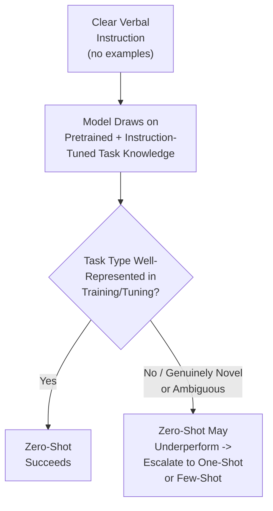
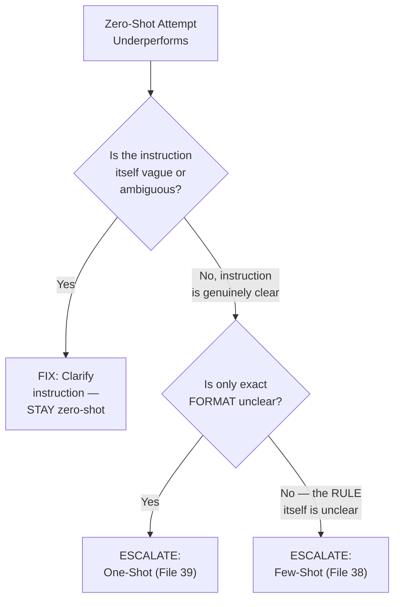
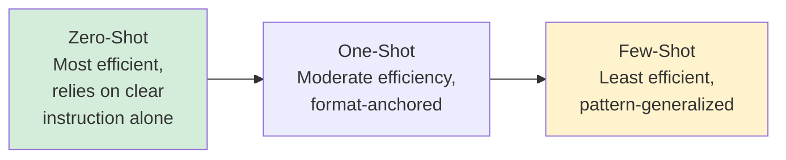

# 40 — Zero-Shot Prompting

> **Series:** Prompt Engineering Knowledge Library
> **File 40 of 60** | **Level:** Beginner → Intermediate
> **Prerequisites:** [`39_One_Shot_Prompting.md`](./39_One_Shot_Prompting.md)
> **Next:** [`41_Chain_of_Thought.md`](./41_Chain_of_Thought.md)

---

## Table of Contents

1. [Definition](#definition)
2. [Why It Matters](#why-it-matters)
3. [Core Concepts](#core-concepts)
4. [How It Works](#how-it-works)
5. [Internal Mechanism](#internal-mechanism)
6. [Types of Zero-Shot Prompting](#types-of-zero-shot-prompting)
7. [Syntax / Structure](#syntax--structure)
8. [Examples (Simple → Advanced)](#examples-simple--advanced)
9. [Best Practices](#best-practices)
10. [Common Mistakes](#common-mistakes)
11. [Real-World Applications](#real-world-applications)
12. [Comparison with Related Concepts](#comparison-with-related-concepts)
13. [Advantages & Limitations](#advantages--limitations)
14. [FAQs](#faqs)
15. [Summary](#summary)
16. [Cheat Sheet](#cheat-sheet)
17. [Glossary](#glossary)
18. [References](#references)
19. [Visual Diagram Gallery](#visual-diagram-gallery)

---

## Definition

**Zero-Shot Prompting** is asking a model to perform a task using instruction alone, with no demonstrated example at all — relying entirely on the model's pretrained and instruction-tuned capability to correctly interpret and execute a novel task description. This completes the shot spectrum begun in [File 38](./38_Few_Shot_Prompting.md) and [File 39](./39_One_Shot_Prompting.md): zero-shot is not "a worse version" of those techniques but the historically foundational, most context-efficient point on the spectrum, and — for a large and growing share of tasks with modern, well-instruction-tuned models — often entirely sufficient on its own.

> Zero-shot's real question, and the one this file focuses on: **when is clear instruction alone genuinely enough, and what specifically makes an instruction "clear enough" to succeed without any demonstrated example at all?**

---

## Why It Matters

- **It's the most efficient point on the spectrum** — no context budget spent on examples, directly relevant to [File 25](./25_Context_Management.md)'s budgeting concerns, and the natural default to attempt before reaching for one-shot or few-shot.
- **Its success rate is a direct, practical signal of instruction quality.** A task that fails zero-shot but succeeds with examples often reveals that the verbal instruction itself was underspecified — diagnostically valuable information, not just a workaround needed.
- **It's historically the capability that most dramatically improved with instruction tuning** ([File 2 — History of Prompts](./02_History_of_Prompts.md)) — understanding why modern models handle zero-shot well, when earlier models didn't, illuminates real, measurable AI progress.
- **Defaulting to zero-shot first, escalating only when needed, is the efficient, disciplined workflow** — this file establishes when that default is well-founded and when escalation is genuinely warranted.

---

## Core Concepts

| Concept | Definition |
|---|---|
| **Instruction Sufficiency** | Whether a verbal task description alone is clear enough to succeed without examples |
| **Pretrained Task Knowledge** | The model's inherent capability, from training, to perform a task type without demonstration |
| **Zero-Shot Failure Signal** | A zero-shot attempt's failure as diagnostic evidence about instruction clarity |
| **Escalation Path** | The practice of moving from zero-shot to one-shot to few-shot as genuinely needed |
| **Novel Task Generalization** | The model's ability to correctly perform a task type it wasn't explicitly trained on, from description alone |

---

## How It Works



Zero-shot's success hinges entirely on whether the model's existing, pretrained knowledge already covers the task type well enough that a clear instruction is sufficient to activate the right behavior — no demonstration is needed to fill a gap, because for many common task types, there is no meaningful gap to fill.

---

## Internal Mechanism

### Why zero-shot works at all: the payoff of instruction tuning

As established in [File 2 — History of Prompts](./02_History_of_Prompts.md), raw pretrained models (before instruction tuning) are not naturally reliable instruction-followers — they're trained to predict plausible continuations, which doesn't automatically mean interpreting a novel instruction *as an instruction to fulfill*. Instruction tuning specifically trains a model on large volumes of (instruction, ideal response) pairs, teaching it to generalize the *behavior of following an instruction* itself, not just memorizing specific instruction-response mappings. This is precisely why zero-shot prompting became dramatically more viable with the instruction-tuned/conversational era of models — the model has learned a general instruction-following capability that extends, with reasonable reliability, to task descriptions it has never seen verbatim, provided the description is clear.

### Why zero-shot failure is genuinely diagnostic, not just a signal to add examples reflexively

When a zero-shot attempt produces a poor result, there are two mechanistically distinct possible causes, and distinguishing them matters: (1) the task type is genuinely underrepresented in the model's training/tuning, meaning no amount of instruction clarity alone would fully resolve it — a genuine case for examples; or (2) the *instruction itself* was ambiguous, underspecified, or violated the clarity/specificity principles from [File 9 — Prompt Design Principles](./09_Prompt_Design_Principles.md) — in which case the fix is improving the instruction, not necessarily adding examples at all. Reflexively adding examples without first checking whether the instruction itself could simply be clearer risks masking a fixable clarity problem with added context-budget cost, rather than addressing the actual root cause — directly connecting to the debugging discipline in [File 13 — Prompt Debugging](./13_Prompt_Debugging.md)'s emphasis on identifying genuine root causes before applying a fix.

---

## Types of Zero-Shot Prompting

| Type | Description | Best Suited For |
|---|---|---|
| **Direct Instructional Zero-Shot** | A clear, simple task statement with no additional scaffolding | Common, well-represented task types (translation, summarization, simple classification) |
| **Constrained Zero-Shot** | Instruction plus explicit output constraints, still no examples | Tasks needing precise bounds ([File 28](./28_Output_Control.md)) but not format demonstration |
| **Role-Assisted Zero-Shot** | Instruction combined with role prompting ([File 24](./24_Role_Prompting.md)), no examples | Tasks benefiting from persona-activated tone/expertise without needing pattern demonstration |
| **Chain-of-Thought Zero-Shot** | Instruction plus a reasoning-inducing phrase ("think step by step"), no worked examples | Reasoning tasks where the approach itself doesn't need demonstrating, just prompting (see [File 41](./41_Chain_of_Thought.md)) |

---

## Syntax / Structure

```text
[Basic zero-shot — clear instruction, no example]
Translate the following sentence into French: "The weather 
is lovely today."
```

```text
[Constrained zero-shot — instruction with explicit bounds, 
still no example]
Summarize the following article in exactly 3 bullet points, 
each under 15 words, focused only on financial figures 
mentioned: {{article_text}}
```

```text
[Zero-shot chain-of-thought — reasoning prompt, no worked example]
What is 15% of $340? Think through this step by step before 
giving your final answer.
```

---

## Examples (Simple → Advanced)

**Level 1 — Simple, successful zero-shot:**
```text
What is the capital of Japan?
```
*(A common, well-represented task type — zero-shot succeeds reliably.)*

**Level 2 — Zero-shot with output control layered on:**
```text
Explain what a black hole is, in exactly 2 sentences, avoiding 
technical jargon.
```

**Level 3 — Zero-shot that reveals an instruction clarity problem:**
```text
[Zero-shot attempt]
"Analyze this data." [ambiguous — analyze for what purpose? 
what output format?]
-> Poor, unfocused result.

[Diagnosis per Internal Mechanism]: This isn't necessarily a 
"needs examples" problem — it may be an instruction clarity 
problem.

[Fixed via clearer instruction, STILL zero-shot]
"Identify the three largest expense categories in this data 
and state each as a percentage of total spending."
-> Clear, focused result, no examples needed.
```

**Level 4 — Role-assisted zero-shot:**
```text
You are an experienced data analyst. Identify any concerning 
trends in the following quarterly sales figures and explain 
why each is concerning in one sentence.

{{data}}
```

**Level 5 — Deliberate escalation path from zero-shot, diagnosing the actual need:**
```text
[Attempt 1 — Zero-shot]
"Extract the key entities from this text as JSON."
-> Inconsistent field names across different runs.

[Diagnosis]: This isn't an instruction-clarity problem — the 
instruction IS clear about intent. The issue is the model 
has no way to know the EXACT expected schema/field names 
without a concrete reference — a genuine case for anchoring.

[Escalation — One-Shot (File 39), not Few-Shot]
Since the underlying RULE ("extract entities") is already 
clear, only the FORMAT needs anchoring:
"Extract the key entities from this text as JSON. 
Example: 'Maria works at Acme in Chicago' -> {'people': 
['Maria'], 'organizations': ['Acme'], 'locations': ['Chicago']}
Now extract from: {{actual_text}}"
-> Consistent field names achieved with the minimal necessary 
escalation, rather than jumping straight to full few-shot.
```

---

## Best Practices

1. **Default to zero-shot first** for any new task, escalating to one-shot or few-shot only when zero-shot genuinely proves insufficient — this is the most context-efficient starting point.
2. **When zero-shot underperforms, diagnose before escalating** — per the Internal Mechanism section, check whether the instruction itself could simply be clearer before assuming examples are the fix.
3. **Escalate minimally and deliberately** — if the issue is format anchoring alone, move to one-shot ([File 39](./39_One_Shot_Prompting.md)) rather than jumping straight to full few-shot ([File 38](./38_Few_Shot_Prompting.md)).
4. **Combine zero-shot with other techniques** (role prompting, output constraints, chain-of-thought triggers) rather than assuming zero-shot means "instruction alone with nothing else" — these combine naturally.
5. **Treat zero-shot success/failure as diagnostic information** about both the task and the instruction quality, not merely a pass/fail outcome.

---

## Common Mistakes

| Mistake | Consequence | Fix |
|---|---|---|
| Reflexively adding examples whenever zero-shot underperforms | Masks a fixable instruction-clarity problem with unnecessary context cost | Diagnose whether the instruction itself could be clearer first |
| Never attempting zero-shot before defaulting to few-shot | Unnecessary context cost for tasks that would have succeeded with clear instruction alone | Default to zero-shot first, escalate only as genuinely needed |
| Escalating straight to few-shot when one-shot would suffice | Unnecessary context cost when only format-anchoring, not rule-generalization, was needed | Escalate minimally — one-shot before few-shot when appropriate |
| Assuming zero-shot means no other techniques can be combined | Missing valuable combinations (role prompting, constraints, CoT triggers) | Combine zero-shot instruction with other complementary techniques |
| Treating a single zero-shot failure as conclusive | Premature escalation based on one output, without accounting for sampling variance ([File 4](./04_How_LLMs_Interpret_Prompts.md)) | Test zero-shot across multiple runs/inputs before concluding it's insufficient |

---

## Real-World Applications

- **The default starting point for most everyday prompting** ([File 10 — Prompt Engineering Basics](./10_Prompt_Engineering_Basics.md)) — the vast majority of common, well-represented tasks succeed zero-shot with a clear instruction.
- **High-volume production systems prioritizing token efficiency** — zero-shot's context efficiency directly reduces per-request cost at scale ([File 11 — Prompt Optimization](./11_Prompt_Optimization.md)).
- **Rapid prototyping and exploratory prompt development** ([File 8 — Prompt Workflow](./08_Prompt_Workflow.md)) — starting from zero-shot as the simplest baseline before iterating.
- **Diagnostic prompt debugging** ([File 13](./13_Prompt_Debugging.md)) — testing whether a task succeeds zero-shot is itself a useful diagnostic step for understanding whether a downstream problem is instruction-clarity-related or genuinely needs demonstration.

---

## Comparison with Related Concepts

| Concept | Difference from "Zero-Shot Prompting" |
|---|---|
| **One-Shot Prompting (File 39)** | One-shot adds exactly one example for format-anchoring when instruction alone proves insufficient for structural precision; zero-shot relies on instruction with no demonstration at all |
| **Few-Shot Prompting (File 38)** | Few-shot adds multiple, varied examples specifically to support pattern generalization the instruction alone couldn't convey; zero-shot has no such demonstration |
| **Prompt Engineering Basics (File 10)** | File 10 covers the general beginner starting process; zero-shot is frequently the natural default technique that process produces, given its efficiency and the sufficiency of clear instruction for many common tasks |

---

## Advantages & Limitations

### ✅ Advantages of Zero-Shot Prompting

- **Maximally context-efficient** — no budget spent on examples, directly beneficial at scale ([File 25](./25_Context_Management.md)).
- **Often entirely sufficient for common, well-represented task types**, especially with modern, well-instruction-tuned models.
- **Provides genuinely diagnostic information** when it fails, distinguishing instruction-clarity problems from genuine demonstration needs.

### ⚠️ Limitations

- **Less reliable for genuinely novel, ambiguous, or precisely-formatted tasks** where the model's pretrained knowledge doesn't already cover the specific need well.
- **Success depends heavily on instruction quality** — a vague zero-shot prompt can fail for reasons entirely fixable through better instruction, without needing escalation at all.
- **Cannot anchor exact structural format as reliably as one-shot or few-shot** when precise, consistent output structure genuinely matters.

---

## FAQs

**Q: Should I always try zero-shot before adding examples?**
A: Generally yes, as a matter of efficient default practice — attempting the simplest, most efficient approach first and escalating only when it genuinely proves insufficient is both more efficient and more diagnostically informative than defaulting to examples immediately.

**Q: How many times should I test a zero-shot prompt before concluding it needs examples?**
A: Given output variance from sampling ([File 4](./04_How_LLMs_Interpret_Prompts.md)), testing across multiple runs and, ideally, multiple varied inputs (per [File 14 — Prompt Testing](./14_Prompt_Testing.md)) provides more reliable evidence than a single attempt before concluding escalation is genuinely warranted.

**Q: Is "zero-shot chain-of-thought" (just adding 'think step by step') really zero-shot?**
A: Yes — it remains zero-shot because no worked example is provided; the reasoning-inducing phrase is an instructional technique, not a demonstration, distinguishing it from a chain-of-thought approach that includes a worked reasoning example (which would then be one-shot or few-shot CoT).

**Q: Why did zero-shot prompting become so much more viable in recent years?**
A: Directly due to instruction tuning ([File 2](./02_History_of_Prompts.md)) — models trained specifically to generalize the behavior of following novel instructions, not just to continue text plausibly, made reliable zero-shot task performance achievable in a way it generally wasn't for earlier, non-instruction-tuned models.

---

## Summary

Zero-Shot Prompting relies on clear verbal instruction alone, with no demonstrated example, succeeding specifically because instruction tuning ([File 2](./02_History_of_Prompts.md)) taught modern models to generalize the behavior of instruction-following itself, not merely to memorize specific instruction-response mappings — making it the most context-efficient point on the shot spectrum and often entirely sufficient for common, well-represented task types. When zero-shot underperforms, the failure is genuinely diagnostic: it may signal a fixable instruction-clarity problem (addressed by better instruction, not examples) or a genuine need for demonstration (addressed by minimal, deliberate escalation to one-shot or few-shot as actually needed) — distinguishing between these two causes, rather than reflexively adding examples, is the disciplined practice this file establishes. Having now completed the full shot spectrum (zero, one, few), the library turns to a different technique family entirely: eliciting explicit reasoning, beginning with [File 41 — Chain of Thought](./41_Chain_of_Thought.md).

---

## Cheat Sheet

```text
ZERO-SHOT PROMPTING — QUICK REFERENCE

DEFAULT WORKFLOW: Try zero-shot FIRST (most context-efficient) 
-> escalate only if genuinely insufficient.

WHEN ZERO-SHOT FAILS, DIAGNOSE FIRST:
[ ] Is the INSTRUCTION itself vague/ambiguous? -> Fix the 
    instruction, stay zero-shot
[ ] Is only the FORMAT unclear, rule already clear? -> 
    Escalate to One-Shot (File 39)
[ ] Is the RULE itself hard to state verbally? -> 
    Escalate to Few-Shot (File 38)

THE FULL SPECTRUM
Zero-Shot -> One-Shot -> Few-Shot
(instruction   (+ format    (+ pattern
 alone)         anchor)      generalization)
```

---

## Glossary

| Term | Definition |
|---|---|
| **Instruction Sufficiency** | Whether verbal instruction alone is clear enough without examples |
| **Pretrained Task Knowledge** | The model's inherent capability from training, without demonstration |
| **Zero-Shot Failure Signal** | A failed zero-shot attempt as diagnostic evidence |
| **Escalation Path** | Moving from zero-shot to one-shot to few-shot as genuinely needed |
| **Novel Task Generalization** | Correctly performing an undemonstrated task type from description alone |

---

## References

- Radford, A. et al. (2019) — *Language Models are Unsupervised Multitask Learners*, OpenAI (early zero-shot task transfer observations)
- Wei, J. et al. (2021) — *Finetuned Language Models Are Zero-Shot Learners*, arXiv:2109.01652
- Ouyang, L. et al. (2022) — *Training Language Models to Follow Instructions with Human Feedback*, arXiv:2203.02155
- Kojima, T. et al. (2022) — *Large Language Models are Zero-Shot Reasoners*, arXiv:2205.11916 (zero-shot chain-of-thought)

---

## Visual Diagram Gallery

**Diagram 1 — Zero-Shot Failure Diagnosis Tree**


**Diagram 2 — Why Instruction Tuning Made Zero-Shot Viable**
```text
PRE-INSTRUCTION-TUNING (raw pretrained model):
Novel instruction -> "predict plausible continuation" 
                      -> may not reliably FOLLOW it as a command

POST-INSTRUCTION-TUNING (modern models):
Novel instruction -> generalizes the learned BEHAVIOR of 
                      instruction-following itself
                      -> reliably attempts to fulfill it
```

**Diagram 3 — The Complete Shot Spectrum (efficiency vs. precision trade-off)**


---

**⬅️ Previous:** [`39_One_Shot_Prompting.md`](./39_One_Shot_Prompting.md)
**➡️ Next:** [`41_Chain_of_Thought.md`](./41_Chain_of_Thought.md) — Eliciting explicit, step-by-step reasoning before a final answer.
