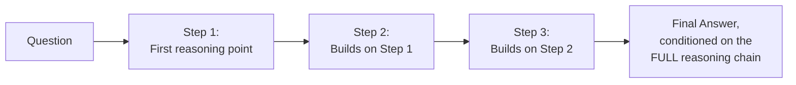
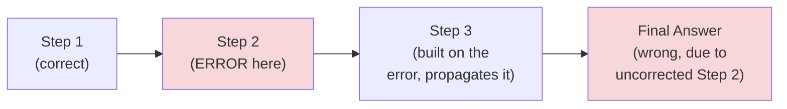
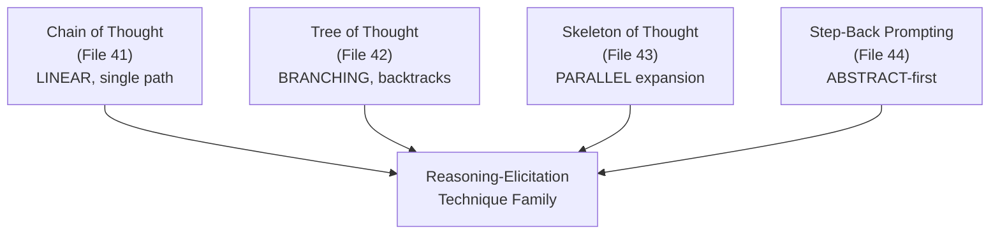

# 41 — Chain of Thought

> **Series:** Prompt Engineering Knowledge Library
> **File 41 of 60** | **Level:** Intermediate
> **Prerequisites:** [`19_Prompt_Patterns.md`](./19_Prompt_Patterns.md), [`40_Zero_Shot_Prompting.md`](./40_Zero_Shot_Prompting.md)
> **Next:** [`42_Tree_of_Thought.md`](./42_Tree_of_Thought.md)

---

## Table of Contents

1. [Definition](#definition)
2. [Why It Matters](#why-it-matters)
3. [Core Concepts](#core-concepts)
4. [How It Works](#how-it-works)
5. [Internal Mechanism](#internal-mechanism)
6. [Types of Chain-of-Thought Prompting](#types-of-chain-of-thought-prompting)
7. [Syntax / Structure](#syntax--structure)
8. [Examples (Simple → Advanced)](#examples-simple--advanced)
9. [Best Practices](#best-practices)
10. [Common Mistakes](#common-mistakes)
11. [Real-World Applications](#real-world-applications)
12. [Comparison with Related Concepts](#comparison-with-related-concepts)
13. [Advantages & Limitations](#advantages--limitations)
14. [FAQs](#faqs)
15. [Summary](#summary)
16. [Cheat Sheet](#cheat-sheet)
17. [Glossary](#glossary)
18. [References](#references)
19. [Visual Diagram Gallery](#visual-diagram-gallery)

---

## Definition

**Chain of Thought (CoT)** is the technique of inducing a model to generate explicit, linear, step-by-step intermediate reasoning *before* committing to a final answer, rather than jumping directly from question to conclusion. This file opens a family of four reasoning-elicitation techniques (Files 41–44) that share a common goal — improving performance on tasks requiring multi-step reasoning — but differ genuinely in mechanism: CoT is specifically the **linear**, single-path case; [File 42 — Tree of Thought](./42_Tree_of_Thought.md) branches and backtracks; [File 43 — Skeleton of Thought](./43_Skeleton_of_Thought.md) parallelizes; [File 44 — Step-Back Prompting](./44_Step_Back_Prompting.md) reasons from the abstract before the specific.

> CoT's defining shape: **one continuous, sequential line of reasoning, step 1 leads to step 2 leads to step 3, arriving at a single final answer** — no branching, no backtracking, no parallel exploration. That linearity is precisely what makes it simple, cheap, and often sufficient, while also defining its limits.

---

## Why It Matters

- **It's one of the most impactful, well-documented reasoning-improvement techniques for tasks genuinely requiring multi-step logic** — math, multi-hop questions, logical deduction.
- **It directly exploits autoregressive generation's core mechanic**, already established in [File 4 — How LLMs Interpret Prompts](./04_How_LLMs_Interpret_Prompts.md) and previewed in [File 19 — Prompt Patterns](./19_Prompt_Patterns.md) — this file gives that mechanism its full, dedicated treatment.
- **It's simple to apply** — often requiring nothing more than a short instructional phrase — making it among the highest-leverage, lowest-cost techniques in this entire library for the right task type.
- **Understanding CoT deeply is the necessary foundation for the more elaborate techniques that follow** — ToT, SoT, and Step-Back are all, in different ways, structural elaborations on the same core reasoning-elicitation insight CoT establishes.

---

## Core Concepts

| Concept | Definition |
|---|---|
| **Intermediate Reasoning Step** | An explicit statement of one stage of a multi-step reasoning process |
| **Linear Chain** | A single, sequential path from question through reasoning steps to a final answer |
| **Reasoning Trigger** | The instructional phrase or framing that induces step-by-step generation |
| **Final Answer Extraction** | Identifying and isolating the conclusive answer from the full reasoning trace |
| **Zero-Shot CoT** | Chain of thought induced by an instruction alone ("think step by step"), no worked example |
| **Few-Shot CoT** | Chain of thought induced by worked reasoning examples, demonstrating the reasoning pattern itself |

---

## How It Works



This diagram is deliberately linear — a single, unbranching path. Every step is conditioned on everything before it, and the final answer is conditioned on the entire accumulated chain, not just the original question. This is the core mechanical advantage CoT provides over a direct question-to-answer jump.

---

## Internal Mechanism

### Why CoT works: exploiting autoregressive conditioning for effective "working memory"

As established in [File 4](./04_How_LLMs_Interpret_Prompts.md) and previewed in [File 19](./19_Prompt_Patterns.md), each token a model generates is conditioned on the entire sequence so far, including its own previously generated tokens. Without CoT, a model asked a complex question is, in effect, forced to condition its single answer token(s) directly on the question alone — a much narrower conditioning context than the question *plus* several already-worked reasoning steps. By inducing intermediate reasoning tokens first, CoT effectively expands the context the final answer is conditioned on, giving the model something functionally similar to "working through the problem on paper" rather than answering purely from immediate pattern-matching. This is why CoT's benefit is concentrated specifically on tasks with genuine multi-step structure — the mechanism only helps when there's real intermediate work worth externalizing into conditioning context.

### Why CoT's linearity is both its strength and its defining limitation

Because CoT generates one continuous, sequential reasoning path with no branching or backtracking, an early error in the chain has no built-in correction mechanism — the model doesn't "notice" a wrong turn and go back; it continues conditioning forward on whatever was already generated, including the error. This is the precise mechanical reason [File 42 — Tree of Thought](./42_Tree_of_Thought.md) exists: for problems where a single reasoning path is prone to getting stuck or where multiple distinct approaches might need comparing, CoT's linear, single-path structure is a genuine, mechanistic limitation — not merely an implementation detail — that a fundamentally different, branching structure is needed to address.

---

## Types of Chain-of-Thought Prompting

| Type | Description | Best Suited For |
|---|---|---|
| **Zero-Shot CoT** | A simple trigger phrase ("think step by step"), no worked example | Tasks where the reasoning approach itself doesn't need demonstrating |
| **Few-Shot CoT** | Worked reasoning examples demonstrating the reasoning pattern (combines with [File 38](./38_Few_Shot_Prompting.md)) | Tasks where the reasoning *approach* itself is non-obvious and benefits from demonstration |
| **Structured CoT** | Reasoning steps explicitly labeled/numbered | Tasks where reasoning trace clarity/auditability matters |
| **CoT with Explicit Final-Answer Marker** | A clear delimiter separating reasoning from the extractable final answer | Programmatic pipelines needing to reliably parse out just the answer |

---

## Syntax / Structure

```text
[Zero-shot CoT trigger]
{{question}}

Think through this step by step before giving your final answer.
```

```text
[Structured CoT with explicit final-answer marker, for 
programmatic extraction]
{{question}}

Reason through this step by step, labeling each step. Then, 
on a final line, state your answer as: "FINAL ANSWER: [answer]"
```

```text
[Few-shot CoT — worked example demonstrating the reasoning pattern]
Q: A store had 20 apples, sold 8, then received 15 more. How 
many apples now?
A: Starting: 20. After selling 8: 20 - 8 = 12. After 
receiving 15 more: 12 + 15 = 27. Final answer: 27.

Q: {{actual_question}}
A:
```

---

## Examples (Simple → Advanced)

**Level 1 — Basic zero-shot CoT trigger:**
```text
If a train travels 60 mph for 2.5 hours, how far does it go? 
Think step by step.
```

**Level 2 — Structured CoT with labeled steps:**
```text
Step 1: Identify the relevant information.
Step 2: Determine the calculation needed.
Step 3: Perform the calculation.
Step 4: State the final answer.

Question: {{question}}
```

**Level 3 — Few-shot CoT demonstrating a non-obvious reasoning pattern:**
```text
Q: Is 2 + 2 = 4 relevant to whether the sky is blue?
A: The sky's color relates to light scattering (Rayleigh 
scattering) in the atmosphere, an entirely different physical 
domain from arithmetic. These are unrelated. Answer: No, not relevant.

Q: {{actual_question, testing relevance judgment}}
A:
```

**Level 4 — CoT with explicit final-answer extraction marker:**
```text
{{complex_multi_part_question}}

Work through this step by step, showing your reasoning for 
each part. When you reach your conclusion, write it on its 
own final line starting with "FINAL ANSWER:" so it can be 
extracted programmatically.
```

**Level 5 — Full CoT combined with output formatting (File 29) for a production pipeline:**
```text
{{question}}

Reason through this step by step. Then respond in this exact 
JSON structure:
{
  "reasoning_steps": ["step 1 text", "step 2 text", ...],
  "final_answer": "the answer alone, no reasoning"
}

(Separating reasoning_steps from final_answer as distinct 
JSON fields makes both the reasoning trace AND the clean 
answer independently, reliably accessible to downstream code.)
```

---

## Best Practices

1. **Reserve CoT for tasks with genuine multi-step structure** — per the Internal Mechanism section, its benefit is concentrated where there's real intermediate work to externalize; applying it to simple, single-step tasks adds cost without corresponding benefit.
2. **Use zero-shot CoT as the default, lightweight starting point**, escalating to few-shot CoT only if the reasoning *approach* itself (not just the answer) needs demonstrating.
3. **Add an explicit final-answer marker** for any pipeline that needs to programmatically extract just the conclusion from the full reasoning trace, connecting directly to [File 29 — Output Formatting](./29_Output_Formatting.md).
4. **Recognize CoT's linearity limitation** — for problems genuinely prone to a single reasoning path getting stuck, or needing comparison across distinct approaches, consider [File 42 — Tree of Thought](./42_Tree_of_Thought.md) instead.
5. **Test whether CoT actually helps for your specific task** ([File 14 — Prompt Testing](./14_Prompt_Testing.md)) — it's not universally beneficial, and adding it reflexively to every prompt is a documented anti-pattern.

---

## Common Mistakes

| Mistake | Consequence | Fix |
|---|---|---|
| Applying CoT to simple, single-step tasks | Unnecessary verbosity and cost with no accuracy benefit | Reserve CoT for genuine multi-step reasoning tasks |
| No explicit final-answer marker in a programmatic pipeline | Difficulty reliably extracting just the conclusion from the full reasoning trace | Add an explicit marker or structured output format |
| Assuming CoT corrects itself if an early step is wrong | Errors compound forward with no built-in correction, per CoT's linear structure | For problems prone to this, use Tree of Thought (File 42) instead |
| Using few-shot CoT when zero-shot would suffice | Unnecessary context cost when the reasoning approach didn't actually need demonstrating | Default to zero-shot CoT, escalate only as genuinely needed |
| Not testing whether CoT actually improves the specific task | Reflexively applying a technique that may not help, or could even hurt, for this particular case | Empirically validate CoT's benefit for your specific task type |

---

## Real-World Applications

- **Mathematical and quantitative reasoning tasks** — CoT is a near-standard technique for word problems, calculations, and quantitative analysis.
- **Multi-hop question answering** — questions requiring combining several pieces of information benefit substantially from explicit intermediate reasoning.
- **Logical deduction and rule-following tasks** — puzzles, compliance checking, and eligibility determination often benefit from an explicit, auditable reasoning trace.
- **Auditable/explainable AI applications** — CoT's explicit reasoning trace provides genuine transparency into how a conclusion was reached, valuable in regulated or trust-sensitive contexts.

---

## Comparison with Related Concepts

| Concept | Difference from "Chain of Thought" |
|---|---|
| **Tree of Thought (File 42)** | CoT is a single, linear reasoning path with no branching or backtracking; ToT explores multiple branching paths and can backtrack from unpromising ones — a fundamentally different structure, not merely "more steps" |
| **Skeleton of Thought (File 43)** | CoT generates reasoning sequentially, one step at a time; SoT first generates a parallel skeleton, then expands sections independently — a different optimization goal (latency) with a different structural approach |
| **Step-Back Prompting (File 44)** | Step-back reasons from a general principle down to the specific case, a particular reasoning *strategy*; CoT is agnostic to reasoning strategy and simply elicits whatever sequential steps the model would take |

---

## Advantages & Limitations

### ✅ Advantages of Chain of Thought

- **Substantially improves performance on genuine multi-step reasoning tasks**, a well-documented, widely-replicated finding.
- **Simple and low-cost to apply**, often requiring only a short trigger phrase.
- **Provides a genuinely auditable reasoning trace**, valuable for transparency and debugging.

### ⚠️ Limitations

- **No benefit, and real cost, for simple, single-step tasks** — CoT is not a universal improvement technique.
- **Linear structure has no built-in error correction** — an early mistake compounds forward through the rest of the chain.
- **Increases response length and token cost**, a genuine trade-off against [File 11 — Prompt Optimization](./11_Prompt_Optimization.md)'s efficiency concerns, justified only when the accuracy benefit outweighs it.

---

## FAQs

**Q: Does "think step by step" always improve accuracy?**
A: No — its benefit is specifically tied to tasks with genuine multi-step structure; for simple factual recall or single-step tasks, it typically adds length without meaningful accuracy improvement.

**Q: Is zero-shot CoT as effective as few-shot CoT?**
A: For many tasks, yes — the simple trigger phrase alone is often sufficient; few-shot CoT's added value is specifically when the *reasoning approach itself* (not just correctness) benefits from demonstration, which isn't universal.

**Q: What happens if the model makes an error partway through a CoT chain?**
A: Per the Internal Mechanism section, the linear structure has no built-in correction — the error typically propagates forward; this is a known limitation that [Tree of Thought](./42_Tree_of_Thought.md) specifically addresses through branching and backtracking.

**Q: How do I reliably extract just the final answer from a CoT response?**
A: Use an explicit final-answer marker or structured output format (Level 4-5 examples above) rather than relying on informally parsing the full reasoning trace.

---

## Summary

Chain of Thought induces explicit, linear, step-by-step intermediate reasoning before a final answer, directly exploiting autoregressive conditioning to give a model something functionally similar to working memory — each reasoning step becomes part of the context the next step, and ultimately the final answer, is conditioned on. This mechanism concentrates CoT's benefit specifically on tasks with genuine multi-step structure, while its defining linearity — one continuous path, no branching or backtracking — means an early error has no built-in correction mechanism, a real limitation that motivates the more elaborate technique covered next. Having established this foundational, linear reasoning technique, the library turns to its branching, backtracking counterpart: [File 42 — Tree of Thought](./42_Tree_of_Thought.md).

---

## Cheat Sheet

```text
CHAIN OF THOUGHT — QUICK REFERENCE

USE WHEN: Task has genuine multi-step structure (math, multi-
hop reasoning, logical deduction).
DON'T USE WHEN: Task is simple/single-step — adds cost, no benefit.

VARIANTS
Zero-Shot CoT  -> "think step by step" trigger alone (default, 
                   lightweight)
Few-Shot CoT   -> worked reasoning examples (when the APPROACH 
                   itself needs demonstrating)

KEY LIMITATION: LINEAR structure = no built-in error correction. 
An early mistake compounds forward. For problems prone to this, 
see Tree of Thought (File 42).
```

---

## Glossary

| Term | Definition |
|---|---|
| **Intermediate Reasoning Step** | An explicit statement of one stage of multi-step reasoning |
| **Linear Chain** | A single, sequential reasoning path with no branching |
| **Reasoning Trigger** | The instructional phrase inducing step-by-step generation |
| **Final Answer Extraction** | Isolating the conclusive answer from the full reasoning trace |
| **Zero-Shot CoT** | Chain of thought induced by instruction alone |
| **Few-Shot CoT** | Chain of thought induced by worked reasoning examples |

---

## References

- Wei, J. et al. (2022) — *Chain-of-Thought Prompting Elicits Reasoning in Large Language Models*, arXiv:2201.11903
- Kojima, T. et al. (2022) — *Large Language Models are Zero-Shot Reasoners*, arXiv:2205.11916
- Wang, X. et al. (2022) — *Self-Consistency Improves Chain of Thought Reasoning*, arXiv:2203.11171
- Suzgun, M. et al. (2022) — *Challenging BIG-Bench Tasks and Whether Chain-of-Thought Can Solve Them*, arXiv:2210.09261

---

## Visual Diagram Gallery

**Diagram 1 — CoT's Effective "Working Memory" Expansion**
```text
WITHOUT CoT:
Question -> [narrow conditioning] -> Answer (right or wrong,
                                       one shot)

WITH CoT:
Question -> Step 1 -> Step 2 -> Step 3 -> [WIDE conditioning,
                                            includes all prior
                                            steps] -> Answer
```

**Diagram 2 — Why Linearity Means No Self-Correction**


**Diagram 3 — The Reasoning-Elicitation Family (Files 41-44 preview)**


---

**⬅️ Previous:** [`40_Zero_Shot_Prompting.md`](./40_Zero_Shot_Prompting.md)
**➡️ Next:** [`42_Tree_of_Thought.md`](./42_Tree_of_Thought.md) — Branching, backtracking reasoning for problems a single linear path struggles with.
