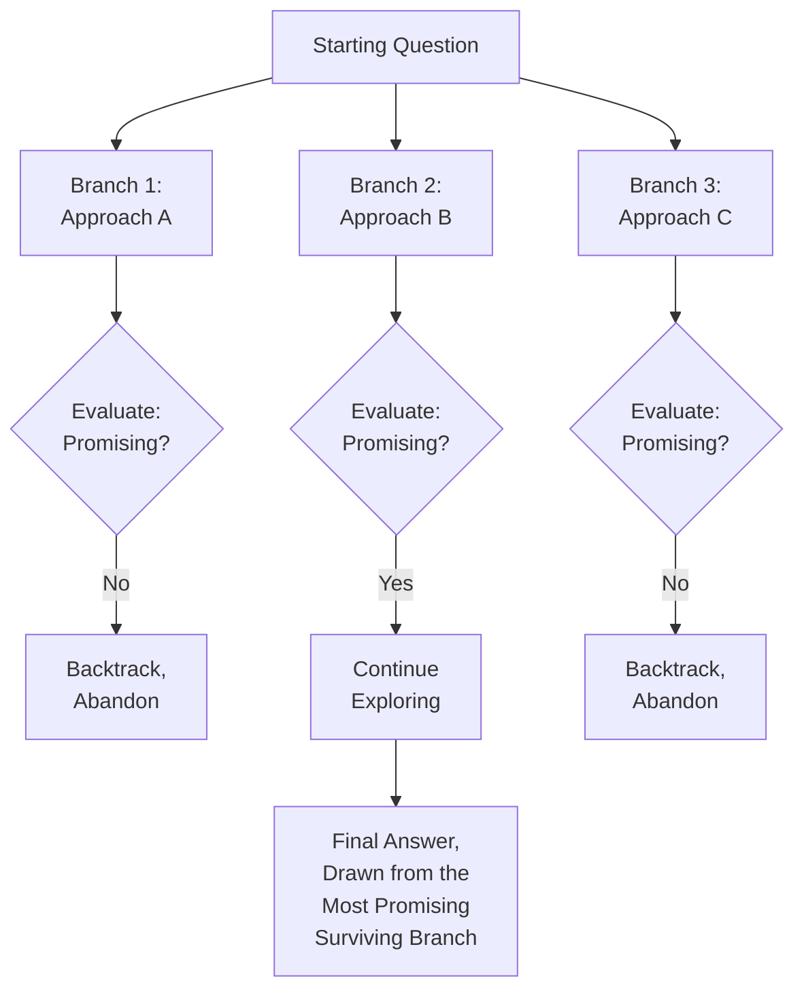
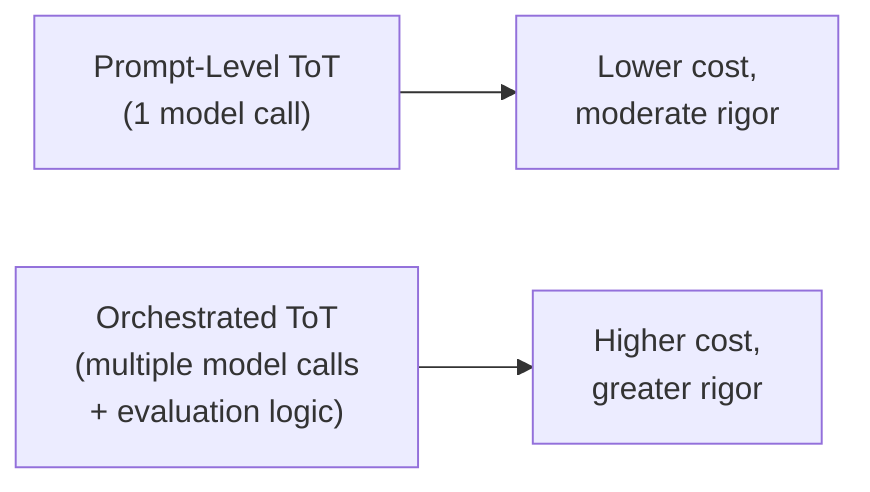
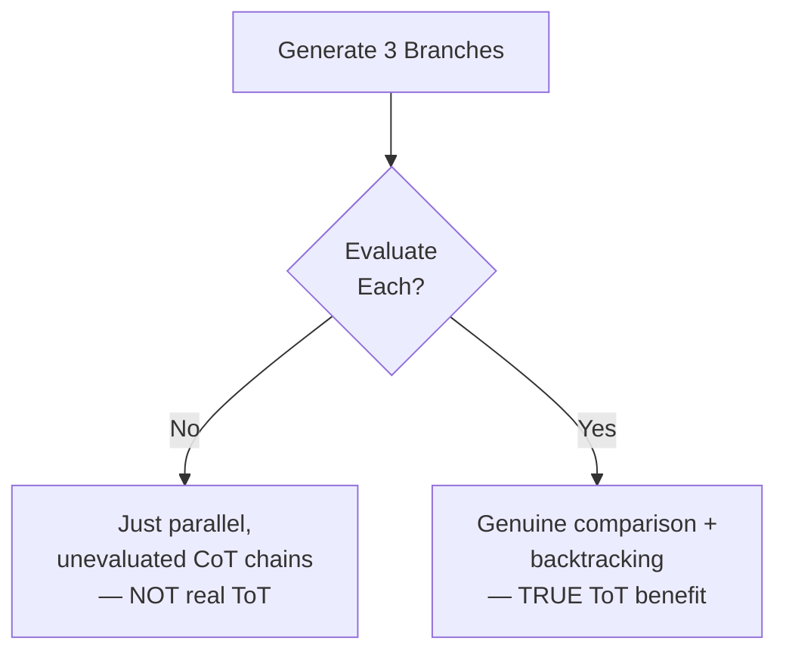

# 42 — Tree of Thought

> **Series:** Prompt Engineering Knowledge Library
> **File 42 of 60** | **Level:** Advanced
> **Prerequisites:** [`41_Chain_of_Thought.md`](./41_Chain_of_Thought.md)
> **Next:** [`43_Skeleton_of_Thought.md`](./43_Skeleton_of_Thought.md)

---

## Table of Contents

1. [Definition](#definition)
2. [Why It Matters](#why-it-matters)
3. [Core Concepts](#core-concepts)
4. [How It Works](#how-it-works)
5. [Internal Mechanism](#internal-mechanism)
6. [Types of Tree of Thought](#types-of-tree-of-thought)
7. [Syntax / Structure](#syntax--structure)
8. [Examples (Simple → Advanced)](#examples-simple--advanced)
9. [Best Practices](#best-practices)
10. [Common Mistakes](#common-mistakes)
11. [Real-World Applications](#real-world-applications)
12. [Comparison with Related Concepts](#comparison-with-related-concepts)
13. [Advantages & Limitations](#advantages--limitations)
14. [FAQs](#faqs)
15. [Summary](#summary)
16. [Cheat Sheet](#cheat-sheet)
17. [Glossary](#glossary)
18. [References](#references)
19. [Visual Diagram Gallery](#visual-diagram-gallery)

---

## Definition

**Tree of Thought (ToT)** is a reasoning-elicitation technique that explores *multiple, distinct reasoning paths in parallel* — branching at points of uncertainty, evaluating each branch's promise, and backtracking away from unpromising ones — rather than committing to the single, linear path [File 41 — Chain of Thought](./41_Chain_of_Thought.md) follows. Where CoT generates one continuous line of reasoning with no correction mechanism for an early wrong turn, ToT directly addresses that exact limitation by maintaining several candidate reasoning branches simultaneously and deliberately abandoning weak ones in favor of stronger alternatives.

> The core structural shift: CoT asks "what's the next step in *the* reasoning path?" ToT asks "what are *several plausible* next steps, which of them seem most promising, and should we abandon the ones that don't pan out?" — a genuine search process, not a single forward pass.

---

## Why It Matters

- **It directly solves CoT's most significant structural limitation** — established in [File 41](./41_Chain_of_Thought.md)'s Internal Mechanism section, an early error in a linear chain has no correction path; ToT's branching and backtracking is precisely the mechanism that provides one.
- **It's well suited to problems with genuine decision points** — puzzles, planning tasks, and problems where multiple plausible approaches exist and it's not obvious upfront which will succeed.
- **It formalizes deliberate self-evaluation into the reasoning process itself** — branches aren't just generated, they're assessed, which connects meaningfully to [File 47 — Self-Reflection](./47_Self_Reflection.md)'s critique-and-revise concept, though applied mid-reasoning rather than post-hoc.
- **Understanding when ToT's added complexity is actually justified**, versus when simpler CoT suffices, is itself a genuine, practical skill this file develops.

---

## Core Concepts

| Concept | Definition |
|---|---|
| **Branch** | One distinct candidate reasoning path explored from a given decision point |
| **Branching Point** | A point in reasoning where multiple plausible next steps exist |
| **Branch Evaluation** | Assessing a branch's promise or validity before continuing to explore it |
| **Backtracking** | Abandoning an unpromising branch and returning to explore an alternative |
| **Search Strategy** | The method used to decide which branches to explore, in what order, and when to stop |
| **Terminal State** | A branch that reaches a complete, evaluable answer or is determined to be a dead end |

---

## How It Works



Unlike CoT's single forward pass, ToT is explicitly a search process — multiple candidates are generated, assessed, and selectively pursued or abandoned, arriving at a final answer only after this deliberate comparison, not merely the first path attempted.

---

## Internal Mechanism

### Why branching requires the model (or an orchestrating process) to generate and hold multiple candidates simultaneously

Because a model generates text autoregressively, one token sequence at a time ([File 4](./04_How_LLMs_Interpret_Prompts.md)), genuine parallel branch exploration isn't something a single, uninterrupted generation naturally does on its own — it requires either explicit prompting that induces the model to *articulate* multiple candidate approaches within one response (a lighter-weight, single-call approximation of ToT), or an orchestrating application process that makes multiple separate model calls, one per branch, and programmatically manages the comparison and backtracking logic between them (a heavier-weight, multi-call, true implementation). This is an important practical distinction: "prompt-level ToT" (asking the model to consider several approaches and reason about which is best, all within one response) and "orchestrated ToT" (an application-level search algorithm making multiple distinct model calls) are related but meaningfully different implementations of the same underlying idea, with real differences in cost, complexity, and reliability.

### Why branch evaluation is the step that actually provides ToT's error-correction benefit

Simply generating multiple candidate branches, without genuinely evaluating and comparing them, wouldn't meaningfully improve on CoT — the benefit specifically comes from the evaluation step, where a branch that has gone down an unpromising or clearly flawed path is recognized as such and abandoned *before* being allowed to determine the final answer. This evaluation can be explicit and structured (asking the model to score or critique each branch against defined criteria) or more implicit (asking the model to compare branches and select the strongest). Either way, this evaluative comparison is the specific mechanical step that converts "generate several ideas" into "genuinely search for the best one" — omitting it collapses ToT back into something closer to merely generating several unevaluated CoT chains in parallel, without capturing the actual error-correction benefit the technique is meant to provide.

---

## Types of Tree of Thought

| Type | Description | Best Suited For |
|---|---|---|
| **Prompt-Level ToT** | A single prompt inducing the model to consider, evaluate, and choose among multiple approaches within one response | Moderate-complexity problems; lower cost, single model call |
| **Orchestrated Multi-Call ToT** | An application-level process making separate model calls per branch, managing comparison and backtracking programmatically | High-stakes, high-complexity problems justifying the added cost and engineering |
| **Breadth-First ToT** | Explores all branches at a given depth before going deeper on any | Problems where early, broad comparison across many approaches is valuable |
| **Best-First / Greedy ToT** | Pursues the currently most-promising branch deepest before considering alternatives | Problems where a strong early candidate is likely to remain strong |

---

## Syntax / Structure

```text
[Prompt-level ToT — single-call approximation]
{{complex_problem}}

Consider three distinct approaches to solving this problem. 
For each approach:
1. Briefly outline the approach.
2. Identify its most likely strength and weakness.
3. Rate its promise (1-5).

Then, select the most promising approach and work through it 
fully to reach a final answer, explicitly noting why you 
rejected the other two.
```

```yaml
# Orchestrated multi-call ToT (application-level pseudocode)
branches = generate_candidate_approaches(problem, n=3)
for branch in branches:
    branch.result = model_call(f"Pursue this approach: {branch}")
    branch.score = evaluate_branch(branch.result)  # separate 
                                                     # evaluation call
best_branch = max(branches, key=lambda b: b.score)
if best_branch.score < threshold:
    # backtrack: generate new candidates, repeat
    branches = generate_candidate_approaches(problem, n=3, 
                                               exclude=branches)
final_answer = best_branch.result
```

---

## Examples (Simple → Advanced)

**Level 1 — Simple prompt-level ToT for a puzzle:**
```text
Solve this logic puzzle: {{puzzle}}. Consider two different 
starting assumptions, work through the implications of each, 
and identify which one leads to a consistent solution.
```

**Level 2 — Explicit branch evaluation criteria:**
```text
{{planning_problem}}

Propose 3 different plans. For each, evaluate: feasibility 
(1-5), cost efficiency (1-5), and risk (1-5). Select the plan 
with the best overall balance and explain your reasoning.
```

**Level 3 — Branching with explicit backtracking language:**
```text
{{math_problem}}

Attempt a solution. If partway through you find the approach 
isn't working (e.g., leads to a contradiction or dead end), 
explicitly note this, back up to the last valid step, and try 
a different approach from there — rather than continuing to 
push forward on a path that isn't working.
```

**Level 4 — Structured breadth-first exploration:**
```text
{{complex_decision_problem}}

Step 1: Generate 3 distinct candidate approaches (breadth).
Step 2: For each, take just the FIRST reasoning step and 
assess whether it seems viable.
Step 3: Discard any that show early signs of failure.
Step 4: For remaining viable candidates, continue reasoning 
one step further, reassessing at each stage.
Step 5: Converge on the strongest surviving candidate for a 
full solution.
```

**Level 5 — Orchestrated multi-call ToT for a high-stakes application:**
```yaml
Scenario: An AI system generating a complex business strategy 
recommendation, where getting it right matters significantly.

Call 1-3: Three separate model calls, each pursuing a distinct 
strategic approach (e.g., "aggressive growth," "conservative 
consolidation," "hybrid") with full reasoning per approach.

Call 4 (evaluation): A separate model call, given all three 
full reasoning traces, scores each against defined criteria 
(feasibility, risk, alignment with stated goals) — this 
mirrors the LLM-as-judge practice from File 15, applied 
mid-process rather than post-hoc.

Decision: If the top-scored approach clears a defined 
confidence threshold, it's selected as the final 
recommendation. If no approach clears the threshold, generate 
new candidate branches informed by why the first round fell 
short (genuine backtracking) and repeat.

-> This is meaningfully more expensive (4+ model calls versus 
   CoT's single call) but provides real error-correction and 
   comparative rigor for a genuinely high-stakes decision.
```

---

## Best Practices

1. **Reserve ToT for problems with genuine decision points or dead-end risk** — per [File 41](./41_Chain_of_Thought.md)'s comparison, simpler CoT suffices for problems without meaningful branching structure, and ToT's added cost isn't justified there.
2. **Include an explicit evaluation step**, not just branch generation — per the Internal Mechanism section, evaluation is what actually provides the error-correction benefit; skipping it undermines the technique's core value.
3. **Choose prompt-level versus orchestrated ToT based on genuine stakes** — prompt-level is far cheaper and often sufficient; orchestrated multi-call ToT is justified specifically for high-stakes problems where the added cost and engineering are worth it.
4. **Define concrete evaluation criteria** for branch assessment, rather than leaving "which is more promising" vague — this connects to [File 15 — Prompt Evaluation](./15_Prompt_Evaluation.md)'s rubric-design principles.
5. **Test whether ToT's added complexity actually outperforms simpler CoT** for your specific task ([File 14 — Prompt Testing](./14_Prompt_Testing.md)) — don't assume added structure is automatically beneficial.

---

## Common Mistakes

| Mistake | Consequence | Fix |
|---|---|---|
| Applying ToT to problems without genuine branching structure | Unnecessary cost and complexity with little corresponding benefit | Reserve ToT for problems with real decision points or dead-end risk |
| Generating branches without genuine evaluation | Collapses toward parallel unevaluated CoT chains, losing the actual error-correction benefit | Always include explicit, concrete branch evaluation |
| Vague evaluation criteria ("which seems better?") | Inconsistent, unreliable branch comparison | Define concrete, checkable evaluation criteria |
| Defaulting to expensive orchestrated multi-call ToT when prompt-level ToT would suffice | Unnecessary cost and engineering complexity | Match implementation weight to actual stakes |
| Never testing ToT against simpler CoT for the same task | Assuming added structure helps without confirming it actually does | Empirically compare ToT and CoT performance for the specific task |

---

## Real-World Applications

- **Complex planning and strategy problems** — where multiple genuinely distinct approaches exist and comparing them explicitly adds real value.
- **Puzzle-solving and constraint-satisfaction tasks** — logic puzzles and similar problems often have natural branching points where ToT's backtracking directly helps.
- **High-stakes decision support systems** — orchestrated multi-call ToT is justified when a decision's consequences warrant the added rigor and cost of genuine comparative exploration.
- **Code generation for problems with multiple viable algorithmic approaches** — exploring and comparing distinct implementation strategies before committing to one.

---

## Comparison with Related Concepts

| Concept | Difference from "Tree of Thought" |
|---|---|
| **Chain of Thought (File 41)** | CoT is a single, linear path with no branching or backtracking; ToT explores multiple paths and can abandon unpromising ones — a fundamentally different structure addressing CoT's specific error-propagation limitation |
| **Skeleton of Thought (File 43)** | SoT parallelizes for *speed* (generating independent sections simultaneously, all ultimately used); ToT parallelizes for *quality through comparison* (generating alternative approaches, most ultimately discarded) — different goals despite both involving parallel generation |
| **Self-Consistency (File 46)** | Self-consistency generates multiple *complete* independent reasoning paths and votes on the most common answer; ToT explores *partial* branches with evaluation and backtracking *during* the reasoning process, not just voting after full completion |

---

## Advantages & Limitations

### ✅ Advantages of Tree of Thought

- **Directly addresses CoT's linear error-propagation limitation** through genuine branching and backtracking.
- **Well suited to problems with real decision points** where comparing distinct approaches adds genuine value.
- **Formalizes deliberate evaluation into the reasoning process**, not just generation.

### ⚠️ Limitations

- **Meaningfully more expensive than CoT** — more tokens, potentially multiple model calls, directly trading off against [File 11 — Prompt Optimization](./11_Prompt_Optimization.md)'s efficiency concerns.
- **Not beneficial for problems without genuine branching structure** — applying it reflexively wastes cost without corresponding benefit.
- **Orchestrated multi-call implementations add real engineering complexity** beyond simple prompt design, requiring genuine application-level infrastructure.

---

## FAQs

**Q: Is Tree of Thought always better than Chain of Thought?**
A: No — ToT's benefit is specifically tied to problems with genuine branching structure and dead-end risk; for problems that don't have this structure, CoT is simpler, cheaper, and equally effective.

**Q: What's the difference between "prompt-level" and "orchestrated" ToT?**
A: Prompt-level ToT asks a single model call to consider and compare multiple approaches within one response — cheaper, simpler; orchestrated ToT uses an application-level process making separate model calls per branch with programmatic comparison — more expensive, more rigorous, justified for genuinely high-stakes problems.

**Q: How do I know if my problem has "genuine branching structure"?**
A: A practical signal: does the problem have multiple plausible, genuinely different approaches where it's not obvious upfront which will succeed, and where a wrong early choice could lead to a dead end? If so, ToT's structure likely adds value; if there's really only one sensible approach, it likely doesn't.

**Q: Does ToT guarantee a better answer than CoT?**
A: No — it improves the *process* (genuine comparison and error correction), which typically improves outcomes for suitable problems, but doesn't guarantee correctness, and like all prompt-level techniques, remains a strong but probabilistic influence, not an absolute guarantee.

---

## Summary

Tree of Thought explores multiple, distinct reasoning branches — evaluating each for promise and backtracking away from unpromising ones — directly addressing Chain of Thought's core structural limitation: a linear path's inability to self-correct from an early wrong turn. The technique can be implemented at the lighter-weight prompt level (a single call inducing the model to consider and compare several approaches) or the heavier-weight orchestrated level (separate model calls per branch with programmatic evaluation and backtracking), with the right choice depending on actual problem stakes, and its real benefit depends specifically on including genuine branch evaluation, not merely generating multiple unevaluated candidates. Having covered this quality-focused, branching, error-correcting structure, the library turns to a different structural elaboration on reasoning — one optimized for speed through parallel generation rather than comparative quality: [File 43 — Skeleton of Thought](./43_Skeleton_of_Thought.md).

---

## Cheat Sheet

```text
TREE OF THOUGHT — QUICK REFERENCE

USE WHEN: Problem has genuine branching structure — multiple 
plausible approaches, real dead-end risk, comparison adds value.
DON'T USE WHEN: Only one sensible approach exists — CoT (File 41) 
suffices, more cheaply.

IMPLEMENTATION WEIGHT
Prompt-Level ToT      -> single call, cheaper, moderate complexity
Orchestrated Multi-Call -> separate calls per branch, expensive, 
                            justified for high stakes

CRITICAL STEP: Genuine EVALUATION of branches — without it, 
you just have parallel unevaluated CoT chains, not real ToT.
```

---

## Glossary

| Term | Definition |
|---|---|
| **Branch** | One distinct candidate reasoning path |
| **Branching Point** | Where multiple plausible next steps exist |
| **Branch Evaluation** | Assessing a branch's promise before continuing |
| **Backtracking** | Abandoning an unpromising branch for an alternative |
| **Search Strategy** | The method for exploring, ordering, and stopping branch exploration |
| **Terminal State** | A branch reaching a complete answer or determined dead end |

---

## References

- Yao, S. et al. (2023) — *Tree of Thoughts: Deliberate Problem Solving with Large Language Models*, arXiv:2305.10601
- Long, J. (2023) — *Large Language Model Guided Tree-of-Thought*, arXiv:2305.08291
- Besta, M. et al. (2023) — *Graph of Thoughts: Solving Elaborate Problems with Large Language Models*, arXiv:2308.09687 (further generalization)
- Wei, J. et al. (2022) — *Chain-of-Thought Prompting Elicits Reasoning in Large Language Models*, arXiv:2201.11903

---

## Visual Diagram Gallery

**Diagram 1 — ToT's Branching Structure vs. CoT's Line**
```text
CoT:  A -> B -> C -> D -> Answer  (one line, no correction)

ToT:      A
        / | \
       B1 B2 B3   <- generate branches
       |   X   |    <- B2 evaluated, ABANDONED (backtrack)
       C1     C3
       |       |
     Answer  Answer  <- compare surviving branches, select best
```

**Diagram 2 — Prompt-Level vs. Orchestrated ToT Cost/Rigor Trade-off**


**Diagram 3 — Why Evaluation Is the Critical Step**


---

**⬅️ Previous:** [`41_Chain_of_Thought.md`](./41_Chain_of_Thought.md)
**➡️ Next:** [`43_Skeleton_of_Thought.md`](./43_Skeleton_of_Thought.md) — Parallel generation optimized for speed rather than comparative quality.
