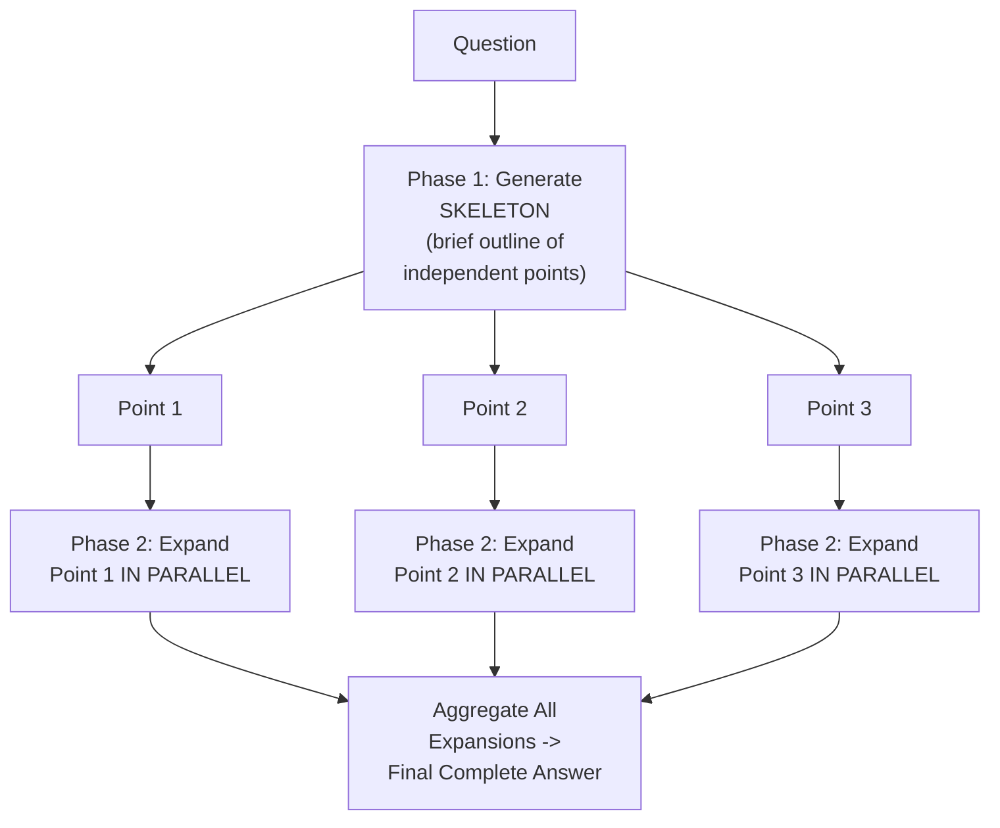
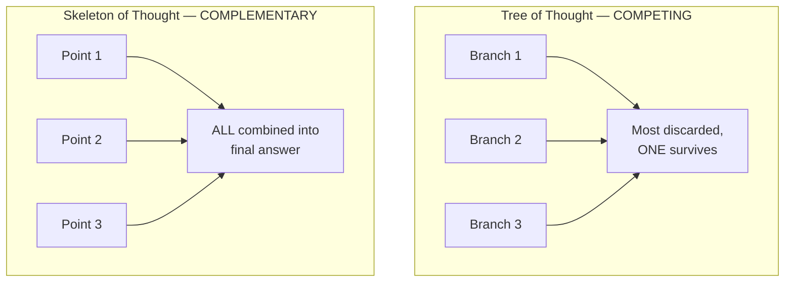

# 43 — Skeleton of Thought

> **Series:** Prompt Engineering Knowledge Library
> **File 43 of 60** | **Level:** Advanced
> **Prerequisites:** [`42_Tree_of_Thought.md`](./42_Tree_of_Thought.md)
> **Next:** [`44_Step_Back_Prompting.md`](./44_Step_Back_Prompting.md)

---

## Table of Contents

1. [Definition](#definition)
2. [Why It Matters](#why-it-matters)
3. [Core Concepts](#core-concepts)
4. [How It Works](#how-it-works)
5. [Internal Mechanism](#internal-mechanism)
6. [Types of Skeleton of Thought](#types-of-skeleton-of-thought)
7. [Syntax / Structure](#syntax--structure)
8. [Examples (Simple → Advanced)](#examples-simple--advanced)
9. [Best Practices](#best-practices)
10. [Common Mistakes](#common-mistakes)
11. [Real-World Applications](#real-world-applications)
12. [Comparison with Related Concepts](#comparison-with-related-concepts)
13. [Advantages & Limitations](#advantages--limitations)
14. [FAQs](#faqs)
15. [Summary](#summary)
16. [Cheat Sheet](#cheat-sheet)
17. [Glossary](#glossary)
18. [References](#references)
19. [Visual Diagram Gallery](#visual-diagram-gallery)

---

## Definition

**Skeleton of Thought (SoT)** is a two-phase technique that first generates a brief, high-level *skeleton* — an outline of the independent parts an answer will consist of — and then expands each skeleton point *in parallel*, rather than generating the full response sequentially from start to finish. Where [File 42 — Tree of Thought](./42_Tree_of_Thought.md) branches to explore multiple *competing* approaches for the sake of comparative quality (most branches discarded), SoT branches to expand multiple *complementary, non-competing* sections simultaneously for the sake of **speed** (every branch ultimately used) — a genuinely different goal achieved through a structurally similar-looking parallelization.

> The defining distinction: in ToT, parallel branches *compete* — only the best survives. In SoT, parallel branches *complement* — all of them are combined into the final answer. This is why SoT is fundamentally a **latency-optimization** technique, not a reasoning-quality technique in the same sense as CoT or ToT.

---

## Why It Matters

- **It directly addresses response latency**, a concern distinct from the accuracy focus of most other reasoning techniques in this library — for applications where response speed genuinely matters, SoT offers a structural approach to reducing it.
- **It exploits a specific property of many answer types**: numerous responses (list-style answers, multi-section explanations, comparisons across several items) are naturally decomposable into genuinely independent parts that don't need to be generated in strict sequential order to be individually coherent.
- **It's a clear example of a technique optimizing a different dimension than accuracy** — most of this library's reasoning techniques (CoT, ToT) target correctness; SoT specifically targets responsiveness, a valuable and distinct reminder that "better" isn't a single axis.
- **Understanding when an answer's structure is genuinely parallelizable, versus when it requires strict sequential dependency, is itself a practical skill this file develops** — misapplying SoT to a sequentially-dependent answer produces genuinely worse results, not just a wasted optimization attempt.

---

## Core Concepts

| Concept | Definition |
|---|---|
| **Skeleton** | A brief, high-level outline of the independent parts a full answer will consist of |
| **Parallel Expansion** | Generating each skeleton point's full content independently and simultaneously |
| **Point Independence** | The degree to which skeleton points can be genuinely expanded without needing each other's content |
| **Latency Reduction** | The core goal SoT optimizes for — faster overall response time |
| **Skeleton Quality** | How well the initial outline captures the answer's actual necessary structure |
| **Aggregation** | Combining the independently-expanded points back into one coherent final response |

---

## How It Works



Unlike CoT's single sequential stream or ToT's competing branches, SoT's parallel expansions are all destined for the final answer — the parallelism here is purely an efficiency mechanism, generating genuinely independent content simultaneously rather than one piece at a time.

---

## Internal Mechanism

### Why parallel expansion reduces latency specifically, not necessarily quality

Because a model generates tokens sequentially within a single continuous generation ([File 4](./04_How_LLMs_Interpret_Prompts.md)), a long, fully sequential answer takes time proportional to its total length. If an answer's content can be decomposed into genuinely independent parts — meaning expanding point 2 doesn't actually require having already generated point 1's specific content — those parts can, in an application architecture designed to support it, be generated via separate, simultaneous model calls rather than one long sequential stream, with the overall wall-clock time bounded by the *slowest single part* rather than the *sum of all parts*. This is a genuine, mechanical latency win specifically when point independence actually holds — the technique doesn't inherently improve the accuracy or quality of any individual point's content, only the total time to produce all of them together.

### Why point independence is the technique's genuine, non-negotiable prerequisite

SoT's entire benefit collapses, and can actively produce worse results, when applied to content that isn't genuinely independent — if point 3's correct content actually depends on what was decided or established in point 1 (a common situation in sequentially-dependent reasoning, narratives, or arguments that build progressively), generating point 3 in parallel without access to point 1's actual content risks inconsistency, redundancy, or outright contradiction between the independently-generated parts. This is the precise mechanical reason SoT is well suited to naturally parallel structures (a list of distinct tips, several independent sub-questions, parallel comparisons across separate items) and poorly suited to genuinely sequential ones (a step-by-step tutorial where step 3 assumes step 2's specific outcome, a narrative with developing plot, or — notably — the kind of multi-step reasoning chain-of-thought is designed for, where later steps are supposed to depend on earlier ones).

---

## Types of Skeleton of Thought

| Type | Description | Best Suited For |
|---|---|---|
| **List-Structure SoT** | Skeleton is a list of distinct, parallel items | "List 5 tips for X," where each tip is independent |
| **Multi-Question SoT** | Skeleton is a set of genuinely independent sub-questions | A compound question with unrelated parts |
| **Comparative SoT** | Skeleton is a set of items being compared, each described independently | "Compare these 4 products," where each description doesn't depend on the others |
| **Section-Based SoT** | Skeleton is a document's independent sections (e.g., separate FAQ answers) | Multi-section content where sections don't build on each other |

---

## Syntax / Structure

```text
[Phase 1 — Skeleton generation]
{{question}}

First, provide a brief skeleton: just the main points you'll 
cover, one short phrase each, no elaboration yet.
```

```text
[Phase 2 — Parallel expansion, one call per point, in an 
orchestrating application]
Expand ONLY this point into a full paragraph, without 
referencing or depending on other points: "{{skeleton_point_N}}"
```

```yaml
# Orchestrated SoT (application-level pseudocode)
skeleton = model_call(f"Generate a brief skeleton for: {question}")
points = parse_skeleton(skeleton)

# Genuinely parallel — all calls fired simultaneously
expansions = parallel_map(
    lambda point: model_call(f"Expand this point fully, 
                                independently: {point}"),
    points
)

final_answer = aggregate(skeleton, expansions)
```

---

## Examples (Simple → Advanced)

**Level 1 — Simple list-structure SoT (conceptual, single-call approximation):**
```text
List 4 tips for better sleep. First give just the 4 tip 
titles briefly, then expand each into 2 sentences.

(In a genuinely parallelized implementation, the 4 expansions 
would be 4 separate, simultaneous model calls rather than one 
sequential response — this single-call version illustrates the 
skeleton-then-expand STRUCTURE without the actual latency 
benefit, which requires application-level parallelization.)
```

**Level 2 — Multi-question SoT:**
```text
[Skeleton phase]
Break this compound question into its genuinely independent 
parts: "What's the capital of France, what's 15% of 200, and 
what year did WWII end?"
Skeleton: [capital of France] [15% of 200] [WWII end year]

[Parallel expansion phase — 3 independent, simultaneous calls, 
since none of these sub-answers depends on the others]
```

**Level 3 — Comparative SoT:**
```text
[Skeleton]
Compare these 3 products: A, B, C. Skeleton: [Product A 
overview] [Product B overview] [Product C overview]

[Parallel expansion — genuinely independent, since describing 
Product B doesn't require having already described Product A]
```

**Level 4 — Recognizing when SoT does NOT apply (sequential dependency):**
```text
[This is a POOR fit for SoT — steps are sequentially dependent]
"Explain how to debug a failing test, step by step."

Why SoT fails here: Step 3 ("check the specific assertion that 
failed") genuinely depends on Step 2's outcome ("identify 
which test failed") — these cannot be meaningfully expanded 
independently and in parallel without risking inconsistency.

-> This task needs Chain of Thought (File 41), NOT Skeleton 
   of Thought — recognizing this distinction is the core skill 
   this file develops.
```

**Level 5 — Full orchestrated SoT with latency measurement, for a genuinely suitable task:**
```yaml
Task: "Write a 5-item FAQ answering common questions about 
our return policy" (5 genuinely independent Q&A pairs)

Sequential approach (no SoT): 
  Single long generation, all 5 answers in one stream
  Measured latency: ~12 seconds

SoT approach:
  Phase 1 (skeleton): Generate the 5 question topics 
    ~1.5 seconds
  Phase 2 (parallel expansion): 5 simultaneous calls, each 
    expanding one FAQ answer independently
    Measured latency: ~3 seconds (bounded by the SLOWEST 
    single expansion, not the sum of all 5)
  Total SoT latency: ~4.5 seconds

Result: ~62% latency reduction for this genuinely 
parallelizable task, with comparable answer quality since 
point independence genuinely held (each FAQ answer doesn't 
depend on the others).
```

---

## Best Practices

1. **Verify genuine point independence before applying SoT** — per the Internal Mechanism section, this is the technique's non-negotiable prerequisite; applying it to sequentially-dependent content actively risks worse results, not just a wasted attempt.
2. **Use SoT specifically when latency, not just quality, is a genuine concern** — it's the wrong tool if accuracy/reasoning quality is the actual bottleneck, since it doesn't inherently improve individual content quality.
3. **Ensure the orchestrating application genuinely parallelizes the expansion calls** — a single sequential prompt merely structured as "skeleton then expand each" without actual parallel execution captures the outline structure but not the latency benefit.
4. **Recognize the specific task shapes well-suited to SoT** — lists, independent comparisons, multi-part questions with unrelated components — versus those requiring [Chain of Thought](./41_Chain_of_Thought.md)'s genuine sequential dependency.
5. **Measure actual latency improvement** for your specific application and infrastructure rather than assuming the theoretical benefit automatically materializes — real-world gains depend on genuine parallel execution capability.

---

## Common Mistakes

| Mistake | Consequence | Fix |
|---|---|---|
| Applying SoT to sequentially-dependent content | Inconsistency or contradiction between independently-generated parts that actually needed each other's context | Verify genuine point independence before applying SoT |
| Structuring a prompt as "skeleton then expand" without actual parallel execution | Captures the outline structure but none of the latency benefit | Ensure the orchestrating application genuinely parallelizes the expansion calls |
| Using SoT expecting a quality/accuracy improvement | SoT doesn't inherently improve individual content quality, only total generation time | Use SoT specifically for latency, other techniques (CoT, ToT) for reasoning quality |
| Confusing SoT's parallel branches with ToT's competing branches | Applying the wrong mental model — SoT's branches are complementary and all used, not competing | Keep the complementary-versus-competing distinction clear |
| Not measuring actual latency improvement in the real deployment context | Assuming a theoretical benefit that may not materialize given specific infrastructure constraints | Measure real latency gains in the actual deployment environment |

---

## Real-World Applications

- **FAQ and multi-item list generation** — a natural fit given genuine point independence between separate list items or FAQ answers.
- **Parallel content comparison tools** — comparing multiple products, options, or entities where each description is independently generatable.
- **Latency-sensitive conversational interfaces** — voice assistants or real-time chat applications where response speed directly affects user experience.
- **Multi-part compound question answering** — genuinely independent sub-questions within one user request, answerable in parallel.

---

## Comparison with Related Concepts

| Concept | Difference from "Skeleton of Thought" |
|---|---|
| **Tree of Thought (File 42)** | ToT's parallel branches *compete* for correctness, with most discarded; SoT's parallel branches *complement* each other, with all used — genuinely different goals (quality-through-comparison versus speed) despite structural similarity |
| **Chain of Thought (File 41)** | CoT's sequential structure is specifically well suited to genuinely dependent, building reasoning; SoT is specifically well suited to the opposite case — genuinely independent, non-building content |
| **Prompt Optimization (File 11)** | File 11 covers general optimization including latency as one tracked metric; SoT is a specific structural technique targeting latency directly through parallelization |

---

## Advantages & Limitations

### ✅ Advantages of Skeleton of Thought

- **Provides a genuine, structural mechanism for reducing response latency** for suitable task types.
- **Exploits real independence in many common answer structures** (lists, comparisons, multi-part questions) rather than forcing unnecessary sequential generation.
- **Clearly illustrates that "better" prompting can target dimensions other than accuracy** — a valuable, distinct perspective within this library's broader technique catalog.

### ⚠️ Limitations

- **Genuinely inapplicable, and potentially harmful, for sequentially-dependent content** — this is a hard prerequisite, not a soft preference.
- **Requires application-level orchestration to realize the actual latency benefit** — a prompt merely structured as "outline then expand" without genuine parallel execution doesn't capture SoT's real advantage.
- **Doesn't improve individual content quality or reasoning depth** — it's purely a speed optimization, not a substitute for accuracy-focused techniques when accuracy is the actual concern.

---

## FAQs

**Q: Does Skeleton of Thought make responses more accurate?**
A: Not inherently — its goal is latency reduction through parallelization, not improved reasoning quality; for accuracy-focused needs, [Chain of Thought](./41_Chain_of_Thought.md) or [Tree of Thought](./42_Tree_of_Thought.md) are the appropriate techniques.

**Q: How do I know if my task's structure genuinely supports SoT?**
A: Ask whether each part could be correctly written without having seen the other parts' specific content — if yes (a list of independent tips, separate product descriptions), SoT likely applies; if a part's correctness depends on another part's specific content (sequential steps, a developing argument), it doesn't.

**Q: Can SoT be used within a single model call, or does it require multiple calls?**
A: True latency benefit requires application-level orchestration making genuinely parallel, simultaneous calls; a single-call version that just structures the response as "skeleton, then expand each point sequentially" illustrates the conceptual structure but doesn't achieve the actual speed advantage.

**Q: Is SoT compatible with Chain of Thought within the same overall task?**
A: Yes, at different levels — a task might use SoT to parallelize genuinely independent high-level sections, while a specific section requiring multi-step reasoning uses CoT internally within its own expansion.

---

## Summary

Skeleton of Thought generates a brief outline of an answer's independent parts, then expands each part in parallel — a technique fundamentally optimizing for **latency**, not reasoning quality, distinguishing it sharply from Tree of Thought's competing, quality-focused branches despite superficial structural similarity. Its entire benefit depends on a hard, non-negotiable prerequisite — genuine point independence, where each part can be correctly generated without needing another part's specific content — making it well suited to lists, independent comparisons, and multi-part questions, and actively poorly suited to sequentially-dependent reasoning of the kind Chain of Thought is specifically designed for. Having now covered linear (CoT), branching-for-quality (ToT), and parallel-for-speed (SoT) reasoning structures, the library turns to a technique addressing a different reasoning challenge entirely — starting from the abstract before the specific: [File 44 — Step-Back Prompting](./44_Step_Back_Prompting.md).

---

## Cheat Sheet

```text
SKELETON OF THOUGHT — QUICK REFERENCE

GOAL: LATENCY reduction (not accuracy improvement)

HARD PREREQUISITE: Genuine POINT INDEPENDENCE — each part must 
be correctly generatable WITHOUT needing another part's 
specific content.

GOOD FIT: Lists, independent comparisons, multi-part 
independent questions, FAQ sections
BAD FIT: Sequential steps, developing arguments, anything 
where later content depends on earlier content -> use CoT (File 41)

REQUIRES: Application-level parallel execution to realize the 
actual latency benefit — not just a "skeleton then expand" 
PROMPT STRUCTURE alone.
```

---

## Glossary

| Term | Definition |
|---|---|
| **Skeleton** | A brief, high-level outline of an answer's independent parts |
| **Parallel Expansion** | Generating each skeleton point's content independently and simultaneously |
| **Point Independence** | The degree to which skeleton points can be expanded without needing each other |
| **Latency Reduction** | SoT's core optimization goal |
| **Skeleton Quality** | How well the initial outline captures necessary structure |
| **Aggregation** | Combining independently-expanded points into one final response |

---

## References

- Ning, X. et al. (2023) — *Skeleton-of-Thought: Large Language Models Can Do Parallel Decoding*, arXiv:2307.15337
- Yao, S. et al. (2023) — *Tree of Thoughts: Deliberate Problem Solving with Large Language Models*, arXiv:2305.10601 (structural comparison background)
- Anthropic — [Prompt Engineering Overview](https://docs.claude.com/en/docs/build-with-claude/prompt-engineering/overview)
- Wei, J. et al. (2022) — *Chain-of-Thought Prompting Elicits Reasoning in Large Language Models*, arXiv:2201.11903 (sequential-dependency contrast background)

---

## Visual Diagram Gallery

**Diagram 1 — SoT's Two-Phase Structure**
```text
PHASE 1: SKELETON            PHASE 2: PARALLEL EXPANSION
"3 tips for X"        -->    Tip 1 [expand] ┐
  -> Tip 1 title              Tip 2 [expand] ├-> ALL used ->
  -> Tip 2 title              Tip 3 [expand] ┘   Final Answer
  -> Tip 3 title              (simultaneous, independent)
```

**Diagram 2 — Competing (ToT) vs. Complementary (SoT) Branches**


**Diagram 3 — Point Independence: Good Fit vs. Bad Fit**
```text
GOOD FIT (independent):        BAD FIT (sequentially dependent):
"5 tips for X"                 "Debug this failing test,
 Tip 1: [any order,             step by step"
 Tip 2:  no dependency]         Step 2: [depends on Step 1's
 Tip 3:                                  SPECIFIC outcome]
 -> SoT works well              -> SoT fails; use CoT (File 41)
```

---

**⬅️ Previous:** [`42_Tree_of_Thought.md`](./42_Tree_of_Thought.md)
**➡️ Next:** [`44_Step_Back_Prompting.md`](./44_Step_Back_Prompting.md) — Reasoning from the abstract before the specific.
