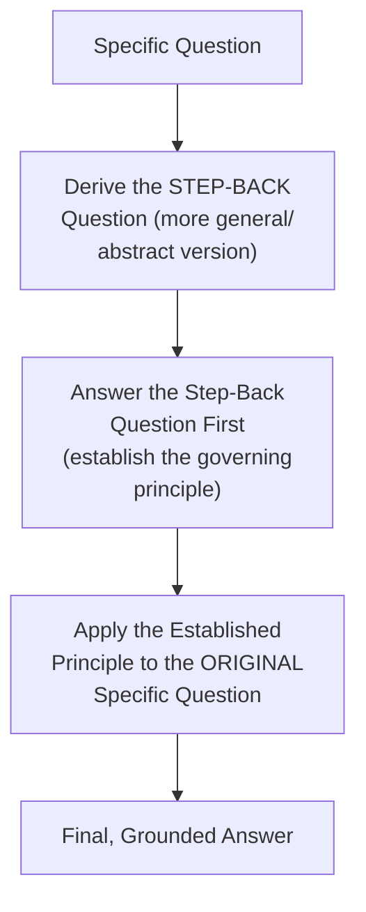
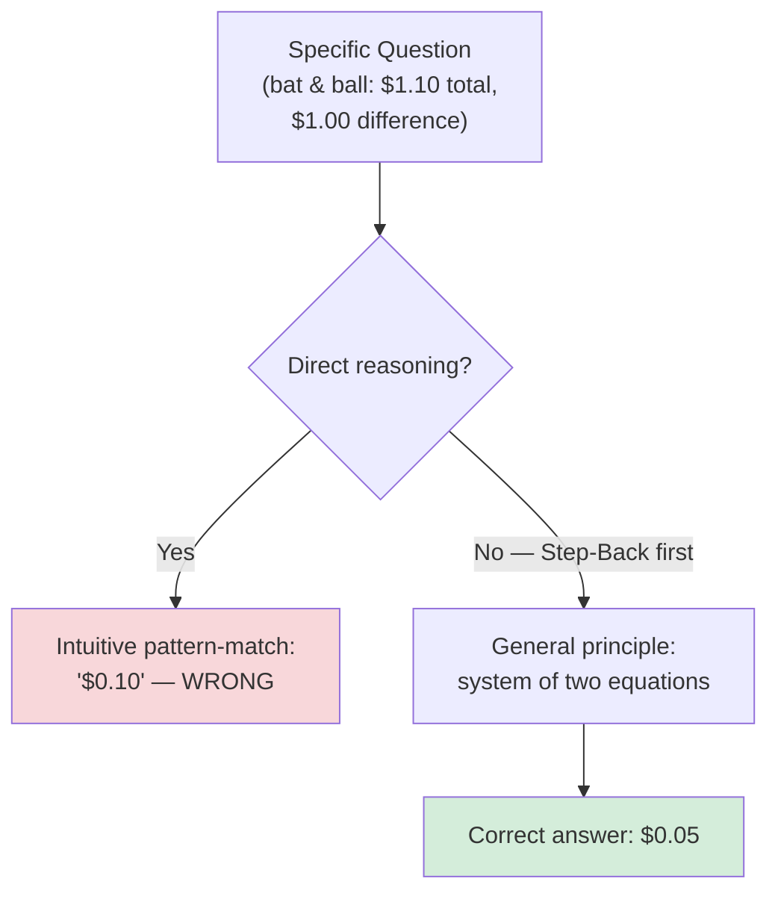
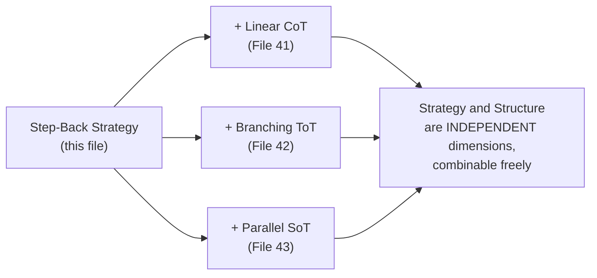

# 44 — Step-Back Prompting

> **Series:** Prompt Engineering Knowledge Library
> **File 44 of 60** | **Level:** Intermediate → Advanced
> **Prerequisites:** [`41_Chain_of_Thought.md`](./41_Chain_of_Thought.md)
> **Next:** [`45_Meta_Prompting.md`](./45_Meta_Prompting.md)

---

## Table of Contents

1. [Definition](#definition)
2. [Why It Matters](#why-it-matters)
3. [Core Concepts](#core-concepts)
4. [How It Works](#how-it-works)
5. [Internal Mechanism](#internal-mechanism)
6. [Types of Step-Back Prompting](#types-of-step-back-prompting)
7. [Syntax / Structure](#syntax--structure)
8. [Examples (Simple → Advanced)](#examples-simple--advanced)
9. [Best Practices](#best-practices)
10. [Common Mistakes](#common-mistakes)
11. [Real-World Applications](#real-world-applications)
12. [Comparison with Related Concepts](#comparison-with-related-concepts)
13. [Advantages & Limitations](#advantages--limitations)
14. [FAQs](#faqs)
15. [Summary](#summary)
16. [Cheat Sheet](#cheat-sheet)
17. [Glossary](#glossary)
18. [References](#references)
19. [Visual Diagram Gallery](#visual-diagram-gallery)

---

## Definition

**Step-Back Prompting** is the technique of first inducing a model to identify and answer a more general, abstract question or principle *before* addressing the specific question actually asked — reasoning from the general case down to the particular one, rather than attacking the specific question directly. Where [Files 41–43](./41_Chain_of_Thought.md) differ in *structure* (linear, branching, parallel), step-back prompting differs in *reasoning strategy*: it's compatible with any of those structures, but specifically addresses a different failure mode — getting lost in a specific question's surface details without first grounding the answer in the correct underlying principle.

> The core move: instead of "answer this specific question directly," step-back prompting asks "what general principle or fact governs questions like this, and once I've established that clearly, how does it apply to this specific case?"

---

## Why It Matters

- **It directly addresses a documented failure mode**: models (like humans) can sometimes get anchored on a specific question's surface-level details and produce an answer that's locally plausible but misses a broader, correct governing principle.
- **It's especially valuable for questions that are specific instances of a general rule**, where directly reasoning about the specific case risks missing or misapplying the general rule that actually determines the correct answer.
- **It's a genuinely different lever than CoT/ToT/SoT's structural choices** — this file rounds out the reasoning-elicitation family by covering *what to reason about first*, not just *how the reasoning is structured*.
- **It combines naturally with other reasoning techniques** — step-back's two-stage abstract-then-specific structure can itself use chain-of-thought within either or both stages.

---

## Core Concepts

| Concept | Definition |
|---|---|
| **Step-Back Question** | The more general, abstract question derived from the specific one |
| **Governing Principle** | The general fact, rule, or concept that determines the correct answer to the specific question |
| **Abstraction Level** | How general or specific a given question or statement is |
| **Grounding** | Establishing the correct general principle before applying it to specifics |
| **Application Step** | Using the established general principle to answer the original specific question |

---

## How It Works



The two-stage structure is the defining feature: general-question-first, specific-question-second, with the second stage explicitly building on the first rather than being answered in isolation — this is what "grounds" the specific answer in a correctly-established general principle, rather than risking an answer derived purely from the specific question's surface features.

---

## Internal Mechanism

### Why answering the general question first improves the specific answer's grounding

When a model attempts to answer a highly specific question directly, its response is conditioned primarily on that specific question's particular phrasing and surface details ([File 4 — How LLMs Interpret Prompts](./04_How_LLMs_Interpret_Prompts.md)) — this can sometimes lead the model toward an answer that's locally consistent with the specific framing but doesn't correctly incorporate a broader governing principle the question is actually an instance of. By first explicitly deriving and answering a step-back, more general question, the model generates and establishes that governing principle as explicit context — which then becomes part of what the final, specific answer is conditioned on. This is mechanistically similar to chain-of-thought's core insight (expanding the context the final answer is conditioned on, per [File 41](./41_Chain_of_Thought.md)), but specifically targeted at establishing the correct *general principle* first, rather than simply working through sequential specific steps.

### Why step-back is especially valuable for questions prone to a specific "trap" or common misconception

A specific, well-documented use case: questions where a direct, specific approach risks triggering a common misconception or a surface-level pattern-match that isn't actually correct, but where the correct governing principle — once explicitly and separately established — clearly resolves the question correctly. This is why step-back prompting shows particular value on tasks where the specific framing is, in effect, a "trap" that direct reasoning is more likely to fall into, but where explicitly stepping back to the general principle first sidesteps that trap by establishing the correct foundation before the specific question's potentially misleading framing is directly engaged.

---

## Types of Step-Back Prompting

| Type | Description | Best Suited For |
|---|---|---|
| **Principle-First Step-Back** | Steps back to a general fact or rule, then applies it | Physics, science, and rule-governed domains |
| **Category-First Step-Back** | Steps back to "what category of problem is this?" before solving | Problems where identifying the right general approach matters |
| **Definitional Step-Back** | Steps back to clarifying a key term or concept's definition first | Questions where ambiguity in a core term risks a wrong answer |
| **Historical/Contextual Step-Back** | Steps back to relevant background context before addressing the specific question | Questions embedded in a broader situation that shapes the correct answer |

---

## Syntax / Structure

```text
[Explicit two-stage step-back structure]
Original question: {{specific_question}}

Step 1: What is the general principle or broader question 
this specific question is an instance of? Answer that general 
question first.

Step 2: Now, using the principle established in Step 1, 
answer the original specific question.
```

```text
[Combined with chain-of-thought within each stage]
Step 1 (step-back): What general principle governs {{topic}}? 
Think through this carefully.

Step 2 (application): Given that principle, work through 
step by step how it applies to: {{specific_question}}
```

---

## Examples (Simple → Advanced)

**Level 1 — Basic step-back for a physics-style question:**
```text
Specific question: "If a ball is thrown at a 45-degree angle 
at sea level with no air resistance, at what other angle would 
it achieve the same range?"

Step-back question: "What general principle governs 
projectile range as a function of launch angle?"
[Answer: range is proportional to sin(2θ), which is 
symmetric around 45°]

Applied to specific question: [Using that principle, the 
answer follows directly]
```

**Level 2 — Category-first step-back:**
```text
Specific question: "A company's revenue grew 20% but profit 
fell 5%. What might explain this?"

Step-back question: "What general category of business 
situations produces revenue growth alongside profit decline?"
[Answer: typically rising costs outpacing revenue growth — 
e.g., increased COGS, marketing spend, or reduced margins]

Applied: [Now reason about which of these general categories 
specifically fits the scenario described]
```

**Level 3 — Definitional step-back resolving ambiguity:**
```text
Specific question: "Is a tomato a vegetable?"

Step-back question: "What's the distinction between the 
botanical and culinary definitions of 'vegetable' and 'fruit'?"
[Answer: botanically, a tomato is a fruit (seed-bearing 
structure from a flower); culinarily, it's treated as a 
vegetable due to flavor profile and usage]

Applied: [The specific answer now correctly addresses BOTH 
senses, rather than picking one definition without 
acknowledging the ambiguity that made the question tricky]
```

**Level 4 — Step-back combined with chain-of-thought in both stages:**
```text
Specific question: {{complex_word_problem}}

Step 1 (step-back, with CoT): What general type of math 
problem is this (e.g., rate problem, ratio problem, 
optimization)? Reason through what category fits and why.

Step 2 (application, with CoT): Using the identified problem 
type's standard approach, work through this specific problem 
step by step to reach a final answer.
```

**Level 5 — Full step-back for a "trap" question with a common misconception:**
```text
Specific question: "A bat and a ball cost $1.10 together. The 
bat costs $1.00 more than the ball. How much does the ball cost?"

[This question is a well-known "trap" — the intuitive, direct 
answer ($0.10) is WRONG; the correct answer requires algebra.]

Step-back question: "What general principle applies when a 
total and a difference between two quantities are both given?"
[Answer: This requires setting up two equations — let ball = x, 
then bat = x + 1.00, and x + (x + 1.00) = 1.10]

Applied: 2x + 1.00 = 1.10 -> 2x = 0.10 -> x = 0.05
Final answer: The ball costs $0.05 (NOT the intuitive-but-
wrong $0.10)

-> By stepping back to the general algebraic principle FIRST, 
   the reasoning avoids the common intuitive trap that direct, 
   unstructured reasoning about the specific numbers often 
   falls into.
```

---

## Best Practices

1. **Use step-back specifically for questions that are instances of a general rule**, where directly reasoning about the specific case risks missing or misapplying that rule.
2. **Explicitly separate the two stages** — deriving and answering the general question, then applying it — rather than blending them, since the explicit separation is what provides the grounding benefit.
3. **Combine step-back with chain-of-thought within either or both stages** ([File 41](./41_Chain_of_Thought.md)) when the general or specific reasoning itself has multiple steps.
4. **Watch specifically for "trap" questions** with well-known intuitive misconceptions (Level 5's example) — step-back is particularly well suited to sidestepping these.
5. **Test whether step-back genuinely improves accuracy** for your specific task type ([File 14 — Prompt Testing](./14_Prompt_Testing.md)) — like other reasoning techniques, it's not universally beneficial and adds response length/cost that should be justified by the task's actual need.

---

## Common Mistakes

| Mistake | Consequence | Fix |
|---|---|---|
| Applying step-back to questions with no meaningful general principle to establish | Unnecessary added complexity with little corresponding benefit | Reserve step-back for questions that are genuine instances of a general rule |
| Blending the general and specific reasoning together rather than separating them | Loses the explicit grounding benefit the two-stage structure provides | Keep the step-back and application stages explicitly, separately structured |
| Deriving an incorrect or poorly-chosen step-back question | The entire specific answer inherits the flawed foundation | Ensure the step-back question genuinely captures the relevant governing principle |
| Not recognizing "trap" questions where step-back is especially valuable | Missing the technique's strongest, most differentiated use case | Watch for questions with well-known intuitive misconceptions |
| Using step-back reflexively on every question regardless of fit | Added cost and complexity without corresponding benefit for questions that don't need it | Match step-back use to questions that are genuine instances of a broader principle |

---

## Real-World Applications

- **Educational and tutoring applications** — explicitly modeling "what's the general concept here" before applying it to a specific problem mirrors effective pedagogical practice.
- **Domains prone to well-known misconceptions or "trick" questions** — physics, probability, and certain logic puzzle categories where direct, unreflective reasoning is documented to fall into predictable traps.
- **Business and strategic analysis** — stepping back to "what category of situation is this" before diving into specific tactical recommendations.
- **Legal and policy reasoning** — establishing the general governing rule or precedent before applying it to a specific case's particular facts.

---

## Comparison with Related Concepts

| Concept | Difference from "Step-Back Prompting" |
|---|---|
| **Chain of Thought (File 41)** | CoT is about reasoning *structure* (linear, sequential steps); step-back is about reasoning *strategy* (general-before-specific) — the two are compatible and often combined, addressing different aspects of the reasoning process |
| **Tree of Thought (File 42)** | ToT explores multiple competing specific approaches; step-back establishes a single general principle first, then applies it — different mechanisms for different failure modes (dead-end/error propagation versus missing the governing principle) |
| **Meta-Prompting (File 45)** | Meta-prompting concerns prompts *about* prompting itself (generating, critiquing, improving other prompts); step-back is a reasoning strategy applied *within* answering a single question — a different scope entirely |

---

## Advantages & Limitations

### ✅ Advantages of Step-Back Prompting

- **Directly addresses the documented failure mode of missing a governing principle** when reasoning too close to a specific question's surface details.
- **Particularly effective for "trap" questions** with well-known intuitive misconceptions.
- **Combines naturally with other reasoning techniques** (chain-of-thought within either stage) rather than being mutually exclusive with them.

### ⚠️ Limitations

- **Not beneficial for questions without a meaningful general principle to establish** — adds unnecessary length and cost for straightforward, non-principle-dependent questions.
- **The technique's benefit depends entirely on correctly deriving the right step-back question** — an poorly-chosen or incorrect general question undermines the entire approach.
- **Adds response length and cost**, a trade-off that should be justified by genuine accuracy benefit for the specific task type, tested rather than assumed.

---

## FAQs

**Q: How is step-back prompting different from just asking a model to "think about the general principle first"?**
A: That instruction, applied clearly and explicitly, essentially *is* step-back prompting — the technique's substance is precisely this deliberate, two-stage general-then-specific structure, whether achieved through a single well-crafted instruction or a more elaborate multi-step prompt.

**Q: Is step-back prompting only useful for math and science questions?**
A: No — while quantitative/rule-governed domains are a natural fit (Level 1, Level 5), the underlying principle (establish the general category or governing concept before addressing specifics) applies broadly, including business analysis, legal reasoning, and definitional questions (Level 2, Level 3).

**Q: Can step-back prompting be combined with Tree of Thought?**
A: Yes, conceptually — one could apply step-back to first establish a general principle, then use ToT to explore multiple specific approaches for applying that principle, combining a reasoning-strategy technique with a reasoning-structure technique.

**Q: How do I know if a question is a good candidate for step-back prompting?**
A: Ask whether the question is a specific instance of a broader rule or principle, and whether directly reasoning about the specific details risks missing or misapplying that principle — if both are true, step-back is likely to help; for genuinely simple, principle-independent questions, it typically isn't necessary.

---

## Summary

Step-Back Prompting establishes a general, abstract governing principle *before* addressing a specific question, explicitly separating the two stages so the specific answer is grounded in a correctly-established general foundation rather than derived purely from the specific question's potentially misleading surface details — a reasoning *strategy*, distinct from the reasoning *structures* (linear, branching, parallel) covered in [Files 41–43](./41_Chain_of_Thought.md), and fully compatible with combining alongside them. It's especially valuable for questions that are genuine instances of a broader rule and particularly for well-documented "trap" questions where direct, unreflective reasoning is prone to a predictable misconception. Having now completed the full reasoning-elicitation family — linear, branching, parallel, and abstraction-first — the library turns to a different kind of technique entirely: using prompts to generate, critique, or improve other prompts, beginning with [File 45 — Meta-Prompting](./45_Meta_Prompting.md).

---

## Cheat Sheet

```text
STEP-BACK PROMPTING — QUICK REFERENCE

THE TWO-STAGE STRUCTURE
1. Derive the STEP-BACK question (the general principle 
   this specific question is an instance of)
2. Answer the step-back question FIRST
3. APPLY that established principle to the original specific question

BEST FIT: Questions that are instances of a broader rule, 
especially "trap" questions with well-known intuitive 
misconceptions.

COMBINES WITH: Chain of Thought (File 41) within either stage 
— step-back is a STRATEGY, not a competing STRUCTURE.
```

---

## Glossary

| Term | Definition |
|---|---|
| **Step-Back Question** | The more general, abstract question derived from the specific one |
| **Governing Principle** | The general fact or rule that determines the correct specific answer |
| **Abstraction Level** | How general or specific a question or statement is |
| **Grounding** | Establishing the correct general principle before applying it |
| **Application Step** | Using the established principle to answer the original question |

---

## References

- Zheng, H. et al. (2023) — *Take a Step Back: Evoking Reasoning via Abstraction in Large Language Models*, arXiv:2310.06117
- Kahneman, D. — *Thinking, Fast and Slow* (System 1/System 2 background on intuitive-trap questions)
- Wei, J. et al. (2022) — *Chain-of-Thought Prompting Elicits Reasoning in Large Language Models*, arXiv:2201.11903
- Frederick, S. (2005) — *Cognitive Reflection and Decision Making* (bat-and-ball problem origin)

---

## Visual Diagram Gallery

**Diagram 1 — The Two-Stage Step-Back Structure**
```text
SPECIFIC QUESTION
       |
       v
STEP-BACK QUESTION (more general)
       |
       v
ANSWER the step-back question FIRST
(establishes the governing principle)
       |
       v
APPLY that principle to the ORIGINAL specific question
       |
       v
FINAL, GROUNDED ANSWER
```

**Diagram 2 — Why Direct Reasoning Falls Into "Traps"**


**Diagram 3 — Step-Back as Strategy, Compatible with Any Structure (Files 41-43)**


---

**⬅️ Previous:** [`43_Skeleton_of_Thought.md`](./43_Skeleton_of_Thought.md)
**➡️ Next:** [`45_Meta_Prompting.md`](./45_Meta_Prompting.md) — Using prompts to generate, critique, or improve other prompts.
