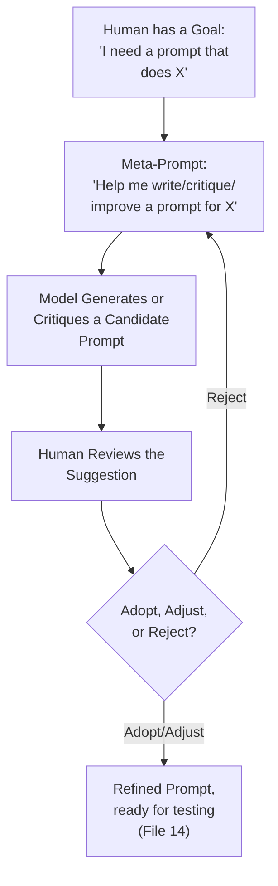
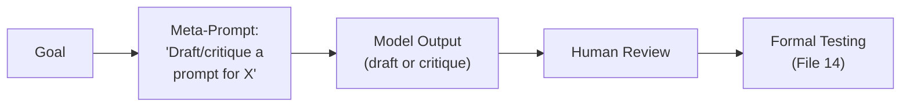
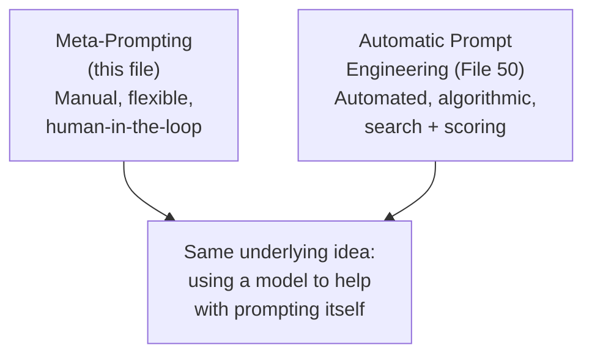

# 45 — Meta-Prompting

> **Series:** Prompt Engineering Knowledge Library
> **File 45 of 60** | **Level:** Advanced
> **Prerequisites:** [`44_Step_Back_Prompting.md`](./44_Step_Back_Prompting.md), [`12_Prompt_Refinement.md`](./12_Prompt_Refinement.md)
> **Next:** [`46_Self_Consistency.md`](./46_Self_Consistency.md)

---

## Table of Contents

1. [Definition](#definition)
2. [Why It Matters](#why-it-matters)
3. [Core Concepts](#core-concepts)
4. [How It Works](#how-it-works)
5. [Internal Mechanism](#internal-mechanism)
6. [Types of Meta-Prompting](#types-of-meta-prompting)
7. [Syntax / Structure](#syntax--structure)
8. [Examples (Simple → Advanced)](#examples-simple--advanced)
9. [Best Practices](#best-practices)
10. [Common Mistakes](#common-mistakes)
11. [Real-World Applications](#real-world-applications)
12. [Comparison with Related Concepts](#comparison-with-related-concepts)
13. [Advantages & Limitations](#advantages--limitations)
14. [FAQs](#faqs)
15. [Summary](#summary)
16. [Cheat Sheet](#cheat-sheet)
17. [Glossary](#glossary)
18. [References](#references)
19. [Visual Diagram Gallery](#visual-diagram-gallery)

---

## Definition

**Meta-Prompting** is the general technique of using a model, via prompts, to generate, critique, transform, or improve *other prompts* — turning the model's own language capability toward the task of prompting itself, rather than toward a typical end-user task. This is a manually-assisted, flexible, general concept: a human might ask a model to draft a first attempt at a prompt, review an existing prompt for weaknesses, or rewrite a prompt for clarity. It's distinguished from [File 50 — Automatic Prompt Engineering](./50_Automatic_Prompt_Engineering.md), which covers the *specific, automated, systematic* version of this same underlying idea — a defined algorithmic pipeline with search and scoring, typically requiring no manual back-and-forth once configured.

> The core reframe meta-prompting introduces: instead of the model being asked "solve this task," it's asked "help me write, fix, or improve the prompt that will later ask a model to solve this task" — a genuinely different, one-level-removed kind of request.

---

## Why It Matters

- **It directly leverages the model's own demonstrated understanding of what makes prompts effective** — a model trained on vast amounts of text about language, instruction, and communication is often a genuinely useful assistant for the specific task of writing better prompts.
- **It can meaningfully accelerate the drafting and refinement stages** of the prompt lifecycle ([File 7](./07_Prompt_Lifecycle.md)) and workflow ([File 8](./08_Prompt_Workflow.md)), providing a fast first pass or a second opinion.
- **It provides a genuinely useful critique perspective** — asking a model to identify ambiguities, missing constraints, or unclear instructions in an existing prompt often surfaces issues a human author, too close to their own writing, might miss (connecting to [File 12 — Prompt Refinement](./12_Prompt_Refinement.md)'s fresh-eyes-review practice).
- **It's the conceptual foundation [File 50](./50_Automatic_Prompt_Engineering.md) builds on and automates** — understanding meta-prompting's manual, flexible form well is what makes the automated version's value and limitations legible.

---

## Core Concepts

| Concept | Definition |
|---|---|
| **Prompt Generation** | Using a model to draft an initial prompt for a stated goal |
| **Prompt Critique** | Using a model to identify weaknesses or ambiguities in an existing prompt |
| **Prompt Transformation** | Using a model to rewrite a prompt for a different purpose, tone, or constraint set |
| **Meta-Level Request** | A request about prompting itself, one level removed from an ordinary end-user task |
| **Self-Referential Risk** | The specific risk of a model's critique of a prompt containing the same kind of blind spots that produced the original prompt |
| **Human-in-the-Loop Meta-Prompting** | Meta-prompting where a human reviews and decides on the model's suggestions, as opposed to fully automated adoption |

---

## How It Works



The critical structural feature distinguishing this from the automated version ([File 50](./50_Automatic_Prompt_Engineering.md)) is the human review step — meta-prompting, as covered here, is fundamentally a human-in-the-loop, assistive process, not a closed, autonomous pipeline.

---

## Internal Mechanism

### Why a model can meaningfully critique prompts despite not being the one that will ultimately run them

It might seem odd that a model can usefully critique a prompt's clarity or completeness without being the specific model instance that will later execute it — but this is well explained by [File 9 — Prompt Design Principles](./09_Prompt_Design_Principles.md)'s framing of clarity, specificity, and consistency as largely model-agnostic qualities. A model asked to critique a prompt is, in effect, applying its general language understanding to check the prompt against these durable, transferable principles — "is this instruction ambiguous," "does this leave the output format unspecified," "do these two constraints conflict" — questions answerable through general language competence rather than requiring the critiquing model to actually be the execution model. This is precisely why meta-prompting can add genuine value even when critique and execution happen on different model instances or even different providers.

### Why self-referential risk is a genuine, distinct limitation worth naming explicitly

A specific, important caution: if a prompt's original weakness stemmed from a blind spot the author shared with common patterns in training data (a widely-used but subtly flawed phrasing convention, for instance), a model critiquing that prompt — itself shaped by similar training data — has some genuine risk of sharing that same blind spot, and therefore failing to flag the actual weakness. This is mechanistically different from, and not fully solved by, simply asking a model to "check for problems" — the critique is still generated by a system with its own learned patterns and potential shared blind spots, not an independent, external ground truth. This is precisely why meta-prompting's value is best understood as a *strong, fast first pass or second opinion*, not a substitute for the more rigorous testing and evaluation practices ([Files 14–15](./14_Prompt_Testing.md)) that provide genuinely independent verification.

---

## Types of Meta-Prompting

| Type | Description | Best Suited For |
|---|---|---|
| **Generative Meta-Prompting** | Asking a model to draft a first-attempt prompt from a stated goal | Quickly producing a baseline draft to iterate on |
| **Critique Meta-Prompting** | Asking a model to identify weaknesses in an existing prompt | Fresh-eyes review, catching author blind spots |
| **Transformation Meta-Prompting** | Asking a model to adapt an existing prompt for a new constraint, audience, or purpose | Repurposing a working prompt for a related but distinct need |
| **Explanation Meta-Prompting** | Asking a model to explain why a prompt might be producing a specific observed behavior | Diagnostic support during debugging ([File 13](./13_Prompt_Debugging.md)) |

---

## Syntax / Structure

```text
[Generative meta-prompting]
I need a prompt that asks a model to summarize customer 
support tickets into 3 key themes. Draft a first-attempt 
prompt for this task, including appropriate constraints and 
output format.
```

```text
[Critique meta-prompting]
Review the following prompt for ambiguity, missing 
constraints, or unclear instructions. List specific issues 
you find:

"{{existing_prompt_text}}"
```

```text
[Transformation meta-prompting]
Here's a prompt originally designed for formal business email 
summaries: "{{existing_prompt}}"

Adapt this same prompt for casual internal Slack message 
summaries instead — same core task, different tone and format 
requirements.
```

---

## Examples (Simple → Advanced)

**Level 1 — Basic generative meta-prompting:**
```text
Draft a prompt that asks a model to translate English text 
into formal Spanish.
```

**Level 2 — Critique meta-prompting on a simple existing prompt:**
```text
Here's my prompt: "Summarize this." Is this prompt clear and 
specific enough? What might I be missing?
```

**Level 3 — Iterative meta-prompting cycle:**
```text
[Round 1] "Draft a prompt for extracting action items from 
meeting notes."
[Model drafts a first attempt]
[Round 2] "Now critique your own draft — what's ambiguous or 
could be more specific?"
[Model identifies: no format specified, no handling for notes 
with zero action items]
[Round 3] "Revise the draft to address those two gaps."
```

**Level 4 — Critique meta-prompting connected to observed failures:**
```text
This prompt is producing inconsistent output length despite 
asking for "a brief summary": "{{prompt_text}}"

Given this specific observed problem, what about the prompt's 
current wording might be causing it, and how would you fix 
that specific issue?
```

**Level 5 — Full meta-prompting cycle feeding into formal testing, with self-referential risk acknowledged:**
```text
[Generative + Critique combined]
Draft a prompt for classifying support tickets by urgency 
(low/medium/high). Then, critique your own draft specifically 
for: (1) whether the urgency criteria are concrete and 
checkable, (2) whether edge cases (e.g., no clear urgency 
signal) are handled, (3) whether the output format is fully 
specified.

[Human review step — NOT automatically trusted, per the 
Internal Mechanism section's self-referential risk caution]
Human reviews both the draft and the self-critique, 
independently checks whether the critique itself seems 
complete, and decides what to adopt.

[Final step]
Adopted, human-refined prompt proceeds to FORMAL testing 
(File 14) against a real, representative test set — meta-
prompting's critique was a fast first pass, not a substitute 
for this independent verification step.
```

---

## Best Practices

1. **Treat meta-prompting output as a fast first pass or second opinion, not a final, trusted verdict** — per the Internal Mechanism section's self-referential risk, always maintain human review and independent testing.
2. **Use critique meta-prompting specifically to catch author blind spots**, complementing (not replacing) the fresh-eyes review practice from [File 12 — Prompt Refinement](./12_Prompt_Refinement.md).
3. **Connect meta-prompting critique to specific, observed failures when available** (Level 4) — this grounds the critique in real evidence rather than purely speculative review.
4. **Always route a meta-prompting-assisted draft through formal testing** ([File 14](./14_Prompt_Testing.md)) before trusting it for real use — meta-prompting accelerates drafting, it doesn't substitute for validation.
5. **Iterate through generate-critique-revise cycles** (Level 3) rather than accepting a first draft uncritically, leveraging the model's own capability at each stage.

---

## Common Mistakes

| Mistake | Consequence | Fix |
|---|---|---|
| Trusting a meta-prompting critique as a complete, final verdict | Missing the self-referential risk — shared blind spots between the critiquing model and common training patterns | Treat critique as a fast first pass, maintain human review and independent testing |
| Skipping formal testing for a meta-prompting-assisted draft | Unvalidated prompt deployed based only on the model's own self-assessment | Always route through formal testing (File 14) regardless of how the draft was produced |
| Using meta-prompting without connecting it to observed, real failures | Purely speculative critique, potentially missing the actual issue | Ground critique in specific, observed problems when available |
| Treating meta-prompting as fundamentally different from, rather than complementary to, human review practices | Missing the opportunity to combine both for stronger results | Use meta-prompting alongside, not instead of, fresh-eyes human review |
| Accepting a first-draft generation without an iterative critique-revise cycle | Missing readily available further improvement | Iterate through generate-critique-revise, not just single-pass generation |

---

## Real-World Applications

- **Rapid prompt drafting for new tasks** — generating a solid first attempt quickly, to be refined and tested rather than written entirely from scratch.
- **Prompt review processes** — using critique meta-prompting as one input (alongside human review) in a team's prompt QA process.
- **Debugging support** — explanation meta-prompting can help generate hypotheses about why a specific prompt is producing an observed, unwanted behavior, feeding into formal debugging ([File 13](./13_Prompt_Debugging.md)).
- **Adapting existing prompts for new contexts** — transformation meta-prompting speeds up repurposing a working prompt for a related but distinct need.

---

## Comparison with Related Concepts

| Concept | Difference from "Meta-Prompting" |
|---|---|
| **Automatic Prompt Engineering (File 50)** | Meta-prompting is the general, flexible, human-in-the-loop concept; APE is the specific, automated, algorithmic pipeline version of this same underlying idea, typically requiring no manual back-and-forth once configured |
| **Prompt Refinement (File 12)** | Refinement is the general discipline of qualitative prompt polishing, which may or may not involve asking a model for help; meta-prompting specifically means using a model itself as part of that refinement process |
| **Prompt Debugging (File 13)** | Debugging is the general, systematic process of diagnosing a known failure; meta-prompting's explanation type can be one specific tool used within that broader debugging process, not a replacement for its full methodology |

---

## Advantages & Limitations

### ✅ Advantages of Meta-Prompting

- **Accelerates drafting and refinement**, leveraging the model's own language capability for a fast first pass.
- **Provides a genuinely useful critique perspective**, often catching author blind spots effectively.
- **Flexible and easily applied** within ordinary prompting workflows, without requiring specialized automated infrastructure.

### ⚠️ Limitations

- **Carries genuine self-referential risk** — the critiquing model may share blind spots with common patterns that produced the original prompt's weakness.
- **Not a substitute for independent, formal testing** ([File 14](./14_Prompt_Testing.md)) — meta-prompting's critique is itself an unvalidated opinion until tested against real evidence.
- **Quality of meta-prompting output varies** with how well the meta-prompt itself is constructed — a vague "is this good?" request produces less useful critique than a specific, targeted one.

---

## FAQs

**Q: Can I fully trust a model's critique of its own or another prompt?**
A: Not as a final, complete verdict — per the Internal Mechanism section's self-referential risk, treat it as a valuable but non-independent first pass, always followed by human review and formal testing.

**Q: Is meta-prompting the same as asking a model to "grade" a prompt?**
A: Related — grading/scoring is one specific form of critique meta-prompting, closely connected to the LLM-as-judge practices covered in [File 15 — Prompt Evaluation](./15_Prompt_Evaluation.md), which itself requires validation against human judgment before being trusted at scale.

**Q: How is meta-prompting different from just asking a model to "write a good prompt for X"?**
A: That IS a basic form of meta-prompting (generative type) — the file's broader coverage extends this same idea to critique, transformation, and explanation, and adds the important caveats about self-referential risk and the need for independent validation.

**Q: Should meta-prompting critique replace a human colleague's fresh-eyes review?**
A: No — they're complementary, not substitutes; a model's critique and a human colleague's fresh-eyes review ([File 12](./12_Prompt_Refinement.md)) catch different kinds of issues and are both valuable together.

---

## Summary

Meta-Prompting uses a model, via prompts, to generate, critique, transform, or explain other prompts — a flexible, human-in-the-loop technique that leverages the model's own demonstrated language competence to accelerate drafting and surface author blind spots, distinguished from [File 50](./50_Automatic_Prompt_Engineering.md)'s fully automated, algorithmic version of the same underlying idea. Its genuine value comes with an equally genuine caution: self-referential risk means a critiquing model may share the same blind spots that produced an original prompt's weakness, which is precisely why meta-prompting output should be treated as a fast first pass or second opinion, always followed by human review and independent, formal testing rather than trusted as a final verdict. Having covered this general, manual-assisted concept, the library turns next to a different technique addressing reasoning reliability through multiple independent attempts: [File 46 — Self-Consistency](./46_Self_Consistency.md).

---

## Cheat Sheet

```text
META-PROMPTING — QUICK REFERENCE

TYPES
Generative     -> draft a first-attempt prompt from a goal
Critique       -> identify weaknesses in an existing prompt
Transformation -> adapt a prompt for a new purpose/constraint
Explanation    -> hypothesize why a prompt produces observed behavior

GOLDEN RULE: Treat output as a FAST FIRST PASS, never a final 
verdict — self-referential risk means the critiquing model may 
share blind spots with the original prompt's weakness.

ALWAYS FOLLOW WITH: Human review + formal testing (File 14) 
before trusting a meta-prompting-assisted draft for real use.
```

---

## Glossary

| Term | Definition |
|---|---|
| **Prompt Generation** | Using a model to draft an initial prompt |
| **Prompt Critique** | Using a model to identify weaknesses in an existing prompt |
| **Prompt Transformation** | Using a model to adapt a prompt for a new purpose |
| **Meta-Level Request** | A request about prompting itself, one level removed from an end-user task |
| **Self-Referential Risk** | The risk of shared blind spots between critiquing and original prompt |
| **Human-in-the-Loop Meta-Prompting** | Meta-prompting where a human reviews and decides on suggestions |

---

## References

- Reynolds, L. & McDonell, K. (2021) — *Prompt Programming for Large Language Models: Beyond the Few-Shot Paradigm*, arXiv:2102.07350
- Zhou, Y. et al. (2022) — *Large Language Models Are Human-Level Prompt Engineers*, arXiv:2211.01910
- Anthropic — [Prompt Engineering Overview](https://docs.claude.com/en/docs/build-with-claude/prompt-engineering/overview)
- Suzgun, M. & Kalai, A. (2024) — *Meta-Prompting: Enhancing Language Models with Task-Agnostic Scaffolding*, arXiv:2401.12954

---

## Visual Diagram Gallery

**Diagram 1 — The Meta-Prompting Cycle**


**Diagram 2 — Self-Referential Risk (why critique isn't independent verification)**
```text
Original Prompt's Weakness  <-- shares training-data-derived
       |                         blind spots with -->
       v
Critiquing Model's Assessment
       |
       v
RISK: The critique may MISS the same weakness, because 
both are shaped by similar learned patterns.

MITIGATION: Independent, formal testing (File 14) — evidence 
from actual runs, not another model's opinion.
```

**Diagram 3 — Meta-Prompting vs. Automatic Prompt Engineering**


---

**⬅️ Previous:** [`44_Step_Back_Prompting.md`](./44_Step_Back_Prompting.md)
**➡️ Next:** [`46_Self_Consistency.md`](./46_Self_Consistency.md) — Improving reasoning reliability through multiple independent attempts.
